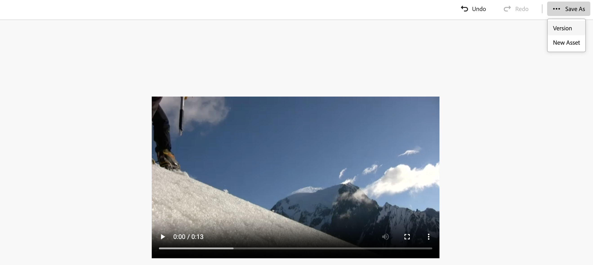
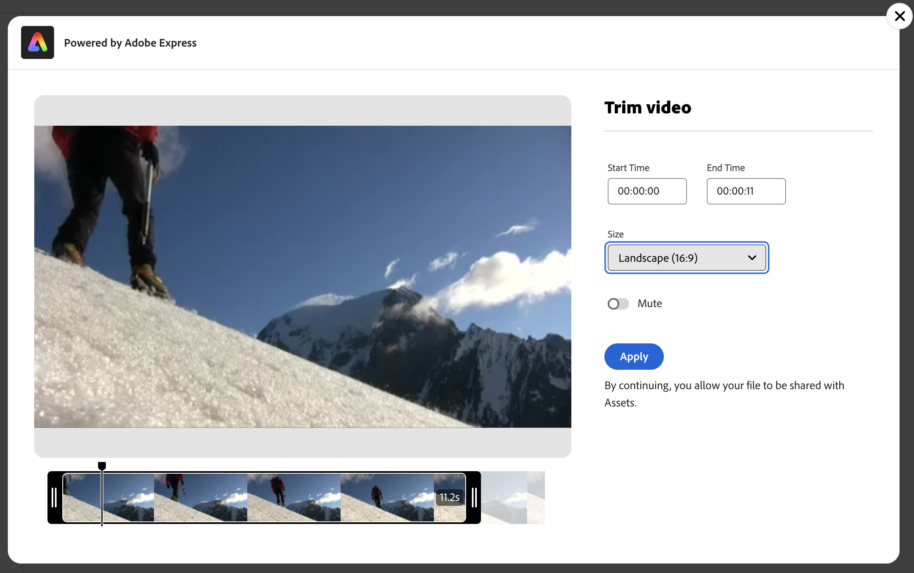

# Bearbeiten von Videos in [!DNL Assets view] {#edit-videos}

<table>
    <tr>
        <td>
            <i>Neu</i> <a href="/help/assets/dynamic-media/dm-prime-ultimate.md"><b>Dynamic Media Prime und Ultimate</b></a>
        </td>
        <td>
            <i>Neu</i> <a href="/help/assets/assets-ultimate-overview.md"><b>AEM Assets Ultimate</b></a>
        </td>
        <td>
            <i>Neu</i> <a href="/help/assets/integrate-aem-assets-edge-delivery-services.md"><b>AEM Assets-Integration mit Edge Delivery Services</b></a>
        </td>
        <td>
            <i>Neu</i> <a href="/help/assets/aem-assets-view-ui-extensibility.md"><b>Erweiterbarkeit der Benutzeroberfläche</b></a>
        </td>
          <td>
            <i>Neu</i> <a href="/help/assets/dynamic-media/enable-dynamic-media-prime-and-ultimate.md"><b>Aktivieren von Dynamic Media Prime und Ultimate</b></a>
        </td>
    </tr>
    <tr>
        <td>
            <a href="/help/assets/search-best-practices.md"><b>Best Practices für die Suche</b></a>
        </td>
        <td>
            <a href="/help/assets/metadata-best-practices.md"><b>Best Practices für Metadaten</b></a>
        </td>
        <td>
            <a href="/help/assets/product-overview.md"><b>Content Hub</b></a>
        </td>
        <td>
            <a href="/help/assets/dynamic-media-open-apis-overview.md"><b>Dynamic Media mit OpenAPI-Funktionen</b></a>
        </td>
        <td>
            <a href="https://developer.adobe.com/experience-cloud/experience-manager-apis/"><b>Entwicklerdokumentation zu AEM Assets</b></a>
        </td>
    </tr>
</table>

Assets-Benutzende können Varianten von Videoinhalten ganz einfach mit den eingebetteten [!DNL Adobe Express]-Schnellaktionen für Videos erstellen. Schnellaktionen in [!DNL Assets view] auf Basis von [!DNL Adobe Express] bieten benutzerfreundliche Optionen zur Videobearbeitung, einschließlich dem Zuschneiden, Ändern der Größe, Zuschneiden und Konvertieren von Videos in GIF.

Navigieren Sie zum Bearbeiten eines Videos zu den Details des Videos und klicken Sie auf [!UICONTROL Video bearbeiten]. Wählen Sie alternativ das Asset aus, klicken Sie auf „Details“ und klicken Sie anschließend im rechten Bereich auf das Symbol . Nachdem Sie ein Video bearbeitet haben, können Sie das neue Video als neue Version oder als neues Asset speichern.

## Voraussetzungen {#prerequisites}

Es sind Berechtigungen für den Zugriff auf [!DNL Adobe Express] und mindestens eine Umgebung in AEM Assets erforderlich. Bei der Umgebung kann es sich um eines der Repositorys in [!DNL Assets as a Cloud Service] oder [!DNL Assets view] handeln.

## Bearbeiten von Videos mit Adobe Express {#edit-video-using-express}

Das Umwandeln eines Videos in eine perfekte Größe und Ausrichtung gelingt mit den eingebetteten Schnellaktionen von [!DNL Adobe Express] ganz leicht.

### Zuschneiden eines Videos {#crop-video-using-express}

Mit den eingebetteten Schnellaktionen von [!DNL Adobe Express] können Sie unerwünschte Teile aus dem Video entfernen. Führen Sie hierzu die folgenden Schritte aus:

1. Wählen Sie ein Videos aus und klicken Sie auf **[!UICONTROL Bearbeiten]**.
2. Klicken Sie in den Schnellaktionen im linken Bereich auf **[!UICONTROL Video zuschneiden]**.
3. Ziehen Sie die Griffe an den Ecken des Videos, um den gewünschten Zuschnitt zu erstellen, oder wählen Sie nach Bedarf eine der vorhandenen Bildschirmgrößen aus.
4. Sie können das Video stummschalten oder die Stummschaltung aufheben.
5. Klicken Sie auf **[!UICONTROL Übernehmen]**.
   

   Das zugeschnittene Video kann heruntergeladen werden. Sie können das bearbeitete Asset entweder als neue Version desselben Assets oder als neues Asset speichern. 

### Anpassen der Videogröße {#resize-video-using-express}

Die Größe des endgültigen Videoinhalts im DAM muss für die Verteilung an bestimmte Kanäle oft geändert werden. Mit [!DNL Assets view] können Sie die Größe des Videos einfach an die für gängige soziale Kanäle erforderlichen Dimensionen anpassen. Anpassungen der Größe an benutzerdefinierte Auflösungen sind ebenfalls möglich. Um die Videogröße mit [!DNL Assets view] zu ändern, führen Sie die folgenden Schritte aus:

1. Wählen Sie ein Video aus und klicken Sie dann auf **[!UICONTROL Bearbeiten]**.
2. Klicken Sie in den Schnellaktionen im linken Bereich auf **[!UICONTROL Videogröße anpassen]**.
3. Wählen Sie die entsprechenden Dimensionen der Social Media-Plattform unter der Dropdown-Liste **[!UICONTROL Größe ändern für]** aus. Alternativ können Sie die Griffe an den Ecken des Videos ziehen, um den gewünschten Zuschnitt zu erstellen.
4. Falls erforderlich, skalieren Sie das Video mithilfe des Feldes **[!UICONTROL Videoskalierung]**.
5. Sie können das Video stummschalten oder die Stummschaltung aufheben.
6. Klicken Sie auf **[!UICONTROL Anwenden]**, um Ihre Änderungen anzuwenden.
   

Ihr bearbeitetes Video kann heruntergeladen werden. Sie können das bearbeitete Asset entweder als neue Version desselben Assets oder als neues Asset speichern.

### Zuschneiden eines Videos {#trim-video-using-express}

Wenn Sie einen Clip eines größeren Videos verwenden müssen, können Sie mit der Funktion **[!UICONTROL Video zuschneiden]** einen Abschnitt des Videos auswählen und zuschneiden. Führen Sie dazu folgende Schritte durch:

1. Wählen Sie ein Video aus und klicken Sie dann auf **[!UICONTROL Bearbeiten]**.
2. Klicken Sie in den Schnellaktionen im linken Bereich auf **[!UICONTROL Video zuschneiden]**.
3. Geben Sie die Start- und Endzeit des Videos an, um einen bestimmten Teil zuzuschneiden. Ziehen Sie alternativ die Griffe an den Ecken des Videos, um den gewünschten Zuschnitt zu erstellen.
4. Wählen Sie die entsprechenden Dimensionen in der Dropdown-Liste **[!UICONTROL Größe]** aus.
5. Sie können das Video stummschalten oder die Stummschaltung aufheben.
6. Klicken Sie auf **[!UICONTROL Anwenden]**, um Ihre Änderungen anzuwenden.
   

Ihr zugeschnittenes Bild kann nun heruntergeladen werden. Sie können das bearbeitete Asset entweder als neue Version desselben Assets oder als neues Asset speichern.

### Konvertieren von Videos in das GIF-Format {#convert-mp4-to-gif-using-express}

Mithilfe von Adobe Express können Sie schnell ein MP4-Video in das GIF-Format konvertieren. Führen Sie die folgenden Schritte aus:

1. Wählen Sie ein Video aus und klicken Sie auf **[!UICONTROL Bearbeiten]**.
2. Klicken Sie in den Schnellaktionen im linken Bereich auf **[!UICONTROL In GIF konvertieren]**.
3. Wählen Sie die gewünschte Dateigröße basierend auf der gewünschten Qualität aus. Wählen Sie außerdem die Ausrichtung (Querformat, Hochformat oder Quadrat) aus.
4. Ziehen Sie die Griffe an den Ecken des Videos, um den gewünschten Zuschnitt zu erstellen.
5. Klicken Sie auf **[!UICONTROL Übernehmen]**.

   

Ihr Video kann nun im GIF-Format heruntergeladen werden. Sie können das bearbeitete Asset entweder als neue Version desselben Assets oder als neues Asset speichern.

## Einschränkungen {#limitations-video-adobe-express}

* Nur Videos im MP4-Format werden zur Bearbeitung unterstützt.

* Die maximal unterstützte Quelldateigröße beträgt 1 GB.

* Unterstützte Videos sind auf jeder Seite größer als 46 Pixel und kleiner als 3840 Pixel.

* Unterstützte Webbrowser sind Google Chrome, Firefox, Safari und Edge.

* Die Funktionalität kann nicht im Inkognito-Modus eines Webbrowsers aufgerufen werden.

### Nächste Schritte {#next-steps}

* Geben Sie Produkt-Feedback über die Option [!UICONTROL Feedback] in der Benutzeroberfläche der Assets-Ansicht.

* Geben Sie Feedback zur Dokumentation über die Option zum [!UICONTROL Bearbeiten der Seite]  oder zum [!UICONTROL Melden eines Problems]  in der rechten Seitenleiste.

* Kontaktieren Sie die [Kundenunterstützung](https://experienceleague.adobe.com/de?support-solution=General#support).

>[!MORELIKETHIS]
>
>* [Bearbeiten von Bildern in der Assets-Ansicht](edit-images-assets-view.md)
>* [Anzeigen einer Vorschau für ein Asset](navigate-assets-view.md)
