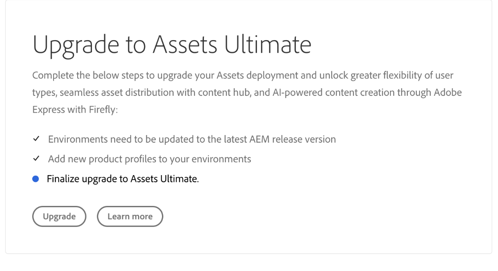
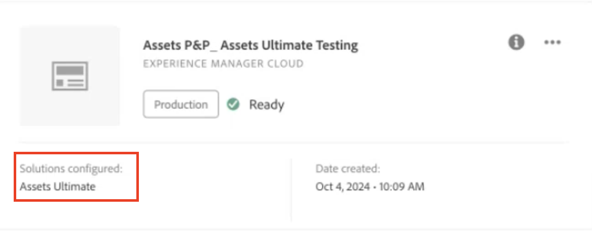

# Aktivieren von [!DNL Assets] as a Cloud Service Ultimate {#enable-assets-cloud-service-ultimate}

| [Best Practices für die Suche](/help/assets/search-best-practices.md) | [Best Practices für Metadaten](/help/assets/metadata-best-practices.md) | [Content Hub](/help/assets/product-overview.md) | [Dynamic Media mit OpenAPI-Funktionen](/help/assets/dynamic-media-open-apis-overview.md) | [Entwicklerdokumentation zu AEM Assets](https://developer.adobe.com/experience-cloud/experience-manager-apis/) |
| ------------- | --------------------------- |---------|----|-----|

Mit Assets as a Cloud Service Ultimate können Sie verschiedene wichtige DAM-Funktionen nutzen, z. B. Asset-Management und Bibliotheksdienste, Sicherheit und Rights Management, Creative und Experience Cloud-Verbindungen, Erweiterbarkeit der Benutzeroberfläche, API-gesteuerte Automatisierung, Integrationen in Adobe- und Adobe-fremde Anwendungen oder die Bereitstellung von benutzerdefiniertem Code. Die vollständige Liste finden Sie unter [Überblick über Assets as a Cloud Service Ultimate](/help/assets/assets-ultimate-overview.md).

## Aktivieren von Assets Ultimate {#enable-assets-ultimate}

Neue Kundinnen und Kunden von Assets as a Cloud Service müssen zunächst Assets Ultimate aktivieren, indem sie mit Cloud Manager ein neues Programm erstellen.

Führen Sie die folgenden Schritte aus:

1. Melden Sie sich als Systemadmin bei Cloud Manager an. Stellen Sie sicher, dass Sie beim Anmelden die richtige Organisation auswählen.

   >[!NOTE]
   >
   >Achten Sie darauf, dass Sie zum richtigen Cloud Manager-Produktprofil hinzugefügt wurden, um ein neues Programm hinzuzufügen. Weitere Informationen finden Sie unter [Rollenbasierte Berechtigungen in Cloud Manager](/help/onboarding/cloud-manager-introduction.md#role-based-permissions).

1. [Erstellen Sie ein neues Programm](/help/journey-onboarding/create-program.md) und [fügen Sie ihm Umgebungen hinzu](/help/journey-onboarding//create-environments.md).

   Wählen Sie beim Erstellen des neuen Programms auf der Registerkarte **[!UICONTROL Lösungen und Add-ons]** die Option **[!UICONTROL Assets Ultimate]** aus. Sie können auch **[!UICONTROL Assets Ultimate]** erweitern und **[!UICONTROL Content Hub]** auswählen, um [Content Hub](/help/assets/product-overview.md) für die Asset-Verteilung zu aktivieren.

   

1. Klicken Sie auf **[!UICONTROL Erstellen]**, um das Programm zu erstellen. Assets Ultimate ist jetzt für Experience Manager Assets as a Cloud Service aktiviert.

Die Systemadmins sind automatisch berechtigte AEM-Admins für Assets Ultimate und erhalten eine E-Mail, um für das Verwalten von Produktprofilen zur Admin Console zu navigieren.

Ihre Instanz von AEM as a Cloud Service in der Admin Console umfasst die folgenden Produktprofile:

* AEM-Admins

* AEM-Benutzende

* [AEM Assets-Mitarbeiter-Benutzende](#onboard-collaborator-users)

* [AEM Assets-Power-Benutzende](#onboard-power-users)

  

Wenn Sie Content Hub für Assets as a Cloud Service aktiviert haben, wird in AEM Assets as a Cloud Service eine neue Instanz für die Admin Console mit dem Suffix `delivery` erstellt:

>[!NOTE]
>
>Wenn Sie Content Hub vor dem 14. August 2024 bereitgestellt haben, wird die neue Instanz mit `contenthub` als Suffix erstellt.

Beachten Sie, dass der Instanzname für Content Hub weder `author` noch `publish` enthält.

Klicken Sie auf den Instanznamen, um das Content Hub-Produktprofil `AEM Assets Limited Users` anzuzeigen.

Sie können diesem Produktprofil Benutzende oder Benutzergruppen hinzufügen, um ihnen Zugriff auf Content Hub zu gewähren.

>[!NOTE]
>
>Wenn Sie Content Hub vor dem 14. August 2024 bereitgestellt haben, wird für das Content Hub-Produktprofil nach `Limited Users` anstelle von `delivery` `contenthub` angegeben.

## Aktivieren von Assets Ultimate für bestehende Kundschaft {#enable-assets-ultimate-existing-customers}

Bestehende Kundinnen und Kunden von Assets as a Cloud Service können eine Aktualisierung auf Assets Ultimate durchführen, indem sie zwei einfache Schritte ausführen. Sie können zum Assets as a Cloud Service-Programm in Cloud Manager navigieren und sich den Aktualisierungsstatus basierend auf der Verfügbarkeit von Assets Ultimate-Credits auf der Programmkarte ansehen. Wenn ausreichend Credits für die Aktualisierung auf Assets Ultimate verfügbar sind, wird Ihnen als Status `Assets license upgrade required` angezeigt, wie in der folgenden Abbildung dargestellt:

Wenn eine Bestandskundin oder ein Bestandskunde eine neue Lizenz für Assets Ultimate erwirbt, wird als Aktualisierungsstatus `Assets license upgrade available` angezeigt.

### Voraussetzungen für die Aktualisierung {#prerequisites-assets-upgrade}

Alle Umgebungen müssen auf die neueste Release-Version von AEM as a Cloud Service oder zumindest auf die Release-Version `2024.10.18175` aktualisiert sein. Wenn Sie die Mindestanforderungen nicht erfüllen, wenden Sie sich an den Adobe-Support, um zur gewünschten AEM-Release-Version zu wechseln.

### Auf Assets Ultimate aktualisieren {#upgrade-assets-ultimate}

Führen Sie die folgenden Schritte aus:

1. Nachdem Sie zu den Mindestanforderungen für die AEM-Release-Version gewechselt haben, klicken Sie auf den Namen des Programms. Eine Aktualisierungskarte wird direkt über dem Abschnitt **[!UICONTROL Umgebungen]** angezeigt, wie in der folgenden Abbildung dargestellt:

   

1. Klicken Sie auf **[!UICONTROL Produktprofile hinzufügen]**. Cloud Manager zeigt Optionen zum Hinzufügen neuer Produktprofile zu allen im Programm verfügbaren Umgebungen oder zu individuellen Umgebungen an.

   

1. Klicken Sie auf **[!UICONTROL Alle Umgebungen]**, um die neuen Produktprofile zu allen Umgebungen im Programm hinzuzufügen, oder auf **[!UICONTROL Individuelle Umgebungen]**, um die neuen Produktprofile zu ausgewählten Umgebungen hinzuzufügen.

   Durch Klicken auf **[!UICONTROL Individuelle Umgebungen]** wird die Liste aller im Programm verfügbaren Umgebungen angezeigt.

1. Klicken Sie auf das zu einer Umgebung gehörende Symbol „Weitere Optionen“, und wählen Sie **[!UICONTROL Produktprofile hinzufügen]** aus, um die neuen Produktprofile zur ausgewählten Umgebung hinzuzufügen.

   

   Sie können Produktprofile auch zu ausgewählten Umgebungen hinzufügen, indem Sie zum Abschnitt **[!UICONTROL Umgebungen]** navigieren, auf das zu einer Umgebung gehörende Symbol „Weitere Optionen“ klicken und **[!UICONTROL Produktprofile hinzufügen]** auswählen.

   Während die neuen Produktprofile hinzugefügt werden, wird als Status der Umgebung `Adding Product Profiles` angezeigt. Nach Abschluss des Vorgangs wird dann `Running` angezeigt.

   Bevor Sie den nächsten Schritt ausführen können, müssen Sie zu allen im Programm verfügbaren Umgebungen Produktprofile hinzufügen. Sie können dies für individuelle Umgebungen oder für alle Umgebungen zusammen tun.

1. Klicken Sie auf **[!UICONTROL Aktualisieren]**. Die Option **[!UICONTROL Aktualisieren]** wird erst angezeigt, wenn Sie allen verfügbaren Umgebungen Produktprofile hinzufügen.

   

   Der Aktualisierungsprozess ist abgeschlossen und Sie haben Assets as a Cloud Service erfolgreich auf Assets Ultimate aktualisiert. Als Status des Programms wird `Assets Ultimate` angezeigt.

   

Ihre Instanz von AEM as a Cloud Service in der Admin Console umfasst jetzt die folgenden Produktprofile:

* AEM-Admins

* AEM-Benutzende

* [AEM Assets-Mitarbeiter-Benutzende](#onboard-collaborator-users)

* [AEM Assets-Power-Benutzende](#onboard-power-users)

Wenn Content Hub aktiviert sein muss, klicken Sie auf das Symbol „Weitere Optionen“ (…) für den Programmnamen in Cloud Manager und wählen Sie **[!UICONTROL Programm bearbeiten]** aus. Erweitern Sie **[!UICONTROL Assets Ultimate]** und klicken Sie auf **[!UICONTROL Content Hub]**. Dieser Schritt aktiviert den Content Hub für Assets Ultimate. Es wird eine neue Instanz in AEM Assets as a Cloud Service für die Admin Console mit dem Suffix `delivery` erstellt:

>[!NOTE]
>
>Wenn Sie Content Hub vor dem 14. August 2024 bereitgestellt haben, wird die neue Instanz mit `contenthub` als Suffix erstellt.

Beachten Sie, dass der Instanzname für Content Hub weder `author` noch `publish` enthält.

Klicken Sie auf den Instanznamen, um das Content Hub-Produktprofil `AEM Assets Limited Users` anzuzeigen.

Sie können diesem Produktprofil Benutzende oder Benutzergruppen hinzufügen, um ihnen Zugriff auf Content Hub zu gewähren.

>[!NOTE]
>
>Wenn Sie Content Hub vor dem 14. August 2024 bereitgestellt haben, wird für das Content Hub-Produktprofil nach `Limited Users` anstelle von `delivery` `contenthub` angegeben.

## Onboarding von AEM Assets-Mitarbeiter-Benutzenden {#onboard-collaborator-users}

AEM Assets-Mitarbeiter-Benutzende können mit Assets aus Experience Manager über Integrationen von Assets arbeiten, die für Ihr Unternehmen in anderen Adobe-Produkten und Adobe-fremden Anwendungen zur Verfügung stehen, Assets mit dem integrierten Adobe Express und Firefly erstellen und bearbeiten, indem sie professionell entwickelte Vorlagen, Marken-Kits und Adobe Stock-Assets nutzen und mithilfe des AEM Assets Content Hub-Portals auf genehmigte Assets in Ihrem Unternehmen zugreifen und diese nutzen.

So führen Sie das Onboarding von Mitarbeiter-Benutzenden durch:

1. Greifen Sie auf Experience Manager Assets-Produktprofile zu, indem Sie in der Produktliste in der Admin Console auf den AEM as a Cloud Service-Produktnamen klicken.

1. Klicken Sie auf die Produktions-Autoreninstanz für AEM as a Cloud Service:
   

1. Klicken Sie auf das Produktprofil „Mitarbeiter-Benutzende“ und klicken Sie auf **[!UICONTROL Benutzende hinzufügen]**, um Benutzende oder Benutzergruppen zum Produktprofil hinzuzufügen.
   

1. Klicken Sie auf **[!UICONTROL Speichern]**, um die Änderungen zu speichern.

Sie können auch auf die den Mitarbeiter-Benutzenden zugewiesenen Dienste zugreifen und diese anzeigen, wie in der folgenden Abbildung dargestellt:

Die Dienste `Adobe Express` und `AEM Assets Collaborator Users` sind standardmäßig aktiviert.

>[!NOTE]
>
>Sie können mit den Umschaltern die verfügbaren Dienste entsprechend Ihren Anforderungen aktivieren oder deaktivieren. Adobe empfiehlt jedoch, die standardmäßig für die Produktprofile aktivierten Dienste beizubehalten.

## Onboarding von AEM Assets Power-Benutzenden {#onboard-power-users}

AEM Assets-Power-Benutzende können auf alle AEM Assets-Funktionen zugreifen, einschließlich dem Verwalten von Assets, Berechtigungen, Metadaten und der allgemeinen Governance und Automatisierung von digitalen Assets. Sie können mit Assets aus Experience Manager über Integrationen von Assets arbeiten, die für Ihr Unternehmen in anderen Adobe-Produkten und Adobe-fremden Anwendungen zur Verfügung stehen, Assets mit dem integrierten Adobe Express und Firefly erstellen und bearbeiten, indem sie professionell entwickelte Vorlagen, Marken-Kits und Adobe Stock-Assets nutzen und mithilfe des AEM Assets Content Hub-Portals auf genehmigte Assets in Ihrem Unternehmen zugreifen und diese nutzen.

So führen Sie das Onboarding von Power-Benutzenden durch:

1. Greifen Sie auf Experience Manager Assets-Produktprofile zu, indem Sie in der Produktliste in der Admin Console auf den AEM as a Cloud Service-Produktnamen klicken.

1. Klicken Sie auf die Produktions-Autoreninstanz für AEM as a Cloud Service:
   

1. Klicken Sie auf das Produktprofil „Power-Benutzende“ und dann auf **[!UICONTROL Benutzende hinzufügen]**, um Benutzende oder Benutzergruppen zum Produktprofil hinzuzufügen.
   

1. Klicken Sie auf **[!UICONTROL Speichern]**, um die Änderungen zu speichern.

Sie können auch auf die den Power-Benutzenden zugewiesenen Dienste zugreifen und diese anzeigen, wie in der folgenden Abbildung dargestellt:

Die Dienste `Adobe Express` und `AEM Assets Power Users` sind standardmäßig aktiviert.

>[!NOTE]
>
>Sie können mit den Umschaltern die verfügbaren Dienste entsprechend Ihren Anforderungen aktivieren oder deaktivieren. Adobe empfiehlt jedoch, die standardmäßig für die Produktprofile aktivierten Dienste beizubehalten.
