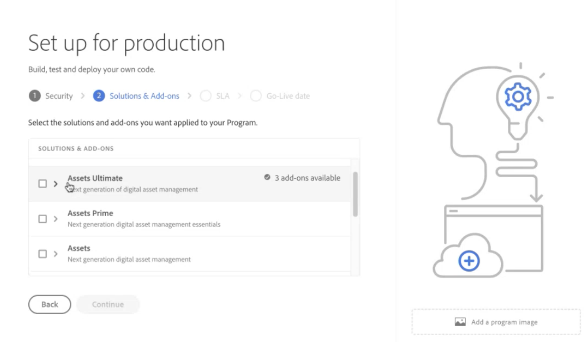
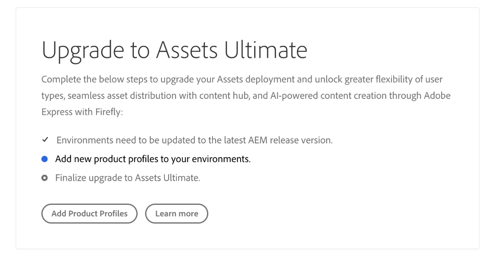

# [!DNL Assets] {#enable-assets-cloud-service-ultimate}

| [Best Practices für die Suche](/help/assets/search-best-practices.md) | [Best Practices für Metadaten](/help/assets/metadata-best-practices.md) | [Content Hub](/help/assets/product-overview.md) | [Dynamic Media mit OpenAPI-Funktionen](/help/assets/dynamic-media-open-apis-overview.md) | [Entwicklerdokumentation zu AEM Assets](https://developer.adobe.com/experience-cloud/experience-manager-apis/) |
| ------------- | --------------------------- |---------|----|-----|

Assets as a Cloud Service Ultimate ermöglicht Ihnen die Durchführung verschiedener wichtiger DAM-Funktionen, wie Asset-Management- und Bibliotheksdienste, Sicherheits- und Rechteverwaltung, Kreativ- und Experience Cloud-Verbindungen, Benutzeroberflächenerweiterbarkeit, API-gesteuerte Automatisierung, Integrationen mit Adobe- und Nicht-Adobe-Anwendungen, Bereitstellung von benutzerdefiniertem Code und vieles mehr. Die vollständige Liste finden Sie unter [Assets as a Cloud Service Ultimate Overview](/help/assets/assets-ultimate-overview.md) .

## Assets Ultimate aktivieren {#enable-assets-ultimate}

Neue Assets as a Cloud Service-Kunden müssen Assets Ultimate zunächst aktivieren, indem sie ein neues Programm mit Cloud Manager erstellen.

Führen Sie die folgenden Schritte aus:

1. Melden Sie sich als Systemadministrator bei Cloud Manager an. Stellen Sie sicher, dass Sie beim Anmelden die richtige Organisation auswählen.

   >[!NOTE]
   >
   >Stellen Sie sicher, dass Sie zum entsprechenden Cloud Manager-Produktprofil hinzugefügt wurden, um ein neues Programm hinzuzufügen. Weitere Informationen finden Sie unter [Rollenbasierte Berechtigungen in Cloud Manager](/help/onboarding/cloud-manager-introduction.md#role-based-permissions).

1. [Erstellen Sie ein neues Programm](/help/journey-onboarding/create-program.md) und fügen Sie ihm [Umgebungen](/help/journey-onboarding//create-environments.md) hinzu.

   Wählen Sie beim Erstellen des neuen Programms auf der Registerkarte **[!UICONTROL Lösungen und Add-ons]** die Option **[!UICONTROL Assets Ultimate]**. Sie können auch **[!UICONTROL Assets Ultimate]** erweitern und **[!UICONTROL Content Hub]** auswählen, um [Content Hub](/help/assets/product-overview.md) für die Asset-Verteilung zu aktivieren.

   

1. Klicken Sie auf **[!UICONTROL Erstellen]** , um das Programm zu erstellen. Assets Ultimate ist jetzt für Experience Manager Assets as a Cloud Service aktiviert.

Der Systemadministrator hat in Assets Ultimate automatisch die Berechtigung AEM Administrator und erhält eine E-Mail, um zur Admin Console für die Verwaltung der verfügbaren Produktprofile zu navigieren.

Ihre AEM as a Cloud Service-Instanz auf Admin Console umfasst die folgenden Produktprofile:

* AEM Administratoren

* AEM-Benutzende

* [AEM Assets-Mitwirkende](#onboard-collaborator-users)

* [AEM Assets Power Users](#onboard-power-users)

  

Wenn Sie Content Hub für Assets as a Cloud Service aktiviert haben, wird eine neue Instanz in der as a Cloud Service-Admin Console von AEM Assets mit dem Suffix `delivery` erstellt:

>[!NOTE]
>
>Wenn Sie Content Hub vor dem 14. August 2024 bereitgestellt haben, wird die neue Instanz mit `contenthub` als Suffix erstellt.

Beachten Sie, dass der Instanzname für Content Hub nicht `author` oder `publish` enthält.

Klicken Sie auf den Instanznamen, um das Produktprofil `AEM Assets Limited Users` Content Hub anzuzeigen.

You can start adding users or user groups to this product profile to provide them access to Content Hub.

>[!NOTE]
>
>`contenthub``Limited Users``delivery`

## Assets Ultimate für bestehende Kunden aktivieren {#enable-assets-ultimate-existing-customers}

Bestehende Assets as a Cloud Service-Kunden können ein Upgrade auf Assets Ultimate durchführen, indem sie zwei einfache Schritte ausführen. Sie können zum Assets as a Cloud Service-Programm in Cloud Manager navigieren und den Upgrade-Status auf der Programmkarte sehen, je nach Verfügbarkeit von Assets Ultimate-Guthaben. Wenn ausreichend Guthaben für die Aktualisierung auf Assets Ultimate verfügbar sind, können Sie den Status als `Assets license upgrade required` sehen, wie in der folgenden Abbildung dargestellt:

Wenn ein bestehender Kunde eine neue Lizenz für Assets Ultimate erwirbt, wird der Upgrade-Status als `Assets license upgrade available` angezeigt.

### Voraussetzungen für die Aktualisierung {#prerequisites-assets-upgrade}

`2024.10.18175` If you do not meet the minimum requirements, contact your Adobe representative to switch to the required AEM release version.

### Auf Assets Ultimate aktualisieren {#upgrade-assets-ultimate}

Führen Sie die folgenden Schritte aus:

1. After switching to the minimum requirements for the AEM release version, click the program name. ****

   

1. Klicken Sie auf **[!UICONTROL Produktprofile hinzufügen]**. Cloud Manager zeigt Optionen zum Hinzufügen neuer Produktprofile zu allen im Programm oder in einzelnen Umgebungen verfügbaren Umgebungen an.

   

1. Klicken Sie auf **[!UICONTROL Alle Umgebungen]** , um die neuen Produktprofile zu allen Umgebungen im Programm hinzuzufügen, oder auf **[!UICONTROL Individuelle Umgebungen]** , um die neuen Produktprofile zu ausgewählten Umgebungen hinzuzufügen.

   Durch Klicken auf **[!UICONTROL Individuelle Umgebungen]** wird die Liste aller im Programm verfügbaren Umgebungen angezeigt.

1. Klicken Sie auf das Symbol Weitere Optionen , das einer Umgebung entspricht, und wählen Sie **[!UICONTROL Produktprofile hinzufügen]** aus, um die neuen Produktprofile zur ausgewählten Umgebung hinzuzufügen.

   

   Sie können ausgewählten Umgebungen auch Produktprofile hinzufügen, indem Sie zum Abschnitt **[!UICONTROL Umgebungen]** navigieren, auf das Symbol Weitere Optionen für eine Umgebung klicken und **[!UICONTROL Produktprofile hinzufügen]** auswählen.

   Der Status der Umgebung zeigt `Adding Product Profiles` an, während die neuen Produktprofile hinzugefügt werden, und zeigt anschließend `Running` an, wenn der Prozess abgeschlossen ist.

   Bevor Sie den nächsten Schritt ausführen, müssen Sie allen im Programm verfügbaren Umgebungen - einzeln oder in allen Umgebungen - Produktprofile hinzufügen.

1. Klicken Sie auf **[!UICONTROL Upgrade]**. ****

   

   The upgrade process is complete and you have successfully upgraded your Assets as a Cloud Service to Assets Ultimate. `Assets Ultimate`

   

Ihre AEM as a Cloud Service-Instanz auf Admin Console umfasst jetzt die folgenden Produktprofile:

* AEM Administrators

* AEM-Benutzende

* [AEM Assets Collaborator Users](#onboard-collaborator-users)

* [AEM Assets Power Users](#onboard-power-users)

**** Erweitern Sie **[!UICONTROL Assets Ultimate]** und klicken Sie auf **[!UICONTROL Content Hub]**. Dieser Schritt ermöglicht die Content Hub für Assets Ultimate. In der as a Cloud Service Admin Console von AEM Assets wird eine neue Instanz mit dem Suffix `delivery` erstellt:

>[!NOTE]
>
>Wenn Sie Content Hub vor dem 14. August 2024 bereitgestellt haben, wird die neue Instanz mit `contenthub` als Suffix erstellt.

Beachten Sie, dass der Instanzname für Content Hub nicht `author` oder `publish` enthält.

Klicken Sie auf den Instanznamen, um das Produktprofil `AEM Assets Limited Users` Content Hub anzuzeigen.

Sie können diesem Produktprofil Benutzer oder Benutzergruppen hinzufügen, um ihnen Zugriff auf Content Hub zu gewähren.

>[!NOTE]
>
>Wenn Sie Content Hub vor dem 14. August 2024 bereitgestellt haben, wird für das Content Hub-Produktprofil nach `Limited Users` anstelle von `delivery` `contenthub` angegeben.

## Benutzer der integrierten AEM Assets-Mitarbeit {#onboard-collaborator-users}

AEM Assets Collaborator-Benutzer können mit Assets aus Experience Manager über Integrationen von Assets arbeiten, die für Ihr Unternehmen in anderen Adobe-Produkten und Nicht-Adobe-Anwendungen verfügbar sind, Assets mit integrierten Adobe Expressen und Firefly erstellen und bearbeiten, indem sie professionell entwickelte Vorlagen, Markenkits, Adobe Stock-Assets usw. nutzen und mithilfe des AEM Assets Content Hub Portals auf genehmigte Assets in Ihrem Unternehmen zugreifen und diese nutzen.

So integrieren Sie Collaborator-Benutzer:

1. Greifen Sie auf Experience Manager Assets-Produktprofile zu, indem Sie in der Produktliste auf Admin Console auf den AEM as a Cloud Service-Produktnamen klicken.

1. Klicken Sie auf die Produktionserstellungsinstanz für AEM as a Cloud Service:
   

1. Klicken Sie auf das Produktprofil Benutzer der Mitwirkenden und dann auf **[!UICONTROL Benutzer hinzufügen]** , um dem Produktprofil Benutzer oder Benutzergruppen hinzuzufügen.
   

1. Klicken Sie auf **[!UICONTROL Speichern]**, um die Änderungen zu speichern.

Sie können auch auf die den Benutzern des Mitwirkenden zugewiesenen Dienste zugreifen und diese anzeigen, wie in der folgenden Abbildung dargestellt:

Die Dienste `Adobe Express` und `AEM Assets Collaborator Users` sind standardmäßig aktiviert.

>[!NOTE]
>
>Sie können den Umschalter deaktivieren und aktivieren, um die verfügbaren Dienste gemäß Ihren Anforderungen zu aktivieren bzw. zu deaktivieren. Adobe empfiehlt jedoch, die für die Produktprofile aktivierten Standarddienste zu verwenden.

## Onboard AEM Assets Power-Benutzer {#onboard-power-users}

AEM Assets Power-Benutzer können über das AEM Assets Portal auf alle AEM Assets-Funktionen zugreifen, einschließlich der Verwaltung von Assets, Berechtigungen, Metadaten und der allgemeinen Verwaltung und Automatisierung digitaler Assets, der Arbeit mit Assets aus Experience Manager über Integrationen von Assets, die für Ihr Unternehmen in anderen Adobe- und Nicht-Adobe-Anwendungen verfügbar sind, der Erstellung und Bearbeitung von Assets mit integrierten Adobe Expressen und Firefly, mithilfe von professionell gestalteten Vorlagen, Markenkits, Adobe Stock-Assets usw. sowie des Zugriffs und der Nutzung genehmigter Assets aus Ihrem Unternehmen.

So integrieren Sie Power-Benutzer:

1. Access Experience Manager Assets product profiles by clicking the AEM as a Cloud Service product name in the list of products on Admin Console.

1. Click the production author instance for AEM as a Cloud Service:
   

1. Klicken Sie auf das Produktprofil Power users und klicken Sie auf **[!UICONTROL Benutzer hinzufügen]** , um dem Produktprofil Benutzer oder Benutzergruppen hinzuzufügen.
   

1. Klicken Sie auf **[!UICONTROL Speichern]**, um die Änderungen zu speichern.

Sie können auch auf die Power-Benutzern zugewiesenen Dienste zugreifen und diese anzeigen, wie in der folgenden Abbildung dargestellt:

Die Dienste `Adobe Express` und `AEM Assets Power Users` sind standardmäßig aktiviert.

>[!NOTE]
>
>Sie können den Umschalter deaktivieren und aktivieren, um die verfügbaren Dienste gemäß Ihren Anforderungen zu aktivieren bzw. zu deaktivieren. Adobe empfiehlt jedoch, die für die Produktprofile aktivierten Standarddienste zu verwenden.
