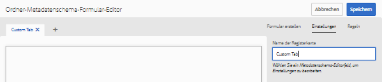
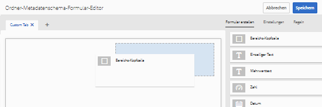
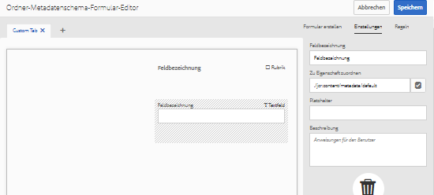
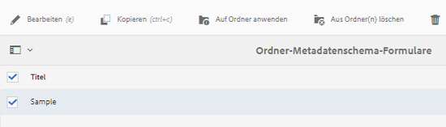
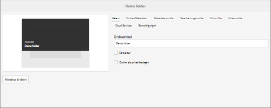
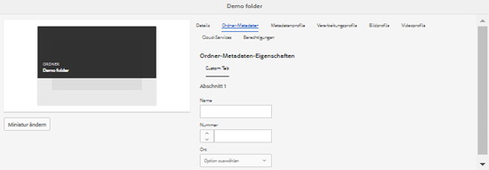
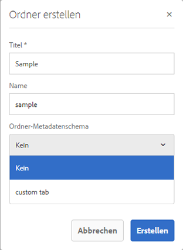

# Ordner-Metadatenschema {#folder-metadata-schema}

Mit [!DNL Adobe Experience Manager Assets] können Sie Metadatenschemata für Asset-Ordner erstellen, die die auf Seiten mit Ordnereigenschaften angezeigten Layouts und Metadaten definieren.

## Hinzufügen von Ordner-Metadatenschema-Formularen {#add-a-folder-metadata-schema-form}

Verwenden Sie den Editor für Metadatenschema-Formulare, um Metadatenschemata für Ordner zu erstellen und zu bearbeiten.

1. Wählen Sie die [!DNL Experience Manager] -Logo und navigieren Sie zu **[!UICONTROL Instrumente]** > **[!UICONTROL Assets]** > **[!UICONTROL Ordner-Metadatenschemata]**.
1. Wählen Sie auf der Seite &quot;Ordner-Metadatenschema-Forms&quot;die Option **[!UICONTROL Erstellen]**.
1. Geben Sie einen Namen für das Formular an und wählen Sie **[!UICONTROL Erstellen]**. Das neue Schemaformular wird auf der Seite Schemaformulare aufgeführt.

## Bearbeiten von Ordner-Metadatenschema-Formularen {#edit-folder-metadata-schema-forms}

Sie können ein neu hinzugefügtes oder vorhandenes Metadatenschema-Formular bearbeiten, das Folgendes enthält:

* Registerkarten
* Formularelemente innerhalb von Registerkarten.

Sie können diese Formularelemente einem Feld innerhalb eines Metdatenknotens im CRX-Repository zuordnen bzw. dafür konfigurieren. Sie können dem Metadatenschema-Formular neue Registerkarten oder Formularelemente hinzufügen.

1. Wählen Sie auf der Seite &quot;Schema Forms&quot;das erstellte Formular aus und wählen Sie dann die **[!UICONTROL Bearbeiten]** in der Symbolleiste.
1. Wählen Sie auf der Seite Ordner-Metadatenschema-Editor die **[!UICONTROL +]** -Symbol, um dem Formular eine Registerkarte hinzuzufügen. Um die Registerkarte umzubenennen, wählen Sie den Standardnamen aus und geben Sie den neuen Namen unter **[!UICONTROL Einstellungen]**.

   

   Um weitere Registerkarten hinzuzufügen, wählen Sie die **[!UICONTROL +]** Symbol. Auswählen **[!UICONTROL X]** , um eine Registerkarte zu löschen.

1. Fügen Sie in der aktiven Registerkarte eine oder mehrere Komponenten von der Registerkarte **[!UICONTROL Formular erstellen]** hinzu.

   

   Wenn Sie mehrere Registerkarten erstellen, wählen Sie eine bestimmte Registerkarte aus, um Komponenten hinzuzufügen.

1. Um eine Komponente zu konfigurieren, wählen Sie diese aus und ändern Sie ihre Eigenschaften auf der Registerkarte **[!UICONTROL Einstellungen]**.

   Löschen Sie ggf. eine Komponente über die Registerkarte **[!UICONTROL Einstellungen]**.

   

1. Auswählen **[!UICONTROL Speichern]** aus der Symbolleiste, um die Änderungen zu speichern.

### Komponenten zum Erstellen von Formularen {#components-to-build-forms}

Die Registerkarte **[!UICONTROL Formular erstellen]** enthält Formularelemente, die Sie im Ordner-Metadatenschema-Formular verwenden. Die Registerkarte **[!UICONTROL Einstellungen]** enthält die Attribute für jedes Element, das Sie auf der Registerkarte **[!UICONTROL Formular erstellen]** auswählen. Im Folgenden finden Sie eine Liste der auf der Registerkarte **[!UICONTROL Formular erstellen]** verfügbaren Elemente:

<table>
 <tbody>
  <tr>
   <td>
<strong>Komponentenname</strong>
 </td>
   <td>
<strong>Beschreibung</strong>
 </td>
  </tr>
  <tr>
   <td>
Bereichs-Kopfzeile
 </td>
   <td>
 Fügen Sie eine Abschnittsüberschrift für eine Liste allgemeiner Komponenten hinzu.
 </td>
  </tr>
  <tr>
   <td>
Einzeilentext
 </td>
   <td>
 Fügen Sie eine einzeilige Texteigenschaft hinzu. Diese wird als Zeichenfolge gespeichert.
 </td>
  </tr>
  <tr>
   <td>
Mehrwerttext
 </td>
   <td>
 Fügen Sie eine Texteigenschaft mit mehreren Werten hinzu. Diese wird als Zeichenfolgen-Array gespeichert.
 </td>
  </tr>
  <tr>
   <td>
Zahl
 </td>
   <td>
 Fügen Sie eine Zahlenkomponente hinzu.
 </td>
  </tr>
  <tr>
   <td>
Datum
 </td>
   <td>
 Fügen Sie eine Datumskomponente hinzu.
 </td>
  </tr>
  <tr>
   <td>
Dropdown
 </td>
   <td>
 Fügen Sie eine Dropdown-Liste hinzu.
 </td>
  </tr>
  <tr>
   <td>
Standard-Tags
 </td>
   <td>
 Fügen Sie ein Tag hinzu. 
 </td>
  </tr>
  <tr>
   <td>
Ausgeblendetes Feld
 </td>
   <td>
 Fügen Sie ein ausgeblendetes Feld hinzu. Dieses wird beim Speichern des Assets als POST-Parameter gesendet.
 </td>
  </tr>
 </tbody>
</table>

### Bearbeiten von Formularelementen {#editing-form-items}

Um die Eigenschaften von Formularelementen zu bearbeiten, wählen Sie die Komponente aus und bearbeiten Sie alle Eigenschaften oder eine Untergruppe der folgenden Eigenschaften in der **[!UICONTROL Einstellungen]** Registerkarte. Es wird empfohlen, einer bestimmten Eigenschaft im Metadatenschema nur ein Feld zuzuordnen. Andernfalls wird das der Eigenschaft zuletzt zugeordnete Feld vom System ausgewählt.

**[!UICONTROL Feldbezeichnung]**: Der Name der Metadateneigenschaft, der auf der Eigenschaftenseite des Assets angezeigt wird.

**[!UICONTROL Zu Eigenschaft zuordnen]**: Diese Eigenschaft gibt den relativen Pfad des Ordnerknotens im CRX-Repository an, wo das Element gespeichert ist. Sie beginnt mit „**./**“, was angibt, dass sich der Pfad unter dem Knoten des Ordners befindet.

Im Folgenden finden Sie Beispiele für gültige Werte für eine Eigenschaft:

* `./jcr:content/metadata/dc:title`: Speichert den Wert im Metadatenknoten des Ordners als Eigenschaft `dc:title`.

* `./jcr:created`: Speichert das Erstellungsdatum und die Erstellungsuhrzeit eines Assets. Dies ist eine geschützte Eigenschaft. Wenn Sie diese Eigenschaften konfigurieren, empfiehlt Adobe, dass Sie sie mit [!UICONTROL Bearbeitung deaktivieren] markieren.

Um zu gewährleisten, dass die Komponente ordnungsgemäß im Metadatenschema-Formular angezeigt wird, fügen Sie dem Eigenschaftenpfad keine Leerzeichen hinzu.

**[!UICONTROL JSON-Pfad]**: Verwenden Sie diese Eigenschaft, um den Pfad der JSON-Datei anzugeben, in der Sie Schlüssel-Wert-Paare für Optionen speichern.

**[!UICONTROL Platzhalter]**: Verwenden Sie diese Eigenschaft, um relevanten Platzhaltertext für die Metadateneigenschaft anzugeben.

**[!UICONTROL Wahlen]**: Mit dieser Eigenschaft legen Sie Optionen in einer Liste fest.

**[!UICONTROL Beschreibung]**: Mit dieser Eigenschaft können Sie eine kurze Beschreibung für die Metadatenkomponente hinzufügen.

**[!UICONTROL Klasse]**: Objektklasse, mit der die Eigenschaft verknüpft ist.

## Löschen von Ordner-Metadatenschema-Formularen {#delete-folder-metadata-schema-forms}

Sie können Ordner-Metadatenschema-Formulare über die Seite „Ordner-Metadatenschema-Formulare“ löschen. Um ein Formular zu löschen, wählen Sie es aus und klicken Sie in der Symbolleiste auf das Symbol Löschen .

## Zuweisen eines Ordner-Metadatenschemas {#assign-a-folder-metadata-schema}

Sie können ein Ordner-Metadatenschema über die Seite „Ordner-Metadatenschema-Formulare“ oder bei der Ordnererstellung einem Ordner zuordnen.

Wenn Sie ein Metadatenschema für einen Ordner konfigurieren, wird der Pfad in der Eigenschaft `folderMetadataSchema` des Ordnerknotens unter */jcr:content* gespeichert.

### Zuweisen eines Schemas über die Seite „Ordner-Metadatenschema“ {#assign-to-a-schema-from-the-folder-metadata-schema-page}

1. Wählen Sie die [!DNL Experience Manager] -Logo und navigieren Sie zu **[!UICONTROL Instrumente]** > **[!UICONTROL Assets]**> **[!UICONTROL Ordner-Metadatenschemata]**.
1. Wählen Sie auf der Seite „Ordner-Metadatenschema-Formulare“ das Schemaformular aus, das Sie auf einen Ordner anwenden möchten.
1. Wählen Sie in der Symbolleiste **[!UICONTROL Auf Ordner anwenden]**.

1. Wählen Sie den Ordner aus, auf den das Schema angewendet werden soll, und wählen Sie dann **[!UICONTROL Anwenden]**. Wenn bereits ein Metadatenschema auf den Ordner angewendet wurde, wird eine Warnung dazu angezeigt, dass das bestehende Schema überschrieben wird. Auswählen **[!UICONTROL Überschreiben]**.
1. Öffnen Sie die Metadateneigenschaften für den Ordner, auf den Sie das Schema angewendet haben.

   

   Um die Ordner-Metadatenfelder anzuzeigen, wählen Sie die **[!UICONTROL Ordnermetadaten]** Registerkarte.

   

### Zuweisen eines Schemas bei der Ordnererstellung {#assign-a-schema-when-creating-a-folder}

Sie können beim Erstellen eines Ordners ein Ordner-Metadatenschema zuweisen. Wenn mindestens ein Ordner-Metadatenschema im System vorhanden ist, wird eine zusätzliche Liste im Dialogfeld **[!UICONTROL Ordner erstellen]** angezeigt. Sie können das gewünschte Schema auswählen. Standardmäßig ist kein Schema ausgewählt.

1. Aus dem [!DNL Experience Manager Assets] Benutzeroberfläche auswählen **[!UICONTROL Erstellen]** aus der Symbolleiste.
1. Geben Sie einen Titel und eine Beschreibung für den Ordner an.
1. Wählen Sie in der Liste „Ordner-Metadatenschema“ das gewünschte Schema aus. Wählen Sie anschließend **[!UICONTROL Erstellen]**.

   

1. Öffnen Sie die Metadateneigenschaften für den Ordner, auf den Sie das Schema angewendet haben.
1. Um die Ordner-Metadatenfelder anzuzeigen, wählen Sie die **[!UICONTROL Ordnermetadaten]** Registerkarte.

## Verwenden des Ordner-Metadatenschemas {#use-the-folder-metadata-schema}

Öffnen Sie die Eigenschaften für einen Ordner, der mit einem Ordner-Metadatenschema konfiguriert wurde. Hierdurch wird die Registerkarte **[!UICONTROL Ordnermetadaten]** auf der Seite mit den Ordnereigenschaften angezeigt. Um das Ordner-Metadatenschema-Formular anzuzeigen, wählen Sie diese Registerkarte aus.

Geben Sie Metadatenwerte in die verschiedenen Felder ein und wählen Sie **[!UICONTROL Speichern]** , um die Werte zu speichern. Die angegebenen Werte werden im Ordnerknoten im CRX-Repository gespeichert.

**Siehe auch**

* [Assets übersetzen](translate-assets.md)
* [Assets-HTTP-API](mac-api-assets.md)
* [Von AEM Assets unterstützte Dateiformate](file-format-support.md)
* [Suchen von Assets](search-assets.md)
* [Connected Assets](use-assets-across-connected-assets-instances.md)
* [Asset-Berichte](asset-reports.md)
* [Metadatenschemata](metadata-schemas.md)
* [Herunterladen von Assets](download-assets-from-aem.md)
* [Verwalten von Metadaten](manage-metadata.md)
* [Suchfacetten](search-facets.md)
* [Verwalten von Sammlungen](manage-collections.md)
* [Massenimport von Metadaten](metadata-import-export.md)
