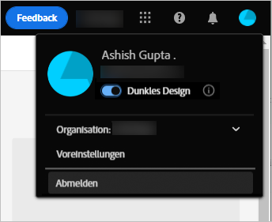

# Erste Schritte mit der Assets-Ansicht {#assets-view-get-started}

<!-- TBD: Make links for these steps. -->

Die Verwaltung digitaler Assets mit [!DNL Assets View] erfordert nur drei einfache Schritte:

* **Schritt 1**: [Hochladen](/help/assets/add-delete-assets-view.md) und [Anzeigen](/help/assets/navigate-assets-view.md) von Assets.
* **Schritt 2**: [Durchsuchen](/help/assets/search-assets-view.md) und [Herunterladen](/help/assets/manage-organize-assets-view.md#download) von Assets.
* **Schritt 3**: [Verwalten und Organisieren](/help/assets/manage-organize-assets-view.md) der Assets.

Um [!DNL Assets View] zu verwenden, melden Sie sich unter [https://experience.adobe.com/#/assets](https://experience.adobe.com/#/assets) an. Wählen Sie beim Anmelden `Company or School Account` aus. Wenden Sie sich an die Admins Ihrer Organisation, um Zugriff zu erhalten.

<!--In addition, more reference information that can be helpful is [understanding of the user interface](/help/assets/navigate-assets-view.md), [list of use cases](#use-cases), [supported file types](/help/assets/supported-file-formats-assets-view.md), and [known issues](/help/assets/release-notes.md#known-issues).
-->

## Zugriff auf die Assets-Ansicht {#access-assets-view}

Siehe [Zugriff auf die Asset-Ansicht](/help/assets/assets-view-introduction.md#how-to-access-assets-view) für detaillierte Anweisungen dazu, wie auf die Assets-Ansicht zugegriffen werden kann.

## Konfigurieren von [!DNL Assets View] {#configuration}

Um die Voreinstellungen zu öffnen, klicken Sie auf den Avatar in der rechten oberen Ecke der Benutzeroberfläche. Sie können in den Lösungsvoreinstellungen zwischen den hellen und den dunklen Themen wechseln.

Wenn Sie Mitglied verschiedener Organisationen sind, können Sie auch die Organisation ändern und unternehmensübergreifend auf Ihre Konten zugreifen.

Um Ihre [!UICONTROL Experience Cloud-Voreinstellungen] zu ändern, klicken Sie auf [!UICONTROL Voreinstellungen].

>[!NOTE]
>
>Wenn Sie zur Assets-Ansicht navigieren und die Meldung `Network Error` angezeigt wird, stellen Sie sicher, dass Sie die Anweisungen ausführen, die im Artikel [Cross-Origin Resource Sharing(CORS)-Konfiguration](/help/headless/deployment/cross-origin-resource-sharing.md) beschrieben sind.

## [!DNL Assets View]-Anwendungsfälle  {#use-cases}

Nachfolgend finden Sie die verschiedenen DAM-Aufgaben (Digital Asset Management), die Sie mit [!DNL Assets View] ausführen können.

| Benutzeraufgaben | Funktionalität und Anleitungsinformationen |
|-----|------|
| Durchsuchen und Anzeigen von Assets | <ul> <li>[Durchsuchen des Repository](/help/assets/navigate-assets-view.md#view-assets-and-details) </li> <li> [Anzeigen einer Vorschau für ein Asset](/help/assets/navigate-assets-view.md#preview-assets) <li> [Anzeigen von Ausgabedarstellungen eines Assets](/help/assets/add-delete-assets-view.md#renditions) </li> <li>[Anzeigen von Versionen eines Assets](/help/assets/manage-organize-assets-view.md#view-versions)</li></ul> |
| Hinzufügen neuer Assets | <ul> <li>[Hochladen von neuen Assets und Ordnern](/help/assets/add-delete-assets-view.md)</li> <li>[Überwachen des Upload-Fortschritts und Verwalten von Uploads](/help/assets/add-delete-assets-view.md#upload-progress)</li> <li>[Auflösen von Duplikaten](/help/assets/add-delete-assets-view.md)</li> </ul> |
| Aktualisieren von Assets oder zugehörigen Informationen | <ul> <li>[Bearbeiten von Bildern](/help/assets/edit-images-assets-view.md)</li> <li>[Erstellen von Versionen](/help/assets/manage-organize-assets-view.md#create-versions) und [Anzeigen von Versionen](/help/assets/manage-organize-assets-view.md#view-versions)</li> <li>[Bearbeiten von Bildern](/help/assets/edit-images-assets-view.md)</li> </ul> |
| Bearbeiten von Assets | <ul> <li>[Bearbeitung im Browser mit Adobe Photoshop Express](/help/assets/edit-images-assets-view.md)</li> <li>[Zuschneiden für ein Social-Media-Profil](/help/assets/edit-images-assets-view.md#crop-straighten-images)</li> <li>[Versionen anzeigen und verwalten](/help/assets/manage-organize-assets-view.md#view-versions)</li></ul></ul> |
| Suchen nach Assets im Repository | <ul> <li>[Suchen in einem bestimmten Ordner](/help/assets/search-assets-view.md#refine-search-results)</li> <li>[Gespeicherte Suchvorgänge](/help/assets/search-assets-view.md#saved-search)</li> <li>[Suchen nach kürzlich angezeigten Assets](/help/assets/search-assets-view.md)</li> <li>[Volltextsuche](/help/assets/search-assets-view.md) |
| Herunterladen von Assets | <ul> <li> [Asset-Vorschau](/help/assets/navigate-assets-view.md#preview-assets) </li> <li> [Herunterladen von Assets](/help/assets/manage-organize-assets-view.md#download) <li> [Herunterladen von Ausgabedarstellungen](/help/assets/add-delete-assets-view.md#renditions) </li></ul> |
| Metadatenvorgänge | <ul> <li>[Anzeigen detaillierter Metadaten](/help/assets/metadata-assets-view.md) </li> <li> [Aktualisieren von Metadaten](/help/assets/metadata-assets-view.md#update-metadata)</li> <li> [Erstellen eines neuen Metadatenformulars](/help/assets/metadata-assets-view.md#metadata-forms) </li> </ul> |

## Nächste Schritte {#next-steps}

* [Sehen Sie sich ein Video zu den ersten Schritten mit der Assets-Ansicht an](https://experienceleague.adobe.com/docs/experience-manager-learn/assets-essentials/getting-started.html?lang=de)

* Geben Sie Produkt-Feedback über die Option [!UICONTROL Feedback] in der Benutzeroberfläche der Assets-Ansicht

* Geben Sie Feedback zur Dokumentation durch  über die Option [!UICONTROL Diese Seite bearbeiten] oder durch  über die Option [!UICONTROL Problem protokollieren] in der rechten Seitenleiste

* Kontaktieren Sie die [Kundenunterstützung](https://experienceleague.adobe.com/de?support-solution=General&lang=de#support)

<!--TBD: Merge the below rows in the table when the use cases are documented/available.

| How do I delete assets? | <ul> <li>[Delete assets](/help/assets/manage-organize.md)</li> <li>Recover deleted assets</li> <li>Permanently delete assets</li> </ul> |
| How do I share assets or find shared assets? | <ul> <li>Shared by me</li> <li>Shared with me</li> <li>Share for comments and review</li> <li>Unshare assets</li> </ul> |
| How do I collaborate with others and get my assets reviewed | <ul> <li>Share for review</li> <li>Provide comments. Resolve and filter comments</li> <li>Annotations on images</li> <li>Assign tasks to specific users and prioritize</li> </ul> |

-->

<!-- 

##  Provide product feedback {#provide-feedback}

Adobe welcomes feedback about the solution. To provide feedback without even switching your working application, use the [!UICONTROL Feedback] option in the user interface. It also lets you attach files such as screenshots or video recording of an issue.

  

To provide feedback for documentation, click [!UICONTROL Edit this page]  or [!UICONTROL Log an issue]  from the right sidebar. You can do one of the following: 

* Make the content updates and submit a GitHub pull request.
* Create an issue or ticket in GitHub. Retain the automatically populated article name when creating an issue.

-->
<!--
>[!MORELIKETHIS]
>
>* [Understand the user interface](/help/assets/navigate-asssets-view.md).
>* [Release notes and known issues](/help/assets/release-notes.md).
>* [Supported file types](/help/assets/supported-file-formats.md).
-->
