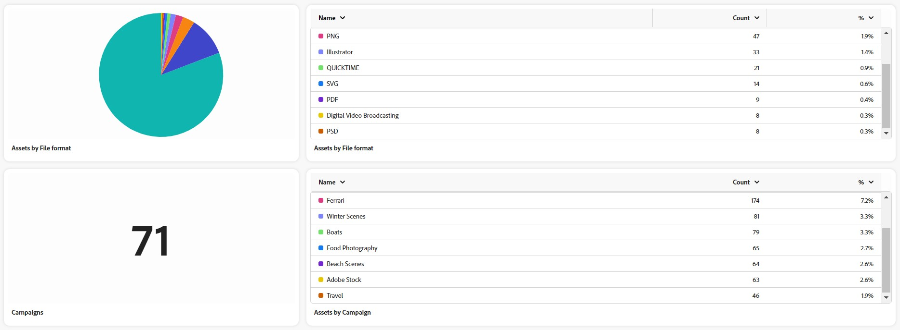

# Assets-Erkenntnisse in [!DNL Content Hub] {#assets-insights}

[!DNL Content Hub] bietet wertvolle Einblicke in Assets und geht eine Herausforderung an, auf die Marketing-Stakeholder häufig stoßen: Asset-Nutzungsstatistiken, die in Marketing-Kampagnen, Kanälen und verschiedenen Regionen verwendet werden. Durch das Erlangen eines klaren Verständnisses der Leistung und Beliebtheit der Assets, liefert es verwertbare Einblicke, die für die Verbesserung des Benutzererlebnisses unerlässlich sind.

## Voraussetzungen {#prerequisites}

[Content Hub-Benutzende](deploy-content-hub.md#onboard-content-hub-users) können die in diesem Artikel genannten Aktionen ausführen.

## Anzeigen von Statistiken für hochgeladene Assets{#view-statistics-for-uploaded-assets}

Sie können Statistiken der hochgeladenen Assets und Sammlungen anzeigen, indem Sie zur Registerkarte **[!UICONTROL Erkenntnisse]** navigieren. Verfolgen Sie den Upload-Verlauf Ihrer Assets mit der Ansicht für jährliche, monatliche und tägliche Asset-Uploads.

<!-- You can track the upload history of your assets over the past 30 days or gain a more comprehensive view with data spanning the last 12 months. This feature enables you to evaluate the upload count of assets.  -->

<!-- Go to the **[!UICONTROL [!DNL Insights]]** tab.

2. Select the desired time frame to view the statistics; you can opt for either last 30 days or last 12 months.

Data for the selected time frame is displayed, including the upload count for the specified duration. -->

## Anzeigen einer detaillierten statistische Analyse{#view-detailed-statistical-analysis}

Mit Content Hub können Sie Statistiken der Asset-Anzahl nach ihrem Dateiformat, ihren Kampagnen, Kanälen und Regionen anzeigen. Sie können wertvolle Einblicke in die Asset-Verteilung gewinnen, wodurch fundierte Entscheidungen getroffen werden können und eine strategische Planung möglich wird.

Die Tabelle enthält einen detaillierten Überblick über verschiedene Assets, einschließlich ihrer Anzahl und des jeweiligen Prozentsatzes innerhalb des Repositorys. Sie können Spaltengrößen anpassen und Assets nach Asset-Name, Anzahl und Prozentsatz sortieren.

Das Tortendiagramm stellt die Gesamtanzahl der Assets visuell nach Dateiformat dar und veranschaulicht die einzelnen Asset-Zahlen und die zugehörigen Prozentsätze.

Sie können außerdem Folgendes anzeigen:

* **Aktive Benutzer nach Tag und Monat**: Anzahl der aktiven Benutzenden nach Tag oder Monat, dargestellt anhand eines Liniendiagramms.
* **[!UICONTROL Assets nach Kampagnen]**: Asset-Anzahl und der jeweilige Prozentsatz basierend auf Kampagnen.
* **[!UICONTROL Assets nach Kanälen]**: Asset-Anzahl und der jeweilige Prozentsatz basierend auf den verwendeten Kanälen.
* **[!UICONTROL Assets nach Regionen]**: Asset-Anzahl und der jeweilige Prozentsatz basierend auf den Regionen der Asset-Verwendung.

## Häufig gestellte Fragen {#faqs-assets-insights-content-hub}

### Was benötigen wir Assets Insights in AEM Assets Content Hub?

Assets Insights in AEM Assets Content Hub bietet wertvolle Daten zur Asset-Nutzungsstatistik für Kampagnen, Kanäle und Regionen und hilft Marketing-Stakeholdern, die Asset-Leistung und -Beliebtheit zu verstehen, um das Anwendererlebnis zu verbessern.

### Wer kann auf die in Assets Insights beschriebenen Funktionen zugreifen?

Content Hub-Benutzende können die im Abschnitt &quot;Assets Insights“ erwähnten Aktionen ausführen und auf die Funktionen zugreifen.

### Welche Asset Insights sind auf der Registerkarte Insights verfügbar?

Sie können die Anzahl der Assets im Repository, die Anzahl der Sammlungen, Assets-Uploads nach Jahr, Monat oder Tag, aktive Benutzende nach Tag oder Monat und die Asset-Klassifizierung anhand von Dateiformaten anzeigen.

### Wie kann ich Statistiken für hochgeladene Assets in AEM Assets Content Hub anzeigen?

Sie können Statistiken für hochgeladene Assets und Sammlungen anzeigen, indem Sie zur Registerkarte Insights navigieren, wo Sie den Upload-Verlauf nach Jahr, Monat oder Tag verfolgen können.

### Welche Metriken kann ich bezüglich der Benutzeraktivität in Content Hub analysieren?

Sie können die Anzahl der aktiven Benutzenden nach Tag oder Monat analysieren, was durch ein Liniendiagramm visuell dargestellt wird.
