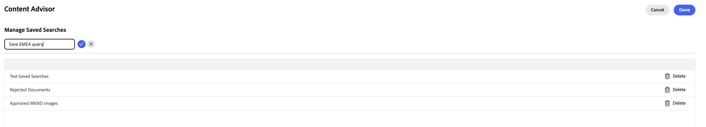

# Verwenden von Content Advisor für den Zugriff auf AEM-Inhalte in Adobe und anderen Programmen als Adobe{#content-advisor-aem-assets-adobe-non-Adobe-applications}

Der Content Advisor bietet ein einheitliches Erlebnis zur Inhaltserkennung für Adobe- und Nicht-Adobe-Anwendungen. Nativ in Anwendungen wie Adobe Workfront, AJO B2C (in Kürze verfügbar), AEM Sites und Nicht-Adobe-Anwendungen integriert, führt Content Advisor Inhalte (Assets und Inhaltsfragmente) in einer einzigen, intelligenten Benutzeroberfläche zusammen. Damit können Sie mühelos die relevantesten Inhalte direkt in Ihrem Workflow entdecken, durchsuchen und wiederverwenden, sodass Sie schneller arbeiten können, ohne den Kontext zu beschädigen.

Content Advisor integriert intelligente, kontextbezogene Erkennung direkt in das Authoring-Erlebnis, sodass Sie schnell relevante, genehmigte Inhalte finden können, die auf Ihrer Absicht basieren. Mit Funktionen wie intelligenten Vorschlägen, Dynamic Media-Ausgabedarstellungen und detaillierten Asset-Metadaten können Sie Inhalte effizient bewerten und wiederverwenden, ohne die Benutzeroberfläche des Programms verlassen zu müssen, was die Inhaltserstellung beschleunigt und gleichzeitig die Markenkonsistenz wahrt.

Adobe Experience Manager (AEM) Assets lässt sich auch nativ mit Adobe Express integrieren, sodass Sie Assets aus AEM Assets mithilfe von Content Advisor direkt in der Express-Oberfläche identifizieren, darauf zugreifen und sie verwenden können. Weitere Informationen finden Sie unter [Verwenden von Content Advisor für den Zugriff auf AEM Assets in Adobe Express](/help/assets/native-integration-adobe-express.md).

## Voraussetzungen {#prerequisites}

* Zugriff auf eine AEM Assets as a Cloud Service-Umgebung.

* Zugriff auf eine AEM Sites-Umgebung mit erstellten Inhaltsfragmenten (nur für die Arbeit mit Inhaltsfragmenten erforderlich). Dies ist für den Zugriff auf binäre Assets oder AEM Assets nicht erforderlich.

## Intelligente Asset-Erkennung mit Content Advisor {#intelligent-asset-discovery-content-advisor}

Der Content Advisor hilft Ihnen, relevante Inhalte mithilfe intelligenter, kontextbezogener Empfehlungen zu ermitteln, die auf den Inhalten oder der Kampagnenbeschreibung Ihrer Adobe-Hostanwendung basieren. Darüber hinaus können Sie kanalfertige Dynamic Media-Ausgabedarstellungen auswählen, die für Ihren Anwendungsfall optimiert sind.

>[!IMPORTANT]
> 
>Stellen Sie sicher, dass Sie ein **author**-Repository aus der Dropdown-Liste **Repository** auswählen. Ein **delivery**-Repository zeigt keine Content Advisor-Funktionen an.
>
> Darüber hinaus sind im **delivery**-Repository keine Inhalte in Ordnern und Sammlungen organisiert. Der Inhalt wird auf der Stammebene in einer flachen Struktur angezeigt.

Content Advisor bietet die folgenden zentralen Funktionen:

* [KI-Suchen für die intelligentere Asset-Erkennung](#content-advisor-ai-search)

* [Intelligente Vorschläge basierend auf Kontext und Absicht](#smart-suggestions-content-advisor)

* [Informationen zu Campaign, um relevante Assets zu finden](#campaign-briefs-content-advisor)

* [Für Dynamic Media verfügbare Asset-Ausgabedarstellungen](#dynamic-media-renditions-content-advisor)

* [Nahtlose Integration mit Inhaltsfragmenten](#content-fragments-integration-content-advisor)

* [Zugriff auf Asset-Metadaten in Übereinstimmung mit der Assets-Ansicht](#asset-metadata-content-advisor)

* [Zugriff auf Filter, die der Assets-Ansicht entsprechen](#filters-content-advisor)

* [Zugreifen auf und Wiederverwenden von zuletzt verwendeten und gespeicherten Suchvorgängen](#saved-searches-content-advisor)

* [Suchen nach Assets in und innerhalb von Sammlungen](#search-collections-content-advisor)

### KI-Suchen für die intelligentere Asset-Erkennung {#content-advisor-ai-search}

Content Advisor verwendet eine erweiterte Suchfunktion, die die Bedeutung und den Zweck hinter der Abfrage eines Benutzers versteht, anstatt sich auf exakte Keyword-Übereinstimmungen zu verlassen. Es nutzt künstliche Intelligenz (KI) und maschinelles Lernen, um genauere und kontextbezogene Ergebnisse zu liefern.

Im Gegensatz zur herkömmlichen schlüsselwortbasierten Suche, die nach exakten Begriffen sucht, interpretiert die KI-Suche die Beziehungen zwischen Wörtern, Konzepten und der Absicht der Benutzenden. Dadurch wird sichergestellt, dass Benutzende das Gesuchte finden – selbst wenn die Abfrage anders formuliert ist, Tippfehler enthält oder in einer anderen Sprache verfasst ist.

Zu den wichtigsten Vorteilen zählen:

* Mehrsprachige Unterstützung: Suchen Sie über mehrere Sprachen hinweg, ohne dass genaue Übersetzungen erforderlich sind. Benutzende können relevante Inhalte unabhängig von ihrer Abfragesprache finden.

* Verarbeitet Rechtschreibfehler: Interpretiert Tippfehler und Rechtschreibfehler, sodass auch bei unvollständiger Eingabe korrekte Ergebnisse erzielt werden.

* Versteht Synonyme: Liefert Ergebnisse für verwandte Begriffe und Ausdrücke, sodass Benutzende nicht das richtige Keyword erraten müssen.

* Kontextabhängige Suche: Erkennt den Zweck einer Abfrage, nicht nur die genauen Wörter.

>[!IMPORTANT]
> 
>* Die mindestens erforderliche AEM-Versionsversion für den Zugriff auf KI-Suchen in Content Advisor ist `21994`
>* Die Unterstützung von KI-Suchen für Inhaltsfragmente wird in Kürze verfügbar sein.

### Intelligente Vorschläge basierend auf Kontext und Absicht {#smart-suggestions-content-advisor}

Der Inhaltsratgeber zeigt intelligente Vorschläge basierend auf dem Kontext der Adobe-Hostanwendung an. So können Sie schnell Assets erkennen und verwenden, die Ihren Inhaltsanforderungen entsprechen, ohne die zeitaufwendige manuelle Suche durchführen zu müssen.

>[!IMPORTANT]
> 
>* Sie müssen einen GenAI-Treiber signieren, um in Content Advisor auf diese Funktion zugreifen zu können. Um GenAI Rider zu unterzeichnen, kontaktieren Sie Ihren Adobe-Support-Mitarbeiter.
>* Die mindestens erforderliche AEM-Release-Version für den Zugriff auf diese Funktion ist `21994`.
>* Der Inhaltsratgeber zeigt intelligente Vorschläge basierend auf dem Kontext und der Absicht der Inhalte an, die in der Adobe-Hostanwendung verfügbar sind. Es werden keine Ergebnisse basierend auf Bildern angezeigt. Unter [Unterstützung von Content Advisor-Funktionen in allen Adobe](#content-advisor-feature-support-adobe-applications) finden Sie eine Liste der unterstützten Adobe-Anwendungen, die diese Funktion unterstützen.

### Informationen zu Campaign, um relevante Assets zu finden {#campaign-briefs-content-advisor}

Mit Content Advisor können Sie ein Kampagnenübersichtsdokument hochladen, um relevante Assets zu ermitteln, ohne Suchbegriffe manuell eingeben zu müssen. Der Content Advisor analysiert die Informationen in der Kampagnenbeschreibung, um die Kampagnenzielsetzung zu verstehen, und empfiehlt relevante Assets, die in AEM Assets verfügbar sind.

>[!IMPORTANT]
>
>* Content Advisor analysiert die Informationen, die als Text in der Kampagnenbeschreibung verfügbar sind, um relevante Assets zu empfehlen. Die Informationen, die als Bilder in der Kampagnenbeschreibung verfügbar sind, werden nicht analysiert.
>* Zu den unterstützten Dateitypen, die Sie als Kampagnenübersicht hochladen können, gehören PDF-, DOCX- und TXT-Dokumente.
>* Sie müssen einen GenAI-Treiber signieren, um in Content Advisor auf diese Funktion zugreifen zu können. Um GenAI Rider zu unterzeichnen, kontaktieren Sie Ihren Adobe-Support-Mitarbeiter.
>* Die mindestens erforderliche AEM-Release-Version für den Zugriff auf diese Funktion ist `21994`.
>* Hochladen der Campaign-Kurzunterstützung wird bald für Inhaltsfragmente verfügbar sein.

### Für Dynamic Media verfügbare Asset-Ausgabedarstellungen {#dynamic-media-renditions-content-advisor}

Dynamic Media-Ausgabedarstellungen bieten einsatzbereite, kanaloptimierte Versionen von Assets, einschließlich [Bildvorgaben](/help/assets/dynamic-media/managing-image-presets.md), [Smartes Zuschneiden](/help/assets/dynamic-media/image-profiles.md), Formattypen und Farbprofilen. Mit diesen Ausgabedarstellungen können Sie sicherstellen, dass das ausgewählte Asset den Kanal- und Design-Anforderungen entspricht, ohne dass eine manuelle Bearbeitung oder Duplizierung des Assets erforderlich ist.

Sie können Dynamic Media-Modifikatoren auch anwenden, um Anpassungen in Echtzeit anzuzeigen, bevor Sie die Ausgabedarstellung für das Adobe-Host-Programm auswählen, was eine schnellere Auswahl der am besten geeigneten Ausgabedarstellung ermöglicht und dabei die Konsistenz und Qualität des Assets wahrt.

Klicken Sie auf das Symbol  auf der Asset-Karte und wählen Sie die Registerkarte **[!UICONTROL Dynamic Media]** aus, um die verfügbaren Ausgabedarstellungen für ein Asset anzuzeigen. Sie können die Ausgabedarstellungen [Dynamic Media Scene7) oder &#x200B;](/help/assets/dynamic-media/dynamic-media.md)Dynamic Media mit [OpenAPI) &#x200B;](/help/assets/dynamic-media-open-apis-overview.md). Wenn Sie **[!UICONTROL OpenAPI]** für ein Asset auswählen, werden die verfügbaren Ausgabedarstellungen nur angezeigt, wenn das Asset genehmigt wurde und für Dynamic Media mit OpenAPI verfügbar ist.

Sie müssen über eine gültige AEM Dynamic Media-Lizenz verfügen, um die Registerkarte „Dynamic Media“ anzeigen zu können.

Klicken Sie auf das , um eine Vorschau der Ausgabedarstellung anzuzeigen, oder klicken Sie auf den Namen der Ausgabedarstellung und klicken Sie auf **[!UICONTROL Auswählen]**, um die Ausgabedarstellung in Ihrer Hostanwendung verfügbar zu machen.

Klicken Sie auf **[!UICONTROL Modifikatoren hinzufügen]**, geben Sie einen Modifikator im Textfeld an und drücken Sie die Eingabetaste , um die Umwandlung in Echtzeit auf alle Asset-Ausgabedarstellungen anzuwenden. Auf ähnliche Weise können Sie mehrere Modifikatoren zu Ausgabedarstellungen hinzufügen und eine Vorschau dieser Umwandlungen anzeigen. Klicken Sie auf den Namen der Ausgabedarstellung und anschließend auf **[!UICONTROL Auswählen]**, um die Ausgabedarstellung in der Hostanwendung verfügbar zu machen. Die Ausgabedarstellung nach Anwendung dieser Modifikatoren wird nicht gespeichert. Eine Liste der unterstützten Modifikatoren für [Dynamic Media Scene7](https://experienceleague.adobe.com/de/docs/dynamic-media-developer-resources/image-serving-api/image-serving-api/http-protocol-reference/command-reference/c-command-reference) und [Dynamic Media mit OpenAPI](https://developer.adobe.com/experience-cloud/experience-manager-apis/api/stable/assets/delivery/#operation/getAssetSeoFormat) finden Sie.

### Auffinden von Inhaltsfragmenten {#content-fragments-discovery-content-advisor}

Der Inhaltsratgeber bietet die Erkennung von Inhaltsfragmenten, sodass Sie Fragmente einfach durchsuchen und in unterstützte Adobe-Programme integrieren können. Durchsuchen Sie eine Liste von Inhaltsfragmenten und wählen Sie die relevantesten Inhalte aus, ohne den aktuellen Workflow verlassen zu müssen.

Jedes Inhaltsfragment wird als Karte mit einer Live-Miniaturansicht dargestellt, die aus seinem Inhalt generiert wird, sodass Sie das richtige Fragment schnell identifizieren können. Die Karte zeigt auch wichtige Details wie den Titel und den Status (Entwurf, geändert oder veröffentlicht) an. Um tiefere Einblicke zu erhalten, klicken Sie auf das Symbol , um detaillierte Eigenschaften, Verweise auf andere Inhaltsfragmente und verfügbare Varianten anzuzeigen und so eine fundierte Inhaltsauswahl und -wiederverwendung sicherzustellen.

>[!IMPORTANT]
> 
>* KI-Suchen, Smart Suggestions, Upload-Kampagnenbeschreibungen und Vorschau-Funktionen werden für Inhaltsfragmente in Content Advisor noch nicht unterstützt.

### Zugriff auf Asset-Metadaten in Übereinstimmung mit der Assets-Ansicht {#asset-metadata-content-advisor}

Der Content Advisor bietet Zugriff auf Asset-Eigenschaften, die in AEM Assets definiert sind, einschließlich der in der Assets-Ansicht verfügbaren Metadaten. Content Advisor verwendet dieselbe Metadatenkonfiguration wie in der Assets-Ansicht und repliziert so die Liste der Metadaten-Registerkarten und Inhalte auf der Detailseite für Assets-Asset anzeigen . Auf diese Weise können Sie wichtige Asset-Details wie Titel, Beschreibung, Format, Größe und andere Metadaten überprüfen, bevor Sie ein Asset auswählen. Durch den Zugriff auf Asset-Eigenschaften können Sie sicherstellen, dass Sie das richtige und genehmigte Asset für Ihren Inhalt auswählen.

Klicken Sie auf das Symbol  auf der Asset-Karte und wählen Sie die Registerkarte **[!UICONTROL Standard]** aus, um die Asset-Metadaten anzuzeigen. Sie können auch andere Asset-Metadaten-Registerkarten wie Produkt, Kampagne und Tags anzeigen, die mit den Asset-Metadaten in der Assets-Ansicht konsistent sind.

Content Advisor zeigt Eigenschaften (Metadaten) für Dateien in einer schreibgeschützten Ansicht an. Die Eigenschaften werden für Sammlungen und Ordner nicht angezeigt.

### Zugriff auf Filter, die der Assets-Ansicht entsprechen {#filters-content-advisor}

Content Advisor bietet dieselben Filterfunktionen innerhalb Ihrer Adobe-Hostanwendung, die auch in der Assets-Ansicht verfügbar sind, sodass Sie Assets mithilfe vordefinierter Filter einschränken können. Die gleichen Filterfunktionen, die in der Assets-Ansicht verfügbar sind, gelten auch für die Filter, die speziell für Inhaltstypen wie Dateien, Ordner und Sammlungen gelten. Dadurch wird ein konsistentes Asset-Erkennungserlebnis sichergestellt und Sie können relevante Assets in Ihrer Adobe-Hostanwendung effizient finden.

Wenn Sie in der Assets-Ansicht keine Filter über das Filterschema eingerichtet haben, zeigt Content Advisor vordefinierte Filter an, darunter Dateityp, Dateiformat, Asset-Status, Dateigröße, Bildbreite, Bildhöhe, Änderungsdatum und Erstellungsdatum.

Benutzerdefiniertes Filterschema wird für Assets (Dateien) unterstützt, aber noch nicht für Ordner und Sammlungen.

### Zugreifen auf und Wiederverwenden von zuletzt verwendeten und gespeicherten Suchvorgängen {#saved-searches-content-advisor}

Gespeicherte Suchvorgänge, die in der Assets-Ansicht erstellt wurden, sind ebenfalls verfügbar, sodass Sie vordefinierte Suchkriterien wiederverwenden können. Gespeicherte Suchen funktionieren browserübergreifend konsistent zwischen Assets-Ansicht und Inhaltsratgeber. Auf diese Weise können Sie Assets mithilfe konsistenter Suchmuster in AEM Assets und anderen Adobe-Programmen effizient finden.

So speichern Sie Ihre häufig verwendete Suche mit Content Advisor:

1. Geben Sie einen Suchbegriff an (optional), klicken Sie auf das Symbol Filter und wählen Sie die Optionen entsprechend Ihren Anforderungen aus, um eine Suchabfrage zu erstellen.

1. Klicken Sie **Gespeicherte Suchen verwalten** > **Neue gespeicherte Suche erstellen**.

1. Geben Sie den Namen der Suche an und klicken Sie auf , um sie zu speichern. Die Suche wird in der Liste der Elemente angezeigt.

   

Um eines der gespeicherten Suchelemente anzuwenden, wählen Sie das Suchelement aus der Dropdown-Liste **[!UICONTROL Gespeicherte Suchen]** aus. Content Advisor zeigt die Ergebnisse basierend auf der Suchabfrage an.

Der Content Advisor speichert Ihre letzten Suchvorgänge und ermöglicht Ihnen auch, häufig verwendete Suchvorgänge für den späteren Schnellzugriff zu speichern. Die Liste der letzten Suchvorgänge ist zwischen der Assets-Ansicht und dem Inhaltsratgeber nicht konsistent. Derselbe Benutzer kann in der Ansicht &quot;Assets&quot; und im Inhaltsratgeber über verschiedene kürzlich durchgeführte Suchvorgänge verfügen. Wenn Sie den Inkognito-Modus verwenden, um auf den Inhaltsratgeber zuzugreifen, ist die Liste der letzten Suchvorgänge nicht verfügbar. Außerdem werden aktuelle Suchvorgänge nicht in verschiedenen Browsern für denselben Benutzer freigegeben und sind AEM-umgebungsspezifisch.

Die in der Assets-Ansicht verfügbare Standardfunktion für die Suche nach gespeicherten Daten ist noch nicht in Content Advisor verfügbar.

### Suchen nach Assets in und innerhalb von Sammlungen {#search-collections-content-advisor}

Mit Content Advisor können Sie über alle Sammlungen hinweg nach Assets oder Sammlungen suchen oder Ihre Suche auf eine bestimmte Sammlung beschränken. Auf diese Weise können Sie Assets aus kuratierten Sammlungen schnell finden und verwenden und gleichzeitig den beabsichtigten Organisationskontext beibehalten.

## Unterstützung von Content Advisor-Funktionen in allen Adobe-Anwendungen {#content-advisor-feature-support-adobe-applications}

Die folgende Tabelle zeigt die Unterstützung der Content Advisor-Funktionen in allen Adobe-Programmen.

>[!IMPORTANT]
> 
> Wenn Content Advisor auf weitere Adobe-Anwendungen erweitert wird, wird diese Tabelle aktualisiert, um die neueste Unterstützung widerzuspiegeln.

| Anwendung | Unterstützung für einen kurzen Upload zur Suche in Assets | Unterstützung für das Bedienfeld „Empfohlene Inhalte“ bei der Suche nach Assets | Unterstützung für das Dynamic Media-Bedienfeld bei der Suche nach Assets | Unterstützung für die Suche nach Inhaltsfragmenten |
|--------------------------------------|----------------------------------------------|-----------------------------------------------------------|--------------------------------------------------------|------------------------------------------|
| [Adobe Express](/help/assets/native-integration-adobe-express.md) | ✓ | ✓ | ✓ | − |
| [AEM Sites - Dokumenterstellung](https://www.aem.live/docs/authoring-guide#document-authoring) | ✓ | ✓ | ✓ | − |
| [AEM Sites - Universeller Editor](https://www.aem.live/docs/authoring-guide#universal-editor-in-aem-sites) | ✓ | ✓ | ✓ | − |
| AEM Sites - [GoogleDrive](https://www.aem.live/docs/authoring-guide#google-drive)/[Sharepoint-Authoring](https://www.aem.live/docs/authoring-guide#microsoft-sharepoint) | ✓ | − | ✓ | − |
| AEM Sites - Inhaltsfragment-Editor (nur im Inhaltsreferenz -Feld) | ✓ | ✓ | ✓ | − |
| Adobe Workfront-Workflow | ✓ | ✓ | − | ✓ |
| Adobe Workfront-Planung | ✓ | ✓ | − | ✓ |
| [AEM Assets-Ansicht](/help/assets/assets-view-introduction.md) | ✓ | − | − | − |
| [AEM Content Hub](/help/assets/product-overview.md) | ✓ | ✓ | − | − |

## Unterstützung von Content Advisor-Funktionen in Nicht-Adobe-Anwendungen {#content-advisor-feature-support-non-adobe-applications}

Content Advisor ist auch für die Integration mit Anwendungen anderer Anbieter als Adobe verfügbar, wodurch die intelligente Asset-Erkennung über Adobe-Anwendungen hinaus erweitert werden kann. Derselbe umfangreiche Funktionssatz, einschließlich KI-gestützter Suche, kontextabhängiger Empfehlungen, kurzbasierter Erkennung in Campaign, Zugriff auf Dynamic Media-Ausgabedarstellungen, Erkennung von Inhaltsfragmenten, Filtern und Asset-Metadaten, wird in Integrationen von Drittanbietern unterstützt.

Auf diese Weise können Sie genehmigte Assets aus AEM Assets direkt in Ihren externen Programmen erkennen, auswerten und verwenden und gleichzeitig die Konsistenz mit den in Adobe Express und anderen Adobe-Programmen verfügbaren Erlebnissen wahren.

Weitere Informationen zu Integrationen, Eigenschaften und Anpassungen finden Sie in den folgenden Artikeln:

* [Beispiele für die Integration von Content Advisor](https://github.com/adobe/aem-assets-selectors-mfe-examples/tree/consolidate-docs-to-experience-league/examples)

* [Eigenschaften von Content Advisor](/help/assets/content-advisor-properties.md)

* [Anpassungen von Content Advisor](/help/assets/content-advisor-customization.md)
