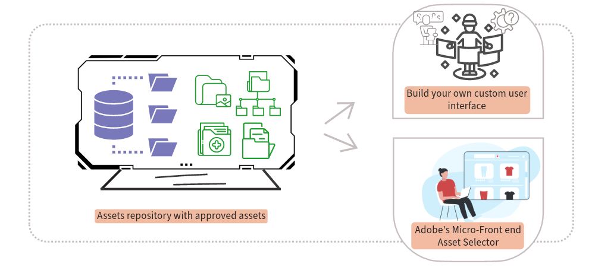

# Integrieren von AEM Assets mit nachgelagerten Anwendungen {#integrate-dynamic-media-open-apis}

<table>
    <tr>
        <td>
            <i>Neu</i> <a href="/help/assets/dynamic-media/dm-prime-ultimate.md"><b>Dynamic Media Prime und Ultimate</b></a>
        </td>
        <td>
            <i>Neu</i> <a href="/help/assets/assets-ultimate-overview.md"><b>AEM Assets Ultimate</b></a>
        </td>
        <td>
            <i>Neu</i> <a href="/help/assets/integrate-aem-assets-edge-delivery-services.md"><b>AEM Assets-Integration mit Edge Delivery Services</b></a>
        </td>
        <td>
            <i>Neu</i> <a href="/help/assets/aem-assets-view-ui-extensibility.md"><b>Erweiterbarkeit der Benutzeroberfläche</b></a>
        </td>
          <td>
            <i>Neu</i> <a href="/help/assets/dynamic-media/enable-dynamic-media-prime-and-ultimate.md"><b>Aktivieren von Dynamic Media Prime und Ultimate</b></a>
        </td>
    </tr>
    <tr>
        <td>
            <a href="/help/assets/search-best-practices.md"><b>Best Practices für die Suche</b></a>
        </td>
        <td>
            <a href="/help/assets/metadata-best-practices.md"><b>Best Practices für Metadaten</b></a>
        </td>
        <td>
            <a href="/help/assets/product-overview.md"><b>Content Hub</b></a>
        </td>
        <td>
            <a href="/help/assets/dynamic-media-open-apis-overview.md"><b>Dynamic Media mit OpenAPI-Funktionen</b></a>
        </td>
        <td>
            <a href="https://developer.adobe.com/experience-cloud/experience-manager-apis/"><b>Entwicklerdokumentation zu AEM Assets</b></a>
        </td>
    </tr>
</table>

>[!AVAILABILITY]
>
>Das Handbuch zu Dynamic Media mit OpenAPI-Funktionen ist jetzt im PDF-Format verfügbar. Laden Sie das gesamte Handbuch herunter und verwenden Sie den KI-Assistenten von Adobe Acrobat, um Ihre Fragen zu beantworten.
>
>[!BADGE Handbuch zu Dynamic Media mit OpenAPI-Funktionen als PDF]{type=Informative url="https://helpx.adobe.com/content/dam/help/en/experience-manager/aem-assets/dynamic-media-with-openapi-capabilities.pdf"}

Alle [genehmigten Assets](/help/assets/approve-assets.md), die im Experience Manager Assets-Repository verfügbar sind, stehen für die Bereitstellung an nachgelagerte Anwendungen zur Verfügung.

Sie können entweder Ihre eigene benutzerdefinierte Benutzeroberfläche mit dem Experience Manager Assets-Repository integrieren, indem Sie die Such- und Bereitstellungs-APIs verwenden, oder den Micro-Frontend-Asset-Wähler von Adobe verwenden.

Mit den APIs können Sie die genehmigten Assets aus dem AEM Assets-Repository durchsuchen und die Assets anschließend mithilfe einer Bereitstellungs-URL an nachgelagerte Anwendungen senden. Weitere Informationen finden Sie unter [Such](/help/assets/search-assets-api.md)- und [Bereitstellungs](/help/assets/deliver-assets-apis.md)-APIs.

Der Micro-Frontend-Asset-Wähler von Adobe bietet eine Benutzeroberfläche, die sich problemlos mit dem [!DNL Experience Manager Assets as a Cloud Service]-Repository integrieren lässt, sodass Sie die im Repository verfügbaren genehmigten digitalen Assets durchsuchen und für die Erstellung von Anwendungen verwenden können. Weitere Informationen finden Sie unter [Micro-Frontend-Asset-Wähler](/help/assets/overview-asset-selector.md).

>[!MORELIKETHIS]
>
>* [Integrieren des Asset-Wählers mit verschiedenen Anwendungen](/help/assets/integrate-asset-selector.md)
>* [Eigenschaften des Asset-Wählers](/help/assets/asset-selector-properties.md)
>* [Anpassungen des Asset-Wählers](/help/assets/asset-selector-customization.md)
