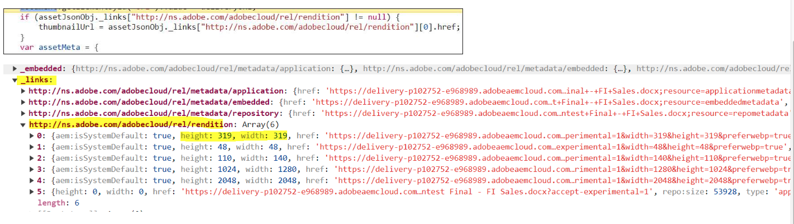

# Integrieren in Dynamic Media mit OpenAPI-Funktionen {#integrate-dynamic-media-openapis}

Content Advisor ermöglicht die Integration mithilfe verschiedener Adobe-Programme, sodass diese nahtlos zusammenarbeiten können.

## Voraussetzungen {#prereqs-polaris}

Verwenden Sie die folgenden Voraussetzungen, wenn Sie Content Advisor mit Dynamic Media mit OpenAPI-Funktionen integrieren:

* [Kommunikationsmethoden](/help/assets/content-advisor-properties.md#prereqs)
* Für den Zugriff auf Dynamic Media mit OpenAPI-Funktionen benötigen Sie folgende Lizenzen:
   * Assets-Repository (z. B. Experience Manager Assets as a Cloud Service)
   * AEM und Dynamic Media.
* Nur [genehmigte Assets](/help/assets/approve-assets.md) zur Verwendung verfügbar, um die Markenkonsistenz sicherzustellen.

## Integrieren in Dynamic Media mit OpenAPI-Funktionen {#adobe-app-integration-polaris}

Die Integration von Content Advisor in den OpenAPI-Prozess von Dynamic Media umfasst verschiedene Schritte, darunter die Erstellung einer benutzerdefinierten Dynamic Media-URL oder einer einsatzbereiten Dynamic Media-URL usw.

### Integrieren von Content Advisor für Dynamic Media mit OpenAPI-Funktionen {#integrate-dynamic-media}

Die Eigenschaften `rootPath` und `path` sollten nicht Teil von Dynamic Media mit OpenAPI-Funktionen sein. Stattdessen können Sie die Eigenschaft `aemTierType` konfigurieren. Die Syntax der Konfiguration ist wie folgt:

```
aemTierType:[1: "delivery"]
```

Mit dieser Konfiguration können Sie alle genehmigten Assets ohne Ordner oder als flache Struktur anzeigen. Weitere Informationen finden Sie in `aemTierType` Eigenschaft unter [Content Advisor-Eigenschaften](/help/assets/content-advisor-properties.md).


### Erstellen einer dynamischen Bereitstellungs-URL aus genehmigten Assets {#create-dynamic-media-url}

Nachdem Sie Content Advisor eingerichtet haben, wird ein Schema von Objekten verwendet, um eine dynamische Bereitstellungs-URL aus den ausgewählten Assets zu erstellen.Hier ist ein Beispiel für ein Schema eines Objekts aus einem Array von Objekten, das bei Auswahl eines Assets empfangen wird:

```
{
"dc:format": "image/jpeg",
"repo:assetId": "urn:aaid:aem:xxxxxxxx-xxxx-xxxx-xxxx-xxxxxxxxxxxx",
"repo:name": "image-7.jpg",
"repo:repositoryId": "delivery-pxxxx-exxxxxx.adobe.com",
...
}
```

Der Carrier für alle ausgewählten Assets ist die `handleSelection`-Funktion, die als JSON-Objekt fungiert. Beispiel: `JsonObj`. Die dynamische Versand-URL wird durch die Kombination der folgenden Carrier erstellt:

| Objekt | JSON |
|---|---|
| Host | `assetJsonObj["repo:repositoryId"]` |
| API-Stamm | `/adobe/assets` |
| asset-id | `assetJsonObj["repo:assetId"]` |
| seo-name | `assetJsonObj["repo:name"].split(".").slice(0,-1).join(".")` |
| format | `.jpg` |

#### API-Spezifikation für die Bereitstellung genehmigter Assets {#approved-assets-delivery-api-specification}

URL-Format:


Dabei gilt Folgendes:

* Der Host ist `https://delivery-pxxxxx-exxxxxx.adobe.com`
* Der API-Stamm lautet `"/adobe/assets"`
* `<asset-id>` ist die Asset-Kennung
* `as` ist der konstante Teil der OpenAPI-Spezifikation, der angibt, wie das Asset bezeichnet werden soll
* `<seo-name>` ist der Name eines Assets
* `<format>` ist das Ausgabeformat
* `<image modification query parameters>`, wie von der API-Spezifikation für die Bereitstellung genehmigter Assets unterstützt.

#### API für die Bereitstellung genehmigter Assets für die Original-Ausgabedarstellung {#approved-assets-delivery-api}

Die URL des dynamischen Versands weist die folgende Syntax auf:
`https://<delivery-api-host>/adobe/assets/<asset-id>/original/as/<seo-name>`, wobei

* Der Host ist `https://delivery-pxxxxx-exxxxxx.adobe.com`
* Der API-Stamm für die Bereitstellung der Original-Ausgabedarstellung lautet `"/adobe/assets"`
* `<asset-id>` ist die Asset-Kennung
* `/original/as` ist der konstante Teil der OpenAPI-Spezifikation, der angibt, wie die Original-Ausgabedarstellung bezeichnet werden soll
* `<seo-name>`ist der Name des Assets, das eine Erweiterung aufweisen kann

### Auswahlbereite dynamische Bereitstellungs-URL {#ready-to-pick-dynamic-delivery-url}

Der Carrier für alle ausgewählten Assets ist die `handleSelection`-Funktion, die als JSON-Objekt fungiert. Beispiel: `JsonObj`. Die dynamische Versand-URL wird durch die Kombination der folgenden Carrier erstellt:

| Objekt | JSON |
|---|---|
| Host | `assetJsonObj["repo:repositoryId"]` |
| API-Stamm | `/adobe/assets` |
| asset-id | `assetJsonObj["repo:assetId"]` |
| seo-name | `assetJsonObj["repo:name"]` |

Im Folgenden werden die beiden Möglichkeiten zum Durchlaufen des JSON-Objekts beschrieben:



* **Miniaturansicht:** Bei Miniaturansichten kann es sich um Bilder und Assets wie PDF, Videos usw. handeln. Sie können jedoch die Höhe- und Breitenattribute der Miniaturansicht eines Assets als Ausgabedarstellung für die dynamische Bereitstellung verwenden.Der folgende Satz von Ausgabedarstellungen kann für Assets vom Typ PDF verwendet werden:
Sobald eine PDF-Datei im Sidekick ausgewählt wurde, bietet der Auswahlkontext die folgenden Informationen. Nachstehend wird beschrieben, wie Sie das JSON-Objekt durchlaufen:

  <!---->

  Im Screenshot oben finden Sie unter `selection[0].....selection[4]` den Link für das Array der Ausgabedarstellung. Die Haupteigenschaften einer der Miniaturausgabedarstellungen umfassen beispielsweise Folgendes:

  ```
  { 
      "height": 319, 
      "width": 319, 
      "href": "https://delivery-pxxxxx-exxxxx.adobeaemcloud.com/adobe/assets/urn:aaid:aem:8560f3a1-d9cf-429d-a8b8-d81084a42d41/as/algorithm design.jpg?width=319&height=319", 
      "type": "image/webp" 
  } 
  ```

Im obigen Screenshot muss die Versand-URL der Original-Ausgabedarstellung der PDF-Datei in das Zielerlebnis integriert werden, wenn eine PDF-Datei erforderlich ist und nicht ihre Miniaturansicht. Zum Beispiel: `https://delivery-pxxxxx-exxxxx.adobeaemcloud.com/adobe/assets/urn:aaid:aem:8560f3a1-d9cf-429d-a8b8-d81084a42d41/original/as/algorithm design.pdf`

* **Video:** Sie können die Video-Player-URL für die Assets vom Typ „Video“ verwenden, die einen eingebetteten iFrame verwenden. Sie können die folgenden Array-Ausgabedarstellungen im Zielerlebnis verwenden:  <!---->

  ```
  { 
      "height": 319, 
      "width": 319, 
      "href": "https://delivery-pxxxxx-exxxxx.adobeaemcloud.com/adobe/assets/urn:aaid:aem:2fdef732-a452-45a8-b58b-09df1a5173cd/as/DragDrop.2.jpg?width=319&height=319", 
      "type": "image/webp" 
  } 
  ```

  Im Screenshot oben finden Sie unter `selection[0].....selection[4]` den Link für das Array der Ausgabedarstellung. Die Haupteigenschaften einer der Miniaturausgabedarstellungen umfassen beispielsweise Folgendes:

  Das Code-Fragment im obigen Screenshot ist ein Beispiel für ein Video-Asset. Es enthält das Array der Ausgabedarstellungs-Links. `selection[5]` im Auszug ist das Beispiel für die Miniaturansicht eines Bildes, die als Platzhalter für die Miniaturansicht eines Videos im Zielerlebnis verwendet werden kann. `selection[5]` im Array der Ausgabedarstellungen ist für den Video-Player vorgesehen. Dies dient als HTML und kann als `src` des iFrames festgelegt werden. Es unterstützt das Streaming mit adaptiver Bitrate (die Web-optimierte Bereitstellung des Videos).

  Im obigen Beispiel lautet die URL des Video-Players wie folgt: `https://delivery-pxxxxx-exxxxx.adobeaemcloud.com/adobe/assets/urn:aaid:aem:2fdef732-a452-45a8-b58b-09df1a5173cd/play`

### Konfigurieren benutzerdefinierter Filter {#configure-custom-filters-dynamic-media-open-api}

Content Advisor für Dynamic Media mit OpenAPI-Funktionen ermöglicht die Konfiguration benutzerdefinierter Eigenschaften und der darauf basierenden Filter. Die Eigenschaft `filterSchema` wird zum Konfigurieren solcher Eigenschaften verwendet. Die Anpassung kann als `metadata.<metadata bucket>.<property name>.` verfügbar gemacht werden, womit die Filter konfiguriert werden können. Dabei gilt Folgendes:

* Bei `metadata` handelt es sich um die Informationen eines Assets
* Bei `embedded` handelt es sich um den statischen Parameter, der für die Konfiguration verwendet wird
* Bei `<propertyname>` handelt es sich um den Filternamen, den Sie konfigurieren

Für die Konfiguration werden die auf Ebene `jcr:content/metadata/` definierten Eigenschaften für die zu konfigurierenden Filter als `metadata.<metadata bucket>.<property name>.` verfügbar gemacht.

In Content Advisor für Dynamic Media mit OpenAPI-Funktionen wird beispielsweise eine Eigenschaft auf `asset jcr:content/metadata/client_name:market` zur Filterkonfiguration in `metadata.embedded.client_name:market` konvertiert.

Um den Namen abzurufen, muss eine einmalige Aktivität durchgeführt werden. Führen Sie einen Such-API-Aufruf für das Asset aus und rufen Sie den Eigenschaftsnamen (also den Bucket) ab.


**Siehe auch**

* [Assets übersetzen](/help/assets/translate-assets.md)
* [Assets-HTTP-API](/help/assets/mac-api-assets.md)
* [Von AEM Assets unterstützte Dateiformate](/help/assets/file-format-support.md)
* [Suchen von Assets](/help/assets/search-assets.md)
* [Connected Assets](/help/assets/use-assets-across-connected-assets-instances.md)
* [Asset-Berichte](/help/assets/asset-reports.md)
* [Metadatenschemata](/help/assets/metadata-schemas.md)
* [Herunterladen von Assets](/help/assets/download-assets-from-aem.md)
* [Verwalten von Metadaten](/help/assets/manage-metadata.md)
* [Verwalten von Dynamic Media-Vorlagen](/help/assets/dynamic-media/manage-dynamic-media-templates.md)
* [Verwalten von Berichten](/help/assets/manage-reports-assets-view.md)
* [Suchfacetten](/help/assets/search-facets.md)
* [Verwalten von Sammlungen](/help/assets/manage-collections.md)
* [Massenimport von Metadaten](/help/assets/metadata-import-export.md)
* [Veröffentlichen von Assets in AEM und Dynamic Media](/help/assets/publish-assets-to-aem-and-dm.md)
