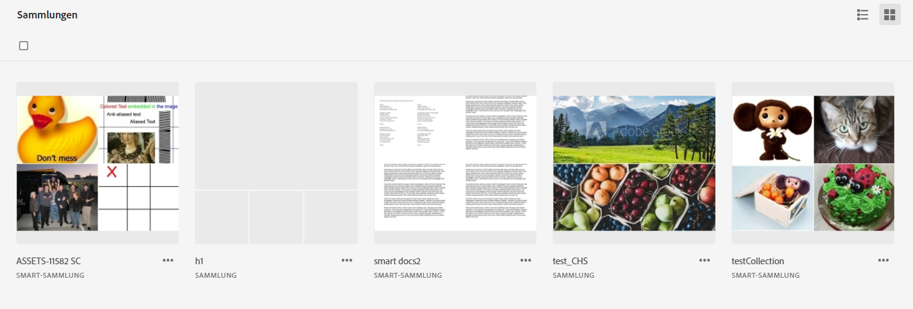
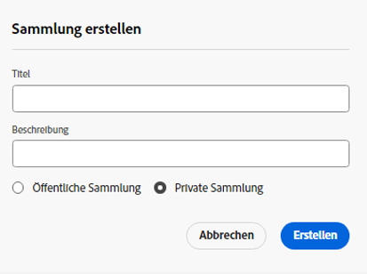
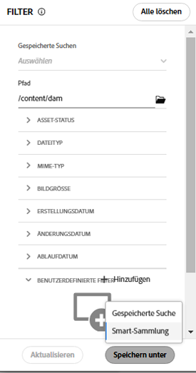
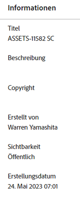
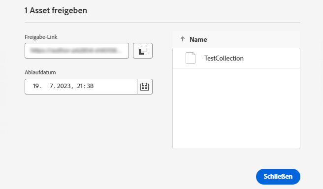

# Verwalten von Sammlungen {#manage-collections}

<table>
    <tr>
        <td>
            <i>Neu</i> <a href="/help/assets/dynamic-media/dm-prime-ultimate.md"><b>Dynamic Media Prime und Ultimate</b></a>
        </td>
        <td>
            <i>Neu</i> <a href="/help/assets/assets-ultimate-overview.md"><b>AEM Assets Ultimate</b></a>
        </td>
        <td>
            <i>Neu</i> <a href="/help/assets/integrate-aem-assets-edge-delivery-services.md"><b>AEM Assets-Integration mit Edge Delivery Services</b></a>
        </td>
        <td>
            <i>Neu</i> <a href="/help/assets/aem-assets-view-ui-extensibility.md"><b>Erweiterbarkeit der Benutzeroberfläche</b></a>
        </td>
          <td>
            <i>Neu</i> <a href="/help/assets/dynamic-media/enable-dynamic-media-prime-and-ultimate.md"><b>Aktivieren von Dynamic Media Prime und Ultimate</b></a>
        </td>
    </tr>
    <tr>
        <td>
            <a href="/help/assets/search-best-practices.md"><b>Best Practices für die Suche</b></a>
        </td>
        <td>
            <a href="/help/assets/metadata-best-practices.md"><b>Best Practices für Metadaten</b></a>
        </td>
        <td>
            <a href="/help/assets/product-overview.md"><b>Content Hub</b></a>
        </td>
        <td>
            <a href="/help/assets/dynamic-media-open-apis-overview.md"><b>Dynamic Media mit OpenAPI-Funktionen</b></a>
        </td>
        <td>
            <a href="https://developer.adobe.com/experience-cloud/experience-manager-apis/"><b>Entwicklerdokumentation zu AEM Assets</b></a>
        </td>
    </tr>
</table>

>[!CONTEXTUALHELP]
>id="assets_collections"
>title="Verwalten von Sammlungen"
>abstract="Eine Sammlung ist ein Satz von Assets, Ordnern oder sonstigen Sammlungen in der Assets-Ansicht. Anhand von Sammlungen können Assets von mehreren Benutzenden gemeinsam verwendet werden. Im Gegensatz zu Ordnern kann eine Sammlung Assets von verschiedenen Speicherorten enthalten. Sie können mehrere Sammlungen für eine Benutzerin bzw. einen Benutzer freigeben. Jede Sammlung enthält Verweise auf Assets. Die referenzielle Integrität von Assets wird sammlungsübergreifend aufrechterhalten."

Eine Sammlung ist ein Satz von Assets, Ordnern oder sonstigen Sammlungen in der Adobe Experience Manager Assets-Ansicht. Anhand von Sammlungen können Assets von mehreren Benutzenden gemeinsam verwendet werden.

Im Gegensatz zu Ordnern kann eine Sammlung Assets von verschiedenen Speicherorten enthalten.

<!--
You can share collections with various users that are assigned different levels of privileges, including viewing, editing, and so on.
-->

Sie können mehrere Sammlungen für eine Benutzerin bzw. einen Benutzer freigeben. Jede Sammlung enthält Verweise auf Assets. Die referenzielle Integrität von Assets wird sammlungsübergreifend aufrechterhalten.

Sie können die folgenden Aufgaben ausführen, um Sammlungen zu verwalten und zu verwenden:

* [Erstellen von Sammlungen](#create-collection)

* [Hinzufügen von Assets zu einer Sammlung](#add-assets-to-collection)

* [Entfernen von Assets aus einer Sammlung](#remove-assets-from-collection)

* [Erstellen einer Smart-Sammlung](#create-smart-collection)

* [Bearbeiten einer Smart-Sammlung](#edit-smart-collection)

* [Anzeigen und Bearbeiten der Metadaten einer Sammlung](#view-edit-collection-metadata)

* [Freigeben von Links für Sammlungen](#share-collection-links)

* [Herunterladen von Sammlungen](#download-collection)

* [Löschen von Sammlungen](#delete-collection)

* [Verwalten von Berechtigungen für eine private Sammlung](#manage-permissions-to-a-private-collection)

## Erstellen von Sammlungen {#create-collection}

Erstellen einer Sammlung

1. Klicken Sie in der linken Leiste auf **[!UICONTROL Sammlungen]** und anschließend auf **[!UICONTROL Sammlung erstellen]**.

1. Geben Sie einen Namen und eine optionale Beschreibung für die Sammlung an.

1. Wählen Sie aus, ob Sie eine private oder eine öffentliche Sammlung erstellen möchten. Eine öffentliche Sammlung steht allen Benutzenden zur Anzeige und Bearbeitung zur Verfügung. Eine private Sammlung ist dagegen nur für die erstellende Person und Benutzende mit Administratorrechten verfügbar.

1. Klicken Sie auf **[!UICONTROL Erstellen]**, um die Sammlung zu erstellen.

<!--
   
   for viewing and editing only to users with the appropriate [permissions](#manage-collection-access).

-->

## Hinzufügen von Assets zu einer Sammlung {#add-assets-to-collection}

Hinzufügen von Assets zu einer Sammlung

1. Klicken Sie in der linken Leiste auf **[!UICONTROL Assets]** und wählen Sie die Assets aus, die Sie zu einer Sammlung hinzufügen müssen.

1. Klicken Sie auf **[!UICONTROL Zu Sammlung hinzufügen]**.

1. Wählen Sie im Dialogfeld [!UICONTROL Sammlungen] die Sammlungen aus, denen die ausgewählten Assets hinzugefügt werden sollen.

1. Klicken Sie auf **[!UICONTROL Hinzufügen]**, um das Asset den ausgewählten Sammlungen hinzuzufügen.

## Entfernen von Assets aus einer Sammlung {#remove-assets-from-collection}

Entfernen von Assets aus einer Sammlung

1. Klicken Sie in der linken Leise auf **[!UICONTROL Sammlungen]**, um die Liste der Sammlungen anzuzeigen.

1. Klicken Sie auf die Sammlung und wählen Sie die Elemente aus, die Sie aus der Sammlung entfernen müssen.

1. Klicken Sie auf **[!UICONTROL Entfernen]**.

## Verwalten einer Smart-Sammlung {#manage-smart-collection}

Speichern Sie Ihre Suchergebnisse als Smart-Sammlung, um die Sammlungsinhalte dynamisch zu aktualisieren. Wenn zum Assets-Ansichts-Repository Assets hinzugefügt werden, die den beim Erstellen der Smart-Sammlung festgelegten Suchkriterien entsprechen, wird der Inhalt der Smart-Sammlung beim Öffnen einer Smart-Sammlung automatisch aktualisiert.

### Erstellen einer Smart-Sammlung {#create-smart-collection}

So erstellen Sie eine Smart-Sammlung:

1. Klicken Sie auf **[!UICONTROL Filter]** und [definieren Sie die Suchkriterien](search-assets-view.md#refine-search-results).

1. Klicken Sie auf **[!UICONTROL Speichern unter]** und wählen Sie **[!UICONTROL Smart-Sammlung]**.

   

1. Geben Sie im Dialogfeld [!UICONTROL Smart-Sammlung erstellen] einen Titel und eine Beschreibung für die Smart-Sammlung an.

1. Wählen Sie **[!UICONTROL Öffentliche Sammlung]**, wenn alle Benutzenden auf die Sammlung zugreifen sollen. Wählen Sie **[!UICONTROL Private Sammlung]**, wenn nur eine begrenzte Benutzergruppe auf die Sammlung zugreifen soll.

1. Klicken Sie auf **[!UICONTROL Erstellen]**, um die Smart-Sammlung zu erstellen.

### Bearbeiten einer Smart-Sammlung {#edit-smart-collection}

So bearbeiten Sie eine Smart-Sammlung:

1. Klicken Sie in der Leiste links auf **[!UICONTROL Sammlungen]** und doppelklicken Sie dann auf den Namen der Sammlung, die Sie bearbeiten möchten.

1. Klicken Sie auf **[!UICONTROL Smart-Sammlung bearbeiten]**.

1. [Aktualisieren Sie die Suchkriterien](search-assets-view.md#refine-search-results) für die Smart-Sammlung im Dialogfeld [!UICONTROL Smart-Sammlungsfilter bearbeiten].

1. Klicken Sie auf **[!UICONTROL Speichern]**.

<!--

## Manage access to a Private collection {#manage-collection-access}

The permission management for collections function in the same manner as folders in [!DNL Assets view]. Administrators can manage the access levels for collections available in the repository. As an administrator, you can create user groups and assign permissions to those groups to manage access levels. You can also delegate the permission management privileges to user groups at the collection-level.

For more information, see [Manage permissions for folders and collections](manage-permissions.md).

-->

<!--

## Search a collection {#search-collections}

Click **[!UICONTROL Collections]** in the left rail and use the Search box to specify a text as the criteria to search for a collection. [!DNL Assets view] uses the specified text to search collection names, metadata including tags defined for a collection and returns appropriate results.

>[!NOTE]
>
>Assets view performs search in collections available at the root level. It does not perform search in assets and folders available in collections.

-->

## Anzeigen und Bearbeiten der Metadaten einer Sammlung {#view-edit-collection-metadata}

Sammlungsmetadaten umfassen Daten zur Sammlung, z. B. Titel und Beschreibung.

Anzeigen und Bearbeiten von Sammlungsmetadaten

1. Klicken Sie in der linken Leiste auf **[!UICONTROL Sammlungen]**, wählen Sie eine Sammlung aus und klicken Sie auf **[!UICONTROL Details]**.
1. Zeigen Sie die Metadaten der Sammlung auf der Registerkarte **[!UICONTROL Allgemein]** an.
1. Ändern Sie die Metadatenfelder nach Bedarf. Sie können die Felder [!UICONTROL Titel] und [!UICONTROL Beschreibung] ändern.

## Freigeben von Links für Sammlungen {#share-collection-links}

[!DNL Assets view] ermöglicht es Ihnen, einen Link zu erstellen und Sammlungen und Assets innerhalb von Sammlungen für externe Stakeholder freizugeben, die keinen Zugriff auf [!DNL Assets view] haben. Sie können ein Ablaufdatum für den Link definieren und ihn dann mithilfe Ihrer bevorzugten Kommunikationsmethode wie E-Mail oder Messaging-Services für andere freigeben. Empfänger des Links können eine Vorschau der Medienelemente anzeigen und sie herunterladen.

Weitere Informationen zum Freigeben von Sammlungs-Links für externe Projektbeteiligte finden Sie unter [Freigeben von Links zu Assets](/help/assets/share-links-for-assets-view.md).

## Herunterladen von Sammlungen {#download-collection}

So laden Sie eine Sammlung herunter:

1. Klicken Sie in der linken Leiste auf **[!UICONTROL Sammlungen]**.

1. Wählen Sie die Sammlung aus, die Sie herunterladen möchten, und klicken Sie auf **[!UICONTROL Download]**.

1. Klicken Sie im Dialogfeld [!UICONTROL Asset herunterladen] auf **[!UICONTROL OK]**.

Die ausgewählte Sammlung wird als ZIP-Datei auf Ihren lokalen Computer heruntergeladen.

## Löschen von Sammlungen {#delete-collection}

Löschen von Sammlungen

1. Klicken Sie in der linken Leiste auf **[!UICONTROL Sammlungen]**.

1. Wählen Sie die Sammlung aus, die Sie löschen möchten.

1. Klicken Sie auf **[!UICONTROL Löschen]**.

## Verwalten von Berechtigungen für eine private Sammlung{#manage-permissions-private-collection}

Sie können Admins die Verwaltung von [Zugriffsstufen](https://experienceleague.adobe.com/de/docs/experience-manager-assets-essentials/help/get-started-admins/folder-access/manage-permissions) für private Sammlungen erlauben, die im Repository verfügbar sind. Sie können den Benutzergruppen oder Benutzenden Berechtigungen zuweisen, beispielsweise `Can View` und `Can Edit`. Außerdem können Sie Berechtigungen zur Zugriffsberechtigungsverwaltung an Benutzergruppen delegieren. Benutzende, die private Sammlungen erstellen, sind Eigentümerinnen und Eigentümer dieser Sammlungen. Sie können die Aktion [!UICONTROL Berechtigungen verwalten] verwenden, um anderen Benutzenden Zugriff zu gewähren. Darüber hinaus können Admins die Berechtigungen der privaten Sammlungen im [!DNL Experience Manager]-Repository anzeigen und verwalten.
<!--
>[!NOTE]
>
>Adobe does not recommend to assign permissions to users.
-->
Informationen zum Zuweisen der verfügbaren Berechtigungen an Benutzergruppen finden Sie unter [Hinzufügen von Berechtigungen zu Benutzergruppen](https://experienceleague.adobe.com/de/docs/experience-manager-assets-essentials/help/get-started-admins/folder-access/manage-permissions).

Weitere Informationen zum vollständigen Workflow finden Sie unter [Verwalten von Berechtigungen](https://experienceleague.adobe.com/de/docs/experience-manager-assets-essentials/help/get-started-admins/folder-access/manage-permissions).

## Nächste Schritte {#next-steps}

* Geben Sie Produkt-Feedback über die Option [!UICONTROL Feedback] in der Benutzeroberfläche der Assets-Ansicht

* Geben Sie Feedback zur Dokumentation durch  über die Option [!UICONTROL Diese Seite bearbeiten] oder durch  über die Option [!UICONTROL Problem protokollieren] in der rechten Seitenleiste

* Kontaktieren Sie die [Kundenunterstützung](https://experienceleague.adobe.com/de?support-solution=General#support)
