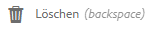
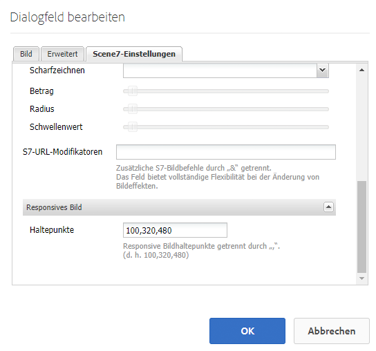
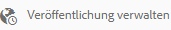

# Verwalten von Assets {#manage-assets}

In diesem Artikel wird das Verwalten und Bearbeiten von Assets in Adobe Experience Manager Assets beschrieben. Informationen zum Verwalten von Inhaltsfragmenten finden Sie unter [Inhaltsfragmente](content-fragments/content-fragments.md).

## Erstellen von Ordnern {#creating-folders}

Wenn Sie eine Sammlung von Assets organisieren, etwa alle `Nature`-Aufnahmen, können Sie Ordner erstellen, um diese zu gruppieren. Mit Ordnern können Sie Assets kategorisieren und organisieren. Bei [!DNL Experience Manager Assets] müssen Sie Assets nicht in Ordner organisieren, um besser zu arbeiten.

>[!NOTE]
>
>* Die Freigabe eines Asset-Ordners vom Typ `sling:OrderedFolder` wird bei der Weitergabe an Experience Cloud nicht unterstützt. Wenn Sie einen Ordner freigeben möchten, wählen Sie beim Erstellen eines Ordners nicht [!UICONTROL Geordnet] aus.
>* In Experience Manager ist die Verwendung von `subassets` als Ordnername nicht zulässig. Dies ist ein Keyword, das für Knoten reserviert ist, die Teil-Assets für ebenenübergreifende Assets enthalten.


1. Navigieren Sie zu dem Ort in Ihrem Ordner „Digitale Assets“, an dem Sie einen neuen Ordner erstellen möchten. Klicken Sie im Menü auf **[!UICONTROL Erstellen]**. Wählen Sie **[!UICONTROL Neuer Ordner]** aus.
1. Geben Sie in das Feld **[!UICONTROL Titel]** einen Ordnernamen an. DAM verwendet standardmäßig den Titel, den Sie als Ordnernamen angegeben haben. Wenn der Ordner erstellt wurde, können Sie die Standardeinstellung außer Kraft setzen und einen anderen Ordnernamen angeben.
1. Klicken Sie auf **[!UICONTROL Erstellen]**. Ihr Ordner wird im Ordner „Digitale Assets“ angezeigt.

Die folgenden Zeichen (in der Liste durch Leerzeichen getrennt) werden nicht unterstützt:

* Der Name einer Asset-Datei darf keines der folgenden Zeichen enthalten: `* / : [ \\ ] | # % { } ? &`
* Der Name eines Asset-Ordners darf keines der folgenden Zeichen enthalten: `* / : [ \\ ] | # % { } ? \" . ^ ; + & \t`

## Hochladen von Assets {#uploading-assets}

Siehe [Hinzufügen digitaler Assets zu Experience Manager](add-assets.md).

## Erkennen doppelter Assets {#detect-duplicate-assets}

<!-- TBD: This feature may not work as documented. See CQ-4283718. Get PM review done. -->

Wenn ein DAM-Benutzer ein oder mehrere Assets hochlädt, die bereits im Repository vorhanden sind, erkennt [!DNL Experience Manager] das Duplikat und benachrichtigt den Benutzer. Die Erkennung von Duplikaten ist standardmäßig deaktiviert, da sie je nach Größe des Repositorys und der Anzahl der hochgeladenen Assets die Leistung beeinträchtigen kann. Um die Funktion zu aktivieren, konfigurieren Sie die [!UICONTROL Duplikaterkennung für Cloud-Assets in Adobe AEM]. Erfahren Sie, [wie man OSGi-Konfigurationen durchführt](https://experienceleague.adobe.com/docs/experience-manager-cloud-service/implementing/deploying/configuring-osgi.html?lang=de). Die Duplikaterkennung basiert auf dem eindeutigen Wert `dam:sha1`, der unter `jcr:content/metadata/dam:sha1`gespeichert wird. Das bedeutet, dass doppelte Assets erkannt werden, selbst wenn die Dateinamen unterschiedlich sind.


Sie können die Konfigurationsdatei `/apps/example/config.author/com.adobe.cq.assetcompute.impl.assetprocessor.AssetDuplicationDetector.cfg.json` in benutzerdefiniertem Code hinzufügen und die Datei kann Folgendes enthalten:

```json
{
  "enabled":true,
  "detectMetadataField":"dam:sha1"
}
```

Nach der Aktivierung sendet Experience Manager Benachrichtigungen über doppelte Assets an den Posteingang. Dabei handelt es sich um ein aggregiertes Ergebnis für mehrere Duplikate. Benutzer können die Assets anhand der Ergebnisse entfernen.


## Anzeigen einer Vorschau für Assets {#previewing-assets}

Gehen Sie wie folgt vor, um eine Vorschau für ein Asset anzuzeigen.

1. Navigieren Sie auf der Assets-Benutzeroberfläche zum Speicherort des Assets, für das Sie eine Vorschau anzeigen möchten.
1. Tippen Sie auf das gewünschte Asset, um es zu öffnen.

1. Im Vorschaumodus ist eine Zoom-Funktion für [unterstützte Bildtypen](/help/assets/file-format-support.md) verfügbar (mit interaktiver Bearbeitung).

   Um ein Asset heranzuzoomen, tippen oder klicken Sie auf `+` (oder auf das Lupensymbol auf dem Asset). Um auszuzoomen, tippen oder klicken Sie auf `-`. Beim Heranzoomen können Sie beliebige Bildbereiche durch Schwenken genauer untersuchen. Mit dem Pfeil „Zoom zurücksetzen“ gelangen Sie zurück zur Originalansicht.

   Tippen Sie auf **[!UICONTROL Zurücksetzen]**, um die Originalgröße der Ansicht wiederherzustellen.

## Eigenschaften bearbeiten {#editing-properties}

1. Navigieren Sie zum Speicherort des Assets, dessen Metadaten Sie bearbeiten möchten.

1. Wählen Sie ein Asset aus und tippen oder klicken Sie in der Symbolleiste auf **[!UICONTROL Eigenschaften]**, um die Asset-Eigenschaften anzuzeigen. Wählen Sie alternativ die Schnellaktion **[!UICONTROL Eigenschaften]** auf der Asset-Karte aus.

   

1. Bearbeiten Sie auf der Registerkarte [!UICONTROL Eigenschaften] die Metadateneigenschaften auf den verschiedenen Registerkarten. Zum Beispiel bearbeiten Sie auf der Registerkarte **[!UICONTROL Allgemein]** den Titel, die Beschreibung usw.

   >[!NOTE]
   >
   >Das Layout der Seite [!UICONTROL Eigenschaften] und die verfügbaren Metadaten sind vom zugrunde liegenden Metadatenschema abhängig. Informationen dazu, wie Sie das Layout der Seite [!UICONTROL Eigenschaften] ändern können, finden Sie unter [Metadatenschemata](/help/assets/metadata-schemas.md).

1. Um ein bestimmtes Datum/eine Zeit für die Aktivierung der Assets einzustellen, verwenden Sie die Datumsauswahl neben dem Feld **[!UICONTROL Einschaltzeit]**.

   

1. Um das Asset nach einer bestimmten Laufzeit zu deaktivieren, wählen Sie das Datum/den Zeitpunkt mit der Datumsauswahl neben dem Feld **[!UICONTROL Ausschaltzeit]**. Das Deaktivierungsdatum sollte nach dem Aktivierungsdatum für ein Asset liegen. Nach der [!UICONTROL Ausschaltzeit] sind ein Asset und seine Ausgabedarstellungen weder über die Assets-Web-Oberfläche noch über die HTTP-API verfügbar.

   

1. Wählen Sie im Feld **[!UICONTROL Tags]** ein oder mehrere Tags aus. Um ein benutzerdefiniertes Tag hinzuzufügen, geben Sie den Namen des Tags in das Feld ein und wählen Sie anschließend die `Enter`-Taste aus. Das neue Tag wird in [!DNL Experience Manager] gespeichert.

   YouTube erfordert Tags zur Veröffentlichung und einen YouTube-Link (wenn ein geeigneter Link gefunden werden kann).

   >[!NOTE]
   >
   >Um Tags zu erstellen, müssen Sie über eine Schreibberechtigung für den `/content/cq:tags/default`-Pfad im CRX-Repository verfügen.

1. Tippen oder klicken Sie auf **[!UICONTROL Speichern und schließen]**.

1. Navigieren Sie zur Assets-Benutzeroberfläche. Die bearbeiteten Metadateneigenschaften, darunter Titel, Beschreibung und Tags, werden auf der Asset-Karte in der Kartenansicht sowie in den relevanten Spalten der Listenansicht angezeigt.

<!-- TBD: Uncomment after verification for Dec release.

## View asset usage and references {#usage-and-references}

[!DNL Experience Manager] lets you track statistics about usage of a digital asset. The usage statistics include the following:

    * Number of times the asset was viewed or downloaded
    * Channels/devices through which the asset was used
    * Creative solutions where the asset was recently used

To view usage statistics for an asset, in the [!UICONTROL Properties] page, click the **[!UICONTROL Insights]** tab. For more details, see [Asset Insights](assets-insights.md).

[!DNL Experience Manager] also lets you check all the incoming references to an asset, that is, the usage of an asset in remote [!DNL Sites] and in compound assets. Authors of webpages on [!DNL Experience Manager Sites] deployment can use an asset on a remote [!DNL Assets] deployment using the Connected Assets functionality. The [!UICONTROL References] tab in an asset's [!UICONTROL Properties] page lists the local and remote references of the asset. That is, the use of assets in compound assets in [!DNL Assets] and its use in remote [!DNL Sites] pages.

-->

## Kopieren von Assets {#copying-assets}

Beim Kopieren eines Assets oder eines Ordners wird das gesamte Asset bzw. der Ordner mitsamt seiner Inhaltsstruktur kopiert. Ein kopiertes Asset oder ein kopierter Ordner wird am Zielspeicherort dupliziert. Das Asset am Quellspeicherort bleibt unverändert.

Einige wenige, für eine bestimmte Kopie eines Assets eindeutige Attribute werden nicht übertragen. Beispiele:

* Asset-ID, Erstellungsdatum und -zeitpunkt sowie Versionen und Versionsverlauf. Einige dieser Eigenschaften sind an den Eigenschaften `jcr:uuid`, `jcr:created` und `cq:name` zu erkennen.

* Der Erstellungszeitpunkt und referenzierte Pfade sind für jedes Asset und jede seiner Ausgabedarstellungen eindeutig.

Die übrigen Eigenschaften und Metadateninformationen werden beibehalten. Eine Teilkopie wird beim Kopieren eines Assets nicht erstellt.

1. Wählen Sie in der Assets-Benutzeroberfläche mindestens ein Asset aus und tippen oder klicken Sie in der Symbolleiste auf das Symbol **[!UICONTROL Kopieren]**. Alternativ können Sie die Schnellaktion **[!UICONTROL Kopieren]**  auf der Asset-Karte auswählen.

   >[!NOTE]
   >
   >Wenn Sie die Schnellaktion [!UICONTROL Kopieren] verwenden, können Sie immer nur ein Asset gleichzeitig kopieren.

1. Navigieren Sie zum Speicherort, an den Sie die Assets kopieren möchten.

   >[!NOTE]
   >
   >Wenn Sie ein Asset an denselben Speicherort kopieren, generiert [!DNL Experience Manager] automatisch eine Variante des Namens. Beispiel: Wenn Sie ein Asset mit dem Namen `Square` kopieren, generiert [!DNL Experience Manager] automatisch den Namen `Square1` für die Kopie.

1. Klicken Sie in der Symbolleiste auf das Symbol **[!UICONTROL Einfügen]**. Die Assets werden an diesen Speicherort kopiert.

   

   >[!NOTE]
   >
   >Das Symbol **[!UICONTROL Einfügen]** ist in der Symbolleiste verfügbar, bis das Einfügen abgeschlossen ist.

### Verschieben oder Umbenennen von Assets {#moving-or-renaming-assets}

1. Navigieren Sie zum Speicherort des Assets, das Sie verschieben möchten.

1. Wählen Sie das Asset aus und tippen oder klicken Sie in der Symbolleiste auf das Symbol **[!UICONTROL Verschieben]** .

1. Führen Sie im Assistenten „Assets verschieben“ eine der folgenden Aktionen aus:

   * Geben Sie nach dem Verschieben den Namen für das Asset an. Tippen oder klicken Sie anschließend auf **[!UICONTROL Weiter]**, um fortzufahren.

   * Tippen oder klicken Sie auf **[!UICONTROL Abbrechen]**, um den Vorgang abzubrechen.
   >[!NOTE]
   >
   >* Sie können denselben Namen für das Asset angeben, wenn sich am neuen Speicherort kein Asset mit diesem Namen befindet. Sie sollten jedoch einen anderen Namen verwenden, wenn Sie das Asset an einen Speichertort verschieben, an dem bereits ein Asset mit demselben Namen vorhanden ist. Wenn Sie denselben Namen verwenden, generiert das System automatisch eine Variante dieses Namens. Wenn Sie beispielsweise ein Asset mit dem Namen „Quadrat“ kopieren, generiert das System den Namen „Quadrat1“ für die Kopie.
   >* Beim Umbenennen sind keine Leerzeichen in Dateinamen zulässig.


1. Führen Sie im Dialogfeld **[!UICONTROL Ziel auswählen]** eine der folgenden Aktionen aus:

   * Navigieren Sie zum neuen Speicherort für die Assets und tippen oder klicken Sie auf **[!UICONTROL Weiter]**, um fortzufahren.

   * Tippen oder klicken Sie auf **[!UICONTROL Zurück]**, um zum Bildschirm **[!UICONTROL Umbenennen]** zurückzukehren.

1. Wenn die verschobenen Assets verweisende Seiten, Assets oder Sammlungen umfassen, wird die Registerkarte **[!UICONTROL Verweise anpassen]** neben der Registerkarte **[!UICONTROL Ziel auswählen]** angezeigt.

   Führen Sie im Bildschirm **[!UICONTROL Verweise anpassen]** einen der folgenden Schritte aus:

   * Geben Sie die Verweise an, die den neuen Details entsprechend angepasst werden sollen, und tippen oder klicken Sie anschließend auf **[!UICONTROL Verschieben]**, um fortzufahren.

   * Aktivieren/deaktivieren Sie in der Spalte **[!UICONTROL Anpassen]** Verweise auf die Assets.
   * Tippen oder klicken Sie auf **[!UICONTROL Zurück]**, um zum Bildschirm **[!UICONTROL Ziel auswählen]** zurückzukehren.

   * Tippen oder klicken Sie auf **[!UICONTROL Abbrechen]**, um den Verschiebungsvorgang abzubrechen.

   Wenn Sie die Verweise nicht aktualisieren, verweisen sie weiterhin auf den alten Asset-Pfad. Wenn Sie die Verweise aktualisieren, werden sie an den neuen Asset-Pfad angepasst.

### Verwalten von Ausgabedarstellungen {#managing-renditions}

1. Sie können Ausgabedarstellungen für ein Asset hinzufügen oder entfernen, mit Ausnahme des Originals. Navigieren Sie zum Speicherort des Assets, für das Sie Ausgabedarstellungen hinzufügen oder entfernen möchten.

1. Tippen oder klicken Sie auf das Asset, um die Asset-Seite zu öffnen.

   

1. Tippen oder klicken Sie auf das GlobalNav-Symbol und wählen Sie in der Liste **[!UICONTROL Ausgabedarstellungen]** aus.

   

1. Im Bereich **[!UICONTROL Ausgabedarstellungen]** wird die Liste der für das Asset generierten Ausgabedarstellungen angezeigt.

   

   >[!NOTE]
   >
   >Standardmäßig zeigt [!DNL Experience Manager Assets] im Vorschaumodus nicht die ursprüngliche Ausgabedarstellung des Assets an. Wenn Sie ein Administrator sind, können Sie Überlagerungen verwenden, um [!DNL Assets] so zu konfigurieren, dass ursprüngliche Ausgabedarstellungen im Vorschaumodus angezeigt werden.

1. Wählen Sie eine Ausgabedarstellung aus, um sie anzuzeigen oder zu löschen.

   **Löschen einer Ausgabedarstellung**

   Wählen Sie im Bereich **[!UICONTROL Ausgabedarstellungen]** eine Ausgabedarstellung aus und tippen oder klicken Sie in der Symbolleiste auf das Symbol **[!UICONTROL Ausgabedarstellung löschen]**. Ausgabedarstellungen können nach Abschluss der Asset-Verarbeitung nicht mehr stapelweise gelöscht werden. Bei einzelnen Assets können Sie Ausgabedarstellungen manuell aus der Benutzeroberfläche entfernen. Bei mehreren Assets können Sie [!DNL Experience Manager] so anpassen, dass entweder bestimmte Ausgabedarstellungen gelöscht oder die Assets gelöscht und die gelöschten Assets erneut hochgeladen werden.

   

   **Eine neue Ausgabedarstellung hochladen**

   Navigieren Sie zur Seite mit Asset-Details und tippen oder klicken Sie in der Symbolleiste auf das Symbol **[!UICONTROL Ausgabedarstellung hinzufügen]**, um eine neue Ausgabedarstellung für das Asset hochzuladen.

   

   >[!NOTE]
   >
   >Wenn Sie eine Ausgabedarstellung im Bedienfeld **[!UICONTROL Ausgabedarstellungen]** auswählen, wird der Kontext der Symbolleiste geändert, sodass nur die für die Ausgabedarstellung relevanten Aktionen angezeigt werden. Optionen wie das Symbol „Ausgabedarstellungen hochladen“ werden nicht angezeigt. Um diese Optionen in der Symbolleiste anzuzeigen, navigieren Sie zur Detailseite für das Asset.

   Sie können die Dimensionen für die anzuzeigende Ausgabedarstellung auf der Detailseite des entsprechenden Bild- oder Video-Assets konfigurieren. Assets zeigt anhand der von Ihnen angegebenen Abmessungen die Ausgabedarstellung mit den genauen oder möglichst genauen Abmessungen an.

   Überlagern Sie zum Konfigurieren der Ausgabedarstellungsabmessungen eines Bildes auf der Asset-Detailebene den Knoten `renditionpicker` (`libs/dam/gui/content/assets/assetpage/jcr:content/body/content/content/items/assetdetail/items/col1/items/assetview/renditionpicker`) und konfigurieren Sie den Wert für die width-Eigenschaft. Konfigurieren Sie die Eigenschaft **[!UICONTROL size (Long) in KB]** anstelle von „width“, um die Ausgabedarstellung auf der Asset-Detailseite auf Grundlage der Bildgröße anzupassen. Bei größenbasierter Anpassung gibt die Eigenschaft `preferOriginal` der Originalgröße den Vorzug, wenn die angepasste Ausgabedarstellung größer ist als das Original.

   Ebenso können Sie das Bild der Anmerkungsseite durch Überlagern von `libs/dam/gui/content/assets/annotate/jcr:content/body/content/content/items/content/renditionpicker` anpassen.

   

   Navigieren Sie zur Konfiguration der Ausgabedarstellungsabmessungen für ein Video-Asset zum Knoten `videopicker` im CRX-Repository am Speicherort `/libs/dam/gui/content/assets/assetpage/jcr:content/body/content/content/items/assetdetail/items/col1/items/assetview/videopicker`, überlagern Sie den Knoten und bearbeiten Sie dann die entsprechende Eigenschaft.

   >[!NOTE]
   >
   >Videoanmerkungen werden nur bei Browsern mit HTML5-kompatiblen Videoformaten unterstützt. Darüber hinaus werden je nach Browser unterschiedliche Videoformate unterstützt.

## Löschen von Assets {#delete-assets}

Um die eingehenden Verweise von anderen Seiten aufzulösen oder zu entfernen, aktualisieren Sie die entsprechenden Verweise, bevor Sie ein Asset löschen.

Deaktivieren Sie außerdem die Schaltfläche „Löschen erzwingen“ mithilfe einer Überlagerung, um zu verhindern, dass Benutzer referenzierte Assets löschen und fehlerhafte Links hinterlassen.

1. Navigieren Sie zum Speicherort der Assets, die Sie löschen möchten.

1. Wählen Sie das Asset und tippen oder klicken Sie in der Symbolleiste auf das Symbol **[!UICONTROL Löschen]**.

   

1. Klicken Sie im Bestätigungsdialogfeld auf:

   * **[!UICONTROL Abbrechen]**, um die Aktion abzubrechen.
   * **[!UICONTROL Löschen]**, um die Aktion zu bestätigen:

      * Wenn das Asset keine Referenzen aufweist, wird es gelöscht.
      * Wenn die Seite Referenzen aufweist, wird eine Fehlermeldung angezeigt mit dem Hinweis **Es wird auf ein oder mehrere Asset(s) verwiesen.** Sie können **[!UICONTROL Löschen erzwingen]** oder **[!UICONTROL Abbrechen]** auswählen.

   >[!NOTE]
   >
   >Sie benötigen eine Löschberechtigung für DAM/Asset, um ein Asset löschen zu können. Wenn Sie nur eine Änderungsberechtigung haben, haben Sie nur die Möglichkeit, die Asset-Metadaten zu bearbeiten und Notizen zum Asset hinzuzufügen. Sie können jedoch das Asset oder dessen Metadaten nicht löschen.

   >[!NOTE]
   >
   >Um die eingehenden Verweise von anderen Seiten aufzulösen oder zu entfernen, aktualisieren Sie die entsprechenden Verweise, bevor Sie ein Asset löschen.
   >
   >
   >Deaktivieren Sie außerdem die Schaltfläche „Löschen erzwingen“ mithilfe einer Überlagerung, um zu verhindern, dass Benutzer referenzierte Assets löschen und fehlerhafte Links hinterlassen.

## Herunterladen von Assets {#download-assets}

Siehe [Herunterladen von Assets aus [!DNL Experience Manager]](/help/assets/download-assets-from-aem.md).

## Veröffentlichen von Assets {#publish-assets}

<!--
>[!NOTE]
>
>For more information specific to Dynamic Media, see [Publishing Dynamic Media Assets](/help/assets/dynamic-media/publishing-dynamicmedia-assets.md).
-->

1. Navigieren Sie zum Speicherort der Assets/Ordner, die Sie veröffentlichen möchten.

1. Wählen Sie entweder die Schnellaktion **[!UICONTROL Veröffentlichen]** auf der Asset-Karte aus oder wählen Sie das Asset aus und tippen oder klicken Sie in der Symbolleiste auf das Symbol **[!UICONTROL Quick Publish]**.
1. Wenn das Asset andere Assets referenziert, werden die Verweise im Assistenten aufgelistet. Es werden nur Verweise angezeigt, die entweder unveröffentlicht sind oder seit der letzten Veröffentlichung/Aufhebung der Veröffentlichung geändert wurden. Wählen Sie die Referenzen aus, die Sie veröffentlichen möchten.

   

   >[!NOTE]
   >
   >Wenn der Ordner, den Sie veröffentlichen möchten, einen leeren Ordner enthält, wird der leere Ordner nicht veröffentlicht.

1. Tippen oder klicken Sie auf **[!UICONTROL Veröffentlichen]**, um die Aktivierung für die Assets zu bestätigen.

>[!CAUTION]
>
>Wenn Sie ein Asset veröffentlichen, das momentan verarbeitet wird, wird nur der ursprüngliche Inhalt veröffentlicht. Die Ausgabedarstellungen fehlen. Warten Sie entweder, bis die Verarbeitung abgeschlossen ist, und veröffentlichen Sie das Asset erst dann, oder veröffentlichen Sie es erneut, wenn die Verarbeitung abgeschlossen ist.

## Rückgängigmachen der Veröffentlichung von Assets {#unpublishing-assets}

1. Navigieren Sie zum Speicherort des Assets/Asset-Ordners, das bzw. den Sie aus der Veröffentlichungsumgebung entfernen möchten (Veröffentlichung rückgängig machen).

1. Wählen Sie das Asset/den Ordner aus, dessen Veröffentlichung Sie rückgängig machen möchten, und klicken Sie in der Symbolleiste auf das Symbol **[!UICONTROL Veröffentlichung rückgängig machen]**.

   

1. Wählen Sie die Aktion **[!UICONTROL Veröffentlichung rückgängig machen]** aus der Liste aus.

   

1. Um die Veröffentlichung des Assets später rückgängig zu machen, wählen Sie **[!UICONTROL Veröffentlichung später rückgängig machen]** und anschließend ein Datum aus, an dem die Veröffentlichung des Assets rückgängig gemacht werden soll.
1. Legen Sie ein Datum fest, an dem die Assets aus der Veröffentlichungsumgebung entfernt werden sollen.
1. Wenn das Asset andere Assets referenziert, wählen Sie die Verweise aus, deren Veröffentlichung Sie rückgängig machen möchten. Tippen oder klicken Sie auf **[!UICONTROL Veröffentlichung rückgängig machen]**.
1. Tippen oder klicken Sie im Bestätigungsdialogfeld auf:

   * **[!UICONTROL Abbrechen]**, um die Aktion abzubrechen.
   * **[!UICONTROL Veröffentlichung rückgängig machen]**, um zu bestätigen, dass die Veröffentlichung der Assets zum angegebenen Datum rückgängig gemacht wird (sodass die Assets nicht mehr in der Veröffentlichungsumgebung verfügbar sind).

   >[!NOTE]
   >
   >Wenn Sie die Veröffentlichung eines komplexen Assets rückgängig machen möchten, achten Sie darauf, nur die Veröffentlichung des Assets rückgängig zu machen. Machen Sie nicht die Veröffentlichung der Verweise rückgängig, da diese möglicherweise auch von anderen veröffentlichten Assets referenziert werden.

## Geschlossene Benutzergruppe {#closed-user-group}

Eine geschlossene Benutzergruppe (Closed User Group, CUG) wird verwendet, um den Zugriff auf bestimmte aus [!DNL Experience Manager] veröffentlichte Asset-Ordner zu beschränken. Wenn Sie eine CUG für einen Ordner erstellen, wird der Zugriff auf diesen Ordner (einschließlich Ordner-Assets und Unterordnern) auf zugewiesene Mitglieder und Gruppen beschränkt. Um auf einen Ordner zuzugreifen, müssen Benutzer mit ihren Sicherheitsanmeldedaten angemeldet sein.

CUGs stellen eine zusätzliche Möglichkeit dar, den Zugang zu Ihren Assets zu beschränken. Sie können auch eine Anmeldeseite für den Ordner konfigurieren.

1. Wählen Sie in der Assets-Benutzeroberfläche einen Ordner aus und tippen oder klicken Sie in der Symbolleiste auf das Symbol „Eigenschaften“, um die Eigenschaftsseite anzuzeigen.
1. Fügen Sie auf der Registerkarte **[!UICONTROL Berechtigungen]** unter **[!UICONTROL Geschlossene Benutzergruppe]** Mitglieder oder Gruppen hinzu.

   

1. Um einen Anmeldebildschirm anzuzeigen, wenn Benutzer auf den Ordner zugreifen, wählen Sie die Option **[!UICONTROL Aktivieren]** aus. Wählen Sie anschließend den Pfad zur Anmeldeseite in [!DNL Experience Manager] aus und speichern Sie die Änderungen.

   

   >[!NOTE]
   >
   >Wenn Sie den Pfad zur Anmeldeseite nicht angeben, zeigt [!DNL Experience Manager] die standardmäßige Anmeldeseite in der Veröffentlichungsinstanz an.

1. Veröffentlichen Sie den Ordner und versuchen Sie, über die Veröffentlichungsinstanz darauf zuzugreifen. Es wird ein Anmeldebildschirm angezeigt.
1. Wenn Sie Mitglied der CUG sind, geben Sie Ihre Anmeldedaten ein. Nachdem Sie von [!DNL Experience Manager] authentifiziert wurden, wird der Ordner angezeigt.

## Suchen von Assets  {#search-assets}

Die Suche nach Assets spielt bei der Nutzung eines Digital-Asset-Management-Systems eine zentrale Rolle – sowohl für eine weitere Verwendung durch Kreativprofis als auch für eine robuste Verwaltung von Assets durch Geschäftsbenutzer und Marketing-Experten oder für die Verwaltung durch DAM-Administratoren.

Einfache, erweiterte und benutzerdefinierte Suchen zur Erkennung und Verwendung der am besten geeigneten Assets finden Sie unter [Assets in [!DNL Experience Manager]](/help/assets/search-assets.md) suchen.

## Schnellaktionen {#quick-actions}

Schnellaktion-Symbole sind jeweils nur für ein Asset verfügbar. Führen Sie je nach Gerät folgende Aktionen durch, um die Symbole der Schnellaktionen anzuzeigen:

* Touch-Geräte: Tippen und halten. Mit einem Touch-Gerät, wie z. B. einem iPad, können Sie länger auf ein Asset tippen, damit die Schnellaktionen angezeigt werden.
* Nicht-Touch-Geräte: Mit Mauszeiger darüberfahren. Auf einem Desktop-Gerät wird beispielsweise eine Schnellzugriffsleiste angezeigt, wenn Sie mit dem Mauszeiger über die Miniaturansicht des Assets fahren.

## Bearbeiten von Bildern {#editing-images}

Mit den Bearbeitungswerkzeugen in der Oberfläche von [!DNL Experience Manager Assets] können Sie kleine Bearbeitungsaktionen in Bild-Assets durchführen. Sie können Bilder beschneiden, drehen, spiegeln und auf andere Arten bearbeiten. Sie können auch Imagemaps zu den Assets hinzufügen.

>[!NOTE]
>
>Bei manchen Komponenten sind für den Vollbildmodus zusätzliche Optionen verfügbar.

1. Führen Sie einen der folgenden Schritte aus, um ein Element im Bearbeitungsmodus zu öffnen:

   * Wählen Sie das Asset aus und klicken oder tippen Sie dann in der Symbolleiste auf das Symbol **[!UICONTROL Bearbeiten]**.
   * Tippen oder klicken Sie auf das Symbol **[!UICONTROL Bearbeiten]**, das über einem Asset in der Kartenansicht angezeigt wird.
   * Klicken Sie in der Symbolleiste auf der Asset-Seite auf das Symbol **[!UICONTROL Bearbeiten]**.

   

1. Um das Bild zu beschneiden, tippen oder klicken Sie auf das Symbol **Zuschneiden**.

   

1. Wählen Sie die gewünschte Option aus der Liste aus. Der Zuschneidebereich wird auf dem Bild je nach gewählter Option angezeigt. Mit der Option **Freihand** können Sie das Bild ohne Einschränkungen des Seitenverhältnisses zuschneiden.

   

1. Wählen Sie den zuzuschneidenden Bereich und ändern Sie die Größe oder Position auf dem Bild.
1. Verwenden Sie das Symbol **Fertig** (in der rechten oberen Ecke), um das Bild zu beschneiden. Durch Klicken auf **Fertigstellen** wird auch die Neuerstellung von Ausgabedarstellungen ausgelöst.

   

1. Mit den Symbolen **Rückgängig** und **Wiederherstellen** oben rechts können Sie das nicht zugeschnittene Bild wiederherstellen bzw. das zugeschnittene Bild beibehalten.

   

1. Tippen oder klicken Sie auf das entsprechende Drehsymbol, um das Bild im oder entgegen dem Uhrzeigersinn zu drehen.

   

1. Tippen oder klicken Sie auf das entsprechende Spiegelsymbol, um das Bild horizontal oder vertikal zu spiegeln.

   

1. Tippen oder klicken Sie auf das Symbol **Fertigstellen**, um die Änderungen zu speichern.

   

>[!NOTE]
>
>Bildbearbeitung wird für die Dateiformate BMP, GIF, PNG und JPEG unterstützt.

<!-- You can also add image maps using the image editor. For details, see [Adding Image Maps](/help/assets/image-maps.md). -->

>[!NOTE]
>
>Zum Bearbeiten einer TXT-Datei verwenden Sie **Day CQ Link Externalizer** in Configuration Manager.

## Zeitleiste {#timeline}

In der Zeitleiste können Sie diverse Ereignisse für ein ausgewähltes Objekt ansehen, wie z. B. aktive Workflows für ein Asset, Kommentare/Anmerkungen, Aktivitätsprotokolle und Versionen.


*Abbildung: Sortieren von Zeitleisten-Einträgen für ein Asset*

>[!NOTE]
>
>In der [Konsole für Sammlungen](/help/assets/manage-collections.md#navigate-the-collections-console) bietet die Liste **[!UICONTROL Alle anzeigen]** Optionen, um nur Kommentare und Workflows anzuzeigen. Darüber hinaus wird die Zeitleiste nur für Sammlungen auf der höchsten Ebene angezeigt, die in der Konsole aufgelistet sind. Sie wird nicht angezeigt, wenn Sie in einer der Sammlungen navigieren.

>[!NOTE]
>
>Die Zeitleiste enthält mehrere [inhaltsfragmentspezifische Optionen](content-fragments/content-fragments.md).

## Anmerken {#annotating}

Anmerkungen sind Kommentare oder erläuternde Hinweise, die Bildern oder Videos hinzugefügt werden. Anmerkungen bieten Marketern die Möglichkeit, zusammenzuarbeiten und Feedback zu Assets bereitzustellen.

Videoanmerkungen werden nur bei Browsern mit HTML5-kompatiblen Videoformaten unterstützt. Von Assets unterstützte Videoformate sind vom jeweiligen Browser abhängig.

>[!NOTE]
>
>Bei Inhaltsfragmenten werden [Anmerkungen im Fragmenteditor erstellt](content-fragments/content-fragments.md).

1. Navigieren Sie zum Speicherort des Assets, dem Sie Anmerkungen hinzufügen möchten.
1. Tippen oder klicken Sie in einem der folgenden Elemente auf das Symbol **[!UICONTROL Anmerken]**:

   * [Schnellaktionen](#quick-actions)
   * In der Symbolleiste, nachdem Sie das Asset ausgewählt haben  oder zur Asset-Seite navigiert sind

   

1. Fügen Sie im Feld **[!UICONTROL Kommentar]** am unteren Rand der Zeitleiste einen Kommentar hinzu. Sie haben auch die Möglichkeit, einen Bereich im Bild zu markieren und im Dialogfeld **[!UICONTROL Anmerkung hinzufügen]** eine Anmerkung hinzuzufügen.

   

<!--
1. To notify a user about an annotation, specify the email address of the user and add the comment. For example, to notify Aaron MacDonald about an annotation, enter @aa. Hints for all matching users is displayed in a list. Select Aaron's email address from the list to tag her with the comment. Similarly, you can tag more users anywhere within the annotation or before or after it.
-->

>[!NOTE]
>
>Für einen Benutzer ohne Administratorberechtigung sind Vorschläge nur dann sichtbar, wenn er über eine Leseberechtigung in `/home` in CRXDE verfügt.


1. Nachdem Sie die Anmerkung hinzugefügt haben, klicken Sie auf **[!UICONTROL Hinzufügen]**, um sie zu speichern. Eine Benachrichtigung über die Anmerkung wird an Aaron gesendet.

   

   >[!NOTE]
   >
   >Sie können mehrere Anmerkungen hinzufügen, bevor Sie diese speichern.

1. Tippen oder klicken Sie auf **[!UICONTROL Schließen]**, um den Anmerkungsmodus zu verlassen.
1. Um die Benachrichtigung zu sehen, melden Sie sich mit den Anmeldedaten von Aaron MacDonald bei Assets an und klicken Sie auf das Symbol **[!UICONTROL Benachrichtigungen]**.

   >[!NOTE]
   >
   >Sie können Video-Assets auch Anmerkungen hinzufügen. Während Videos mit Anmerkungen versehen werden, wird der Player angehalten, damit Sie einem Frame eine Anmerkung hinzufügen können. Details finden Sie unter [Verwalten von Video-Assets](manage-video-assets.md).

1. Wenn Sie eine andere Farbe auswählen möchten, um zwischen Benutzern zu unterscheiden, klicken/tippen Sie auf das Symbol „Profil“. Anschließend klicken/tippen Sie auf **[!UICONTROL Benutzereinstellungen]**.

   

   Geben Sie die gewünschte Farbe im Feld **[!UICONTROL Anmerkungsfarbe]** an und klicken/tippen Sie auf **[!UICONTROL Annehmen]**.

   

>[!NOTE]
>
>Sie können auch Anmerkungen zu einer Sammlung hinzufügen. Wenn eine Sammlung jedoch untergeordnete Sammlungen enthält, können Sie nur der übergeordneten Sammlung Anmerkungen/Kommentare hinzufügen. Die Option „Anmerken“ ist nicht für untergeordnete Sammlungen verfügbar.

### Anzeigen gespeicherter Anmerkungen {#viewing-saved-annotations}

1. Um die gespeicherten Anmerkungen zu einem Asset anzuzeigen, navigieren Sie zum Speicherort des Assets und öffnen Sie die Asset-Seite für dieses Asset.

1. Tippen oder klicken Sie auf das GlobalNav-Symbol und wählen Sie **[!UICONTROL Zeitleiste]** aus der Liste aus.

   

1. Wählen Sie in der Liste **[!UICONTROL Alle anzeigen]** in der Zeitleiste **[!UICONTROL Kommentare]** aus, um die Ergebnisse anhand von Anmerkungen zu filtern.

   

   Tippen oder klicken Sie im Bedienfeld **[!UICONTROL Zeitleiste]** auf einen Kommentar, um die entsprechende Anmerkung auf dem Bild anzuzeigen.

   

   Tippen oder klicken Sie auf **[!UICONTROL Löschen]**, um einen bestimmten Kommentar zu löschen.

### Drucken von Anmerkungen {#printing-annotations}

Wenn ein Asset Anmerkungen aufweist oder einem Prüfungs-Workflow unterzogen wurde, können Sie das Asset einschließlich der Anmerkungen und des Prüfungsstatus für die Offline-Prüfung als PDF-Datei drucken.

Sie können auch nur die Anmerkungen oder nur den Prüfungsstatus drucken.

Zum Drucken der Anmerkungen und des Prüfungsstatus tippen/klicken Sie auf das Symbol **[!UICONTROL Drucken]** und folgen Sie den Anweisungen im Assistenten. Das Symbol **[!UICONTROL Drucken]** erscheint nur dann in der Symbolleiste, wenn dem Asset mindestens eine Anmerkung oder ein Prüfungsstatus zugewiesen ist.

1. Öffnen Sie von der Assets-Benutzeroberfläche aus die Vorschauseite für ein Asset.
1. Führen Sie einen der folgenden Schritte aus:

   * Zum Drucken aller Anmerkungen und des Prüfungsstatus überspringen Sie Schritt 3. Dann fahren Sie direkt mit Schritt 4 fort.
   * Zum Drucken bestimmter Anmerkungen und des Prüfungsstatus öffnen Sie die [Zeitleiste](/help/assets/manage-digital-assets.md#timeline) und fahren Sie mit Schritt 3 fort.

1. Zum Drucken bestimmter Anmerkungen wählen Sie die Anmerkungen aus der Zeitleiste aus.

   

   Um nur den Prüfungsstatus zu drucken, wählen Sie ihn aus der Zeitleiste aus.

   

1. Tippen/klicken Sie in der Symbolleiste auf das Symbol **[!UICONTROL Drucken]**.

   

1. Wählen Sie im Dialogfeld „Drucken“ die Position, deren Anmerkungen/Prüfungsstatus in der PDF-Datei angezeigt werden sollen. Wenn Sie beispielsweise die Anmerkungen/den Status in der linken oberen Ecke der Seite drucken möchten, die das gedruckte Bild enthält, verwenden Sie die Einstellung **Oben links**. Sie ist standardmäßig aktiviert.

   

   Sie können auch andere Einstellungen wählen, je nach der von Ihnen gewünschten Position der Anmerkungen oder des Status in der gedruckten PDF-Datei. Wenn Anmerkungen/Status auf einer Seite angezeigt werden sollen, die vom gedruckten Asset getrennt ist, wählen Sie **[!UICONTROL Nächste Seite]**.

1. Klicken Sie auf **[!UICONTROL Drucken]**. Je nach der Option, die Sie in Schritt 2 wählen, zeigt die erstellte PDF-Datei die Anmerkungen/den Status an der angegebenen Position an. Beispiel: Wenn Sie beide Anmerkungen und den Prüfungsstatus mithilfe der Einstellung **Oben links** drucken, ähnelt die erstellte Ausgabe der hier dargestellten PDF-Datei.

   

1. Laden Sie die PDF-Datei herunter oder drucken Sie sie mithilfe der Optionen in der rechten oberen Ecke.

   

   Um das Erscheinungsbild der gerenderten PDF-Datei zu ändern (z. B. Schriftfarbe, Größe, Stil und Hintergrundfarbe der Kommentare und Status), öffnen Sie in Configuration Manager die **[!UICONTROL Konfiguration für PDF-Anmerkungen]** und ändern Sie die gewünschten Optionen. Um beispielsweise die Anzeigefarbe des Status „Bestätigt“ zu ändern, modifizieren Sie im entsprechenden Feld den Farb-Code. Informationen zum Ändern der Schriftfarbe von Anmerkungen finden Sie unter [Anmerken](/help/assets/manage-digital-assets.md#annotating).

   

   Kehren Sie zu der gerenderten PDF-Datei zurück und aktualisieren Sie sie. Der aktualisierte PDF-Datei spiegelt die von Ihnen vorgenommenen Änderungen wider.

## Asset-Versionierung {#asset-versioning}

Bei der Versionierung wird eine Momentaufnahme von digitalen Assets zu einem bestimmten Zeitpunkt aufgezeichnet. Sie hilft Ihnen bei der späteren Wiederherstellung eines vorherigen Asset-Zustands. Wenn Sie etwa eine Änderung an einem Asset rückgängig machen wollen, stellen Sie die unbearbeitete Version des Assets wieder her.

In folgenden Szenarien werden Versionen erstellt:

* Sie ändern ein Bild in einem anderen Programm und laden es in Assets hoch. Es wird eine Version des Bildes erstellt, damit das Original nicht überschrieben wird.
* Sie können die Metadaten eines Assets bearbeiten.
* Sie verwenden das [!DNL Experience Manager]-Desktop-Programm, um ein vorhandenes Asset auszuchecken und Ihre Änderungen zu speichern. Bei jedem Speichern des Assets wird eine neue Version erstellt.

Sie können mithilfe eines Workflows die automatische Versionierung aktivieren. Wenn Sie eine Version für ein Asset erstellen, werden die Metadaten und Ausgabedarstellungen gemeinsam mit der Version gespeichert. Ausgabedarstellungen sind gerenderte Alternativen für dieselben Bilder, z. B. eine PNG-Ausgabedarstellung einer hochgeladenen JPEG-Datei.

Die Versionierungsfunktion bietet folgende Möglichkeiten:

* Erstellen einer Version eines Assets
* Anzeigen der aktuellen Version eines Assets
* Zurücksetzen des Assets auf eine frühere Version

1. Navigieren Sie zum Speicherort des Assets, von dem Sie eine Version erstellen möchten, und klicken/tippen Sie darauf, um seine Asset-Seite zu öffnen.

1. Tippen oder klicken Sie auf das GlobalNav-Symbol und wählen Sie **[!UICONTROL Zeitleiste]** aus dem Menü aus.

   

1. Tippen oder klicken Sie unten auf das Symbol **[!UICONTROL Aktionen]** (Pfeil), um die verfügbaren Aktionen anzuzeigen, die Sie am Asset durchführen können.

   

1. Tippen oder klicken Sie auf **[!UICONTROL Als Version speichern]**, um eine Version für das Asset zu erstellen.

   

1. Fügen Sie eine Beschriftung und Kommentare hinzu und klicken Sie auf **[!UICONTROL Erstellen]**, um eine Version zu erstellen. Tippen oder klicken Sie alternativ auf **Abbrechen**, um den Vorgang abzubrechen.

   

1. Um die neue Version anzuzeigen, öffnen Sie in der Zeitleiste die Liste **[!UICONTROL Alle anzeigen]** auf der Detailseite für Assets oder der Assets-Benutzeroberfläche und wählen Sie **[!UICONTROL Versionen]**. Alle für ein Asset erstellten Versionen werden auf der Registerkarte „Zeitleiste“ aufgeführt. Sie können die Liste filtern, sodass Versionen angezeigt werden, indem Sie auf den Dropdown-Pfeil klicken und **[!UICONTROL Versionen]** aus der Liste auswählen.

   

1. Wählen Sie eine bestimmte Version für das Asset aus, um sie in der Vorschau anzuzeigen, oder aktivieren Sie sie, damit sie in der Assets-Benutzeroberfläche angezeigt wird.

   

1. Fügen Sie eine Beschriftung und Kommentare für die Version hinzu, um in der Assets-Benutzeroberfläche auf diese bestimmte Version zurückzusetzen.

   

1. Um eine Vorschau für die Version anzuzeigen, tippen oder klicken Sie auf **[!UICONTROL Versionsvorschau]**.
1. Um diese Version in der Assets-Benutzeroberfläche anzuzeigen, wählen Sie **[!UICONTROL Auf diese Version zurücksetzen]**.
1. Um zwei Versionen miteinander zu vergleichen, gehen Sie zur Asset-Seite des Assets und tippen oder klicken Sie auf die Version, die mit der aktuellen Version verglichen werden soll.

   

1. Wählen Sie in der Zeitleiste die Version aus, die Sie vergleichen wollen, und ziehen Sie den Schieberegler nach links, um diese Version über die aktuelle Version zu setzen.

   

### Starten eines Workflows für ein Asset {#starting-a-workflow-on-an-asset}

1. Navigieren Sie zum Speicherort des Assets, für das Sie einen Workflow beginnen möchten, und tippen/klicken Sie auf das Asset, um die Asset-Seite zu öffnen.
1. Tippen oder klicken Sie auf das GlobalNav-Symbol und wählen Sie im Menü die Option **[!UICONTROL Zeitleiste]**, um die Zeitleiste anzuzeigen.

   

1. Tippen oder klicken Sie unten auf das Symbol **[!UICONTROL Aktionen]** (Pfeil), um die Liste der Aktionen zu öffnen, die für das Asset verfügbar sind.

   

1. Wählen Sie **[!UICONTROL Workflow starten]** aus der Liste aus.

   

1. Wählen Sie im Dialogfeld **[!UICONTROL Workflow starten]** ein Workflow-Modell aus der Liste.

   

1. (Optional) Geben Sie einen Titel für den Workflow an, der für den Verweis auf die Workflow-Instanz verwendet werden kann.

   

1. Um zu bestätigen, tippen oder klicken Sie im Dialogfeld auf **[!UICONTROL Start]** und anschließend auf **[!UICONTROL Weiter]**. Jeder Schritt des Workflows wird in der Zeitleiste als ein Ereignis angezeigt.

   

## Sammlungen {#collections}

Bei einer Sammlung handelt es sich um eine sortierte Gruppe von Assets. Anhand von Sammlungen können Assets von mehreren Benutzern gemeinsam verwendet werden.

* Eine Sammlung kann Assets aus verschiedenen Speicherorten enthalten, da sie nur Verweise zu diesen Assets aufweisen. Jede Sammlung hält die referenzielle Integrität von Assets aufrecht.
* Sie können Sammlungen für mehrere Benutzer mit unterschiedlichen Berechtigungsstufen wie Bearbeiten, Anzeigen usw. freigeben.

Details über die Sammlungsverwaltung finden Sie unter [Verwalten von Sammlungen](/help/assets/manage-collections.md).
