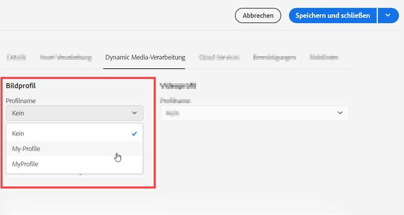

# Verwalten von Assets {#manage-assets}

<table>
    <tr>
        <td>
            <sup style= "background-color:#008000; color:#FFFFFF; font-weight:bold"><i>Neu</i></sup> <a href="/help/assets/dynamic-media/dm-prime-ultimate.md"><b>Dynamic Media Prime und Ultimate</b></a>
        </td>
        <td>
            <sup style= "background-color:#008000; color:#FFFFFF; font-weight:bold"><i>Neu</i></sup> <a href="/help/assets/assets-ultimate-overview.md"><b>AEM Assets Ultimate</b></a>
        </td>
        <td>
            <sup style= "background-color:#008000; color:#FFFFFF; font-weight:bold"><i>Neu</i></sup> <a href="/help/assets/integrate-aem-assets-edge-delivery-services.md"><b>AEM Assets-Integration mit Edge Delivery Services</b></a>
        </td>
        <td>
            <sup style= "background-color:#008000; color:#FFFFFF; font-weight:bold"><i>Neu</i></sup> <a href="/help/assets/aem-assets-view-ui-extensibility.md"><b>Erweiterbarkeit der Benutzeroberfläche</b></a>
        </td>
          <td>
            <sup style= "background-color:#008000; color:#FFFFFF; font-weight:bold"><i>Neu</i></sup> <a href="/help/assets/dynamic-media/enable-dynamic-media-prime-and-ultimate.md"><b>Aktivieren von Dynamic Media Prime und Ultimate</b></a>
        </td>
    </tr>
    <tr>
        <td>
            <a href="/help/assets/search-best-practices.md"><b>Best Practices für die Suche</b></a>
        </td>
        <td>
            <a href="/help/assets/metadata-best-practices.md"><b>Best Practices für Metadaten</b></a>
        </td>
        <td>
            <a href="/help/assets/product-overview.md"><b>Content Hub</b></a>
        </td>
        <td>
            <a href="/help/assets/dynamic-media-open-apis-overview.md"><b>Dynamic Media mit OpenAPI-Funktionen</b></a>
        </td>
        <td>
            <a href="https://developer.adobe.com/experience-cloud/experience-manager-apis/"><b>Entwicklerdokumentation zu AEM Assets</b></a>
        </td>
    </tr>
</table>

| Version | Artikel-Link |
| -------- | ---------------------------- |
| AEM 6.5 | [Hier klicken](https://experienceleague.adobe.com/docs/experience-manager-65/assets/managing/manage-assets.html?lang=de) |
| AEM as a Cloud Service | Dieser Artikel |

In diesem Artikel wird das Verwalten und Bearbeiten von Assets in [!DNL Adobe Experience Manager Assets] beschrieben. Zum Verwalten von [!DNL Content Fragments], siehe [[!DNL Content Fragments]](content-fragments/content-fragments.md)-Assets.

## Erstellen eines Ordners {#creating-folders}

Wenn Sie eine Sammlung von Assets organisieren, etwa alle `Nature`-Aufnahmen, können Sie Ordner erstellen, um diese zu gruppieren. Mit Ordnern können Sie Assets kategorisieren und organisieren. Bei [!DNL Experience Manager Assets] müssen Sie Assets nicht in Ordner organisieren, um besser zu arbeiten.

>[!NOTE]
>
>* Die Freigabe eines Asset-Ordners vom Typ `sling:OrderedFolder` wird bei der Weitergabe an Experience Cloud nicht unterstützt. Wenn Sie einen Ordner freigeben möchten, wählen Sie beim Erstellen eines Ordners nicht [!UICONTROL Geordnet] aus.
>* In Experience Manager ist die Verwendung von `subassets` als Ordnername nicht zulässig. Dies ist ein Keyword, das für Knoten reserviert ist, die Teil-Assets für ebenenübergreifende Assets enthalten.

1. Navigieren Sie zu dem Ort in Ihrem Ordner „Digitale Assets“, an dem Sie einen neuen Ordner erstellen möchten. Klicken Sie im Menü auf **[!UICONTROL Erstellen]**. Wählen Sie **[!UICONTROL Neuer Ordner]** aus.
1. Geben Sie in das Feld **[!UICONTROL Titel]** einen Ordnernamen an. Standardmäßig verwendet DAM den von Ihnen als Ordnernamen angegebenen Titel. Wenn der Ordner erstellt wurde, können Sie die Standardeinstellung überschreiben und einen anderen Ordnernamen angeben.
1. Klicken Sie auf **[!UICONTROL Erstellen]**. Ihr Ordner wird im Ordner „Digitale Assets“ angezeigt.

Die folgenden Zeichen (in der Liste durch Leerzeichen getrennt) werden nicht unterstützt:

* Der Name einer Asset-Datei darf keines der folgenden Zeichen enthalten: `* / : [ \\ ] | # % { } ? &`
* Der Name eines Asset-Ordners darf keines der folgenden Zeichen enthalten: `* / : [ \\ ] | # % { } ? \" . ^ ; + & \t`

## Hochladen von Assets {#uploading-assets}

Siehe [Hinzufügen digitaler Assets zu Experience Manager](add-assets.md).

## Extrahieren von ZIP-Archiven {#extract-zip-archives}

Wählen Sie in Experience Manager verwaltete ZIP-Archive aus und extrahieren Sie die Dateien direkt in Experience Manager, ohne sie herunterzuladen.

Gehen Sie wie folgt vor, um die ZIP-Dateien zu extrahieren:

1. Wählen Sie den ZIP-Dateityp aus.
1. Klicken Sie in der Aktionsleiste auf **[!UICONTROL Archiv extrahieren]**.
1. Wählen Sie den Ordner aus, in dem Sie die extrahierten Assets speichern möchten, die im komprimierten Ordner verfügbar sind.
1. Klicken Sie auf **[!UICONTROL Weiter]**.
1. Wählen Sie das geeignete Verhalten aus, um Dateinamenkonflikten während der Extraktion zu begegnen. Sie können auswählen, ob Sie eine Version eines vorhandenen Assets erstellen, das Asset ersetzen, beide Assets im Zielordner belassen oder die Extraktion des neuen Assets überspringen möchten.
1. Klicken Sie auf **[!UICONTROL Extrahieren]**. Der ZIP-Extraktionsvorgang wird gestartet. Wenn der Prozess abgeschlossen ist, können Sie die extrahierten Assets im Zielordner anzeigen.

   

>[!NOTE]
>
>* Die maximal unterstützte Größe von ZIP-Dateien beträgt 15 GB.
>* Sie können maximal drei ZIP-Dateien gleichzeitig extrahieren.

## Anzeigen einer Vorschau für Assets {#previewing-assets}

Gehen Sie wie folgt vor, um eine Vorschau für ein Asset anzuzeigen.

1. Navigieren Sie auf der Assets-Benutzeroberfläche zum Speicherort des Assets, für das Sie eine Vorschau anzeigen möchten.
1. Wählen Sie das gewünschte Asset aus, um es zu öffnen.

1. Im Vorschaumodus sind Zoom-Optionen für [unterstützte Bildtypen](/help/assets/file-format-support.md) verfügbar (mit interaktiver Bearbeitung).

   Um ein Asset heranzuzoomen, wählen Sie `+` (oder das Lupensymbol auf dem Asset) aus. Um auszuzoomen, wählen Sie `-` aus. Beim Heranzoomen können Sie beliebige Bildbereiche durch Schwenken genauer untersuchen. Mit dem Pfeil „Zoom zurücksetzen“ gelangen Sie zurück zur Originalansicht.

   Wählen Sie **[!UICONTROL Zurücksetzen]** aus, um die Originalgröße der Ansicht wiederherzustellen.

## Bearbeiten von Eigenschaften {#editing-properties}

1. Navigieren Sie zum Speicherort des Assets, dessen Metadaten Sie bearbeiten möchten.

1. Wählen Sie ein Asset und in der Symbolleiste **[!UICONTROL Eigenschaften]** aus, um die Asset-Eigenschaften anzuzeigen. Wählen Sie alternativ die Schnellaktion **[!UICONTROL Eigenschaften]** auf der Asset-Karte aus.

   

1. Bearbeiten Sie auf der Registerkarte [!UICONTROL Eigenschaften] die Metadateneigenschaften auf den verschiedenen Registerkarten. Zum Beispiel bearbeiten Sie auf der Registerkarte **[!UICONTROL Allgemein]** den Titel, die Beschreibung usw.

   >[!NOTE]
   >
   >Das Layout der Seite [!UICONTROL Eigenschaften] und die verfügbaren Metadaten sind vom zugrunde liegenden Metadatenschema abhängig. Informationen dazu, wie Sie das Layout der Seite [!UICONTROL Eigenschaften] ändern können, finden Sie unter [Metadatenschemata](/help/assets/metadata-schemas.md).

1. Um ein bestimmtes Datum/eine Zeit für die Aktivierung der Assets einzustellen, verwenden Sie die Datumsauswahl neben dem Feld **[!UICONTROL Einschaltzeit]**.

   

1. Um das Asset nach einer bestimmten Laufzeit zu deaktivieren, wählen Sie das Datum/den Zeitpunkt mit der Datumsauswahl neben dem Feld **[!UICONTROL Ausschaltzeit]**. Das Deaktivierungsdatum sollte nach dem Aktivierungsdatum für ein Asset liegen. Nach der [!UICONTROL Ausschaltzeit] sind ein Asset und seine Ausgabedarstellungen weder über die Assets-Web-Oberfläche noch über die HTTP-API verfügbar.

   <!--
1. Wählen Sie im Feld **[!UICONTROL Tags]** ein oder mehrere Tags aus. Um ein benutzerdefiniertes Tag hinzuzufügen, geben Sie den Namen des Tags in das Feld ein und wählen Sie anschließend die `Enter`-Taste aus. Das neue Tag wird in [!DNL Experience Manager] gespeichert.

   YouTube erfordert Tags zur Veröffentlichung und einen YouTube-Link (wenn ein geeigneter Link gefunden werden kann).

   >[!NOTE]
   >
   > Um Tags zu erstellen, müssen Sie über eine Schreibberechtigung für den `/content/cq:tags/default`-Pfad im CRX-Repository verfügen.

1. Wählen Sie **[!UICONTROL Speichern und schließen]**.

1. Navigieren Sie zur Assets-Benutzeroberfläche. Die bearbeiteten Metadateneigenschaften, darunter Titel, Beschreibung und Tags, werden auf der Asset-Karte in der Kartenansicht sowie in den relevanten Spalten der Listenansicht angezeigt.

<!-- TBD: Uncomment after verification for Dec release.

## View asset usage and references {#usage-and-references}

[!DNL Experience Manager] lets you track statistics about usage of a digital asset. The usage statistics include the following:

    * Number of times the asset was viewed or downloaded
    * Channels/devices through which the asset was used
    * Creative solutions where the asset was recently used

To view usage statistics for an asset, in the [!UICONTROL Properties] page, click the **[!UICONTROL Insights]** tab. For more details, see [Assets Insights](assets-insights.md).

[!DNL Experience Manager] also lets you check all the incoming references to an asset, that is, the usage of an asset in remote [!DNL Sites] and in compound assets. Authors of webpages on [!DNL Experience Manager Sites] deployment can use an asset on a remote [!DNL Assets] deployment using the Connected Assets functionality. The [!UICONTROL References] tab in an asset's [!UICONTROL Properties] page lists the local and remote references of the asset. That is, the use of assets in compound assets in [!DNL Assets] and its use in remote [!DNL Sites] pages.

-->

## Kopieren von Assets {#copying-assets}

Wenn Sie ein Asset oder einen Ordner kopieren, wird das gesamte Asset oder der Ordner zusammen mit der Inhaltsstruktur kopiert. Ein kopiertes Asset oder ein Ordner wird am Zielspeicherort dupliziert. Das Asset am Quellspeicherort wird nicht geändert.

Einige wenige, für eine bestimmte Kopie eines Assets eindeutige Attribute werden nicht übertragen. Beispiele:

* Asset-ID, Erstellungsdatum und -zeitpunkt sowie Versionen und Versionsverlauf. Einige dieser Eigenschaften sind an den Eigenschaften `jcr:uuid`, `jcr:created` und `cq:name` zu erkennen.

* Der Erstellungszeitpunkt und referenzierte Pfade sind für jedes Asset und jede seiner Ausgabedarstellungen eindeutig.

Die anderen Eigenschaften und Metadateninformationen werden beibehalten. Beim Kopieren eines Assets wird keine Teilkopie erstellt.

1. Wählen Sie in der Assets-Benutzeroberfläche ein oder mehrere Assets aus und wählen Sie dann in der Symbolleiste das Symbol **[!UICONTROL Kopieren]** aus. Alternativ können Sie die Schnellaktion **[!UICONTROL Kopieren]**  auf der Asset-Karte auswählen.

   >[!NOTE]
   >
   >Wenn Sie die Schnellaktion [!UICONTROL Kopieren] verwenden, können Sie immer nur ein Asset gleichzeitig kopieren.

1. Navigieren Sie zum Speicherort, an den Sie die Assets kopieren möchten.

   >[!NOTE]
   >
   >Wenn Sie ein Asset an denselben Speicherort kopieren, generiert [!DNL Experience Manager] automatisch eine Variante des Namens. Beispiel: Wenn Sie ein Asset mit dem Namen `Square` kopieren, generiert [!DNL Experience Manager] automatisch den Namen `Square1` für die Kopie.

1. Klicken Sie in der Symbolleiste auf das Symbol **[!UICONTROL Einfügen]**. Die Assets werden an diesen Speicherort kopiert.

   <!---->

   >[!NOTE]
   >
   >Das Symbol **[!UICONTROL Einfügen]** ist in der Symbolleiste verfügbar, bis das Einfügen abgeschlossen ist.

### Verschieben oder Umbenennen von Assets {#moving-or-renaming-assets}

1. Navigieren Sie zum Speicherort des Assets, das Sie verschieben möchten.

1. Wählen Sie das Asset und anschließend in der Symbolleiste das Symbol **[!UICONTROL Verschieben]**  aus.

1. Führen Sie im Assistenten „Assets verschieben“ eine der folgenden Aktionen aus:

   * Geben Sie nach dem Verschieben den Namen für das Asset an. Wählen Sie anschließend **[!UICONTROL Weiter]** aus, um fortzufahren.

   * Wählen Sie **[!UICONTROL Abbrechen]** aus, um den Vorgang abzubrechen.

   >[!NOTE]
   >
   >* Sie können denselben Namen für das Asset angeben, wenn am neuen Speicherort kein Asset mit diesem Namen vorhanden ist. Sie sollten jedoch einen anderen Namen verwenden, wenn Sie das Asset an einen Speicherort verschieben, an dem sich ein Asset mit demselben Namen befindet. Wenn Sie denselben Namen verwenden, erzeugt das System automatisch eine Variation des Namens. Wenn Sie beispielsweise ein Asset mit dem Namen „Quadrat“ kopieren, generiert das System den Namen „Quadrat1“ für die Kopie.
   >* Beim Umbenennen sind Leerzeichen im Dateinamen nicht zulässig.

1. Führen Sie im Dialogfeld **[!UICONTROL Ziel auswählen]** eine der folgenden Aktionen aus:

   * Navigieren Sie zum neuen Speicherort für die Assets und wählen Sie dann **[!UICONTROL Weiter]**, um fortzufahren.

   * Wählen Sie **[!UICONTROL Zurück]**, um zum Bildschirm **[!UICONTROL Umbenennen]** zurückzukehren.

1. Wenn die verschobenen Assets verweisende Seiten, Assets oder Sammlungen umfassen, wird die Registerkarte **[!UICONTROL Verweise anpassen]** neben der Registerkarte **[!UICONTROL Ziel auswählen]** angezeigt.

   Führen Sie im Bildschirm **[!UICONTROL Verweise anpassen]** einen der folgenden Schritte aus:

   * Geben Sie die Verweise an, die den neuen Details entsprechend angepasst werden sollen, und wählen Sie anschließend **[!UICONTROL Verschieben]** aus, um fortzufahren.

   * Aktivieren/deaktivieren Sie in der Spalte **[!UICONTROL Anpassen]** Verweise auf die Assets.
   * Wählen Sie **[!UICONTROL Zurück]** aus, um zum Bildschirm **[!UICONTROL Ziel auswählen]** zurückzukehren.

   * Wählen Sie **[!UICONTROL Abbrechen]**, um den Verschiebevorgang abzubrechen.

   Wenn Sie die Verweise nicht aktualisieren, verweisen sie weiterhin auf den alten Asset-Pfad. Wenn Sie die Verweise aktualisieren, werden sie an den neuen Asset-Pfad angepasst.

### Verwalten von Ausgabedarstellungen {#managing-renditions}

1. Sie können Ausgabedarstellungen für ein Asset hinzufügen oder entfernen, mit Ausnahme des Originals. Navigieren Sie zum Speicherort des Assets, für das Sie Ausgabedarstellungen hinzufügen oder entfernen möchten.

1. Wählen Sie das Asset, um die Asset-Seite zu öffnen.

   <!---->

1. Wählen Sie das GlobalNav-Symbol und dann in der Liste **[!UICONTROL Ausgabedarstellungen]** aus.

   

1. Im Bereich **[!UICONTROL Ausgabedarstellungen]** wird die Liste der für das Asset generierten Ausgabedarstellungen angezeigt.

   

   >[!NOTE]
   >
   >Standardmäßig zeigt [!DNL Experience Manager Assets] im Vorschaumodus nicht die ursprüngliche Ausgabedarstellung des Assets an. Wenn Sie ein Administrator sind, können Sie Überlagerungen verwenden, um [!DNL Assets] so zu konfigurieren, dass ursprüngliche Ausgabedarstellungen im Vorschaumodus angezeigt werden.

1. Wählen Sie eine Ausgabedarstellung aus, um sie anzuzeigen oder zu löschen.

   **Löschen einer Ausgabedarstellung**

   Wählen Sie im Bereich **[!UICONTROL Ausgabeformate]** ein Ausgabeformat aus und wählen Sie dann in der Symbolleiste das Symbol **[!UICONTROL Ausgabeformat löschen]** aus. Ausgabedarstellungen können nach Abschluss der Asset-Verarbeitung nicht mehr stapelweise gelöscht werden. Bei einzelnen Assets können Sie Ausgabedarstellungen manuell aus der Benutzeroberfläche entfernen. Bei mehreren Assets können Sie [!DNL Experience Manager] so anpassen, dass entweder bestimmte Ausgabedarstellungen gelöscht oder die Assets gelöscht und die gelöschten Assets erneut hochgeladen werden.

   

   **Eine neue Ausgabedarstellung hochladen**

   Navigieren Sie zur Seite mit den Asset-Details und wählen Sie das Symbol **[!UICONTROL Ausgabedarstellung hinzufügen]** in der Symbolleiste aus, um eine neue Ausgabedarstellung für das Asset hochzuladen.

   <!---->

   >[!NOTE]
   >
   >Wenn Sie eine Ausgabedarstellung im Bedienfeld **[!UICONTROL Ausgabedarstellungen]** auswählen, wird der Kontext der Symbolleiste geändert, sodass nur die für die Ausgabedarstellung relevanten Aktionen angezeigt werden. Optionen wie das Symbol „Ausgabedarstellungen hochladen“ werden nicht angezeigt. Um diese Optionen in der Symbolleiste anzuzeigen, navigieren Sie zur Detailseite für das Asset.

   Sie können die Dimensionen für die anzuzeigende Ausgabedarstellung auf der Detailseite des entsprechenden Bild- oder Video-Assets konfigurieren. Assets zeigt anhand der von Ihnen angegebenen Abmessungen die Ausgabedarstellung mit den genauen oder möglichst genauen Abmessungen an.

   Sie können keine Ausgabedarstellungen mit den folgenden Präfixen erstellen, da diese Adobe-intern sind:

   * cq5

   * cqdam

   * cq5dam

   Überlagern Sie zum Konfigurieren der Ausgabedarstellungsabmessungen eines Bildes auf der Asset-Detailebene den Knoten `renditionpicker` (`libs/dam/gui/content/assets/assetpage/jcr:content/body/content/content/items/assetdetail/items/col1/items/assetview/renditionpicker`) und konfigurieren Sie den Wert für die width-Eigenschaft. Konfigurieren Sie die Eigenschaft **[!UICONTROL size (Long) in KB]** anstelle von „width“, um die Ausgabedarstellung auf der Asset-Detailseite auf Grundlage der Bildgröße anzupassen. Bei größenbasierter Anpassung gibt die Eigenschaft `preferOriginal` der Originalgröße den Vorzug, wenn die angepasste Ausgabedarstellung größer ist als das Original.

   Ebenso können Sie das Bild der Anmerkungsseite durch Überlagern von `libs/dam/gui/content/assets/annotate/jcr:content/body/content/content/items/content/renditionpicker` anpassen.

   <!---->

   Navigieren Sie zur Konfiguration der Ausgabedarstellungsabmessungen für ein Video-Asset zum Knoten `videopicker` im CRX-Repository am Speicherort `/libs/dam/gui/content/assets/assetpage/jcr:content/body/content/content/items/assetdetail/items/col1/items/assetview/videopicker`, überlagern Sie den Knoten und bearbeiten Sie dann die entsprechende Eigenschaft.

   >[!NOTE]
   >
   >Videoanmerkungen werden nur bei Browsern mit HTML5-kompatiblen Videoformaten unterstützt. Darüber hinaus werden je nach Browser unterschiedliche Videoformate unterstützt. Das MXF-Videoformat wird jedoch noch nicht mit Videoanmerkungen unterstützt.

## Löschen von Assets {#delete-assets}

Um die eingehenden Verweise von anderen Seiten aufzulösen oder zu entfernen, aktualisieren Sie die entsprechenden Verweise, bevor Sie ein Asset löschen.

Deaktivieren Sie außerdem die Schaltfläche „Löschen erzwingen“ mithilfe einer Überlagerung, um zu verhindern, dass Benutzende referenzierte Assets löschen und fehlerhafte Links hinterlassen.

1. Navigieren Sie zum Speicherort der Assets, die Sie löschen möchten.

1. Wählen Sie das Asset und klicken Sie auf das Symbol **[!UICONTROL Löschen]**  in der Symbolleiste.

1. Klicken Sie im Bestätigungsdialogfeld auf:

   * **[!UICONTROL Abbrechen]**, um die Aktion abzubrechen.
   * Mit **[!UICONTROL Löschen]** bestätigen Sie die Aktion.

      * Wenn das Asset keine Referenzen aufweist, wird es gelöscht.
      * Wenn das Asset Referenzen aufweist, wird eine Fehlermeldung angezeigt mit dem Hinweis **[!UICONTROL Es wird auf ein oder mehrere Assets verwiesen]**.  Sie können **[!UICONTROL Löschen erzwingen]** oder **[!UICONTROL Abbrechen]** auswählen.

   >[!NOTE]
   >
   >Sie benötigen eine Löschberechtigung für DAM/Asset, um ein Asset löschen zu können. Wenn Sie nur über Änderungsberechtigungen verfügen, können Sie nur die Asset-Metadaten bearbeiten und dem Asset Anmerkungen hinzufügen. Sie können das Asset oder dessen Metadaten jedoch nicht löschen.

   >[!NOTE]
   >
   >Um die eingehenden Verweise von anderen Seiten aufzulösen oder zu entfernen, aktualisieren Sie die entsprechenden Verweise, bevor Sie ein Asset löschen. Sie können das Löschen referenzierter Assets verbieten, da dies fehlerhafte Links verursacht. Deaktivieren Sie die Schaltfläche „Löschen erzwingen“ mit einer Überlagerung.

## Herunterladen von Assets {#download-assets}

Siehe [Herunterladen von Assets aus [!DNL Experience Manager]](/help/assets/download-assets-from-aem.md).

## Veröffentlichen oder Rückgängigmachen der Veröffentlichung von Assets {#publish-assets}

1. Gehen Sie zum Speicherort des Assets oder Asset-Ordners, das/den Sie veröffentlichen möchten oder das/den Sie aus der Veröffentlichungsumgebung entfernen möchten (Veröffentlichung rückgängig machen).

1. Wählen Sie das Asset oder den Ordner aus, das/der veröffentlicht werden soll oder dessen Veröffentlichung rückgängig gemacht werden soll, und wählen Sie in der Symbolleiste die Option **[!UICONTROL Veröffentlichung verwalten]**  aus. Um eine schnelle Veröffentlichung durchzuführen, wählen Sie alternativ in der Symbolleiste die Option **[!UICONTROL Quick Publish]** aus. Wenn der Ordner, den Sie veröffentlichen möchten, einen leeren Ordner enthält, wird der leere Ordner nicht veröffentlicht.

1. Wählen Sie je nach Bedarf ddie Option **[!UICONTROL Veröffentlichen]** oder **[!UICONTROL Veröffentlichung rückgängig machen]** aus.

   
   *Abbildung: Veröffentlichen und Rückgängigmachen der Veröffentlichung sowie die Planungsoption.*

1. Wählen Sie **[!UICONTROL Jetzt]** aus, um das Asset sofort zu bearbeiten, oder wählen Sie **[!UICONTROL Später]** aus, um die Aktion zu planen. Wählen Sie ein Datum und eine Uhrzeit aus, wenn Sie die Option **[!UICONTROL Später]** wählen. Klicken Sie auf **[!UICONTROL Weiter]**.

1. Wenn ein Asset beim Veröffentlichen auf andere Assets verweist, werden seine Referenzen im Assistenten aufgelistet. Es werden nur die Verweise angezeigt, die seit der letzten Veröffentlichung entweder rückgängig gemacht oder geändert wurden. Wählen Sie die Referenzen aus, die Sie veröffentlichen möchten.

1. Wenn beim Rückgängigmachen der Veröffentlichung ein Asset auf andere Assets verweist, wählen Sie die Referenzen, deren Veröffentlichung Sie aufheben möchten. Klicken Sie auf **[!UICONTROL Veröffentlichung aufheben]**. Klicken Sie im Bestätigungsdialog auf **[!UICONTROL Abbrechen]**, um die Aktion abzubrechen, oder klicken Sie auf **[!UICONTROL Veröffentlichung rückgängig machen]**, um zu bestätigen, dass die Veröffentlichung der Assets zum angegebenen Datum aufgehoben werden soll.

Machen Sie sich mit den folgenden Einschränkungen und Tipps im Zusammenhang mit dem Veröffentlichen oder Rückgängigmachen der Veröffentlichung von Assets oder Ordnern vertraut:

* Die Option [!UICONTROL Veröffentlichung verwalten] ist nur für Benutzerkonten mit Berechtigungen zur Replikation verfügbar.
* Wenn Sie die Veröffentlichung eines komplexen Assets aufheben möchten, achten Sie darauf, nur die Veröffentlichung des Assets aufzuheben. Machen Sie nicht die Veröffentlichung der Referenzen rückgängig, da diese möglicherweise auch von anderen veröffentlichten Assets referenziert werden.
* Leere Ordner werden nicht veröffentlicht.
* Wenn Sie ein Asset veröffentlichen, das verarbeitet wird, wird nur der Originalinhalt veröffentlicht. Die Ausgabedarstellungen fehlen. Warten Sie entweder, bis die Verarbeitung abgeschlossen ist, und veröffentlichen Sie das Asset erst dann, oder veröffentlichen Sie es erneut, wenn die Verarbeitung abgeschlossen ist.

## Geschlossene Benutzergruppe {#closed-user-group}

Eine geschlossene Benutzergruppe (Closed User Group, CUG) wird verwendet, um den Zugriff auf bestimmte aus [!DNL Experience Manager] veröffentlichte Asset-Ordner zu beschränken. Wenn Sie eine CUG für einen Ordner erstellen, ist der Zugriff auf den Ordner (einschließlich Ordner-Assets und Unterordnern) nur auf zugewiesene Mitglieder oder Gruppen beschränkt. Um auf einen Ordner zuzugreifen, müssen Benutzende mit ihren Sicherheitsanmeldedaten angemeldet sein.

CUGs bieten eine zusätzliche Möglichkeit, den Zugriff auf Ihre Assets zu beschränken. Sie können auch eine Anmeldeseite für den Ordner konfigurieren.

1. Wählen Sie in der Assets-Benutzeroberfläche einen Ordner und dann in der Symbolleiste das Symbol „Eigenschaften“ aus, um die Eigenschaftsseite anzuzeigen.
1. Fügen Sie auf der Registerkarte **[!UICONTROL Berechtigungen]** unter **[!UICONTROL Geschlossene Benutzergruppe]** Mitglieder oder Gruppen hinzu.

   

1. Um einen Anmeldebildschirm anzuzeigen, wenn Benutzer auf den Ordner zugreifen, wählen Sie die Option **[!UICONTROL Aktivieren]** aus. Wählen Sie anschließend den Pfad zur Anmeldeseite in [!DNL Experience Manager] aus und speichern Sie die Änderungen.

   

   >[!NOTE]
   >
   >Wenn Sie den Pfad zur Anmeldeseite nicht angeben, zeigt [!DNL Experience Manager] die standardmäßige Anmeldeseite in der Veröffentlichungsinstanz an.

1. Veröffentlichen Sie den Ordner und versuchen Sie dann, über die Veröffentlichungsinstanz darauf zuzugreifen. Ein Anmeldebildschirm wird angezeigt.
1. Wenn Sie CUG-Mitglied sind, geben Sie Ihre Sicherheitsanmeldedaten ein. Nachdem Sie von [!DNL Experience Manager] authentifiziert wurden, wird der Ordner angezeigt.

## Suchen von Assets {#search-assets}

Die Suche nach Assets spielt bei der Nutzung eines Digital-Asset-Management-Systems eine zentrale Rolle – sowohl für eine weitere Verwendung durch Kreativprofis als auch für eine robuste Verwaltung von Assets durch Geschäftsbenutzer und Marketing-Experten oder für die Verwaltung durch DAM-Administratoren.

Einfache, erweiterte und benutzerdefinierte Suchen zur Erkennung und Verwendung der am besten geeigneten Assets finden Sie unter [Assets in [!DNL Experience Manager]](/help/assets/search-assets.md) suchen.

## Schnellaktionen {#quick-actions}

Schnellaktion-Symbole sind jeweils nur für ein Asset verfügbar. Führen Sie je nach Gerät folgende Aktionen durch, um die Symbole der Schnellaktionen anzuzeigen:

* Touch-Geräte: Tippen und halten. Auf einem iPad können Sie zum Beispiel ein Asset auswählen und gedrückt halten, damit die Schnellaktionen angezeigt werden.
* Nicht-Touch-Geräte: Mit Mauszeiger darüberfahren. Auf einem Desktop-Gerät wird beispielsweise eine Schnellzugriffsleiste angezeigt, wenn Sie mit dem Mauszeiger über die Miniatur des Assets fahren.

<!-- Hiding this topic via cqdoc-18707

## Edit images {#editing-images}

The editing tools in the [!DNL Experience Manager Assets] interface let you perform small editing jobs on image assets. You can crop, rotate, flip, and perform other editing jobs on images. You can also add image maps to assets.

>[!NOTE]
>
>For some components, the Full Screen mode has additional options available.

1. Do one of the following to open an asset in edit mode:

    * Select the asset and then select the **[!UICONTROL Edit]** icon in the toolbar.
    * Select the **[!UICONTROL Edit]** icon that appears on an asset in the Card view.
    * In the asset page, select the **[!UICONTROL Edit]** icon in the toolbar.

   

1. To crop the image, select the **Crop** icon.

   

1. Select the desired option from the list. The crop area appears on the image based on the option you choose. The **Free Hand** option lets you crop the image without any aspect ratio restrictions.

   

1. Select the area to be cropped, and resize or reposition it on the image.
1. Use the **Finish** icon (top right corner) to crop the image. Clicking the **Finish** icon also triggers the regeneration of renditions.

   

1. Use the **Undo** and **Redo** icons on the top right to revert to the uncropped image or retain the cropped image, respectively.

   

1. Select the appropriate Rotate icon to rotate the image clockwise or anti-clockwise.

   

1. Select the appropriate Flip icon to flip the image horizontally or vertically.

   

1. Select the **Finish** icon to save the changes.

   

>[!NOTE]
>
>Image editing is supported for BMP, GIF, PNG, and JPEG files formats.

>[!NOTE]
>
>To edit a TXT file, set **Day CQ Link Externalizer** from Configuration Manager.
-->

## Zeitleiste {#timeline}

In der Zeitleiste können Sie diverse Ereignisse für ein ausgewähltes Objekt ansehen, wie z. B. aktive Workflows für ein Asset, Kommentare/Anmerkungen, Aktivitätsprotokolle und Versionen.


*Abbildung: Sortieren von Zeitleisten-Einträgen für ein Asset*

>[!NOTE]
>
>In der [Konsole für Sammlungen](/help/assets/manage-collections.md#navigate-the-collections-console) bietet die Liste **[!UICONTROL Alle anzeigen]** Optionen, um nur Kommentare und Workflows anzuzeigen. Darüber hinaus wird die Zeitleiste nur für Sammlungen auf der höchsten Ebene angezeigt, die in der Konsole aufgelistet sind. Sie wird nicht angezeigt, wenn Sie in einer der Sammlungen navigieren.

>[!NOTE]
>
>Die Zeitleiste enthält mehrere [inhaltsfragmentspezifische Optionen](content-fragments/content-fragments.md).

## Kommentieren von Assets {#annotating}

Anmerkungen sind Kommentare oder erläuternde Hinweise, die Bildern oder Videos hinzugefügt werden. Anmerkungen bieten Marketern die Möglichkeit, zusammenzuarbeiten und Feedback zu Assets bereitzustellen.

Videoanmerkungen werden nur bei Browsern mit HTML5-kompatiblen Videoformaten unterstützt. Welche Videoformate von Assets unterstützt werden, ist vom jeweiligen Browser abhängig. Das MXF-Videoformat wird jedoch noch nicht mit Videoanmerkungen unterstützt.

>[!NOTE]
>
>Bei Inhaltsfragmenten werden [Anmerkungen im Fragmenteditor erstellt](content-fragments/content-fragments.md).

1. Navigieren Sie zum Speicherort des Assets, dem Sie Anmerkungen hinzufügen möchten.
1. Wählen Sie an einer der folgenden Stellen das Symbol **[!UICONTROL Anmerken]** aus:

   * [Schnellaktionen](#quick-actions)
   * Von der Symbolleiste aus, nachdem Sie das Asset ausgewählt oder zur Asset-Seite navigiert haben

   <!---->

1. Fügen Sie im Feld **[!UICONTROL Kommentar]** am unteren Rand der Zeitleiste einen Kommentar hinzu. Sie haben auch die Möglichkeit, einen Bereich im Bild zu markieren und im Dialogfeld **[!UICONTROL Anmerkung hinzufügen]** eine Anmerkung hinzuzufügen.

<!-- -->

<!--
1. To notify a user about an annotation, specify the email address of the user and add the comment. For example, to notify Aaron MacDonald about an annotation, enter @aa. Hints for all matching users is displayed in a list. Select Aaron's email address from the list to tag her with the comment. Similarly, you can tag more users anywhere within the annotation or before or after it.
-->

>[!NOTE]
>
>Für Benutzende ohne Administratorberechtigung sind Vorschläge nur dann sichtbar, wenn sie über eine Leseberechtigung in `/home` in CRXDE verfügen.

<!---->

1. Nachdem Sie die Anmerkung hinzugefügt haben, klicken Sie auf **[!UICONTROL Hinzufügen]**, um sie zu speichern. Eine Benachrichtigung über die Anmerkung wird an Aaron gesendet.

   <!---->

   >[!NOTE]
   >
   >Sie können mehrere Anmerkungen hinzufügen, bevor Sie diese speichern.

1. Wählen Sie **[!UICONTROL Schließen]**, um den Anmerkungsmodus zu beenden.
1. Um die Benachrichtigung zu sehen, melden Sie sich mit den Anmeldedaten von Aaron MacDonald bei Assets an und klicken Sie auf das Symbol **[!UICONTROL Benachrichtigungen]**.

   >[!NOTE]
   >
   >Anmerkungen können auch zu Video-Assets hinzugefügt werden. Während Videos mit Anmerkungen versehen werden, wird der Player angehalten, damit Sie einem Frame eine Anmerkung hinzufügen können. Details finden Sie unter [Verwalten von Video-Assets](manage-video-assets.md). Das MXF-Videoformat wird jedoch noch nicht mit Videoanmerkungen unterstützt.

1. Wenn Sie eine andere Farbe auswählen möchten, um zwischen Benutzenden zu unterscheiden, wählen Sie das Symbol „Profil“. Wählen Sie anschließend **[!UICONTROL Eigene Voreinstellungen]** aus.

   <!---->

   Geben Sie die gewünschte Farbe im Feld **[!UICONTROL Anmerkungsfarbe]** an und wählen Sie dann **[!UICONTROL Akzeptieren]** aus.

<!-- -->

>[!NOTE]
>
>Sie können auch Anmerkungen zu einer Sammlung hinzufügen. Wenn eine Sammlung jedoch untergeordnete Sammlungen enthält, können Sie der übergeordneten Sammlung nur Anmerkungen/Kommentare hinzufügen. Die Anmerkungs-Option ist nicht für untergeordnete Sammlungen verfügbar.

### Anzeigen gespeicherter Anmerkungen {#viewing-saved-annotations}

Sie können immer nur eine Anmerkung auf einmal anzeigen.

>[!NOTE]
>
>Wenn Sie mehrere Anmerkungen auswählen, wird die neueste Anmerkung auf der Benutzeroberfläche angezeigt.
>
>Die Mehrfachauswahl wird nur zum Drucken von Assets mit Anmerkungen als PDF unterstützt.

1. Um die gespeicherten Anmerkungen zu einem Asset anzuzeigen, navigieren Sie zum Speicherort des Assets und öffnen Sie die Asset-Seite für dieses Asset.

1. Wählen Sie das GlobalNav-Symbol und dann **[!UICONTROL Timeline]** aus der Liste aus.

   <!---->

1. Wählen Sie in der Liste **[!UICONTROL Alle anzeigen]** in der Zeitleiste **[!UICONTROL Kommentare]** aus, um die Ergebnisse anhand von Anmerkungen zu filtern.

   <!---->

   Wählen Sie im Bedienfeld **[!UICONTROL Zeitleiste]** einen Kommentar aus, um die entsprechende Anmerkung auf dem Bild anzuzeigen.

   <!---->

   Wählen Sie **[!UICONTROL Löschen]** aus, um einen bestimmten Kommentar zu löschen.

### Drucken von Anmerkungen {#printing-annotations}

Wenn ein Asset Anmerkungen aufweist oder einem Prüfungs-Workflow unterzogen wurde, können Sie das Asset einschließlich der Anmerkungen und des Prüfungsstatus für die Offline-Prüfung als PDF-Datei drucken.

Sie können auch nur die Anmerkungen oder nur den Prüfungsstatus drucken.

>[!NOTE]
>
>Beim Drucken des Assets mit Anmerkungen als PDF können Sie mehrere Anmerkungen auswählen.

Zum Drucken der Anmerkungen und des Prüfungsstatus wählen Sie das Symbol **[!UICONTROL Drucken]** aus und folgen Sie den Anweisungen im Assistenten. Das Symbol **[!UICONTROL Drucken]** erscheint nur dann in der Symbolleiste, wenn dem Asset mindestens eine Anmerkung oder ein Prüfungsstatus zugewiesen ist.

1. Öffnen Sie in der Assets-Benutzeroberfläche die Vorschauseite für ein Asset.
1. Führen Sie einen der folgenden Schritte aus:

   * Um alle Anmerkungen und den Prüfungsstatus zu drucken, überspringen Sie Schritt 3 und fahren Sie direkt mit Schritt 4 fort.
   * Zum Drucken bestimmter Anmerkungen und des Prüfungsstatus öffnen Sie die [Zeitleiste](/help/assets/manage-digital-assets.md#timeline) und fahren Sie mit Schritt 3 fort.

1. Zum Drucken bestimmter Anmerkungen wählen Sie die Anmerkungen aus der Zeitleiste aus.

   <!---->

   Um nur den Prüfungsstatus zu drucken, wählen Sie ihn aus der Zeitleiste aus.

   <!---->

1. Wählen Sie in der Symbolleiste das Symbol **[!UICONTROL Drucken]** aus.

   <!---->

1. Wählen Sie im Dialogfeld „Drucken“ die Position, deren Anmerkungen/Prüfungsstatus in der PDF-Datei angezeigt werden sollen. Wenn Sie beispielsweise die Anmerkungen/den Status in der linken oberen Ecke der Seite drucken möchten, die das gedruckte Bild enthält, verwenden Sie die Einstellung **Oben links**. Sie ist standardmäßig aktiviert.

   <!---->

   Sie können auch andere Einstellungen wählen, je nach der von Ihnen gewünschten Position der Anmerkungen oder des Status in der gedruckten PDF-Datei. Wenn sich die von Ihnen gewünschte Position der Anmerkungen/des Status auf einer Seite befindet, die nicht zum gedruckten Asset gehört, wählen Sie **[!UICONTROL Nächste Seite]**.

1. Klicken Sie auf **[!UICONTROL Drucken]**. Je nach der Option, die Sie in Schritt 2 wählen, zeigt die erstellte PDF-Datei die Anmerkungen/den Status an der angegebenen Position an. Beispiel: Wenn Sie beide Anmerkungen und den Prüfungsstatus mithilfe der Einstellung **Oben links** drucken, ähnelt die erstellte Ausgabe der hier dargestellten PDF-Datei.

   <!---->

1. Laden Sie die PDF-Datei herunter oder drucken Sie sie mithilfe der Optionen in der rechten oberen Ecke.

   <!---->

   Um das Erscheinungsbild der gerenderten PDF-Datei zu ändern, beispielsweise Schriftfarbe, -größe und -art, Hintergrundfarbe der Kommentare und Status, öffnen Sie die **[!UICONTROL Anmerkungs-PDF-Konfiguration]** im Konfigurations-Manager und ändern Sie die gewünschten Optionen. Um beispielsweise die Anzeigefarbe des Status „Bestätigt“ zu ändern, modifizieren Sie im entsprechenden Feld den Farb-Code. Informationen zum Ändern der Schriftfarbe von Anmerkungen finden Sie unter [Anmerkungen](/help/assets/manage-digital-assets.md#annotating).

   Kehren Sie zur gerenderten PDF-Datei zurück und aktualisieren Sie sie. Das aktualisierte PDF spiegelt die von Ihnen vorgenommenen Änderungen wider.

## Asset-Versionierung {#asset-versioning}

Bei der Versionierung wird eine Momentaufnahme von digitalen Assets zu einem bestimmten Zeitpunkt aufgezeichnet. Mithilfe der Versionierung können Sie Assets zu einem späteren Zeitpunkt wieder in einen vorherigen Status zurücksetzen. Wenn Sie etwa eine Änderung an einem Asset rückgängig machen wollen, stellen Sie die unbearbeitete Version des Assets wieder her.

In folgenden Szenarien werden Versionen erstellt:

* Sie ändern ein Bild in einem anderen Programm und laden es in Assets hoch. Eine Version des Bildes wird erstellt, damit das Originalbild nicht überschrieben wird.
* Sie bearbeiten die Metadaten eines Assets.
* Sie verwenden das [!DNL Experience Manager]-Desktop-Programm, um ein vorhandenes Asset auszuchecken und Ihre Änderungen zu speichern. Bei jedem Speichern des Assets wird eine neue Version erstellt.

Sie können mithilfe eines Workflows die automatische Versionierung aktivieren. Wenn Sie eine Version für ein Asset erstellen, werden die Metadaten und Ausgabedarstellungen gemeinsam mit der Version gespeichert. Ausgabedarstellungen sind gerenderte Alternativen für dieselben Bilder, z. B. eine PNG-Ausgabedarstellung einer hochgeladenen JPEG-Datei.

Mit der Versionierungsfunktion können Sie Folgendes tun:

* Erstellen einer Version eines Assets.
* Anzeigen der aktuellen Version eines Assets.
* Zurücksetzen des Assets auf eine frühere Version.

1. Navigieren Sie zum Speicherort des Assets, von dem Sie eine Version erstellen möchten, und wählen Sie es aus, um seine Asset-Seite zu öffnen.

1. Wählen Sie das GlobalNav-Symbol und dann **[!UICONTROL Timeline]** aus dem Menü aus.

   

1. Wählen Sie unten das Symbol **[!UICONTROL Aktionen]** (Pfeil) aus, um die verfügbaren Aktionen anzuzeigen, die Sie an dem Asset durchführen können.

   <!---->

1. Wählen Sie **[!UICONTROL Als Version speichern]** aus, um eine Version für das Asset zu erstellen.

<!---->

1. Fügen Sie eine Beschriftung und Kommentare hinzu und klicken Sie auf **[!UICONTROL Erstellen]**, um eine Version zu erstellen. Oder wählen Sie **Abbrechen** aus, um den Vorgang zu beenden.

   <!---->

1. Um die neue Version anzuzeigen, öffnen Sie in der Zeitleiste die Liste **[!UICONTROL Alle anzeigen]** auf der Detailseite für Assets oder der Assets-Benutzeroberfläche und wählen Sie **[!UICONTROL Versionen]**. Alle für ein Asset erstellten Versionen werden auf der Registerkarte „Zeitleiste“ aufgeführt. Sie können die Liste filtern, sodass Versionen angezeigt werden, indem Sie auf den Dropdown-Pfeil klicken und **[!UICONTROL Versionen]** aus der Liste auswählen.

   

1. Wählen Sie eine bestimmte Version für das Asset aus, um sie in der Vorschau anzuzeigen, oder aktivieren Sie sie, damit sie in der Assets-Benutzeroberfläche angezeigt wird.

   

1. Fügen Sie eine Beschriftung und Kommentare für die Version hinzu, um in der Assets-Benutzeroberfläche auf diese bestimmte Version zurückzusetzen.

   

1. Um eine Vorschau für die Version anzuzeigen, wählen Sie **[!UICONTROL Versionsvorschau]** aus.
1. Um diese Version in der Assets-Benutzeroberfläche anzuzeigen, wählen Sie **[!UICONTROL Auf diese Version zurücksetzen]**.
1. Um zwei Versionen miteinander zu vergleichen, gehen Sie zur Asset-Seite des Assets und wählen Sie die Version aus, die mit der aktuellen Version verglichen werden soll.

   

1. Wählen Sie in der Zeitleiste die Version aus, die Sie vergleichen wollen, und ziehen Sie den Schieberegler nach links, um diese Version über die aktuelle Version zu setzen.

   

### Starten eines Workflows für ein Asset {#starting-a-workflow-on-an-asset}

1. Navigieren Sie zum Speicherort des Assets, für das Sie einen Workflow beginnen möchten, und wählen Sie das Asset aus, um die Asset-Seite zu öffnen.
1. Wählen Sie das GlobalNav-Symbol und dann im Menü die Option **[!UICONTROL Timeline]** aus, um die Timeline anzuzeigen.

   

1. Wählen Sie das Symbol **[!UICONTROL Aktionen]** (Pfeil) unten aus, um die Liste der Aktionen zu öffnen, die für das Asset verfügbar sind.

   <!---->

1. Wählen Sie in der Liste **[!UICONTROL Workflow starten]** aus.

   <!---->

1. Wählen Sie im Dialogfeld **[!UICONTROL Workflow starten]** ein Workflow-Modell aus der Liste.

   <!---->

1. (Optional) Geben Sie einen Titel für den Workflow an, der für den Verweis auf die Workflow-Instanz verwendet werden kann.

   <!---->

1. Wählen Sie im Dialogfeld **[!UICONTROL Beginnen]** und anschließend **[!UICONTROL Weiter]** aus, um zu bestätigen. Jeder Schritt des Workflows wird in der Timeline als ein Ereignis angezeigt.

   <!---->

## Sammlungen {#collections}

Eine Sammlung ist ein geordneter Satz von Assets. Anhand von Sammlungen können Assets von mehreren Benutzern gemeinsam verwendet werden.

* Eine Sammlung kann Assets aus verschiedenen Speicherorten enthalten, da sie nur Verweise auf diese Assets enthalten. Jede Sammlung behält die referenzielle Integrität von Assets bei.
* Sie können Sammlungen für mehrere Benutzende mit unterschiedlichen Berechtigungsstufen (Bearbeiten, Anzeigen usw.) freigeben.

Weitere Informationen zur Sammlungsverwaltung finden Sie unter [Verwalten von Sammlungen](/help/assets/manage-collections.md).

## Ausblenden abgelaufener Assets beim Anzeigen von Assets im Desktop-Programm oder Adobe Asset Link {#hide-expired-assets-via-acp-api}

Das [!DNL Experience Manager]-Desktop-Programm ermöglicht den Zugriff auf das DAM-Repository über Windows- oder Mac-Desktops. Adobe Asset Link ermöglicht den Zugriff auf Assets aus den unterstützten [!DNL Creative Cloud]-Desktop-Programmen.

Beim Durchsuchen von Assets in der [!DNL Experience Manager]-Benutzeroberfläche werden die abgelaufenen Assets nicht angezeigt. Um die Anzeige, das Durchsuchen und den Abruf abgelaufener Assets beim Durchsuchen von Assets im Desktop-Programm und über Asset Link zu verhindern, können Administratoren die folgende Konfiguration durchführen. Die Konfiguration funktioniert für alle Benutzer, unabhängig von den Administratorberechtigungen.

Führen Sie den folgenden CURL-Befehl aus. Stellen Sie den Lesezugriff auf `/conf/global/settings/dam/acpapi/` für Benutzer sicher, die auf Assets zugreifen. Benutzer, die zur Gruppe `dam-user` gehören, haben standardmäßig die Berechtigung dazu.

```curl
curl -v -u admin:admin --location --request POST 'http://localhost:4502/conf/global/settings/dam/acpapi/configuration/_jcr_content' \
--header 'Content-Type: application/x-www-form-urlencoded' \
--data-urlencode 'jcr:title=acpapiconfig' \
--data-urlencode 'hideExpiredAssets=true' \
--data-urlencode 'hideExpiredAssets@TypeHint=Boolean' \
--data-urlencode 'jcr:primaryType=nt:unstructured' \
--data-urlencode '../../jcr:primaryType=sling:Folder'
```

Weitere Informationen finden Sie unter [Durchsuchen von DAM-Assets mit dem Desktop-Programm](https://experienceleague.adobe.com/docs/experience-manager-desktop-app/using/using.html?lang=de#browse-search-preview-assets) und [Verwenden von Adobe Asset Link](https://helpx.adobe.com/de/enterprise/admin-guide.html/enterprise/using/manage-assets-using-adobe-asset-link.ug.html).

**Siehe auch**

* [Assets übersetzen](translate-assets.md)
* [Assets-HTTP-API](mac-api-assets.md)
* [Von AEM Assets unterstützte Dateiformate](file-format-support.md)
* [Suchen von Assets](search-assets.md)
* [Connected Assets](use-assets-across-connected-assets-instances.md)
* [Asset-Berichte](asset-reports.md)
* [Metadatenschemata](metadata-schemas.md)
* [Herunterladen von Assets](download-assets-from-aem.md)
* [Verwalten von Metadaten](manage-metadata.md)
* [Suchfacetten](search-facets.md)
* [Verwalten von Sammlungen](manage-collections.md)
* [Massenimport von Metadaten](metadata-import-export.md)
* [Veröffentlichen von Assets in AEM und Dynamic Media](/help/assets/publish-assets-to-aem-and-dm.md)
