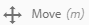

# Verwalten von Assets {#manag-assets}

In diesem Artikel wird das Verwalten und Bearbeiten von Assets in Adobe Experience Manager (AEM) beschrieben. Informationen zum Verwalten von Inhaltsfragmenten finden Sie unter [Inhaltsfragmente](content-fragments/content-fragments.md) .

## Erstellen von Ordnern {#creating-folders}

When organizing a collection of assets, for example, all `Nature` images, you can create folders to keep them together. Mit Ordnern können Sie Assets kategorisieren und organisieren. Bei AEM Assets müssen Sie Assets nicht in Ordner organisieren, um besser zu arbeiten.

>[!NOTE]
>
>Die Freigabe eines Asset-Ordners vom Typ `sling:OrderedFolder` wird bei der Weitergabe an Marketing Cloud nicht unterstützt. If you want to share a folder, do not select [!UICONTROL Ordered] when creating a folder.

1. Navigieren Sie zu dem Ort in Ihrem Ordner „Digitale Assets“, an dem Sie einen neuen Ordner erstellen möchten. Klicken Sie im Menü auf **[!UICONTROL Erstellen]**. Select **[!UICONTROL New Folder]**.
1. In the **[!UICONTROL Title]** field, provide a folder name. DAM verwendet standardmäßig den Titel, den Sie als Ordnernamen angegeben haben. Wenn der Ordner erstellt wurde, können Sie die Standardeinstellung außer Kraft setzen und einen anderen Ordnernamen angeben.
1. Klicken Sie auf **[!UICONTROL Erstellen]**. Ihr Ordner wird im Ordner „Digitale Assets“ angezeigt.

Die folgenden Zeichen (in der Liste durch Leerzeichen getrennt) werden nicht unterstützt:

* Der Name einer Asset-Datei darf keines der folgenden Zeichen enthalten: `* / : [ \\ ] | # % { } ? &`
* Der Name eines Asset-Ordners darf keines der folgenden Zeichen enthalten: `* / : [ \\ ] | # % { } ? \" . ^ ; + & \t`

## Upload assets {#uploading-assets}

Siehe [Hinzufügen digitaler Assets zu Experience Manager](add-assets.md).

### Gestreamte Uploads {#streamed-uploads}

Wenn Sie viele Assets in AEM hochladen, erhöhen sich die E/A-Anforderungen an den Server drastisch, was die Upload-Effizienz verringert und sogar dazu führen kann, dass einige Upload-Aufgaben zeitaufwendig ausfallen. AEM Assets unterstützt gestreamte Uploads von Assets. Durch Streaming-Uploads wird der I/O-Speicher des Datenträgers während des Upload-Vorgangs reduziert, da der Speicher des Assets in einem temporären Ordner auf dem Server vermieden wird, bevor er in das Repository kopiert wird. Stattdessen werden die Daten direkt an das Repository übertragen. Auf diese Weise wird die Zeit für das Hochladen von Assets und die Möglichkeit von Zeitüberschreitungen verringert. Das gestreamte Hochladen ist in AEM Assets standardmäßig aktiviert.

>[!NOTE]
>
>Das Hochladen von Streaming ist für AEM, das auf dem JEE-Server ausgeführt wird, mit einer Servlet-API-Version unter 3.1 deaktiviert.

### ZIP-Archiv mit Assets extrahieren {#extractzip}

Sie können ZIP-Archive wie jedes andere unterstützte Asset hochladen. Für ZIP-Dateien gelten dieselben Regeln für Dateinamen. Mit AEM können Sie ein ZIP-Archiv in einen DAM-Speicherort extrahieren. Wenn die Aktivdateien nicht die Erweiterung ZIP haben, aktivieren Sie die Dateityperkennung über den Inhalt.

Wählen Sie jeweils ein ZIP-Archiv aus, klicken Sie auf **[!UICONTROL Archiv extrahieren]** und wählen Sie einen Zielordner aus. Wählen Sie eine Option für den Umgang mit eventuellen Konflikten. Wenn die Assets in der ZIP-Datei bereits im Zielordner vorhanden sind, können Sie eine der folgenden Optionen auswählen: Extrahieren überspringen, vorhandene Dateien ersetzen, beide Assets durch Umbenennen behalten oder neue Version erstellen.

Nach Abschluss des Extrahierungsvorgangs erhalten Sie von AEM eine Benachrichtigung im Benachrichtigungsbereich. Während AEM das ZIP-Archiv extrahiert, können Sie ohne Unterbrechung des Extrahierungsvorgangs zu Ihrer Arbeit zurückkehren.

Die Funktion hat einige Einschränkungen:

* Wenn sich ein gleichnamiger Ordner am Ziel befindet, werden die Assets aus der ZIP-Datei in diesen extrahiert.
* Wenn Sie die Extrahierung abbrechen, werden die bereits extrahierten Assets nicht gelöscht.
* Sie können nicht gleichzeitig zwei ZIP-Dateien auswählen und extrahieren. Sie können jeweils nur ein ZIP-Archiv extrahieren.
* Wenn beim Hochladen eines ZIP-Archivs im Dialogfeld „Hochladen“ ein „500 Server Error“ angezeigt wird, versuchen Sie es nach der Installation des neuesten Service Packs erneut.

## Anzeigen einer Asset-Vorschau {#previewing-assets}

Gehen Sie wie folgt vor, um eine Vorschau eines Assets anzuzeigen.

1. Navigieren Sie in der Benutzeroberfläche &quot;Assets&quot;zum Speicherort des Assets, dessen Vorschau Sie anzeigen möchten.
1. Tippen Sie auf das gewünschte Asset, um es zu öffnen.

1. Im Vorschaumodus ist eine Zoom-Funktion für [unterstützte Bildtypen](/help/assets/file-format-support.md) verfügbar (mit interaktiver Bearbeitung).

   To zoom into an asset, tap/click `+` (or tap/click the magnifying glass on the asset). To zoom out, tap/click `-`. Beim Heranzoomen können Sie beliebige Bildbereiche durch Schwenken genauer untersuchen. Mit dem Zurücksetzen-Zoom-Pfeil kehren Sie zur ursprünglichen Ansicht zurück.

   Tap **[!UICONTROL Reset]** to reset the view to the original size.

## Eigenschaften bearbeiten {#editing-properties}

1. Navigieren Sie zum Speicherort des Assets, dessen Metadaten Sie bearbeiten möchten.

1. Select the asset, and tap/click **[!UICONTROL Properties]** from the toolbar to view asset properties. Wählen Sie alternativ die Schnellaktion **[!UICONTROL Eigenschaften]** auf der Asset-Karte aus.

   

1. In the [!UICONTROL Properties] page, edit the metadata properties under various tabs. Zum Beispiel bearbeiten Sie auf der Registerkarte **[!UICONTROL Allgemein]** den Titel, die Beschreibung usw.

   >[!NOTE]
   >
   >The layout of the [!UICONTROL Properties] page and the metadata properties available depend on the underlying metadata schema. To learn how to modify the layout of the [!UICONTROL Properties] page, see [Metadata Schemas](/help/assets/metadata-schemas.md).

1. Um ein bestimmtes Datum/eine Zeit für die Aktivierung der Assets einzustellen, verwenden Sie die Datumsauswahl neben dem Feld **[!UICONTROL Startzeit]**.

   

1. To deactivate the asset after a particular duration, choose the deactivation date/time from the date picker beside the **[!UICONTROL Off Time]** field. Das Deaktivierungsdatum sollte später als das Aktivierungsdatum für ein Asset sein. Nach der [!UICONTROL Abschaltzeit]sind ein Asset und seine Darstellungen weder über die Assets-Weboberfläche noch über die HTTP-API verfügbar.

   

1. Wählen Sie im Feld **[!UICONTROL Tags]** ein oder mehrere Tags aus. Um ein benutzerdefiniertes Tag hinzuzufügen, geben Sie den Namen des Tags in das Feld ein. Anschließend drücken Sie die Eingabetaste. Das neue Tag wird in AEM gespeichert.

   YouTube erfordert Tags zur Veröffentlichung und einen YouTube-Link (wenn ein geeigneter Link gefunden werden kann).

   >[!NOTE]
   >
   >Zum Erstellen von Tags sind Schreibrechte für `/content/cq:tags/default` das CRX-Repository erforderlich.

1. To provide a rating to the asset, tap/click the **[!UICONTROL Advanced]** tab and then tap/click the star at the appropriate position to assign the desired rating.

   

   Die Bewertungsnote, die Sie dem Asset zuweisen, wird unter **[!UICONTROL Ihre Bewertungen]** angezeigt. Die durchschnittliche Bewertungsnote, die das Asset von Benutzern erhält, wird unter **[!UICONTROL Bewertung]** angezeigt. Darüber hinaus wird die Aufschlüsselung der Bewertungen, die zur durchschnittlichen Bewertungsnote beitragen, unter **[!UICONTROL Bewertungsübersicht]** angezeigt. Sie können Assets basierend auf der durchschnittlichen Bewertungsnote durchsuchen.

1. To view usage usage statistics for the asset, click/tap the **[!UICONTROL Insights]** tab.

   Nutzungsstatistiken umfassen folgende Metriken:

   * Anzahl der Aufrufe oder Downloads des Assets
   * Kanäle/Geräte, über die das Asset genutzt wurde
   * Kreativlösungen, in denen das Asset kürzlich verwendet wurde
   Weitere Informationen finden Sie unter [Asset Insights](assets-insights.md).

1. Tippen oder klicken Sie auf **[!UICONTROL Speichern und schließen]**.
1. Navigieren Sie zur Benutzeroberfläche &quot;Assets&quot;. Die bearbeiteten Metadateneigenschaften, darunter Titel, Beschreibung, Bewertungen usw., werden auf der Asset-Karte in der Kartenansicht sowie in relevanten Spalten in der Listenansicht angezeigt.

## Kopieren von Assets {#copying-assets}

Beim Kopieren eines Assets oder eines Ordners wird das gesamte Asset bzw. der Ordner mitsamt seiner Inhaltsstruktur kopiert. Ein kopiertes Asset oder ein kopierter Ordner wird am Zielspeicherort dupliziert. Das Asset am Quellspeicherort bleibt unverändert.

Einige wenige, für eine bestimmte Kopie eines Assets eindeutige Attribute werden nicht übertragen. Beispiele:

* Relativer Pfad, Asset-ID, Erstellungsdatum und -zeitpunkt sowie Versionen und Versionsverlauf. Some of these properties are indicated by the properties `dam:relativePath`, `jcr:uuid`, `jcr:created`, and `cq:name`.

* Der Erstellungszeitpunkt und referenzierte Pfade sind für jedes Asset und jede seiner Wiedergaben eindeutig.

Die übrigen Eigenschaften und Metadateninformationen werden beibehalten. Eine Teilkopie wird beim Kopieren eines Assets nicht erstellt.

1. From the Assets UI, select one or more assets, and then tap/click the **[!UICONTROL Copy]** icon from the toolbar. Alternativ können Sie die Schnellaktion **[!UICONTROL Copy]**  auf der Asset-Karte auswählen.

   >[!NOTE]
   >
   >If you use the [!UICONTROL Copy] quick action, you can only copy one asset at a time.

1. Navigieren Sie zum Speicherort, in den Sie die Assets kopieren möchten.

   >[!NOTE]
   >
   >Wenn Sie ein Asset in denselben Speicherort kopieren, generiert AEM automatisch eine Variation des Namens. For example, if you copy an asset titled `Square`, AEM automatically generates the title for its copy as `Square1`.

1. Click the **[!UICONTROL Paste]** asset icon from the toolbar. Assets werden an diesen Speicherort kopiert.

   

   >[!NOTE]
   >
   >The **[!UICONTROL Paste]** icon is available in the toolbar until the paste operation is completed.

### Verschieben oder Umbenennen von Assets {#moving-or-renaming-assets}

1. Navigieren Sie zum Speicherort des Assets, das Sie verschieben möchten.

1. Select the asset, and tap/click the **[!UICONTROL Move]** icon  from the toolbar.

1. Führen Sie im Assistenten „Assets verschieben“ eine der folgenden Aktionen aus:

   * Geben Sie nach dem Verschieben den Namen für das Asset an. Then tap/click **[!UICONTROL Next]** to proceed.

   * Tap/click **[!UICONTROL Cancel]** to stop the process.
   >[!NOTE]
   >
   >* Sie können denselben Namen für das Asset angeben, wenn sich am neuen Speicherort kein Asset mit diesem Namen befindet. Sie sollten jedoch einen anderen Namen verwenden, wenn Sie das Asset an einen Speichertort verschieben, an dem bereits ein Asset mit demselben Namen vorhanden ist. Wenn Sie denselben Namen verwenden, generiert das System automatisch eine Variante dieses Namens. Wenn Sie beispielsweise ein Asset mit dem Namen „Quadrat“ kopieren, generiert das System den Namen „Quadrat1“ für die Kopie.
   >* Beim Umbenennen sind keine Leerzeichen in Dateinamen zulässig.

1. On the **[!UICONTROL Select Destination]** dialog, do one of the following:

   * Navigate to the new location for the assets, and then tap/click **[!UICONTROL Next]** to proceed.

   * Tap/click **[!UICONTROL Back]** to return to the **[!UICONTROL Rename]** screen.

1. If the assets being moved have any referencing pages, assets, or collections, the **[!UICONTROL Adjust References]** tab appears beside the **[!UICONTROL Select Destination]** tab.

   Do one of the following in the **[!UICONTROL Adjust References]** screen:

   * Specify the references to be adjusted based on the new details, and then tap/click **[!UICONTROL Move]** to proceed.

   * Aktivieren/deaktivieren Sie in der Spalte **[!UICONTROL Anpassen]** Referenzen zu den Assets.
   * Tap/click **[!UICONTROL Back]** to return to the **[!UICONTROL Select Destination]** screen.

   * Tap/click **[!UICONTROL Cancel]** to stop the move operation.
   Wenn Sie Verweise nicht aktualisieren, verweisen sie weiterhin auf den vorherigen Pfad des Assets. Wenn Sie die Verweise aktualisieren, werden sie an den neuen Asset-Pfad angepasst.

### Darstellungen verwalten {#managing-renditions}

1. Sie können Wiedergabeformate für ein Asset hinzufügen oder entfernen, mit Ausnahme des Originals. Navigieren Sie zum Speicherort des Assets, für das Sie Ausgabeformate hinzufügen oder entfernen möchten.

1. Tippen oder klicken Sie auf das Asset, um die Asset-Seite zu öffnen.

   

1. Tap/click the GlobalNav icon, and select **[!UICONTROL Renditions]** from the list.

   

1. Im Bereich **[!UICONTROL Wiedergabeformate]** wird die Liste der für das Asset generierten Wiedergabeformate angezeigt.

   

   >[!NOTE]
   >
   >Standardmäßig zeigt AEM Assets im Vorschaumodus nicht das ursprüngliche Wiedergabeformat des Assets an. Wenn Sie ein Administrator sind, können Sie Überlagerungen verwenden, um AEM Assets so zu konfigurieren, dass ursprüngliche Wiedergabeformate im Vorschaumodus angezeigt werden.

1. Wählen Sie ein Ausgabeformat aus, um es anzuzeigen oder zu löschen.

   **Löschen eines Ausgabeformats**

   Select a rendition from the **[!UICONTROL Renditions]** panel, and then tap/click the **[!UICONTROL Delete Rendition]** icon from the toolbar.

   

   **Ein neues Ausgabeformat hochladen**

   Navigate to the asset details page for the asset, and tap/click the **[!UICONTROL Add Rendition]** icon in the toolbar to upload a new rendition for the asset.

   

   >[!NOTE]
   >
   >If you select a rendition from the **[!UICONTROL Renditions]** panel, the toolbar changes context and displays only those actions that are relevant to the rendition. Optionen wie das Symbol „Ausgabeformat hochladen“ werden nicht angezeigt. Um diese Optionen in der Symbolleiste anzuzeigen, navigieren Sie zur Detailseite für das Asset.

   Sie können die Dimensionen für das anzuzeigende Ausgabeformat auf der Detailseite des entsprechenden Bild- oder Video-Assets konfigurieren. AEM Assets zeigt anhand der von Ihnen angegebenen Abmessungen das Ausgabeformat mit den genauen oder möglichst genauen Abmessungen an.

   To configure rendition dimensions of an image at the asset detail level, overlay the `renditionpicker` node (`libs/dam/gui/content/assets/assetpage/jcr:content/body/content/content/items/assetdetail/items/col1/items/assetview/renditionpicker`) and configure the value of the width property. Konfigurieren Sie die Eigenschaft **[!UICONTROL size (Long) in KB]** anstelle von „width“, um das Wiedergabeformat auf der Asset-Detailseite auf Grundlage der Bildgröße anzupassen. Bei größenbasierter Anpassung gibt die Eigenschaft `preferOriginal` der Originalgröße den Vorzug, wenn das angepasste Wiedergabeformat größer ist als das Original.

   Ebenso können Sie das Bild der Anmerkungsseite durch Überlagern anpassen `libs/dam/gui/content/assets/annotate/jcr:content/body/content/content/items/content/renditionpicker`.

   

   To configure rendition dimensions for a video asset, navigate to the `videopicker` node in the CRX repository at the location `/libs/dam/gui/content/assets/assetpage/jcr:content/body/content/content/items/assetdetail/items/col1/items/assetview/videopicker`, overlay the node, and then edit the appropriate property.

   >[!NOTE]
   >
   >Videoanmerkungen werden nur für Browser mit HTML5-kompatiblen Videoformaten unterstützt. Darüber hinaus werden je nach Browser unterschiedliche Videoformate unterstützt.

### View subassets {#viewing-subassets}

In AEM können Unter-Assets für Assets mit unterstützten Mehrfachseitenformaten wie PDF, AI, PowerPoint/Apple Keynote und InDesign generiert werden. Diese Unter-Assets sind im Prinzip normale Assets, jedoch sind sie mit ihren übergeordneten Assets verknüpft und vereinfachen die mehrseitige Ansicht in der Touch-optimierten Benutzeroberfläche.

Die Erstellung von Unter-Assets ist standardmäßig deaktiviert. To enable subasset generation, add the **[!UICONTROL Create Sub Asset]** step to the DAM Update Asset workflow.

For Word documents, the DAM Parse Word Documents workflow generates a `cq:Page` component from the contents of the Word document. The images extracted from the document are referenced from the `cq:Page` component. Diese Bilder werden auch dann extrahiert, wenn die Erstellung von Unter-Assets deaktiviert ist.

1. Um Unter-Assets anzuzeigen, navigieren Sie zum Speicherort des Assets und öffnen Sie die Asset-Seite.

1. Tap/click the GlobalNav icon, and choose **[!UICONTROL Subassets]** from the list

   

   >[!NOTE]
   >
   >Die Option **Unter-Assets** wird nur dann angezeigt, wenn Unter-Assets verfügbar sind oder für das Asset erstellt wurden.

   Wenn Sie **Unter-Assets** aus der Liste auswählen, zeigt die Seite **Unter-Asset** die Unter-Assets, die mit dem übergeordneten Asset verknüpft sind.

   

## Löschen von Assets {#delete-assets}

Um die eingehenden Verweise von anderen Seiten aufzulösen oder zu entfernen, aktualisieren Sie die entsprechenden Verweise, bevor Sie ein Asset löschen.

Deaktivieren Sie außerdem die Schaltfläche „Löschen erzwingen“ mithilfe einer Überlagerung, um zu verhindern, dass Benutzer referenzierte Assets löschen und fehlerhafte Links hinterlassen.

1. Navigieren Sie zum Speicherort der Assets, die Sie löschen möchten.

1. Select the asset, and tap/click the **[!UICONTROL Delete]** icon from the toolbar.

   

1. Klicken Sie im Bestätigungsdialogfeld auf:

   * **[!UICONTROL Abbrechen]**, um die Aktion abzubrechen.
   * **[!UICONTROL Löschen]**, um die Aktion zu bestätigen:

      * Wenn das Asset keine Referenzen aufweist, wird es gelöscht.
      * Wenn die Seite Referenzen aufweist, wird eine Fehlermeldung angezeigt mit dem Hinweis **Es wird auf ein oder mehrere Asset(s) verwiesen.** Sie können **[!UICONTROL Löschen erzwingen]** oder **[!UICONTROL Abbrechen]** auswählen.
   >[!NOTE]
   >
   >Zum Löschen eines Assets benötigen Sie die Berechtigung zum Löschen eines Dammes/Assets. Wenn Sie nur eine Änderungsberechtigung haben, haben Sie nur die Möglichkeit, die Asset-Metadaten zu bearbeiten und Notizen zum Asset hinzuzufügen. Sie können jedoch das Asset oder dessen Metadaten nicht löschen.

   >[!NOTE]
   >
   >Um die eingehenden Verweise von anderen Seiten aufzulösen oder zu entfernen, aktualisieren Sie die entsprechenden Verweise, bevor Sie ein Asset löschen.
   >
   >
   >Deaktivieren Sie außerdem die Schaltfläche „Löschen erzwingen“ mithilfe einer Überlagerung, um zu verhindern, dass Benutzer referenzierte Assets löschen und fehlerhafte Links hinterlassen.

## Herunterladen von Assets {#download-assets}

Siehe [Herunterladen von Assets aus AEM](/help/assets/download-assets-from-aem.md).

## Publish assets {#publish-assets}

<!--
>[!NOTE]
>
>For more information specific to Dynamic Media, see [Publishing Dynamic Media Assets.](/help/assets/dynamic-media/publishing-dynamicmedia-assets.md)
-->

1. Navigieren Sie zum Speicherort der Assets/Ordner, die Sie veröffentlichen möchten.

1. Either select the **[!UICONTROL Publish]** quick action from the asset card, or select the asset and tap/click the **[!UICONTROL Quick Publish]** icon from the toolbar.
1. Wenn das Asset andere Assets referenziert, werden die Verweise im Assistenten aufgelistet. Es werden nur Verweise angezeigt, die entweder unveröffentlicht sind oder seit der letzten Veröffentlichung/Aufhebung der Veröffentlichung geändert wurden. Wählen Sie die Referenzen aus, die Sie veröffentlichen möchten.

   

   >[!NOTE]
   >
   >Wenn der Ordner, den Sie veröffentlichen möchten, einen leeren Ordner enthält, wird der leere Ordner nicht veröffentlicht.

1. Tippen oder klicken Sie auf **[!UICONTROL Veröffentlichen]**, um die Aktivierung für die Assets zu bestätigen.

>[!CAUTION]
>
>Wenn Sie ein Asset veröffentlichen, das momentan verarbeitet wird, wird nur der ursprüngliche Inhalt veröffentlicht. Die Wiedergabeformate fehlen. Warten Sie entweder bis, die Verarbeitung abgeschlossen ist, und veröffentlichen Sie das Asset erst dann bzw. veröffentlichen Sie es erneut, wenn die Verarbeitung abgeschlossen ist.

## Rückgängigmachen der Veröffentlichung von Assets {#unpublishing-assets}

1. Navigieren Sie zum Speicherort des Assets/Asset-Ordners, das bzw. den Sie aus der Veröffentlichungsumgebung entfernen möchten (Veröffentlichung rückgängig machen).

1. Select the asset/folder to unpublish, and tap/click the **[!UICONTROL Manage Publication]** icon from the toolbar.

   

1. Select the **[!UICONTROL Unpublish]** action from the list.

   

1. Um die Veröffentlichung des Assets später rückgängig zu machen, wählen Sie **[!UICONTROL Veröffentlichung später rückgängig machen]** und anschließend ein Datum aus, an dem die Veröffentlichung des Assets rückgängig gemacht werden soll.
1. Legen Sie ein Datum fest, an dem die Assets aus der Veröffentlichungsumgebung entfernt werden sollen.
1. Wenn das Asset andere Assets referenziert, wählen Sie die Verweise aus, deren Veröffentlichung Sie rückgängig machen möchten. Tap/click **[!UICONTROL Unpublish]**.
1. Tippen oder klicken Sie im Bestätigungsdialogfeld auf:

   * **[!UICONTROL Abbrechen]**, um die Aktion abzubrechen.
   * **[!UICONTROL Rückgängigmachen der Veröffentlichung]** , um zu bestätigen, dass die Veröffentlichung der Assets am angegebenen Datum rückgängig gemacht wurde (nicht mehr in der Veröffentlichungsumgebung verfügbar).
   >[!NOTE]
   >
   >Wenn Sie die Veröffentlichung eines komplexen Assets rückgängig machen, machen Sie die Veröffentlichung des Assets rückgängig. Vermeiden Sie es, die Veröffentlichung der Verweise aufzuheben, da sie möglicherweise von anderen veröffentlichten Assets referenziert werden.

## Closed user group {#closed-user-group}

Eine geschlossene Benutzergruppe (Closed User Group, CUG) wird verwendet, um den Zugriff auf bestimmte aus AEM veröffentlichte Asset-Ordner zu beschränken. Wenn Sie eine CUG für einen Ordner erstellen, wird der Zugriff auf diesen Ordner (einschließlich Ordner-Assets und Unterordnern) auf zugewiesene Mitglieder und Gruppen beschränkt. Um auf einen Ordner zuzugreifen, müssen Benutzer mit ihren Sicherheitsanmeldedaten angemeldet sein.

CUGs stellen eine zusätzliche Möglichkeit dar, den Zugang zu Ihren Assets zu beschränken. Sie können auch eine Anmeldeseite für den Ordner konfigurieren.

1. Wählen Sie in der Assets-Benutzeroberfläche einen Ordner aus und tippen oder klicken Sie in der Symbolleiste auf das Symbol „Eigenschaften“, um die Eigenschaftsseite anzuzeigen.
1. Fügen Sie auf der Registerkarte **[!UICONTROL Berechtigungen]** unter **[!UICONTROL Geschlossene Benutzergruppe]** Mitglieder oder Gruppen hinzu.

   

1. Um einen Anmeldebildschirm anzuzeigen, wenn Benutzer auf den Ordner zugreifen, wählen Sie die Option **[!UICONTROL Aktivieren]** aus. Wählen Sie anschließend den Pfad zur Anmeldeseite in AEM aus und speichern Sie die Änderungen.

   

   >[!NOTE]
   >
   >Wenn Sie den Pfad zur Anmeldeseite nicht angeben, zeigt AEM die standardmäßige Anmeldeseite in der Veröffentlichungsinstanz an.

1. Veröffentlichen Sie den Ordner und versuchen Sie, über die Veröffentlichungsinstanz darauf zuzugreifen. Es wird ein Anmeldebildschirm angezeigt.
1. Wenn Sie Mitglied der CUG sind, geben Sie Ihre Anmeldedaten ein. Nachdem Sie von AEM authentifiziert wurden, wird der Ordner angezeigt.

## Assets suchen {#search-assets}

Die Suche nach Assets ist ein zentraler Faktor für die Nutzung eines digitalen Asset-Managements – sowohl für eine weitere Verwendung durch kreative Elemente als auch für eine robuste Verwaltung von Assets durch die Geschäftsbenutzer und Marketingexperten oder für die Verwaltung durch DAM-Administratoren.

Einfache, erweiterte und benutzerdefinierte Suchen zur Erkennung und Verwendung der am besten geeigneten Assets finden Sie unter [Assets in AEM suchen](/help/assets/search-assets.md).

## Schnellaktionen {#quick-actions}

Schnellaktion-Symbole sind jeweils nur für ein Asset verfügbar. Führen Sie je nach Gerät folgende Aktionen durch, um die Symbole der Schnellaktionen anzuzeigen:

* Touch-Geräte: Tippen und halten. Beispielsweise können Sie auf einem iPad auf ein Asset tippen und halten, damit die Schnellaktionen angezeigt werden.
* Non-Touch-Geräte: Mit Mauszeiger darüberfahren. Beispielsweise wird auf einem Desktop-Gerät die Schnellaktion angezeigt, wenn Sie den Mauszeiger über die Asset-Miniaturansicht bewegen.

## Bilder bearbeiten {#editing-images}

Mit den Bearbeitungswerkzeugen in der Oberfläche von AEM Assets können Sie kleine Bearbeitungsaktionen in Bild-Assets durchführen. Sie können Bilder beschneiden, drehen, spiegeln und auf andere Arten bearbeiten. Sie können auch Imagemaps zu den Assets hinzufügen.

>[!NOTE]
>
>Bei manchen Komponenten sind für den Vollbildmodus zusätzliche Optionen verfügbar.

1. Führen Sie einen der folgenden Schritte aus, um ein Element im Bearbeitungsmodus zu öffnen:

   * Select the asset and then click/tap the **[!UICONTROL Edit]** icon in the toolbar.
   * Tap/click the **[!UICONTROL Edit]** icon that appears on an asset in the Card view.
   * In the asset page, tap/click the **[!UICONTROL Edit]** icon in the toolbar.
   

1. To crop the image, tap/click the **Crop** icon.

   

1. Wählen Sie die gewünschte Option in der Liste aus. Der Zuschneidebereich wird basierend auf der gewählten Option auf dem Bild angezeigt. Mit der Option **Freihand** können Sie das Bild ohne Einschränkungen im Hinblick auf das Seitenverhältnis beschneiden.

   

1. Wählen Sie den zuzuschneidenden Bereich und ändern Sie die Größe oder Position auf dem Bild.
1. Verwenden Sie das Symbol **Fertig** (in der rechten oberen Ecke), um das Bild zu beschneiden. Durch Klicken auf **Fertigstellen** wird auch die Neuerstellung von Ausgabeformaten ausgelöst.

   

1. Use the **Undo** and **Redo** icons on the top right to revert to the uncropped image or retain the cropped image, respectively.

   

1. Tippen oder klicken Sie auf das entsprechende Drehsymbol, um das Bild im oder entgegen dem Uhrzeigersinn zu drehen.

   

1. Tippen oder klicken Sie auf das entsprechende Spiegelsymbol, um das Bild horizontal oder vertikal zu spiegeln.

   

1. Tap/click the **Finish** icon to save the changes.

   

>[!NOTE]
>
>Bildbearbeitung wird für die Dateiformate BMP, GIF, PNG und JPEG unterstützt.

<!-- You can also add image maps using the image editor. For details, see [Adding Image Maps](/help/assets/image-maps.md). -->

>[!NOTE]
>
>To edit a TXT file, set **Day CQ Link Externalizer** from Configuration Manager.

## Zeitleiste {#timeline}

In der Timeline können Sie diverse Ereignisse für ein ausgewähltes Objekt ansehen, wie z. B. aktive Workflows für ein Asset, Kommentare/Anmerkungen, Aktivitätsprotokolle und Versionen.

*Abbildung: Sortieren von Zeitleisteneinträgen für ein Asset*

>[!NOTE]
>
>In der [Konsole für Sammlungen](/help/assets/manage-collections.md#navigate-the-collections-console) bietet die Liste **[!UICONTROL Alle anzeigen]** Optionen, um nur Kommentare und Workflows anzuzeigen. Darüber hinaus wird die Timeline nur für Sammlungen auf der höchsten Ebene angezeigt, die in der Konsole aufgelistet sind. Sie wird nicht angezeigt, wenn Sie in einer der Sammlungen navigieren.

>[!NOTE]
>
>Die Timeline enthält mehrere [inhaltsfragmentspezifische Optionen](content-fragments/content-fragments.md).

## Anmerken {#annotating}

Anmerkungen sind Kommentare oder erläuternde Hinweise, die Bildern oder Videos hinzugefügt werden. Anmerkungen bieten Marketern die Möglichkeit, zusammenzuarbeiten und Feedback zu Assets bereitzustellen.

Videoanmerkungen werden nur für Browser mit HTML5-kompatiblen Videoformaten unterstützt. Die von AEM Assets unterstützten Videoformate hängen vom Browser ab.

>[!NOTE]
>
>Bei Inhaltsfragmenten werden [Anmerkungen im Fragment-Editor erstellt](content-fragments/content-fragments.md).

1. Navigieren Sie zum Speicherort des Assets, dem Sie Anmerkungen hinzufügen möchten.
1. Tap/click the **[!UICONTROL Annotate]** icon from one of the following:

   * [Schnellaktionen](#quick-actions)
   * In der Symbolleiste, nachdem Sie das Asset ausgewählt haben     oder zur Asset-Seite navigiert sind
   

1. Add a comment in the **[!UICONTROL Comment]** box at the bottom of the timeline. Sie haben auch die Möglichkeit, einen Bereich im Bild zu markieren und im Dialogfeld **[!UICONTROL Anmerkung hinzufügen]** eine Anmerkung hinzuzufügen.

   

1. Um einen Benutzer über eine Anmerkung zu benachrichtigen, geben Sie die E-Mail-Adresse des Benutzers an und fügen Sie den Kommentar hinzu. Beispiel: Um Aaron MacDonald über eine Anmerkung zu benachrichtigen, geben Sie „@aa“ ein. Vorschläge für alle übereinstimmenden Benutzer werden in einer Liste angezeigt. Wählen Sie die E-Mail-Adresse von Aaron in der Liste aus, um ihn über den Kommentar zu informieren. Sie können auch weitere Benutzer innerhalb, vor oder nach der Anmerkung taggen.

   >[!NOTE]
   >
   >For a non-administrator user, suggestions appear only if the user has Read permissions at */home* in Crx-de.

   

1. Nachdem Sie die Anmerkung hinzugefügt haben, klicken Sie auf **[!UICONTROL Hinzufügen]**, um sie zu speichern. Eine Benachrichtigung über die Anmerkung wird an Aaron gesendet.

   

   >[!NOTE]
   >
   >Sie können mehrere Anmerkungen hinzufügen, bevor Sie diese speichern.

1. Tippen oder klicken Sie auf **[!UICONTROL Schließen]**, um den Anmerkungsmodus zu verlassen.
1. To view the notification, log in to AEM Assets with Aaron MacDonald&#39;s credentials and click the **[!UICONTROL Notifications]** icon to view the notification.

   >[!NOTE]
   >
   >Sie können Video-Assets auch Anmerkungen hinzufügen. Während Videos mit Anmerkungen versehen werden, wird der Player angehalten, damit Sie einem Frame eine Anmerkung hinzufügen können. For details, see [managing video assets](manage-video-assets.md).

1. Wenn Sie eine andere Farbe auswählen möchten, um zwischen Benutzern zu unterscheiden, klicken/tippen Sie auf das Symbol „Profil“. Anschließend klicken/tippen Sie auf **[!UICONTROL Eigene Voreinstellungen]**.

   

   Specify the desired color in the **[!UICONTROL Annotation Color]** box and then click/tap **[!UICONTROL Accept]**.

   

>[!NOTE]
>
>Sie können auch Anmerkungen zu einer Sammlung hinzufügen. Wenn eine Sammlung jedoch untergeordnete Sammlungen enthält, können Sie nur der übergeordneten Sammlung Anmerkungen/Kommentare hinzufügen. Die Option „Anmerken“ ist nicht für untergeordnete Sammlungen verfügbar.

### Gespeicherte Anmerkungen anzeigen {#viewing-saved-annotations}

1. Um die gespeicherten Anmerkungen zu einem Asset anzuzeigen, navigieren Sie zum Speicherort des Assets und öffnen Sie die Asset-Seite für dieses Asset.

1. Tap/click the GlobalNav icon, and choose **[!UICONTROL Timeline]** from the list.

   

1. From the **[!UICONTROL Show All]** list in the timeline, select **[!UICONTROL Comments]** to filter the results based on annotations.

   

   Tippen oder klicken Sie im Bedienfeld **[!UICONTROL Timeline]** auf einen Kommentar, um die entsprechende Anmerkung auf dem Bild anzuzeigen.

   

   Tippen oder klicken Sie auf **[!UICONTROL Löschen]**, um einen bestimmten Kommentar zu löschen.

### Drucken von Anmerkungen {#printing-annotations}

Wenn ein Asset Anmerkungen enthält oder einem Review-Arbeitsablauf unterzogen wurde, können Sie das Asset zusammen mit Anmerkungen drucken und den Review-Status als PDF-Datei für die Offline-Überprüfung prüfen.

Sie können auch nur die Anmerkungen oder nur den Prüfungsstatus drucken.

Zum Drucken der Anmerkungen und des Prüfungsstatus tippen/klicken Sie auf das Symbol **[!UICONTROL Drucken]** und folgen Sie den Anweisungen im Assistenten. The **[!UICONTROL Print]** icon appears in the toolbar only when the asset has at least one annotation or review status assigned to it.

1. Öffnen Sie von der Assets-Benutzeroberfläche aus die Vorschauseite für ein Asset.
1. Führen Sie einen der folgenden Schritte aus:

   * Zum Drucken aller Anmerkungen und des Prüfungsstatus überspringen Sie Schritt 3. Dann fahren Sie direkt mit Schritt 4 fort.
   * To print specific annotations and review status, open the [timeline](/help/assets/manage-digital-assets.md#timeline) and then go to step 3.

1. Zum Drucken bestimmter Anmerkungen wählen Sie die Anmerkungen aus der Timeline aus.

   

   Um nur den Prüfungsstatus zu drucken, wählen Sie ihn aus der Timeline aus.

   

1. Tippen/klicken Sie in der Symbolleiste auf das Symbol **[!UICONTROL Drucken]**.

   

1. Wählen Sie im Dialogfeld „Drucken“ die Position, deren Anmerkungen/Prüfungsstatus in der PDF-Datei angezeigt werden sollen. For example, if you want the annotations/status to be printed at the top-right of the page that contains the printed image, use the **Top-Left** setting. Sie ist standardmäßig aktiviert.

   

   Sie können auch andere Einstellungen wählen, was von der von Ihnen gewünschten Position der Anmerkungen oder des Status in der gedruckten PDF-Datei abhängig ist. If you want the annotations/status to appear in a page that is separate from the printed asset, choose **[!UICONTROL Next Page]**.

   >[!NOTE]
   >
   >Längere Anmerkungen werden in der PDF-Datei möglicherweise nicht richtig gerendert. Für optimales Rendering wird empfohlen, Anmerkungen auf 50 Wörter zu begrenzen.

1. Tap/click **[!UICONTROL Print]**. Je nach der Option, die Sie in Schritt 2 wählen, zeigt die erstellte PDF-Datei die Anmerkungen/den Status an der angegebenen Position an. For example, if you choose to print both annotations and the review status using the **Top-Left** setting, the generated output resembles the PDF file depicted here.

   

1. Laden Sie die PDF-Datei herunter oder drucken Sie sie mithilfe der Optionen in der rechten oberen Ecke.

   

   >[!NOTE]
   >
   >Wenn das Asset Unter-Assets enthält, können Sie alle Unter-Assets zusammen mit ihren jeweiligen seitenweisen Anmerkungen drucken.

   Um das Erscheinungsbild der gerenderten PDF-Datei zu ändern, z. B. Schriftfarbe, Größe, Stil und Hintergrundfarbe der Kommentare und Status, öffnen Sie in Configuration Manager die **[!UICONTROL Konfiguration für PDF-Anmerkungen]** und ändern Sie die gewünschten Optionen. Um beispielsweise die Anzeigefarbe des Status „Bestätigt“ zu ändern, modifizieren Sie im entsprechenden Feld den Farbcode. Informationen zum Ändern der Schriftfarbe von Anmerkungen finden Sie unter [Anmerken](/help/assets/manage-digital-assets.md#annotating).

   

   Kehren Sie zu der gerenderten PDF-Datei zurück und aktualisieren Sie sie. Der aktualisierte PDF-Datei spiegelt die von Ihnen vorgenommenen Änderungen wider.

Wenn ein Asset Anmerkungen in Fremdsprachen (insbesondere nicht lateinischen Sprachen) enthält, müssen Sie zunächst den CQ-DAM-Handler-Gibson Font Manager Service auf dem AEM-Server konfigurieren, um diese Anmerkungen drucken zu können. Beim Konfigurieren des CQ-DAM-Handler-Gibson Font Manager Service geben Sie den Pfad an, über den auf die gewünschten Sprachen zugegriffen werden kann.

1. Open the CQ-DAM-Handler-Gibson Font Manager Service configuration page from the URL `https://[aem_server]:[port]/system/console/configMgr/com.day.cq.dam.handler.gibson.fontmanager.impl.FontManagerServiceImpl`.
1. Um den CQ-DAM-Handler-Gibson Font Manager Service zu konfigurieren, führen Sie einen der folgenden Schritte aus:

   * Unter der Option „Verzeichnis der Systemschriftarten“ geben Sie den vollständigen Pfad für das Verzeichnis der Schriftarten auf Ihrem System an. Als Mac-Benutzer können Sie beispielsweise unter der Option „Verzeichnis der Systemschriftarten“ den Pfad als */Library/Fonts* angeben. AEM ruft die Schriftarten aus diesem Verzeichnis ab.
   * Create a directory named `fonts` inside the ``crx-quickstart`` folder. CQ-DAM-Handler-Gibson Font Manager Service automatically fetches the fonts at the location `crx-quickstart/fonts`. Sie können diesen Standardpfad innerhalb der Option „Verzeichnis für Adobe-Serverschriftarten“ überschreiben.

   * Erstellen Sie einen neuen Ordner für Schriftarten in Ihrem System und speichern Sie in diesem Ordner die gewünschten Schriftarten. Anschließend geben Sie in der Option „Verzeichnis für Kundenschriftarten“ den vollständigen Pfad zu diesem Ordner ein.

1. Access the Annotation PDF configuration from the URL `https://[aem_server]:[4502]/system/console/configMgr/com.day.cq.dam.core.impl.annotation.pdf.AnnotationPdfConfig`.
1. Konfigurieren Sie die PDF-Datei, die Anmerkungen enthält, wie folgt mit der richtigen Schriftart:

   * Schließen Sie die Zeichenfolge `<font_family_name_of_custom_font, sans-serif>` in der Schriftfamilie ein. For example, if you want to print annotations in CJK (Chinese, Japanese and Korean), include the string `Arial Unicode MS, Noto Sans, Noto Sans CJK JP, sans-serif` in the font-family option. Wenn Sie Anmerkungen in Hindi drucken möchten, laden Sie die entsprechende Schrift herunter und konfigurieren Sie die Schriftfamilie als Arial Unicode MS, Noto Sans, Noto Sans CJK JP, Noto Sans Devanagari, sans-serif.

1. Starten Sie die AEM-Instanz neu.

Es folgt ein Beispiel, wie Sie AEM konfigurieren können, um Anmerkungen in CJK (Chinesisch, Japanisch und Koreanisch) zu drucken:

1. Laden Sie die Google Noto CJK-Schriftarten über die folgenden Links herunter und speichern Sie sie im Schriftartenverzeichnis, das in Font Manager Service konfiguriert ist.

   * All In One Super CJK font: [https://www.google.com/get/noto/help/cjk/](https://www.google.com/get/noto/help/cjk/)
   * Noto Sans (for European languages): [https://www.google.com/get/noto/](https://www.google.com/get/noto/)
   * Noto fonts for a language of your choice: [https://www.google.com/get/noto/](https://www.google.com/get/noto/)

1. Configure the annotation PDF file by setting the font-family parameter to `Arial Unicode MS, Noto Sans, Noto Sans CJK JP, sans-serif`. Diese Konfiguration ist standardmäßig verfügbar und funktioniert bei allen europäischen und CJK-Sprachen.
1. Wenn sich die Sprache Ihrer Wahl von den Sprachen unterscheidet, die in Schritt 2 erwähnt werden, fügen Sie der Standardschriftart einen entsprechenden (kommagetrennten) Eintrag hinzu.

## Asset versioning {#asset-versioning}

Bei der Versionierung wird eine Momentaufnahme von digitalen Assets zu einem bestimmten Zeitpunkt aufgezeichnet. Sie hilft Ihnen bei der späteren Wiederherstellung eines vorherigen Asset-Zustands. Wenn Sie etwa eine Änderung an einem Asset rückgängig machen wollen, stellen Sie die unbearbeitete Version des Assets wieder her.

In folgenden Szenarien werden Versionen erstellt:

* Sie ändern ein Bild in einer anderen Anwendung und laden es in AEM Assets hoch. Es wird eine Version des Bildes erstellt, damit das Original nicht überschrieben wird.
* Sie können die Metadaten eines Assets bearbeiten.
* Mit der AEM-Desktop-App können Sie ein vorhandenes Asset auschecken und Ihre Änderungen speichern. Es wird nicht bei jedem Speichern des Assets eine neue Version erstellt.

Sie können mithilfe eines Workflows die automatische Versionierung einstellen. Wenn Sie eine Version für ein Asset erstellen, werden die Metadaten und Darstellungen zusammen mit der Version gespeichert. Ausgabeformate sind gerenderte Alternativen für dieselben Bilder, z. B. ein PNG-Ausgabeformat einer hochgeladenen JPEG-Datei.

Die Versionierungsfunktion bietet folgende Möglichkeiten:

* Erstellen einer Version eines Assets
* Anzeigen der aktuellen Version eines Assets
* Zurücksetzen des Assets auf eine frühere Version

1. Navigieren Sie zum Speicherort des Assets, von dem Sie eine Version erstellen möchten, und klicken/tippen Sie es an, um seine Asset-Seite zu öffnen.

1. Tippen oder klicken Sie auf das GlobalNav-Symbol und wählen Sie **[!UICONTROL Timeline]** aus dem Menü aus.

   

1. Tap/click the **[!UICONTROL Actions]** (arrow) icon at the bottom to view the available actions you can perform on the asset.

   

1. Tippen oder klicken Sie auf **[!UICONTROL Als Version speichern]**, um eine Version für das Asset zu erstellen.

   

1. Add a label and comment, and then click **[!UICONTROL Create]** to create a version. Alternatively, tap/click **Cancel** to exit the operation.

   

1. To view the new version, open the **[!UICONTROL Show All]** list in the timeline from the asset details page or the Assets UI, and choose **[!UICONTROL Versions]**. Alle für ein Asset erstellten Versionen werden unter der Timeline-Registerkarte angezeigt. You can filter the list to show Versions, by clicking the drop arrow and selecting **[!UICONTROL Versions]** from the list.

   

1. Wählen Sie eine bestimmte Version für das Asset aus, um sie in der Vorschau anzuzeigen, oder aktivieren Sie sie, damit sie in der Assets-Benutzeroberfläche angezeigt wird.

   

1. Fügen Sie eine Beschriftung und Kommentare für die Version hinzu, um in der Assets-Benutzeroberfläche auf diese bestimmte Version zurückzusetzen.

   

1. To generate a preview for the version, tap/click **[!UICONTROL Preview Version]**.
1. To display this version in the Assets UI, select **[!UICONTROL Revert to this Version]**.
1. Um zwei Versionen miteinander zu vergleichen, gehen Sie zur Asset-Seite des Assets und tippen oder klicken Sie auf die Version, die mit der aktuellen Version verglichen werden soll.

   

1. Wählen Sie in der Timeline die Version aus, die Sie vergleichen wollen, und ziehen Sie den Schieberegler nach links, um diese Version über die aktuelle Version zu setzen.

   

### Starte a workflow on an asset {#starting-a-workflow-on-an-asset}

1. Navigieren Sie zum Speicherort des Assets, für das Sie einen Workflow beginnen möchten, und tippen/klicken Sie auf das Asset, um die Asset-Seite zu öffnen.
1. Tap/click the GlobalNav icon, and the choose **[!UICONTROL Timeline]** from the menu to display the timeline.

   

1. Tap/click the **[!UICONTROL Actions]** (arrow) icon at the bottom to open the list of actions available for the asset.

   

1. Tap/click **[!UICONTROL Start Workflow]** from the list.

   

1. Wählen Sie im Dialogfeld **[!UICONTROL Workflow beginnen]** ein Workflow-Modell aus der Liste.

   

1. (Optional) Geben Sie einen Titel für den Workflow an, der für den Verweis auf die Workflow-Instanz verwendet werden kann.

   

1. Tap/click **[!UICONTROL Start]** and then tap/click **[!UICONTROL Proceed]** in the dialog to confirm. Jeder Schritt des Workflows wird in der Timeline als ein Ereignis angezeigt.

   

## Sammlungen {#collections}

Bei einer Sammlung handelt es sich um eine sortierte Gruppe von Assets. Anhand von Sammlungen können Assets von mehreren Benutzern gemeinsam verwendet werden.

* Eine Sammlung kann Assets aus verschiedenen Speicherorten enthalten, da sie nur Verweise zu diesen Assets aufweisen. Jede Sammlung hält die referenzielle Integrität von Assets aufrecht.
* Sie können Sammlungen für mehrere Benutzer mit unterschiedlichen Berechtigungsstufen wie Bearbeiten, Anzeigen usw. freigeben.

See [Managing Collections](/help/assets/manage-collections.md) for details on collection management.
