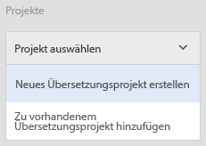
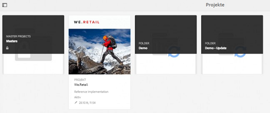
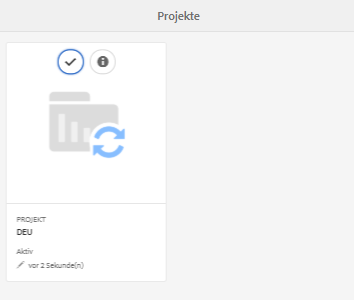
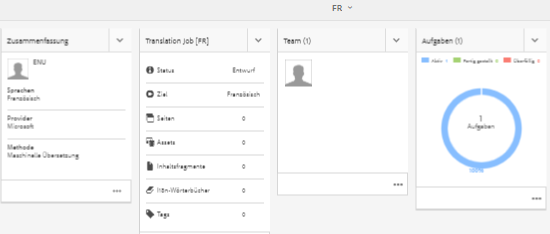
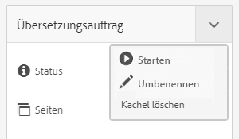
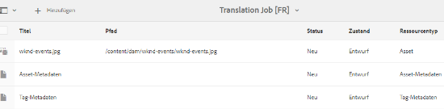
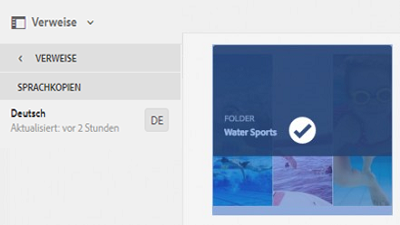
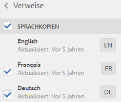

# Verwalten von ebenenübergreifenden Assets {#managing-compound-assets}

Adobe Experience Manager (AEM) Assets kann erkennen, ob eine hochgeladene Datei Referenzen zu Assets enthält, die bereits im Repository vorhanden sind. Diese Funktion ist nur für unterstützte Dateiformate verfügbar. Wenn das hochgeladene Asset Referenzen zu AEM-Assets enthält, wird eine bidirektionale Verknüpfung zwischen dem hochgeladenen Asset und den referenzierten Assets erstellt.

Durch die Referenzierung von AEM-Assets in Adobe Creative Cloud-Anwendungen wird Redundanz beseitigt und die Zusammenarbeit verbessert. Außerdem werden die Effizienz und Produktivität der Benutzer gesteigert.

AEM Assets unterstützt die **bidirektionale Referenzierung**. Referenzierte Assets finden Sie auf der Asset-Detailseite der hochgeladenen Datei. Darüber hinaus finden Sie die referenzierenden Dateien für AEM-Assets auf der Asset-Detailseite des referenzierten Assets.

Referenzen werden auf der Grundlage von Pfad, Dokument-ID und Instanz-ID der referenzierten Assets aufgelöst.

## Hinzufügen von AEM-Assets als Referenzen in Adobe Illustrator  {#refai}

Sie können vorhandene AEM-Assets aus einer Adobe Illustrator-Datei referenzieren.

1. Verwenden Sie das [AEM-Desktop-Programm](https://docs.adobe.com/content/help/en/experience-manager-desktop-app/using/using.html), um das AEM Asset-Repository als Laufwerk auf Ihrem lokalen Rechner einzubinden. Navigieren Sie im bereitgestellten Laufwerk zum Speicherort des Assets, das Sie referenzieren möchten.
1. Ziehen Sie das Asset vom bereitgestellten Laufwerk auf die Illustrator-Datei.
1. Speichern Sie die Illustrator-Datei im bereitgestellten Laufwerk oder [laden](/help/assets/manage-digital-assets.md#uploading-assets) Sie sie in das AEM-Repository hoch.
1. Nachdem der Workflow abgeschlossen ist, navigieren Sie zur Detailseite für das Asset. Die Referenzen zu vorhandenen AEM-Assets werden unter **Abhängigkeiten** in der Spalte **Verweise** aufgeführt.

   

1. Es ist auch möglich, dass andere Dateien als die aktuelle Datei auf die referenzierten Assets verweisen, die unter **Abhängigkeiten** angezeigt werden. Um eine Liste der referenzierenden Dateien für ein Asset anzuzeigen, klicken Sie unter **Abhängigkeiten** auf das Asset.

   

1. Klicken Sie in der Symbolleiste auf das Symbol **Eigenschaften anzeigen**. Auf der Seite „Eigenschaften“ wird die Liste der Dateien, die das aktuelle Asset referenzieren, auf der Registerkarte **Allgemein** unter der Spalte **Verweise** angezeigt.

   

## Hinzufügen von AEM-Assets als Referenzen in Adobe InDesign {#add-aem-assets-as-references-in-adobe-indesign}

Um AEM-Assets aus einer InDesign-Datei zu referenzieren, ziehen Sie die AEM-Assets auf die InDesign-Datei oder exportieren Sie die InDesign-Datei als ZIP-Datei.

Referenzierte Assets sind bereits in AEM Assets enthalten. <!-- You can extract subassets by [configuring InDesign server](/help/assets/indesign.md). Embedded assets in an InDesign file are extracted as subassets. -->

>[!NOTE]
>
>Wenn der InDesign-Server als Proxyserver dient, wird die Vorschau der InDesign-Dateien innerhalb der XMP-Metadaten eingebettet. In diesem Fall ist die Extraktion von Miniaturen nicht explizit erforderlich. Wenn der InDesign-Server nicht als Proxyserver fungiert, müssen Miniaturen für InDesign-Dateien explizit extrahiert werden.

### Erstellen von Referenzen durch Ziehen von AEM-Assets   {#create-references-by-dragging-aem-assets}

Dieses Verfahren weist Ähnlichkeiten zur in [Hinzufügen von AEM-Assets als Referenzen in Adobe Illustrator](#refai) beschriebenen Prozedur auf.

### Erstellen von Referenzen zu AEM-Assets durch Exportieren einer ZIP-Datei {#create-references-to-aem-assets-by-exporting-a-zip-file}

1. Erstellen Sie ein neues Workflow-Modell.
1. Exportieren Sie das Dokument mit der Paketfunktion von Adobe InDesign.
Adobe InDesign kann ein Dokument und die verknüpften Assets als Paket exportieren. In diesem Fall enthält der exportierte Ordner einen Links-Ordner, der Teil-Assets in der InDesign-Datei enthält.
1. Erstellen Sie eine ZIP-Datei und laden Sie sie in das AEM-Repository hoch.
1. Starten Sie den Unarchiver-Workflow.
1. Wenn der Workflow abgeschlossen ist, werden die Referenzen im Link-Ordner automatisch als Teil-Assets referenziert. Um eine Liste der referenzierten Assets anzuzeigen, navigieren Sie zur Asset-Detailseite des InDesign-Assets und schließen Sie die [Leiste](/help/sites-cloud/authoring/getting-started/basic-handling.md#rail-selector).

## Hinzufügen von AEM-Assets als Referenzen in Adobe Photoshop {#refps}

1. Mit einem WebDAV-Client installieren Sie AEM Assets als Laufwerk.
1. Um Referenzen zu AEM-Assets in einer Photoshop-Datei zu erstellen, navigieren Sie im bereitgestellten Laufwerk zu den entsprechenden Assets mit der Funktion „Verknüpftes Smartobjekt platzieren“ in Photoshop.

   

1. Speichern Sie die Photoshop-Datei auf dem eingebundenen Laufwerk oder [laden](/help/assets/manage-digital-assets.md#uploading-assets) Sie sie in das AEM-Repository hoch.
1. Nach Abschluss des Workflows werden die Referenzen zu vorhandenen AEM-Assets auf der Asset-Detailseite aufgeführt.

   Rufen Sie die referenzierten Assets auf, indem Sie die [Leiste](/help/sites-cloud/authoring/getting-started/basic-handling.md#rail-selector) auf der Asset-Detailseite schließen.

1. Die referenzierten Assets enthalten auch die Liste der Assets, von denen sie referenziert werden. Um eine Liste der referenzierten Assets anzuzeigen, navigieren Sie zur Asset-Detailseite und schließen Sie die [Leiste](/help/sites-cloud/authoring/getting-started/basic-handling.md#rail-selector).

>[!NOTE]
>
>Die Assets innerhalb der ebenenübergreifenden Assets können ebenfalls basierend auf ihrer Dokument-ID und ihrer Instanz-ID referenziert werden. Diese Funktion ist nur in Adobe Illustrator und Adobe Photoshop verfügbar. Bei anderen Versionen erfolgt die Referenzierung basierend auf dem relativen Pfad von verknüpften Assets im ebenenübergreifenden Haupt-Asset, wie das auch bei früheren Versionen von AEM der Fall ist.

## Anzeigen von Seiten einer mehrseitigen Datei  {#view-pages-of-a-multi-page-file}

Über die Viewer-Funktion von AEM Assets können Sie einzelne Seiten in mehrseitigen Dateien anzeigen, einschließlich PDF-, INDD-, PPT-, PPTX- und AI-Dateien. In InDesign können Sie Seiten mithilfe des InDesign-Servers extrahieren. Wenn die Vorschau von Seiten bei der Erstellung einer InDesign-Datei gespeichert wird, ist der InDesign-Server nicht für die Seitenextraktion erforderlich.

Sie können die einzelnen Seiten einer Datei auf der Asset-Seite durchblättern. Sie können Optionen in der Symbolleiste verwenden, um einzelne Seiten der Datei zu kommentieren. Sie können auch die Option **Seitenübersicht** verwenden, um alle Seiten gleichzeitig anzuzeigen.

1. Navigieren Sie in AEM Assets zu dem Ordner, der die mehrseitige Datei enthält.
1. Klicken Sie auf ein Asset, um die entsprechende Asset-Seite anzuzeigen.

   

1. Klicken Sie auf das globale Navigationssymbol und wählen Sie dann im Menü die Option **Seiten** aus.

   

1. Klicken Sie unterhalb des Bildes auf den Pfeil nach links bzw. nach rechts, um zu einzelnen Seiten in der Datei zu navigieren.

   

1. Um Anmerkungen auf einer Seite hinzuzufügen, klicken Sie in der Symbolleiste auf das Symbol **Kommentieren** und geben Sie einen Kommentar ein.

   

1. Um die Datei herunterzuladen, klicken Sie auf das Symbol **Herunterladen**.

   

1. Um alle Seiten der Datei gleichzeitig anzuzeigen, klicken Sie auf das Symbol **Seitenübersicht**.

   

1. Um den Aktivitäts-Stream mit Anmerkungen und Downloads für die Datei anzuzeigen, klicken Sie auf das globale Navigationssymbol und wählen Sie dann im Menü die Option **Timeline** aus.

   

1. Um die Metadateneigenschaften der Seite anzuzeigen und zu bearbeiten, klicken Sie in der Symbolleiste auf das Symbol **Eigenschaften anzeigen**.

   
