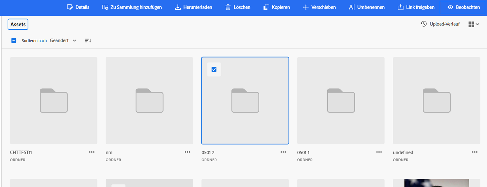
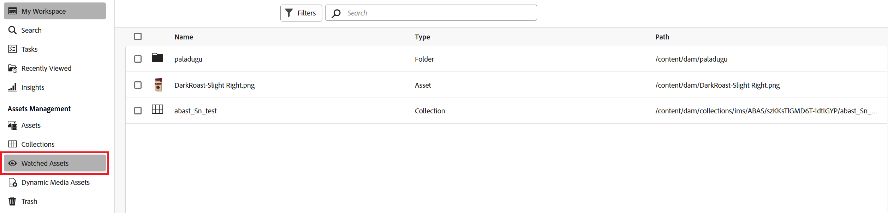

# Überwachen von Assets, Ordnern und Sammlungen {#watch-assets-folders}

Assets-Ansichtsbenachrichtigungen ermöglichen es Ihnen, die Vorgänge zu überwachen, die mit den im Repository verfügbaren Assets, Ordnern oder Sammlungen durchgeführt werden. Sie müssen den Inhalt auswählen und abonnieren, für den die Benachrichtigungen an Sie gesendet werden sollen. Sie können auch die Kategorien konfigurieren, für die die Benachrichtigungen an Sie gesendet werden.

## Abonnieren von Benachrichtigungskategorien {#subscribe-to-notification-categories}

Sie können aus einer Liste von Kategorien auswählen und diese abonnieren, um Benachrichtigungen zu erhalten. Die Assets-Ansicht sendet Ihnen die Benachrichtigungen nur für die Kategorien, die Sie aus den verfügbaren Optionen ausgewählt haben:

<table>
    <tbody>
     <tr>
      <th><strong>Benachrichtigungskategorie</strong></th>
      <th><strong>Beschreibung</strong></th>
     </tr>
     <tr>
      <td>Anfragen</td>
      <td>Wenn Sie einem Benutzer eine Aufgabe zuweisen, erhalten Sie Benachrichtigungen, wenn von diesem Benutzer Aktionen zu dieser Aufgabe durchgeführt werden.</td>
     </tr>
     <tr>
      <td>Mir zugewiesen</td>
      <td>Sie erhalten eine Benachrichtigung, wenn Ihnen eine Aufgabe von einem anderen Benutzer zugewiesen wurde.</td>
     </tr>
     <tr>
      <td>Kommentar zu abonnierten Inhalten</td>
      <td>Sie erhalten eine Benachrichtigung, wenn ein Nutzer einen Kommentar zu Ihrem abonnierten Asset abgibt.</td>
     </tr>
     <tr>
      <td>Löschung abonnierter Inhalte</td>
      <td>Sie erhalten eine Benachrichtigung, wenn Benutzende Ihr abonniertes Asset, Ihren abonnierten Ordner oder Ihre abonnierte Sammlung löschen.</td>
     </tr>
     <tr>
      <td>Externe Freigabe abonnierter Inhalte</td>
      <td>Sie erhalten eine Benachrichtigung, wenn Benutzende einen öffentlichen Link für Ihr abonniertes Asset, Ihren abonnierten Ordner oder Ihre abonnierte Sammlung erstellen.</td>
     </tr>
     <tr>
      <td>Änderung von abonnierten Inhalten</td>
      <td>Sie erhalten eine Benachrichtigung, wenn ein Benutzer eine neue Version für Ihr abonniertes Asset erstellt.</td>
     </tr>
     <tr>
      <td>Verschieben/Umbenennen abonnierter Inhalte</td>
      <td>Sie erhalten eine Benachrichtigung, wenn ein Benutzer Ihr abonniertes Asset oder Ihren Ordner verschiebt oder umbenennt.</td>
     </tr>
     <tr>
      <td>Aktualisierungen von abonnierten Ordnern und Sammlungen</td>
      <td>Sie erhalten eine Benachrichtigung, wenn Benutzende ein Asset zu einem abonnierten Ordner oder einer abonnierten Sammlung hinzufügt oder daraus entfernen.</td>
     </tr>    
    </tbody>
   </table>

So abonnieren Sie die Benachrichtigungskategorien:

1. Klicken Sie in der Benutzeroberfläche der Assets-Ansicht auf das  am rechten Ende der Menüleiste.

1. Klicken Sie auf das Symbol , um die Seite [!UICONTROL Experience Cloud-Einstellungen] anzuzeigen.

1. Klicken Sie auf die Option **[!UICONTROL Benachrichtigungen]** im linken Fensterbereich.

1. Navigieren Sie im Abschnitt **[!UICONTROL Benachrichtigungen]** zum Abschnitt [!UICONTROL Assets-Ansicht] und vergewissern Sie sich, dass die Umschaltoption auf EIN geschaltet ist.

   

1. Klicken Sie auf **[!UICONTROL Anpassen]**, um die Benachrichtigungskategorien anzuzeigen.
   

1. Wählen Sie die Benachrichtigungskategorien aus, für die Sie benachrichtigt werden möchten.

## Beobachten oder Nicht-Beobachten von Ordnern, Assets oder Sammlungen {#watch-unwatch-assets}

Sie können Ordner, Assets oder Sammlungen beobachten und die Beobachtung aufheben, um auf dem Laufenden zu bleiben und so eine bessere Zusammenarbeit mit den überwachten Assets zu ermöglichen.

Nachdem Sie [die Benachrichtigungskategorien abonniert haben](#subscribe-to-notification-categories), müssen Sie den Inhalt abonnieren, damit Sie Benachrichtigungen erhalten.

>[!NOTE]
>
>* Für die Benachrichtigungskategorien **[!UICONTROL Anfragen]** und **[!UICONTROL Mir zugewiesen]** müssen Sie den Inhalt nicht abonnieren, nachdem Sie die Benachrichtigungskategorien abonniert haben. Sie werden automatisch benachrichtigt, wenn Sie eine Anfrage erstellen oder wenn Ihnen eine Aufgabe zugewiesen wird.
>* Die Assets-Ansicht sendet nur Benachrichtigungen, wenn andere Menschen Aktionen für abonnierte Inhalte ausführen. Sie erhalten keine Benachrichtigungen über die Aktionen, die Sie für den abonnierte Inhalte ausführen.

### Inhalte abonnieren {#subscribe-to-content}

Führen Sie die folgenden Schritte aus, um Ordner, Assets oder Sammlungen zu abonnieren:

1. Durchsuchen Sie den Ordner, das Asset oder die Sammlung, den/die Sie abonnieren möchten, und klicken Sie auf **[!UICONTROL Ansehen]**.

1. Die Assets-Ansicht zeigt eine Erfolgsmeldung an. Sie können in der Erfolgsmeldung auf **[!UICONTROL Zu Benachrichtigungseinstellungen gehen]** klicken, um Ihr [Abonnement für Benachrichtigungskategorien](#subscribe-to-notification-categories) zu bearbeiten.

   

Die Assets-Ansicht sendet jetzt Benachrichtigungen für die abonnierten Kategorien. Sie können auch mehrere Assets, Ordner oder Kollektionen auswählen und auf **[!UICONTROL Ansehen]** klicken, um Zeit zu sparen. Wenn Sie jedoch mehrere Elemente auswählen und einige bereits abonniert sind, wird die Option **[!UICONTROL Beobachten]** nicht angezeigt.

### Abonnierte Inhalte anzeigen {#view-subscribed-content}

Gehen Sie wie folgt vor, um abonnierte Inhalte anzuzeigen:

1. Navigieren Sie zu **[!UICONTROL Überwachter Assets]** unter [!UICONTROL Asset-Management].

1. Die Assets-Ansicht zeigt eine Liste der abonnierten Assets an, einschließlich ihres Namens, Typs und Pfads. Wählen Sie ein Asset, einen Ordner oder eine Sammlung aus der Liste aus, um seine Details, seinen Speicherort oder sein [ anzuzeigen](#unsubscribe-to-content).

   

### Anzeigen von Inhaltsabonnentinnen und -abonnenten {#view-content-subscribers}

Gehen Sie wie folgt vor, um Ihre Inhaltsabonnentinnen und -abonnenten anzuzeigen:

1. Navigieren Sie im Ordner, Asset oder in der Sammlung und wählen Sie **[!UICONTROL Details]** aus.

1. Klicken Sie  rechten Bereich, um eine Liste der Beobachter des Inhalts anzuzeigen.

   Klicken Sie alternativ auf  im rechten Bereich, um die Inhaltsbeobachter anzuzeigen.

### Abonnement des Inhalts beenden {#unsubscribe-to-content}

Abmelden:

1. Navigieren Sie **[!UICONTROL Überwachte Assets]** unter [!UICONTROL Asset-Management].

1. Wählen Sie das Asset, den Ordner oder die Kollektion aus, von dem bzw. der Sie das Abonnement kündigen möchten, und klicken Sie auf **[!UICONTROL Nicht mehr beobachten]**.

   

Alternativ können Sie den Ordner, das Asset oder die Sammlung unter [!UICONTROL Asset-Management“ ]. Wählen Sie das [abonnierte Asset](#subscribe-to-content) und klicken Sie auf **[!UICONTROL Nicht mehr beobachten]**.

## Anzeigen von Benachrichtigungen {#view-notifications}

Die Benachrichtigungen werden in der Benutzeroberfläche der Assets-Ansicht am rechten Ende der Menüleiste angezeigt.

Wenn Sie auf eine Benachrichtigung klicken, gelangen Sie in der Assets-Ansicht zum entsprechenden Asset oder Ordner, worauf sich die Benachrichtigung bezieht.
