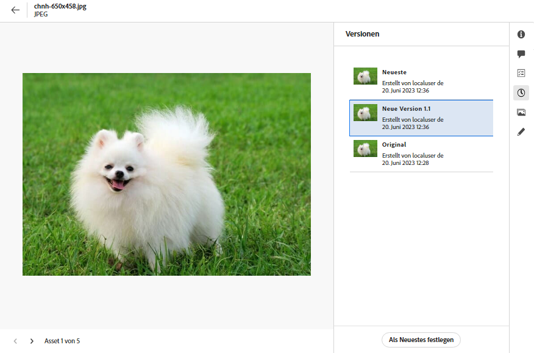

# Verwalten von Assets {#manage-assets}

| [Best Practices für die Suche](/help/assets/search-best-practices.md) | [Best Practices für Metadaten](/help/assets/metadata-best-practices.md) | [Content Hub](/help/assets/product-overview.md) | [Dynamic Media mit OpenAPI-Funktionen](/help/assets/dynamic-media-open-apis-overview.md) | [Entwicklerdokumentation zu AEM Assets](https://developer.adobe.com/experience-cloud/experience-manager-apis/) |
| ------------- | --------------------------- |---------|----|-----|

Mithilfe der benutzerfreundlichen Oberfläche von [!DNL Assets view] können Sie mühelos verschiedene Aufgaben des Digital Asset Management (DAM) ausführen. Nachdem Sie die Assets hinzugefügt haben, können Sie sie suchen, herunterladen, verschieben, kopieren, umbenennen, löschen, aktualisieren und bearbeiten.

Verwenden Sie [!DNL Assets view], um die folgenden Asset-Management-Aufgaben auszuführen. Wenn Sie ein Asset auswählen, werden die folgenden Optionen in der Symbolleiste oben angezeigt.

*Abbildung: In der Symbolleiste verfügbare Optionen für ein ausgewähltes Bild.*

*  Aufheben der Auswahl.

*  Suchen Sie anhand der Metadaten und Smart Tags nach ähnlichen Bild-Assets in der Assets-Benutzeroberfläche.

*  Anklicken, um ein Asset in der Vorschau anzuzeigen und die detaillierten Metadaten anzuzeigen. Aus der Vorschau heraus können Sie die Versionen anzeigen und ein Bild bearbeiten.

*  Lädt das ausgewählte Asset in Ihr lokales Dateisystem herunter.

*  Fügt das ausgewählte Asset zu einer Sammlung hinzu.

*  Heftet ein Asset an, um bei späterem Bedarf schneller darauf zugreifen zu können. Alle angehefteten Elemente werden im Dashboard „Mein Arbeitsbereich“ im Abschnitt **Schnellzugriff** angezeigt.

*  Bearbeiten eines Bildes in der integrierten Adobe Express-Anwending in Adobe Experience Manager Assets.

*  Bearbeiten des Bildes mit Adobe Express.

*  für Assets mit anderen Benutzenden, damit diese darauf zugreifen und die Assets herunterladen können.

*  Löscht das ausgewählte Asset oder den ausgewählten Ordner.

*  Kopiert die ausgewählte Datei oder den ausgewählten Ordner.

*  Verschiebt das ausgewählte Asset oder den ausgewählten Ordner an einen anderen Speicherort in der Repository-Hierarchie.

*  Benennt das ausgewählte Asset oder den ausgewählten Ordner um. Verwenden Sie einen eindeutigen Namen, sonst schlägt die Umbenennung mit einer Warnung fehl. Sie können es mit einem anderen Namen erneut versuchen.
Außerdem können Sie auf den Titel eines Assets oder eines Ordners klicken, um ihn umzubenennen. Geben Sie den neuen Text in das Textfeld **Asset umbenennen** ein und klicken Sie auf **Speichern**. Diese Funktion ist in den Ansichten „Raster“, „Galerie“, „Wasserfall“ und „Liste“ verfügbar.

*  [!UICONTROL Wasserfallansicht].

*  Fügt ein Asset zur Bibliothek hinzu.

*  Weist anderen Benutzenden Aufgaben zu, damit sie an einem Asset zusammenarbeiten können.

*  Überwachen der an einem Asset ausgeführten Vorgänge.

Sie können die gleichen Optionen bei den Miniaturansichten der Assets anzeigen.

[!DNL Assets view] zeigt nur die relevanten Optionen in der Symbolleiste an, die vom Typ des ausgewählten Assets abhängen.

*Abbildung: In der Symbolleiste verfügbare Optionen für einen ausgewählten Ordner.*

*Abbildung: In der Symbolleiste verfügbare Optionen für eine ausgewählte PDF-Datei.*

## Herunterladen und Verteilen von Assets {#download}

Sie können ein oder mehrere Assets oder Ordner oder eine Kombination aus beiden auswählen und die Auswahl in Ihr lokales Dateisystem herunterladen. Sie können die Assets bearbeiten und erneut hochladen oder die Assets außerhalb von [!DNL Assets view] verteilen. Sie können auch [die Ausgabedarstellungen eines Assets herunterladen](/help/assets/add-delete-assets-view.md#renditions).

## Asset-Versionierung {#versions-of-assets}

<!-- 
TBD: query for engineering: How many versions are maintained. What happens when we reach that limit? Are old versions automatically removed? -->

[!DNL Assets view] versioniert die Assets, wenn die Assets, die aktualisiert oder bearbeitet werden, erneut hochgeladen werden. Sie können den Versionsverlauf und frühere Versionen anzeigen und eine frühere Version von Assets als neueste Version wiederherstellen, die bei Bedarf auf eine frühere Version zurückgesetzt wird. Asset-Versionen werden in den folgenden Szenarien erstellt:

* Ein neues Asset wird mit demselben Dateinamen wie ein vorhandenes Asset und in denselben Ordner wie das vorhandene Asset hochgeladen. [!DNL Assets view] fordert dazu auf, entweder das vorherige Asset zu überschreiben oder das neue Asset als Version zu speichern. Siehe [Hochladen von Asset-Duplikaten](/help/assets/add-delete-assets-view.md).

  

  *Abbildung: Beim Hochladen eines Assets mit dem Namen eines vorhandenen Assets können Sie eine Version des Assets erstellen.*

* Bearbeiten Sie ein Bild und klicken Sie auf **[!UICONTROL Als Version speichern]**. Siehe [Bearbeiten von Bildern](/help/assets/edit-images-assets-view.md).

  

  *Abbildung: Speichern Sie das bearbeitete Bild als Version.*

* Öffnen Sie die Versionen eines vorhandenen Assets. Klicken Sie auf **[!UICONTROL Neue Version]** und laden Sie eine neuere Version des Assets in das Repository hoch.

  

### Anzeigen von Versionen eines Assets {#view-versions}

Beim Hochladen eines Duplikats oder einer geänderten Kopie eines Assets können Sie dessen Versionen erstellen. Mit der Versionierung können Sie historische Assets überprüfen und bei Bedarf zu einer früheren Version zurückkehren.

Um Versionen anzuzeigen, öffnen Sie die Vorschau eines Assets und klicken Sie in der rechten Seitenleiste auf **[!UICONTROL Versionen]** . Um eine bestimmte Version in der Vorschau anzuzeigen, wählen Sie sie aus. Um zu ihr zurückzukehren, klicken Sie auf **[!UICONTROL Neueste erstellen]**.

Sie können Versionen auch aus der Versions-Zeitleiste erstellen. Wählen Sie die neueste Version aus, klicken Sie auf **[!UICONTROL Neue Version]** und laden Sie eine neue Kopie des Assets aus Ihrem lokalen Dateisystem hoch.

*Abbildung: Zeigen Sie Versionen eines Assets an, kehren Sie zu einer früheren Version zurück oder laden Sie eine andere neue Version hoch.*

## Verwalten des Asset-Status {#manage-asset-status}

**Erforderliche Berechtigungen:**  `Can Edit`, `Owner` oder Administratorrechte für ein Asset.

In der Assets-Ansicht können Sie den Status der im Repository verfügbaren Assets festlegen. Legen Sie einen Asset-Status fest, um die nachgelagerte Nutzung digitaler Assets besser steuern und verwalten zu können.

Sie können die folgenden Status für Assets festlegen:

* Genehmigt

* Abgelehnt

* Kein Status

### Festlegen eines Asset-Status {#set-asset-status}

Um einen Asstet-Status festzulegen:

1. Wählen Sie das Asset aus und klicken Sie in der Symbolleiste auf **[!UICONTROL Details]**.

1. Wählen Sie in der Registerkarte **[!UICONTROL Allgemein]** den Asset-Status aus der Dropdown-Liste **[!UICONTROL Status]** aus. Zu den zulässigen Werten gehören „Genehmigt“, „Abgelehnt“ und „Kein Status“ (Standard).
Wenn Sie Dynamic Media mit OpenAPI-Funktionen für Ihre Umgebung bereitgestellt haben, generiert Experience Manager Assets eine öffentliche URL, sobald Sie das Asset als `Approved` markieren.

   >[!VIDEO](https://video.tv.adobe.com/v/342495)

### Validierungsziel festlegen {#set-approval-target}

Mit der Assets-Ansicht können Sie genehmigte Assets in Dynamic Media veröffentlichen, wobei die OpenAPI-Funktionen, Content Hub oder beides auf dem Wert basieren, den Sie im Feld **Validierungsziel** auf der Seite „Asset-Details“ festgelegt haben.

So legen Sie die Validierungszielgruppe fest:

1. Wählen Sie das Asset aus und klicken Sie in der Symbolleiste auf **[!UICONTROL Details]**.

1. Wählen Sie in der Registerkarte **[!UICONTROL Allgemein]** den Asset-Status aus der Dropdown-Liste **[!UICONTROL Status]** aus. Zu den zulässigen Werten gehören „Genehmigt“, „Abgelehnt“ und „Kein Status“ (Standard).

1. Wenn Sie in Schritt 2 **Genehmigt** auswählen, wählen Sie eine Validierungszielgruppe aus. Zu den möglichen Werten gehören Versand und Content Hub.

   * **Versand** ist die im Dropdown-Menü ausgewählte Standardoption. Das Asset wird sowohl in [Dynamic Media mit OpenAPI](/help/assets/dynamic-media-open-apis-overview.md) als auch in [Content Hub](/help/assets/product-overview.md) veröffentlicht, sofern beide für Experience Manager Assets aktiviert sind.

   * Durch Auswahl von **Content Hub** wird das Asset nur in Content Hub veröffentlicht. Content Hub wird nur dann als Option angezeigt, wenn es für Experience Manager Assets aktiviert ist.

   * Wenn Sie keine Option aus der Dropdown-Liste auswählen, wird die für Ihre AEM as a Cloud Service-Umgebung aktivierte Standardoption automatisch auf das Asset angewendet.

   Weitere Informationen zu den verfügbaren Optionen finden Sie unter [Standardmäßige Validierungszielgruppe und Veröffentlichungsziele für genehmigte Assets](#default-approval-target-options-publish-destinations).

   >[!NOTE]
   >
   >Das Festlegen eines Validierungsziels ist eine Funktion mit begrenzter Verfügbarkeit. Sie können sie aktivieren oder deaktivieren, indem Sie ein Support-Ticket erstellen. Wenn Sie Dynamic Media mit aktiviertem OpenAPI haben, ist es standardmäßig aktiviert.

   

1. Geben Sie andere Asset-Eigenschaften an und klicken Sie auf **[!UICONTROL Speichern]**.

Zu den weiteren zu beachtenden Punkten gehören:

* Wenn Sie das Standard-Metadatenformular nicht verwenden und das Feld **[!UICONTROL Validierungsziel]** nicht anzeigen können, [bearbeiten Sie Ihr Metadatenformular](/help/assets/metadata-assets-view.md#metadata-forms), um das Feld **[!UICONTROL Validierung für]** aus den verfügbaren Komponenten in Ihr Metadatenformular zu ziehen, und klicken Sie auf **[!UICONTROL Speichern]**.

* Wenn Sie die Validierungszielgruppe `Content Hub` mithilfe der Assets-Ansicht auswählen, werden die Assets in Content Hub für die Benutzenden bereitgestellt, die derselben Organisation angehören.

#### Standard-Validierungsziel und Veröffentlichungsziele für genehmigte Assets {#default-approval-target-options-publish-destinations}

Die folgende Tabelle zeigt die Voraussetzungen für die Anzeige `Approval Target` Dropdown-Liste und des Standard-Validierungsziels basierend auf der Aktivierung von DM mit OpenAPI und Content Hub in Ihrer AEM as a Cloud Service-Umgebung:

| Dynamic Media mit OpenAPI | Content Hub | Die Dropdown-Liste Validierungsziel wird angezeigt? | Standard-Validierungsziel für genehmigte Assets | Publish-Ziel |
| --- | --- | --- | --- |---|
| Aktiviert | Aktiviert | Ja | Bereitstellung | Dynamic Media mit OpenAPI und Content Hub |
| Nicht aktiviert | Aktiviert | Ja | Content Hub | Content Hub |
| Aktiviert | Nicht aktiviert | Ja | Bereitstellung | Dynamic Media mit OpenAPI |
| Nicht aktiviert | Nicht aktiviert | Nein | Nicht zutreffend | Nicht zutreffend |

### Festlegen des Ablaufdatums eines Assets {#set-asset-expiration-date}

In der Assets-Ansicht können Sie auch das Ablaufdatum für die im Repository verfügbaren Assets festlegen. Sie können dann die [Suchergebnisse filtern](search-assets-view.md#refine-search-results), auf der Grundlage des Asset-Status `Expired`. Darüber hinaus können Sie einen Zeitraum für das Ablaufdatum für Assets angeben, um Ihre Suchergebnisse weiter zu filtern.

So legen Sie das Ablaufdatum eines Assets fest:

1. Wählen Sie das Asset aus und klicken Sie in der Symbolleiste auf **[!UICONTROL Details]**.

1. Legen Sie auf der Registerkarte **[!UICONTROL Standard]** im Feld **[!UICONTROL Ablaufdatum]** das Ablaufdatum für das Asset fest.

Das Kennzeichen `Expired` der Asset-Karte hat Vorrang vor dem Kennzeichen `Approved` oder `Rejected`, das für ein Asset festgelegt wurde.

Sie können Assets auch nach einem Asset-Status filtern. Weitere Informationen finden Sie unter [Suchen nach Assets in der Assets-Ansicht](search-assets-view.md).

## Anpassen von Metadatenformularen zur Aufnahme eines Asset-Statusfeldes {#customize-asset-status-metadata-form}

**Erforderliche Berechtigungen:** Administrator

Die Assets-Ansicht bietet standardmäßig viele Standard-Metadatenfelder. Unternehmen haben zusätzliche Metadatenanforderungen und benötigen mehr Metadatenfelder, um geschäftsspezifische Metadaten hinzuzufügen. Mit Metadatenformularen können Unternehmen benutzerdefinierte Metadatenfelder zur Seite [!UICONTROL Details] eines Assets hinzufügen. Die geschäftsspezifischen Metadaten verbessern die Verwaltung und Erkennung der Assets.

Weitere Informationen zum Hinzufügen zusätzlicher Metadatenfelder zum Metadatenformular finden Sie unter [Metadaten-Formulare](metadata-assets-view.md#metadata-forms).

**Hinzufügen des Metadatenfelds „Asset-Status“ zum Formular**

Um das Metadatenfeld „Asset-Status“ zum Formular hinzuzufügen, ziehen Sie die Komponente **[!UICONTROL Asset-Status]** von der linken Leiste in das Formular. Die Zuordnungseigenschaft wird automatisch vorausgefüllt. Speichern Sie das Formular, um die Änderungen zu bestätigen.

**Hinzufügen des Metadatenfelds „Ablaufdatum“ zum Formular**

Um das Metadatenfeld „Ablaufdatum“ zum Formular hinzuzufügen, ziehen Sie die Komponente **[!UICONTROL Datum]** aus der linken Leiste in das Formular. Geben Sie **Ablaufdatum** als Bezeichnung und `pur:expirationDate` als Zuordnungseigenschaft an. Speichern Sie das Formular, um die Änderungen zu bestätigen.

## Nächste Schritte {#next-steps}

* [Sehen Sie sich ein Video zum Verwalten von Assets in der Assets-Ansicht an](https://experienceleague.adobe.com/de/docs/experience-manager-learn/assets-essentials/basics/managing)

* Geben Sie Produkt-Feedback über die Option [!UICONTROL Feedback] in der Benutzeroberfläche der Assets-Ansicht

* Geben Sie Feedback zur Dokumentation durch  über die Option [!UICONTROL Diese Seite bearbeiten] oder durch  über die Option [!UICONTROL Problem protokollieren] in der rechten Seitenleiste

* Kontaktieren Sie die [Kundenunterstützung](https://experienceleague.adobe.com/de?support-solution=General#support)

