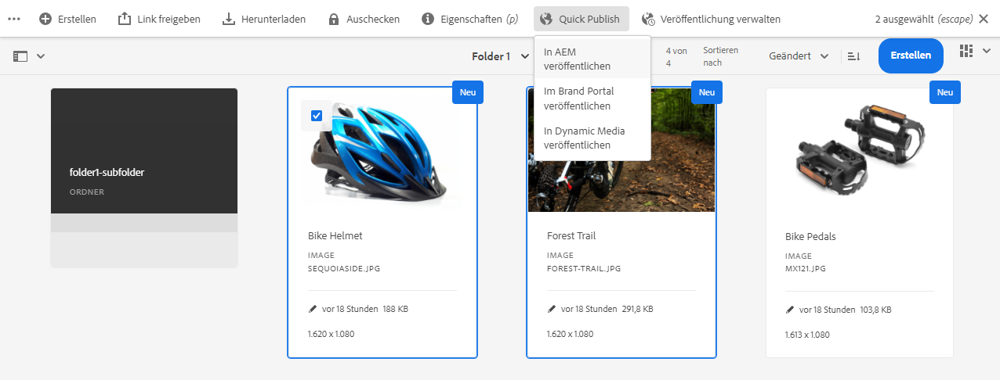
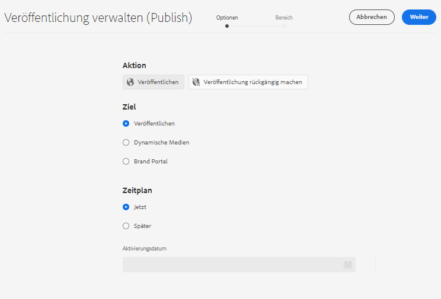
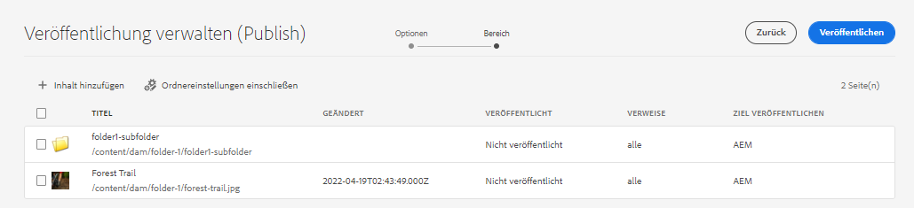
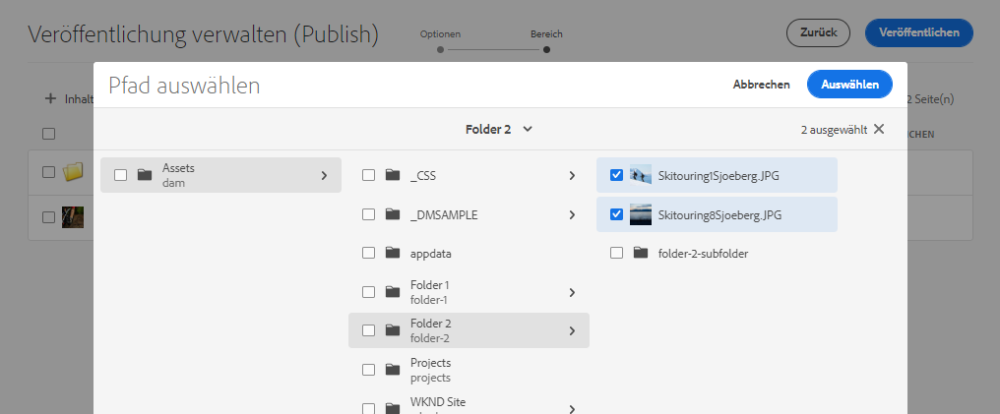
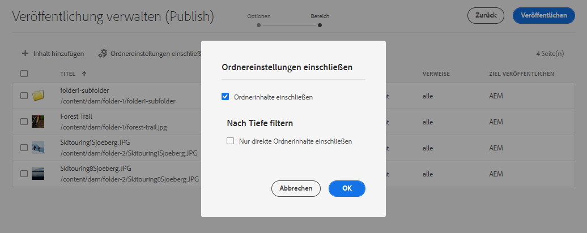
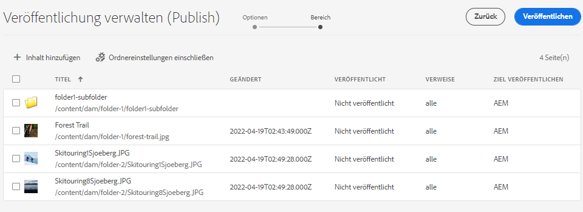
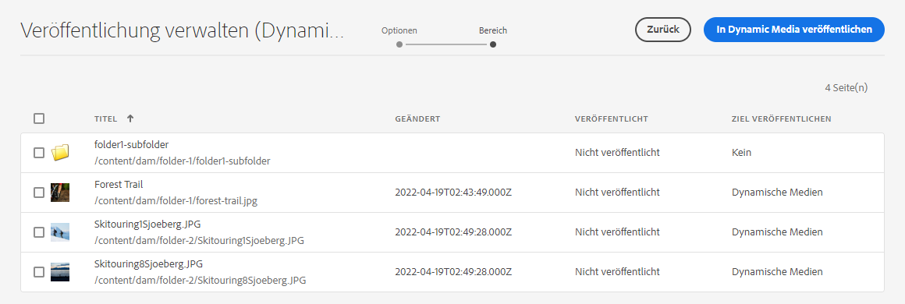
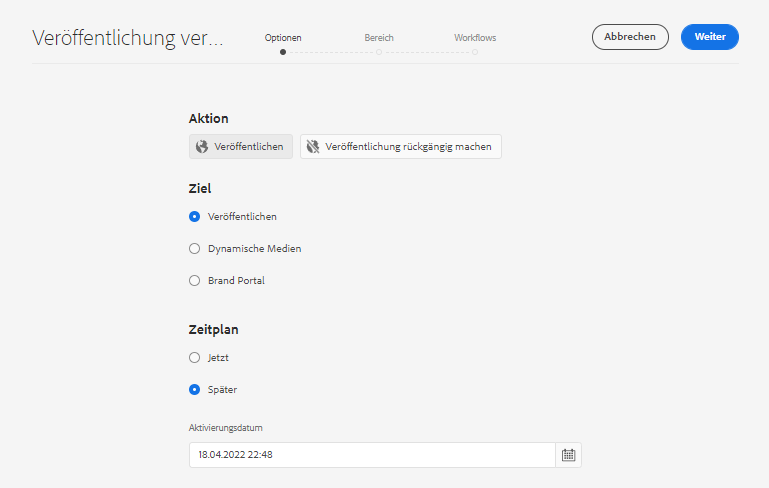
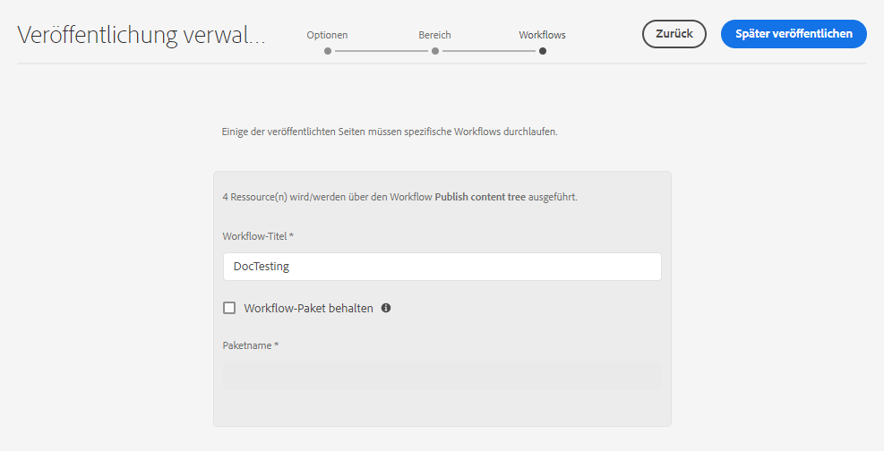

# Verwalten der Veröffentlichung in Experience Manager Assets {#manage-publication-in-aem}

| [Best Practices für die Suche](/help/assets/search-best-practices.md) | [Best Practices für Metadaten](/help/assets/metadata-best-practices.md) | [Content Hub](/help/assets/product-overview.md) | [Dynamic Media mit OpenAPI-Funktionen](/help/assets/dynamic-media-open-apis-overview.md) | [Entwicklerdokumentation zu AEM Assets](https://developer.adobe.com/experience-cloud/experience-manager-apis/) |
| ------------- | --------------------------- |---------|----|-----|

Als [!DNL Adobe Experience Manager Assets]-Admin können Sie Assets und Ordner mit Assets aus Ihrer Autoreninstanz in [!DNL Experience Manager Assets], [!DNL Dynamic Media]und [!DNL Brand Portal] veröffentlichen. Außerdem können Sie die Veröffentlichung eines Assets oder Ordners zu einem späteren Zeitpunkt einplanen. Nach der Veröffentlichung können die Benutzer auf die Assets zugreifen und sie an andere Benutzer weiterleiten. Standardmäßig können Sie Assets und Ordner in [!DNL Experience Manager Assets] veröffentlichen. Sie können jedoch [!DNL Experience Manager Assets] so konfigurieren, dass die Veröffentlichung in [[!DNL Dynamic Media]](https://experienceleague.adobe.com/docs/experience-manager-cloud-service/content/assets/dynamicmedia/config-dm.html?lang=de) und [[!DNL Brand Portal]](https://experienceleague.adobe.com/docs/experience-manager-cloud-service/content/assets/brand-portal/configure-aem-assets-with-brand-portal.html?lang=de) aktiviert wird.

Sie können Assets auf der Asset- oder Ordnerebene veröffentlichen oder die Veröffentlichung rückgängig machen, indem Sie eine der Optionen **[!UICONTROL Quick Publish]** oder **[!UICONTROL Veröffentlichung verwalten]** verwenden, die in der [!DNL Experience Manager Assets]-Benutzeroberfläche verfügbar sind. Wenn Sie in [!DNL Experience Manager Assets] nachfolgende Änderungen am ursprünglichen Asset oder Ordner vornehmen, werden die Änderungen erst dann in der Veröffentlichungsinstanz übernommen, wenn Sie von [!DNL Experience Manager Assets] aus erneut veröffentlichen. Dadurch wird sichergestellt, dass laufende Änderungen nicht in der Veröffentlichungsinstanz verfügbar sind. Nur genehmigte, von einem Administrator veröffentlichte Änderungen sind in der Veröffentlichungsinstanz verfügbar.

* [Veröffentlichen von Assets mit „Quick Publish“](#quick-publish)
* [Veröffentlichen von Assets mit „Veröffentlichung verwalten“](#manage-publication)
* [Assets später veröffentlichen](#publish-assets-later)
* [Assets in Dynamic Media veröffentlichen](#publish-assets-to-dynamic-media)
* [Veröffentlichen von Assets in Brand Portal](#publish-assets-to-brand-portal)
* [Veröffentlichung anfordern](#request-publication)
* [Einschränkungen und Tipps](#limitations-and-tips)

## Veröffentlichen von Assets mit „Quick Publish“ {#quick-publish}

Mit der Funktion „Quick Publish“ können Sie Inhalte sofort an dem ausgewählten Ziel veröffentlichen. Gehen Sie in der [!DNL Experience Manager Assets]-Konsole zum übergeordneten Ordner und wählen Sie alle Assets oder Ordner aus, die Sie veröffentlichen möchten. Klicken Sie in der Symbolleiste auf die Option **[!UICONTROL Quick Publish]**, und wählen Sie in der Dropdown-Liste das Ziel aus, an dem Sie die Assets veröffentlichen möchten.

## Veröffentlichen von Assets mit „Veröffentlichung verwalten“ {#manage-publication}

Mit der Option „Veröffentlichung verwalten“ können Sie Inhalte am ausgewählten Ziel veröffentlichen oder die Veröffentlichung rückgängig machen, [Inhalte aus dem gesamten DAM-Repository zur Veröffentlichungsliste hinzufügen](#add-content), [Ordnereinstellungen für die Veröffentlichung von Inhalten in den ausgewählten Ordnern einbeziehen](#include-folder-settings) und Filter anwenden sowie die [Veröffentlichung für ein späteres Datum oder eine spätere Uhrzeit planen](#publish-assets-later).

Gehen Sie in der [!DNL Experience Manager Assets]-Konsole zum übergeordneten Ordner und wählen Sie alle Assets oder Ordner aus, die Sie veröffentlichen möchten. Klicken Sie in der Symbolleiste auf **[!UICONTROL Veröffentlichung verwalten]**. Wenn Sie [!DNL Dynamic Media] und [!DNL Brand Portal] nicht in der [!DNL Experience Manager Assets] Instanz haben, können Sie Assets und Ordner nur in [!DNL Experience Manager Assets] veröffentlichen.

Die folgenden Optionen sind in der Benutzeroberfläche [!UICONTROL Veröffentlichung verwalten] verfügbar:

* [!UICONTROL Aktionen]
   * `Publish`: Veröffentlichen von Assets und Ordnern in dem ausgewählten Ziel
   * `Unpublish`: Rückgängigmachen der Veröffentlichung von Assets und Ordnern im Ziel

* [!UICONTROL Ziel]
   * `Publish`: Veröffentlichen von Assets und Ordnern in [!DNL Experience Manager Assets] (`AEM`)
   * `Dynamic Media`: Veröffentlichen von Assets in [!DNL Dynamic Media]
   * `Brand Portal`: Veröffentlichen von Assets und Ordnern in [!DNL Brand Portal]

* [!UICONTROL Zeitplan]
   * `Now`: Sofortiges Veröffentlichen von Assets
   * `Later`: Veröffentlichen von Assets basierend auf dem `Activation`-Datum oder der Uhrzeit

Um fortzufahren, klicken Sie auf **[!UICONTROL Weiter]**. Je nach Auswahl werden auf der Registerkarte **[!UICONTROL Umfang]** unterschiedliche Optionen angezeigt. Die Optionen für **[!UICONTROL Inhalt hinzufügen]** und **[!UICONTROL Ordnereinstellungen einschließen]** sind nur zum Veröffentlichen von Assets und Ordnern in [!DNL Experience Manager Assets] (`Destination: Publish`) verfügbar.

### Inhalt hinzufügen {#add-content}

Mit dem Veröffentlichen in [!DNL Experience Manager Assets] können Sie der Veröffentlichungsliste weitere Inhalte (Assets und Ordner) hinzufügen. Sie können der Liste weitere Assets oder Ordner aus den gesamten DAM-Repositorys hinzufügen. Klicken Sie auf die Schaltfläche **[!UICONTROL Inhalt hinzufügen]**, um weitere Inhalte hinzuzufügen.

Sie können mehrere Assets aus einem Ordner hinzufügen oder mehrere Ordner gleichzeitig hinzufügen. Es ist jedoch nicht möglich, Assets aus mehreren Ordnern gleichzeitig hinzuzufügen.

### Ordnereinstellungen einschließen {#include-folder-settings}

Standardmäßig werden bei der Veröffentlichung eines Ordners in [!DNL Experience Manager Assets] alle Assets, Unterordner und ihre Verweise veröffentlicht.

Um den zu veröffentlichenden Ordnerinhalt zu filtern, klicken Sie auf **[!UICONTROL Ordnereinstellungen einschließen]**:

* `Include folder contents`

   * Aktiviert: Alle Assets des ausgewählten Ordners, Unterordner (einschließlich aller Assets der Unterordner) und Verweise werden veröffentlicht.
   * Deaktiviert: Nur der ausgewählte Ordner (leer) und die Verweise werden veröffentlicht. Die Assets des ausgewählten Ordners werden nicht veröffentlicht.

* `Include folder contents` und `Include only immediate folder contents`

  Wenn beide Optionen ausgewählt sind, werden alle Assets des ausgewählten Ordners, der Unterordner (leer) und die Verweise veröffentlicht. Die Assets der Unterordner werden nicht veröffentlicht.

<!--
* [!UICONTROL Include only immediate folder contents]: Only the subfolders content and references are published. 

Only the selected folder content and references are published.
-->

Klicken Sie nach dem Anwenden der Filter auf **[!UICONTROL OK]** und klicken Sie anschließend auf **[!UICONTROL Veröffentlichen]**. Beim Klicken auf die Schaltfläche „Veröffentlichen“ wird die Bestätigungsmeldung `Resource(s) have been scheduled for publication` angezeigt. Die ausgewählten Assets und (oder) Ordner werden basierend auf dem Planer (`Now` oder `Later`) im definierten Ziel veröffentlicht. Melden Sie sich bei Ihrer Veröffentlichungsinstanz an, um zu überprüfen, ob die Assets und (oder) Ordner erfolgreich veröffentlicht wurden.

In der obigen Abbildung können Sie verschiedene Werte für das Attribut **[!UICONTROL Target veröffentlichen]** sehen. Erinnern wir uns an die Tatsache, dass Sie sich für die Veröffentlichung in [!DNL Experience Manager Assets] (`Destination: Publish`) entschieden haben. Warum wird dann angezeigt, dass nur ein Ordner und ein Asset in `AEM` veröffentlicht werden und die beiden anderen Assets sowohl in `AEM` als auch `Dynamic Media`?

Hier müssen Sie die Rolle der Ordnereigenschaften verstehen. Die Eigenschaft **[!UICONTROL Veröffentlichungsmodus für Dynamic Media]** eines Ordners spielt eine wichtige Rolle bei der Veröffentlichung. Um die Eigenschaften eines Ordners anzuzeigen, wählen Sie einen Ordner aus und klicken Sie in der Symbolleiste auf **[!UICONTROL Eigenschaften]**. Für ein Asset sehen Sie sich die Eigenschaften seines übergeordneten Ordners an.

In der folgenden Tabelle wird erläutert, wie die Veröffentlichung je nach dem definierten **[!UICONTROL Ziel]** und **[!UICONTROL Veröffentlichungsmodus für Dynamic Media]** geschieht:

| [!UICONTROL Ziel] | [!UICONTROL Veröffentlichungsmodus für Dynamic Media] | [!UICONTROL Ziel veröffentlichen] | Zulässiger Inhalt |
| --- | --- | --- | --- |
| Publish | Selektive Veröffentlichung | `AEM` | Assets und/oder Ordner |
| Veröffentlichen  | Unmittelbar | `AEM` und `Dynamic Media` | Assets und/oder Ordner |
| Veröffentlichen  | Bei Aktivierung | `AEM` und `Dynamic Media` | Assets und/oder Ordner |
| Dynamic Media | Selektive Veröffentlichung | `Dynamic Media` | Assets |
| Dynamic Media | Unmittelbar | `None` | Assets können nicht veröffentlicht werden |
| Dynamic Media | Bei Aktivierung | `None` | Assets können nicht veröffentlicht werden |

>[!NOTE]
>
>Nur Assets werden in [!DNL Dynamic Media] veröffentlicht.
>
>Veröffentlichen eines Ordners in [!DNL Dynamic Media] wird nicht unterstützt.
>
>Wenn Sie einen Ordner auswählen (`Selective Publish`) und das [!DNL Dynamic Media]-Ziel wählen, spiegelt das Attribut [!UICONTROL Target veröffentlichen] `None` wider.

Lassen Sie uns jetzt im oben genannten Anwendungsfall das **[!UICONTROL Ziel]** in **[!UICONTROL Dynamic Media]** ändern und die Ergebnisse überprüfen. Dadurch wird nur das Asset des Ordners `Selective Publish` Ordner in [!DNL Dynamic Media] veröffentlicht. Die Assets der Ordner `Immediate` und `Upon Activation` werden nicht veröffentlicht und spiegeln `None` wider.

>[!NOTE]
>
>Wenn [!DNL Dynamic Media] auf Ihrer [!DNL Experience Manager Assets]-Instanz nicht konfiguriert ist und das **[!UICONTROL Ziel]** **[!UICONTROL Veröffentlichen]** ist, werden die Assets und Ordner immer in `AEM` veröffentlicht.
>
>Das Veröffentlichen in [!DNL Brand Portal] ist unabhängig von den Ordnereigenschaften. Alle Assets, Ordner und Sammlungen können in Brand Portal veröffentlicht werden. Siehe [Veröffentlichen von Assets in Brand Portal](#publish-assets-to-brand-portal).

>[!NOTE]
>
>Wenn Sie den [!DNL Manage Publication]-Assistenten angepasst haben, funktioniert Ihre Anpassung weiterhin mit den vorhandenen Funktionalitäten.
>
>Sie können die vorhandene Anpassung jedoch entfernen, um die neuen [!DNL Manager Publication]-Funktionen zu verwenden.

## Assets später veröffentlichen {#publish-assets-later}

So planen Sie den Veröffentlichungs-Workflow für Assets für einen späteren Zeitpunkt:

1. Gehen Sie in der [!UICONTROL Experience Manager Assets]-Konsole zum übergeordneten Ordner und wählen Sie alle Assets oder Ordner aus, für die Sie die Veröffentlichung planen möchten.
1. Klicken Sie in der Symbolleiste auf **[!UICONTROL Veröffentlichung verwalten]**.
1. Klicken Sie in **[!UICONTROL Aus Aktion veröffentlichen]** auf **[!UICONTROL Veröffentlichen]** und wählen Sie dann das **[!UICONTROL Ziel]** aus, in dem Sie die Inhalte veröffentlichen möchten.
1. Wählen Sie **[!UICONTROL Später]** unter **[!UICONTROL Planung]** aus.
1. Wählen Sie ein **[!UICONTROL Aktivierungsdatum]** aus und geben Sie das Datum und die Zeit an. Klicken Sie auf **[!UICONTROL Weiter]**.

   

1. Klicken Sie in der Registerkarte **[!UICONTROL Umfang]** auf **[!UICONTROL Inhalte hinzufügen]** (falls erforderlich). Klicken Sie auf **[!UICONTROL Weiter]**.
1. Geben Sie in der Registerkarte **[!UICONTROL Workflows]** einen Workflow-Titel an. Klicken Sie auf **[!UICONTROL Später veröffentlichen]**.

   

   Melden Sie sich bei der Zielinstanz an, um die veröffentlichten Assets zu überprüfen (je nach geplantem Datum oder Uhrzeit).

## Assets in Dynamic Media veröffentlichen {#publish-assets-to-dynamic-media}

Nur Assets werden in [!DNL Dynamic Media] veröffentlicht. Das Veröffentlichungsverhalten unterscheidet sich jedoch je nach Ordnereigenschaften. Für einen Ordner kann der **[!UICONTROL Modus Veröffentlichung in Dynamic Media]** für die selektive Veröffentlichung konfiguriert werden, wobei eine der folgenden Möglichkeiten besteht:

* `Selective Publish`
* `Immediate`
* `Upon Activation`

Der Veröffentlichungsprozess für die Modi **[!UICONTROL Sofort]** und **[!UICONTROL Bei Aktivierung]** ist konsistent ist, unterscheidet sich jedoch für die **[!UICONTROL Selektive Veröffentlichung]**. Weitere Informationen finden Sie unter [Konfigurieren von selektiver Veröffentlichung auf der Ordnerebene in Dynamic Media](https://experienceleague.adobe.com/docs/experience-manager-cloud-service/content/assets/dynamicmedia/selective-publishing.html?lang=de). Nachdem Sie selektive Veröffentlichung in einem Ordner konfiguriert haben, haben Sie folgende Möglichkeiten:

* [Assets mithilfe von „Veröffentlichung verwalten“ für Dynamic Media oder Experience Manager selektiv veröffentlichen](https://experienceleague.adobe.com/docs/experience-manager-cloud-service/content/assets/dynamicmedia/selective-publishing.html?lang=de#selective-publish-manage-publication)
* [Heben Sie die Veröffentlichung von Assets in Dynamic Media oder Experience Manager mithilfe von „Veröffentlichung verwalten“ auf](https://experienceleague.adobe.com/docs/experience-manager-cloud-service/content/assets/dynamicmedia/selective-publishing.html?lang=de#selective-unpublish-manage-publication)
* [Veröffentlichen von Assets in Dynamic Media oder Experience Manager mithilfe von „Quick Publish“](https://experienceleague.adobe.com/docs/experience-manager-cloud-service/content/assets/dynamicmedia/selective-publishing.html?lang=de#quick-publish-aem-dm)
* [Veröffentlichen Sie Assets mithilfe von Suchergebnissen selektiv bzw. heben Sie die Veröffentlichung auf](https://experienceleague.adobe.com/docs/experience-manager-cloud-service/content/assets/dynamicmedia/selective-publishing.html?lang=de#selective-publish-unpublish-search-results)

## Veröffentlichen von Assets in Brand Portal {#publish-assets-to-brand-portal}

Sie können Assets, Ordner und Sammlungen in der [!DNL Experience Manager Assets Brand Portal]-Instanz veröffentlichen.

* [Veröffentlichen von Assets in Brand Portal](https://experienceleague.adobe.com/docs/experience-manager-cloud-service/content/assets/brand-portal/publish-to-brand-portal.html?lang=de#publish-assets-to-bp)
* [Veröffentlichen von Ordnern in Brand Portal](https://experienceleague.adobe.com/docs/experience-manager-cloud-service/content/assets/brand-portal/publish-to-brand-portal.html?lang=de#publish-folders-to-brand-portal)
* [Veröffentlichen von Sammlungen in Brand Portal](https://experienceleague.adobe.com/docs/experience-manager-cloud-service/content/assets/brand-portal/publish-to-brand-portal.html?lang=de#publish-collections-to-brand-portal)

## Veröffentlichung anfordern {#request-publication}

Die Option `Request Publication` hilft bei der Authentifizierung des Workflows von Assets, bevor sie in der Assets-Umgebung [!DNL AEM] veröffentlicht werden. [!DNL AEM] bietet verschiedenen Benutzenden unterschiedliche Berechtigungen. Sie können eine bzw. einer der *Mitwirkenden* sein, die/der Assets hochlädt, diese aber nicht veröffentlichen kann, bevor die Uploads überprüft wurden. Zusätzlich können Sie als *Admin* die Workflows der Assets lesen und schreiben.

Die Option „Veröffentlichung anfordern“ steht folgenden Benutzenden zur Verfügung:

* **Mitwirkende:** Wenn Sie eine Benutzerin bzw. ein Benutzer sind, die/der zu [!DNL AEM]-Assets beitragen kann, dann haben Sie begrenzten Zugriff auf den Workflow von [!DNL AEM]-Assets. Die Schaltfläche `Manage publication` ist ausgeblendet. Als Mitwirkende können Sie nur Beiträge hinzufügen, indem Sie Assets hinzufügen, diese jedoch nicht veröffentlichen oder Lesezugriff auf den Workflow haben.

* **Workflow-Benutzende:** Diese Person kann keine Assets veröffentlichen, hat jedoch Lesezugriff auf den Workflow. Als Workflow-Benutzende haben Sie folgende Möglichkeiten:
   * Veröffentlichung anfordern
   * Die Schaltfläche `Manage publication` ansehen
   * Den Workflow planen und die Optionen `schedule now` und `schedule later` einsehen

* **Admin:** Als Admin können Sie die gesamten Workflow-Schritte für Assets verwalten. Die Schaltfläche `Manage publication` wird angezeigt. Wenn das Ziel `publish` ausgewählt ist, können Sie später ein Asset für den Workflow-Schritt planen.

>[!NOTE]
>
>Wenn [!DNL Dynamic Media] als Ziel ausgewählt ist, ist der Workflow-Schritt für **Workflow-Benutzende** und **Admin** deaktiviert.
>

## Einschränkungen und Tipps {#limitations-and-tips}

* `Manage publication` steht Benutzenden zur Verfügung, die über zumindest die geringste Leseberechtigung für den Workflow verfügen.
* Leere Ordner werden nicht veröffentlicht.
* Wenn Sie ein Asset veröffentlichen, das verarbeitet wird, wird nur der Originalinhalt veröffentlicht. Die Ausgabedarstellungen fehlen. Warten Sie entweder, bis die Verarbeitung abgeschlossen ist, und veröffentlichen Sie das Asset, oder veröffentlichen Sie es erneut, erst dann, wenn die Verarbeitung abgeschlossen ist.
* Wenn Sie die Veröffentlichung eines komplexen Assets aufheben möchten, achten Sie darauf, nur die Veröffentlichung des Assets aufzuheben. Machen Sie nicht die Veröffentlichung der Verweise rückgängig, da diese möglicherweise auch von anderen veröffentlichten Assets referenziert werden.
