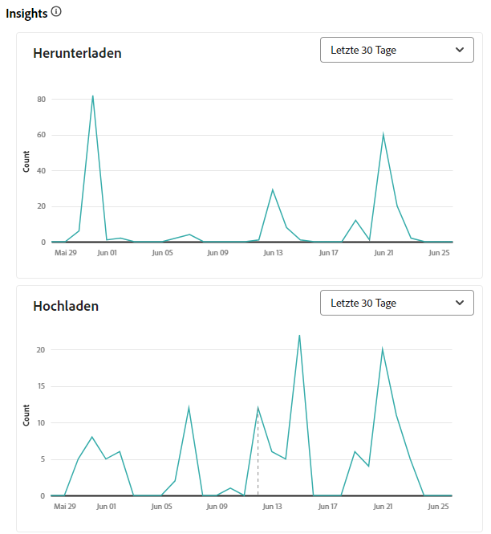
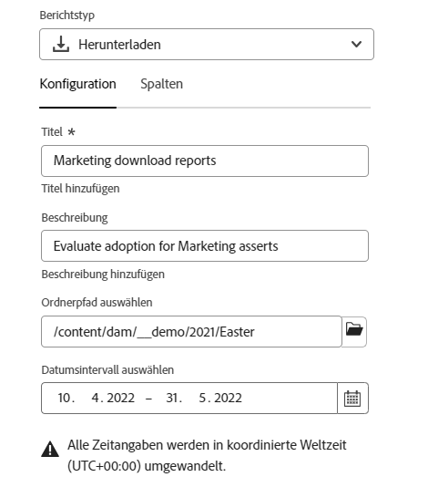
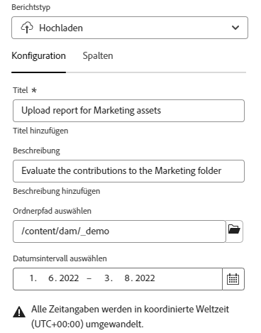
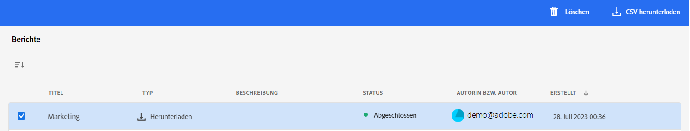

# Verwalten von Berichten {#manage-reports}

>[!CONTEXTUALHELP]
>id="assets_reports"
>title="Berichte"
>abstract="Das Asset-Reporting bietet Admins Einblicke in die Aktivitäten in der Ansichtsumgebung von Adobe Experience Manager Assets. Diese Daten liefern nützliche Informationen darüber, wie Benutzende mit Inhalten und dem Produkt interagieren. Alle Benutzenden, die dem Administrierenden-Produktprofil zugeordnet sind, können auf das Dashboard „Erkenntnisse“ zugreifen oder benutzerdefinierte Berichte erstellen."

Das Asset-Reporting bietet Admins Einblicke in die Aktivitäten in der Ansichtsumgebung von Adobe Experience Manager Assets. Diese Daten liefern nützliche Informationen darüber, wie Benutzende mit Inhalten und dem Produkt interagieren.

## Zugreifen auf Berichte {#access-reports}

Alle Benutzenden, die dem Produktprofil Assets-Ansicht-Admins zugeordnet sind, können in der Assets-Ansicht auf das Insights-Dashboard zugreifen oder benutzerdefinierte Berichte erstellen.

## Anzeigen von Insights {#view-live-statistics}

In der Assets-Ansicht können Sie mit dem Insights-Dashboard Echtzeitdaten für Ihre Assets Essentials-Umgebung anzeigen. Sie können Echtzeit-Ereignismetriken während der letzten 30 Tage oder für die letzten 12 Monate anzeigen.

Klicken Sie auf **[!UICONTROL Erkenntnisse]** im linken Navigationsbereich, um die folgenden automatisch generierten Diagramme anzuzeigen:

* **Downloads**: Die Anzahl der Assets, die in den letzten 30 Tagen oder 12 Monaten aus der Assets-Ansichtsumgebung heruntergeladen wurden, dargestellt als Liniendiagramm.

* **Uploads**: Die Anzahl der Assets, die in den letzten 30 Tagen oder 12 Monaten in die Assets-Ansichtsumgebung hochgeladen wurden, dargestellt als Liniendiagramm.

* **Top-Suchvorgänge**: Zeigt die in den letzten 30 Tagen oder 12 Monaten am häufigsten gesuchten Begriffe zusammen mit der Anzahl der Suchvorgänge dieser Begriffe in Ihrer Assets-Ansichtsumgebung an, dargestellt in tabellarischem Format.

<!--

* **Storage usage**: The storage usage, in gigabytes (GB), for the Assets view environment, for the last 30 days or 12 months represented using a bar chart.

-->

## Erstellen eines Herunterladen-Berichts {#create-download-report}

So erstellen Sie einen Herunterladen-Bericht:

1. Navigieren Sie zu **[!UICONTROL Einstellungen]** > **[!UICONTROL Berichte]** und klicken Sie auf **[!UICONTROL Bericht erstellen]**.

1. Gehen Sie zur Registerkarte [!UICONTROL Konfiguration] und spezifizieren Sie den Berichtstyp als **[!UICONTROL Herunterladen]**.

1. Geben Sie einen Titel und optional eine Beschreibung für den Bericht an.

1. Wählen Sie über das Feld **[!UICONTROL Ordnerpfad auswählen]** den Ordnerpfad aus, der die Assets enthält, für die der Bericht ausgeführt werden soll.

1. Wählen Sie das Datumsintervall für den Bericht.

   >[!NOTE]
   >
   > Die Assets-Ansicht konvertiert alle lokalen Zeitzonen in die koordinierte Weltzeit (UTC).

1. Wählen Sie auf der Registerkarte [!UICONTROL Spalten] die Spaltennamen aus, die Sie im Bericht anzeigen möchten.

1. Klicken Sie auf **[!UICONTROL Erstellen]**.

   

In der folgenden Tabelle wird die Verwendung aller Spalten erläutert, die Sie dem Bericht hinzufügen können:

<table>
    <tbody>
     <tr>
      <th><strong>Spaltenname</strong></th>
      <th><strong>Beschreibung</strong></th>
     </tr>
     <tr>
      <td>Titel</td>
      <td>Der Titel des Assets.</td>
     </tr>
     <tr>
      <td>Pfad </td>
      <td>Der Ordnerpfad, in dem das Asset in der Assets-Ansicht verfügbar ist.</td>
     </tr>
     <tr>
      <td>MIME-Typ</td>
      <td>Der MIME-Typ für das Asset.</td>
     </tr>
     <tr>
      <td>Größe</td>
      <td>Die Größe des Assets in Bytes.</td>
     </tr>
     <tr>
      <td>Heruntergeladen von</td>
      <td>Die E-Mail-ID des Benutzers, der das Asset heruntergeladen hat.</td>
     </tr>
     <tr>
      <td>Herunterladen-Datum</td>
      <td>Das Datum, an dem die Aktion zum Herunterladen des Assets durchgeführt wurde.</td>
     </tr>
     <tr>
      <td>Autor</td>
      <td>Der Autor des Assets.</td>
     </tr>
     <tr>
      <td>Erstellungsdatum</td>
      <td>Das Datum, an dem das Asset in die Assets-Ansicht hochgeladen wurde.</td>
     </tr>
     <tr>
      <td>Änderungsdatum</td>
      <td>Das Datum der letzten Änderung des Assets.</td>
     </tr>
     <tr>
      <td>Abgelaufen</td>
      <td>Der Ablaufstatus des Assets.</td>
     </tr>
     <tr>
      <td>Heruntergeladen von Benutzername</td>
      <td>Der Name der Benutzerin oder des Benutzers, die/der das Asset heruntergeladen hat.</td>
     </tr>           
    </tbody>
   </table>

## Erstellen eines Hochladen-Berichts {#create-upload-report}

So erstellen Sie einen Hochladen-Bericht:

1. Navigieren Sie zu **[!UICONTROL Einstellungen]** > **[!UICONTROL Berichte]** und klicken Sie auf **[!UICONTROL Bericht erstellen]**.

1. Gehen Sie zur Registerkarte [!UICONTROL Konfiguration] und spezifizieren Sie den Berichtstyp als **[!UICONTROL Hochladen]**.

1. Geben Sie einen Titel und optional eine Beschreibung für den Bericht an.

1. Wählen Sie über das Feld **[!UICONTROL Ordnerpfad auswählen]** den Ordnerpfad aus, der die Assets enthält, für die der Bericht ausgeführt werden soll.

1. Wählen Sie das Datumsintervall für den Bericht.

1. Wählen Sie auf der Registerkarte [!UICONTROL Spalten] die Spaltennamen aus, die Sie im Bericht anzeigen möchten.

1. Klicken Sie auf **[!UICONTROL Erstellen]**.

   

In der folgenden Tabelle wird die Verwendung aller Spalten erläutert, die Sie dem Bericht hinzufügen können:

<table>
    <tbody>
     <tr>
      <th><strong>Spaltenname</strong></th>
      <th><strong>Beschreibung</strong></th>
     </tr>
     <tr>
      <td>Titel</td>
      <td>Der Titel des Assets.</td>
     </tr>
     <tr>
      <td>Pfad </td>
      <td>Der Ordnerpfad, in dem das Asset in der Assets-Ansicht verfügbar ist.</td>
     </tr>
     <tr>
      <td>MIME-Typ</td>
      <td>Der MIME-Typ für das Asset.</td>
     </tr>
     <tr>
      <td>Größe</td>
      <td>Die Größe des Assets.</td>
     </tr>
     <tr>
      <td>Autor</td>
      <td>Der Autor des Assets.</td>
     </tr>
     <tr>
      <td>Erstellungsdatum</td>
      <td>Das Datum, an dem das Asset in die Assets-Ansicht hochgeladen wurde.</td>
     </tr>
     <tr>
      <td>Änderungsdatum</td>
      <td>Das Datum der letzten Änderung des Assets.</td>
     </tr>
     <tr>
      <td>Abgelaufen</td>
      <td>Der Ablaufstatus des Assets.</td>
     </tr>              
    </tbody>
   </table>

## Anzeigen vorhandener Berichte {#view-report-list}

Nach der [Erstellung des Berichts](#create-download-report) können Sie die Liste der Berichte einsehen und auswählen, ob Sie sie im CSV-Format herunterladen oder löschen möchten.

Um die Liste der Berichte anzuzeigen, navigieren Sie zu **[!UICONTROL Einstellungen]** > **[!UICONTROL Berichte]**.

Für jeden Bericht können Sie den Berichtstitel, die Art des Berichts, die bei der Erstellung des Berichts angegebene Beschreibung, den Status des Berichts, die E-Mail-ID des Autors, der den Bericht erstellt hat, und das Erstellungsdatum des Berichts einsehen.

Der Berichtstatus `Completed ` bedeutet, dass der Bericht zum Herunterladen bereit ist.

## Herunterladen eines CSV-Berichts {#download-csv-report}

So laden Sie einen Bericht im CSV-Format herunter:

1. Navigieren Sie zu **[!UICONTROL Einstellungen]** > **[!UICONTROL Berichte]**.

1. Wählen Sie einen Bericht aus und klicken Sie auf **[!UICONTROL CSV herunterladen]**.

Der ausgewählte Bericht wird im CSV-Format heruntergeladen. Welche Spalten im CSV-Bericht angezeigt werden, hängt von den Spalten ab, die Sie beim [Erstellen des Berichts](#create-download-report) auswählen.

## Löschen eines Berichts {#delete-report}

So löschen Sie einen Bericht:

1. Navigieren Sie zu **[!UICONTROL Einstellungen]** > **[!UICONTROL Berichte]**.

1. Wählen Sie einen Bericht aus und klicken Sie auf **[!UICONTROL Löschen]**.

1. Zum Bestätigen erneut auf **[!UICONTROL Löschen]** klicken.
