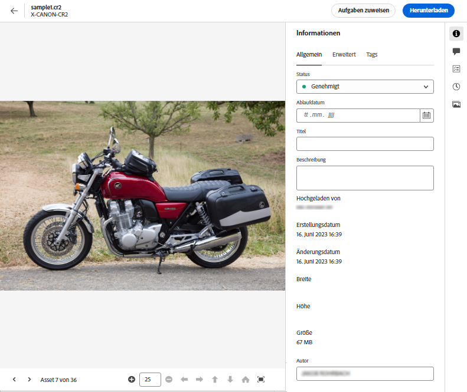

# Metadaten in der Assets-Ansicht {#metadata}

Metadaten sind Daten oder Beschreibungen zu den Daten. Beispielsweise können Ihre Bilder als Asset Informationen über die Kamera, mit der sie aufgenommen wurden, oder Copyright-Informationen enthalten. Diese Informationen sind Metadaten des Bildes. Metadaten sind für ein effizientes Asset-Management von entscheidender Bedeutung. Metadaten stellen die Sammlung aller für ein Asset verfügbaren Daten dar, sind aber nicht unbedingt im Bild selbst enthalten.

Mit Metadaten können Sie Assets genauer einteilen. Außerdem erweisen sie sich als nützlich, wenn die Menge digitaler Daten ansteigt. Es ist möglich, einige Hundert Dateien zu verwalten, die nur auf den Dateinamen, den Miniaturbildern und dem Speicherbedarf basieren. Dieser Ansatz ist jedoch nicht skalierbar. Er reicht nicht aus, wenn die Zahl der beteiligten Personen und die Zahl der verwalteten Assets steigt.

Durch das Hinzufügen von Metadaten steigt der Wert eines digitalen Assets, da das Asset folgende Eigenschaften aufweist:

* besser zugänglich – Systeme und Benutzer können es leicht finden.
* einfacher zu verwalten – Sie können Assets mit denselben Eigenschaften einfacher finden und Änderungen auf sie anwenden.
* vollständig – Asset enthält mehr Informationen und Kontext mit mehr Metadaten.

Aus diesen Gründen erhalten Sie mit Assets die richtigen Mittel, um Metadaten für digitale Assets zu erstellen, zu verwalten und auszutauschen.

## Anzeigen der Metadaten {#view-metadata}

Um die Metadaten eines Assets anzuzeigen, navigieren Sie zum Asset oder suchen Sie das Asset, wählen Sie das Asset aus und klicken Sie in der Symbolleiste auf **[!UICONTROL Details]**.

*Abbildung: Um ein Asset und seine Metadaten anzuzeigen, klicken Sie in der Symbolleiste auf **[!UICONTROL Details]** oder doppelklicken Sie auf das Asset.*

Die grundlegenden Metadaten wie Titel, Beschreibung und Upload-Datum sind auf der Registerkarte [!UICONTROL Standard] verfügbar. Die Registerkarte [!UICONTROL Erweitert] enthält erweiterte Metadaten wie Kameramodell, Informationen zum Objektiv und Geotags. Die Registerkarte [!UICONTROL Tags] enthält automatisch vergebene Tags, die auf dem Inhalt des Bildes basieren.

## Aktualisieren von Metadaten {#update-metadata}

Sobald das Metadatenformular Admin-seitig konfiguriert wurde, können andere Felder manuell aktualisiert werden. Sie sollten dies ändern, da Lesevorgänge sonst nur auf Grundlage des vorkonfigurierten Metadatenformulars möglich sind.

## Smart-Tags {#smart-tags}

[!DNL Experience Manager Assets] verwendet künstliche Intelligenz, die von [Adobe Sensei](https://www.adobe.com/de/sensei.html) bereitgestellt wird, um automatisch relevante Tags zu allen hochgeladenen Assets hinzuzufügen. Diese Tags, auch Smart-Tags genannt, erhöhen die Geschwindigkeit der Inhaltserstellung Ihrer Projekte, da Sie relevante Assets schnell finden können. Die Smart-Tags sind ein Beispiel für Metadaten, die nicht im Bild enthalten sind.

Die Smart-Tags werden nahezu in Echtzeit hinzugefügt und basierend auf dem Inhalt des Bildes generiert. Wenn Sie ein Asset hochladen, zeigt die Benutzeroberfläche für einige Zeit [!UICONTROL Wird verarbeitet] auf der Asset-Miniaturansicht an. Sobald die Verarbeitung abgeschlossen ist, können Sie [die Metadaten und die Smart-Tags anzeigen](#view-metadata).

*Abbildung: Um die Smarttags eines Assets anzuzeigen, klicken Sie in der Symbolleiste auf **[!UICONTROL Details]** oder doppelklicken Sie auf das Asset.*

Smart-Tags enthalten auch einen Konfidenzwert in Prozent. Er zeigt die Konfidenz an, die mit dem angebrachten Tag verbunden ist. Sie können die automatisch angebrachten Smart-Tags moderieren.

## Hinzufügen oder Aktualisieren von Keywords {#manually-tag}

Zusätzlich zu den Smart-Tags, die automatisch mit dem intelligenten Service [!DNL Adobe Sensei] hinzugefügt werden, können Sie Ihren Assets weitere Tags hinzufügen. Öffnen Sie ein Asset für die Vorschau, klicken Sie auf [!UICONTROL Tags] und geben Sie die gewünschten Keywords in das Feld [!UICONTROL Keywords] ein. Um das Tag hinzuzufügen, drücken Sie die Eingabetaste. [!DNL Assets view] indiziert das Keyword nahezu in Echtzeit und Ihr Team kann die aktualisierten Assets bald mit den neuen Keywords durchsuchen.

Sie können Tags auch aus dem Abschnitt [!UICONTROL Smart-Tags] entfernen, die automatisch von [!DNL Assets view] zu allen hochgeladenen Assets hinzugefügt werden.

## Taxonomie-Management {#taxonomy-management}

Tags können auch in einer Hierarchie verschachtelt werden, um Beziehungen wie Kategorie und Unterkategorie zu unterstützen. Wenn Sie hierarchische Tags einfügen müssen, können diese Admin-seitig einfach im Abschnitt [!UICONTROL Taxonomie-Management] unter [!UICONTROL Einstellungen] verwaltet werden. Sie können einen verwalteten Satz von Namespaces und Tags erstellen, auf die alle Benutzenden bei der Beschreibung von Inhalten zugreifen können. Nur Admins können Tag-Hierarchien in der [!UICONTROL Taxonomie-Verwaltung] einrichten und so sicherstellen, dass die Werte konsistent kontrolliert und verwendet werden.

## Einrichten von Metadatenformularen {#metadata-forms}

>[!CONTEXTUALHELP]
>id="assets_metadata_forms"
>title="Metadatenformulare"
>abstract="[!DNL Experience Manager Assets] bietet standardmäßig viele Standard-Metadatenfelder. Organisationen haben zusätzliche Anforderungen bezüglich Metadaten und benötigen mehr Metadatenfelder, um geschäftsspezifische Metadaten hinzuzufügen. Mit Metadatenformularen können Unternehmen benutzerdefinierte Metadatenfelder zur Seite „Details“ eines Assets hinzufügen. Die geschäftsspezifischen Metadaten verbessern die Verwaltung und Erkennung der Assets."

Die Asset-Ansicht bietet standardmäßig viele Standard-Metadatenfelder. Unternehmen haben zusätzliche Metadatenanforderungen und benötigen mehr Metadatenfelder, um geschäftsspezifische Metadaten hinzuzufügen. Mit Metadatenformularen können Unternehmen benutzerdefinierte Metadatenfelder zur Seite [!UICONTROL Details] eines Assets hinzufügen. Die geschäftsspezifischen Metadaten verbessern die Verwaltung und Erkennung der Assets. Sie können Formulare von Grund auf neu erstellen oder ein vorhandenes Formular wiederverwenden.

Sie können Metadatenformulare für verschiedene Asset-Typen (verschiedene MIME-Typen) konfigurieren. Verwenden Sie denselben Formularnamen wie den MIME-Typ der Datei. Die Asset-Ansicht stimmt den MIME-Typ der hochgeladenen Assets automatisch mit dem Namen des Formulars überein und aktualisiert die Metadaten für die hochgeladenen Assets basierend auf den Formularfeldern.

Wenn beispielsweise ein Metadatenformular mit dem Namen `PDF` oder `pdf` vorhanden ist, enthalten die hochgeladenen PDF-Dokumente Metadatenfelder, wie sie im Formular definiert wurden.

Die Asset-Ansicht verwendet die folgende Sequenz, um nach vorhandenen Metadaten-Formularnamen zu suchen, um die Metadatenfelder auf die hochgeladenen Assets eines bestimmten Typs anzuwenden:

„MIME-Untertyp“ > „MIME-Typ“ > `default` „Formular“ > „Vorkonfiguriertes Formular“

Wenn beispielsweise ein Metadatenformular mit dem Namen `PDF` oder `pdf` vorhanden ist, enthalten die hochgeladenen PDF-Dokumente Metadatenfelder, wie sie im Formular definiert wurden. Wenn ein Metadatenformular nach dem Namen `PDF` oder `pdf` nicht vorhanden ist, stimmt die Asset-Ansicht überein, wenn ein Metadatenformular mit dem Namen vorhanden ist `application`. Wenn ein Metadatenformular mit dem Namen `application` vorhanden ist, enthalten die hochgeladenen PDF-Dokumente Metadatenfelder, so wie im Formular definiert. Wenn in der Asset-Ansicht immer noch kein übereinstimmendes Metadatenformular gefunden wird, wird nach der `default` Metadatenformular zum Anwenden der im Formular definierten Metadatenfelder auf die hochgeladenen PDF-Dokumente. Wenn keiner dieser Schritte funktioniert, wendet die Asset-Ansicht die im nativen Formular definierten Metadatenfelder auf alle hochgeladenen PDF-Dokumente an.

>[!IMPORTANT]
>
>Das neue Metadatenformular für einen bestimmten Dateityp ersetzt vollständig das Standard-Metadatenformular, das [!DNL Assets view] bereitstellt. Wenn Sie ein Metadatenformular löschen oder umbenennen, sind die Standard-Metadatenfelder wieder für neue Assets verfügbar.

Gehen Sie wie folgt vor, um ein Metadatenformular zu erstellen:

1. Klicken Sie in der linken Leiste auf **[!UICONTROL Einstellungen]** > **[!UICONTROL Metadatenformulare]**.

   

1. Klicken Sie oben rechts in der Benutzeroberfläche auf **[!UICONTROL Erstellen]**.
1. Geben Sie einen Namen für das Formular an und klicken Sie auf **[!UICONTROL Erstellen]**.
1. Geben Sie unter **[!UICONTROL Einstellungen]** in der rechten Leiste einen Namen für die Registerkarte ein.
1. Ziehen Sie die erforderlichen Komponenten aus den in der linken Leiste verfügbaren **[!UICONTROL Komponenten]** auf eine Registerkarte im Formular. Ziehen Sie die Komponenten in die gewünschte Sequenz.

   

   *Abbildung: Benutzeroberfläche zur Erstellung von Metadatenformularen mit Optionen zum Hinzufügen von Komponenten und der Option zum Anzeigen einer Vorschau des Formulars.*

1. Geben Sie in der rechten Leiste unter **[!UICONTROL Einstellungen]** für jede Komponente einen Namen für die Zuordnung mit den unterstützten Eigenschaften ein.
1. Optional können Sie für eine Komponente **[!UICONTROL Erforderlich]** auswählen, damit das Metadatenfeld ein Pflichtfeld wird, und Sie können **[!UICONTROL Schreibgeschützt]** auswählen, damit das Feld auf der Seite [!UICONTROL Details] nicht bearbeitbar ist.
1. Klicken Sie optional auf **[!UICONTROL Vorschau]**, um eine Vorschau des erstellten Formulars anzuzeigen.
1. Optional können Sie auf jeder Registerkarte weitere Register und die erforderlichen Komponenten hinzufügen.
1. Klicken Sie auf **[!UICONTROL Speichern]**, wenn das Formular vollständig ist.

In diesem Video finden Sie die Reihenfolge der Schritte:

>[!VIDEO](https://video.tv.adobe.com/v/341275)

Nachdem ein Formular erstellt wurde, wird es automatisch angewendet, wenn Benutzer ein Asset des entsprechenden MIME-Typs hochladen.

Wenn Sie ein vorhandenes Formular wiederzuverwenden wollen, um ein neues Formular zu erstellen, wählen Sie ein Metadatenformular aus, klicken Sie in der Symbolleiste auf **[!UICONTROL Kopieren]**, geben Sie einen Namen ein und klicken Sie auf **[!UICONTROL Bestätigen]**. Sie können ein Metadatenformular bearbeiten, um es zu ändern. Wenn Sie ein Formular ändern, wird es für Assets verwendet, die nach der Änderung hochgeladen wurden. Die vorhandenen Assets werden nicht geändert.

## Eigenschaftskomponenten {#property-components}

Sie können Ihr Metadatenformular mit einer der folgenden Eigenschaftskomponenten anpassen. Ziehen Sie einfach den Komponententyp an die gewünschte Position im Formular und ändern Sie die Komponenteneinstellungen.
Im Folgenden finden Sie eine Übersicht über die einzelnen Eigenschaftstypen und ihre Speicherung.

| Komponentenname | Beschreibung |
|---|---|
| Akkordeon-Container | Fügen Sie eine reduzierbare Überschrift für eine Liste allgemeiner Komponenten und Eigenschaften hinzu. Kann standardmäßig erweitert oder reduziert werden. |
| Einzeiliger Text | Fügen Sie eine einzeilige Texteigenschaft hinzu. |
| Mehrzeiliger Text | Fügen Sie mehrere Textzeilen oder einen Absatz hinzu. Wird während der Eingabe entsprechend erweitert, um alle Inhalte einzuschließen. |
| Mehrfachwerttext | Fügen Sie eine Texteigenschaft mit mehreren Werten hinzu. |
| Zahl | Fügen Sie eine Zahlenkomponente hinzu. |
| Kontrollkästchen | Fügen Sie einen booleschen Wert hinzu. Wird mit einem Wert als TRUE oder FALSE gespeichert. |
| Datum | Fügen Sie eine Datumskomponente hinzu. |
| Dropdown-Liste | Fügen Sie eine Dropdown-Liste hinzu. |
| Status | Fügen Sie die Statuseigenschaft des Repositorys hinzu (zugeordnet zu „repo:state“). |
| Asset-Status | Fügen Sie die standardmäßige Asset-Status-Eigenschaft hinzu (zugeordnet zu „dam:assetStatus“). |
| Tags | Fügen Sie ein Tag aus Werten hinzu, die in der Taxonomie-Verwaltung gespeichert sind (zugeordnet zu „xcm:tags“). |
| Keywords | Fügen Sie freie Keywords hinzu (zugeordnet zu „dc:subject“). |
| Smart-Tags | Fügen Sie automatisch Metadaten-Tags hinzu, um Suchfunktionen zu ergänzen. |

## Nächste Schritte {#next-steps}

* [Video zum Verwalten von Metadatenformularen in der Asset-Ansicht ansehen](https://experienceleague.adobe.com/docs/experience-manager-learn/assets-essentials/configuring/metadata-forms.html?lang=de)

* Stellen Sie mithilfe der [!UICONTROL Feedback] Option in der Benutzeroberfläche der Assets-Ansicht verfügbar

* Geben Sie Feedback zur Dokumentation durch  über die Option [!UICONTROL Diese Seite bearbeiten] oder durch  über die Option [!UICONTROL Problem protokollieren] in der rechten Seitenleiste

* Kontaktieren Sie die [Kundenunterstützung](https://experienceleague.adobe.com/?support-solution=General&amp;lang=de#support)

<!-- TBD: Cannot create a form using the second option. Documenting only the first option for now.
To reuse an existing form to create a new form, do one of these:

* Select a metadata form and click **[!UICONTROL Copy]** from the toolbar, provide a name, and click **[!UICONTROL Confirm]**.

* Click **[!UICONTROL Create]**, select **[!UICONTROL Use existing form structure as template]** option, and select an existing form. 
-->

<!-- TBD: Queries for PM and engg.

Can we edit the existing metadata in any form?

How to moderate smart tags?

Allow or deny list for smart tags?

What about Tags displayed just above Smart Tags in the UI?

Is there a detailed metadata tab. Where do the other details of an asset go?

How can one search based strictly on the metadata. Similar to AEM Assets GQL queries.
-->

<!-- TBD: Link to related articles if any.

>[!MORELIKETHIS]
>
>* [Search assets](search.md).
-->
