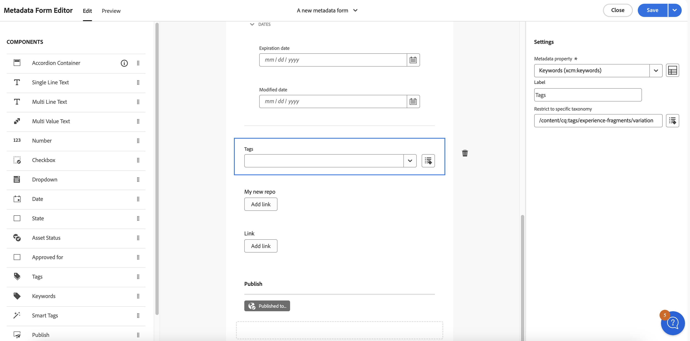

# Metadaten in der Assets-Ansicht {#metadata}

Metadaten sind Daten oder Beschreibungen zu den Daten. Beispielsweise können Ihre Bilder als Asset Informationen über die Kamera, mit der sie aufgenommen wurden, oder Copyright-Informationen enthalten. Diese Informationen sind Metadaten des Bildes. Metadaten sind für ein effizientes Asset-Management von entscheidender Bedeutung. Metadaten stellen die Sammlung aller für ein Asset verfügbaren Daten dar, sind aber nicht unbedingt im Bild selbst enthalten.

Mit Metadaten können Sie Assets genauer einteilen. Außerdem erweisen sie sich als nützlich, wenn die Menge digitaler Daten ansteigt. Es ist möglich, einige Hundert Dateien zu verwalten, die nur auf den Dateinamen, den Miniaturbildern und dem Speicherbedarf basieren. Dieser Ansatz ist jedoch nicht skalierbar. Er reicht nicht aus, wenn die Zahl der beteiligten Personen und die Zahl der verwalteten Assets steigt.

Durch das Hinzufügen von Metadaten steigt der Wert eines digitalen Assets, da sich das Asset in den folgenden Punkten verändert:

* besser zugänglich – Systeme und Benutzer können es leicht finden.
* einfacher zu verwalten – Sie können Assets mit denselben Eigenschaften einfacher finden und Änderungen auf sie anwenden.
* vollständig – Asset enthält mehr Informationen und Kontext mit mehr Metadaten.

Aus diesen Gründen erhalten Sie mit Assets die richtigen Mittel, um Metadaten für digitale Assets zu erstellen, zu verwalten und auszutauschen.

## Anzeigen der Metadaten {#view-metadata}

Um die Metadaten eines Assets anzuzeigen, navigieren Sie zum Asset oder suchen Sie das Asset, wählen Sie das Asset aus und klicken Sie in der Symbolleiste auf **[!UICONTROL Details]**.

*Abbildung: Um ein Asset und seine Metadaten anzuzeigen, klicken Sie in der Symbolleiste auf **[!UICONTROL Details]** oder doppelklicken Sie auf das Asset.*

Die grundlegenden Metadaten wie Titel, Beschreibung und Upload-Datum sind auf der Registerkarte [!UICONTROL Standard] verfügbar. Die Registerkarte [!UICONTROL Erweitert] enthält erweiterte Metadaten wie Kameramodell, Informationen zum Objektiv und Geotags. Die Registerkarte [!UICONTROL Tags] enthält automatisch vergebene Tags, die auf dem Inhalt des Bildes basieren.

## Aktualisieren von Metadaten {#update-metadata}

Sobald Admins das Metadatenformular konfiguriert haben, können andere Felder manuell aktualisiert werden. Sie sollten dies ändern, da Lesevorgänge sonst nur auf Grundlage des vorkonfigurierten Metadatenformulars möglich sind.

## Smart-Tags {#smart-tags}

[!DNL Experience Manager Assets] verwendet künstliche Intelligenz, die von [Adobe Sensei](https://www.adobe.com/de/sensei.html) bereitgestellt wird, um automatisch relevante Tags zu allen hochgeladenen Assets hinzuzufügen. Diese Tags, auch Smart-Tags genannt, erhöhen die Geschwindigkeit der Inhaltserstellung Ihrer Projekte, da Sie relevante Assets schnell finden können. Die Smart-Tags sind ein Beispiel für Metadaten, die nicht im Bild enthalten sind.

Die Smart-Tags werden nahezu in Echtzeit hinzugefügt und basierend auf dem Inhalt des Bildes generiert. Wenn Sie ein Asset hochladen, zeigt die Benutzeroberfläche für einige Zeit [!UICONTROL Wird verarbeitet] auf der Asset-Miniaturansicht an. Sobald die Verarbeitung abgeschlossen ist, können Sie [die Metadaten und die Smart-Tags anzeigen](#view-metadata).

*Abbildung: Um die Smart-Tags eines Assets anzuzeigen, klicken Sie in der Symbolleiste auf **[!UICONTROL Details]** oder doppelklicken Sie auf das Asset.*

Smart-Tags enthalten auch einen Konfidenzwert in Prozent. Er zeigt die Konfidenz an, die mit dem angebrachten Tag verbunden ist. Sie können die automatisch angebrachten Smart-Tags moderieren.

## Hinzufügen oder Aktualisieren von Keywords {#manually-tag}

Zusätzlich zu den Smart-Tags, die automatisch mit dem intelligenten Service [!DNL Adobe Sensei] hinzugefügt werden, können Sie Ihren Assets weitere Tags hinzufügen. Öffnen Sie ein Asset für die Vorschau, klicken Sie auf [!UICONTROL Tags] und geben Sie die gewünschten Keywords in das Feld [!UICONTROL Keywords] ein. Um das Tag hinzuzufügen, drücken Sie die Eingabetaste. [!DNL Assets view] indiziert das Keyword nahezu in Echtzeit und Ihr Team kann die aktualisierten Assets bald mit den neuen Keywords durchsuchen.

Sie können Tags auch aus dem Abschnitt [!UICONTROL Smart-Tags] entfernen, die automatisch von [!DNL Assets view] zu allen hochgeladenen Assets hinzugefügt werden.

## Taxonomie-Management {#taxonomy-management}

Tags können auch in einer Hierarchie verschachtelt werden, um Beziehungen wie Kategorie und Unterkategorie zu unterstützen. Wenn Sie hierarchische Tags einfügen müssen, kann dies durch Admins im Abschnitt [!UICONTROL Taxonomie-Management] von [!UICONTROL Einstellungen] getan werden. Sie können einen verwalteten Satz von Namespaces und Tags erstellen, auf die alle Benutzerinnen und Benutzer bei der Beschreibung von Inhalten zugreifen können. Nur die Admins können Tag-Hierarchien in [!UICONTROL Taxonomie-Manager] einrichten und so sicherstellen, dass die Werte konsistent kontrolliert und verwendet werden.

## Einrichten von Metadatenformularen {#metadata-forms}

>[!CONTEXTUALHELP]
>id="assets_metadata_forms"
>title="Metadatenformulare"
>abstract="[!DNL Experience Manager Assets] bietet standardmäßig viele Standard-Metadatenfelder. Organisationen haben zusätzliche Anforderungen bezüglich Metadaten und benötigen mehr Metadatenfelder, um geschäftsspezifische Metadaten hinzuzufügen. Mit Metadatenformularen können Unternehmen benutzerdefinierte Metadatenfelder zur Seite „Details“ eines Assets hinzufügen. Die geschäftsspezifischen Metadaten verbessern die Verwaltung und Erkennung der Assets."

Die Assets-Ansicht bietet standardmäßig viele Standard-Metadatenfelder. Unternehmen haben zusätzliche Metadatenanforderungen und benötigen mehr Metadatenfelder, um geschäftsspezifische Metadaten hinzuzufügen. Mit Metadatenformularen können Unternehmen benutzerdefinierte Metadatenfelder zur Seite [!UICONTROL Details] eines Assets hinzufügen. Die geschäftsspezifischen Metadaten verbessern die Verwaltung und Erkennung der Assets. Sie können Formulare von Grund auf neu erstellen oder ein vorhandenes Formular wiederverwenden.

Sie können Metadatenformulare für verschiedene Asset-Typen (verschiedene MIME-Typen) konfigurieren. Verwenden Sie denselben Formularnamen wie den MIME-Typ der Datei. Die Assets-Ansicht gleicht den MIME-Typ der hochgeladenen Assets automatisch mit dem Namen des Formulars ab und aktualisiert die Metadaten für die hochgeladenen Assets auf der Grundlage der Formularfelder.
<!--
For example, if a metadata form by the name `PDF` or `pdf` exists, then the uploaded PDF documents contain metadata fields as defined in the form.
-->
Die Assets-Ansicht verwendet die folgende Sequenz, um nach Namen vorhandener Metadatenformulare zu suchen, um die Metadatenfelder auf die hochgeladenen Assets eines bestimmten Typs anzuwenden:

„MIME-Untertyp“ > „MIME-Typ“ > `default` „Formular“ > „Vorkonfiguriertes Formular“

Wenn beispielsweise ein Metadatenformular mit dem Namen `PDF` oder `pdf` vorhanden ist, enthalten die hochgeladenen PDF-Dokumente Metadatenfelder, wie sie im Formular definiert wurden. Wenn ein Metadatenformular mit dem Namen `PDF` oder `pdf` nicht vorhanden ist, sucht die Assets-Ansicht nach einem Metadatenformular mit dem Namen `application`. Wenn ein Metadatenformular mit dem Namen `application` vorhanden ist, enthalten die hochgeladenen PDF-Dokumente Metadatenfelder, wie im Formular definiert. Wenn die Assets-Ansicht immer noch kein übereinstimmendes Metadatenformular findet, sucht es nach dem `default`-Metadatenformular, um die im Formular definierten Metadatenfelder auf die hochgeladenen PDF-Dokumente anzuwenden. Wenn keiner dieser Schritte funktioniert, wendet die Assets-Ansicht die im vorkonfigurierten Formular definierten Metadatenfelder auf alle hochgeladenen PDF-Dokumente an.
Wenn Sie jedoch ein Metadatenformular einem Ordner zuweisen möchten, [finden Sie hier weitere Informationen](#assign-metadata-form-folder).

>[!IMPORTANT]
>
>Das neue Metadatenformular für einen bestimmten Dateityp ersetzt vollständig das Standard-Metadatenformular, das [!DNL Assets view] bereitstellt. Wenn Sie ein Metadatenformular löschen oder umbenennen, sind die Standard-Metadatenfelder wieder für neue Assets verfügbar.

Gehen Sie wie folgt vor, um ein Metadatenformular zu erstellen:

1. Klicken Sie in der linken Leiste auf **[!UICONTROL Einstellungen]** > **[!UICONTROL Metadatenformulare]**.

   

1. Klicken Sie oben rechts in der Benutzeroberfläche auf **[!UICONTROL Erstellen]**.
1. Geben Sie einen Namen für das Formular an und klicken Sie auf **[!UICONTROL Erstellen]**.
1. Geben Sie unter **[!UICONTROL Einstellungen]** in der rechten Leiste einen Namen für die Registerkarte ein.
1. Ziehen Sie die erforderlichen Komponenten aus den in der linken Leiste verfügbaren **[!UICONTROL Komponenten]** auf eine Registerkarte im Formular. Ziehen Sie die Komponenten in die gewünschte Sequenz.

   

   *Abbildung: Benutzeroberfläche zur Erstellung von Metadatenformularen mit Optionen zum Hinzufügen von Komponenten und der Option zum Anzeigen einer Vorschau des Formulars.*

1. Geben Sie in der rechten Leiste in den **[!UICONTROL Einstellungen]** für jede Komponente einen Namen für die Zuordnung mit den unterstützten Eigenschaften ein.
1. Optional können Sie für eine Komponente **[!UICONTROL Erforderlich]** auswählen, damit das Metadatenfeld ein Pflichtfeld wird, und Sie können **[!UICONTROL Schreibgeschützt]** auswählen, damit das Feld auf der Seite [!UICONTROL Details] nicht bearbeitbar ist.
1. Klicken Sie optional auf **[!UICONTROL Vorschau]**, um eine Vorschau des erstellten Formulars anzuzeigen.
1. Optional können Sie auf jeder Registerkarte weitere Register und die erforderlichen Komponenten hinzufügen.
1. Klicken Sie auf **[!UICONTROL Speichern]**, wenn das Formular vollständig ist.

In diesem Video finden Sie die Reihenfolge der Schritte:

>[!VIDEO](https://video.tv.adobe.com/v/341275)

Nachdem ein Formular erstellt wurde, wird es automatisch angewendet, wenn Benutzende ein Asset des entsprechenden MIME-Typs hochladen.

Wenn Sie ein vorhandenes Formular wiederzuverwenden wollen, um ein neues Formular zu erstellen, wählen Sie ein Metadatenformular aus, klicken Sie in der Symbolleiste auf **[!UICONTROL Kopieren]**, geben Sie einen Namen ein und klicken Sie auf **[!UICONTROL Bestätigen]**. Sie können ein Metadatenformular bearbeiten, um es zu ändern. Wenn Sie ein Formular ändern, wird es für Assets verwendet, die nach der Änderung hochgeladen wurden. Die vorhandenen Assets werden nicht geändert.

### Eigenschaftskomponenten {#property-components}

Sie können Ihr Metadatenformular mit einer der folgenden Eigenschaftskomponenten anpassen. Ziehen Sie einfach den Komponententyp an die gewünschte Position im Formular und ändern Sie die Komponenteneinstellungen.
Nachfolgend finden Sie eine Übersicht über die einzelnen Eigenschaftstypen und wie sie gespeichert werden.

| Komponentenname | Beschreibung |
|---|---|
| Akkordeon-Container | Fügt eine einklappbare Überschrift für eine Liste gängiger Komponenten und Eigenschaften hinzu. Sie kann standardmäßig ein- oder ausgeklappt sein. |
| Einzeiliger Text | Fügt eine einzeilige Texteigenschaft hinzu. |
| Mehrzeiliger Text | Fügt mehrere Textzeilen oder einen Absatz hinzu. Wird während der Eingabe von Text entsprechend erweitert, um alle Inhalte zu enthalten. |
| Mehrfachwerttext | Fügt eine Texteigenschaft mit mehreren Werten hinzu. |
| Zahl | Fügen Sie eine Zahlenkomponente hinzu. |
| Kontrollkästchen | Fügt einen booleschen Wert hinzu. Wird als TRUE oder FALSE gespeichert, sobald ein Wert gespeichert wird. |
| Datum | Fügen Sie eine Datumskomponente hinzu. |
| Dropdown | Fügt eine Dropdown-Liste hinzu. |
| Status | Fügt die Repository-Statuseigenschaft hinzu (zugeordnet zu repo:state) |
| Asset-Status | Fügt die standardmäßige Asset-Status-Eigenschaft hinzu (zugeordnet zu „dam:assetStatus“). |
| Tags | Fügt ein Tag aus den Werten hinzu, die in der Taxonomie-Verwaltung gespeichert sind (zugeordnet zu „xcm:tags“). |
| Keywords | Fügt freie Keywords hinzu (zugeordnet zu „dc:subject“). |
| Smart-Tags | Fügt automatisch Metadaten-Tags hinzu, um Suchfunktionen zu ergänzen. |

### Zuweisen eines Metadatenformulars zu einem Ordner {#assign-metadata-form-folder}

Sie können in Ihrer Assets-Ansichtsbereitstellung auch ein Metadatenformular einem Ordner zuweisen. Das Metadatenformular, das einem Ordner gemäß dem MIME-Typ zugewiesen wurde, wird überschrieben, wenn Sie ein Metadatenformular manuell auf einen Ordner anwenden. Alle Assets im Ordner, einschließlich Assets in den Unterordnern, zeigen dann die im Metadatenformular definierten Eigenschaften an.

So weisen Sie ein Metadatenformular einem Ordner zu:

1. Navigieren Sie zu **[!UICONTROL Einstellungen]** > **[!UICONTROL Metadatenformulare]** und wählen Sie ein Metadatenformular aus.

2. Klicken Sie auf **[!UICONTROL Ordner zuweisen]**

3. Wählen Sie den Ordner aus und klicken Sie auf **[!UICONTROL Zuweisen]**. Sie können die Ordner auswählen, indem Sie auf die Ordnernamen klicken.

   

   Sie können auch zur Seite „Ordnerdetails“ navigieren und ein Metadatenformular aus den im rechten Bereich verfügbaren Ordnereigenschaften auswählen, um das Metadatenformular dem Ordner zuzuweisen.

   

### Entfernen eines Metadatenformulars aus Ordnern {#remove-metadata-form-folder}

Nachdem Sie ein Metadatenformular einem oder mehreren Ordnern zugewiesen haben, können Sie mit Experience Manager Assets auch ein Metadatenformular aus den ausgewählten Ordnern entfernen.

So entfernen Sie ein Metadatenformular aus einem Ordner:

1. Navigieren Sie zu **[!UICONTROL Einstellungen]** > **[!UICONTROL Metadatenformulare]** und wählen Sie ein Metadatenformular aus.

1. Klicken Sie auf **[!UICONTROL Aus Ordner(n) entfernen]**. Die Liste der zugewiesenen Ordner für das Metadatenformular wird angezeigt.

1. Wählen Sie den Ordner aus und klicken Sie auf **[!UICONTROL Entfernen]**. Sie können auch mehrere Ordner aus der Liste auswählen.

Sie können auch zur Seite mit den Ordnerdetails navigieren und im Feld **[!UICONTROL Metadatenformulare]** die Option **[!UICONTROL Systemzugeordnete Metadatenformulare]** auswählen, um das zugewiesene Metadatenformular aus einem Ordner zu entfernen.

### Arbeiten mit der Link-Komponente im Metadatenformular {#link-component-metadata-form}

Die Link-Komponente wird verwendet, um externe URLs wie Speicher-Links, Copyright-Informationen, Kontaktformulare usw. zu aktivieren. Um die Link-Komponente im Metadatenformular zu verwenden, müssen Sie das [Metadatenformular konfigurieren](#metadata-forms).

Führen Sie die folgenden Schritte aus, um die Link-Komponente im Metadatenformular zu verwenden:

1. Gehen Sie zur Seite mit den Asset-Details und navigieren Sie zu **[!UICONTROL Link-URL]**.
1. Fügen Sie eine URL hinzu, die Sie zur Weiterleitung für das ausgewählte Asset verwenden möchten.
1. Klicken Sie auf **[!UICONTROL Link hinzufügen]**. Führe Sie eine der folgenden Aktionen aus:
   * Klicken Sie auf , um die URL zu kopieren.
   * Klicken Sie auf , um die URL zu bearbeiten.
1. Klicken Sie auf **[!UICONTROL Speichern]**, um die Änderungen zu speichern.

### Arbeiten mit der Komponente „Tags“ im Metadatenformular {#tag-component-metadata-form}

Das Stammelement stellt die Baumstruktur der Tags dar, die Sie mit den Assets verknüpfen können, und identifiziert das Asset anhand des ihm zugewiesenen Tags. Darüber hinaus können Sie beim Konfigurieren des Metadatenformulars im Metadaten-Editor den Zugriff auf eine bestimmte Taxonomie beschränken.

#### Konfigurieren der Komponente „Tags“ {#tags-component-configuration}

Gehen Sie wie folgt vor, um die Komponente „Tags“ zu konfigurieren:

1. Wechseln Sie zum Metadaten-Editor, navigieren Sie zu **[!UICONTROL Tags]** und platzieren Sie die Komponente auf der Arbeitsfläche.
1. Benennen Sie die Komponente auf der Arbeitsfläche um. Navigieren Sie dazu im Panel „Einstellungen“ unter [!UICONTROL Metadaten-Eigenschaft] zu **[!UICONTROL Label]** und fügen Sie den Text zur Identifizierung der Komponente hinzu.
1. Suchen Sie im Panel „Einstellungen“ unter [!UICONTROL Metadaten-Eigenschaft] nach der Metadateneigenschaft, die der Komponente zugewiesen werden soll.
1. Klicken Sie auf **[!UICONTROL Auf bestimmte Taxonomie beschränken]**, um den Stammpfad der Taxonomie zu beschränken. Durchsuchen Sie dazu die Tags und wählen Sie die Taxonomie für den jeweiligen Pfad aus.
1. Klicken Sie auf **[!UICONTROL Speichern]**, um die Änderungen zu speichern.

   

1. [Zuweisen eines Metadatenformulars zu Ordnern](#assign-metadata-form-folder).

<!--
#### Mapping between assets and taxonomy {#asset-taxonomy-mapping}

See [Assign metadata form to folders](#assign-metadata-form-folder). Follow the steps below to perform mapping between folder and taxonomy:

1. Go back to the Settings and click **[!UICONTROL Metadata forms]** 
1. Select a Metadata form that needs mapping. 
1. Click **[!UICONTROL Assign to folder(s)]**. **[!UICONTROL Select Folder(s)]** screen appears. 
1. Navigate to the folder that you want to assign to the metadata form. You can select multiple folders.
1. Click **[!UICONTROL Assign]**.
-->

Um die konfigurierten Stamm-Tags anzuzeigen, gehen Sie zur Seite mit den Asset-Details, wo die Zuordnung zwischen dem Metadatenformular und den Stamm-Tags erfolgt.

## Verbessern der Inhaltssuche mit KI-generierten Metadaten {#ai-smart-tags}

Anstatt dass Sie sich auf die manuelle Eingabe verlassen müssen, weist die KI digitalen Assets automatisch beschreibende Tags zu. Diese KI-generierten Tags verbessern die Metadatenqualität und erleichtern die Suche, Kategorisierung und Empfehlung von Assets. Dieser Ansatz verbessert nicht nur die Effizienz durch das Eliminieren des manuellen Taggings, sondern stellt auch die Konsistenz und Skalierbarkeit über große Mengen digitaler Inhalte hinweg sicher. Wenn das Asset beispielsweise ein Bild ist, kann die KI Objekte, Szenen, Emotionen oder sogar Markenlogos darin identifizieren und relevante Tags wie „Sonnenuntergang“, „Strand“, „Urlaub“ oder „Lächeln“ generieren. KI-generierte Inhalte können die Suche nach Assets verbessern, indem sie sowohl semantische als auch lexikalische Suchtechniken nutzen. Weitere Informationen finden Sie unter [Suchen von Assets](search-assets-view.md). <!--If the asset is a document, AI reads and interprets the text to assign meaningful keywords that summarize its content—such as "climate change," "policy," or "renewable energy.-->

### Wie werden KI-generierte Metadaten aktiviert? {#enable-ai-generated-metadata}

So aktivieren Sie KI-generierte Metadaten:

* Die mindestens erforderliche AEM-Release-Version ist `20626`.

* Sie müssen eine GenAI Rider-Vereinbarung unterzeichnen. Weitere Informationen erhalten Sie vom Adobe-Support.

  >[!IMPORTANT]
  >
  > Der KI-generierte Titel eines Assets wird nur dann auf der Asset-Karte angezeigt, wenn Sie den Asset-Titel nicht definiert haben. Ein von Ihnen angegebener Asset-Titel wird nicht überschrieben.

### Verwenden von KI-generierten Metadaten {#using-ai-generated-smart-tags}

<!--[!NOTE]
>
>The enhanced smart tags capability is available only for the newly uploaded assets.
-->

Um die erweiterte Smart-Tags-Funktion zu verwenden, führen Sie die folgenden Schritte aus:

1. Wechseln Sie in der [!DNL Experience Manager]-Benutzeroberfläche zum gewünschten Ordner und klicken Sie auf **[!UICONTROL Assets hinzufügen]**. <!--Alternatively, to update enhanced smart tags in an existing content, click **[!UICONTROL reprocess]**.--> Die kompatiblen Bilddateiformate sind `png`, `jpg`, `jpeg`, `psd`, `tiff`, `gif`, `webp`, `crw`, `cr2`, `3fr`, `nef`, `arw` und `bmp`.

1. Warten Sie, bis das neu hochgeladene Asset verarbeitet wurde. Navigieren Sie abschließend zu den Asset-Details.

1. Navigieren Sie zur Registerkarte **[!UICONTROL KI-generiert]**. Wenn die [!DNL Experience Manager]-Version inkompatibel ist oder nicht aktualisiert wurde, ist diese Registerkarte nicht sichtbar. Die folgenden Felder sind vorhanden:

   * **[!UICONTROL Generierter Titel]:** Der Titel bietet eine klare und knappe Überschrift, die die Kernidee eines hochgeladenen Assets erfasst und es dadurch auf einen Blick leicht verständlich macht. Wenn Sie beim Hinzufügen eines Assets einen Titel angeben (in `dc:title`), wird dieser in der Ansicht zum Durchsuchen von Assets angezeigt. Wenn Sie das Feld leer lassen, wird automatisch ein von der KI generierter Titel zugewiesen.
   * **[!UICONTROL Generierte Beschreibung]:** Die Beschreibung bietet eine kurze, aber informative Zusammenfassung dessen, worum es bei dem Asset geht, und hilft Benutzenden und Suchmodulen, seine Relevanz schnell zu verstehen.
   * **[!UICONTROL Generierte Keywords]:** Die Keywords sind zielgerichtete Begriffe, die die Hauptthemen eines Assets darstellen und beim Tagging und Filtern von Inhalten helfen.

1. [Optional] Sie können zusätzliche Tags hinzufügen oder eigene erstellen, wenn Sie der Meinung sind, dass relevante Tags fehlen. Schreiben Sie dazu Ihre Tags in das Feld **[!UICONTROL Generierte Keywords]** und klicken Sie auf **[!UICONTROL Speichern]**.

## Nächste Schritte {#next-steps}

* [Sehen Sie sich ein Video zum Verwalten von Metadatenformularen in der Assets-Ansicht an](https://experienceleague.adobe.com/docs/experience-manager-learn/assets-essentials/configuring/metadata-forms.html?lang=de)

* Geben Sie Produkt-Feedback über die Option [!UICONTROL Feedback] in der Benutzeroberfläche der Assets-Ansicht

* Geben Sie Feedback zur Dokumentation durch  über die Option [!UICONTROL Diese Seite bearbeiten] oder durch  über die Option [!UICONTROL Problem protokollieren] in der rechten Seitenleiste

* Kontaktieren Sie die [Kundenunterstützung](https://experienceleague.adobe.com/de?support-solution=General#support)

<!-- TBD: Cannot create a form using the second option. Documenting only the first option for now.
To reuse an existing form to create a form, do one of these:

* Select a metadata form and click **[!UICONTROL Copy]** from the toolbar, provide a name, and click **[!UICONTROL Confirm]**.

* Click **[!UICONTROL Create]**, select **[!UICONTROL Use existing form structure as template]** option, and select an existing form. 
-->

<!-- TBD: Queries for PM and engg.

Can we edit the existing metadata in any form?

How to moderate smart tags?

Allow or deny list for smart tags?

What about Tags displayed just above Smart Tags in the UI?

Is there a detailed metadata tab. Where do the other details of an asset go?

How can one search based strictly on the metadata. Similar to AEM Assets GQL queries.
-->

<!-- TBD: Link to related articles if any.

>[!MORELIKETHIS]
>
>* [Search assets](search.md).
-->

