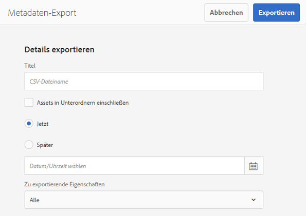
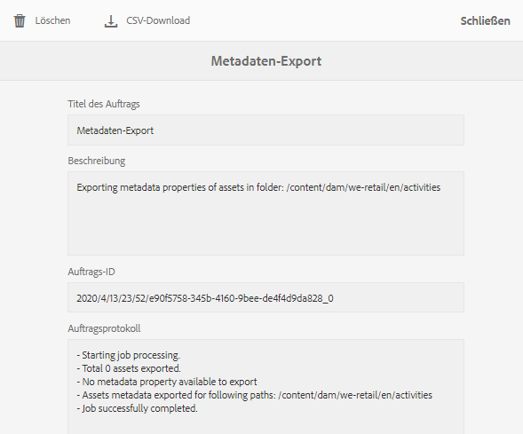

# Stapelweises Importieren und Exportieren von Asset-Metadaten  {#import-and-export-asset-metadata-in-bulk}

Mit Adobe Experience Manager Assets können Sie Asset-Metadaten mithilfe einer CSV-Datei in Massen importieren. Sie können für die kürzlich hochgeladenen Assets oder die vorhandenen Assets eine Massenaktualisierung durchführen, indem Sie eine CSV-Datei importieren. Außerdem können Sie Asset-Metadaten von Drittanbietersystemen mithilfe des CSV-Formats in Batches erfassen.

## Importieren von Metadaten {#import-metadata}

Die Metadaten werden asynchron importiert, sodass der Import die Systemleistung nicht beeinträchtigt. Die gleichzeitige Aktualisierung der Metadaten für mehrere Assets kann aufgrund der Metadaten-Writeback-Aktivität unter Verwendung von Asset-Microservices möglicherweise ressourcenintensiv sein. Adobe empfiehlt, dass Sie alle Massenvorgänge bei geringer Serverauslastung planen, damit die Leistung für andere Benutzer nicht beeinträchtigt wird.

>[!NOTE]
>
>Um Metadaten in benutzerdefinierte Namespaces zu importieren, registrieren Sie zunächst die Namespaces.

1. Navigieren Sie zu der Benutzeroberfläche von [!DNL Assets], wählen Sie **[!UICONTROL Erstellen]** in der Symbolleiste und wählen Sie **[!UICONTROL Metadaten]** aus dem Menü.
1. Tippen/klicken Sie auf der Seite **[!UICONTROL Metadaten-Import]** auf **[!UICONTROL Datei auswählen]**. Wählen Sie die CSV-Datei mit den Metadaten aus.
1. Geben Sie die folgenden Parameter an:

   | Parameter | Beschreibung |
   | ---------------------- | ------- |
   | Batch-Größe | Anzahl der Assets in einem Batch, für die Metadaten importiert werden sollen. Der Standardwert ist 50. Der Wert darf maximal 100 betragen. |
   | Feldtrennzeichen | Der Standardwert ist `,` (ein Komma). Sie können jedoch ein beliebiges anderes Zeichen eingeben. |
   | Mehrfachtrennzeichen | Trennzeichen für Metadatenwerte. Der Standardwert ist `|`. |
   | Workflows starten | Lautet standardmäßig „False“. Wenn hier `true` festgelegt ist und die standardmäßigen Einstellungen für den Workflow „DAM-Metadaten-WriteBack“ aktiv sind (der Metadaten in die binären XMP-Daten schreibt). Die Aktivierung von Workflows verlangsamt das System. |
   | Asset-Pfad-Spaltenname | Definiert den Namen der Spalte in der CSV-Datei, die die Assets enthält. |

1. Wählen Sie **[!UICONTROL Importieren]** aus der Symbolleiste aus. Nachdem die Metadaten importiert wurden, wird eine Benachrichtigung an Ihren Benachrichtigungs-Posteingang gesendet. Navigieren Sie zur Asset-Eigenschaftsseite und überprüfen Sie, ob die Metadatenwerte richtig in die entsprechenden Assets importiert wurden.

1. Um beim Importieren von Metadaten Datum und Zeitstempel hinzuzufügen, verwenden Sie das Format `YYYY-MM-DDThh:mm:ss.fff-00:00` für Datum und Uhrzeit. Datum und Uhrzeit werden durch `T` getrennt angegeben. `hh` sind die Stunden im 24-Stunden-Format, `fff` sind Millisekunden und `-00:00` ist die Zeitzonenverschiebung. Zum Beispiel ist `2020-03-26T11:26:00.000-07:00` der 26. März 2020 um 11:26:00.000 Uhr (PST).

   * Das Datumsformat hängt von der Spaltenüberschrift und dem darin verwendeten Format ab. Wenn das Datum beispielsweise im Format `yyyy-MM-dd'T'HH:mm:ssXXX` vorliegt, muss die entsprechende Spaltenüberschrift `Date: DateFormat: yyyy-MM-dd'T'HH:mm:ssXXX` sein.
   * Das standardmäßige Datumsformat ist `yyyy-MM-dd'T'HH:mm:ss.SSSXXX`.

<!-- Hidden via cqdoc-17869>

>[!CAUTION]
>
>If the date format does not match `YYYY-MM-DDThh:mm:ss.fff-00:00`, the date values are not set. The date formats of exported metadata CSV file is in the format `YYYY-MM-DDThh:mm:ss-00:00`. If you want to import it, convert it to the acceptable format by adding the nanoseconds value denoted by `fff`.
-->

## Exportieren von Metadaten {#export-metadata}

Sie können Metadaten für mehrere Assets in einem CSV-Format exportieren. Die Metadaten werden asynchron exportiert, sodass der Export die Systemleistung nicht beeinträchtigt. Wenn Sie Metadaten exportieren, durchsucht Experience Manager die Eigenschaften des Asset-Knotens `jcr:content/metadata` und der untergeordneten Knoten und exportiert die Metadateneigenschaften in eine CSV-Datei.

Einige Anwendungsfälle für den Massenexport von Metadaten:

* Importieren Sie die Metadaten in ein Drittanbietersystem, wenn Sie Assets migrieren.
* Geben Sie Asset-Metadaten für ein breiteres Projektteam frei.
* Testen oder prüfen Sie die Metadaten auf Ihre Konformität.
* Externalisieren Sie die Metadaten für eine separate Lokalisierung.

>[!NOTE]
>
>Metadaten-Exporte sind auf 1.048.575 Assets begrenzt. Dies entspricht der maximalen Arbeitsblattgröße in Microsoft Excel. Wenn eine exportierte Hierarchie mehr als diese Anzahl von Assets enthält, werden nur die Metadaten der ersten 1.048.575 Assets in die CSV-Datei aufgenommen.

1. Wählen Sie einen Asset-Ordner aus, der Assets enthält, für die Sie Metadaten exportieren möchten. Wählen Sie in der Symbolleiste **[!UICONTROL Metadaten exportieren]** aus.
1. Geben Sie im Dialogfeld „Metadatenexport“ einen Namen für die CSV-Datei an. Um Metadaten von Assets in Unterordnern zu exportieren, wählen Sie **[!UICONTROL Assets in Unterordnern einschließen]**.

   

1. Wählen Sie die gewünschten Optionen aus. Geben Sie einen Dateinamen und ggf. ein Datum an.

1. Geben Sie im Feld **[!UICONTROL Zu exportierende Eigenschaften]** an, ob Sie alle oder nur bestimmte Eigenschaften exportieren wollen. Wenn Sie für den Export „Selektive Eigenschaften“ auswählen, fügen Sie die gewünschten Eigenschaften hinzu.

1. Wählen Sie in der Symbolleiste die Option **[!UICONTROL Exportieren]** aus. Sie erhalten eine Meldung, die bestätigt, dass die Metadaten exportiert wurden. Schließen Sie die Meldung.
1. Öffnen Sie die Posteingangsbenachrichtigung für den Exportauftrag. Wählen Sie den Auftrag aus und klicken Sie in der Symbolleiste auf **[!UICONTROL Öffnen]**. Um die CSV-Datei mit den Metadaten herunterzuladen, wählen Sie in der Symbolleiste die Option **[!UICONTROL CSV-Download]** aus. Klicken Sie auf **[!UICONTROL Schließen]**.

   

   *Abbildung: Dialogfeld zum Herunterladen der CSV-Datei mit Metadaten, die stapelweise exportiert wurden.*

**Siehe auch**

* [Assets übersetzen](translate-assets.md)
* [Assets-HTTP-API](mac-api-assets.md)
* [Von AEM Assets unterstützte Dateiformate](file-format-support.md)
* [Suchen von Assets](search-assets.md)
* [Connected Assets](use-assets-across-connected-assets-instances.md)
* [Asset-Berichte](asset-reports.md)
* [Metadatenschemata](metadata-schemas.md)
* [Herunterladen von Assets](download-assets-from-aem.md)
* [Verwalten von Metadaten](manage-metadata.md)
* [Suchfacetten](search-facets.md)
* [Verwalten von Sammlungen](manage-collections.md)
* [Veröffentlichen von Assets in AEM und Dynamic Media](/help/assets/publish-assets-to-aem-and-dm.md)

>[!MORELIKETHIS]
>
>* [Importieren von Metadaten beim Massenimport von Assets](/help/assets/add-assets.md#asset-bulk-ingestor)
