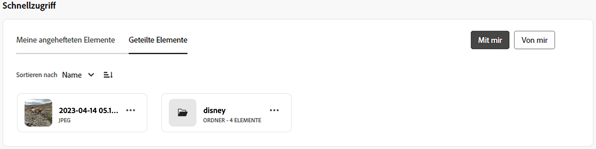

# Mein Arbeitsbereich für Assets {#my-workspace}

>[!CONTEXTUALHELP]
>id="assets_my_workspace"
>title="Mein Arbeitsbereich"
>abstract="Assets enthält jetzt einen anpassbaren Arbeitsbereich, der Widgets für den bequemen Zugriff auf wichtige Bereiche der Assets-Benutzeroberfläche und Informationen bereitstellt, die für Sie am relevantesten sind. Diese Seite ist eine zentrale Anlaufstelle, die einen Überblick über Ihre Arbeitselemente und schnellen Zugriff auf wichtige Workflows bietet."

Assets enthält jetzt einen anpassbaren Arbeitsbereich, der Widgets für den bequemen Zugriff auf wichtige Bereiche der Assets-Benutzeroberfläche und Informationen bereitstellt, die für Sie am relevantesten sind. Diese Seite dient als zentrale Anlaufstelle, um einen Überblick über Ihre Arbeitselemente zu erhalten und schnellen Zugriff auf wichtige Workflows zu ermöglichen. Ein bequemerer Zugriff auf diese Optionen erhöht Ihre Effizienz und inhaltliche Geschwindigkeit.

Sie können auf Mein Arbeitsbereich zugreifen, indem Sie auf **[!UICONTROL Mein Arbeitsbereich]** in den Elementen klicken, die im linken Navigationsbereich verfügbar sind. Das Dashboard „Mein Arbeitsbereich“ umfasst eine Vielzahl von Widgets, über die Schnellzugriff, Erkenntnisse, Aufgaben und Inhalte verfügbar sind. Sie können je nach Ihren Voreinstellungen konfigurieren, wie diese Widgets in Ihrem Arbeitsbereich angezeigt werden.

>[!NOTE]
>
>Das Widget „Erkenntnisse“ ist nur für Administrierende sichtbar.

<!--

**New features coming soon**

Highlights upcoming features for Assets.

-->

**Schnellzugriff**

Heften Sie Dateien, Ordner und Sammlungen an, um im Bedarfsfall schneller auf diese Elemente zugreifen zu können. Alle angehefteten Elemente werden im Dashboard „Mein Arbeitsbereich“ im Abschnitt **Schnellzugriff** angezeigt. Sie können auf diese Elemente über das Dashboard „Mein Arbeitsbereich“ zugreifen, anstatt zu ihrem Speicherort im Repository zu navigieren.

So veröffentlichen Sie ein Asset, einen Ordner oder eine Sammlung:

1. Wählen Sie das Element aus und klicken Sie auf **[!UICONTROL An Schnellzugriff anheften]**.

1. Wählen Sie aus, ob das Element nur für Sie, für die gesamte Organisation oder für ausgewählte Gruppen veröffentlicht werden soll. Wenn Sie **[!UICONTROL Für Gruppen]**, definieren Sie die Gruppennamen in der **[!UICONTROL Pin für Gruppen]** -Feld.

   
1. Klicks **[!UICONTROL Pin]**.

   Das ausgewählte Element wird im **[!UICONTROL Schnellzugriff]** Abschnitt &quot;Mein Arbeitsbereich&quot;.
   

**Erkenntnisse**

Administrierende können eine Zusammenfassung der Anzahl der Downloads und Uploads anzeigen, die in den letzten 30 Tagen in der Assets-Umgebung durchgeführt wurden. Sie können auf **[!UICONTROL Alle anzeigen]** klicken, um schnell zur Seite „Erkenntnisse“ zu navigieren, um detailliertere Dashboards zu erhalten.

Sie können die am häufigsten gesuchten Begriffe sowie die Anzahl der Suchvorgänge dieser Begriffe in Ihrer Assets-Ansichtsimplementierung mit der **Insights** Abschnitt &quot;Mein Arbeitsbereich&quot;. Sie können zudem zu detaillierten Erkenntnissen navigieren, um die häufigsten Suchanfragen der letzten 30 Tage oder 12 Monate anzuzeigen.

**Aufgaben**

Zeigt auf der Registerkarte **[!UICONTROL Meine Aufgaben]** die Liste der Ihnen derzeit zugewiesenen Aufgaben, auf der Registerkarte **[!UICONTROL Zugewiesene Aufgaben]** die von Ihnen erstellten Aufgaben und auf der Registerkarte **[!UICONTROL Abgeschlossen]** die von Ihnen bereits erledigten Aufgaben. Sie können eine Aufgabe auswählen und auf **[!UICONTROL Aufgabe abschließen]** klicken, um eine Aufgabe zu genehmigen oder abzulehnen. Sie können auch eine Aufgabe auswählen und auf **[!UICONTROL Aufgabendetails öffnen]** klicken, um die Aufgabe anzuzeigen und zu genehmigen, abzulehnen, zu bearbeiten oder zu löschen.

>[!NOTE]
>
> Die Option **[!UICONTROL Aufgaben zuweisen]**, mit der Sie eine Aufgabe für ein Asset einem anderen Benutzenden zuweisen können, ist verfügbar, wenn Sie ein Asset auswählen oder die Asset-Informationsansicht öffnen.

**Inhalt**

Zeigt Asset-Ansichten an, einschließlich der Liste der Assets, die Sie kürzlich angezeigt haben. Sie können auswählen, ob Assets im Widget in einer Listenansicht, Rasteransicht, Galerie- oder Wasserfallansicht angezeigt werden sollen, und die Assets nach Name, Größe und Änderungsdatum sortieren. Sie können auch ein Asset auswählen, um die Asset-Details anzuzeigen oder es aus der Liste der zuletzt angezeigten Assets zu entfernen.

Die **[!UICONTROL Top-Downloads]** -Registerkarte zeigt die zehn am häufigsten heruntergeladenen Assets an, die in Ihrer Assets-Ansichtsumgebung verfügbar sind. Sie können wählen, ob die Assets in der Listen- oder Rasteransicht angezeigt werden sollen. Beide Ansichten zeigen für jedes Asset den Formattyp und die Anzahl der Downloads an. Sie können auch ein Asset auswählen und auf **[!UICONTROL Details]** klicken, um seine Eigenschaften anzuzeigen.

## Mein Arbeitsbereich anpassen {#configure-widgets}

Alle Widgets werden standardmäßig angezeigt, Sie können jedoch die in Mein Arbeitsbereich angezeigten Widgets aktivieren oder deaktivieren. Die Voreinstellungen sind für jeden Benutzer spezifisch.

1. Klicken Sie auf **[!UICONTROL Mein Arbeitsbereich]** im linken Navigationsbereich und klicken Sie auf **[!UICONTROL Anpassen]**.

1. Deaktivieren Sie den Umschalter für das Widget, das Sie nicht im Arbeitsbereich anzeigen lassen wollen. Sie können ein Widget auch an die gewünschte Position ziehen, um seine Anzeigereihenfolge im Arbeitsbereich zu aktualisieren.

1. Klicken Sie auf **[!UICONTROL Fertig]**, um die Änderungen zu speichern.

   
