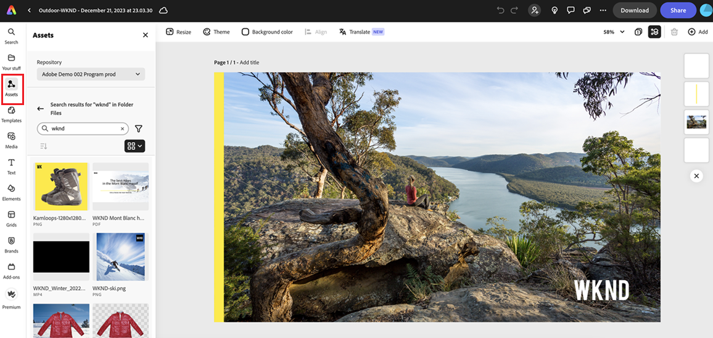

# Native Integration in Adobe Express {#native-integration-adobe-express}

Dank der nativen Integration von AEM Assets mit Adobe Express können Sie über die Adobe Express-Benutzeroberfläche direkt auf die in AEM Assets gespeicherten Assets zugreifen. Sie können in AEM Assets verwaltete Inhalte auf der Express-Arbeitsfläche platzieren und dann neue oder bearbeitete Inhalte in einem AEM Assets-Repository speichern. Die Integration bietet vor allem die folgenden Vorteile:

* Verbesserte Wiederverwendung von Inhalten durch das Bearbeiten und Speichern neuer Assets in AEM.

* Verringerter Zeit- und Arbeitsaufwand beim Erstellen neuer Assets oder beim Erstellen neuer Versionen von vorhandenen Assets.

## Voraussetzungen {#prerequisites}

Es sind Berechtigungen für den Zugriff auf Adobe Express und mindestens eine Umgebung in AEM Assets erforderlich. Die Umgebung kann eines der Repositorys in Assets as a Cloud Service oder Assets Essentials sein.

## Verwenden von AEM Assets im Adobe Express-Editor {#use-aem-assets-in-express}

Führen Sie die folgenden Schritte aus, um mit der Verwendung von AEM Assets im Adobe Express-Editor zu beginnen:

1. Öffnen Sie die Adobe Express-Web-Anwendung.

2. Öffnen Sie eine neue leere Arbeitsfläche, indem Sie eine neue Vorlage oder ein Projekt laden oder ein Asset erstellen.

3. Klicken Sie im linken Navigationsbereich auf **[!UICONTROL Assets]**. Adobe Express zeigt die Liste der Repositorys an, auf die Sie Zugriff haben, zusammen mit der Liste der Assets und Ordner, die auf der Stammebene verfügbar sind.

4. Suchen Sie nach Assets im Repository und ziehen Sie sie per Drag-and-Drop auf die Arbeitsfläche. Klicken Sie alternativ auf die Assets, um sie auf der Arbeitsfläche zu platzieren. Sie können Assets auch nach verschiedenen Kriterien filtern, z. B. Dateityp, MIME-Typ und Dimensionen.

   >[!NOTE]
   >
   >Das Filtern nach Dimension gilt nicht für Videos.

   

### Ersetzen des Bildes mithilfe des AEM-Uploads {#replace-image-using-aem-upload}

Darüber hinaus können Sie die hinzugefügten Bilder mithilfe von **[!UICONTROL AEM Upload]** ersetzen. Führen Sie dazu die folgenden Schritte aus:

1. Durchsuchen oder suchen von Assets und Ziehen und Ablegen auf der Arbeitsfläche.

1. Wählen Sie das Bild aus, das Sie ersetzen möchten. Klicken Sie **[!UICONTROL Ersetzen]** und wählen Sie **[!UICONTROL AEM Assets]** unter verschiedenen anderen Optionen aus.

   

1. Das Bedienfeld **[!UICONTROL AEM]** Upload“ wird im linken Navigationsbereich geöffnet. Adobe Express zeigt die Liste der Repositorys an, auf die Sie zugreifen dürfen, sowie die Liste der Assets und Ordner, die auf der Stammebene verfügbar sind. Wählen Sie dort ein Asset aus, um eine Vorschau der Ersetzung auf der Arbeitsfläche anzuzeigen, und klicken Sie dann zur Bestätigung **[!UICONTROL Ersetzen]**.

   >[!NOTE]
   >
   > SVG-Dateitypen werden nicht unterstützt.

## Speichern von Adobe Express-Projekten in AEM Assets {#save-express-projects-in-assets}

Nachdem Sie entsprechende Änderungen in die Express-Arbeitsfläche eingefügt haben, können Sie sie im AEM Assets-Repository speichern.

1. Klicken Sie auf **[!UICONTROL Freigeben]**, um das Dialogfeld **[!UICONTROL Freigeben]** zu öffnen.

   

2. Wählen Sie im **[!UICONTROL Bereich]** Empfohlen“ im rechten Bereich **AEM Assets** aus. Adobe Express zeigt das Dialogfeld „Hochladen“ an.

   

3. Wählen Sie entweder **Aktuelle Seite** oder **Alle Seiten** aus. Geben Sie einen Namen und ein Format für die Assets an, die exportiert werden sollen. Sie können die Inhalte der Arbeitsfläche in die folgenden Formate exportieren: PNG, JPEG, PDF, MP4, MP4+PNG oder MP4+JPEG. Das Format passt sich basierend auf den Assets automatisch an die Seite(n) der Arbeitsfläche an.
Durch Auswahl von **Aktuelle Seite** wird das Asset auf Ihrer aktuellen Seite in Ihrem Zielordner gespeichert. Wenn Sie **Alle Seiten** auswählen und das Exportformat nicht „PDF“ lautet, werden alle Seiten der Arbeitsfläche als separate Dateien in einem neuen Ordner in Ihrem Zielordner gespeichert. Wenn das Exportformat „PDF“ lautet, werden alle Seiten der Arbeitsfläche als eine einzige PDF-Datei im Zielordner gespeichert.

4. Klicken Sie auf das Ordnersymbol unter „**Zielordner**“, um einen Speicherort auszuwählen und die Assets zu speichern.

   

5. Optional: Sie können mit dem Feld **Projekt- oder Kampagnenname** Kampagnen-Metadaten für Ihren Upload hinzufügen. Sie können einen vorhandenen Namen verwenden oder einen neuen erstellen. Sie können mehrere Projekt- oder Kampagnennamen für Ihren Upload definieren. Geben Sie zum Registrieren des Namens einfach den Namen ein und drücken Sie die Eingabetaste.
Adobe empfiehlt als Best Practice, in den restlichen Feldern Werte anzugeben sowie ein verbessertes Sucherlebnis für Ihre hochgeladenen Assets zu schaffen.

6. Definieren Sie auf ähnliche Weise Werte für die Felder **[!UICONTROL Keywords]** und **[!UICONTROL Kanäle]**.

7. Klicken Sie auf **[!UICONTROL Hochladen]**, um die Assets in AEM Assets hochzuladen.

<table> 
    <tbody>
     <tr>
      <th><strong>Unterstützte Formate</strong></th>
      <th><strong>Größe</strong></th>
     </tr>
    </tr>
    <tr>
        <td>[!UICONTROL JPEG]</td>
        <td> 65 MP (z. B. 8K x 8K oder 16K x 4K) </td>
    </tr>
    <tr>
        <td>[!UICONTROL PNG]</td>
        <td> 65 MP (z. B. 8K x 8K oder 16K x 4K) </td>
    </tr>
    <tr>
        <td>[!UICONTROL SVG]</td>
        <td> Maximal 250 KB</td>
    </tr>
    <tr>
        <td>[!UICONTROL MP4]</td>
        <td> 3840 x 3840 Pixel, maximal 200 MB</td>
    </tr>
    </tbody>
</table>

## Einschränkungen {#limitations}

1. Für den Import und Export wird MP4 als Videodateityp unterstützt.

2. Beim **MP4-** werden Videos mit transparentem Hintergrund (Alphakanal) nicht unterstützt.
   <!--
   1. The maximum file size supported is 200 MB. If this limit exceeds, an alert message displays.
   2. The maximum supported resolution is 3840 X 3840 pixels.
   3. Videos with transparent backgrounds (alpha channel) are not supported.
   -->

3. Für **MP4** Videoexport werden maximal 200 MB Dateigröße unterstützt. Bei Überschreiten dieses Grenzwerts wird ein Warnhinweis angezeigt, das Video auf 200 MB oder weniger zu reduzieren oder es nach dem Herunterladen manuell in den Zielordner in AEM Assets hochzuladen.

