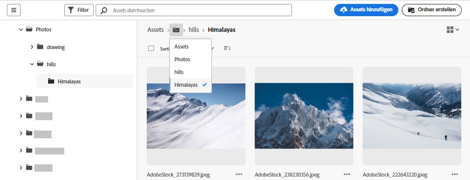
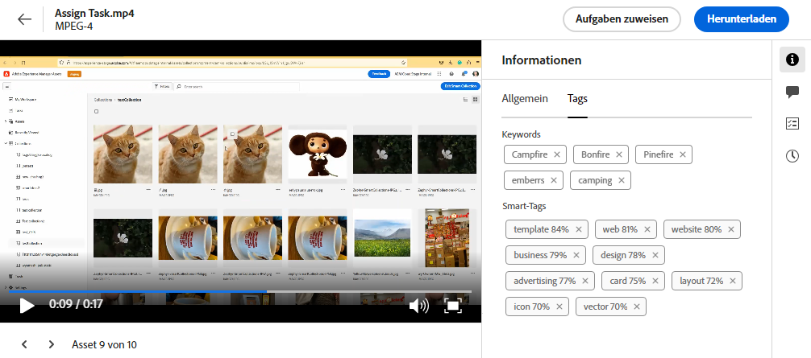

# Navigieren zu Dateien und Ordnern und Anzeigen von Assets {#view-assets-and-details}

<!-- TBD: Give screenshots of all views with many assets. Zoom out to showcase how the thumbnails/tiles flow on the UI in different views. -->

<!-- TBD: The options in left sidebar may change. Shared with me and Shared by me are missing for now. Update this section as UI is updated. -->

## Grundlegendes zur Benutzeroberfläche von [!DNL Assets view]  {#understand-interface-navigation}

[!DNL Assets view] bietet eine intuitive und benutzerfreundliche Benutzeroberfläche. Die klare Benutzeroberfläche erleichtert das Auffinden und Speichern von Assets und zugehörigen Informationen.

Wenn Sie sich bei [!DNL Assets view] anmelden, sehen Sie die folgende Oberfläche.

![[!DNL Assets view]-Benutzeroberfläche](assets/assets-view-interface.png)

**A**: Linke Seitenleiste zum Durchsuchen des Repositorys und Aufruf einiger weiterer Optionen **B**: Linke Seitenleiste ein- und ausblenden, um den Asset-Ansichtsbereich zu vergrößern **C**: Suchergebnisse filtern **D**: Den gesamten Inhalt des ausgewählten Ordners auswählen **E**: Optionen zum Sortieren von Assets **F**: Suchfeld **G**: Dateien mithilfe der Schaltfläche `Add Assets` hochladen oder ziehen **H**: Einen neuen Ordner erstellen **I**: Zwischen verschiedenen Ansichten wechseln

<!-- TBD: Need an embedded video here with narration. It has to be hosted on MPC to be embeddable. -->

## Durchsuchen und Anzeigen von Assets und Ordnern {#browse-repository}

Sie können die Ordner über die Hauptbenutzeroberfläche oder die linke Seitenleiste durchsuchen. Experience Manager Assets zeigt eine visuelle Vorschau des Ordnerinhalts auf der Ordnerminiaturansicht an, wenn Sie nach Inhalten suchen. Dies verbessert die Erkennung von Assets, die im AEM Assets-Repository verfügbar sind. Mit dieser Ordnerminiaturansicht sparen Sie Zeit bei der Suche nach bestimmten Assets in einem Ordner im AEM Assets-Repository.
Beim Durchsuchen von Assets in einem Ordner können Sie die Benutzeroberfläche verwenden, um Asset-Miniaturansichten anzuzeigen und auf diese Weise das Repository visuell zu durchsuchen oder um Asset-Details anzuzeigen und so das gewünschte Asset schnell zu finden. Die in der linken Seitenleiste verfügbaren Optionen sind:

* [Mein Arbeitsbereich](/help/assets/my-workspace-assets-view.md): Assets enthält jetzt einen anpassbaren Arbeitsbereich, der Widgets für den bequemen Zugriff auf wichtige Bereiche der Assets-Benutzeroberfläche und Informationen bereitstellt, die für Sie am relevantesten sind. Diese Seite dient als zentrale Anlaufstelle, um einen Überblick über Ihre Arbeitselemente zu erhalten und schnellen Zugriff auf wichtige Workflows zu ermöglichen. Ein bequemerer Zugriff auf diese Optionen erhöht Ihre Effizienz und inhaltliche Geschwindigkeit.
* [Aufgaben](/help/assets/my-workspace-assets-view.md): Sie können die Aufgaben, die Ihnen zugewiesen wurden, auf der Registerkarte **Meine Aufgaben** ansehen. Die Aufgaben, die von Ihnen erstellt wurden, können hingegen auf der Registerkarte **Zugewiesene Aufgaben** angesehen werden. Außerdem finden Sie die Aufgaben, die Sie abgeschlossen haben, auf der Registerkarte **Abgeschlossene Aufgaben**.
* [Assets](/help/assets/manage-organize-assets-view.md): Liste aller Ordner in einer Baumstrukturansicht, auf die Sie Zugriff haben.
* **Kürzlich angesehen**: Liste der Assets, die Sie kürzlich in der Vorschau betrachtet haben. [!DNL Assets view] zeigt nur die Assets an, die Sie in der Vorschau anzeigen. Hier werden die Assets, an denen Sie beim Durchsuchen der Repository-Dateien oder -Ordner vorbeiscrollen, nicht angezeigt.
* [Sammlungen](/help/assets/manage-collections-assets-view.md): Eine Sammlung ist ein Satz von Assets, Ordnern oder sonstigen Sammlungen in der Adobe Experience Manager Assets-Ansicht. Anhand von Sammlungen können Assets von mehreren Benutzenden gemeinsam verwendet werden. Im Gegensatz zu Ordnern kann eine Sammlung Assets von verschiedenen Speicherorten enthalten. Sie können mehrere Sammlungen für eine Benutzerin bzw. einen Benutzer freigeben. Jede Sammlung enthält Verweise auf Assets. Die referenzielle Integrität von Assets wird sammlungsübergreifend aufrechterhalten.

* [Erkenntnisse](/help/assets/manage-reports-assets-view.md#view-live-statistics): In [!DNL Assets view] können Sie Echtzeiterkenntnisse in Ihrem Dashboard anzeigen. In der Assets-Ansicht können Sie mit dem Insights-Dashboard Echtzeitdaten für Ihre Assets Essentials-Umgebung anzeigen. Sie können Echtzeit-Ereignismetriken für die letzten 30 Tage oder für die letzten 12 Monate anzeigen.
* **Papierkorb**: Enthält eine Liste der Assets, die aus dem Stammordner **[!UICONTROL Assets]** gelöscht wurden. Sie können ein Asset im Papierkorb-Ordner auswählen, um es am ursprünglichen Speicherort wiederherzustellen oder dauerhaft zu löschen. Sie können ein Keyword angeben oder Filter wie Asset-Status, Dateityp, MIME-Typ, Bildgröße, Asset-Erstellung, Änderung und Ablaufdaten anwenden sowie Filterung nach Assets, die von der aktuellen Benutzerin bzw. dem aktuellen Benutzer verworfen wurden. Sie können auch benutzerdefinierte Filter anwenden, um im Papierkorb-Ordner nach geeigneten Assets zu suchen. Weitere Informationen zum Verwenden standardmäßiger und benutzerdefinierter Filter finden Sie unter [Suchen nach Assets in der Assets-Ansicht](/help/assets/search-assets-view.md).
* **Einstellungen**: Sie können verschiedene Optionen der Assets-Ansicht mithilfe von **Einstellungen** konfigurieren, wie etwa Metadatenformulare, Berichte und Taxonomieverwaltung.

<!-- TBD: Not sure if we want to publish these right now. CC Libs are beta as per Greg.
* **Libraries**: Access to [!DNL Adobe Creative Cloud Team] (CCT) Libraries view. This view is visible only if the user is entitled to CCT Libraries.
-->

<!-- TBD: My Work Space shows task inbox and it is not visible on AEM Cloud Demos as of now. It is the source of truth server hence not documenting My Work Space option for now.
-->

Sie können die linke Seitenleiste erweitern oder minimieren, um den verfügbaren Asset-Anzeigebereich zu vergrößern.

In [!DNL Assets view] können Sie Assets, Ordner und Suchergebnisse in vier verschiedenen Layout-Typen anzeigen.

*  [!UICONTROL Listenansicht]
*  [!UICONTROL Rasteransicht]
*  [!UICONTROL Galerieansicht]
*  [!UICONTROL Wasserfallansicht]

Um ein Asset zu finden, können Sie die Assets in auf- oder absteigender Reihenfolge von `Name`, `Relevancy`, `Size`, `Modified` und `Created` sortieren.

Um in einem Ordner zu navigieren, doppelklicken Sie auf die Miniaturansichten des Ordners oder wählen Sie den Ordner in der linken Seitenleiste aus. Um Details zu einem Ordner anzuzeigen, wählen Sie ihn aus und klicken Sie oben in der Symbolleiste auf „Details“. Um in der Hierarchie nach oben und unten zu navigieren, verwenden Sie entweder die linke Seitenleiste oder die Breadcrumbs oben.

*Abbildung: Verwenden Sie die Breadcrumbs oben oder links in der Seitenleiste, um die Hierarchie zu durchsuchen.*

## Anzeigen einer Vorschau für Assets {#preview-assets}

Bevor Sie ein Asset verwenden, freigeben oder herunterladen, können Sie es sich genauer ansehen. Mit der Vorschaufunktion können Sie nicht nur die Bilder, sondern auch einige andere unterstützte Asset-Typen anzeigen.

Um ein Asset in der Vorschau anzuzeigen, wählen Sie es aus und klicken Sie oben in der Symbolleiste auf [!UICONTROL Details] . Sie können nicht nur das Asset, sondern auch seine detaillierten Metadaten anzeigen und andere Aktionen durchführen.

**A**: Zurück zum aktuellen Ordner oder zum aktuellen Suchergebnis im Repository **B**: Name und Format für die Datei, die Sie in der Vorschau anzeigen **C**: Zuweisen von Aufgaben **D**: Erweiterte Metadaten **E**: Keywords und Smart-Tags **F**: Kommentieren und Versehen von Anmerkungen **G**: Anzeigen von Aufgaben im Zusammenhang mit dem ausgewählten Asset **H**: [Anzeigen und Verwalten von Versionen](/help/assets/manage-organize-assets-view.md#versions-of-assets) **I**: Anzeigen von Ausgabedarstellungen des Bildes **J**: Bearbeiten des Bildes **K**: Anzeigen von Dynamic Media-Ausgabedarstellungen, einschließlich intelligenter Zuschnitt und Ausgabedarstellungen durch Dynamic Media mit OpenAPI-Funktionen. **L**: Grundlegende Metadaten **M**: Erweiterte Metadaten **N**: Schlagwörter und Smart-Tags **O**: Wechseln zum vorherigen oder nächsten Element im aktuellen Ordner, ohne zum Ordner zurückzukehren **P**: Genauere Vorschau. Zoom, Vollbild und andere Optionen.

Sie können auch eine Vorschau der Videos anzeigen.

Wenn Sie ein Asset explizit in der Vorschau anzeigen, wird es in [!DNL Assets view] als kürzlich angesehenes Asset angezeigt.

<!-- TBD: Describe the options.

Explicitly previewed assets are displayed as recently viewed assets. Give screenshot of this.
Other use cases after previewing.
-->

## Nächste Schritte {#next-steps}

* Geben Sie Produkt-Feedback über die Option [!UICONTROL Feedback] in der Benutzeroberfläche der Assets-Ansicht

* Geben Sie Feedback zur Dokumentation durch  über die Option [!UICONTROL Diese Seite bearbeiten] oder durch  über die Option [!UICONTROL Problem protokollieren] in der rechten Seitenleiste

* Kontaktieren Sie die [Kundenunterstützung](https://experienceleague.adobe.com/de?support-solution=General#support)

>[!MORELIKETHIS]
>
>* [Anzeigen von Versionen eines Assets](/help/assets/manage-organize-assets-view.md#view-versions).
