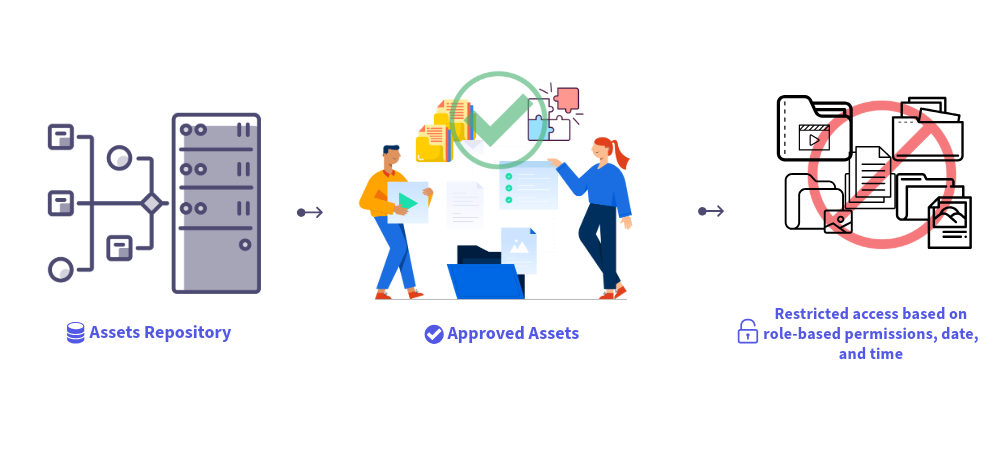

# Dynamic Media mit OpenAPI-Funktionen {#new-dynaminc-media-apis-overview}

In der modernen digitalen Welt ist die Erschließung des vollen Potenzials der digitalen Assets Ihrer Marke von entscheidender Bedeutung, um dem Wettbewerb voraus zu sein. Eine ganzheitliche Digital Assets Management (DAM)-Lösung erleichtert die Verwaltung von Assets, fördert die Markenkonsistenz und beschleunigt die Inhaltsbereitstellung bei gleichzeitiger Gewährleistung von Markenintegrität und außergewöhnlichen Kundenerlebnissen.

Dynamic Media mit OpenAPI-Funktionen stellt DAM in den Mittelpunkt eines agilen und effizienten Content-Supply-Chain-Ökosystems, um Asset-Governance und -Bereitstellung sicherzustellen.

## Warum sollte Dynamic Media mit OpenAPI-Funktionen verwendet werden? {#new-dynamic-media-api-features}

Dynamic Media mit OpenAPI-Funktionen bietet die folgenden Hauptvorteile:

* **Nahtlose Integrationen**: Dynamic Media mit OpenAPI-Funktionen bietet einen umfassenden Satz von Such- und Bereitstellungs-APIs. Dadurch können Ihre Entwickler die Bereitstellung von Assets einfach in ihre Anwendungen integrieren](/help/assets/integrate-new-dynamic-media-apis.md). [ Zu den Anwendungen gehören Adobe sowie Anwendungen von Drittanbietern. Darüber hinaus bietet es eine Benutzeroberfläche für den Asset-Wähler [Micro Frontend](/help/assets/asset-selector.md) zum Suchen und Auswählen genehmigter Assets. Der Selektor kann mühelos in jede Anwendung integriert werden, die auf JavaScript-Frameworks wie React JS, Angular JS und Vanilla JS basiert.

* **Zentralisierte Verwaltung digitaler Assets**: DAM ist die zentrale Quelle der Wahrheit für alle digitalen Assets. Ihre digitalen Assets werden zentral in AEM Assets verwaltet und über Versand-URLs an verbrauchte Anwendungen bereitgestellt, ohne Asset-Binärdateien zu kopieren.

* **Echtzeit-Aktualisierungen**: Alle Änderungen, die an genehmigten Assets in DAM vorgenommen werden, einschließlich Versionsaktualisierungen und Metadatenänderungen, werden automatisch in den Versand-URLs übernommen. Mit einem kurzen TTL-Wert (Time-to-Live) von 10 Minuten, der für Dynamic Media mit OpenAPI-Funktionen über CDN konfiguriert wurde, werden Aktualisierungen in weniger als 10 Minuten auf allen Authoring- und veröffentlichten Benutzeroberflächen sichtbar.

* **Markenkonsistenz**: Nur [markengenehmigte Assets](/help/assets/approved-assets.md) werden nachgelagerten Anwendungen angezeigt. [Brand Manager und Marketingexperten behalten die strenge Kontrolle über Marken-Assets](/help/assets/restrict-assets-delivery.md). Es steht nur die genehmigte und neueste Version des Assets zur Verwendung zur Verfügung, wodurch Markenkonsistenz über alle Kanäle und Anwendungen hinweg gewährleistet ist.

* **Web-optimierte Bereitstellung**: Digitale Assets werden in weboptimierten Formaten bereitgestellt, um die Web-Vitals Ihrer digitalen Erlebnisse zu verbessern. Dazu gehören die Unterstützung von WebP-Ausgabeformaten für Bilder, das adaptive Streaming über HLS- oder DASH-Protokolle für Videos und Original-Ausgabeformate für Dokumente.

* **Dynamische Asset-Transformation**: Unser System ermöglicht die direkte Bildumwandlung mithilfe von URL-Parametern, die als Bild-Modifikatoren bezeichnet werden. [Zum Beispiel Breite, Höhe, Rotation, Spiegeln, Qualität, Zuschneiden und Format](/help/assets/deliver-assets-apis.md). Dynamic Media mit OpenAPI-Funktionen unterstützt auch Funktionen für smartes Zuschneiden von Bildern. Transformierte Ausgabedarstellungen werden dynamisch generiert und nahtlos über das CDN bereitgestellt.

* **Sichere Bereitstellung von Assets**: Dynamic Media mit OpenAPI-Funktionen bieten einen Mechanismus zur Steuerung des Zugriffs auf Ihre digitalen Assets. Sie können Benutzerrollen oder Gruppen als Metadaten für zu sichernde Assets angeben und einen vordefinierten Zeitrahmen festlegen, innerhalb dessen [nur autorisierte Benutzer auf diese Assets zugreifen können](/help/assets/restrict-assets-delivery.md). Die Bereitstellungs-URLs für gesicherte Assets werden für nicht autorisierte Benutzer während des eingeschränkten Zeitraums nicht aufgelöst.

* **Dateneinblicke, um fundierte Entscheidungen zu treffen**: Neben Asset-Management und -Bereitstellung erfasst sie Versanddateneinblicke in Asset-Sendungen im CDN, sodass Brand Manager Versandmetriken kanalübergreifend verfolgen können. Sie ermöglichen es ihnen, datenbasierte Entscheidungen zur kontinuierlichen Optimierung von Asset-Governance und Bereitstellungsstrategien zu treffen.

## Voraussetzungen für den Zugriff auf Dynamic Media mit OpenAPI-Funktionen {#prerequisites-new-dynaminc-media-apis}

Für den Zugriff auf Dynamic Media mit OpenAPI-Funktionen benötigen Sie Lizenzen für:

* AEM Assets as a Cloud Service

* AEM Dynamic Media

## Wie kann Dynamic Media mit OpenAPI-Funktionen aktiviert werden? {#enable-new-dynamic-media-apis}

Bevor Sie eine Anfrage zur Aktivierung von Dynamic Media mit OpenAPI-Funktionen in AEM as a Cloud Service senden, stellen Sie sicher, dass diese Option nicht bereits aktiviert ist. Führen Sie die folgenden Schritte aus, um zu überprüfen, ob sie aktiviert ist:

1. Aus Engineering und Produktmanagement zu bestätigen

Um Dynamic Media mit OpenAPI-Funktionen in AEM as a Cloud Service zu aktivieren, senden Sie ein Adobe-Support-Ticket mit den folgenden Details:

* Cloud Service-Programm und Umgebungs-ID

* Details des Anwendungsbeispiels zur Lösung mit der Integration von Dynamic Media mit OpenAPI-Funktionen

* Details der nachgelagerten Anwendungen, die in Dynamic Media mit OpenAPI-Funktionen integriert werden sollen.

  >[!NOTE]
  >
  > Geben Sie zur Integration in eine Nicht-Adobe-Anwendung Domänennamen an die Whitelist, auf der die Anwendung gehostet wird.

* Details der wichtigsten Kundenkontakte, die am Integrationsprojekt beteiligt sind.

Nachdem Sie das Support-Ticket übermittelt haben, ermöglicht Adobe Dynamic Media mit OpenAPI-Funktionen in Ihrer Cloud Service-Umgebung und gibt Details wie die IMS-Client-ID frei, damit Sie mit der Integration fortfahren können.

## Weitere Informationen zu wichtigen Funktionen {#learn-more-key-capabilities}

<table>
<td>
   
   

      <a href="/help/assets/approved-assets.md">
      <strong>Genehmigen von Assets in Experience Manager Assets</strong>
      </a>
   

   

      <em>Genehmigen Sie Assets in AEM Assets, um die Asset-Verwaltung zu optimieren und so einen kontrollierten und effizienten Prozess für die Verarbeitung von Assets sicherzustellen.</em>
   

</td>
<td>
   
   

      <a href="/help/assets/integrate-new-dynamic-media-apis.md">
      <strong>Integrieren von AEM Assets mit nachgelagerten Anwendungen</strong>
      </a>
   

   

      <em>Integrieren Sie Ihre eigene benutzerdefinierte Benutzeroberfläche mit dem Experience Manager Assets-Repository mithilfe der Such- und Bereitstellungs-APIs oder verwenden Sie die Adobe Micro-Frontend-Asset-Auswahl.</em>
   

</td>
<td>
   
   

      <a href="/help/assets/asset-selector.md">
      <strong>Adobe-Micro-Frontend-Asset-Auswahl</strong>
      </a>
   

   

      <em>Eine Benutzeroberfläche, die mit dem AEM Assets-Repository interagiert, um Assets zu suchen und sie dann in Ihrer Anwendungsbearbeitung zu verwenden.</em>
   

</td>
</table>
<table>
<td>
   
   

      <a href="/help/assets/search-assets-api.md">
      <strong>Suchen von Assets im Experience Manager Assets-Repository</strong>
      </a>
   

   

      <em>Suchen Sie Assets im AEM Assets-Repository, damit sie an nachgelagerte Anwendungen bereitgestellt werden können.</em>
   

</td>
<td>
   
   

      <a href="/help/assets/deliver-assets-apis.md">
      <strong>Bereitstellen von Assets an nachgelagerte Anwendungen</strong>
      </a>
   

   

      <em> Stellen Sie Assets mithilfe einer Bereitstellungs-URL an integrierte nachgelagerte Anwendungen bereit.</em>
   

</td>
<td>
   
   

      <a href="/help/assets/restrict-assets-delivery.md">
      <strong>Beschränken des Zugriffs auf Assets in Experience Manager</strong>
      </a>
   

   

      <em> DAM Admin oder Brand Manager schränken den Zugriff ein, indem Rollen für genehmigte Assets in der AEM as a Cloud Service-Autoreninstanz konfiguriert werden.</em>
   

</td>
</table>

