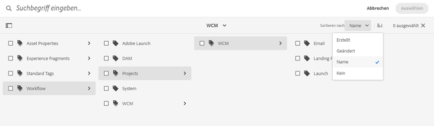

# Digitale Assets organisieren {#organize-digital-assets}

| [Best Practices für die Suche](/help/assets/search-best-practices.md) | [Best Practices für Metadaten](/help/assets/metadata-best-practices.md) | [Content Hub](/help/assets/product-overview.md) | [Dynamic Media mit OpenAPI-Funktionen](/help/assets/dynamic-media-open-apis-overview.md) | [Entwicklerdokumentation zu AEM Assets](https://developer.adobe.com/experience-cloud/experience-manager-apis/) |
| ------------- | --------------------------- |---------|----|-----|

| Version | Artikel-Link |
| -------- | ---------------------------- |
| AEM 6.5 | [Hier klicken](https://experienceleague.adobe.com/docs/experience-manager-65/assets/managing/organize-assets.html?lang=de) |
| AEM as a Cloud Service | Dieser Artikel |

Alle digitalen Assets, Metadaten und Inhalte von Microsoft® Office- und PDF-Dokumenten werden extrahiert und für die Suche aufbereitet. Die Suche ermöglicht weitreichende Filtermöglichkeiten für Assets und hält dabei vollständig die korrekten Berechtigungen ein. Metadaten werden in „Metadaten in Digital Asset Management“ ausführlich behandelt.

[!DNL Experience Manager Assets] unterstützt verschiedene Methoden zum Organisieren von Inhalten. Sie können sie hierarchisch anhand von Ordnern oder in ungeordneter Ad-hoc-Manier organisieren, wobei zum Beispiel Tags verwendet werden können. Benutzer können Tags im DAM-Asset-Editor bearbeiten, in dem Teil-Assets, Ausgabedarstellungen und Metadaten angezeigt werden.

<!-- Commenting to pull down the existing content before applying changes wrt CQDOC-15930
## Create folders {#create-folders}

When organizing a collection of assets, for example, all *Nature* images, you can create folders to keep them together. You can use folders to categorize and organize your assets. [!DNL Assets] does not require you to organize assets in folders to work better.

>[!NOTE]
>
>Sharing an Assets folder (in Marketing Cloud) of the type `sling:OrderedFolder`, is not supported. If you want to share a folder, do not select Ordered when creating a folder.

1. Navigate to the place in your digital assets folder where you want to create a folder.
1. In the menu, click **[!UICONTROL Create]**. Select **[!UICONTROL New Folder]**.
1. In the **[!UICONTROL Title]** field, provide a folder name. By default, DAM uses the title that you provided as the folder name. Once the folder is created, you can override the default and specify another folder name.
1. Click **[!UICONTROL Create]**. Your folder is displayed in the digital assets folder.

## Add CUG properties to folders {#add-cug-properties-to-folders}

You can limit who can access certain folders in Assets by making the folder part of a closed user group (CUG). To make a folder part of a CUG:

1. In Assets, right-click the folder you want to add closed user group properties for and select **Properties**.  
1. Click the **CUG** tab.
1. Select the **Enabled** check box to make the folder and its assets available only to a closed user group.  
1. Browse to the login page, if there is one, to add that information. Add admitted groups by clicking **Add item**. If necessary, add the realm. Click **OK** to save your changes.

## Use tags to organize assets {#use-tags-to-organize-assets}

You can use folders or tags or both to organize assets. Adding tags to assets makes them easier to retrieve during a search. To add tags to an asset, follow these steps:

1. In the Digital Asset Manager, double-click the asset to open it.
1. In the **Tags** area, open the menu to reveal the available tags. Select tags as appropriate. To delete a tag, hover the pointer over the tag and click `X` to delete it.
1. Click **Save** to save any tags you added.

Date24/08/2021
-->

## Organisieren von Assets in Ordnern {#organize-using-folders}

Die einfachste Möglichkeit zum Organisieren von Assets besteht darin, die Assets in Ordnern zu speichern. Dies entspricht dem Organisieren von Dateien in Ordnern in Ihrem lokalen Dateisystem. Weitere Informationen zum Erstellen und Verwalten von Ordnern finden Sie unter [Verwalten von Assets](manage-digital-assets.md). Wie Sie Ihre Dateien und Ordner benennen, wie Sie Unterordner anordnen und wie Sie die Dateien in diesen Ordnern handhaben, hat daher eine erhebliche Auswirkung darauf, wie diese Assets verarbeitet werden. Durch die Verwendung konsistenter und angemessener Strategien für die Datei- und Ordnernamen sowie guter Metadatenpraktiken können Sie das gesamte Repository für digitale Assets optimal nutzen.

* Normalerweise ist Ihr Repository für digitale Assets immer im Wachstum begriffen. Daher ist es wichtig, die Verwendung von Metadaten, die Ordnerstruktur und die Dateibenennung frühzeitig im Erstellungszyklus des Inhalts zu formalisieren.
* Verwenden Sie Ordner, um eine konsistente Speicherstruktur für die digitalen Assets durchzusetzen. Diese Konsistenz hilft Ihrem Prozess und bei der Verwaltung Ihrer Assets. Beispielsweise können Assets, die in den folgenden Typen von Ordner platziert werden, Ihnen dabei helfen, Ihre Assets zu trennen:

   * **Entwicklungsordner**: enthält digitale Assets, an denen Sie gerade arbeiten.
   * **Kundenordner**: enthalten digitale Assets basierend auf Kunden- oder Projektnamen.
   * **Primäre Ordner**: enthalten digitale Quell-Assets in ihrer Originalform.
   * **Ausgabedarstellungsordner**: enthalten Ausgabedarstellungen und Kopien der digitalen Quell-Assets in Originalform.
   * **Dateigrößenordner**: enthalten digitale Assets basierend auf kleinen, mittleren oder großen Dateigrößen.
   * **Staging-Ordner**: enthalten digitale Assets, die für die Veröffentlichung auf Ihrer Website bereit sind.
   * **MIME-Typ-Ordner**: enthalten digitale Assets entsprechend den MIME-Typen, z. B. Bilder, Dokumente und Multimedia.
   * **Archivordner**: enthalten nicht mehr verwendete digitale Assets.
   * **Datumsbasierte Ordner**: enthalten digitale Assets basierend auf einem Erstellungsdatum oder dem letzten Änderungsdatum.

* Erstellen Sie ein Verzeichnis mit Ordnern, die sich wahrscheinlich nicht ändern werden, damit Anpassungen oder Automatisierungen weiterhin funktionieren. Beispielsweise funktionieren die zugewiesenen Verarbeitungsprofile weiterhin.
* Angenommen, ein Asset wurde bereits veröffentlicht. Dann verschieben Sie das Asset mit [!DNL Experience Manager] in einen anderen Ordner und veröffentlichen es von seinem neuen Speicherort erneut. Die ursprüngliche Position des veröffentlichten Assets sowie das neu veröffentlichte Asset sind weiterhin verfügbar. Das ursprünglich veröffentlichte Asset ist allerdings für [!DNL Experience Manager] *nicht mehr zugänglich*. Daher kann dessen Veröffentlichung nicht rückgängig gemacht werden. Daher empfiehlt es sich, zunächst die Veröffentlichung eines Assets rückgängig zu machen und es dann in einen anderen Ordner zu verschieben.

## Organisieren von Assets mit Tags {#use-tags-to-organize-assets}

Das Hinzufügen von Tags zu Assets erleichtert deren Abruf bei einer Suche, das Erstellen von Sammlungen mithilfe der Suchergebnisse, das Verbessern des Suchrangs für einige Assets und das Anwenden von KI-Algorithmen von Adobe Sensei zur Asset-Erkennung.

[!DNL Adobe Experience Manager Assets] verwendet einen selbstlernenden Algorithmus, um hochgradig beschreibende Tags zu erstellen, mit denen Sie das richtige Asset mit nur wenigen Klicks finden können. Smart-Tagging nutzt Adobe Sensei, künstliche Intelligenz und ein Framework für maschinelles Lernen, das trainiert werden kann, um standardmäßige und geschäftsspezifische Tags zu erkennen und auf Bilder anzuwenden. Smart-Tags können auch Inhalte, einzelne Wörter oder Ausdrücke identifizieren und automatisch beschreibende Tags auf Assets anwenden.

Im Folgenden werden die Schritte zum Hinzufügen von Tags zu einem Asset beschrieben:

1. Melden Sie sich bei [!DNL Experience Manager Assets] an.
1. Klicken Sie auf **[!UICONTROL Assets]** > **[!UICONTROL Dateien]**, wählen Sie das Asset aus und klicken Sie auf **[!UICONTROL Eigenschaften]**, um die Asset-Eigenschaften zu öffnen.
1. Klicken Sie auf der Registerkarte **[!UICONTROL Allgemein]** auf das Ordnersymbol in den Metadaten von **[!UICONTROL Tags]**. Ein Popup-Fenster wird geöffnet.
1. Suchen Sie die entsprechenden Tags in den vorhandenen Tags in `cq-tags` oder wählen Sie sie aus. Sie können dem Asset mehrere Tags zuweisen.

   Sie können die Tag-Struktur anhand der Variablen **[!UICONTROL Name]** (alphabetische Reihenfolge), **[!UICONTROL Erstellt]**-Datum oder **[!UICONTROL Geändert]**-Datum aufsteigend oder absteigend sortieren. In der folgenden Abbildung wird die Tag-Struktur alphabetisch nach dem **[!UICONTROL Namen]** sortiert.

   

1. Klicken Sie auf **Speichern**, um die Änderungen an den Asset-Metadaten zu aktualisieren.

Weitere Informationen finden Sie in den folgenden Artikeln:

* [Bearbeiten von Asset-Metadaten](meta-edit.md)
* [Smart-Tags in Assets](smart-tags.md)
* [Hinzufügen von Tag-Prädikaten zum Suchbereich](/help/assets/search-facets.md/#adding-a-tags-predicate)

## Organisieren als Sammlungen {#organize-as-collections}

Mit Asset-Sammlungen in [!DNL Experience Manager Assets] können Sie die Möglichkeit optimieren, Assets zu erstellen, zu bearbeiten und zwischen Benutzern freizugeben. Erstellen Sie verschiedene Arten von Sammlungen basierend auf ihrer Verwendung, einschließlich Sammlungen, die eine statische Referenzliste von Assets, Ordnern und Sammlungen enthalten, und Sammlungen, die Assets basierend auf Suchkriterien abrufen. Sie können Sammlungen mit Assets aus verschiedenen Speicherorten erstellen und sie für mehrere Benutzer mit unterschiedlichen Zugriffs-, Anzeige- und Bearbeitungsberechtigungen freigeben.

Weitere Informationen finden Sie unter [Sammlungen verwalten](manage-collections.md)

## Verwenden von Profilen zum Organisieren von Assets {#organize-to-use-profiles}

Ein Verarbeitungsprofil enthält [!DNL Assets]-Verarbeitungsbefehle, die für Assets gelten, die in vordefinierte Ordner hochgeladen werden. Profile werden verwendet, um die Verarbeitung von Inhalten eines Ordners oder von neu hochgeladenen Assets zu automatisieren. Sie können Profile verwenden, um Ihre Assets besser zu organisieren.

Indem Sie die Verwendung von Metadaten, die Benennung von Dateien und die Ordnerstruktur standardisieren, wird sichergestellt, dass Sie auch bei einem stets wachsenden Pool mit digitalen Assets Verarbeitungsprofile präziser und konsistenter auf Ordner anwenden können.

**Siehe auch**

* [Assets übersetzen](translate-assets.md)
* [Assets-HTTP-API](mac-api-assets.md)
* [Von AEM Assets unterstützte Dateiformate](file-format-support.md)
* [Suchen von Assets](search-assets.md)
* [Connected Assets](use-assets-across-connected-assets-instances.md)
* [Asset-Berichte](asset-reports.md)
* [Metadatenschemata](metadata-schemas.md)
* [Herunterladen von Assets](download-assets-from-aem.md)
* [Verwalten von Metadaten](manage-metadata.md)
* [Suchfacetten](search-facets.md)
* [Verwalten von Sammlungen](manage-collections.md)
* [Massenimport von Metadaten](metadata-import-export.md)
* [Veröffentlichen von Assets in AEM und Dynamic Media](/help/assets/publish-assets-to-aem-and-dm.md)

>[!MORELIKETHIS]
>
>* [Asset-Microservices und Verarbeitungsprofile verwenden](asset-microservices-configure-and-use.md)
>* [Metadatenprofile](metadata-profiles.md)
>* [Videoprofile](/help/assets/dynamic-media/video-profiles.md)
>* [Dynamic Media-Bildprofile](/help/assets/dynamic-media/image-profiles.md)

