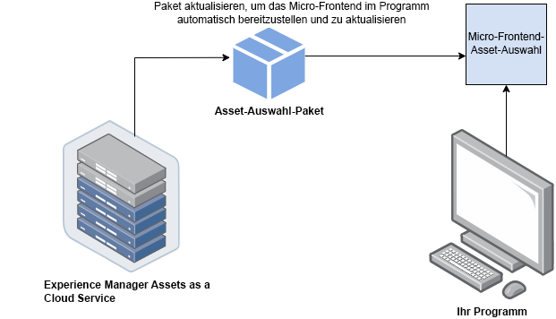
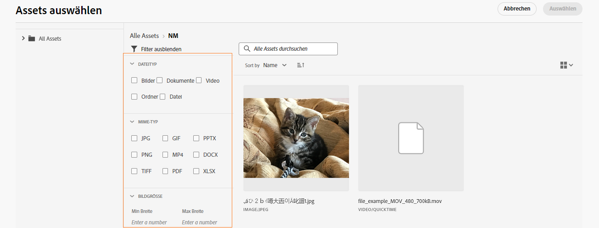

# Micro-Frontend-Asset-Wähler {#Overview}

<table>
    <tr>
        <td>
            <sup style= "background-color:#008000; color:#FFFFFF; font-weight:bold"><i>Neu</i></sup> <a href="/help/assets/dynamic-media/dm-prime-ultimate.md"><b>Dynamic Media Prime und Ultimate</b></a>
        </td>
        <td>
            <sup style= "background-color:#008000; color:#FFFFFF; font-weight:bold"><i>Neu</i></sup> <a href="/help/assets/assets-ultimate-overview.md"><b>AEM Assets Ultimate</b></a>
        </td>
        <td>
            <sup style= "background-color:#008000; color:#FFFFFF; font-weight:bold"><i>Neu</i></sup> <a href="/help/assets/integrate-aem-assets-edge-delivery-services.md"><b>AEM Assets-Integration mit Edge Delivery Services</b></a>
        </td>
        <td>
            <sup style= "background-color:#008000; color:#FFFFFF; font-weight:bold"><i>Neu</i></sup> <a href="/help/assets/aem-assets-view-ui-extensibility.md"><b>Erweiterbarkeit der Benutzeroberfläche</b></a>
        </td>
          <td>
            <sup style= "background-color:#008000; color:#FFFFFF; font-weight:bold"><i>Neu</i></sup> <a href="/help/assets/dynamic-media/enable-dynamic-media-prime-and-ultimate.md"><b>Aktivieren von Dynamic Media Prime und Ultimate</b></a>
        </td>
    </tr>
    <tr>
        <td>
            <a href="/help/assets/search-best-practices.md"><b>Best Practices für die Suche</b></a>
        </td>
        <td>
            <a href="/help/assets/metadata-best-practices.md"><b>Best Practices für Metadaten</b></a>
        </td>
        <td>
            <a href="/help/assets/product-overview.md"><b>Content Hub</b></a>
        </td>
        <td>
            <a href="/help/assets/dynamic-media-open-apis-overview.md"><b>Dynamic Media mit OpenAPI-Funktionen</b></a>
        </td>
        <td>
            <a href="https://developer.adobe.com/experience-cloud/experience-manager-apis/"><b>Entwicklerdokumentation zu AEM Assets</b></a>
        </td>
    </tr>
</table>

Der Micro-Front-End-Asset-Selektor bietet eine Benutzeroberfläche, die sich problemlos in das [!DNL Experience Manager Assets]-Repository integrieren lässt, sodass Sie die im Repository verfügbaren digitalen Assets durchsuchen und für die Erstellung von Applikationen verwenden können.

Die Micro-Front-End-Benutzeroberfläche wird über das Asset-Selektor-Paket in Ihrer Applikation verfügbar gemacht. Alle Aktualisierungen des Pakets werden automatisch importiert, und der zuletzt bereitgestellte Asset-Selektor wird automatisch in Ihrer Applikation geladen.



Der Asset-Selektor bietet viele Vorteile, z. B.:

* Einfache Integration in [Adobe](/help/assets/integrate-asset-selector-adobe-app.md)- oder [Adobe-fremde](/help/assets/integrate-asset-selector-non-adobe-app.md) Anwendungen unter Verwendung der Vanilla JavaScript-Bibliothek.
* Einfach zu verwalten, da Aktualisierungen des Assets-Wähler-Pakets automatisch für den Asset-Selektor bereitgestellt werden, der für Ihre Applikation verfügbar ist. Es sind keine Aktualisierungen innerhalb Ihrer Applikation erforderlich, um die neuesten Änderungen zu laden.
* Einfachere Anpassung, da Eigenschaften verfügbar sind, die die Anzeige des Asset-Selektors in Ihrer Applikation steuern.
* Volltextsuche, vordefinierte und benutzerdefinierte Filter, um schnell zu Assets zu navigieren, die für das Authoring-Erlebnis verwendet werden können.
* Möglichkeit, innerhalb einer IMS-Organisation zur Asset-Auswahl zwischen Repositorys zu wechseln.
* Möglichkeit, Assets nach Namen, Abmessungen und Größe zu sortieren und in der Listen-, Raster-, Galerie- oder Wasserfallansicht anzuzeigen.

<!--Perform the following tasks to integrate and use Asset Selector with your [!DNL Experience Manager Assets] repository:

1. [Install Asset Selector](#installation)
2. [Integrate Asset Selector using Vanilla JS](#integration-using-vanilla-js)
3. [Use Asset Selector](#using-asset-selector)
-->

<!--
## Setting up Asset Selector {#asset-selector-setup}


-->

## Voraussetzungen{#prereqs}

Sie müssen die folgenden Kommunikationsmethoden sicherstellen:

* Die Host-Anwendung wird unter HTTPS ausgeführt.
* Sie können die Anwendung nicht auf `localhost` ausführen. Wenn Sie den Asset-Wähler auf Ihrem lokalen Computer integrieren möchten, müssen Sie eine benutzerdefinierte Domain erstellen, z. B. `[https://<your_campany>.localhost.com:<port_number>]`, und diese benutzerdefinierte Domain in der `redirectUrl list` hinzufügen.
* Sie können die Client-ID konfigurieren und der AEM Cloud Service-Umgebungsvariablen mit den entsprechenden `imsClientId` hinzufügen.
<!--* You can configure and add `ADOBE_PROVIDED_CLIENT_ID` into the AEM Cloud Service environment variable with the respective `imsClientId`.
-->
* Die Liste der IMS-Bereiche muss in der Umgebungskonfiguration definiert werden.
* Die URL der Anwendung befindet sich in der Zulassungsliste der Umleitungs-URLs des IMS-Clients.
* Der IMS-Anmeldefluss wird mithilfe eines Popup-Fensters im Webbrowser konfiguriert und gerendert. Daher sollten Popup-Fenster im Ziel-Browser aktiviert oder zugelassen werden.

Die oben genannten Voraussetzungen müssen erfüllt sein, wenn Sie einen IMS-Authentifizierungs-Workflow des Asset-Wählers benötigen. Wenn Sie bereits mit dem IMS-Workflow authentifiziert sind, können Sie stattdessen die IMS-Informationen hinzufügen.

**Mehr anzeigen**

* [Integrieren des Asset-Wählers in eine Adobe-Anwendung](/help/assets/integrate-asset-selector-adobe-app.md)
* [Integrieren des Asset-Wählers in eine Adobe-fremde Anwendung](/help/assets/integrate-asset-selector-non-adobe-app.md)
* [Integrieren des Asset-Wählers in Dynamic Media-OpenAPIs](/help/assets/integrate-asset-selector-dynamic-media-open-api.md)


>[!IMPORTANT]
>
> Dieses Repository dient als zusätzliche Dokumentation, die die verfügbaren APIs und Anwendungsbeispiele für die Integration des Asset-Wählers beschreibt. Bevor Sie versuchen, den Asset-Wähler zu installieren oder zu verwenden, stellen Sie sicher, dass Ihr Unternehmen Zugriff auf den Asset-Wähler im Experience Manager Assets as a Cloud Service-Profil erhalten hat. Wenn diese Komponenten noch nicht bereitgestellt wurden, können Sie sie weder integrieren noch verwenden. Um die Bereitstellung anzufordern, sollten Ihre Programm-Admins ein Support-Ticket erstellen, das von der Admin Console als P2 gekennzeichnet ist, und die folgenden Informationen einschließen:
>
>* Domain-Namen, auf denen die integrierende Anwendung gehostet wird.
>* Nach der Bereitstellung wird Ihrem Unternehmen entsprechend den angeforderten Umgebungen, die für die Konfiguration des Asset-Wählers erforderlich sind, `imsClientId`, `imsScope` und eine `redirectUrl` bereitgestellt. Ohne diese gültigen Eigenschaften können Sie die Installationsschritte nicht ausführen.

## Installation {#installation}

Der Asset-Wähler ist sowohl über die ESM CDN-Version (z. B. [esm.sh](https://esm.sh/)/[skypack](https://www.skypack.dev/)) als auch über die [UMD](https://github.com/umdjs/umd)-Version verfügbar.

In Browsern mit **UMD-Version** (empfohlen):

```
<script src="https://experience.adobe.com/solutions/CQ-assets-selectors/static-assets/resources/assets-selectors.js"></script>

<script>
  const { renderAssetSelector } = PureJSSelectors;
</script>
```

In Browsern mit `import maps`-Unterstützung mit **ESM CDN-Version**:

```
<script type="module">
  import { AssetSelector } from 'https://experience.adobe.com/solutions/CQ-assets-selectors/static-assets/resources/@assets/selectors/index.js'
</script>
```

In der Deno/Webpack Module Federation mit **ESM CDN-Version**:

```
import { AssetSelector } from 'https://experience.adobe.com/solutions/CQ-assets-selectors/static-assets/resources/@assets/selectors/index.js'
```

## Verwenden des Asset-Selektors {#using-asset-selector}

Sobald der Asset-Selektor eingerichtet ist und Sie für die Verwendung mit Ihrem [!DNL Adobe Experience Manager] als [!DNL Cloud Service]-Applikation authentifiziert sind, können Sie Assets auswählen oder verschiedene andere Vorgänge durchführen, um Ihre Assets im Repository zu suchen.


* **A**: [Bedienfeld aus-/einblenden](#hide-show-panel)
* **B**: [Repository-Umschalter](#repository-switcher)
* **C**: [Assets](#repository)
* **D**: [Filter](#filters)
* **E**: [Suchleiste](#search-bar)
* **F**: [Sortierung](#sorting)
* **G**: [Sortierung nach auf- oder absteigender Reihenfolge](#sorting)
* **H**: [Ansicht](#types-of-view)

### Panel zum Aus-/Einblenden {#hide-show-panel}

Um Ordner im linken Navigationsbereich auszublenden, klicken Sie auf das Symbol **[!UICONTROL Ordner ausblenden]**. Um die Änderungen rückgängig zu machen, klicken Sie erneut auf das Symbol **[!UICONTROL Ordner ausblenden]**.

### Repository-Umschalter {#repository-switcher}

Mit dem Asset-Selektor können Sie auch Repositorys für die Asset-Auswahl wechseln. Sie können das gewünschte Repository aus der Dropdown-Liste im linken Bedienfeld auswählen. Die in der Dropdown-Liste verfügbaren Repository-Optionen basieren auf der `repositoryId`-Eigenschaft, die in der `index.html`-Datei definiert ist. Sie basiert auf der Umgebung der ausgewählten IMS-Organisation, auf die die angemeldeten Benutzenden zugreifen können. Nutzerinnen und Nutzer können eine bevorzugte `repositoryID` übergeben. In diesem Fall stoppt der Asset-Selektor das Rendern des Repository-Umschalters und rendert Assets nur aus dem angegebenen Repository.

### Assets-Repository

Es handelt sich um eine Sammlung von Asset-Ordnern, mit denen Sie Vorgänge durchführen können.

### Vorkonfigurierte Filter {#filters}

Der Asset-Selektor bietet außerdem vordefinierte Filteroptionen, mit denen Sie Ihre Suchergebnisse verfeinern können. Die folgenden Filter sind verfügbar:

* **[!UICONTROL Status]:** enthält den aktuellen Status des Assets, entweder `all`, `approved`, `rejected` oder `no status`.
* **[!UICONTROL Dateityp]:** enthält `folder`, `file`, `images`, `documents` oder `video`.
* **[!UICONTROL Ablaufstatus]:** erwähnt die Assets basierend auf ihrer Gültigkeitsdauer. Sie können entweder das Kontrollkästchen `[!UICONTROL Expired]` aktivieren, um abgelaufene Assets zu filtern, oder `[!UICONTROL Expiration Duration]` eines Assets so einstellen, dass Assets basierend auf ihrer Ablaufdauer angezeigt werden. Wenn ein Asset bereits abgelaufen ist oder kurz vor seinem Ablauf steht, wird ein Zeichen angezeigt, das darauf hinweist. Darüber hinaus können Sie steuern, ob Sie die Verwendung (oder das Ziehen per Drag-and-Drop) eines abgelaufenen Assets zulassen möchten. Weitere Informationen zum [Anpassen abgelaufener Assets](/help/assets/asset-selector-customization.md#customize-expired-assets). Standardmäßig wird für Assets, die in den nächsten 30 Tagen ablaufen, das Zeichen **Läuft bald ab** angezeigt. Sie können die Gültigkeitsdauer jedoch mit der Eigenschaft `expirationDate` konfigurieren.

  >[!TIP]
  >
  > Wenn Sie Assets anhand ihres künftigen Ablaufdatums anzeigen oder filtern möchten, geben Sie den künftigen Datumsbereich im Feld `[!UICONTROL Expiration Duration]` an. Es werden die Assets mit dem Zeichen **Läuft bald ab** angezeigt.

* **[!UICONTROL MIME-Typ]:** enthält `JPG`, `GIF`, `PPTX`, `PNG`, `MP4`, `DOCX`, `TIFF`, `PDF`, `XLSX`.
* **[!UICONTROL Bildgröße]:**: umfasst minimale/maximale Breite, minimale/maximale Höhe des Bildes.

  

### Benutzerdefinierte Suche

Neben der Volltextsuche ermöglicht der Asset-Selektor die Suche nach Assets innerhalb von Dateien mithilfe einer benutzerdefinierten Suche. Sie können benutzerdefinierte Suchfilter sowohl im Modal- als auch im Leistenansichtsmodus verwenden.


Sie können auch einen Standardsuchfilter erstellen, um die häufig gesuchten Felder zu speichern, sodass Sie sie später verwenden können. Um eine benutzerdefinierte Suche für Ihre Assets zu erstellen, können Sie die `filterSchema`-Eigenschaft verwenden.

### Suchleiste {#search-bar}

Mit dem Asset-Wähler können Sie eine Volltextsuche nach Assets im ausgewählten Repository durchführen. Wenn Sie zum Beispiel den Suchbegriff `wave` in die Suchleiste eingeben, werden alle Assets angezeigt, die den Suchbegriff `wave` in einer der Metadateneigenschaften enthalten.

### Sortierung {#sorting}

Sie können Assets im Asset-Selektor nach Namen, Abmessungen oder Größe eines Assets sortieren. Sie können die Assets auch in auf- oder absteigender Reihenfolge sortieren.

### Ansichtstypen {#types-of-view}

Mit dem Asset-Selektor können Sie das Asset in vier verschiedenen Ansichten anzeigen:

*  [!UICONTROL **Listenansicht**]: Die Listenansicht zeigt scrollbare Dateien und Ordner in einer Spalte an.
*  [!UICONTROL **Rasteransicht**]: Die Rasteransicht zeigt scrollbare Dateien und Ordner in einem Raster aus Zeilen und Spalten an.
*  [!UICONTROL **Galerieansicht**]: Die Galerie-Ansicht zeigt Dateien oder Ordner in einer zentrierten, horizontalen Liste an.
*  [!UICONTROL **Wasserfallansicht**]: Die Wasserfallansicht zeigt Dateien oder Ordner in Form einer Brücke an.

## Weitere Informationen zu wichtigen Funktionen {#key-capabilities-asset-selector}

<table>
<tr>
    <td>
        <br/>
<a href="integrate-asset-selector.md">Integrieren des Asset-Wählers</a>
        <p>
        <em>Erfahren Sie mehr über verschiedene Funktionen zur Integration des Asset-Wählers in zahlreiche Anwendungen.
        </p>
     </td>
    <td>
        <br/>
<a href="integrate-asset-selector.md">Integrieren des Asset-Wählers in Adobe-Anwendungen</a>
        <p>
        <em>Entdecken Sie, wie Sie den Asset-Wähler in verschiedene Adobe-Anwendungen integrieren können.</em>
        </p>
    </td>
    <td>
        <br/>
<a href="integrate-asset-selector.md">Integrieren des Asset-Wählers in Anwendungen von Drittanbietern</a>
        <p>
        <em>Entdecken Sie die Funktionen zum Integrieren des Asset-Wählers in Adobe-fremde Anwendungen.</em>
        </p>
    </td>
    <td>
        <br/>
<a href="integrate-asset-selector.md">Integrieren des Asset-Wählers in Dynamic Media-OpenAPIs</a>
        <p>
        <em>Erfahren Sie, wie Sie den Asset-Wähler in Dynamic Media-OpenAPIs integrieren.</em>
        </p>
     </td>
     <td>
        <br/>
<a href="asset-selector-customization.md">Eigenschaften des Asset-Wählers</a>
        <p>
        <em>Erfahren Sie mehr über die Grundlagen zum Anpassen verschiedener Komponenten des Asset-Wählers, wie Filter, Auswahl von Assets und abgelaufene Assets. </em>
        </p>
    </td>
</tr>
<tr>
    <td>
        <br/>
<a href="asset-selector-customization.md">Beispiele für den Asset-Wähler</a>
        <p>
        <em>Lernen Sie, die Verwendung von Eigenschaften auf praktische Weise zu verstehen. </em>
        </p>
    </td>
    <td>
        <br/>
<a href="asset-selector-customization.md">Anpassungen des Asset-Wählers</a>
        <p>
        <em>Konfigurieren und passen Sie verschiedene Komponenten des Asset-Wählers basierend auf Ihrer Benutzerfreundlichkeit an. </em>
        </p>
    </td>
    <td>
        <br/>
<a href="asset-selector-upload.md">Hochladen in den Asset-Wähler</a>
        <p>
        <em>Erfahren Sie, wie Sie Dateien oder Ordner aus Ihrem lokalen Dateisystem oder aus einem Dateisystem von Drittanbietern in den Asset-Wähler hochladen können. </em>
        </p>
    </td>
     <td>
        <br/>
<a href="asset-selector-collections.md">Sammlungen des Asset-Wählers</a>
        <p>
        <em>Erfahren Sie, wie Sie Sammlungen im Asset-Wähler mithilfe des Experience Manager-Repositorys verwenden. </em>
        </p>
    </td>
    <td>
    </td>
</tr>
</table>

>[!MORELIKETHIS]
>
>* [Anpassungen des Asset-Wählers](/help/assets/asset-selector-customization.md)
>* [Integrieren des Asset-Wählers in verschiedene Anwendungen](/help/assets/integrate-asset-selector.md)
>* [Eigenschaften des Asset-Wählers](/help/assets/asset-selector-properties.md)
>* [Integrieren des Asset-Wählers in Dynamic Media mit OpenAPI-Funktionen](/help/assets/integrate-asset-selector-dynamic-media-open-api.md)
