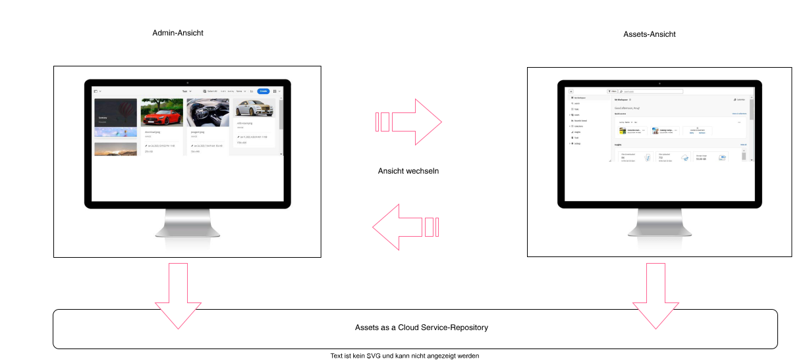

# Assets as a Cloud Service für Digital Asset Management in AEM {#assets-as-cloud-service-digital-asset-management-aem}

AEM Assets as a Cloud Service bietet eine Cloud-native PaaS-Lösung für Unternehmen, mit der sie nicht nur ihre Digital-Asset-Management- und Dynamic Media-Vorgänge ausführen, sondern auch intelligente Funktionen der nächsten Generation wie KI/ML nutzen können. Dies alles innerhalb eines Systems, das immer aktuell, verfügbar und lernbereit ist.

Adobe bietet robuste DAM-Lösungen (Digital Asset Management), mit denen Sie Ihre digitalen Assets optimal nutzen können. Adobe Experience Manager Assets verfügt je nach Ihren Anforderungen über zwei separate Erlebnisse, die dasselbe Cloud Services-Repository verwenden: Informationen zu Persona-basierten Erlebnissen für AEM Assets finden Sie unter [Verfügbare Persona-basierte Erlebnisse für Digital Asset Management](#persona-based-experiences).

Informationen zu den Angeboten von AEM Assets Ultimate und AEM Assets Prime finden Sie unter [Assets as a Cloud Service Ultimate](/help/assets/assets-ultimate-overview.md) und [Assets as a Cloud Service Prime](/help/assets/assets-prime.md).

Zu den wichtigsten Funktionen von Adobe Digital Asset Management gehören:

>[!BEGINTABS]

>[!TAB Asset-Aufnahme]

## Asset-Aufnahme {#asset-ingestion}

Verwenden Sie die Massenimportfunktion, um eine große Anzahl von Assets direkt aus einer Datenquelle wie Azure, AWS, Google Cloud, Dropbox und OneDrive in Assets as a Cloud Service zu importieren.

Sie können den Massenimportvorgang in der Admin- oder Assets-Ansicht durchführen. Die Assets-Ansicht bietet mehr Datenquellenoptionen als die Admin-Ansicht.

Zusätzlich zur Webbrowser-Benutzeroberfläche unterstützt Experience Manager auch andere Clients auf dem Desktop. Sie bieten außerdem ein Upload-Erlebnis, ohne dass der Browser aufgerufen werden muss.

* Adobe Asset Link bietet Zugriff auf Assets aus Experience Manager in den Desktop-Anwendungen von Adobe Photoshop, Adobe Illustrator und Adobe InDesign. Sie können das geöffnete Dokument in Experience Manager hochladen. Sie können dies direkt über die Adobe Asset Link-Oberfläche in diesen Desktop-Programmen tun.

* Die Experience Manager-Desktop-Anwendung vereinfacht die Arbeit mit Assets auf dem Desktop, unabhängig vom Dateityp oder der nativen Anwendung, die diese verarbeitet. Es ist sinnvoll, Dateien in verschachtelten Ordnerhierarchien aus Ihrem lokalen Dateisystem hochzuladen, da der Browser-Upload nur das Hochladen flacher Dateilisten unterstützt.

Verwenden Sie diese Links, um auf eine detaillierte Dokumentation zu diesen Tools zur Asset-Aufnahme zuzugreifen:

<table>
<td>
   
   

      <a href="/help/assets/bulk-import-assets-view.md">
      <strong>Verwenden des Tools für den Massenimport</strong>
      </a>
   

   

      <em>Erfahren Sie, wie Sie eine große Anzahl von Assets direkt aus einer Datenquelle importieren.</em>
   

</td>

<td>
   
   

      <a href="https://experienceleague.adobe.com/de/docs/experience-manager-desktop-app/using/get-started">
      <strong>Verwenden der Desktop-Anwendung von AEM</strong>
      </a>
   

   

      <em>Erfahren Sie, wie Sie mit der Desktop-Anwendung von AEM Dateien in verschachtelten Ordnerhierarchien aus Ihrem lokalen Dateisystem hochladen.</em>
   

</td>
<td>
   
   

      <a href="https://helpx.adobe.com/de/enterprise/using/adobe-asset-link.html">
      <strong>Verwenden von Adobe Asset Link</strong>
      </a>
   

   

      <em>Erfahren Sie, wie Sie Assets mithilfe von Creative Cloud-Programmen nach Experience Manager hochladen.</em>
   

</td>
</table>

>[!TAB KI-gestützte Funktionen]

**Smart-Tags**: Smart-Tags verwenden das KI-Framework von Adobe AI, um den Bilderkennungsalgorithmus auf Ihre Tag-Struktur und Ihre Unternehmenstaxonomie zu trainieren. Diese Content-Intelligenz wird dann verwendet, um relevante Tags auf einen anderen Satz von Assets anzuwenden. AEM wendet standardmäßig automatisch Smart-Tags auf hochgeladene Assets an.

**Intelligentes farbbasiertes Tagging und Suche**: AEM Assets verwendet Adobe AI-Funktionen, um zwischen Farben in einem Bild zu unterscheiden und diese Eigenschaften bei der Aufnahme automatisch als Tags anzuwenden. Diese Tags ermöglichen ein verbessertes Sucherlebnis, das auf der Farbkomposition des Bildes basiert.

**KI-generierte Metadaten**: AEM Assets verwendet KI zum automatischen Generieren von Metadaten, einschließlich Titel, Beschreibung und Keywords. Diese KI-generierten Felder verbessern die Genauigkeit von Metadaten und erleichtern die Suche, Kategorisierung und Empfehlung von Assets. Dieser Ansatz verbessert nicht nur die Effizienz durch die Eliminierung des manuellen Taggings, sondern stellt auch Konsistenz und Skalierbarkeit über große Mengen digitaler Inhalte hinweg sicher.

**KI-gestützte Massenumbenennung von Assets**: [Mit der Assets-Ansicht können Sie mithilfe von künstlicher Intelligenz mehrere Assets gleichzeitig umbenennen](/help/assets/bulk-rename-assets-view.md). Sie können mehrere Dateien gleichzeitig auswählen und sie alle gemeinsam umbenennen. Beispiele für dialogbasierte Prompts zum Umbenennen wären *Alle Dateienamen in &#39;meine-Datei&#39; ändern und eine inkrementelle Zahl anhängen* und *Den Dateienamen das Präfix 001, 002 usw. voranstellen und ins Englische übersetzen*.

<table>
<td>
   
   

      <a href="/help/assets/smart-tags.md">
      <strong>Hinzufügen von KI-Smart-Tags zu Assets</strong>
      </a>
   

   

      <em>Erfahren Sie, wie Sie Smart-Tags automatisch auf hochgeladene Assets anwenden.</em>
   

</td>

<td>
   
   

      <a href="/help/assets/manage-notifications-assets-view.md">
      <strong>Hinzufügen intelligenter farbbasierter Tags</strong>
      </a>
   

   

      <em>Erfahren Sie, wie Sie bei der Aufnahme automatisch farbbasierte Tags anwenden.</em>
   

</td>
<td>
   
   

      <a href="/help/assets/metadata-assets-view.md">
      <strong>KI-generierte Metadaten</strong>
      </a>
   

   

      <em>Verwenden Sie KI zum Generieren von Asset-Metadaten wie Titel und Beschreibung. </em>
   

</td>
</table>

**Kontextuelle Suche**: Mit AEM Assets können Sie nach im Repository verfügbaren Assets suchen, indem Sie Text-Prompts definieren. Experience Manager Assets wandelt diese Text-Prompts automatisch in Suchfilter um und zeigt die Suchergebnisse an. Im Bereich „Filter“ können Sie automatische Filter anzeigen und ändern, um die Suchergebnisse weiter einzugrenzen. Hier einige Beispiele für dialogbasierte Text-Prompts:

* *Bilder, die mindestens 200 px hoch und 100 px breit sind und Strand und klaren Himmel zeigen* und
* *Ich benötige Bilder von blauem Himmel mit einer Höhe von 1500 und 2500 Pixel, die im letzten Monat erstellt wurden und genehmigt und noch nicht abgelaufen sind*.

**Generieren von Assets mit Adobe Firefly in AEM**: Mit AEM Assets können Sie ein Asset mithilfe von Adobe Firefly in Echtzeit generieren, wenn Ihre Suchabfrage keine Ergebnisse zurückgibt. Anschließend können Sie in AEM Assets das generierte Bild aus der AEM Assets-Benutzeroberfläche in das AEM Assets-Repository hochladen.

**Integration mit Adobe Express**: Dank der nativen Integration von AEM Assets mit Adobe Express können Sie über die Adobe Express-Benutzeroberfläche direkt auf die in AEM Assets gespeicherten Assets zugreifen. Sie können in Express auch die künstliche Intelligenz von Adobe Firefly verwenden, um Bilder mit einfachen Text-Prompts zu generieren und sie auf der Express-Arbeitsfläche zu platzieren. Sie können dann neue oder bearbeitete Inhalte in einem AEM Assets-Repository speichern.

<table>
<td>
   
   

      <a href="/help/assets/search-assets-view.md#contextual-search">
      <strong>Kontextsuche</strong>
      </a>
   

   

      <em>Erfahren Sie, wie Sie mit einfachen Text-Prompts nach Assets suchen.</em>
   

</td>

<td>
   
   

      <a href="/help/assets/search-assets-view.md#search-firefly">
      <strong>Generieren von Assets mit Adobe Firefly</strong>
      </a>
   

   

      <em>Generieren Sie Assets in Echtzeit mit Adobe Firefly.</em>
   

</td>
<td>
   
   

      <a href="/help/assets/native-integration-adobe-express.md">
      <strong>Integration mit Adobe Express</strong>
      </a>
   

   

      <em>Verwenden von Adobe Express-KI-Funktionen in der Benutzeroberfläche von AEM Assets.</em>
   

</td>
</table>

**Intelligente Bildbearbeitung**: Die intelligente Bildbearbeitung sorgt für eine noch bessere Leistung bei der Bereitstellung von Bild-Assets, indem sie das Format und die Dateigröße eines Bildes je nach Fähigkeiten des Kunden-Browsers optimiert. Sie funktioniert mit Ihren vorhandenen Bildvorgaben und verwendet Intelligenz bei der Bereitstellung. Durch diese Intelligenz wird die Größe der Bilddateien je nach Browser und Geschwindigkeit der Netzwerkverbindung weiter reduziert. 

**Smartes Zuschneiden** Eine Adobe AI-Funktion, mit der der Fokus automatisch in einem Bild oder Video erkannt und beschnitten wird, um ihn beizubehalten. Der gewünschte Blickpunkt wird unabhängig von der Bildschirmgröße erfasst. So werden mühsame manuelle Aufgaben beseitigt und hochwertige, schnell ladende Bilder und Videos bereitgestellt, die auf jedem Gerät oder Bildschirm gut aussehen.

**KI-generierte Videountertitel**: Bei KI-generierten Videountertiteln in Adobe Dynamic Media wird künstliche Intelligenz eingesetzt, um automatisch Untertitel für Videoinhalte zu generieren. Diese Funktion soll die Barrierefreiheit und das Anwendererlebnis verbessern, indem korrekte Untertitel bereitgestellt werden. Untertitel werden aus dem Originalaudio, zusätzlichen Audiospuren oder zusätzlichen Untertiteln generiert, die auf der Seite mit den Videoeigenschaften in der Registerkarte „`Captions and Audio`“ bereitgestellt werden. Mehr als 60 Sprachen werden unterstützt. Die Untertitel können dabei vor der Veröffentlichung des Videos überprüft und in einer Vorschau angezeigt werden.
<table>
<td>
   
   

      <a href="/help/assets/dynamic-media/imaging-faq.md">
      <strong>Intelligente Bildbearbeitung</strong>
      </a>
   

   

      <em>Optimieren Sie das Format und die Dateigröße eines Bildes je nach Browser-Fähigkeiten und Netzwerkgeschwindigkeit der Benutzerinnen und Benutzer.</em>
   

</td>

<td>
   
   

      <a href="https://experienceleague.adobe.com/de/docs/experience-manager-learn/assets/dynamic-media/video/dynamic-media-smart-crop-video">
      <strong>Intelligenter Zuschnitt</strong>
      </a>
   

   

      <em>Verwenden Sie KI, um den Fokus in einem Bild oder Video automatisch zu erkennen und es so zuzuschneiden, dass er erhalten bleibt.</em>
   

</td>
<td>
   
   

      <a href="/help/assets/dynamic-media/video.md">
      <strong>KI-generierte Videountertitel</strong>
      </a>
   

   

      <em>Verwenden Sie künstliche Intelligenz, um Untertitel für Videoinhalte automatisch zu generieren. </em>
   

</td>
</table>

>[!TAB Asset-Erkennung]

## Asset-Erkennung {#asset-discovery}

Nachdem Sie Ihre Assets in AEM Assets importiert haben, kann es schwierig sein, in Ihrer riesigen Sammlung schnell die richtigen Assets zu finden.

AEM Assets bietet Funktionen, mit denen Sie schnell das richtige Asset finden können. Zu diesen Funktionen gehören KI-generiertes Tagging (Smart-Tags), benutzerdefinierte Metadaten und erweiterte Suchfunktionen.

**Metadatenverwaltung**: Metadaten sind der wichtigste Aspekt zu Beginn Ihrer Asset-Management-Journey. Sobald die Assets an die Benutzerinnen und Benutzer verteilt wurden, haben die Admins keinerlei Kontrolle mehr über die Verwaltung der Metadaten. Effektive Asset-Metadaten sorgen für bessere Suchvorgänge, was letztendlich das Ziel für jedes DAM-Tool ist.

**Metadatenformulare**: Assets as a Cloud Service bietet standardmäßig viele Standard-Metadatenfelder. Wenn Sie zusätzliche Metadatenanforderungen haben und weitere Metadatenfelder zum Hinzufügen unternehmensspezifischer Metadaten benötigen. Mit Metadatenformularen können Unternehmen auf der Seite „Details“ eines Assets benutzerdefinierte Metadatenfelder hinzufügen. Unternehmensspezifische Metadaten verbessern die Verwaltung und Erkennung der Assets. Sie können Formulare von Grund auf neu erstellen oder ein vorhandenes Formular wiederverwenden.

<table>
<td>
   
   

      <a href="/help/assets/metadata-assets-view.md">
      <strong>Verwalten von Metadaten in der Assets-Ansicht</strong>
      </a>
   

   

      <em>Erfahren Sie, wie Sie Metadaten und Metadatenformulare in der Assets-Ansicht verwalten.</em>
   

</td>

<td>
   
   

      <a href="https://experienceleaguecommunities.adobe.com/t5/adobe-experience-manager-blogs/how-to-manage-metadata-before-and-after-migrating-to-aem-assets/ba-p/744298">
      <strong>Best Practices für die Metadatenverwaltung</strong>
      </a>
   

   

      <em>Erfahren Sie, wie Sie Metadaten vor und nach der Migration Ihrer Assets zu AEM verwalten.</em>
   

</td>
<td>
   
   

      <a href="/help/assets/manage-metadata.md">
      <strong>Verwalten von Metadaten in der Admin-Ansicht</strong>
      </a>
   

   

      <em>Erfahren Sie, wie Sie Metadaten und Metadatenformulare in der Admin-Ansicht verwalten.</em>
   

</td>
</table>

**Smart-Tags**: Smart-Tags verwenden das KI-Framework von Adobe AI, um den Bilderkennungsalgorithmus auf Ihre Tag-Struktur und Ihre Unternehmenstaxonomie zu trainieren. Diese Content-Intelligenz wird dann verwendet, um relevante Tags auf einen anderen Satz von Assets anzuwenden. AEM wendet standardmäßig automatisch Smart-Tags auf hochgeladene Assets an.

**Asset-Suche**: Sobald Sie die richtigen Metadaten eingerichtet haben, können Sie mit AEM Assets anhand verschiedener Operatoren, Platzhalter, erweiterter Abfragen und benutzerdefinierter Filter suchen.

**Kontextuelle Suche**: AEM Assets bietet auch die Funktion „Kontextuelle Suche“, mit der Sie nach im Repository verfügbaren Assets suchen können, indem Sie Text-Prompts definieren. Experience Manager Assets wandelt diese Text-Prompts automatisch in Suchfilter um und zeigt die Suchergebnisse an. Im Bereich „Filter“ können Sie automatische Filter anzeigen und ändern, um die Suchergebnisse weiter einzugrenzen.

<table>
<td>
   
   

      <a href="/help/assets/smart-tags.md">
      <strong>Hinzufügen von Smart-Tags zu Assets</strong>
      </a>
   

   

      <em>Erfahren Sie, wie Sie Smart-Tags automatisch auf hochgeladene Assets anwenden.</em>
   

</td>

<td>
   
   

      <a href="/help/assets/search-assets-view.md">
      <strong>Suchen nach Assets in der Assets-Ansicht</strong>
      </a>
   

   

      <em>Erfahren Sie, wie Sie die kontextbezogene Suche und andere Suchfunktionen in der Assets-Ansicht effektiv verwenden.</em>
   

</td>
<td>
   
   

      <a href="/help/assets/search-best-practices.md">
      <strong>Best Practices für die Suche</strong>
      </a>
   

   

      <em>Lernen Sie verschiedene Szenarien kennen, die Benutzerinnen und Benutzern von AEM dabei helfen, einfache und erweiterte Suchvorgänge durchzuführen.</em>
   

</td>
</table>

>[!TAB Asset-Governance]

## Asset-Management und -Governance {#asset-management-governance}

Nachdem Sie Ihre Assets in AEM Assets hochgeladen und die Metadaten festgelegt haben, um eine bessere Auffindbarkeit zu gewährleisten, können Sie in der benutzerfreundlichen Oberfläche der Assets-Ansicht verschiedene Aufgaben zur Verwaltung digitaler Assets ausführen.

**Asset-Management-Aufgaben**: Zu den grundlegenden Aufgaben gehören die Vorgänge zum Suchen, Herunterladen, Verschieben, Kopieren, Umbenennen, Löschen, Aktualisieren und Bearbeiten.

Sie können auch Asset-Versionen verwalten, den Asset-Status festlegen und das Ablaufdatum von Assets festlegen.

**Mein Arbeitsbereich**: Die Assets-Ansicht enthält auch einen anpassbaren Arbeitsbereich, der Widgets bereitstellt. Diese Widgets bieten bequemen Zugriff auf wichtige Bereiche der Assets-Benutzeroberfläche und die relevantesten Informationen. Diese Seite ist eine zentrale Anlaufstelle, die einen Überblick über Ihre Arbeitselemente und schnellen Zugriff auf wichtige Workflows bietet.

**Content Credentials**: Eine weitere leistungsstarke Funktion, die AEM Assets unterstützt, ist Content Credentials. Die Transparenz von Inhalten, die Offenlegung von KI und die Verhinderung der Manipulation von Assets sind für Marken wichtiger denn je. Die Content Authenticity Initiative (CAI) von Adobe erstellt Tools, die mit dem technischen Standard der Coalition for Content Provenance and Authenticity (C2PA) konform sind. Content Credentials sind eine neue Art verschlüsselter, manipulationssicherer Metadaten. Sie können Betrachtende dabei unterstützen, die Herkunft von Inhalten zu verstehen und dazu beitragen, die Integrität von Marken-Assets sicherzustellen. Sie können eine breite Palette von Herkunftsdaten enthalten, die Einblicke in den Verlauf eines digitalen Assets bieten.

<table>
<td>
   
   

      <a href="/help/assets/manage-organize-assets-view.md">
      <strong>Asset-Management-Aufgaben</strong>
      </a>
   

   

      <em>Erfahren Sie, wie Sie einige grundlegende und erweiterte Asset-Management-Aufgaben ausführen.</em>
   

</td>

<td>
   
   

      <a href="/help/assets/my-workspace-assets-view.md">
      <strong>Mein Arbeitsbereich</strong>
      </a>
   

   

      <em>Erfahren Sie, wie Sie „Mein Arbeitsbereich“ verwenden, um schnell auf wichtige Bereiche der Assets-Benutzeroberfläche zuzugreifen.</em>
   

</td>
<td>
   
   

      <a href="/help/assets/content-credentials.md">
      <strong>Content Credentials</strong>
      </a>
   

   

      <em>Gewinnen Sie mit Content Credentials Erkenntnisse zum Verlauf eines digitalen Assets.</em>
   

</td>
</table>

**Sammlungen**: Mit AEM Assets können Sie Ihre Assets auch in Sammlungen organisieren. Eine Sammlung ist ein Satz von Assets, Ordnern oder sonstigen Sammlungen in der Assets-Ansicht von Adobe Experience Manager. Anhand von Sammlungen können Assets von mehreren Benutzenden gemeinsam verwendet werden. Im Gegensatz zu Ordnern kann eine Sammlung Assets von verschiedenen Speicherorten enthalten. Sie können mehrere Sammlungen für eine Benutzerin bzw. einen Benutzer freigeben. Jede Sammlung enthält Verweise auf Assets. Die referenzielle Integrität von Assets wird sammlungsübergreifend aufrechterhalten.

**Benachrichtigungen**: Mit Benachrichtigungen in der Assets-Ansicht können Sie die Vorgänge überwachen, die mit den im Repository verfügbaren Assets, Ordnern oder Sammlungen durchgeführt werden. Sie müssen den Inhalt auswählen und abonnieren, für den die Benachrichtigungen an Sie gesendet werden sollen. Sie können auch die Kategorien konfigurieren, für die die Benachrichtigungen an Sie gesendet werden.

**Erkennen doppelter Assets**: AEM Assets unterstützt auch die Erkennung doppelter Assets. Wenn eine DAM-Benutzerin oder ein DAM-Benutzer ein oder mehrere Assets hochlädt, die bereits im Repository vorhanden sind, erkennt Experience Manager das Duplikat und benachrichtigt die Benutzerin oder den Benutzer. 

<table>
<td>
   
   

      <a href="/help/assets/manage-collections-assets-view.md">
      <strong>Verwalten von Sammlungen</strong>
      </a>
   

   

      <em>Erfahren Sie, wie Sie Ihre Assets in Sammlungen organisieren, um Assets effizient freizugeben.</em>
   

</td>

<td>
   
   

      <a href="/help/assets/manage-notifications-assets-view.md">
      <strong>Benachrichtigungen festlegen</strong>
      </a>
   

   

      <em>Erfahren Sie, wie Sie Benachrichtigungen festlegen, um die Vorgänge zu überwachen, die mit Assets, Ordnern oder Sammlungen durchgeführt werden.</em>
   

</td>
<td>
   
   

      <a href="/help/assets/detect-duplicate-assets.md">
      <strong>Erkennen doppelter Assets</strong>
      </a>
   

   

      <em>Erkennen doppelter Assets, die in AEM Assets hochgeladen wurden, und Benachrichtigen der Benutzenden.</em>
   

</td>
</table>

>[!TAB Integrationen]

## Integration mit Adobe und Nicht-Adobe-Anwendungen {#integration-adobe-non-adode-apps}

AEM Assets kann nahtlos mit verschiedenen Adobe- und Nicht-Adobe-Anwendungen integriert werden. Im Folgenden finden Sie eine Zusammenfassung der verfügbaren Integrationen:

+++**Integration mit Adobe und Nicht-Adobe-Programmen**

* **Dynamic Media mit OpenAPI-Funktionen**: [Dynamic Media mit OpenAPI-Funktionen](/help/assets/dynamic-media-open-apis-overview.md) bietet einen umfassenden Satz von APIs für [Suche](/help/assets/search-assets-api.md) und [Bereitstellung](/help/assets/deliver-assets-apis.md). Dadurch können Ihre Entwickelnden die Bereitstellung von Assets ganz einfach in ihre Anwendungen integrieren. Zu den Anwendungen gehören Adobe-Anwendungen sowie Anwendungen von Drittanbietern. Eine Benutzeroberfläche für die Auswahl der Mikro-Frontend-Assets ermöglicht das Suchen und Auswählen genehmigter Assets. Die Auswahl kann mühelos in jede Anwendung integriert werden, die auf JavaScript-Frameworks wie React JS, Angular JS und Vanilla JS basiert.

* **Micro-Frontend-Asset-Auswahl**: Die Micro-Frontend-Asset-Auswahl bietet eine Benutzeroberfläche, die sich problemlos in Experience Manager Assets-Repository integrieren lässt, sodass Sie die im Repository verfügbaren digitalen Assets durchsuchen und für die Erstellung von Anwendungen verwenden können. Sie können sie dann in Ihrem Anwendungs-Authoring-Erlebnis verwenden.
Sie können die Asset-Auswahl in Anwendungen von Adobe oder von Drittanbietern integrieren.

<table>
<td>
   
   

      <a href="/help/assets/dynamic-media-open-apis-overview.md">
      <strong>Dynamic Media mit OpenAPI-Funktionen – Überblick</strong>
      </a>
   

   

      <em>Erfahren Sie mehr über die wichtigsten Vorteile und wie Sie diese aktivieren. </em>
   

</td>

<td>
   
   

      <a href="/help/assets/restrict-assets-delivery.md">
      <strong>Beschränken des Zugriffs auf Assets in Experience Manager</strong>
      </a>
   

   

      <em> Konfigurieren Sie Rollen, um den Zugriff auf genehmigte Assets zu beschränken.</em>
   

</td>
<td>
   
   

      <a href="/help/assets/overview-asset-selector.md">
      <strong>Micro-Frontend-Asset-Auswahl</strong>
      </a>
   

   

      <em>Erfahren Sie, wie Sie die Micro-Frontend-Asset-Auswahl mit einer Anwendung von Adobe oder eines Drittanbieters integrieren.</em>
   

</td>
</table>

+++

+++**Native Integration mit Adobe-Anwendungen**

* **Integration mit Adobe Workfront**: [!DNL Adobe Workfront] ist eine Work-Management-Anwendung, mit der Sie den gesamten Arbeitszyklus an einem Ort verwalten können. Die Integration von [!DNL Workfront] und [!DNL Adobe Experience Manager Assets] ermöglicht es Unternehmen, die Geschwindigkeit von Inhalten und die Zeit bis zur Markteinführung zu verbessern, indem sie Workfront und Digital Asset Management miteinander verbinden. Im Rahmen der Verwaltung ihrer Arbeit in Workfront haben Benutzer Zugriff auf die erforderlichen Dokumente und Bilder.

  Adobe bietet die  [!DNL Adobe Experience Manager Assets] native](https://experienceleague.adobe.com/de/docs/workfront/using/documents/wf-aem-integrations/wf-aem-essentials/aem-asset-integrations) [Integration [!DNL Workfront] .

* **Integration mit Figma**: Dank der nativen Integration von AEM Assets mit Figma können Sie über die Figma-Benutzeroberfläche direkt auf die in AEM Assets gespeicherten Assets zugreifen. Sie können in AEM Assets verwaltete Inhalte auf der Figma-Arbeitsfläche platzieren und dann neue oder bearbeitete Inhalte in einem AEM Assets-Repository speichern. Um auf den auf der Figma Community-Seite verfügbaren AEM Assets-Connector zuzugreifen, klicken Sie [hier](https://www.figma.com/community/plugin/1512561378275712210/adobe-experience-manager-aem-assets-connector).

* **Native Integration mit Adobe Express**: Dank der nativen Integration von AEM Assets mit Adobe Express können Sie über die Adobe Express-Benutzeroberfläche direkt auf die in AEM Assets gespeicherten Assets zugreifen. Sie können in AEM Assets verwaltete Inhalte auf der Express-Arbeitsfläche platzieren und dann neue oder bearbeitete Inhalte in einem AEM Assets-Repository speichern.

* **Verbinden von AEM Assets mit Creative Cloud**: Experience Manager Assets kann eine Verbindung zu einer Creative Cloud-Berechtigung herstellen, die in einer anderen IMS-Organisation bereitgestellt wird. Mit dieser Funktion können Sie die neuesten Creative Cloud-Integrationen in AEM Assets verwenden, einschließlich Express und Creative Cloud Libraries. Wenn Ihre Creative Cloud-Produkte und AEM Assets für verschiedene IMS-Organisationen bereitgestellt werden, können Sie eine Verbindung zu einer anderen Creative Cloud-Organisation herstellen, um integrierte Workflows zwischen den beiden Lösungen ausführen zu können.

<table>
<td>
   
   

      <a href="/help/assets/workfront-integrations.md">
      <strong>Integration mit Adobe Workfront</strong>
      </a>
   

   

      <em>Nutzen Sie die Integration mit Adobe Workfront, um den gesamten Arbeitszyklus an einem Ort zu verwalten.</em>
   

</td>
<td>
   
   

      <a href="/help/assets/manage-collections-assets-view.md">
      <strong>Integration mit Figma</strong>
      </a>
   

   

      <em>Greifen Sie über die Figma-Benutzeroberfläche auf die in AEM Assets gespeicherten Assets zu.</em>
   

</td>
<td>
   
   

      <a href="/help/assets/native-integration-adobe-express.md">
      <strong>Native integration mit Adobe Express</strong>
      </a>
   

   

      <em>Platzieren Sie in AEM Assets verfügbare Assets auf der Express-Arbeitsfläche und speichern Sie aktualisierte Assets in AEM. </em>
   

</td>

</table>

* **Integration mit Adobe Journey Optimizer**: Führen Sie Marketing- und Kreativ-Workflows mit Adobe Experience Manager Assets zusammen. Greifen Sie auf Assets as a Cloud Service zu, das nativ mit Adobe Journey Optimizer integriert ist, um digitale Assets zu speichern, zu verwalten, zu entdecken und zu verteilen. So wird ein zentrales Repository mit Assets bereitgestellt, die Sie für Ihre Nachrichten verwenden können.

* **Integration mit Commerce**: Die Integration von Adobe Experience Manager (AEM) Assets für Commerce kombiniert die leistungsstarken Funktionen von AEM as a Digital Asset Management (DAM) mit Adobe Commerce, um E-Commerce-Erlebnisse zu verbessern. Diese Funktionen werden bereitgestellt, indem Commerce-Projekte mit der leistungsstarken Asset-Management-Umgebung von AEM verbunden werden, um eine nahtlose, skalierbare und effiziente Möglichkeit zur Verwaltung und Bereitstellung von Assets in Commerce-Storefronts zu bieten.
* **Integration von AEM Assets mit dokumentbasierten Authoring-Flüssen für Edge Delivery Services**: Wenn [!DNL AEM Assets] mit Ihren dokumentbasierten Authoring-Tools wie [!DNL Microsoft Word] oder [!DNL Google Docs] integriert ist, steht in Ihrem Authoring-Tool eine Asset-Auswahl zur Verfügung. Verwenden Sie diese Asset-Auswahl, um auf [!DNL AEM Assets] zuzugreifen und genehmigte Assets in Ihren Inhalt einzufügen.
Wenn Sie bereits über eine [!DNL Edge Delivery Services]-Website verfügen, finden Sie in der [[!DNL AEM Assets] Plug-in](https://github.com/adobe-rnd/aem-assets-plugin/blob/main/README.md)-Dokumentation Informationen zur Integration von [!DNL AEM Assets] in Ihr vorhandenes [!DNL AEM]-Projekt.

* **Integration von [!DNL AEM Assets] mit [!DNL Universal Editor]-basierten Authoring-Flüssen für[!DNL Edge Delivery Services]**: Richten Sie den [!DNL Universal Editor] für die Integration mit [!DNL AEM Assets] ein. Durch diese Integration können Sie [!DNL Dynamic Media with OpenAPI capabilities] verwenden, um Assets bereitzustellen.

   * Unter [Konfiguration in  [!DNL Edge Delivery] -Site](https://developer.adobe.com/uix/docs/extension-manager/extension-developed-by-adobe/configurable-asset-picker/#configuration-in-edge-delivery-site) erfahren Sie, wie Sie im [!DNL Universal Editor] eine benutzerdefinierte Asset-Auswahlfunktion hinzufügen. Mit der benutzerdefinierten Asset-Auswahl können Sie Assets direkt in Ihren [!DNL Universal Editor] einfügen.
   * Unter [Erweiterungen – Überblick](https://developer.adobe.com/uix/docs/extension-manager/extension-developed-by-adobe/configurable-asset-picker/#extension-overview) erfahren Sie, wie Sie beim Authoring im [!DNL Universal Editor] auf [!DNL AEM Assets] zugreifen und die Assets einfügen können.

<table>
<td>
   
   

      <a href="https://experienceleague.adobe.com/de/docs/journey-optimizer/using/content-management/combine/assets">
      <strong>Integration mit Adobe Journey Optimizer</strong>
      </a>
   

   

      <em>Führen Sie Marketing- und Kreativ-Workflows mithilfe der Integration mit AJO zusammen</em>
   

</td>
<td>
   
   

      <a href="https://experienceleague.adobe.com/de/docs/commerce/aem-assets-integration/overview">
      <strong>Integration mit Commerce</strong>
      </a>
   

   

      <em>Integrieren Sie AEM Assets mit Commerce für bessere E-Commerce-Erlebnisse.</em>
   

</td>
<td>
   
   

      <a href="/help/assets/integrate-aem-assets-edge-delivery-services.md">
      <strong>Integration von AEM Assets mit EDS</strong>
      </a>
   

   

      <em>Integrieren Sie AEM Assets mit auf Dokumenten oder dem universellen Editor basierenden Authoring-Flüssen.</em>
   

</td>
</table>

+++

>[!TAB KI-Agenten]

## KI-Agenten {#ai-agents}

AEM as a Cloud Service bietet intelligente **Agenten** zur Verbesserung von Content-Management, Optimierung und Governance. Diese Agenten ermöglichen es Benutzenden, Inhalte schnell zu ermitteln, Kampagnen zu optimieren und die Compliance über digitale Assets hinweg sicherzustellen.

**Discovery Agent**

Der Discovery Agent stellt AEM-Inhalte bei Bedarf über natürliche, dialogorientierte Eingabeaufforderungen für ein optimiertes, klick- und starres Erkennungserlebnis bereit. Es durchsucht intelligent **Assets, Inhaltsfragmente und adaptives Forms**, um relevante Inhalte wie Bilder, Videos, PDFs, Artikel und Formularvorlagen bereitzustellen. Mit natürlicher Sprache können Sie suchen, ohne komplexe Abfragen zu erstellen oder Filter in der AEM Assets-Benutzeroberfläche anzuwenden. Basierend auf Ihrer Eingabeaufforderung gibt der Agent kuratierte Ergebnisse zusammen mit Asset-Metadaten und Bereitstellungs-URLs zurück, die in andere Programme eingebettet werden können.

Zu den wichtigsten Vorteilen von Discovery Agent gehören:

* **Einheitliche Inhaltserkennung:** Greifen Sie auf alle Arten von AEM-Inhalten wie Bilder, Videos, PDF-Dokumente, Artikel und Formulare über eine einzige Gesprächsoberfläche zu.
* **Schnellere Kampagnenplanung:** Schnelle Erfassung von Visualisierungen und Formularen für Marketing-Kampagnen auf E-Mail-, Web- und Social-Media-Kanälen.
* **Verbesserte Produktivität:** Reduzieren Sie den Zeitaufwand für das Durchsuchen von Repositorys oder das Filtern von Metadaten durch eine automatisierte, absichtsbasierte Suche.
* **Konsistente Nutzung von Inhalten:** Sicherstellung der Wiederverwendung freigegebener Assets und Fragmente, wodurch die Markenkonsistenz über alle Kanäle hinweg gewahrt bleibt.

**Kenntnisse:** Erkennung von Inhalten in natürlicher Sprache, Tag-basierte Asset-Erkennung, ordnerbasierte Content-Erkennung, format- und orientierungsbasierte Asset-Erkennung\
**Personas:** Kampagnen-Manager, Channel-Marketing-Experten, DAM-Bibliothekare, Agenturen und Partner\
**Zugriff:** über KI-Assistenten in AEM

**Häufige Anwendungsfälle/Beispielaufforderungen:**

* Bilder mit dem Tag „office“ im Ordner „WKND“ anzeigen.
* Listet alle veröffentlichten Inhaltsfragmente für WKND-Getränke auf.
* Formulare suchen, um sich für eine Stelle zu bewerben.
* Assets mit Person in Querformat anzeigen.

**Content Optimization Agent**

Der **Inhaltsoptimierungs-Agent** hilft beim Verfeinern und Anpassen von Assets mithilfe von Aufforderungen in natürlicher Sprache. Es kann neue Ausgabedarstellungen generieren, visuelle Elemente anpassen, Hintergründe ändern und automatisch kanalbereite Varianten erstellen. Funktioniert mit dem Discovery-Agenten und **Dynamic Media mit OpenAPI** für eine nahtlose Optimierung.

**Wichtigste Vorteile:**

* **Mühelose Asset-Umwandlung** Ändern der Größe, Scharfzeichnen, Neufärbung oder Spiegeln von Bildern.
* **Kanaloptimierte Ausgaben:** Generieren von Ausgabedarstellungen für Instagram, Webbanner und andere Marketing-Kanäle.
* **Skalierte Creative-Verbesserungen:** Anwenden von Hintergrundänderungen oder -überlagerungen für Workflows mit hohem Volumen.

**Zugriff:** über KI-Assistenten in AEM.

**Beispielaufforderungen:**

* `Create a 2000px JPEG rendition.`
* `Sharpen the image.`
* `Change background color to #ff8932.`
* `Create a rendition for an Instagram story.`

**Einschränkungen** Einige Optimierungen werden für PNG-Assets nicht unterstützt.

**Governance-Agent**

Der Governance-Agent sorgt für die Einhaltung der Vorschriften, die Markenkonsistenz und die Durchsetzung der Richtlinien für alle AEM-Inhalte. Es identifiziert Inhalte, die weder Metadaten noch Barrierefreiheit oder Unternehmensrichtlinien entsprechen.

Zu den wichtigsten Vorteilen von Governance Agent gehören:

* **Compliance Monitoring:** Erkennt Richtlinienverletzungen im Inhalt.
* **Durchsetzung von Metadaten:** Stellt sicher, dass Assets über die erforderlichen Metadaten für die Governance verfügen.
* **Markenkonsistenz:** Kennzeichnet Inhalte, die nicht den Unternehmensstandards entsprechen.

**Fähigkeiten:** Richtlinienkonformitätsprüfungen, Metadatenvalidierung, Zugänglichkeitsprüfungen, automatische Warnhinweise für Verstöße\
**Personas:** DAM-Administratoren, Compliance-Beauftragte, Brand Manager\
**Zugriff:** über AEM AI Assistant

**Häufige Anwendungsfälle/Beispielaufforderungen:**

* Validieren von Metadaten für alle Assets im WKND-Ordner.
* Identifizieren Sie Assets, denen Markenrichtlinien fehlen.
* Prüfen veröffentlichter Inhalte auf Barrierefreiheit.

<table>
<td>
   
   

      <a href="https://experienceleague.adobe.com/en/docs/experience-manager-cloud-service/content/ai-in-aem/agents/discovery/overview">
      <strong>Übersicht über den Discovery Agent</strong>
      </a>
   

   

      <em>Überblick über den Discovery Agent und seine Funktionen zur konversativen Inhaltserkennung.</em>
   

</td>

<td>
   
   

      <a href="https://experienceleague.adobe.com/en/docs/experience-manager-cloud-service/content/ai-in-aem/agents/content-optimization/overview">
      <strong>Inhaltsoptimierungs-Agent - Übersicht</strong>
      </a>
   

   

      <em>Überblick über den Inhaltsoptimierungsagenten und die unterstützten Optimierungs-Workflows.</em>
   

</td>

<td>
   
   

      <a href="https://experienceleague.adobe.com/en/docs/experience-manager-cloud-service/content/ai-in-aem/agents/governance/overview">
      <strong>Governance-Agent - Übersicht</strong>
      </a>
   

   

      <em>Überblick über den Governance Agent für die Einhaltung und Durchsetzung von Richtlinien.</em>
   

</td>
</table>

### **Zugriff auf Agenten in AEM**

Auf Agenten kann über den **KI-Assistenten** in AEM Cloud Service zugegriffen werden. Melden Sie sich bei [experience.adobe.com](https://experience.adobe.com/) an und interagieren Sie mit dem KI-Assistenten über natürliche Eingabeaufforderungen.

>[!TAB Asset-Aktivierung]

## Asset-Aktivierung {#asset-activation}

Erschließen Sie das volle Potenzial Ihrer digitalen Assets mit AEM Assets, indem Sie Content Hub und Dynamic Media einschließlich leistungsstarker OpenAPI-Funktionen verwenden. AEM Assets bietet ein umfassendes Lösungspaket, mit dem die Asset-Transformation optimiert und die Bereitstellung über verschiedene Kanäle hinweg optimiert werden kann.

+++**Content Hub**

Content Hub ist als Teil von Experience Manager Assets as a Cloud Service für die Demokratisierung des Zugriffs auf Markeninhalte für Unternehmen und ihre Geschäftspartner verfügbar. Der Schwerpunkt liegt auf der Verteilung von Assets zur skalierten Aktivierung und der Erstellung von Markeninhaltsvarianten, um die Marketing-Agilität zu verbessern.

Content Hub bietet die folgenden Hauptvorteile:

* **Suchen und Freigeben aller von der Marke genehmigten Assets in einem intuitiven Portal**: AEM Assets dient als zentrale Datenquelle, dabei sind alle genehmigten Assets automatisch in Content Hub in einer flachen Hierarchie verfügbar, um das Sucherlebnis zu verbessern.

* **Konfigurierbare Benutzeroberfläche**: Die gängigsten Eigenschaften in Content Hub, z. B. Filter für die Suche, die beim Hinzufügen oder Importieren von Assets verfügbaren Felder, Asset-Eigenschaften und Bannerinhalte für das Branding, sind konfigurierbar. Admins können die Content Hub-Benutzeroberfläche problemlos entsprechend ihren Anforderungen konfigurieren.

* **Nicht-Kreativen die Möglichkeit geben, markenkonforme Inhalte zu bearbeiten und neu zu kombinieren**: Mit Content Hub können Sie neue Inhalte mit Adobe Express erstellen (wenn Sie über Adobe Express-Berechtigungen verfügen). Sie können vorhandene Inhalte mit anwenderfreundlichen Tools bearbeiten und markenkonforme Varianten mit Vorlagen und Markenelementen sowie neue Inhalte mit den neuesten GenAI-Funktionen von Adobe Firefly erstellen.

* **Gewinnen von Erkenntnissen darüber, wie Inhalt Team-übergreifend genutzt wird**: [!DNL Content Hub] bietet wertvolle Erkenntnisse zu Assets und ermöglicht die Erstellung von Nutzungsstatistiken für Assets, die in Marketing-Kampagnen, auf Kanälen und in verschiedenen Regionen verwendet werden, was für Marketing-Stakeholder häufig eine Herausforderung darstellt. Durch das Erlangen eines klaren Verständnisses der Leistung und Beliebtheit der Assets, liefert Content Hub verwertbare Erkenntnisse, die für bessere Benutzererlebnisse unerlässlich sind.

<table>
<td>
   
   

      <a href="/help/assets/product-overview.md">
      <strong>Content Hub – Überblick</strong>
      </a>
   

   

      <em>Erfahren Sie mehr über die wichtigsten Vorteile von Content Hub und wie Sie darauf zugreifen können. </em>
   

</td>

<td>
   
   

      <a href="/help/assets/configure-content-hub-ui-options.md">
      <strong>Konfigurieren der Content Hub-Benutzeroberfläche</strong>
      </a>
   

   

      <em>Erfahren Sie, wie Sie die in der Content Hub-Benutzeroberfläche verfügbaren Optionen konfigurieren.</em>
   

</td>
<td>
   
   

      <a href="/help/assets/edit-images-content-hub.md">
      <strong>Bearbeiten  mit Adobe Express</strong>
      </a>
   

   

      <em>Erfahren Sie, wie Sie Bilder in Content Hub mit Adobe Express bearbeiten.</em>
   

</td>
</table>

+++

+++**Dynamic Media**

Mit Dynamic Media können Sie visuell ansprechende Merchandising- und Marketing-Assets nach Bedarf bereitstellen. Außerdem können Sie damit interaktive Anzeigeerlebnisse wie Zoom, Drehen um 360 Grad und Videos erstellen und bereitstellen. Ihre Assets werden für die Verwendung auf Web-, Mobile- und Social-Media-Websites dynamisch skaliert. Mit einer Reihe von Assets aus Primärquellen – wie Bildern, Videos und 3D – generiert und liefert Dynamic Media mehrere Varianten dieser vielfältigen Inhalte in Echtzeit über sein globales, skalierbares, leistungsoptimiertes Content Delivery Network (CDN).

Dynamic Media bietet die folgenden Hauptfunktionen:

* **Intelligente Bildbearbeitung**: Die intelligente Bildbearbeitung sorgt für eine noch bessere Leistung bei der Bereitstellung von Bild-Assets, indem sie das Format und die Dateigröße eines Bildes je nach Fähigkeiten des Kunden-Browsers optimiert. Sie funktioniert mit Ihren vorhandenen Bildvorgaben und verwendet Intelligenz bei der Bereitstellung. Durch diese Intelligenz wird die Größe der Bilddateien je nach Browser und Geschwindigkeit der Netzwerkverbindung weiter reduziert. 

* **Adaptive Videosets**: Ein adaptives Videoset gruppiert Versionen desselben Videos, die mit unterschiedlichen Bitraten und Formaten kodiert sind. Sie beginnen mit Ihrem ursprünglichen, primären Video, das Sie in das System hochladen. Dynamic Media skaliert bzw. transkodiert dieses Video automatisch in mehrere Videos. Zum Zeitpunkt der Bereitstellung wird dann auf intelligente Weise bestimmt, welcher Videobildschirm, welche Qualität und welches Format verwendet werden sollen, und die Daten werden entweder an das Smartphone, das Tablet oder den Desktop-Computer übertragen.

* **Smartes Zuschneiden** Eine Adobe AI-Funktion, mit der der Fokus in einem Bild oder Video automatisch erkannt und beschnitten wird, um ihn beizubehalten. Der gewünschte Blickpunkt wird unabhängig von der Bildschirmgröße erfasst. So werden mühsame manuelle Aufgaben beseitigt und hochwertige, schnell ladende Bilder und Videos bereitgestellt, die auf jedem Gerät oder Bildschirm gut aussehen.

* **Dynamic Media-Vorlagen**: Erstellen Sie in Echtzeit anpassbare Vorlagen für Ihre Banner und Flyer mit Vorlagen in Dynamic Media, einem WYSIWYG-Vorlageneditor. Veröffentlichen Sie Ihre Dynamic Media-Vorlage und verwenden Sie sie in nachgelagerten Anwendungen. Eine Dynamic Media-Vorlage enthält Bild- und Textebenen. Fügen Sie den Bild- und Textebenen der Vorlage Parameter hinzu und verwenden Sie Dynamic Media-URLs, um die Ebene neu zu positionieren, ihre Größe zu ändern und ihren Inhalt in Echtzeit zu aktualisieren.

* **Merhfach-Audio und -Untertitel**: Fügen Sie mehrere Untertitel und Audiospuren in ein primäres Video ein. Diese Funktion bedeutet, dass Ihre Videos für eine globale Zielgruppe zugänglich sind. Sie können ein einzelnes veröffentlichtes primäres Video für eine globale Zielgruppe in mehreren Sprachen anpassen und die Richtlinien zur Barrierefreiheit für verschiedene geografische Regionen einhalten. Autorinnen und Autoren können die Untertitel und Audiospuren auch über eine einzige Registerkarte in der Benutzeroberfläche verwalten.

* **Unterstützung von dynamischem adaptivem Streaming über HTTP (DASH)**: Dynamic Media unterstützt adaptives Streaming bei der Dynamic Media-Videobereitstellung (mit aktiviertem CMAF), wodurch eine bessere Benutzerfreundlichkeit bei der Videoanzeige gewährleistet ist. DASH ist das internationale Standardprotokoll für adaptives Video-Streaming und wird in der Branche weitläufig verwendet.

* **KI-generierten Videountertitel**: Bei KI-generierten Videountertiteln in Adobe Dynamic Media wird künstliche Intelligenz eingesetzt, um automatisch Untertitel für Videoinhalte zu generieren. Mehr als 60 Sprachen werden unterstützt. Die Untertitel können dabei vor der Veröffentlichung des Videos überprüft und in einer Vorschau angezeigt werden.

Informationen zu den verfügbaren Dynamic Media-Angeboten finden Sie unter [Dynamic Media Prime und Ultimate](/help/assets/dynamic-media/dm-prime-ultimate.md).

<table>
<td>
   
   

      <a href="/help/assets/dynamic-media/dynamic-media.md">
      <strong>Arbeiten mit Dynamic Media</strong>
      </a>
   

   

      <em>Erfahren Sie, wie Sie Assets für den Gebrauch im Web, in Mobile Apps und in Social Media bereitstellen. </em>
   

</td>

<td>
   
   

      <a href="/help/assets/dynamic-media/dm-journey-part1.md">
      <strong>Dynamic Media-Journey</strong>
      </a>
   

   

      <em>Erfahren Sie, wie Ihre Arbeit von Dynamic Media profitiert.</em>
   

</td>
<td>
   
   

      <a href="/help/assets/dynamic-media/dm-best-practices.md">
      <strong>Best Practices für Dynamic Media</strong>
      </a>
   

   

      <em>Best Practices beim Arbeiten mit Bildern, Videos und Viewern.</em>
   

</td>
</table>

+++

+++**Dynamic Media mit OpenAPI-Funktionen**

In der modernen digitalen Welt ist die Erschließung des vollen Potenzials der digitalen Assets Ihrer Marke von entscheidender Bedeutung, um den Wettbewerb anzuführen. Eine ganzheitliche Digital Assets Management(DAM)-Lösung erleichtert die Governance von Assets, fördert die Markenkonsistenz und beschleunigt die Bereitstellung von Inhalten bei gleichzeitiger Gewährleistung von Markenintegrität und außergewöhnlichen Kundenerlebnissen.

Dynamic Media mit OpenAPI-Funktionen stellt das DAM in den Mittelpunkt eines agilen und effizienten Content-Lieferkettenökosystems, um die Governance und Bereitstellung von Assets sicherzustellen.

Dynamic Media mit OpenAPI-Funktionen bietet die folgenden wichtigen Vorteile:

* **Nahtlose Integrationen**: Dynamic Media mit OpenAPI-Funktionen bietet einen umfassenden Satz von Such- und Bereitstellungs-APIs. Dadurch können Ihre Entwickelnden die [Bereitstellung von Assets ganz einfach in ihre Anwendungen integrieren](/help/assets/integrate-dynamic-media-open-apis.md). Zu den Anwendungen gehören Adobe-Anwendungen sowie Anwendungen von Drittanbietern. Es bietet eine [Benutzeroberfläche für die Auswahl der Mikro-Frontend-Assets](/help/assets/overview-asset-selector.md) zum Suchen und Auswählen genehmigter Assets. Die Auswahl kann mühelos in jede Anwendung integriert werden, die auf JavaScript-Frameworks wie React JS, Angular JS und Vanilla JS basiert.

* **Zentralisierte Verwaltung digitaler Assets**: DAM ist die zentrale Datenquelle für alle digitalen Assets. Ihre digitalen Assets werden zentral in AEM Assets verwaltet und verarbeitenden Anwendungen durch Verweise über Bereitstellungs-URLs bereitgestellt, ohne Asset-Binärdateien zu kopieren.

* **Echtzeit-Aktualisierungen**: Alle Änderungen an genehmigten Assets in DAM, einschließlich Versionsaktualisierungen und Metadatenänderungen, werden automatisch in die Bereitstellungs-URLs übernommen. Mit einem niedrigen Time-to-Live(TTL)-Wert von 10 Minuten für die Dynamic Media mit OpenAPI-Funktion per CDN werden Aktualisierungen in weniger als 10 Minuten in allen Authoring- und Publishing-Oberflächen sichtbar.

* **Markenkonsistenz**: Nur [markenkonforme Assets](/help/assets/approve-assets.md) werden nachgelagerten Anwendungen offengelegt. [Markenverantwortliche und Marketing-Fachleute behalten die strenge Kontrolle über Marken-Assets](/help/assets/restrict-assets-delivery.md). Es können nur genehmigte und neueste Versionen des Assets verwendet werden. Dadurch wird die Markenkonsistenz in allen Kanälen und Anwendungen sichergestellt.

* **Web-optimierte Bereitstellung**: Digitale Assets werden in Web-optimierten Formaten bereitgestellt, um die Core Web Vitals Ihrer digitalen Erlebnisse zu verbessern. Zu dieser Optimierung zählen die Unterstützung von WebP-Ausgabedarstellungen für Bilder, das adaptive Streaming über HLS- oder DASH-Protokolle für Videos und Original-Ausgabedarstellungen für Dokumente.

* **Dynamische Asset-Transformation**: Das System ermöglicht die direkte Bildumwandlung mithilfe von URL-Parametern, die als Bildmodifikatoren bezeichnet werden. [Zum Beispiel Breite, Höhe, Drehung, Spiegelung, Qualität, Zuschnitt, Format und intelligenter Zuschnitt](/help/assets/deliver-assets-apis.md). Umgewandelte Ausgabedarstellungen werden dynamisch generiert und nahtlos über das CDN bereitgestellt.

* **Sichere Bereitstellung von Assets**: Dynamic Media mit OpenAPI-Funktionen bietet einen Mechanismus zur Steuerung des Zugriffs auf Ihre digitalen Assets. Sie können Benutzerrollen oder Gruppen als Metadaten für zu sichernde Assets angeben und einen vordefinierten Zeitraum festlegen, in dem [nur autorisierte Benutzende auf diese Assets zugreifen können](/help/assets/restrict-assets-delivery.md). Während des eingeschränkten Zeitraums werden die Bereitstellungs-URLs für gesicherte Assets für nicht autorisierte Benutzende nicht aufgelöst.

Informationen zu den verfügbaren Dynamic Media-Angeboten finden Sie unter [Dynamic Media Prime und Ultimate](/help/assets/dynamic-media/dm-prime-ultimate.md).

<table>
<td>
   
   

      <a href="/help/assets/dynamic-media-open-apis-overview.md">
      <strong>Dynamic Media mit OpenAPI-Funktionen – Überblick</strong>
      </a>
   

   

      <em>Erfahren Sie mehr über die wichtigsten Vorteile und wie Sie diese aktivieren. </em>
   

</td>

<td>
   
   

      <a href="/help/assets/restrict-assets-delivery.md">
      <strong>Beschränken des Zugriffs auf Assets in Experience Manager</strong>
      </a>
   

   

      <em> Konfigurieren Sie Rollen, um den Zugriff auf genehmigte Assets zu beschränken.</em>
   

</td>
<td>
   
   

      <a href="/help/assets/integrate-remote-approved-assets-with-sites.md">
      <strong>Integrieren der Remote-Version von AEM Assets mit AEM Sites</strong>
      </a>
   

   

      <em>Integrieren Sie die Remote-Version von AEM Assets mit AEM Sites. </em>
   

</td>
</table>

+++

>[!TAB Insights]

## Asset Insights {#asset-insights}

Das Asset-Reporting bietet Admins Einblicke in die Aktivitäten in der Ansichtsumgebung von Adobe Experience Manager Assets. Diese Daten liefern nützliche Informationen darüber, wie Benutzende mit Inhalten und dem Produkt interagieren. Alle Benutzenden können auf das Erkenntnis-Dashboard zugreifen und diejenigen, die dem Produktprofil der Admins zugewiesen sind, können benutzerdefinierte Berichte erstellen.

Sie können verschiedene Berichtstypen generieren, z. B. Upload, Download und Dynamic Media-Bereitstellung.

* **Erkenntnisse in der Assets-Ansicht**: In der Assets-Ansicht können Sie mit dem Dashboard „Erkenntnisse“ Echtzeitdaten für die Umgebung Ihrer Assets-Ansicht anzeigen. Sie können Echtzeit-Ereignismetriken während der letzten 30 Tage oder für die letzten 12 Monate anzeigen. Zu den Ereignissen gehören Downloads, Uploads, Speichernutzung, Top-Suchen, Asset-Anzahl nach Größe und Asset-Anzahl nach Asset-Typ.

* **Adobe Analytics-Integration in der Admin-Ansicht**: Mit der Funktion „Asset-Erkenntnisse“ verfolgen Sie Benutzerbewertungen und Nutzungsstatistiken von Bildern, die auf Drittanbieter-Websites, in Marketing-Kampagnen und in den Kreativlösungen von Adobe verwendet werden. Sie bietet Erkenntnisse zur Leistung und Beliebtheit der Bilder. Assets Insights hält Details zu Benutzeraktivitäten wie Anzahl der Bildbewertungen, Klickraten und Impressionen (Häufigkeit des Ladens eines Bildes auf einer Website) fest. Basierend auf diesen Statistiken werden Bildern Bewertungen zugewiesen. Sie können Bewertungs- und Leistungsstatistiken nutzen, um beliebte Bilder für Kataloge, Marketing-Kampagnen usw. auszuwählen. Sie können außerdem Richtlinien zu Archivierungen und Lizenzerneuerungen anhand dieser Statistiken formulieren. Damit Asset-Erkenntnisse Nutzungsstatistiken für Assets anzeigen kann, konfigurieren Sie zunächst die Funktion für den Abruf von Berichtsdaten aus Adobe Analytics. 

* **Content Hub-Erkenntnisse**: Content Hub bietet wertvolle Erkenntnisse zu Assets und ermöglicht die Erstellung von Nutzungsstatistiken für Assets, die in Marketing-Kampagnen, auf Kanälen und in verschiedenen Regionen verwendet werden, was für Marketing-Stakeholder häufig eine Herausforderung darstellt. Durch das Erlangen eines klaren Verständnisses der Leistung und Beliebtheit der Assets, liefert Content Hub verwertbare Erkenntnisse, die für bessere Benutzererlebnisse unerlässlich sind.

<table>
<td>
   
   

      <a href="/help/assets/manage-reports-assets-view.md">
      <strong>Verwalten von Berichten in der Assets-Ansicht</strong>
      </a>
   

   

      <em>Gewinnen Sie mit der Assets-Ansicht Erkenntnisse zu wichtigen Erfolgsmetriken. </em>
   

</td>

<td>
   
   

      <a href="/help/assets/asset-reports.md">
      <strong>Verwalten von Berichten in der Admin-Ansicht</strong>
      </a>
   

   

      <em>Erfahren Sie, wie Sie in der Admin-Ansicht integrierte Berichte in Adobe Analytics verwalten.</em>
   

</td>
<td>
   
   

      <a href="/help/assets/insights-content-hub.md">
      <strong>Asset-Erkenntnisse in Content Hub</strong>
      </a>
   

   

      <em>Erfahren Sie, wie Sie Asset-Erkenntnisse in Content Hub anzeigen.</em>
   

</td>
</table>

>[!ENDTABS]

## Verfügbare Persona-basierte Erlebnisse für Digital Asset Management {#persona-based-experiences}

Adobe bietet robuste DAM-Lösungen (Digital Asset Management), mit denen Sie Ihre digitalen Assets optimal nutzen können. Adobe Experience Manager Assets verfügt über zwei separate Erlebnisse, die dasselbe Cloud Services-Repository verwenden:

* **Admin-Ansicht**: Die bestehende Assets as a Cloud Service-Benutzeroberfläche. Verwenden Sie die Admin-Ansicht für alle erweiterten Digital Asset Management-Funktionen, einschließlich Integrationen, Workflows, Inhaltsautomatisierung, Veröffentlichung usw.

* **Assets-Ansicht**: Das einfache Asset-Management-Erlebnis von Adobe zum Speichern, Verwalten, Entdecken und Verwenden digitaler Assets. Es handelt sich um eine optimierte Benutzeroberfläche mit den wesentlichen Digital Asset Management-Funktionen. Entwickelt für Benutzerinnen und Benutzer eines einfachen DAM mit Schwerpunkt auf Upload, Metadatenverwaltung, Suche, Download und Freigabe.

Benutzerinnen und Benutzer mit Zugriff auf die Admin-Ansicht können auch auf die Asset-Ansicht zugreifen. Die vereinfachte Benutzeroberfläche der Assets-Ansicht erleichtert das Verwalten, Erkennen und Verteilen Ihrer digitalen Assets. Ein breites Spektrum von Benutzerinnen und Benutzern aus verschiedenen Funktionen, einschließlich Kreativ-, Marketing- und Branchen-Teams, kann an Assets zusammenarbeiten und auf die richtigen, genehmigten Assets zugreifen, wo und wann immer sie benötigt werden. Viele gelegentliche DAM-Benutzerinnen und -Benutzer bevorzugen die Asset-Ansicht, da sie nur eine Teilmenge der Funktionen enthält. Das Erlebnis richtet sich an Kreative, Nutzerinnen und Nutzer von schreibgeschützten Assets und einfache DAM-Benutzerinnen und -Benutzer.

DAM-Bibliothekarinnen und -Bibliothekare, -Entwicklungspersonen sowie -Superbenutzerinnen und -Superbenutzer können die Admin-Ansicht weiterhin verwenden oder bei Bedarf zwischen den Benutzeroberflächen wechseln. Sie können das Erlebnis auswählen, das für Ihre Rolle am besten geeignet ist.

Informationen zum Zugriff auf die Assets-Ansicht und einige der Vereinfachungen, die sie gegenüber der Admin-Ansicht bietet, finden Sie unter [Einführung in die Assets-Ansicht](/help/assets/assets-view-introduction.md).

## KI-Assistent in AEM

Für Kundinnen und Kunden, die die [Voraussetzungen erfüllen](/help/implementing/cloud-manager/ai-assistant-in-aem.md#get-access), steht der KI-Assistent in AEM den Benutzenden ihres Unternehmens zur Verfügung. Siehe [KI-Assistent in AEM](/help/implementing/cloud-manager/ai-assistant-in-aem.md).
