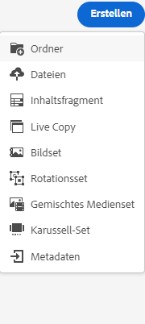
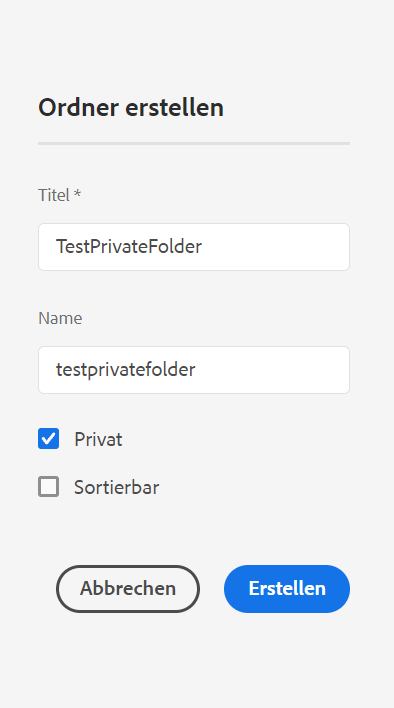
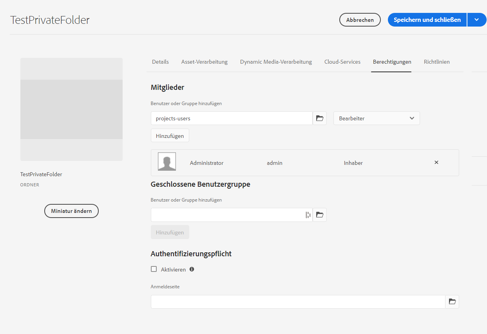
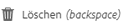

# Privater Ordner in [!DNL Adobe Experience Manager Assets] {#private-folder}

| Version | Artikel-Link |
| -------- | ---------------------------- |
| AEM 6.5 | [Hier klicken](https://experienceleague.adobe.com/docs/experience-manager-65/assets/managing/private-folder.html?lang=de) |
| AEM as a Cloud Service | Dieser Artikel |

Sie können in der Benutzeroberfläche von [!DNL Adobe Experience Manager Assets] einen privaten Ordner erstellen, der nur für Sie verfügbar ist. Sie können diesen privaten Ordner auch für andere Benutzer freigeben und diesen Benutzern verschiedene Berechtigungen zuweisen. Je nach zugewiesener Berechtigungsstufe können Benutzende verschiedene Aufgaben für den Ordner durchführen, z. B. Assets innerhalb des Ordners anzeigen oder Assets bearbeiten.

>[!NOTE]
>
>Der private Ordner hat mindestens ein Mitglied mit der Rolle „Eigentümer“.
>
>Um einen privaten Ordner zu erstellen, benötigen Sie `Read`- und `Modify`-Berechtigungen für den übergeordneten Ordner, unter dem Sie einen privaten Ordner erstellen. Wenn Sie kein Administrator sind, werden diese Berechtigungen für `/content/dam` nicht standardmäßig für Sie aktiviert. In diesem Fall brauchen Sie zunächst diese Berechtigungen für Ihre Benutzer-ID/Gruppe, bevor Sie versuchen, private Ordner zu erstellen oder Ordnereinstellungen anzuzeigen.

## Erstellen und Freigeben privater Ordner  {#create-share-private-folder}

So erstellen Sie einen privaten Ordner und geben ihn frei:

1. Klicken Sie in der [!DNL Assets]-Konsole in der Symbolleiste auf die Schaltfläche **[!UICONTROL Erstellen]** und wählen Sie dann **[!UICONTROL Ordner]** aus dem Menü aus.

   

1. Im Dialog **[!UICONTROL Ordner erstellen]** geben Sie `Title` und `Name` (optional) für den Ordner ein.

   Aktivieren Sie die Sie das Kontrollkästchen **[!UICONTROL Privat]** und klicken Sie auf **[!UICONTROL Erstellen]**.

   

   Ein privater Ordner wird erstellt. Sie können jetzt dem Ordner [Assets hinzufügen](add-assets.md#upload-assets) und den Ordner für andere Benutzer oder Gruppen freigeben. Der Ordner ist für andere Benutzer erst sichtbar, wenn Sie diesen freigeben und ihnen Berechtigungen zuweisen.

1. Um den Ordner freizugeben, wählen Sie den Ordner aus und klicken Sie in der Symbolleiste auf **[!UICONTROL Eigenschaften]**.

1. Auf der Seite **[!UICONTROL Ordnereigenschaften]** wählen Sie einen Benutzer oder eine Gruppe aus der Liste **[!UICONTROL Benutzer hinzufügen]** aus, weisen Sie eine Rolle (`Viewer`, `Editor`, oder `Owner`) in Ihrem privaten Ordner zu und klicken Sie auf **[!UICONTROL Hinzufügen]**.

   

   Sie können dem Benutzer, für den Sie den Ordner freigeben, verschiedene Rollen zuweisen, wie z.B. `Editor`, `Owner` oder `Viewer`. Wenn Sie dem Benutzer die Rolle `Owner` zuweisen, hat der Benutzer `Editor`-Berechtigungen für den Ordner. Darüber hinaus kann der Benutzer den Ordner für andere freigeben. Wenn Sie die Rolle `Editor` zuweisen, kann der Benutzer die Assets in Ihrem privaten Ordner bearbeiten. Wenn Sie die Rolle „Betrachter“ zuweisen, kann der Benutzer die Assets in Ihrem privaten Ordner lediglich anzeigen.

   >[!NOTE]
   >
   >Mindestens ein Benutzer des privaten Ordners verfügt über die Rolle `Owner`. Daher kann der Administrator nicht alle Mitglieder mit der Rolle „Eigentümer“ aus einem privaten Ordner entfernen. Um jedoch die vorhandenen Eigentümer (und den Administrator selbst) aus dem privaten Ordner zu entfernen, muss der Administrator einen anderen Benutzer als Eigentümer hinzufügen.

1. Klicken Sie auf **[!UICONTROL Speichern und schließen]**. Je nach zugewiesener Rolle erhält der Benutzer eine Reihe von Berechtigungen für den privaten Ordner, wenn er sich bei [!DNL Assets] anmeldet.
1. Klicken Sie auf **[!UICONTROL OK]**, um die Bestätigungsmeldung zu schließen.
1. Der Benutzer, für den Sie den Ordner freigeben, erhält in seiner Benutzeroberfläche eine Freigabebenachrichtigung.

1. Klicken Sie auf [!UICONTROL Benachrichtigungen], um eine Liste der Benachrichtigungen zu öffnen.

   

1. Klicken Sie auf den Eintrag für den vom Administrator freigegebenen privaten Ordner, um den Ordner zu öffnen.

## Löschen eines privaten Ordners {#delete-private-folder}

Sie können einen Ordner löschen, indem Sie ihn auswählen und die Option [!UICONTROL Löschen] auswählen oder die Rücktaste auf der Tastatur drücken.

>[!CAUTION]
>
>Wenn Sie einen privaten Ordner aus CRXDE Lite löschen, verbleiben redundante Benutzergruppen im Repository.

>[!NOTE]
>
>Wenn Sie einen Ordner mit der oben genannten Methode aus der Benutzeroberfläche löschen, werden auch die zugehörigen Benutzergruppen gelöscht.
>
>Die vorhandenen redundanten, nicht verwendeten und automatisch generierten Benutzergruppen können jedoch mithilfe der `clean`-Methode in JMX in der Autoreninstanz (`http://[server]:[port]/system/console/jmx/com.day.cq.dam.core.impl.team%3Atype%3DClean+redundant+groups+for+Assets`) entfernt werden.

**Siehe auch**

* [Assets übersetzen](translate-assets.md)
* [Assets-HTTP-API](mac-api-assets.md)
* [Von AEM Assets unterstützte Dateiformate](file-format-support.md)
* [Suchen von Assets](search-assets.md)
* [Connected Assets](use-assets-across-connected-assets-instances.md)
* [Asset-Berichte](asset-reports.md)
* [Metadatenschemata](metadata-schemas.md)
* [Herunterladen von Assets](download-assets-from-aem.md)
* [Verwalten von Metadaten](manage-metadata.md)
* [Suchfacetten](search-facets.md)
* [Verwalten von Sammlungen](manage-collections.md)
* [Massenimport von Metadaten](metadata-import-export.md)
* [Veröffentlichen von Assets in AEM und Dynamic Media](/help/assets/publish-assets-to-aem-and-dm.md)
