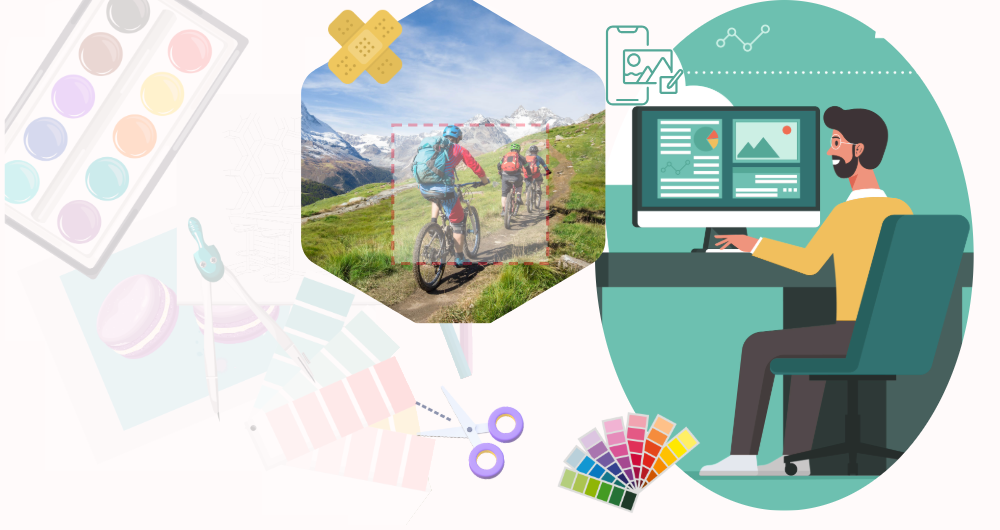

# Überblick über Content Hub {#overview-content-hub}

Content Hub ist als Teil von Experience Manager Assets as a Cloud Service für die Demokratisierung des Zugriffs auf Markeninhalte für Unternehmen und ihre Geschäftspartner verfügbar. Der Schwerpunkt liegt auf der Verteilung von Assets zur skalierten Aktivierung und der Erstellung von Markeninhaltsvarianten, um die Marketing-Agilität zu verbessern.

## Content Hub-Demo {#content-hub-demo}

>[!IMPORTANT]
>
>[Assets Ultimate](/help/assets/assets-ultimate-overview.md) und Assets as a Cloud Service umfassen 250 Content Hub Limited-Benutzende. [Assets Prime](/help/assets/assets-prime.md) umfasst 50 Content Hub Limited-Benutzende.

>[!VIDEO](https://video.tv.adobe.com/v/3463712)

## Warum Content Hub?

Content Hub bietet die folgenden Hauptvorteile:

**Suchen und Freigeben aller markenkonformen genehmigten Assets, die in einem intuitiven Portal verfügbar sind**

AEM Assets dient als zentrale Datenquelle, und alle genehmigten Assets sind in Content Hub automatisch in einer flachen Hierarchie verfügbar, um das Sucherlebnis zu verbessern.

**Konfigurierbare Benutzeroberfläche**

Die gängigsten Eigenschaften in Content Hub, z. B. Filter für die Suche, die beim Hinzufügen oder Importieren von Assets verfügbaren Felder, Asset-Eigenschaften und Bannerinhalte für das Branding, sind konfigurierbar, und Admins können die Content Hub-Benutzeroberfläche problemlos entsprechend ihren Anforderungen konfigurieren.

**Ermöglichen Sie es auch Nichtkreativen, Inhalte zu bearbeiten und neu zu mischen, während sie markenkonform bleiben**

Mit Content Hub können Sie neue Inhalte mit Adobe Express erstellen (falls Sie über Adobe Express-Berechtigungen verfügen). Sie können vorhandene Inhalte mit anwenderfreundlichen Tools bearbeiten, Markenvarianten mit Vorlagen und Markenelementen erstellen und neue Inhalte mit den neuesten GenAI-Funktionen von Adobe Firefly erstellen.

**Gewinnen Sie Einblicke in die Verwendung von Inhalten in verschiedenen Teams**

[!DNL Content Hub] bietet wertvolle Einblicke in Assets und geht eine Herausforderung an, auf die Marketing-Stakeholder häufig stoßen: Asset-Nutzungsstatistiken, die in Marketing-Kampagnen, Kanälen und verschiedenen Regionen verwendet werden. Durch das Erlangen eines klaren Verständnisses der Leistung und Beliebtheit der Assets, liefert es verwertbare Einblicke, die für die Verbesserung des Benutzererlebnisses unerlässlich sind.

## Voraussetzungen {#prerequisites-content-hub}

Content Hub erfordert eine Produktions-Autorenumgebung von Experience Manager as a Cloud Service, Version 2024.6 oder höher (mindestens Version 2024.6.16799).

## Wie erfolgt der Zugriff auf Content Hub? {#access-content-hub}

[Nachdem Sie Content Hub eingerichtet](/help/assets/deploy-content-hub.md) und eine Benutzerin oder einen Benutzer zum [Content Hub-Produktprofil](/help/assets/deploy-content-hub.md#content-hub-instance-product-profile) hinzugefügt haben, können Sie wie folgt auf Content Hub zugreifen:

* Zugriff auf Content Hub über den folgenden Link:

  `https://experience.adobe.com/#/assets/contenthub`

* Melden Sie sich bei [experience.adobe.com](https://auth.services.adobe.com/en_GB/index.html?callback=https%3A%2F%2Fims-na1.adobelogin.com%2Fims%2Fadobeid%2Fexc_app%2FAdobeID%2Ftoken%3Fredirect_uri%3Dhttps%253A%252F%252Fexperience.adobe.com%252F%2523old_hash%253Dold_hash%253D%252523%25252F%2526from_ims%253Dtrue%253Fclient_id%253Dexc_app%2526api%253Dauthorize%2526scope%253Dab.manage%252Caccount_cluster.read%252Cadditional_info%252Cadditional_info.job_function%252Cadditional_info.projectedProductContext%252Cadditional_info.roles%252CAdobeID%252Cadobeio.appregistry.read%252Cadobeio_api%252Caudiencemanager_api%252Ccreative_cloud%252Cmps%252Copenid%252Corg.read%252Cpps.read%252Cread_organizations%252Cread_pc%252Cread_pc.acp%252Cread_pc.dma_tartan%252Csession%26state%3D%257B%2522jslibver%2522%253A%2522v2-v0.31.0-2-g1e8a8a8%2522%252C%2522nonce%2522%253A%25222316022399331147%2522%257D%26code_challenge_method%3Dplain%26use_ms_for_expiry%3Dtrue&client_id=exc_app&scope=ab.manage%2Caccount_cluster.read%2Cadditional_info%2Cadditional_info.job_function%2Cadditional_info.projectedProductContext%2Cadditional_info.roles%2CAdobeID%2Cadobeio.appregistry.read%2Cadobeio_api%2Caudiencemanager_api%2Ccreative_cloud%2Cmps%2Copenid%2Corg.read%2Cpps.read%2Cread_organizations%2Cread_pc%2Cread_pc.acp%2Cread_pc.dma_tartan%2Csession&state=%7B%22jslibver%22%3A%22v2-v0.31.0-2-g1e8a8a8%22%2C%22nonce%22%3A%222316022399331147%22%7D&relay=64da7fa8-cd9e-47cf-9892-7f3ef3092f8c&locale=en_GB&flow_type=token&dctx_id=v%3A2%2Cs%2Cf%2Cb8e64530-b013-11ee-a6c1-e721bdec0171&idp_flow_type=login&response_type=token&profile_filter=%7B%22findFirst%22%3Atrue%2C+%22fallbackToAA%22%3Atrue%2C+%22preferForwardProfile%22%3Atrue%2C+%22searchEntireCluster%22%3Atrue%7D%3B+isOwnedByOrg%28%2776B329395DF155D60A495E2C%40AdobeOrg%27%29&code_challenge_method=plain&redirect_uri=https%3A%2F%2Fexperience.adobe.com%2F%23old_hash%3Dold_hash%3D%2523%252F%26from_ims%3Dtrue%3Fclient_id%3Dexc_app%26api%3Dauthorize%26scope%3Dab.manage%2Caccount_cluster.read%2Cadditional_info%2Cadditional_info.job_function%2Cadditional_info.projectedProductContext%2Cadditional_info.roles%2CAdobeID%2Cadobeio.appregistry.read%2Cadobeio_api%2Caudiencemanager_api%2Ccreative_cloud%2Cmps%2Copenid%2Corg.read%2Cpps.read%2Cread_organizations%2Cread_pc%2Cread_pc.acp%2Cread_pc.dma_tartan%2Csession&use_ms_for_expiry=true#/) an und klicken Sie im Abschnitt **[!UICONTROL Schnellzugriff]** auf **[!UICONTROL Experience Manager Assets Content Hub]**:
  

* Melden Sie sich bei [experience.adobe.com](https://auth.services.adobe.com/en_GB/index.html?callback=https%3A%2F%2Fims-na1.adobelogin.com%2Fims%2Fadobeid%2Fexc_app%2FAdobeID%2Ftoken%3Fredirect_uri%3Dhttps%253A%252F%252Fexperience.adobe.com%252F%2523old_hash%253Dold_hash%253D%252523%25252F%2526from_ims%253Dtrue%253Fclient_id%253Dexc_app%2526api%253Dauthorize%2526scope%253Dab.manage%252Caccount_cluster.read%252Cadditional_info%252Cadditional_info.job_function%252Cadditional_info.projectedProductContext%252Cadditional_info.roles%252CAdobeID%252Cadobeio.appregistry.read%252Cadobeio_api%252Caudiencemanager_api%252Ccreative_cloud%252Cmps%252Copenid%252Corg.read%252Cpps.read%252Cread_organizations%252Cread_pc%252Cread_pc.acp%252Cread_pc.dma_tartan%252Csession%26state%3D%257B%2522jslibver%2522%253A%2522v2-v0.31.0-2-g1e8a8a8%2522%252C%2522nonce%2522%253A%25222316022399331147%2522%257D%26code_challenge_method%3Dplain%26use_ms_for_expiry%3Dtrue&client_id=exc_app&scope=ab.manage%2Caccount_cluster.read%2Cadditional_info%2Cadditional_info.job_function%2Cadditional_info.projectedProductContext%2Cadditional_info.roles%2CAdobeID%2Cadobeio.appregistry.read%2Cadobeio_api%2Caudiencemanager_api%2Ccreative_cloud%2Cmps%2Copenid%2Corg.read%2Cpps.read%2Cread_organizations%2Cread_pc%2Cread_pc.acp%2Cread_pc.dma_tartan%2Csession&state=%7B%22jslibver%22%3A%22v2-v0.31.0-2-g1e8a8a8%22%2C%22nonce%22%3A%222316022399331147%22%7D&relay=64da7fa8-cd9e-47cf-9892-7f3ef3092f8c&locale=en_GB&flow_type=token&dctx_id=v%3A2%2Cs%2Cf%2Cb8e64530-b013-11ee-a6c1-e721bdec0171&idp_flow_type=login&response_type=token&profile_filter=%7B%22findFirst%22%3Atrue%2C+%22fallbackToAA%22%3Atrue%2C+%22preferForwardProfile%22%3Atrue%2C+%22searchEntireCluster%22%3Atrue%7D%3B+isOwnedByOrg%28%2776B329395DF155D60A495E2C%40AdobeOrg%27%29&code_challenge_method=plain&redirect_uri=https%3A%2F%2Fexperience.adobe.com%2F%23old_hash%3Dold_hash%3D%2523%252F%26from_ims%3Dtrue%3Fclient_id%3Dexc_app%26api%3Dauthorize%26scope%3Dab.manage%2Caccount_cluster.read%2Cadditional_info%2Cadditional_info.job_function%2Cadditional_info.projectedProductContext%2Cadditional_info.roles%2CAdobeID%2Cadobeio.appregistry.read%2Cadobeio_api%2Caudiencemanager_api%2Ccreative_cloud%2Cmps%2Copenid%2Corg.read%2Cpps.read%2Cread_organizations%2Cread_pc%2Cread_pc.acp%2Cread_pc.dma_tartan%2Csession&use_ms_for_expiry=true#/) an und klicken Sie im Produktumschalter auf **[!UICONTROL Experience Manager Assets Content Hub]**:
  

## Bereitstellen von Feedback in Content Hub {#provide-content-hub-feedback}

Um produktbezogene Verbesserungen zu empfehlen, klicken Sie in der Benutzeroberfläche von Content Hub oben neben dem Namen Ihres Unternehmens auf **[!UICONTROL Feedback]**.

Geben Sie einen Betreff und eine Beschreibung der Empfehlung an und fügen Sie bei Bedarf Dateien hinzu. Klicken Sie auf **[!UICONTROL Senden]**, um das Feedback an Adobe zu senden.

## Einrichten von Content Hub für Ihr Team {#setup-content-hub}

Führen Sie die folgenden Schritte aus, um Content Hub für Ihr Team einzurichten:

1. [Aktivieren Sie Content Hub für Experience Manager Assets mithilfe von Cloud Manager](deploy-content-hub.md#enable-content-hub).

1. [Integrieren Sie eine Person als Content Hub-Admin](deploy-content-hub.md#onboard-content-hub-administrator).

1. [Fügen Sie wichtige Content Hub-Benutzende hinzu](deploy-content-hub.md#onboard-content-hub-consumer-users).

1. [Genehmigen von Assets in Experience Manager Assets als DAM-Autorin bzw. -Autor oder -Admin](approve-assets.md).

1. [Konfigurieren der Benutzeroberfläche von Content Hub für andere Benutzende als Admins](configure-content-hub-ui-options.md).

1. [Gewähren Sie Content Hub Zugriff auf weitere Benutzende aus dem Team](deploy-content-hub.md#onboard-content-hub-consumer-users).

1. [Greifen Sie auf das Content Hub-Portal zu](#access-content-hub).

1. [Geben Sie Feedback in Content Hub](#provide-content-hub-feedback).

## Weitere Informationen zu wichtigen Funktionen {#key-capabilities-content-module}

<table>
<td>
   
   

      <a href="/help/assets/configure-content-hub-ui-options.md">
<strong>Konfigurieren der Benutzeroberfläche von Content Hub</strong>
</a>
   

   

      <em>Erfahren Sie, wie Admins die Benutzeroberfläche von Content Hub konfigurieren können. </em>
   

</td>

<td>
   
   

      <a href="/help/assets/search-assets-content-hub.md">
<strong>Suchen nach in Content Hub verfügbaren Assets</strong>
</a>
   

   

      <em>Erfahren Sie, wie Sie verschiedene Funktionen nutzen können, um Ihre Suchergebnisse einzugrenzen.</em>
   

</td>
<td>
   
   

      <a href="/help/assets/edit-images-content-hub.md">
<strong>Bearbeiten von Bildern mit Adobe Express</strong>
</a>
   

   

      <em>Erfahren Sie, wie Sie mit Adobe Express Varianten von Bildern in Content Hub erstellen</em>
   

</td>
</table>
<table>
<td>
   
   

      <a href="/help/assets/share-assets-content-hub.md">
<strong>Freigeben von in Content Hub verfügbaren Assets</strong>
</a>
   

   

      <em>Erfahren Sie, wie Sie ein oder mehrere Assets als Link freigeben und dann darauf zugreifen.</em>
   

</td>
<td>
   
   

      <a href="/help/assets/collections-content-hub.md">
<strong>Verwalten von Sammlungen in Content Hub</strong>
</a>
   

   

      <em>Erfahren Sie, wie Sie Sammlungen mithilfe von Assets erstellen und diese dann verwalten.</em>
   

</td>
<td>
   
   

      <a href="/help/assets/insights-content-hub.md">
<strong>Anzeigen von Asset-Einblicken in Content Hub</strong>
</a>
   

   

      <em> Das Inhaltsmodul bietet wertvolle Einblicke in Assets und geht eine Herausforderung an, auf die Marketing-Stakeholder häufig stoßen</em>
   

</td>
</table>
