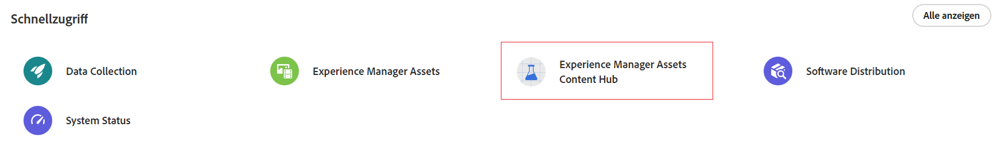

# Übersicht über Content Hub {#overview-content-hub}

Content Hub ist als Teil von Experience Manager Assets as a Cloud Service für die Demokratisierung des Zugriffs auf Markeninhalte für Unternehmen und ihre Geschäftspartner verfügbar. Der Schwerpunkt liegt auf der Verteilung von Assets zur Aktivierung in großem Umfang und der Erstellung von markeninternen Inhaltsvarianten, um die Marketing-Agilität zu verbessern.

## Warum Content Hub?

Content Hub bietet die folgenden Hauptvorteile:

**Suchen und Freigeben aller markengenehmigten Assets, die in einem intuitiven Portal verfügbar sind**

AEM Assets dient als alleinige &quot;Source of Truth&quot;, und alle genehmigten Assets sind in Content Hub automatisch in einer flachen Hierarchie verfügbar, um das Sucherlebnis zu verbessern.

**Konfigurierbare Benutzeroberfläche**

Die gängigsten Eigenschaften in Content Hub, wie Filter für die Suche, beim Hinzufügen oder Importieren von Assets verfügbare Felder, Asset-Eigenschaften, Bannerinhalte für das Branding, sind konfigurierbar und ein Administrator kann die Content Hub-Benutzeroberfläche einfach entsprechend seinen Anforderungen konfigurieren.

**Ermöglichen Sie es Nichtkreativen, Inhalte zu bearbeiten und neu zu mischen, während sie bei der Marke bleiben**

Mit Content Hub können Sie neue Inhalte mit Adobe Express erstellen (wenn Sie über Adobe Expreß-Berechtigungen verfügen). Sie können vorhandene Inhalte mit einfach zu verwendenden Tools bearbeiten, markenspezifische Varianten mit Vorlagen und Markenelementen erstellen und neue Inhalte mit den neuesten GenAI-Funktionen von Adobe Firefly erstellen.

**Gewinnen Sie Einblicke in die Verwendung von Inhalten in Teams**

[!DNL Content Hub] bietet wertvolle Einblicke in Assets und stellt eine Herausforderung dar, auf die Marketing-Stakeholder häufig stoßen - Asset-Nutzungsstatistiken, die in Marketing-Kampagnen, Kanälen und verschiedenen Regionen verwendet werden. Indem es ein klares Verständnis der Leistung und Beliebtheit der Assets erlangt, liefert es umsetzbare Einblicke, die für die Verbesserung des Benutzererlebnisses unerlässlich sind.

## Voraussetzungen {#prerequisites-content-hub}

Content Hub erfordert eine Produktionsumgebung für Autoren von Experience Manager as a Cloud Service, Version 2024.6 oder höher (mindestens Version 2024.6.16799).

## Zugriff auf Content Hub {#access-content-hub}

[Nach der Einrichtung von Content Hub](/help/assets/deploy-content-hub.md) und fügen Sie einen Benutzer zum [Content Hub-Produktprofil](/help/assets/deploy-content-hub.md#content-hub-instance-product-profile)können Sie wie folgt auf Content Hub zugreifen:

* Greifen Sie über den folgenden Link auf Content Hub zu:

  `https://experience.adobe.com/#/assets/contenthub`

* Melden Sie sich bei experience.adobe com an und klicken Sie auf **[!UICONTROL Experience Manager Assets Content Hub]** verfügbar im **[!UICONTROL Schnellzugriff]** Abschnitt:
  

* Melden Sie sich bei experience.adobe com an und klicken Sie auf **[!UICONTROL Experience Manager Assets Content Hub]** im Produktumschalter verfügbar:
  

## Content Hub-Feedback geben {#provide-content-hub-feedback}

Um produktbezogene Verbesserungen zu empfehlen, klicken Sie auf **[!UICONTROL Feedback]** neben Ihrem Organisationsnamen am oberen Rand der Content Hub-Benutzeroberfläche klicken.

Geben Sie einen Betreff und eine Beschreibung der Empfehlung an und fügen Sie bei Bedarf Dateien hinzu. Klicks **[!UICONTROL Einsenden]** , um das Feedback an Adobe zu senden.

## Einrichten von Content Hub für Ihr Team {#setup-content-hub}

Führen Sie die folgenden Schritte aus, um Content Hub für Ihr Team einzurichten:

1. [Aktivieren von Content Hub für Experience Manager Assets mit Cloud Manager](deploy-content-hub.md#enable-content-hub).

1. [Integrierter Content Hub-Administrator](deploy-content-hub.md#onboard-content-hub-administrator).

1. [Wichtige Content Hub-Benutzer hinzufügen](deploy-content-hub.md#onboard-content-hub-consumer-users).

1. [DAM-Autoren oder -Administratoren zum Genehmigen von Assets mit Experience Manager-Assets](approve-assets.md).

1. [Administratoren können die Content Hub-Benutzeroberfläche für andere Benutzer konfigurieren](configure-content-hub-ui-options.md).

1. [Gewähren von Content Hub-Zugriff für weitere Benutzer vom Team](deploy-content-hub.md#onboard-content-hub-consumer-users).

1. [Zugriff auf das Content Hub-Portal](#access-content-hub).

1. [Content Hub-Feedback geben](#provide-content-hub-feedback).

## Weitere Informationen zu wichtigen Funktionen {#key-capabilities-content-module}

<table>
<td>
   
   

      <a href="/help/assets/configure-content-hub-ui-options.md">
      <strong>Benutzeroberfläche von Content Hub konfigurieren</strong>
      </a>
   

   

      <em>Erfahren Sie, wie Administratoren die Content Hub-Benutzeroberfläche konfigurieren können. </em>
   

</td>

<td>
   
   

      <a href="/help/assets/search-assets-content-hub.md">
      <strong>In Content Hub verfügbare Assets suchen</strong>
      </a>
   

   

      <em>Erfahren Sie, wie Sie verschiedene Funktionen zur Eingrenzung Ihrer Suchergebnisse nutzen können.</em>
   

</td>
<td>
   
   

      <a href="/help/assets/edit-images-content-hub.md">
      <strong>Bilder mit Adobe Express bearbeiten</strong>
      </a>
   

   

      <em>Erfahren Sie, wie Sie mit Adobe Express Bildvarianten in Content Hub erstellen</em>
   

</td>
</table>
<table>
<td>
   
   

      <a href="/help/assets/share-assets-content-hub.md">
      <strong>Freigeben von in Content Hub verfügbaren Assets</strong>
      </a>
   

   

      <em>Erfahren Sie, wie Sie ein oder mehrere Assets als Link freigeben und dann darauf zugreifen können.</em>
   

</td>
<td>
   
   

      <a href="/help/assets/collections-content-hub.md">
      <strong>Verwalten von Sammlungen in Content Hub</strong>
      </a>
   

   

      <em>Erfahren Sie, wie Sie Sammlungen mit Assets erstellen und diese dann verwalten.</em>
   

</td>
<td>
   
   

      <a href="/help/assets/insights-content-hub.md">
      <strong>Anzeigen von Asset-Einblicken in Content Hub</strong>
      </a>
   

   

      <em> Das Inhaltsmodul bietet wertvolle Einblicke in Assets und stellt so eine Herausforderung dar, der Marketing-Experten häufig begegnen</em>
   

</td>
</table>
