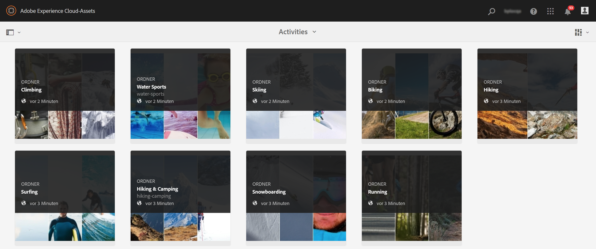

# Veröffentlichen von Assets in Brand Portal {#publish-assets-to-brand-portal}

Als Administrator von Adobe Experience Manager (AEM) Assets können Sie Assets, Ordner und Sammlungen über die AEM Assets Brand Portal-Instanz veröffentlichen. Außerdem können Sie den Veröffentlichungs-Workflow für ein Asset oder einen Ordner zu einem späteren Zeitpunkt einplanen. Nach der Veröffentlichung können die Benutzer von Brand Portal auf die Assets, Ordner und Sammlungen zugreifen und sie an andere Benutzer weiterleiten.

Allerdings müssen Sie zunächst AEM Assets mit Brand Portal konfigurieren. Weitere Informationen finden Sie unter [Konfigurieren der von AEM Assets mit Brand Portal](configure-aem-assets-with-brand-portal.md).

Spätere Änderungen am ursprünglichen Asset, Order oder an der ursprünglichen Sammlung in AEM Assets spiegeln sich erst bei erneuter Veröffentlichung von AEM Assets aus in Brand Portal wider. Mit dieser Funktion wird sichergestellt, dass Änderungen im Rahmen der laufenden Bearbeitung nicht in Brand Portal verfügbar sind. Nur genehmigte, von einem Administrator veröffentlichte Änderungen sind in Brand Portal verfügbar.

* [Veröffentlichen von Assets in Brand Portal](#publish-assets-to-bp)
* [Veröffentlichen von Ordnern in Brand Portal](#publish-folders-to-brand-portal)
* [Veröffentlichen von Sammlungen in Brand Portal](#publish-collections-to-brand-portal)

>[!NOTE]
>
>Adobe empfiehlt eine gestaffelte Veröffentlichung, vorzugsweise außerhalb der Spitzenzeiten, sodass die AEM-Autoreninstanz keine übermäßigen Ressourcen belegt.

## Veröffentlichen von Assets in Brand Portal {#publish-assets-to-bp}

Im Folgenden werden die Schritte zum Veröffentlichen von Assets aus AEM Assets in Brand Portal beschrieben:

1. Öffnen Sie in der Assets-Konsole den übergeordneten Ordner, wählen Sie alle Assets aus, die Sie veröffentlichen möchten, und klicken Sie in der Symbolleiste auf **[!UICONTROL Quick Publish]**.

   

1. Im Folgenden finden Sie zwei Möglichkeiten, Assets zu veröffentlichen:
   * [Sofort veröffentlichen](#publish-to-bp-now) (Assets sofort veröffentlichen)
   * [Später veröffentlichen](#publish-to-bp-later) (Veröffentlichung von Assets terminieren)

### Sofortiges Veröffentlichen von Assets {#publish-to-bp-now}

Um die ausgewählten Assets in Brand Portal zu veröffentlichen, führen Sie einen der folgenden Schritte aus:

* Wählen Sie in der Symbolleiste **[!UICONTROL Quick Publish]** aus. Klicken Sie dann im Menü auf **[!UICONTROL In Brand Portal veröffentlichen]**.

* Wählen Sie in der Symbolleiste **[!UICONTROL Veröffentlichung verwalten]** aus.

   1. Wählen Sie unter **[!UICONTROL Aktion]** die Option **[!UICONTROL In Brand Portal veröffentlichen]** aus.

      Wählen Sie unter **[!UICONTROL Planung]** die Option **[!UICONTROL Jetzt]** aus.

      Klicken Sie auf **[!UICONTROL Weiter]**.

   2. Bestätigen Sie Ihre Auswahl in **[!UICONTROL Umfang]** und klicken Sie auf **[!UICONTROL In Brand Portal veröffentlichen]**.

Eine Meldung erscheint, die besagt, dass die Assets zur Veröffentlichung in Brand Portal in die Warteschlange gestellt wurden. Melden Sie sich bei der Brand Portal-Benutzeroberfläche an, um die veröffentlichten Assets zu sehen.

### Assets später veröffentlichen {#publish-to-bp-later}

So planen Sie die Veröffentlichung der Assets in Brand Portal zu einem späteren Zeitpunkt:

1. Wählen Sie die Assets aus, die Sie für die Veröffentlichung planen möchten, und klicken Sie oben in der Symbolleiste auf **[!UICONTROL Veröffentlichung verwalten]**.

1. Wählen Sie auf der Seite **[!UICONTROL Veröffentlichung verwalten]** die Option **[!UICONTROL In Brand Portal veröffentlichen]** unter **[!UICONTROL Aktion]** aus.

   Wählen Sie **[!UICONTROL Später]** unter **[!UICONTROL Planung]** aus.

   

1. Wählen Sie ein **[!UICONTROL Aktivierungsdatum]** aus und geben Sie die Zeit an. Klicken Sie auf **[!UICONTROL Weiter]**.

1. Wählen Sie ein **Aktivierungsdatum** aus und geben Sie die Zeit an. Klicken Sie auf **Weiter**.

1. Geben Sie einen **[!UICONTROL Workflow-Titel]** in **[!UICONTROL Workflows]** an. Klicken Sie auf **[!UICONTROL Später veröffentlichen]**.

   

Melden Sie sich bei der Brand Portal-Benutzeroberfläche an, um die veröffentlichten Assets zu sehen (je nach Ihrem geplanten Zeitpunkt).

## Veröffentlichen von Ordnern in Brand Portal {#publish-folders-to-brand-portal}

Sie können Asset-Ordner sofort veröffentlichen oder deren Veröffentlichung aufheben oder einen späteren Zeitpunkt festlegen.

### Veröffentlichen von Ordnern in Brand Portal {#publish-folders-to-bp}

1. Wählen Sie in der Assets-Konsole die Ordner aus, die Sie veröffentlichen möchten, und klicken Sie in der Symbolleiste auf **[!UICONTROL Quick Publish]**.

   

1. **Ordner jetzt veröffentlichen** 

   Um die ausgewählten Ordner in Brand Portal zu veröffentlichen, führen Sie einen der folgenden Schritte aus:

   * Wählen Sie in der Symbolleiste **[!UICONTROL Quick Publish]** aus.

      Wählen Sie im Menü **[!UICONTROL In Brand Portal veröffentlichen]** aus.

   * Wählen Sie in der Symbolleiste **[!UICONTROL Veröffentlichung verwalten]** aus.

      1. Wählen Sie unter **[!UICONTROL Aktion]** die Option **[!UICONTROL In Brand Portal veröffentlichen]** aus.

         Wählen Sie unter **[!UICONTROL Planung]** die Option **[!UICONTROL Jetzt]** aus.

         Klicken Sie auf **Weiter**.

      1. Bestätigen Sie Ihre Auswahl in **[!UICONTROL Umfang]** und klicken Sie auf **[!UICONTROL In Brand Portal veröffentlichen]**.

   Eine Meldung erscheint, die besagt, dass der Ordner zur Veröffentlichung in Brand Portal in die Warteschlange gestellt wurde. Melden Sie sich bei der Brand Portal-Benutzeroberfläche an, um die veröffentlichten Ordner zu sehen.

1. **Ordner später veröffentlichen**

   Wenn Sie die Asset-Ordner zu einem späteren Zeitpunkt veröffentlichen möchten:

   1. Wählen Sie die Ordner aus, die Sie für die Veröffentlichung planen möchten, und wählen Sie oben in der Symbolleiste **[!UICONTROL Veröffentlichung verwalten]** aus.
   1. Wählen Sie unter **[!UICONTROL Aktion]** die Option **[!UICONTROL In Brand Portal veröffentlichen]** aus.

      Wählen Sie unter **[!UICONTROL Planung]** die Option **[!UICONTROL Später]** aus.

   1. Wählen Sie ein **[!UICONTROL Aktivierungsdatum]** aus und geben Sie die Zeit an. Klicken Sie auf **[!UICONTROL Weiter]**.

      

   1. Bestätigen Sie Ihre Auswahl unter **[!UICONTROL Umfang]**. Klicken Sie auf **[!UICONTROL Weiter]**.

   1. Geben Sie einen Workflow-Titel unter **[!UICONTROL Workflows]** an. Klicken Sie auf **[!UICONTROL Später veröffentlichen]**.

      

### Veröffentlichung von Ordnern in Brand Portal rückgängig machen {#unpublish-folders-from-brand-portal}

Sie können alle in Brand Portal veröffentlichten Assets/Ordner entfernen, indem Sie die Veröffentlichung über die AEM Assets-Instanz rückgängig machen. Nachdem Sie die Veröffentlichung des ursprünglichen Ordners aufgehoben haben, ist dessen Kopie nicht mehr für Brand Portal-Benutzer verfügbar.

Sie können die Veröffentlichung von Asset-Ordnern in Brand Portal sofort aufheben oder einen späteren Zeitpunkt festlegen.

So machen Sie die Veröffentlichung von Assets/Ordnern in Brand Portal rückgängig:

1. Wählen Sie in der Assets-Konsole die Asset-Ordner aus, deren Veröffentlichung Sie aufheben möchten, und klicken Sie in der Symbolleiste auf **[!UICONTROL Veröffentlichung verwalten]**.

   

1. **Sofortiges Rückgängigmachen der Veröffentlichung von Assets**

   Wenn Sie die Veröffentlichung des ausgewählten Ordners in Brand Portal sofort rückgängig machen möchten:

   1. Wählen Sie in der Symbolleiste **[!UICONTROL Veröffentlichung verwalten]** aus.

   1. Wählen Sie unter **[!UICONTROL Aktion]** die Option **[!UICONTROL Veröffentlichung in Brand Portal rückgängig machen]** aus.

      Wählen Sie unter **[!UICONTROL Planung]** die Option **[!UICONTROL Jetzt]** aus.

      Klicken Sie auf **[!UICONTROL Weiter]**.

   1. Bestätigen Sie Ihre Auswahl in **[!UICONTROL Umfang]** und klicken Sie auf **[!UICONTROL Veröffentlichung in Brand Portal rückgängig machen]**.

      

1. **Späteres Rückgängigmachen der Veröffentlichung von Assets**

   Wenn Sie die Veröffentlichung eines Asset-Ordners zu einem späteren Zeitpunkt rückgängig machen möchten:

   1. Wählen Sie in der Symbolleiste **[!UICONTROL Veröffentlichung verwalten]** aus.

   1. Wählen Sie unter **[!UICONTROL Aktion]** die Option **[!UICONTROL Veröffentlichung in Brand Portal rückgängig machen]** aus.

      Wählen Sie unter **[!UICONTROL Planung]** die Option **[!UICONTROL Später]** aus.

   1. Wählen Sie ein **[!UICONTROL Aktivierungsdatum]** aus und geben Sie die Zeit an. Klicken Sie auf **[!UICONTROL Weiter]**.

   1. Bestätigen Sie Ihre Auswahl unter **[!UICONTROL Umfang]** und klicken Sie auf **[!UICONTROL Weiter]**.

   1. Geben Sie einen **[!UICONTROL Workflow-Titel]** in **[!UICONTROL Workflows]** an. Klicken Sie auf **[!UICONTROL Veröffentlichung später rückgängig machen]**.

      

## Veröffentlichen von Sammlungen in Brand Portal {#publish-collections-to-brand-portal}

Sie können Sammlungen in Ihrer AEM Assets-Cloud-Instanz veröffentlichen oder deren Veröffentlichung rückgängig machen.

>[!NOTE]
>
>Inhaltsfragmente können nicht in Brand Portal veröffentlicht werden. Wenn Sie daher in der AEM Assets-Instanz Inhaltsfragmente auswählen, ist die Aktion **[!UICONTROL In Brand Portal veröffentlichen]** nicht verfügbar.
>
>Wenn Sammlungen, die Inhaltsfragmente enthalten, über AEM Assets in Brand Portal veröffentlicht werden, wird der gesamte Inhalt des Ordners mit Ausnahme der Inhaltsfragmente in der Brand Portal-Oberfläche repliziert.

### Veröffentlichen von Sammlungen {#publish-collections}

Im Folgenden werden die Schritte zum Veröffentlichen von Sammlungen aus AEM Assets in Brand Portal beschrieben:

1. Klicken Sie in der Benutzeroberfläche von AEM Assets auf das AEM-Logo.

1. Gehen Sie von der Seite **Navigation** aus zu **[!UICONTROL Assets]** > **[!UICONTROL Sammlungen]**.

1. Wählen Sie in der Konsole **Sammlungen** die Sammlung aus, die Sie in Brand Portal veröffentlichen möchten.

   

1. Klicken Sie in der Symbolleiste auf **[!UICONTROL In Brand Portal veröffentlichen]**.

1. Klicken Sie im Bestätigungsdialogfeld auf **[!UICONTROL Veröffentlichen]**.

1. Schließen Sie die Bestätigungsmeldung.

   Melden Sie sich bei Brand Portal als Administrator an. Die veröffentlichte Sammlung steht in der Konsole „Sammlungen“ zur Verfügung.

   

### Veröffentlichung von Sammlungen rückgängig machen {#unpublish-collections}

Sie können alle in Brand Portal veröffentlichte Sammlungen entfernen, indem Sie die Veröffentlichung über die AEM Assets-Instanz rückgängig machen. Nachdem Sie die Veröffentlichung der ursprünglichen Sammlung rückgängig gemacht haben, ist deren Kopie nicht mehr für Brand Portal-Benutzer verfügbar.

Im Folgenden werden die Schritte zum Aufheben der Veröffentlichung einer Sammlung beschrieben:

1. Wählen Sie über die Konsole **Sammlungen** der AEM Assets-Instanz die Sammlung aus, deren Veröffentlichung rückgängig gemacht werden soll.

   

1. Klicken Sie in der Symbolleiste auf das Symbol **[!UICONTROL Aus Brand Portal löschen]**.
1. Klicken Sie im Dialogfeld auf **[!UICONTROL Veröffentlichung rückgängig machen]**.
1. Schließen Sie die Bestätigungsmeldung. Die Sammlung wird aus der Brand Portal-Oberfläche entfernt.

Darüber hinaus können Sie Metadatenschemata, Bildvorgaben, Suchfacetten und Tags von AEM Assets in Brand Portal veröffentlichen.

* [Veröffentlichen von Vorgaben, Schemata und Facetten in Brand Portal](https://experienceleague.adobe.com/docs/experience-manager-brand-portal/using/publish/publish-schema-search-facets-presets.html)
* [Veröffentlichen von Tags in Brand Portal](https://experienceleague.adobe.com/docs/experience-manager-brand-portal/using/publish/brand-portal-publish-tags.html)

Weitere Informationen finden Sie in der [Dokumentation zu Brand Portal](https://experienceleague.adobe.com/docs/experience-manager-brand-portal/using/home.html).

<!--
   Comment Type: draft

   <li> </li>
   -->

<!--
   Comment Type: draft

   <li>Step text</li>
   -->
