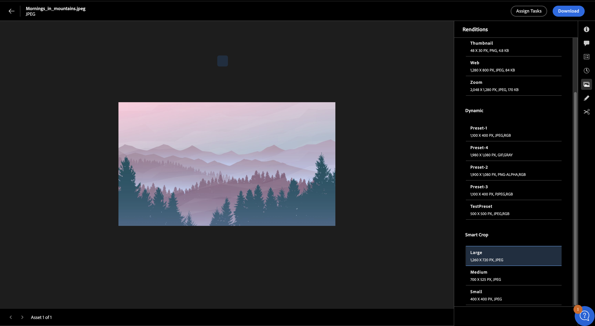

# Anzeigen und Verwalten von Ausgabedarstellungen in Experience Manager Assets{#renditions}

Ausgabedarstellungen in Adobe Experience Manager (AEM) sind benutzerdefinierte Versionen digitaler Assets, z. B. Bilder, die für verschiedene Geräte und Plattformen entwickelt wurden, um eine optimale Leistung zu gewährleisten. AEM ermöglicht die einfache Erstellung und Verwaltung dieser Ausgabedarstellungen und verbessert so das Anwendererlebnis. Sie können unter anderem Miniaturansichten erstellen, Bilder für Web oder Mobilgeräte optimieren, Wasserzeichen hinzufügen und dynamische Ausgabedarstellungen oder Ausgabedarstellungen mit intelligentem Zuschnitt anzeigen und herunterladen.

Dynamic Media-Bildvorgaben und Ausgabedarstellungen mit intelligentem Zuschnitt fördern eine systematische Bildverwaltung, die auf Markenstandards ausgerichtet ist, und maximieren so die Markenkohärenz. Dies vereinfacht den Prozess der schnellen Suche und Verwendung dynamischer Bild-Ausgabedarstellungen nach Bedarf ohne Admin-Zugriff.

Ausgabedarstellungen werden zwischen statisch und dynamisch klassifiziert, wobei jeder Typ einzigartige Funktionen und Funktionen aufweist, die weiter unten ausführlicher erläutert werden.

## Statische Ausgabeformate {#static-renditions}

Statische Ausgabedarstellungen sind vorgenerierte Versionen digitaler Assets, die normalerweise bei der Aufnahme oder Änderung von Assets erstellt werden. Diese Ausgabedarstellungen sind für bestimmte Zwecke und Plattformen optimiert, wie Web-Miniaturansichten, mobile Formate für responsives Design oder hochauflösende Druckversionen, um ein effizientes und konsistentes Erlebnis zu gewährleisten.Erfahren Sie, wie Sie [statische Ausgabedarstellungen in Experience Manager Assets anzeigen und herunterladen](#view-and-download-static-renditions) können.

### Anzeigen und Herunterladen statischer Ausgabedarstellungen{#view-and-download-static-renditions}

Gehen Sie wie folgt vor, um die Ausgabedarstellungen eines Assets anzuzeigen und herunterzuladen:

1. Klicken Sie in der Assets-Ansicht auf **Assets**, navigieren Sie zu einem Ordner, wählen Sie ein Asset aus und klicken Sie auf **Details**.
1. Klicken Sie im rechten Bereich auf das Symbol „Ausgabedarstellungen“.
1. Wählen Sie eine Ausgabedarstellung aus, um sie in der Vorschau anzuzeigen, und klicken Sie auf , um sie herunterzuladen.

   

## Dynamische Ausgabedarstellungen {#dynamic-renditions}

Dynamische Ausgabedarstellungen sind benutzerdefinierte Versionen von Assets, die in Echtzeit erstellt werden, um bestimmten Anforderungen zu entsprechen, z. B. die Größenanpassung von Bildern an die Auflösung des Geräts oder das Zuschneiden auf verschiedene Seitenverhältnisse.Mit diesen Ausgabedarstellungen können Unternehmen personalisierte und optimierte Erlebnisse für unterschiedliche Zielgruppenanforderungen bereitstellen. Sie können dynamische Ausgabedarstellungen in Experience Manager Assets anzeigen und herunterladen.

## Dynamic Media-Ausgabedarstellungen {#dynamic-media-renditions}

### Voraussetzungen

* Sie müssen eine Benutzerin bzw. ein Benutzer mit AEM Dynamic Media-Lizenz sein.
* Verwenden Sie die [!UICONTROL Admin-Ansicht], um Folgendes einzurichten:
   * [Erstellen von Bildprofilen mit intelligentem Zuschnitt](/help/assets/dynamic-media/image-profiles.md#creating-image-profiles)
   * [Bildvorgaben](/help/assets/dynamic-media/managing-image-presets.md)

  Sie können später [die Ansicht wechseln](/help/assets/assets-view-introduction.md#how-to-access-assets-view), um dynamische Ausgabedarstellungen in der Assets-Ansicht in der Vorschau anzuzeigen.
* Veröffentlichen Sie Assets in Dynamic Media, um Ausgabedarstellungen mit Dynamic Media in der Asset-Ansicht verfügbar zu machen. Weitere Informationen finden Sie unter [Veröffentlichen von Assets in AEM und Dynamic Media](https://experienceleague.adobe.com/de/docs/experience-manager-cloud-service/content/assets/assets-view/publish-assets-to-aem-and-dm).

### Anzeigen und Herunterladen von Dynamic Media-Ausgabedarstellungen {#view-download-dm-renditions}

Gehen Sie folgendermaßen vor, um dynamische Ausgabedarstellungen von Bildern in Experience Manager Assets anzuzeigen oder herunterzuladen:

1. Navigieren Sie zu **[!UICONTROL Asset-Verwaltung]** > **[!UICONTROL Assets]**.

1. Navigieren Sie zu dem entsprechenden Asset-Ordner.

1. Klicken Sie auf das Asset, das Sie anzeigen möchten, und klicken Sie auf **[!UICONTROL Details]**.

1. Klicken Sie im rechten Menü auf das Symbol **[!UICONTROL Dynamic Media]**. Im Bedienfeld **[!UICONTROL Dynamic Media]** werden Dynamic Media-Ausgabedarstellungen und Ausgabedarstellungen für intelligenten Zuschnitt angezeigt.

   
   <!--  -->

1. Wählen Sie die Ausgabedarstellung für die Vorschau aus und klicken Sie auf **URL kopieren**, um die URL der ausgewählten Ausgabedarstellung zu kopieren. Klicken Sie auf **Ausgabedarstellung herunterladen**, um die Ausgabedarstellungen der Bild-Assets herunterzuladen.
1. Wählen Sie die Ausgabedarstellung für den intelligenten Zuschnitt aus, um eine Vorschau anzuzeigen, und klicken Sie auf **URL kopieren**, um die URL der ausgewählten Ausgabedarstellung zu kopieren.
1. Klicken Sie auf das , um alle verfügbaren Ausgabedarstellungen für intelligenten Zuschnitt als einzelne ZIP-Datei herunterzuladen.
   

   >[!NOTE]
   >
   >Diese Ausgabedarstellungen sind nur für Bild-Assets verfügbar.

## Dynamic Media mit OpenAPI-Funktionen für Ausgabeformate {#dm-with-openapi-renditions}

### Voraussetzungen {#prereqs-dm-with-openapi-renditions}

* Sie müssen eine Benutzerin bzw. ein Benutzer mit AEM Dynamic Media-Lizenz sein.
* Assets muss für die öffentliche Verwendung genehmigt sein, um Dynamic Media mit OpenAPI-Funktionen für Ausgabedarstellungen anzuzeigen. Weitere Informationen finden Sie unter [Genehmigen von Assets in Experience Manager](/help/assets/approve-assets.md#copy-delivery-url-approved-assets).
* Dynamic Media mit OpenAPI-Funktionen muss in Ihrer AEM as a Cloud Service-Instanz aktiviert sein.

### Anzeigen von Ausgabedarstellungen durch Dynamic Media mit OpenAPI-Funktionen {#view-download-dm-with-openapi-renditions}

1. Wählen Sie das Asset aus und klicken Sie auf **Details**.
1. Klicken Sie auf das Dynamic Media-Symbol im rechten Bedienfeld. Das Dynamic Media-Bedienfeld zeigt basierend auf Ausgabedarstellungen, dynamische Ausgabedarstellungen und Ausgabedarstellungen für smartes Zuschneiden für unterstützte Asset-Typen an.   
1. Wählen Sie **Basisausgabe** und klicken Sie auf **URL kopieren**, um die Bereitstellungs-URL des Assets zu kopieren, oder klicken Sie auf **Ausgabedarstellung herunterladen**, um das Asset herunterzuladen.

Wenn sowohl Scene7 (Dynamic Media) als auch Dynamic Media mit OpenAPI-Funktionen für das Repository aktiviert sind, ist in der Benutzeroberfläche eine Umschaltoption verfügbar, mit der zwischen den beiden Optionen gewechselt werden kann. Die angezeigten Ausgabedarstellungen und die generierten URLs werden basierend auf der ausgewählten Konfiguration aktualisiert.

**Siehe auch**

* [Assets übersetzen](/help/assets/translate-assets.md)
* [Assets-HTTP-API](/help/assets/mac-api-assets.md)
* [Von AEM Assets unterstützte Dateiformate](/help/assets/file-format-support.md)
* [Suchen von Assets](/help/assets/search-assets.md)
* [Connected Assets](/help/assets/use-assets-across-connected-assets-instances.md)
* [Asset-Berichte](/help/assets/asset-reports.md)
* [Metadatenschemata](/help/assets/metadata-schemas.md)
* [Herunterladen von Assets](/help/assets/download-assets-from-aem.md)
* [Verwalten von Metadaten](/help/assets/manage-metadata.md)
* [Verwalten von Dynamic Media-Vorlagen](/help/assets/dynamic-media/manage-dynamic-media-templates.md)
* [Verwalten von Berichten](/help/assets/manage-reports-assets-view.md)
* [Suchfacetten](/help/assets/search-facets.md)
* [Verwalten von Sammlungen](/help/assets/manage-collections.md)
* [Massenimport von Metadaten](/help/assets/metadata-import-export.md)
* [Veröffentlichen von Assets in AEM und Dynamic Media](/help/assets/publish-assets-to-aem-and-dm.md)

