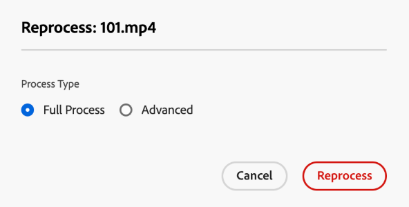

# Erneutes Verarbeiten digitaler Assets {#reprocessing-digital-assets}

Sie können Assets in einem Ordner erneut verarbeiten, der bereits über ein vorhandenes Metadatenprofil verfügt, das Sie nachträglich geändert haben. Wenn die neu bearbeitete Vorgabe erneut auf die vorhandenen Assets im Ordner angewendet werden soll, müssen Sie den Ordner erneut verarbeiten. Sie können beliebig viele Assets erneut verarbeiten.

Verarbeiten Sie Assets in einem Ordner neu, wenn eines der folgenden beiden Szenarien eintritt:

* Sie möchten eine Stapelsatzvorgabe für einen vorhandenen Asset-Ordner ausführen, in den bereits Assets hochgeladen wurden.
* Sie bearbeiten später eine vorhandene Stapelsatzvorgabe, die zuvor auf einen Asset-Ordner angewendet wurde.

## Erneutes Verarbeiten von Assets {#reprocessing-steps}

Wie folgt können Sie Assets in einem Ordner erneut verarbeiten:

1. Wählen Sie in [!DNL Assets view] auf der Assets-Seite die neu hinzugefügten Assets oder die Assets aus, die Sie erneut verarbeiten möchten.
Wenn Sie einen Ordner auswählen:

   * Der Workflow berücksichtigt rekursiv alle Dateien in dem ausgewählten Ordner.
   * Wenn sich im ausgewählten Hauptordner ein oder mehrere Unterordner mit Assets befinden, verarbeitet der Workflow jedes Asset in der Ordnerhierarchie neu.
   * Es empfiehlt sich, diesen Workflow nicht in einer Ordnerhierarchie mit mehr als 1.000 Assets auszuführen.

1. Wählen Sie **[!UICONTROL Assets erneut verarbeiten]**. Wählen Sie zwischen den beiden Optionen:

   

   * **[!UICONTROL Vollständiger Prozess]:** Wählen Sie diese Option, wenn Sie den gesamten Prozess ausführen möchten, einschließlich Standardprofil, benutzerdefiniertes Profil, dynamische Verarbeitung (sofern konfiguriert) und Nachbearbeitungs-Workflows.
   * **[!UICONTROL Erweitert]:** Wählen Sie diese Option, um die erweiterte Neuverarbeitung auszuwählen.

     

     Wählen Sie unter den folgenden erweiterten Optionen aus:

      * **[!UICONTROL Standard-Ausgabeformate für die Vorschau]:** Wählen Sie diese Option, wenn Sie die standardmäßig in der Vorschau angezeigten Ausgabedarstellungen erneut verarbeiten möchten.

      * **[!UICONTROL Metadaten]:** Wählen Sie diese Option, wenn Sie Metadateninformationen und Smart-Tags für die ausgewählten Assets extrahieren möchten.

      * **[!UICONTROL Verarbeitungsprofile]:** Wählen Sie diese Option, wenn Sie ein ausgewähltes Profil erneut verarbeiten möchten. Sie können die Option **[!UICONTROL Vollständiger Prozess]** wählen, um die Standardverarbeitung und das benutzerdefinierte Profil einzuschließen, die auf der Ordnerebene zugewiesen sind.
        <!--When assets are uploaded to a folder, [!DNL Assets ~~view~~] checks the containing folder's properties for a processing profile. If none is applied, a parent folder in the hierarchy is checked for a processing profile to apply.-->

      * **[!UICONTROL Nachbearbeitungs-Workflow]:** Wählen Sie diese Option, bei der eine zusätzliche Verarbeitung von Assets erforderlich ist, die mit den Verarbeitungsprofilen nicht erreicht werden kann. Der Konfiguration können weitere Nachbearbeitungs-Workflows hinzugefügt werden. Mit der Nachbearbeitung können Sie zusätzlich zur konfigurierbaren Verarbeitung mithilfe von Asset-Microservices eine vollständig angepasste Verarbeitung hinzufügen.

Siehe [Verwendung von Asset-Micro-Services und Verarbeitungsprofilen](https://experienceleague.adobe.com/docs/experience-manager-cloud-service/content/assets/manage/asset-microservices-configure-and-use.html?lang=de), um mehr über Verarbeitungsprofile und Nachbearbeitungs-Workflows zu erfahren.

Klicken Sie nach Auswahl der entsprechenden Optionen auf **[!UICONTROL Erneut verarbeiten]**. Die Erfolgsmeldung wird angezeigt.

## Szenarien für die Neuverarbeitung digitaler Assets {#scenarios-reprocessing}

[!DNL Experience Manager] ermöglicht die erneute Verarbeitung digitaler Assets für die folgenden Komponenten.

### Smart-Tags {#reprocessing-smart-tags}

Organisationen, die mit digitalen Assets arbeiten, verwenden zunehmend taxonomiegesteuertes Vokabular in Asset-Metadaten. Im Wesentlichen handelt es sich um eine Liste von Schlüsselwörtern, die Angestellte, Partner bzw. Partnerinnen und Kunden bzw. Kundinnen üblicherweise verwenden, um sich auf digitale Assets einer bestimmten Klasse zu beziehen und danach zu suchen. Das Tagging von Assets mit taxonomiegesteuertem Vokabular stellt sicher, dass die Assets leicht identifiziert und abgerufen werden können.

Verglichen mit dem Vokabular natürlicher Sprachen hilft das Tagging digitaler Assets anhand einer Geschäftstaxonomie dabei, sie am Geschäft eines Unternehmens auszurichten, und stellt dabei sicher, dass nur die relevantesten Assets bei der Suche angezeigt werden.

Lesen Sie mehr zu [Smart-Tags für Videoassets](https://experienceleague.adobe.com/docs/experience-manager-cloud-service/content/assets/manage/smart-tags-video-assets.html?lang=de).

Lesen Sie mehr zum [Erneuten Verarbeiten von Farb-Tags für vorhandene Bilder in DAM](https://experienceleague.adobe.com/docs/experience-manager-cloud-service/content/assets/manage/color-tag-images.html?lang=de#color-tags-existing-images).

### Smartes Zuschneiden {#reprocessing-smart-crop}

Lesen Sie mehr zum [Smarten Zuschneiden in Dynamic Media](https://experienceleague.adobe.com/docs/experience-manager-cloud-service/content/assets/dynamicmedia/image-profiles.html?lang=de), womit Sie bestimmte Zuschneidefunktionen (**[!UICONTROL Smarter Zuschnitt]** und Pixelzuschnitt) und Scharfzeichnungskonfigurationen auf die hochgeladenen Assets anwenden können.

### Metadaten {#reprocessing-metadata}

[!DNL Adobe Experience Manager Assets] speichert Metadaten für jedes Asset. Damit können Assets einfacher kategorisiert und organisiert und bestimmte Assets leichter von Benutzern gefunden werden. Metadaten können aus in Experience Manager Assets hochgeladenen Dateien extrahiert werden. Damit lässt sich die Metadatenverwaltung in den kreativen Workflow integrieren. Da Sie Metadaten mit den Assets speichern und verwalten können, können Sie Assets basierend auf ihren Metadaten automatisch organisieren und verarbeiten.

Lesen Sie mehr zum [Erneuten Verarbeiten von Metadatenprofilen](https://experienceleague.adobe.com/docs/experience-manager-cloud-service/content/assets/manage/metadata-profiles.html?lang=de).

### Erneutes Verarbeiten von Dynamic Media-Assets in einem Ordner {#reprocessing-dynamic-media}

Sie können Assets in einem Ordner neu verarbeiten, der bereits über ein später von Ihnen geändertes Dynamic Media-Bildprofil oder ein Dynamic Media-Videoprofil verfügt. Weitere Informationen finden Sie unter [Dynamic Media-Assets in einem Ordner erneut ](https://experienceleague.adobe.com/docs/experience-manager-cloud-service/content/assets/admin/about-image-video-profiles.html?lang=de).

>[!NOTE]
>
>Sie müssen [!DNL Dynamic Media] in der Umgebung konfigurieren, um das Dialogfeld „Dynamic Media“ zu aktivieren.
>

### Workflows

Lesen Sie mehr zu [Verarbeitungsprofilen und Nachbearbeitungs-Workflows](https://experienceleague.adobe.com/docs/experience-manager-cloud-service/content/assets/manage/asset-microservices-configure-and-use.html?lang=de).
