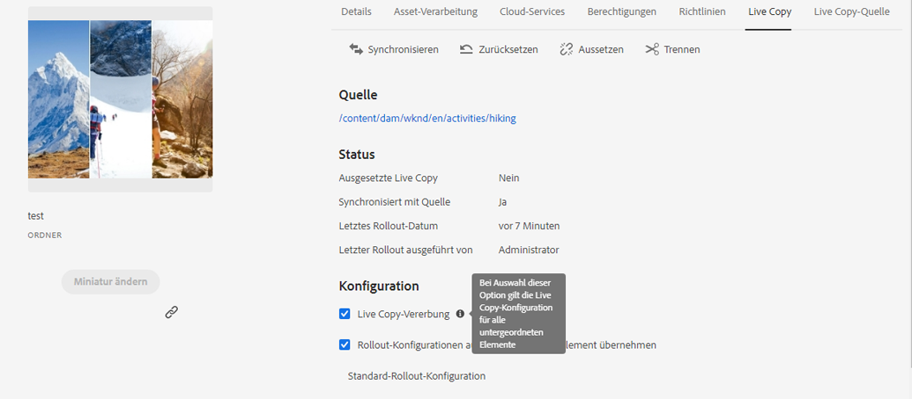

# Wiederverwenden von Assets mit MSM für Assets{#reuse-assets-using-msm-for-assets}

Mit der Funktion „Multi Site Manager“ (MSM) in Adobe Experience Manager (AEM) können Benutzer einmal erstellte Inhalte über mehrere Web-Speicherorte hinweg wiederverwenden. Für digitale Assets steht dieselbe Funktion zur Verfügung wie MSM für Assets. Mit MSM für Assets können Sie:

* Einmal Assets anlegen und dann Kopien dieser Assets erstellen, um sie in anderen Bereichen der Site wiederzuverwenden.
* Mehrere Kopien synchron halten und die ursprüngliche Masterkopie einmal aktualisieren, um die Änderungen an die untergeordneten Kopien zu übertragen.
* Lokale Änderungen vornehmen, indem Sie die Verknüpfung zwischen übergeordneten und untergeordneten Assets vorübergehend oder dauerhaft unterbrechen.

## Wissenswertes über Vorteile und Konzepte {#concepts}

### Funktionsweise und Vorteile {#how-it-works-and-the-benefits}

AEM unterhält einen Link zwischen dem ursprünglichen Asset und dessen verknüpften Kopien, die als Live Copies (LCs) bezeichnet werden. Diese bestehende Verknüpfung ermöglicht Push-Übertragungen zentraler Änderungen an eine große Zahl von Live Copies. Auf diese Weise werden schnellere Aktualisierungen ermöglicht, während die mit der Verwaltung doppelter Kopien einhergehenden Beschränkungen entfallen. Die Übertragung von Änderungen erfolgt fehlerfrei und zentralisiert. Die Funktion lässt Raum für Aktualisierungen, die auf ausgewählte Live Copies beschränkt sind. Benutzer können die Verknüpfung trennen, also die Vererbung unterbrechen, und lokale Bearbeitungen vornehmen, die beim nächsten Aktualisieren der Masterkopie und Rollout der Änderungen nicht überschrieben werden. Die Trennung kann für einige ausgewählte Metadatenfelder oder für ein vollständiges Asset vorgenommen werden. Sie ermöglicht es, lokale Assets zu aktualisieren, die ursprünglich von einer Masterkopie übernommen wurden.

MSM behält eine (Live-) Beziehung zwischen Quell-Asset und seinen Live Copies bei, sodass:

* Änderungen an den Quell-Assets auch auf Live Copies angewendet werden (Rollout), d. h., die Live Copies werden mit der Quelle synchronisiert;
* Sie Live Copies aktualisieren können, indem Sie die Live-Beziehung aussetzen oder die Vererbung für wenige begrenzte Felder entfernen. Die Änderungen an der Quelle werden nicht mehr auf die Live Copy angewendet.

### Glossar der MSM Assets-Begriffe {#glossary}

**Quelle** Die ursprünglichen Assets oder Ordner. Masterkopie, aus der Live Copies abgeleitet werden.

**Live Copy** Die Kopie der Quellelemente/Ordner, die mit der Quelle synchronisiert wird. Live Copies können eine Quelle für weitere Live Copies sein. Siehe Erstellen von LCs.

**Vererbung** Ein Link/Verweis zwischen einem Live-Copy-Asset/-Ordner und seiner Quelle, über den das System speichert, wohin die Updates gesendet werden. Eine Vererbung existiert für Metadatenfelder auf granularer Ebene. Die Vererbung kann für ausgewählte Metadatenfelder entfernt werden, während die Live-Beziehung zwischen Quelle und zugehöriger Live Copy beibehalten wird.

**Rollout** Eine Aktion, die die Änderungen an der Quelle nach den Live-Kopien schiebt. Es ist möglich, mithilfe der Aktion „Rollout“ eine oder mehrere Live Copies in einem Schritt zu aktualisieren. Siehe Rollout.

**Rollout-Konfigurationsregeln** , die festlegen, welche Eigenschaften synchronisiert werden, wie und wann. Diese Konfigurationen werden beim Erstellen von Live Copies angewendet und können später bearbeitet werden. Dabei kann ein untergeordnetes Element die Rollout-Konfiguration vom zugehörigen übergeordneten Asset übernehmen. Verwenden Sie für MSM für Assets nur die standardmäßige Rollout-Konfiguration. Die anderen Rollout-Konfigurationen sind für MSM für Assets nicht verfügbar.

**Synchronisieren** Sie eine weitere Aktion, die zusätzlich zur Einführung eine Parität zwischen Quelle und Live-Kopie bietet, indem Sie die Updates von der Quelle an Live-Kopien senden. Eine Synchronisierung wird für eine bestimmte Live Copy initiiert und die Aktion ruft die Änderungen von der Quelle ab. Mit dieser Aktion können Sie nur eine der Live Copies aktualisieren. Siehe Aktion „Synchronisieren“.

**Aussetzen** : Entfernen Sie vorübergehend die Live-Beziehung zwischen einer Live-Kopie und ihrem Quellasset/Ordner. Sie können die Beziehung wieder aufnehmen. Siehe Aktion „Aussetzen“.

**Fortsetzen** Sie die Live-Beziehung fort, sodass eine Live-Kopie erneut beginnt, die Updates von der Quelle zu erhalten. Siehe Aktion „Fortsetzen“.

**Mit der Aktion &quot;Zurücksetzen** &quot;wird die Live-Kopie erneut zu einer Kopie der Quelle, indem alle lokalen Änderungen überschrieben werden. Außerdem werden abgebrochene Vererbungsvorgänge entfernt und Vererbungen in allen Metadatenfeldern zurückgesetzt. Für zukünftige lokale Änderungen müssen Sie die Vererbung bestimmter Felder erneut abbrechen. Siehe Lokale Änderungen an LC.

**Lösen** Sie unwiderruflich die Live-Beziehung eines Live Copy-Assets/Ordners. Nach der Aktion „Trennen“ können Live Copies niemals Aktualisierungen aus der Quelle empfangen und sie haben keinen Live Copy-Status mehr. Siehe Entfernen von Beziehungen.

## Erstellen von Live Copies eines Assets {#createlc}

Führen Sie einen der folgenden Schritte aus, um eine Live Copy aus einem oder mehreren Quell-Assets oder -ordnern zu erstellen:

* Methode 1: Wählen Sie die Quellen-Assets aus und klicken Sie oben in der Symbolleiste auf **[!UICONTROL Erstellen > Live Copy]**.

* Methode 2: Klicken Sie oben rechts in der AEM-Benutzeroberfläche auf **[!UICONTROL Erstellen > Live Copy]**.

Sie können Live Copies eines Assets oder Ordners einzeln erstellen. Sie können Live Copies erstellen, die aus einem Asset oder Ordner abgeleitet werden, der ebenfalls eine Live Copy ist.  Inhaltsfragmente werden für das Nutzungsszenario nicht unterstützt. Wenn Sie versuchen, deren Live Copies zu erstellen, werden die Inhaltsfragmente wie vorliegend und ohne Beziehung kopiert. Die kopierten Inhaltsfragmente sind eine Momentaufnahme und werden nicht zusammen mit den ursprünglichen Inhaltsfragmenten aktualisiert.

Führen Sie folgende Schritte aus, um Live Copies mit der ersten Methode zu erstellen:

1. Wählen Sie Quell-Assets oder -ordner aus. Klicken Sie in der Symbolleiste auf **[!UICONTROL Erstellen > Live Copy]**.

   

   Erstellen einer Live Copy über die AEM-Oberfläche

1. Wählen Sie einen Zielordner aus. Klicken Sie auf **[!UICONTROL Weiter]**.
1. Geben Sie einen Titel und Namen an. Assets haben keine untergeordneten Elemente. Wenn Sie eine Live Copy von Ordnern erstellen, können Sie die untergeordneten Elemente ein- oder ausschließen.
1. Wählen Sie eine Rollout-Konfiguration aus. Klicken Sie auf **[!UICONTROL Erstellen]**.

Führen Sie folgende Schritte aus, um Live Copies mit der zweiten Methode zu erstellen:

1. Klicken Sie oben rechts in der AEM-Oberfläche auf **[!UICONTROL Erstellen > Live Copy]**.

   

   Erstellen einer Live Copy über die AEM-Oberfläche

1. Wählen Sie Quell-Asset oder -ordner aus. Klicken Sie auf **[!UICONTROL Weiter]**.
1. Wählen Sie einen Zielordner aus. Klicken Sie auf **[!UICONTROL Weiter]**.
1. Geben Sie einen Titel und Namen an. Assets haben keine untergeordneten Elemente. Wenn Sie eine Live Copy von Ordnern erstellen, können Sie die untergeordneten Elemente ein- oder ausschließen.
1. Wählen Sie eine Rollout-Konfiguration aus. Klicken Sie auf **[!UICONTROL Erstellen]**.

>[!NOTE]
>
>Wenn eine Quelle oder Live Copy verschoben wird, werden die Beziehungen beibehalten. Wenn eine Live Copy gelöscht wird, werden die Beziehungen entfernt.

## Anzeigen verschiedener Eigenschaften und Status von Quelle und Live Copy {#properties}

Sie können Informationen und MSM-bezogene Status der Live Copy wie Beziehung, Synchronisierung, Rollouts usw. in verschiedenen Bereichen der AEM-Benutzeroberfläche anzeigen.

Die folgenden beiden Methoden funktionieren für Assets und Ordner:

* Wählen Sie ein Live Copy-Asset aus und suchen Sie nach Informationen auf der zugehörigen Eigenschaftenseite.
* Wählen Sie den Quellordner aus und suchen Sie detaillierte Informationen für jede Live Copy über die Live Copy-Konsole.

**Tipp**: Um den Status einiger separater Live Copies zu prüfen, verwenden Sie die erste Methode (rufen Sie die Eigenschaftenseite auf). Um den Status einer großen Zahl von Live Copies zu prüfen, verwenden Sie die zweite Methode (rufen Sie die Seite **[!UICONTROL Beziehungsstatus]** auf).

### Informationen und Status von Live Copies {#statuslcasset}

Führen Sie folgende Schritte aus, um Informationen und Status eines Live Copy-Assets oder -Ordners zu prüfen.

1. Wählen Sie ein Live Copy-Asset oder einen Ordner aus. Klicken Sie in der Symbolleiste auf **[!UICONTROL Eigenschaften]**. Sie können auch den Tastaturbefehl `p` verwenden.
1. Klicken Sie auf **[!UICONTROL Live Copy]**. Sie können den Pfad der Quelle, den Aussetzen-Status, den Synchronisierungsstatus, das letzte Rollout-Datum und den Benutzer, der das letzte Rollout durchgeführt hat, prüfen.

   

   Live Copy-Informationen und -Status

1. Eine Aktivierung oder Deaktivierung ist möglich, wenn untergeordnete Assets die Live Copy-Konfiguration übernehmen.

1. Sie können die Option für die Live Copy wählen, um die Rollout-Konfiguration vom übergeordneten Asset zu übernehmen oder die Konfiguration zu ändern.

### Informationen und Status aller Live Copies eines Ordners {#statuslcfolder}

AEM stellt eine Konsole bereit, um die Status aller Live Copies eines Quellordners zu prüfen. Diese Konsole zeigt den Status aller untergeordneten Assets an.

1. Wählen Sie einen Quellordner aus. Klicken Sie in der Symbolleiste auf **[!UICONTROL Eigenschaften]**. Sie können auch den Tastaturbefehl `p` verwenden.
1. Klicken Sie auf **[!UICONTROL Live Copy-Quelle]**. Klicken Sie auf **[!UICONTROL Live Copy-Übersicht]**, um die Konsole zu öffnen. Dieses Dashboard liefert übergeordnete Statusinformationen aller untergeordneten Assets.

   

   Anzeigen der Status von Live Copies in der Live Copy-Konsole der Quelle

1. Um detaillierte Informationen zu jedem Asset im Live Copy-Ordner anzuzeigen, wählen Sie ein Asset aus und klicken Sie in der Symbolleiste auf **[!UICONTROL Beziehungsstatus]**.

   

   Detaillierte Informationen und Status eines untergeordneten Live Copy-Assets in einem Ordner

**Tipp**: Sie können die Status von Live Copies anderer Ordner ohne großen Navigationsaufwand schnell einsehen. Ändern Sie einfach den Ordner in der Popup-Liste im oberen mittleren Teil der Oberfläche mit der **[!UICONTROL Live Copy-Übersicht]**.

### Schnellaktionen in der Leiste „Verweise“ für Quellen {#refrailsource}

Für Quell-Assets oder -ordner können Sie die folgenden Informationen über die Leiste „Verweise“ anzeigen und die folgenden Aktionen von dort aus direkt ausführen:

* Anzeigen der Pfade von Live Copies
* Öffnen und Anzeigen einer bestimmten Live Copy in der AEM-Benutzeroberfläche
* Synchronisieren von Aktualisierungen mit einer bestimmten Live Copy
* Aussetzen der Beziehung oder Ändern der Rollout-Konfiguration für eine bestimmte Live Copy
* Zugreifen auf die Konsole „Live Copy-Übersicht“

Wählen Sie Quell-Asset oder -ordner aus, öffnen Sie die linke Leiste und klicken Sie auf **[!UICONTROL Verweise]**. Sie können auch ein Asset oder einen Ordner auswählen und den Tastaturbefehl `Alt + 4` verwenden.  

In der Leiste „Verweise“ für die ausgewählte Quelle verfügbare Aktionen und Informationen

Klicken Sie für eine bestimmte Live Copy auf **[!UICONTROL Live Copy bearbeiten]**, um die Beziehung auszusetzen oder die Rollout-Konfiguration zu ändern.

Aussetzen der Beziehung oder Ändern der Rollout-Konfiguration einer bestimmten Live Copy

### Schnellaktionen in der Leiste „Verweise“ für Live Copies {#refraillc}

Für Live Copy-Assets oder -Ordner können Sie die folgenden Informationen über die Leiste „Verweise“ anzeigen und die folgenden Aktionen von dort aus direkt ausführen:

* Anzeigen des Pfads der zugehörigen Quelle.
* Öffnen und Anzeigen einer bestimmten Live Copy in der AEM-Benutzeroberfläche
* Stellen Sie die Aktualisierungen bereit.

Wählen Sie Live Copy-Asset oder -Ordner aus, öffnen Sie die linke Leiste und klicken Sie auf **[!UICONTROL Verweise]**. Sie können auch ein Asset oder einen Ordner auswählen und den Tastaturbefehl `Alt + 4` verwenden.  

In der Leiste „Verweise“ für die ausgewählte Live Copy verfügbare Aktionen

## Übertragen von Änderungen von der Quelle an Live Copies {#rolloutsync}

Nach der Bearbeitung einer Quelle können die Änderungen entweder mithilfe einer Aktion „Synchronisieren“ oder „Rollout“ an die Live-Kopien übertragen werden. Informationen zu den Unterschieden zwischen beiden Aktionen finden Sie im [Glossar](#glossary).

### Aktion „Rollout“{#rollout}

Sie können eine Aktion „Rollout“ über das Quell-Asset initiieren und alle oder einige ausgewählte Live Copies aktualisieren.

1. Wählen Sie ein Live Copy-Asset oder einen Ordner aus. Klicken Sie in der Symbolleiste auf **[!UICONTROL Eigenschaften]**. Sie können auch den Tastaturbefehl `p` verwenden.
1. Klicken Sie auf **[!UICONTROL Live Copy-Quelle]**. Klicken Sie oben in der Symbolleiste auf **[!UICONTROL Rollout]**.

1. Wählen Sie die zu aktualisierenden Live Copies aus. Klicken Sie auf **[!UICONTROL Rollout]**.

   Um ein Rollout der an den untergeordneten Assets vorgenommenen Aktualisierungen durchzuführen, wählen Sie **[!UICONTROL Rollout von Quelle und allen untergeordneten Elementen]**. aus.

   

   Rollout von Quelländerungen an einige oder alle Live Copies

>[!NOTE]
>
>Änderungen an einem Quell-Asset werden nur den Live Copies mit einem direkten Bezug bereitgestellt. Wenn eine Live Copy von einer anderen Live Copy abgeleitet wird, werden die Änderungen nicht der abgeleiteten Live Copy bereitgestellt.

Sie können eine Aktion „Rollout“ auch über die Leiste „Verweise“ initiieren, nachdem Sie eine bestimmte Live Copy ausgewählt haben. Weitere Informationen finden Sie unter [Schnellaktionen in der Leiste „Verweise“ für Live Copies](#refraillc). Bei dieser Rollout-Methode werden nur die ausgewählte Live Copy und optional deren untergeordnete Elemente aktualisiert.

Rollout von Quelländerungen an die ausgewählte Live Copy

### Wissenswertes über die Aktion „Synchronisieren“{#aboutsync}

Durch eine Aktion „Synchronisieren“ werden die Änderungen einer Quelle nur an die ausgewählte Live Copy übertragen. Die Aktion „Synchronisieren“ respektiert und bewahrt die lokalen Änderungen, die nach dem Abbrechen der Vererbung vorgenommen wurden. Die lokalen Änderungen werden nicht überschrieben und die abgebrochene Vererbung wird nicht wiederhergestellt. Sie haben drei Möglichkeiten, um eine Aktion „Synchronisieren“ zu initiieren.

<table>
 <tbody>
  <tr>
   <th><strong>Stelle in der AEM-Benutzeroberfläche</strong>  </th>
   <th><strong>Zeitpunkt und Grund für die Verwendung</strong>  </th>
   <th><strong>Verwendung</strong>  </th>
  </tr>
  <tr>
   <td>Leiste „Verweise“</td>
   <td>Schnelles Synchronisieren bei bereits ausgewählter Quelle  </td>
   <td>Siehe <a href="#refrailsource">Schnellaktionen in der Leiste „Verweise“ für Quellen</a></td>
  </tr>
  <tr>
   <td>Symbolleiste auf der Seite „Eigenschaften“  </td>
   <td>Initiieren von Synchronisationen bei bereits öffneten Live Copy-Eigenschaften  </td>
   <td>Siehe <a href="#synclc">Synchronisieren von Live Copies</a></td>
  </tr>
  <tr>
   <td>Konsole „Live Copy-Übersicht“</td>
   <td>Schnelles Synchronisieren mehrerer Assets (nicht unbedingt von allen), wenn der Quellordner ausgewählt oder die Konsole „Live Copy-Übersicht“ bereits geöffnet ist; Initiieren der Aktion „Synchronisieren“ für jeweils ein Asset, aber eine schnellere Methode, um mehrere Assets auf einmal zu synchronisieren  </td>
   <td>Siehe <a href="#bulkactions">Aktionen für viele Assets in einem Live Copy-Ordner</a></td>
  </tr>
 </tbody>
</table>

### Synchronisieren von Live Copies {#synclc}

Um eine Aktion „Synchronisieren“ zu starten, öffnen Sie die Seite **[!UICONTROL Eigenschaften]** einer Live Copy, klicken Sie auf **[!UICONTROL Live Copy]** und dann auf die gewünschte Aktion in der Symbolleiste.

Anweisungen zum Anzeigen von Status und Informationen zu einer Aktion „Synchronisieren“ finden Sie unter [Informationen und Status von Live Copies](#statuslcasset) sowie [Informationen und Status aller Live Copies eines Ordners](#statuslcfolder).

Aktion „Synchronisieren“ – Abrufen von Quelländerungen

>[!NOTE]
>
>Wenn die Beziehung ausgesetzt ist, ist die Aktion „Synchronisieren“ in der Symbolleiste nicht verfügbar. Ist die Aktion „Synchronisieren“ in der Leiste „Verweise“ verfügbar, werden die Änderungen auch bei erfolgreichem Rollout nicht übertragen.

## Aussetzen und Fortsetzen der Beziehung {#suspendresume}

Sie können die Beziehung vorübergehend aussetzen, um zu verhindern, dass eine Live Copy am Quell-Asset oder -ordner vorgenommene Änderungen erhält. Die Beziehung kann für die Live Copy auch fortgesetzt werden, um Änderungen von der Quelle zu erhalten.

Zum Aussetzen oder Fortsetzen öffnen Sie die Seite **[!UICONTROL Eigenschaften]** einer Live Copy, klicken Sie auf **[!UICONTROL Live Copy]** und dann auf die gewünschte Aktion in der Symbolleiste.

Beziehungen von mehreren Assets in einem Live Copy-Ordner können auch schnell über die Konsole **[!UICONTROL Live Copy-Übersicht]** ausgesetzt oder fortgesetzt werden. Siehe [Ausführen von Aktionen für viele Assets in einem Live Copy-Ordner](#bulkactions).

## Lokales Ändern von Live Copies {#localmods}

Eine Live Copy ist eine Replikation der ursprünglichen Quelle zum Zeitpunkt ihrer Erstellung. Die Metadatenwerte einer Live Copy werden von der Quelle übernommen. Die Metadatenfelder halten einzeln die Vererbung mit den entsprechenden Feldern des Quell-Assets aufrecht.

Sie haben jedoch die Möglichkeit, eine Live Copy lokal zu ändern, um einige ausgewählte Eigenschaften zu ändern. Um lokale Änderungen vorzunehmen, brechen Sie die Vererbung der gewünschten Eigenschaft ab. Wenn die Vererbung eines oder mehrerer Metadatenfelder abgebrochen wird, werden die Live-Beziehung des Assets und die Vererbung der anderen Metadatenfelder beibehalten. Bei Synchronisationen oder Rollouts werden lokale Änderungen nicht überschrieben. Öffnen Sie dazu die Seite **[!UICONTROL Eigenschaften]** eines Live Copy-Assets und klicken Sie auf das Symbol **[!UICONTROL Vererbung abbrechen]** neben einem Metadatenfeld.

Sie können alle lokalen Änderungen rückgängig machen und das Asset auf den Status seiner Quelle zurücksetzen. Setzen Sie die Aktion unwiderruflich zurück, überschreiben Sie sofort alle lokalen Änderungen und stellen Sie die Vererbung bei allen Metadatenfeldern wieder her. Zwecks Wiederherstellung klicken Sie auf der Seite **[!UICONTROL Eigenschaften]** eines Live Copy-Assets in der Symbolleiste auf **[!UICONTROL Zurücksetzen]**.

Aktion „Zurücksetzen“ – Überschreiben lokaler Bearbeitungen und Abgleichen der Live Copy mit der zugehörigen Quelle

## Entfernen von Live-Beziehungen {#detach}

Sie können die Beziehung zwischen Quelle und Live Copy mit der Aktion „Trennen“ vollständig entfernen. Nach dem Trennen wird die Live Copy zu einem eigenständigen Asset oder Ordner. Sie wird unmittelbar nach dem Trennen als neues Asset in der AEM-Oberfläche angezeigt. Führen Sie die folgenden Schritte aus, um eine Live Copy von ihrer Quelle zu trennen.

1. Wählen Sie ein Live Copy-Asset oder einen Ordner aus. Klicken Sie in der Symbolleiste auf **[!UICONTROL Eigenschaften]**. Sie können auch den Tastaturbefehl `p` verwenden.

1. Klicken Sie auf **[!UICONTROL Live Copy]**. Klicken Sie in der Symbolleiste auf **[!UICONTROL Trennen]**. Klicken Sie im angezeigten Dialogfeld auf **[!UICONTROL Trennen]**.

   

   Aktion „Trennen“ – vollständiges Entfernen der Beziehung zwischen Quelle und Live Copy

   >[!CAUTION]
   >
   >Die Beziehung wird entfernt, sobald Sie im Dialogfeld auf **[!UICONTROL Trennen]** klicken. Sie können diesen Vorgang nicht rückgängig machen, indem Sie auf der Seite „Eigenschaften“ auf **[!UICONTROL Abbrechen]** klicken.

Mehrere Assets in einem Live Copy-Ordner können auch schnell über die Konsole **[!UICONTROL Live Copy-Übersicht]** getrennt werden. Siehe [Ausführen von Aktionen für viele Assets in einem Live Copy-Ordner](#bulkactions).

## Ausführen von Aktionen für viele Assets in einem Live Copy-Ordner {#bulkactions}

Wenn mehrere Assets in einem Live Copy-Ordner vorhanden sind, kann das Initiieren von Aktionen für jedes Asset mühsam sein. Sie können grundlegende Aktionen für eine große Zahl von Assets schnell über die Live Copy-Konsole initiieren. Die oben genannten Methoden können nach wie vor für einzelne Assets verwendet werden.

1. Wählen Sie einen Quellordner aus. Klicken Sie in der Symbolleiste auf **[!UICONTROL Eigenschaften]**. Sie können auch den Tastaturbefehl `p` verwenden.
1. Klicken Sie auf **[!UICONTROL Live Copy-Quelle]**. Klicken Sie auf **[!UICONTROL Live Copy-Übersicht]**, um die Konsole zu öffnen.

1. Wählen Sie in diesem Dashboard ein Live Copy-Asset aus einem Live Copy-Ordner aus. Klicken Sie in der Symbolleiste auf die gewünschten Aktionen. Die verfügbaren Aktionen sind **[!UICONTROL Synchronisieren]**, **[!UICONTROL Zurücksetzen]**, **[!UICONTROL Aussetzen]** und **[!UICONTROL Trennen]**.

   Sie können diese Aktionen schnell für beliebige Assets in einer beliebigen Anzahl von Live Copy-Ordnern starten, die sich in einer Live-Beziehung mit dem ausgewählten Quellordner befinden.

   

   Einfaches Aktualisieren vieler Assets in Live Copy-Ordnern über die Konsole „Live Copy-Übersicht“

<!--
## Extend MSM for Assets {#extendapi}

AEM allows you to extend the functionality using the MSM Java APIs. For Assets, the extending works just the same as it works with MSM for Site. For details, see [Extending the MSM](/help/sites-developing/extending-msm.md) and the following for information about specific tasks:

* [Overview of APIs](/help/sites-developing/extending-msm.md#overview-of-the-java-api)

* [Create a new synchronization action](/help/sites-developing/extending-msm.md#creating-a-new-synchronization-action)
* [Create a new rollout configuration](/help/sites-developing/extending-msm.md#creating-a-new-rollout-configuration)

* [Create and use a simple LiveActionFactory class](/help/sites-developing/extending-msm.md#creating-and-using-a-simple-liveactionfactory-class)

>[!NOTE]
>
>* Blueprint in MSM for Site is called Live Copy source in MSM for Assets.
>* Removing the chapters step in the create site wizard is not supported in MSM for Assets.
>* Configuring MSM locks on page properties (Touch-enabled UI) is not supported in MSM for Assets.

-->

## Auswirkungen von Asset-Management-Aufgaben auf Live Copies {#manageassets}

Live Copies und Quellen sind Assets oder Ordner, die in gewissem Umfang als digitale Assets verwaltet werden können. Einige Asset-Management-Aufgaben in AEM haben eine spezifische Auswirkung auf Live Copies.

* Beim Kopieren einer Live Copy wird ein Live Copy-Asset mit derselben Quelle wie bei der ersten Live Copy erstellt.
* Wenn Sie eine Quelle oder eine Live Copy verschieben, wird die Live-Beziehung beibehalten.
* Die Aktion „Bearbeiten“ funktioniert nicht bei Live Copy-Assets. Wenn die Quelle einer Live Copy selbst eine Live Copy ist, kann die Aktion „Bearbeiten“ für diese nicht eingesetzt werden.
* Die Aktion „Checkout“ ist nicht für Live Copy-Assets verfügbar.
* Für Quellordner ist die Option zum Erstellen von Prüfungsaufgaben verfügbar.
* Beim Anzeigen der Asset-Liste in der Listen- und Spaltenansicht sind Live Copy-Assets oder -Ordner mit „Live Copy“ gekennzeichnet. Auf diese Weise lassen sich Live Copies in einem Ordner leicht erkennen.

## MSM für Assets und Sites im Vergleich {#comparison}

In weiteren Szenarien entspricht das Verhalten von MSM für Assets dem von MSM für Sites. Einige wichtige Unterschiede lauten wie folgt:

* Blueprints in MSM für Sites werden in MSM für Assets als Live Copy-Quellen bezeichnet.
* In Sites können Sie Blueprints und deren Live Copies vergleichen. In Assets ist es jedoch nicht möglich, eine Quelle mit der zugehörigen Live Copy zu vergleichen.
* Live Copies können nicht in Assets bearbeitet werden.
* Sites verfügen normalerweise über untergeordnete Elemente, Assets jedoch nicht. Die Option zum Ein- oder Ausschließen von untergeordneten Elementen ist beim Erstellen von Live Copies einzelner Assets nicht vorhanden.
* Das Entfernen des Schritts „Kapitel“ im Assistenten zum Erstellen von Sites wird in MSM für Assets nicht unterstützt.
* Das Konfigurieren von MSM-Sperren in Seiteneigenschaften (Touch-optimierte Benutzeroberfläche) wird in MSM für Assets nicht unterstützt.
* Verwenden Sie für MSM für Assets nur die **[!UICONTROL standardmäßige Rollout-Konfiguration]**. Die anderen Rollout-Konfigurationen sind für MSM für Assets nicht verfügbar.

## Best Practices {#bestpractices}

Einige bewährte Verfahren für MSM:

* Planen Sie die Beziehungen zwischen über- und untergeordneten Elementen und Inhaltsabläufe, bevor Sie mit der Implementierung beginnen.
* 

## Beschränkungen und bekannte Probleme bei MSM für Assets {#limitations}

Folgende Beschränkung besteht für MSM für Assets:

* Inhaltsfragmente werden für das Nutzungsszenario nicht unterstützt. Wenn Sie versuchen, deren Live Copies zu erstellen, werden die Inhaltsfragmente wie vorliegend und ohne Beziehung kopiert. Die kopierten Inhaltsfragmente sind eine Momentaufnahme und werden nicht zusammen mit den ursprünglichen Inhaltsfragmenten aktualisiert.

