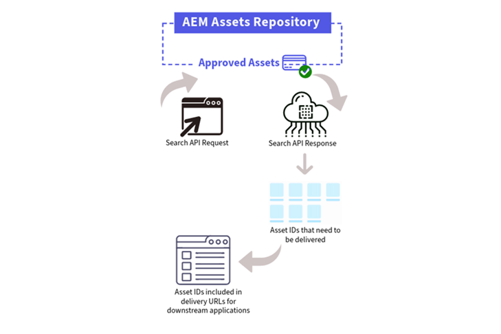

# API zum Durchsuchen von Assets {#search-assets-api}

Alle [genehmigten Assets](approve-assets.md), die im Experience Manager-Asset-Repository verfügbar sind, können durchsucht werden und anschließend mithilfe einer Bereitstellungs-URL an integrierte nachgelagerte Anwendungen gesendet werden.

Die Suche nach den richtigen genehmigten Assets im Experience Manager-Repository ist der erste Schritt bei der Bereitstellung von Assets mithilfe der Bereitstellungs-URL. Die Antwort auf die Suchanfrage umfasst ein Array von JSON-Dokumenten, die den Assets entsprechen, die die Suchkriterien erfüllt haben. Jedes JSON-Dokument wird mithilfe eines `id`-Feldes identifiziert, das zum Erstellen der Asset-Bereitstellungsanfrage verwendet wird.



Sie können Eigenschaften in der Anfrage der API zum Durchsuchen von Assets definieren, um die folgenden Funktionen zu aktivieren:

* **Volltextsuche durchführen**: Verwenden Sie die `match`-Abfrage, um den zu suchenden Text zu definieren.  Sie können außerdem die Ergebnisse mithilfe von Operatoren innerhalb der `match`-Abfrage filtern.

* **Filter anwenden**: Verwenden Sie die `term`-Abfrage, um die Ergebnisse weiter zu filtern, indem Sie einen `key` und einen oder mehrere Werte definieren. `key` gibt das Feld an, dessen Wert abgeglichen werden muss, und `value` bestimmt, womit abgeglichen werden soll. Auf ähnliche Weise können Sie mit der `range`-Abfrage einen Bereich für ein Feld definieren, indem Sie die Eigenschaften „Größer als“ (gt), „Größer gleich“ (gte), „Kleiner als“ (lt) und „Kleiner gleich“ (lte) verwenden.

* **Ergebnisse sortieren**: Verwenden Sie die Eigenschaft `OrderBy`, um Suchergebnisse basierend auf einem oder mehreren Feldern zu sortieren. Sie können die Ergebnisse in auf- oder absteigender Reihenfolge sortieren.

* **Paginierung**: Verwenden Sie die Eigenschaften `limit` und `cursor`, um Paginierungseigenschaften in einer Such-API-Anfrage zu definieren. Die Eigenschaft `limit` definiert die maximale Anzahl von Elemente, die im Rahmen einer API-Antwort abgerufen werden soll. Die Eigenschaft `cursor` vereinfacht den Abruf des Startpunkts für den nächsten Satz von Assets, der in der Eigenschaft `limit` definiert ist. Wenn Sie beispielsweise `50` als Limit in der API-Anfrage definieren, können Sie mit der Eigenschaft `cursor` die nächsten 50 Elemente mit der nächsten API-Anfrage abrufen.

## Endpunkt bei der API zum Durchsuchen von Assets {#search-assets-api-endpoint}

Der -Endpunkt in einer Anfrage zur Assets-API für die Suche muss im folgenden Format vorliegen:


Die Bereitstellungs-Domain ähnelt der Struktur der Domain der Autorenumgebung von Experience Manager. Der einzige Unterschied ist das Ersetzen des Begriffs `author` durch `delivery`.

`pXXXX` bezeichnet die Programm-ID

`eYYYY` bezeichnet die Umgebungs-ID

## Anfragemethode der API zum Durchsuchen von Assets {#search-assets-api-request-method}

POST

## Header der API zum Durchsuchen von Assets {#search-assets-api-header}

Beim Definieren eines Headers in der API zum Durchsuchen von Assets müssen Sie die folgenden Details angeben:

```java
headers: {
      'Content-Type': 'application/json',
      'X-Adobe-Accept-Experimental': '1',
      Authorization: 'Bearer <YOUR_JWT_HERE>',
      'X-Api-Key': 'YOUR_API_KEY_HERE'
    },
```

Um die Such-API aufzurufen, ist ein IMS-Token erforderlich, das in den `Authorization`-Details definiert wird. Das IMS-Token wird aus einem technischen Konto abgerufen. Informationen zum Erstellen eines neuen technischen Kontos finden Sie unter [Abrufen der Anmeldedaten für AEM as a Cloud Service](https://experienceleague.adobe.com/docs/experience-manager-cloud-service/content/implementing/developing/generating-access-tokens-for-server-side-apis.html?lang=de#fetch-the-aem-as-a-cloud-service-credentials). Informationen zum Generieren des IMS-Tokens und zu seiner entsprechenden Verwendung im Anfrage-Header der API zum Durchsuchen von Assets finden Sie unter [Generieren des Zugriffs-Tokens](https://experienceleague.adobe.com/docs/experience-manager-cloud-service/content/implementing/developing/generating-access-tokens-for-server-side-apis.html?lang=de#generating-the-access-token).

Anfragebeispiele, Antwortbeispiele und Antwort-Codes finden Sie unter [API zum Durchsuchen von Assets](https://developer.adobe.com/experience-cloud/experience-manager-apis/api/stable/assets/delivery/#operation/search).

## Häufig gestellte Fragen {#faqs-search-assets-apis}

### Was ist die Assets-API für die Suche in Dynamic Media mit OpenAPI und was bewirkt sie? {#search-assets-api-overview}

Die Assets-API für Dynamic Media mit OpenAPI-Suche ermöglicht die Suche nach genehmigten Assets im Adobe Experience Manager Assets-Repository und deren Bereitstellung für integrierte nachgelagerte Anwendungen mithilfe einer Bereitstellungs-URL. Die Suche nach genehmigten Assets ist der erste Schritt im Versand-Workflow - die API-Antwort gibt ein Array von JSON-Dokumenten für jedes Asset zurück, das die Suchkriterien erfüllt. Jedes Asset wird durch ein ID-Feld identifiziert, das zum Erstellen der Asset-Bereitstellungsanfrage verwendet wird. Die Assets-API für die Suche unterstützt die Volltextsuche, die filterbasierte Suche, die Ergebnissortierung und die Paginierung innerhalb einer einzigen Anfrage.

### Welche Suchfunktionen unterstützt die Assets-API für die Suche? {#search-assets-api-capabilities}

Die Assets-API für Dynamic Media mit OpenAPI-Suche unterstützt vier Kernsuchfunktionen. Die Volltextsuche verwendet die Übereinstimmungsabfrage, um nach Text zu suchen, und unterstützt Operatoren zum Filtern von Ergebnissen. Die filterbasierte Suche verwendet den Begriff „Abfrage“, um die Ergebnisse nach einem Schlüssel und einem oder mehreren Werten zu filtern, oder den Abfragebereich, um nach einem Wertebereich mit Operatoren „größer als“, „größer als oder gleich“, „kleiner als“ und „kleiner als oder gleich“ zu filtern. Bei der Ergebnissortierung wird die OrderBy-Eigenschaft verwendet, um die Ergebnisse anhand eines oder mehrerer Felder in auf- oder absteigender Reihenfolge zu sortieren. Die Paginierung verwendet die Limit- und Cursor-Eigenschaften, um die Anzahl der pro Anfrage zurückgegebenen Ergebnisse zu steuern und nachfolgende Ergebnisseiten abzurufen.

### Wie führe ich eine Volltextsuche mithilfe der Assets-API durch? {#search-assets-api-full-text-search}

Die Volltextsuche in Dynamic Media mit der OpenAPI Search Assets-API wird mithilfe der Match-Abfrageeigenschaft im Anfrageinhalt durchgeführt. Definieren Sie den zu suchenden Text innerhalb der Übereinstimmungsabfrage. Operatoren können auch innerhalb der Abfrage Übereinstimmung verwendet werden, um die zurückgegebenen Ergebnisse weiter zu filtern. Die Übereinstimmungsabfrage sucht im AEM Assets-Repository nach genehmigten Assets und gibt ein JSON-Array mit übereinstimmenden Assets zurück, die jeweils durch ein ID-Feld identifiziert werden, aus dem die Versand-URL besteht.

### Wie filtere ich Suchergebnisse mithilfe der Assets-API? {#search-assets-api-filters}

Die Assets-API für Dynamic Media mit OpenAPI-Suche unterstützt zwei Filterabfragetypen. Der Begriff Abfragefilter filtert Ergebnisse, indem ein Schlüssel - der das abzugleichende Feld identifiziert - und ein oder mehrere Werte, mit denen abgeglichen werden soll, angegeben werden. Der Abfragebereich filtert Ergebnisse für ein bestimmtes Feld mithilfe eines definierten Bereichs mit den folgenden Operatoren: Größer als (gt), Größer als oder gleich (get), Kleiner als (lt) und Kleiner als oder gleich (lte). Beide Abfragetypen können innerhalb derselben API-Anfrage verwendet werden, um mehrere Filter gleichzeitig anzuwenden.

### Wie funktioniert die Paginierung in der Assets-API? {#search-assets-api-pagination}

Die Paginierung in Dynamic Media mit der OpenAPI-Such-Assets-API wird über zwei Eigenschaften in der Anfrage gesteuert: limit und cursor. Die Limit-Eigenschaft definiert die maximale Anzahl von Assets, die in einer einzelnen API-Antwort abgerufen werden sollen. Die Cursor-Eigenschaft definiert den Ausgangspunkt für die nächste Gruppe von Assets basierend auf dem definierten Limit. Wenn Sie beispielsweise in der ersten Anfrage ein Limit von 50 festlegen, werden die ersten 50 übereinstimmenden Assets zurückgegeben. Die Cursor-Eigenschaft in der nächsten Anfrage ruft dann die folgenden 50 Assets ab, was das sequenzielle Durchlaufen großer Ergebnismengen ermöglicht.

### Wie sortiere ich die von der Assets-API zurückgegebenen Suchergebnisse? {#search-assets-api-sort}

Die Suchergebnisse in Dynamic Media mit der OpenAPI-Such-Assets-API werden anhand der OrderBy-Eigenschaft im Anfragetext sortiert. Geben Sie in der OrderBy-Eigenschaft ein oder mehrere Felder an, um die Ergebnisse zu sortieren. Die Sortierung kann in auf- oder absteigender Reihenfolge angewendet werden. Es können mehrere Sortierfelder kombiniert werden, um eine mehrschichtige Sortierung über die von der API zurückgegebenen Suchergebnisse hinweg anzuwenden.

### Welches Endpunktformat hat die Assets-Such-API? {#search-assets-api-endpoint=faqs}

Der Assets-API-Endpunkt Dynamic Media mit OpenAPI Search muss folgendes Format aufweisen: https://delivery-pXXXX-eYYYY.adobeaemcloud.com/adobe/assets/search. Die Bereitstellungs-Domain ist ähnlich wie die Domain der AEM-Autorenumgebung strukturiert - der einzige Unterschied besteht darin, den Begriff „Autor“ durch „Versand“ zu ersetzen. In der URL bezieht sich pXXXX auf die Programm-ID und eJJJJ auf die Umgebungs-ID. Die Assets-API für die Suche verwendet die HTTP-POST-Anfragemethode.

### Welche Kopfzeilen sind erforderlich, um die Assets-API für die Suche aufzurufen? {#search-assets-api-headers}

Die Assets-API für Dynamic Media mit OpenAPI-Suche erfordert vier Header-Felder: Content-Type mit application/json, X-Adobe-Accept-Experimental mit 1, Authorization as a Bearer-Token mit dem IMS-Token und X-API-Key mit dem API-Schlüssel. Das IMS-Token wird aus einem technischen Konto abgerufen, das mithilfe des Workflows AEM as a Cloud Service-Anmeldeinformationen erstellt wurde. Das technische Konto muss erstellt und das Zugriffstoken muss generiert werden, bevor die Assets-API für die Suche aufgerufen werden kann.

### Welche Rolle spielt das Feld ID in der Antwort der Assets-API für die Suche? {#search-assets-api-response-id}

Jedes JSON-Dokument in der Assets-API-Antwort auf die Suche entspricht einem Asset, das die Suchkriterien erfüllt und durch ein ID-Feld identifiziert wird. Dieses ID-Feld ist die Asset-Kennung, die zum Erstellen der Asset-Bereitstellungsanfrage verwendet wird - sie wird als assetId-Parameter in Dynamic Media mit der OpenAPI-Bereitstellungs-API-Endpunkt-URL übergeben. Die Erfassung der ID aus der Suchantwort ist ein erforderlicher Schritt im End-to-End-Workflow, bei dem über eine Versand-URL nach einem genehmigten Asset gesucht und dieses dann bereitgestellt wird.