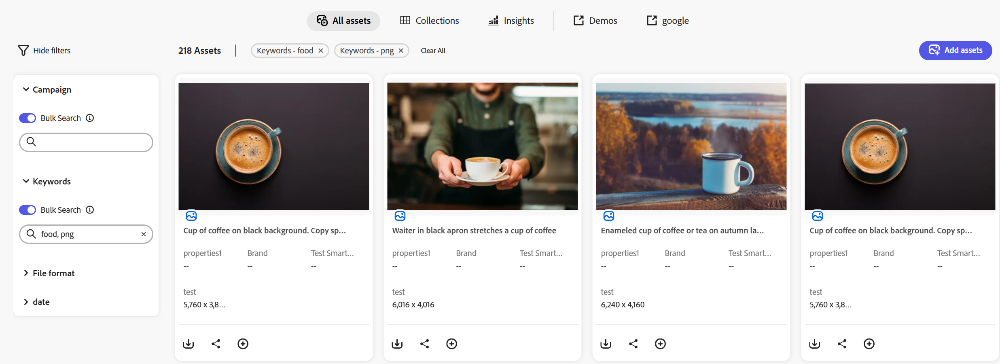

# Suchen nach Assets in [!DNL Content Hub] {#search-assets}

Wenn Sie über eine große Anzahl von Assets in Ihrem Repository verfügen, kann die Suche nach dem richtigen Asset zeitaufwendig sein. Mit der Suche in [!DNL The Content Hub] können Sie nach den genehmigten Assets suchen, damit Sie zusätzliche Aktionen für sie ausführen können, z. B. Sammlungen herunterladen, freigeben oder erstellen. Sie können verschiedene Funktionen nutzen, um Ihre Suchergebnisse einzugrenzen, z. B. die textbasierte Suche, die Verwendung von Filtern, die Durchführung von Tag- oder Smart-Tag-spezifischen Suchen sowie die Suche nach einem bestimmten Dateiformat.

## Voraussetzungen {#prerequisites}

[Content Hub-Benutzende](deploy-content-hub.md#onboard-content-hub-users) können die in diesem Artikel genannten Aktionen ausführen.

## Sie können nach Folgendem suchen  {#what-you-can-search}

Die Suche in [!DNL Content Hub] bietet Ergebnisse basierend auf Folgendem:

* **Übereinstimmender Text:** Mit der Suche in [!DNL Content Hub] können Sie anhand des Namens oder der Beschreibung nach einem Asset suchen. Sie können eine auf einem Suchbegriff basierende Suche durchführen, bei der der Suchbegriff mit dem in den Eigenschaften eines Assets verfügbaren Text verglichen wird.

* **Übereinstimmender Kontext:**: Die Ergebnisliste der Suche in [!DNL Content Hub] enthält ungefähre Ergebnisse von Assets, die Sie basierend auf dem übereinstimmenden Kontext erhalten. Wenn Sie beispielsweise `cool` in die Suchleiste eingeben, werden die mit `winter`, `snow`, `cold surroundings` verbundenen Assets in der Suchliste angezeigt.

* **Asset-Informationen (Titel, Tags oder Smart-Tags):** [!DNL Content Hub] verwendet einen intelligenten Suchalgorithmus, um die Suchergebnisse präzise und so relevant wie möglich hierarchisch zu sortieren. [Metadaten](#asset-properties.md) stellen die Sammlung aller für ein Asset verfügbaren Daten dar, sind aber nicht unbedingt im Asset selbst enthalten. [Sie helfen Ihnen dabei, Assets genauer einzuteilen. Außerdem erweisen sie sich als nützlich, wenn die Menge digitaler Informationen ansteigt](/help/assets/configure-content-hub-ui-options.md##configure-metadata-search-content-hub).

* **Datum der letzten Änderung:** Die zuletzt geänderten Assets werden oben in der Liste der Suchergebnisse angezeigt. Sie können den Datumsbereich auch nach Bedarf filtern.

* **Nutzung:** Die häufig verwendeten Assets werden oben in der Suchliste angezeigt.

* **Suchverlauf:** Klicken Sie in das Suchfeld, ohne ein Zeichen einzugeben, um Ihren Suchverlauf abzurufen. Sie können auch einen bestimmten Suchbegriff aus dem Verlauf entfernen. Der Suchverlauf wird im Cache-Speicher eines Webbrowsers gespeichert. Das bedeutet, dass Sie den Suchverlauf nicht mehr anzeigen können, wenn Sie in einem anderen Browser auf die Suche in [!DNL Content Hub] zugreifen oder den Cache-Speicher des Browsers leeren.

* **Suche während der Eingabe:** Die Suche in [!DNL Content Hub] verbessert Ihr Sucherlebnis, indem mit Beginn Ihrer Eingabe Vorschläge für die automatische Vervollständigung angezeigt werden.

## Einfache Suche {#basic-search}

Um eine einfache Suche in [!DNL the Content Hub] durchzuführen, navigieren Sie zur Suchleiste und geben Sie den Suchbegriff an, nach dem Sie suchen müssen. Navigieren Sie zu den im linken Bereich verfügbaren Filtern und wenden Sie sie an, um Ihre Suchergebnisse einzugrenzen.

Suchen Sie beispielsweise nach allen **[!UICONTROL JPEG]**-Bildern mit dem Suchbegriff `architect` darin, der im letzten Jahr geändert wurde. Gehen Sie für die Durchführung dieses Szenarios wie folgt vor:

1. Geben Sie `architect` als Suchbegriff an.

1. Navigieren Sie zum Bedienfeld „Filter“ > **[!UICONTROL Format]** und wählen Sie **[!UICONTROL JPEG]** aus.

1. Navigieren Sie zu **[!UICONTROL Geändert]** > und geben Sie den Datumsbereich an.

   

## Eingrenzen Ihrer Suchergebnisse mithilfe von Filtern {#narrow-down-search-results}

Verwenden Sie das Bedienfeld „Filter“, um nach auf Metadaten basierenden Assets zu suchen. Sie können Suchergebnisse anhand verschiedener Suchprädikate filtern. Sie können alle passenden Eigenschaften auswählen, um Ihre Suchergebnisse zu minimieren oder einzugrenzen. Sie können beim Filtern Ihrer Suchergebnisse mehr als 10 Prädikate auswählen. Wenn Sie mehrere Optionen in einem Filter auswählen, zeigt Content Hub die Assets an, die mit einer der in einem Filter ausgewählten Optionen übereinstimmen. Wenn Sie jedoch mehrere Optionen in verschiedenen Filtern auswählen, zeigt Content Hub nur die Assets an, die mit allen Optionen übereinstimmen, die in allen Filtern ausgewählt wurden, um Ihre Suchergebnisse einzugrenzen.

Zu den Standardfiltern gehören „Dateiformat“, „Genehmigt von“, „Datum der Genehmigung“, „Abgelaufene Assets“, „Nicht abgelaufene Assets“ sowie „Ablaufdatum“. Admins können auch die Filter konfigurieren, die in der Filterliste angezeigt werden. Weitere Informationen finden Sie unter [Konfigurieren der Benutzeroberfläche von Content Hub](configure-content-hub-ui-options.md#configure-filters-content-hub).

## KI-Suche in Content Hub {#ai-search-aem-assets-content-hub}

KI-Suchen in AEM Assets Content Hub ist eine erweiterte Suchfunktion, die die Bedeutung und den Zweck der Abfrage eines Benutzers versteht, anstatt sich auf exakte Keyword-Übereinstimmungen zu verlassen. Es nutzt künstliche Intelligenz (KI) und maschinelles Lernen, um genauere und kontextbezogene Ergebnisse zu liefern.

Im Gegensatz zur herkömmlichen schlüsselwortbasierten Suche, die nach exakten Begriffen sucht, interpretiert die KI-Suche die Beziehungen zwischen Wörtern, Konzepten und der Absicht der Benutzenden. Dadurch wird sichergestellt, dass Benutzende das Gesuchte finden – selbst wenn die Abfrage anders formuliert ist, Tippfehler enthält oder in einer anderen Sprache verfasst ist.

Zu den wichtigsten Vorteilen zählen:

* **Mehrsprachiger Support**: Suchen Sie über mehrere Sprachen hinweg, ohne dass genaue Übersetzungen erforderlich sind. Benutzende können relevante Inhalte unabhängig von ihrer Abfragesprache finden.

* **Behandelt Rechtschreibfehler**: Interpretiert Tippfehler und Rechtschreibfehler, um sicherzustellen, dass auch bei unvollständiger Eingabe genaue Ergebnisse vorliegen.

* **Verständnis von Synonymen**: Ergebnisse für verwandte Begriffe und Ausdrücke werden bereitgestellt, sodass Benutzende nicht das korrekte Keyword erraten müssen.

* **Kontextuell relevante Suche**: Erkennt den Zweck hinter einer Abfrage, nicht nur die genauen Wörter.

### Beispiele für KI-Suchen in Content Hub {#examples-ai-search-aem-assets-content-hub}

**Beispiel-Prompt**: *Woman drinking coffee*

Die herkömmliche Keyword-basierte Suche sucht nach exakten Übereinstimmungen mit Asset-Metadaten wie `Woman`, `drinking` und `Coffee` und gibt Assets zurück, die alle diese Begriffe in den Metadaten enthalten.

KI-Suche gleicht jedoch ähnliche Begriffe wie `Girl` ab, `Lady` bei `Woman` und `Cappuccino` und `Latte` bei `Coffee`.

Genauso können Sie diesen Prompt auf Spanisch eingeben oder `Woman` fälschlicherweise als `Wman` schreiben und trotzdem dieselben Ergebnisse erhalten.

### Aktivieren oder Deaktivieren von KI-Suchen in Content Hub {#enable-disable-ai-search-content-hub}

Führen Sie die folgenden Schritte aus, um KI-Suchen in Content Hub zu aktivieren oder zu deaktivieren:

1. Navigieren Sie zu Ihrem Benutzerprofilsymbol und klicken Sie auf **[!UICONTROL Konfigurationen]**.

1. Wählen Sie auf der **[!UICONTROL Suche]** die Option **[!UICONTROL KI-Suche]** aus, um KI-Suchen für Content Hub zu aktivieren, oder **[!UICONTROL Keyword]**, um sie zu deaktivieren.

   

1. Klicken Sie auf **[!UICONTROL Speichern]**.

<!--

<table>
    <tbody>
     <tr>
      <th><strong>Search Predicate</strong></th>
      <th><strong>Description</strong></th>
      <th><strong>Properties</strong></th>
     </tr>
     <tr>
      <td> Campaigns </td>
      <td> Allows you to search using planned activity performed to take any particular action. For example, advertisement campaign run on Ferrari to know the understand the interests of people using number of clicks people perform.</td>
      <td>NA</td>
     </tr>
     <tr>
      <td> Channels </td>
      <td> Helps you to understand the path from where the asset is coming from. For example, web, social media, books, catalog, etc.</td>
      <td>NA</td>
     </tr>
     <tr>
      <td> Region </td>
      <td> Helps you to understand the location where the asset is created. For example, Japan, EMEA, Worldwide, etc.</td>
      <td>NA</td>
     </tr>
     <tr>
      <td> Keywords </td>
      <td> Keyword helps you search using terms or the words that you enter based on the topic. For example, images, low-resolution, etc.</td>
      <td>NA</td>
     </tr>
     <tr>
      <td> Timeframe </td>
      <td> Helps you search assets using timeline. For example, search by year 2024, Q3 2023, etc.</td>
      <td>NA</td>
     </tr>
     <tr>
      <td>File format</td>
      <td>Composition of an asset. The supported assets include image, document, video, printable media, and so on.</td>
      <td>
        <ul>
            <li>[!UICONTROL JPEG]</li> 
            <li>[!UICONTROL Quicktime]</li> 
            <li>[!UICONTROL PNG]</li> 
            <li>[!UICONTROL WebP]</li> 
            <li>[!UICONTROL MP4]</li> 
            <li>[!UICONTROL Plain]</li> 
            <li>[!UICONTROL PDF]</li>
            <li>[!UICONTROL SVG + XML]</li>
        </ul>
      </td>
     </tr>
     <tr>
      <td>Tags</td>
      <td>Tags help you categorize assets that can be browsed and searched more efficiently based on hierarchical taxonomies.</td>
      <td>
        <ul>
            <li>Field label</li>
            <li>Property name</li>
            <li>Path</li>
            <li>Description</li>
        </ul>
      </td>
     </tr>
     <tr>
      <td>Subject</td>
      <td>Classification of assets based on their theme. For example, colorful, hiking, outdoors.</td>
      <td>NA</td>
     </tr>
          <tr>
      <td>Last modified</td>
      <td>Search assets based on their last modification. Specify the date range using the Start date and End date fields.</td>
      <td>
        <ul>
            <li>Range text (From)</li> 
            <li>Range text (To) </li>
        </ul>
      </td>
     </tr>    
     <tr>
      <td>Asset ID</td>
      <td>Unique number that identifies the asset.</td>
      <td>NA</td>
     </tr>
     <tr>
      <td> Colors </td>
      <td> Helps you search assets using colors that are automatically identified in an asset using Adobe's AI capabilities.</td>
      <td>NA</td>
     </tr>  
    </tbody>
   </table>

-->

## Massensuche {#bulk-search}

Die Massensuche von Assets ermöglicht es Ihnen, mehrere Assets gleichzeitig zu suchen, indem Sie eine Liste von Bezeichnern (wie Namen, Dateiformate, Farben, Tags und mehr) eingeben. Anstatt immer nur hach einem einzigen Asset zu suchen, können Sie mit der Massensuche von [!DNL Content Hub] schneller die benötigten Assets finden. Mit dieser Funktion können Sie mehrere Werte für eine beliebige Filtereigenschaft eingeben – durch ein Trennzeichen getrennt (z. B. mehrere SKU-IDs) – und sofort alle übereinstimmenden Assets mit einem einzigen Suchvorgang abrufen.

Um nach mehreren Assets gleichzeitig zu suchen, geben Sie mehrere Werte in eine einzelne Abfrage ein, indem Sie sie durch Trennzeichen ` [ , | \t | \r | \n | \r\n ]` trennen. Je nach Anwendungsfall können Sie auch weitere Trennzeichen hinzufügen. Siehe [Konfigurieren der Massensuche](configure-content-hub-ui-options.md#bulk-search-configuration).

Um die Massensuche in [!DNL Content Hub] durchzuführen, gehen Sie wie folgt vor:

1. Sobald die Massensuche [konfiguriert](configure-content-hub-ui-options.md#bulk-search-configuration) ist, wird in den von Ihnen konfigurierten [!DNL Content Hub]-Filtereigenschaften der Umschalter für die Massensuche angezeigt. Sie können ihn nach Bedarf aktivieren oder deaktivieren.

1. Fügen Sie eine Suchabfrage mit Trennzeichen hinzu, die in der Konfiguration angegeben sind. Die Suchabfrage sollte eine Zeichenfolge und mehrere kommagetrennte Werte enthalten.

## Konfigurieren der Sortierung in Content Hub {#configure-sorting-aem-assets-content-hub}

Content Hub bietet vordefinierte Sortieroptionen, mit denen Benutzer Asset-Suchergebnisse organisieren können. Admins können auch benutzerdefinierte Metadatenfelder als Sortieroptionen aktivieren, damit Benutzende Assets basierend auf geschäftsspezifischen Metadaten wie Kanal, Region, SKU oder Kampagne sortieren können.

### Standardmäßige Sortieroptionen {#default-sorting-options}

Standardmäßig umfasst Content Hub die folgenden Sortieroptionen auf der Content Hub-Startseite:

* Größe

* Geändert

* Name

* Relevanz

### Hinzufügen benutzerdefinierter Metadatenfelder als Sortieroptionen {#add-custom-metadata-fields-for-sorting}

Admins können zusätzliche Metadatenfelder konfigurieren, die im Menü Sortierung angezeigt werden.

So aktivieren Sie ein Metadatenfeld für die Sortierung:

1. Klicken Sie auf das Benutzerprofilsymbol und wählen Sie **Konfigurationen** aus.
1. Navigieren Sie zur Registerkarte **Filter**.
1. Suchen Sie das Metadatenfeld, das Sie für die Sortierung aktivieren möchten.
1. Klicken Sie auf das Bearbeitungssymbol, das für dieses bestimmte Metadatenfeld verfügbar ist.
1. Aktivieren Sie im Dialogfeld Filter bearbeiten die Option **Sortieren**.
1. Klicken Sie **Bestätigen** und speichern Sie die Konfiguration. Die Aktualisierungen werden wirksam, wenn der **Status**-Feldwert für das Metadatenfeld als `Active` angezeigt wird.

Wenn Sie beispielsweise die Sortierung für das Kanal-Metadatenfeld aktivieren, können Benutzerinnen und Benutzer die Asset-Ergebnisse mithilfe des Kanalwerts sortieren.

### Verwenden benutzerdefinierter Sortieroptionen auf der Content Hub-Startseite {#use-custom-sorting-options}

Nachdem Sie die Sortierung für ein Metadatenfeld aktiviert haben:

* Das Feld wird im Menü Sortierung auf der Content Hub-Startseite angezeigt.
* Benutzerdefinierte Sortierfelder werden im Menü Sortieren unter einer Trennlinie angezeigt.
* Das Trennzeichen unterscheidet visuell zwischen vom Administrator konfigurierten benutzerdefinierten Feldern und den standardmäßigen vordefinierten Sortieroptionen.

Wenn beispielsweise das Kanal-Metadatenfeld für die Sortierung aktiviert ist, wird das Sortiermenü angezeigt:

* Standardfelder wie Größe, Geändert, Name und Relevanz
* Eine Trennlinie
* Der Kanal des benutzerdefinierten Feldes

Diese Unterscheidung hilft Benutzenden, schnell die standardmäßigen Sortieroptionen gegenüber den organisationsspezifischen metadatenbasierten Sortieroptionen zu identifizieren.

## Weitere Aktionen bei der Suche {#do-more-with-search}

[!DNL The Content Hub] ist nicht auf die Suche beschränkt, sondern Sie können direkt über die Benutzeroberfläche der Suche oder der Vorschau auch zusätzliche Aktionen ausführen, wie z. B. [Herunterladen](download-assets-content-hub.md), [Freigeben](share-assets-content-hub.md) und [Assets zur Sammlung hinzufügen](collections-content-hub.md). Wählen Sie die Assets auf der Seite mit den Suchergebnissen aus, um diese Optionen anzuzeigen.

Erfahren Sie mehr über das [Konfigurieren von Assets in  [!DNL Content Hub]](configure-content-hub-ui-options.md).

## Häufig gestellte Fragen {#faqs-deploy-content-hub}

### Wie kann ich meine Suchergebnisse in AEM Assets Content Hub eingrenzen?

Sie können die Suchergebnisse in AEM Assets Content Hub einschränken, indem Sie die textbasierte Suche verwenden, verschiedene Filter (wie Dateiformat, Genehmigungsstatus, Änderungsdatum usw.) anwenden, nach Tags oder Smart-Tags suchen und das Bedienfeld „Filter“ verwenden. Die Kombination mehrerer Prädikate oder Filteroptionen hilft Ihnen, die benötigten Assets genau anzusprechen.

### Kann ich in AEM Assets Content Hub eine Massensuche nach mehreren Assets gleichzeitig durchführen?

Ja, Sie können in AEM Assets Content Hub eine Massensuche durchführen, indem Sie mehrere Werte (z. B. Namen, Dateiformate, Tags) eingeben, die durch angegebene Trennzeichen getrennt sind. Die Funktion für die Massensuche ermöglicht es Ihnen, schnell mehrere Assets in einer einzigen Abfrage zu finden, was sie effizienter macht, als Assets einzeln zu suchen.

### Können Admins die in der AEM Assets Content Hub-Suche verfügbaren Filter anpassen?

Ja, Administratoren können die Benutzeroberfläche für die Konfiguration von AEM Assets Content Hub verwenden, um zu konfigurieren, welche Filter in der Suchoberfläche verfügbar sind. Während Standardfilter das Dateiformat, den Genehmigungsstatus, das Ablaufdatum und mehr umfassen, können Admins diese Optionen an die Anforderungen Ihres Unternehmens anpassen.

**Siehe auch**

* [Assets übersetzen](/help/assets/translate-assets.md)
* [Assets-HTTP-API](/help/assets/mac-api-assets.md)
* [Von AEM Assets unterstützte Dateiformate](/help/assets/file-format-support.md)
* [Suchen von Assets](/help/assets/search-assets.md)
* [Connected Assets](/help/assets/use-assets-across-connected-assets-instances.md)
* [Asset-Berichte](/help/assets/asset-reports.md)
* [Metadatenschemata](/help/assets/metadata-schemas.md)
* [Herunterladen von Assets](/help/assets/download-assets-from-aem.md)
* [Verwalten von Metadaten](/help/assets/manage-metadata.md)
* [Verwalten von Dynamic Media-Vorlagen](/help/assets/dynamic-media/manage-dynamic-media-templates.md)
* [Verwalten von Berichten](/help/assets/manage-reports-assets-view.md)
* [Suchfacetten](/help/assets/search-facets.md)
* [Verwalten von Sammlungen](/help/assets/manage-collections.md)
* [Massenimport von Metadaten](/help/assets/metadata-import-export.md)
* [Veröffentlichen von Assets in AEM und Dynamic Media](/help/assets/publish-assets-to-aem-and-dm.md)

