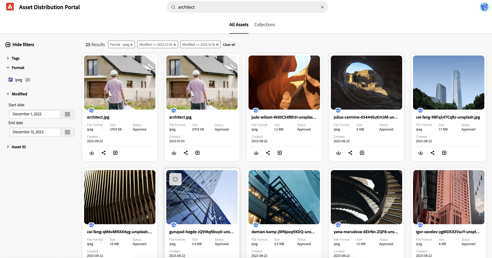

# Assets in [!DNL Content Hub] durchsuchen {#search-assets}

>[!AVAILABILITY]
>
>Das Content Hub-Handbuch ist jetzt im PDF-Format verfügbar. Laden Sie das gesamte Handbuch herunter und verwenden Sie den Adobe Acrobat AI-Assistenten, um Ihre Fragen zu beantworten.
>
>[!BADGE Content Hub Guide PDF]{type=Informative url="https://helpx.adobe.com/content/dam/help/en/experience-manager/aem-assets/content-hub.pdf"}

Wenn Sie eine große Anzahl von Assets in Ihrem Repository haben, ist die Suche nach dem richtigen Asset zeitaufwendig. Mit der Suche [!DNL The Content Hub] können Sie nach den genehmigten Assets suchen, damit Sie zusätzliche Aktionen für sie ausführen können, z. B. Sammlungen herunterladen, freigeben oder erstellen. Sie können verschiedene Funktionen nutzen, um Ihre Suchergebnisse einzugrenzen, z. B. die textbasierte Suche, die Verwendung von Filtern, die Durchführung von Tags oder die Suche nach Smart-Tags, die Suche nach einem bestimmten Dateiformat usw.

## Voraussetzungen {#prerequisites}

[Content Hub-Benutzer](deploy-content-hub.md#onboard-content-hub-users) können die in diesem Artikel erwähnten Aktionen ausführen.

## Was Sie suchen können  {#what-you-can-search}

Die Suche [!DNL Content Hub] bietet Ergebnisse basierend auf:

* **Entsprechender Text:** Mit der [!DNL Content Hub]-Suche können Sie anhand des Namens oder der Beschreibung nach einem Asset suchen. Sie können eine schlüsselwortbasierte Suche durchführen, bei der der Suchbegriff mit dem in den Eigenschaften eines Assets verfügbaren Text verglichen wird.

* **Übereinstimmungskontext:** [!DNL Content Hub] Suchergebnisliste enthält ungefähr Ergebnisse von Assets, die Sie basierend auf dem entsprechenden Kontext erhalten. Wenn Sie beispielsweise `cool` in die Suchleiste eingeben, werden die mit `winter`, `snow`, `cold surroundings` verbundenen Assets in der Suchliste angezeigt.

* **Asset-Informationen (Titel, Tags oder Smart-Tags):** [!DNL Content Hub] verwendet den Smart-Search-Algorithmus, um Suchergebnisse präzise und so relevant wie möglich zu ordnen. [Metadaten](#asset-properties.md) ist die Sammlung aller für ein Asset verfügbaren Daten, die jedoch nicht unbedingt in diesem Asset enthalten sein müssen. [Es hilft Ihnen bei der weiteren Kategorisierung von Assets und ist hilfreich, wenn die Menge an digitalen Informationen zunimmt](/help/assets/configure-content-hub-ui-options.md##configure-metadata-search-content-hub).

* **Datum der letzten Änderung:** Die zuletzt geänderten Assets werden oben in der Liste der Suchergebnisse angezeigt. Sie können den Datumsbereich auch nach Bedarf filtern.

* **Nutzung:** Die häufig verwendeten Assets werden oben in der Suchliste angezeigt.

* **Suchverlauf:** Klicken Sie in das Suchfeld, ohne ein Zeichen einzugeben, um Ihren Suchverlauf abzurufen. Sie können auch einen bestimmten Suchbegriff aus dem Verlauf entfernen. Der Suchverlauf wird im Cache-Speicher eines Webbrowsers gespeichert. Das bedeutet, dass Sie den Suchverlauf nicht mehr anzeigen können, wenn Sie in einem anderen Browser auf die [!DNL Content Hub]-Suche zugreifen oder den Cache-Speicher des Browsers leeren.

* **Suche während der Eingabe:** Die [!DNL Content Hub]-Suche verbessert Ihr Sucherlebnis, indem Sie beim Eingeben Vorschläge für die automatische Vervollständigung machen.

## Einfache Suche {#basic-search}

Um eine einfache Suche für [!DNL the Content Hub] durchzuführen, navigieren Sie zur Suchleiste und geben Sie den Suchbegriff an, den Sie suchen müssen. Navigieren Sie zu den im linken Bereich verfügbaren Filtern und wenden Sie sie an, um Ihre Suchergebnisse einzugrenzen.

Suchen Sie beispielsweise nach allen **[!UICONTROL JPEG]** -Bildern mit dem Suchbegriff `architect` darin, der im letzten Jahr geändert wurde. Führen Sie die folgenden Schritte aus, um dieses Szenario auszuführen:

1. Geben Sie `architect` als Suchschlüsselwort an.

1. Navigieren Sie zum Filterbedienfeld > **[!UICONTROL Format]** > wählen Sie **[!UICONTROL JPEG]** aus.

1. Navigieren Sie zu **[!UICONTROL Modified]** > geben Sie den Datumsbereich an.

   

## Schränken Sie Ihre Suchergebnisse mithilfe von Filtern ein. {#narrow-down-search-results}

Verwenden Sie das Bedienfeld Filter , um basierend auf Metadaten nach Assets zu suchen. Sie können Suchergebnisse anhand verschiedener Sucheigenschaften filtern. Sie können alle geeigneten Eigenschaften auswählen, um Ihre Suchergebnisse zu minimieren oder einzuschränken. Wenn Sie mehrere Optionen in einem Filter auswählen, zeigt Content Hub die Assets an, die mit einer der in einem Filter ausgewählten Optionen übereinstimmen. Wenn Sie jedoch mehrere Optionen über Filter hinweg auswählen, zeigt Content Hub nur die Assets an, die mit allen über Filter hinweg ausgewählten Optionen übereinstimmen, um Ihre Suchergebnisse einzugrenzen.

Die Standardfilter enthalten das Dateiformat, das Datum der Genehmigung, das Datum der Genehmigung, abgelaufene und nicht abgelaufene Assets sowie das Ablaufdatum. Administratoren können auch die Filter konfigurieren, die in der Filterliste angezeigt werden. Weitere Informationen finden Sie unter [Konfigurieren der Content Hub-Benutzeroberfläche](configure-content-hub-ui-options.md#configure-filters-content-hub).

<!--

<table>
    <tbody>
     <tr>
      <th><strong>Search Predicate</strong></th>
      <th><strong>Description</strong></th>
      <th><strong>Properties</strong></th>
     </tr>
     <tr>
      <td> Campaigns </td>
      <td> Allows you to search using planned activity performed to take any particular action. For example, advertisement campaign run on Ferrari to know the understand the interests of people using number of clicks people perform.</td>
      <td>NA</td>
     </tr>
     <tr>
      <td> Channels </td>
      <td> Helps you to understand the path from where the asset is coming from. For example, web, social media, books, catalog, etc.</td>
      <td>NA</td>
     </tr>
     <tr>
      <td> Region </td>
      <td> Helps you to understand the location where the asset is created. For example, Japan, EMEA, Worldwide, etc.</td>
      <td>NA</td>
     </tr>
     <tr>
      <td> Keywords </td>
      <td> Keyword helps you search using terms or the words that you enter based on the topic. For example, images, low-resolution, etc.</td>
      <td>NA</td>
     </tr>
     <tr>
      <td> Timeframe </td>
      <td> Helps you search assets using timeline. For example, search by year 2024, Q3 2023, etc.</td>
      <td>NA</td>
     </tr>
     <tr>
      <td>File format</td>
      <td>Composition of an asset. The supported assets include image, document, video, printable media, and so on.</td>
      <td>
        <ul>
            <li>[!UICONTROL JPEG]</li> 
            <li>[!UICONTROL Quicktime]</li> 
            <li>[!UICONTROL PNG]</li> 
            <li>[!UICONTROL WebP]</li> 
            <li>[!UICONTROL MP4]</li> 
            <li>[!UICONTROL Plain]</li> 
            <li>[!UICONTROL PDF]</li>
            <li>[!UICONTROL SVG + XML]</li>
        </ul>
      </td>
     </tr>
     <tr>
      <td>Tags</td>
      <td>Tags help you categorize assets that can be browsed and searched more efficiently based on hierarchical taxonomies.</td>
      <td>
        <ul>
            <li>Field label</li>
            <li>Property name</li>
            <li>Path</li>
            <li>Description</li>
        </ul>
      </td>
     </tr>
     <!--<tr>
      <td>Subject</td>
      <td>Classification of assets based on their theme. For example, colorful, hiking, outdoors.</td>
      <td>NA</td>
     </tr>
          <tr>
      <td>Last modified</td>
      <td>Search assets based on their last modification. Specify the date range using the Start date and End date fields.</td>
      <td>
        <ul>
            <li>Range text (From)</li> 
            <li>Range text (To) </li>
        </ul>
      </td>
     </tr>    
     <!--<tr>
      <td>Asset ID</td>
      <td>Unique number that identifies the asset.</td>
      <td>NA</td>
     </tr>
     <tr>
      <td> Colors </td>
      <td> Helps you search assets using colors that are automatically identified in an asset using Adobe's Sensei AI capabilities.</td>
      <td>NA</td>
     </tr>  
    </tbody>
   </table>

-->

## Weitere Informationen zur Suche {#do-more-with-search}

[!DNL The Content Hub] ist nicht auf die Suche beschränkt. Stattdessen können Sie zusätzliche Aktionen ausführen, wie z. B. [Download](download-assets-content-hub.md), [Freigabe](share-assets-content-hub.md) und [Hinzufügen von Assets zur Sammlung](collections-content-hub.md) direkt über die Such- oder Vorschaufunktion. Wählen Sie die Assets auf der Suchergebnisseite aus, um diese Optionen anzuzeigen.
