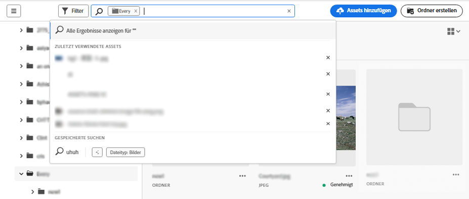
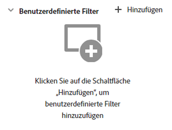
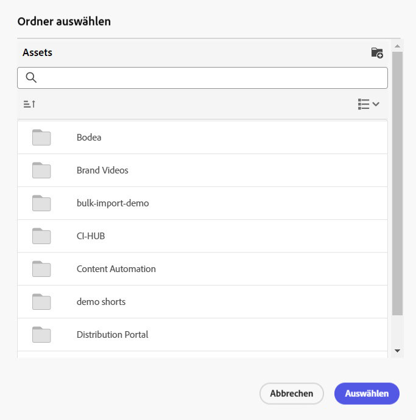
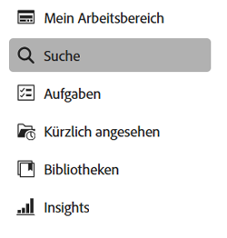

# Suchen nach Assets in [!DNL Assets view] {#search-assets}

>[!CONTEXTUALHELP]
>id="assets_search"
>title="Suchen nach Assets"
>abstract="Sie können nach Assets suchen, indem Sie ein Keyword in der Suchleiste eingeben oder Assets nach ihrem Status, Dateityp, MIME-Typ, Erstellungs-, Änderungs- und Ablaufdatum oder ihrer Größe filtern. Zusätzlich zu den Standardfiltern können Sie auch benutzerdefinierte Filter anwenden. Sie können die gefilterten Ergebnisse als gespeicherte Suche oder Smart-Sammlung speichern."
>additional-url="https://experienceleague.adobe.com/docs/experience-manager-assets-essentials/help/manage-collections.html?lang=de#manage-smart-collection" text="Erstellung von Smart-Sammlungen"

[!DNL Assets view] bietet eine effektive Suche, die einfach standardmäßig funktioniert. Die Suche ist umfassend, da es sich um eine Volltextsuche handelt. Mit der leistungsstarken Suchfunktion können Sie schnell das passende Asset ermitteln und die Geschwindigkeit Ihrer Inhaltserstellung steigern. [!DNL Assets view] bietet Volltextsuche und Suchvorgänge durch die Metadaten wie Smart-Tags, Titel, Erstellungsdatum und Copyright.

Um nach Assets zu suchen:

* klicken Sie oben auf der Seite in das Suchfeld. Standardmäßig wird innerhalb des Ordners gesucht, den Sie gerade durchsuchen. Führen Sie einen der folgenden Schritte aus:

  

   * Suchen Sie mithilfe eines Keywords und ändern Sie optional den Ordner. Drücken Sie die Eingabetaste.

   * Beginnen Sie die Arbeit mit einem kürzlich angezeigten Asset, indem Sie direkt danach suchen. Klicken Sie in das Suchfeld und wählen Sie aus den Vorschlägen ein kürzlich angezeigtes Asset aus.

## Filtern von Suchergebnissen {#refine-search-results}

Sie können die Suchergebnisse verfeinern, um relevante Assets zu finden, indem Sie mehrere Filter anwenden. Diese Filter, die von einem Administrator konfiguriert werden, basieren auf Dateien, Ordnern und Sammlungen. Siehe [Anpassen von ](custom-search-filters.md).

Sie können die Suchergebnisse anhand der folgenden Parameter filtern.

* Asset-Status: Filtern Sie die Suchergebnisse mithilfe eines der Asset-Status `Approved`, `Rejected` oder `No Status`.
* Dateityp: Filtern von Suchergebnissen nach den unterstützten Dateitypen: `Images`, `Documents` und `Videos`.
* MIME-Typ: Filtern nach einem oder mehreren der unterstützten Dateiformate. <!-- TBD:  [supported file formats](/help/using/supported-file-formats.md). -->
* Bildgrösse: Geben Sie eine oder mehrere der minimalen und maximalen Abmessungen zum Filtern von Bildern an. Die Größe wird in Pixeln angegeben und ist nicht die Dateigröße der Bilder.
* Erstellungsdatum: Das Erstellungsdatum des Assets, wie es in den Metadaten angegeben ist. Das verwendete Standarddatumsformat ist `yyyy-mm-dd`.
* Änderungsdatum: Das Datum der letzten Änderung der Assets. Das verwendete Standarddatumsformat ist `yyyy-mm-dd`.
* Ablaufdatum: Filtern Sie die Suchergebnisse anhand des Asset-Status `Expired`. Darüber hinaus können Sie einen Zeitraum für das Ablaufdatum für Assets angeben, um Ihre Suchergebnisse weiter zu filtern.
* Benutzerdefinierte Filter: [Hinzufügen benutzerdefinierter Filter](#custom-filters) zur Benutzeroberfläche der Assets-Ansicht. Sie können diese benutzerdefinierten Filter zusätzlich zu den Standardfiltern anwenden, um Ihre Suchergebnisse zu verfeinern.

Sie können die gesuchten Assets in aufsteigender oder absteigender Reihenfolge nach `Name`, `Relevance`, `Size`, `Modified` und `Created` sortieren. Die gesuchten Assets werden standardmäßig nach `Relevance` sortiert.

## Verwalten von benutzerdefinierten Filtern {#custom-filters}

**Erforderliche Berechtigungen:**  `Can Edit`, `Owner` oder Administrator.

Mit der Assets-Ansicht können Sie auch benutzerdefinierte Filter zur Benutzeroberfläche hinzufügen. Sie können diese benutzerdefinierten Filter dann zusätzlich zu den [Standardfiltern](#refine-search-results) anwenden, um Ihre Suchergebnisse zu verfeinern.

Die Assets-Ansicht bietet die folgenden benutzerdefinierten Filter:

<table>
    <tbody>
     <tr>
      <th><strong>Benutzerspezifischer Filtername</strong></th>
      <th><strong>Beschreibung</strong></th>
     </tr>
     <tr>
      <td>Titel</td>
      <td>Filtern Sie Assets unter Verwendung des Asset-Titels. Der Titel, den Sie in den Suchkriterien, die die Groß- und Kleinschreibung berücksichtigen, angeben, muss genau mit dem Titel des Assets übereinstimmen, damit es in den Ergebnissen angezeigt wird.</td>
     </tr>
     <tr>
      <td>Name</td>
      <td>Filtern Sie Assets unter Verwendung des Asset-Dateinamens. Der Name, den Sie in den Suchkriterien, die die Groß- und Kleinschreibung berücksichtigen, angeben, muss genau mit dem Namen des Assets übereinstimmen, damit es in den Ergebnissen angezeigt wird.</td>
     </tr>
     <tr>
      <td>Asset-Größe</td>
      <td>Filtern Sie Assets, indem Sie in den Suchkriterien für ein Asset, das in den Ergebnissen angezeigt werden soll, einen Größenbereich in Byte festlegen.</td>
     </tr>
     <tr>
      <td>Prognostizierte Tags</td>
      <td>Filtern Sie Assets unter Verwendung des Asset-Smart-Tags. Der Smart-Tag-Name, den Sie in den Suchkriterien, die die Groß- und Kleinschreibung berücksichtigen, angeben, muss genau mit dem Smart-Tag-Namen des Assets übereinstimmen, damit es in den Ergebnissen angezeigt wird. Sie können nicht mehrere Smart-Tags in den Suchkriterien angeben.</td>
     </tr>    
    </tbody>
   </table>

<!--
   You can use a wildcard operator (*) to enable Assets view to display assets in the results that partially match the search criteria. For example, if you define <b>ma*</b> as the search criteria, Assets view displays assets with title, such as, market, marketing, man, manchester, and so on in the results.

   You can use a wildcard operator (*) to enable Assets view to display assets in the results that partially match the search criteria.

   You can use a wildcard operator (*) to enable Assets view to display assets in the results that partially match the search criteria. You can specify multiple smart tags separated by a comma in the search criteria.

   -->

### Hinzufügen benutzerdefinierter Filter {#add-custom-filters}

Hinzufügen benutzerdefinierter Filter

1. Klicken Sie auf **[!UICONTROL Filter]**.

1. Klicken Sie im Abschnitt **[!UICONTROL Benutzerdefinierte Filter]** auf **[!UICONTROL Bearbeiten]** oder auf **[!UICONTROL Filter hinzufügen]**.

   

1. Wählen Sie im Dialogfeld **[!UICONTROL Verwaltung benutzerdefinierter Filter]** die Filter aus, die Sie der vorhandenen Filterliste hinzufügen möchten. Wählen Sie **[!UICONTROL Benutzerdefinierte Filter]** aus, um alle Filter auszuwählen.

1. Klicken Sie auf **[!UICONTROL Bestätigen]**, um die Filter zur Benutzeroberfläche hinzuzufügen.

### Entfernen benutzerdefinierter Filter {#remove-custom-filters}

Entfernen benutzerdefinierter Filter

1. Klicken Sie auf **[!UICONTROL Filter]**.

1. Klicken Sie im Abschnitt **[!UICONTROL Benutzerdefinierte Filter]** auf **[!UICONTROL Bearbeiten]**.

1. Heben Sie im Dialogfeld **[!UICONTROL Verwaltung benutzerdefinierter Filter]** die Auswahl der Filter auf, die Sie aus der Liste der vorhandenen Filter entfernen möchten.

1. Klicken Sie auf **[!UICONTROL Bestätigen]**, um die Filter aus der Benutzeroberfläche zu entfernen.

## KI-Suche {#ai-search}

Die KI-Suche ist eine erweiterte Suchfunktion, die die Bedeutung und den Zweck hinter der Abfrage eines Benutzers versteht, anstatt sich auf exakte Keyword-Übereinstimmungen zu verlassen. Es nutzt künstliche Intelligenz (KI) und maschinelles Lernen, um genauere und kontextbezogene Ergebnisse zu liefern.

Im Gegensatz zur herkömmlichen schlüsselwortbasierten Suche, die nach exakten Begriffen sucht, interpretiert die KI-Suche Beziehungen zwischen Wörtern, Konzepten und der Benutzerabsicht. Dadurch wird sichergestellt, dass Benutzende das Gesuchte finden – selbst wenn die Abfrage anders formuliert ist, Tippfehler enthält oder in einer anderen Sprache verfasst ist.

Zu den wichtigsten Vorteilen zählen:

* **Mehrsprachiger Support**: Suchen Sie über mehrere Sprachen hinweg, ohne dass genaue Übersetzungen erforderlich sind. Benutzende können relevante Inhalte unabhängig von ihrer Abfragesprache finden.

* **Behandelt Rechtschreibfehler**: Interpretiert Tippfehler und Rechtschreibfehler, um sicherzustellen, dass auch bei unvollständiger Eingabe genaue Ergebnisse vorliegen.

* **Verständnis von Synonymen**: Ergebnisse für verwandte Begriffe und Ausdrücke werden bereitgestellt, sodass Benutzende nicht das korrekte Keyword erraten müssen.

* **Kontextabhängige Suche**: Erkennt den Zweck einer Abfrage, nicht nur die genauen Wörter.

### Beispiele für die KI-Suche {#examples-ai-search}

**Beispiel-Prompt**: *Woman drinking coffee*

Die herkömmliche Keyword-basierte Suche sucht nach exakten Übereinstimmungen mit Asset-Metadaten wie `Woman`, `drinking` und `Coffee` und gibt Assets zurück, die alle diese Begriffe in den Metadaten enthalten.

Die KI-Suche gleicht jedoch ähnliche Wörter wie `Girl` ab, `Lady` bei `Woman` und `Cappuccino` und `Latte` bei `Coffee`.

Genauso können Sie diesen Prompt auf Spanisch eingeben oder `Woman` fälschlicherweise als `Wman` schreiben und trotzdem dieselben Ergebnisse erhalten.

### Aktivieren oder Deaktivieren der KI-Suche in der Assets-Ansicht {#enable-disable-ai-search}

Führen Sie die folgenden Schritte aus, um die KI-Suche zu aktivieren oder zu deaktivieren:

1. Navigieren Sie zu **[!UICONTROL Einstellungen]** > **[!UICONTROL Allgemeine Einstellungen]** und wählen Sie die Registerkarte **[!UICONTROL Suche]** aus.

1. Wählen Sie im **[!UICONTROL Suche]** die Option **[!UICONTROL KI-Suche]** aus, um die KI-Suche zu aktivieren, oder **[!UICONTROL Keyword]**, um sie zu deaktivieren.

   

1. Klicken Sie auf **[!UICONTROL Speichern]**.

## Suchen von Assets mithilfe von [!DNL Adobe Firefly] {#search-firefly}

Sie können nach einem Asset suchen, das in keinem der Asset-Ordner verfügbar ist, indem Sie die [!DNL Adobe Firefly] Asset-Suchfunktion in [!DNL Experience Manager Assets] verwenden. So können Sie effizient und in Echtzeit Assets generieren, die nicht in den Asset-Ordnern gespeichert sind.

### Vorbereitung {#search-assets-firefly-prereqs}

Sie müssen ein aktives Abonnement von [!DNL Adobe Express] haben.

### Generieren von Assets {#generate-assets-firefly}

So generieren Sie neue Assets mit [!DNL Adobe Firefly]:

1. Navigieren Sie zum [!DNL AEM Assets]-Workspace.

1. Geben Sie den Asset-Namen in die Suchleiste ein. Sie können beispielsweise ein Asset mit dem Keyword `Bugatti Type 57` suchen. Bei der Suche nach dem Asset werden keine Ergebnisse gefunden, da das Asset in keinem der Asset-Ordner vorhanden ist. Um Assets mit KI zu generieren, klicken Sie auf **[!UICONTROL Mit Firefly generieren]**. Der [!DNL Adobe Firefly]-Bildschirm wird angezeigt.

   

   Die neuen Assets wurden erfolgreich generiert. Darüber hinaus können Sie die Bildbeschreibung ändern, indem Sie den neuen Text-Prompt in das Beschreibungsfeld eingeben. [Erfahren Sie, wie Sie einen guten KI-Prompt schreiben, um außergewöhnliche und relevante Inhalte zu generieren](https://helpx.adobe.com/de/firefly/using/tips-and-tricks.html). Alternativ können Sie [Bilder mit verschiedenen anderen Funktionen bearbeiten, wie dem Ändern von Stil, Bildabmessungen und mehr](https://helpx.adobe.com/de/firefly/using/text-to-image.html).

   

1. Wählen Sie ein Bild aus, das Sie speichern möchten. Klicken Sie auf **[!UICONTROL Speichern]**, um die Assets in Ihrem bevorzugten Ordner zu speichern und so einfach darauf zuzugreifen.

1. Ein Formular zum Speichern des Assets wird angezeigt. Geben Sie die folgenden Felder an:

   * Geben Sie einen Namen für die Datei in das Feld **Speichern unter** ein.
   * Wählen Sie einen Zielordner aus.
   * Geben Sie Details wie den Projekt- oder Kampagnennamen, Keywords, Kanäle, den Zeitrahmen und die Region an.

   

1. Klicken Sie auf **Als neues Asset speichern**, um das Asset bzw. die Assets zu speichern.

### Hochladen von Assets {#upload-assets-firefly}

So laden Sie das generierte Asset in das Asset-Repository hoch:

1. Klicken Sie auf **[!UICONTROL Hochladen]**.
1. Wählen Sie den Asset-Ordner aus, in den Sie das Asset hochladen müssen, und klicken Sie auf **[!UICONTROL Ordner auswählen]**.
   

## Gespeicherte Suchvorgänge {#saved-search}

In [!DNL Assets view] ist die Suchfunktion recht einfach zu verwenden. Sie können nicht nur ein Keyword ins Suchfeld eingeben und die Eingabetaste drücken, um die Ergebnisse aufzurufen, sondern auch schnell mit einem einzigen Klick erneut nach Ihren kürzlich gesuchten Keywords suchen.

Sie können die Suchergebnisse auch nach bestimmten Kriterien rund um Metadaten und Art der Assets filtern. Mit [!DNL Assets view] können Sie bei häufig verwendeten Filtern die Suchparameter speichern, um das Sucherlebnis zu verbessern. Um zu suchen und den Filter mit nur einem Klick anzuwenden, können Sie auch die gespeicherte Suche auswählen.

Um eine gespeicherte Suche zu erstellen, suchen Sie nach einem Asset, wenden Sie einen oder mehrere Filter an und klicken Sie im Bedienfeld [!UICONTROL Filter] auf **[!UICONTROL Speichern unter]** > **[!UICONTROL Gespeicherte Suche]**. Sie können auch auf **[!UICONTROL Speichern unter]** klicken und **[!UICONTROL Smart-Sammlung]** wählen, um die Ergebnisse als Smart-Sammlung zu speichern. Siehe [Erstellen einer Smart-Sammlung](manage-collections.md#create-a-smart-collection) für weitere Details.

<!-- TBD: Search behavior. Full-text search. Ranking and rank boosts. Hidden assets.
Report poor UX that users can only save a filtered search and not a simple search.
.
Are other supported files fully indexed and support full-text search? Eg. audio/videos files can at best have metadata indexed.
Anything about ranking of assets displayed in search results?

What about temporarily hiding an asset (suspending search on it) from the search results? If an asset is undergoing review collaboration, should it be used by others? Should it be hidden in search?

When userA is searching and userB add an asset that matches search results, will the asset display in search as soon as userA refreshes the page? Assuming indexing is near real-time. May not be so for bulk uploads.
-->

## Arbeiten mit Suchergebnissen {#work-with-search-results}

Sie können die Assets auswählen, die in den Suchergebnissen angezeigt werden, und die folgenden Aktionen ausführen:

* **Nach ähnlichem Bild suchen**: Suchen Sie anhand der Metadaten und Smart-Tags nach ähnlichen Bild-Assets in der Assets-Benutzeroberfläche.

* **Details**: Zeigen Sie Asset-Eigenschaften an und bearbeiten Sie diese.

* **Herunterladen**: Laden Sie ein Asset herunter.

* **Zur Sammlung hinzufügen**: Fügen Sie das ausgewählte Asset zu einer Sammlung hinzu.

* **An Schnellzugriff anheften**: [Heften Sie ein Asset an](my-workspace-assets-view.md), um später im Bedarfsfall schneller darauf zugreifen zu können. Alle angehefteten Elemente werden im Dashboard „Mein Arbeitsbereich“ im Abschnitt **Schnellzugriff** angezeigt.

* **In Adobe Express öffnen**: Bearbeiten Sie ein Bild in der integrierten Adobe Express-Anwendung auf dem Experience Manager Assets-Bildschirm.

* **Bearbeiten**: Bearbeiten Sie das Bild mit Adobe Express.

* **Link freigeben**: [Teilen Sie Links](share-links-for-assets-view.md) für ein Asset mit anderen Benutzenden, damit sie darauf zugreifen und es herunterladen können.

* **Löschen**: Löschen Sie ein Asset.

* **Kopieren**: Kopieren Sie ein Asset in einen anderen Ordner.

* **Verschieben**: Verschieben Sie ein Asset in einen anderen Ordner.

* **Umbenennen**: Benennen Sie ein Asset um.

* **In Bibliotheken kopieren**: Fügen Sie ein Asset zur Bibliothek hinzu.

* **Aufgaben zuweisen**: Weisen Sie Benutzenden Aufgaben für ein Asset zu.

* **Beobachten**: [Überwachen Sie Vorgänge](https://experienceleague.adobe.com/de/docs/experience-manager-cloud-service/content/assets/manage/search-assets), die für ein Asset durchgeführt werden.

## Konfigurieren der Startseite für die erste Suche {#configuring-search-first-homepage}

Mit der Assets-Ansicht können Sie die Standard-Landingpage Ihrer Organisation auswählen. Bei der Verwendung der ersten Suche als Startseite haben Sie auch die Möglichkeit, das Branding der Seite anzupassen, indem Sie den Hintergrund und die Logo-Bilder so konfigurieren, dass sie Ihrer Marke entsprechen.

Gehen Sie wie folgt vor, um die Startseite für die erste Suche zu konfigurieren:

1. Navigieren Sie zu **[!UICONTROL Einstellungen]** > **[!UICONTROL Allgemeine Einstellungen]**.
1. Wählen Sie **[!UICONTROL Erste Suche]**. Es öffnet sich die Konfiguration der ersten Suche. Sie können für Ihre Startseite die [Ausrichtung](#setting-alignment-search-bar) oder [Hintergrund- und Logo-Bilder](#setting-background-image-and-logo) festlegen.

### Festlegen der Ausrichtung der Suchleiste {#setting-alignment-search-bar}

[!DNL Assets view] ermöglicht es Ihnen, die Ausrichtung der Suchleiste zu ändern. Sie können die Suchleiste entweder in der Mitte oder oben anzeigen lassen. Wählen Sie die gewünschte Ausrichtung und klicken Sie auf **[!UICONTROL Speichern]**.

### Festlegen der Hintergrund- und Logo-Bilder für die Startseite {#setting-background-image-and-logo}

Sie können zu Ihrer Startseite für die erste Suche ein Markenlogo und ein Hintergrundbild hinzufügen. Führen Sie die folgenden Schritte aus:

1. Navigieren Sie zum Abschnitt **[!UICONTROL Hintergrund- und Logo-Bild]** unter **[!UICONTROL Startseite]**.
1. Klicken Sie auf **[!UICONTROL Ersetzen]**, um die Bilder in einem vorhandenen Asset-Repository zu durchsuchen.
1. Klicken Sie auf **[!UICONTROL Speichern]**. Öffnen Sie die [Vorschau](#preview-configured-homepage) der Änderungen, um die Änderungen zu überprüfen.

### Vorschau der konfigurierten Startseite {#preview-configured-homepage}

Sie können eine Vorschau anzeigen, um das Layout und die Formatierung der Startseite für die erste Suche zu überprüfen. Mithilfe der **[!UICONTROL Vorschau]** können Sie das Layout korrigieren oder Änderungen entsprechend Ihres Bedarfs vornehmen. Gehen Sie wie folgt vor, um eine Vorschau der konfigurierten Startseite anzuzeigen:

1. Klicken Sie auf **[!UICONTROL Allgemeine Einstellungen]** und wähle Sie **[!UICONTROL Erste Suche]**.
1. Navigieren Sie zu **[!UICONTROL Startseite für erste Suche anpassen]** und klicken Sie auf **[!UICONTROL Vorschau]**. Schalten Sie mit der Schaltfläche **[!UICONTROL Dunkles Thema]** um, um die Startseite mit dunklem oder hellem Thema als Vorschau anzuzeigen.
1. Klicken Sie auf **[!UICONTROL Schließen]**, um den Vorschau-Bildschirm zu schließen. 

   

<!--

## Contextual Search {#contextual-search}

You can also search assets available in the repository by defining text prompts. Experience Manager Assets automatically transforms those text prompts to search filters and displays the search results. You can view and modify automatic filters using the Filters Pane to further narrow down the search results.

### Access Contextual Search {#access-contextual-search}

To access Contextual Search in Experience Manager Assets:

1. Click **[!UICONTROL Search]** in the left pane.

   

1. Define the text prompt in the Search text box and click **[!UICONTROL Contextual Search]**.

   

   [!DNL Experience Manager Assets] displays the search results.

### Supported filters {#supported-filters}

Contextual Search supports the following filters out-of-the-box. Base your text prompts on these filters to view appropriate search results.

* Image height

* Image width

* File type: image, document, video, or folder.

* MIME type: JPG, PNG, TIFF, GIF, MP4, PDF, PPTX, DOCX or XLSX

* Created date

* Modified date

* Expiration date

* Asset status: Approved, Rejected, or all

* Expired assets

### Examples for the text prompts {#text-prompts-examples}

**Example 1**

**Text Prompt**: Images created this month.

[!DNL Experience Manager Assets] applies the following filters automatically and displays the search results:

**Example 2**

**Text prompt**: Images at least 200px tall and 100px wide with beach and clear sky.

[!DNL Experience Manager Assets] applies the following filters automatically and displays the search results:

**Example 3**

**Text prompt**: I need images of blue sky that are 1500 and 2500 pixel height and created in the past month that is not expired and approved.

[!DNL Experience Manager Assets] applies the following filters automatically and displays the search results:

The following video illustrates the end-to-end process from accessing the Contextual Search User Interface to defining text prompts, and viewing the search results.

>[!VIDEO](https://video.tv.adobe.com/v/3428407)

### Disable Contextual Search {#disable-contextual-search}

Administrators also have the option to disable Contextual Search for users in your organization. To do so, execute the following steps:

1. Navigate to **[!UICONTROL Settings]** > **[!UICONTROL General Settings]**.

1. In the [!UICONTROL Contextual Search] section, turn off the **[!UICONTROL Enable Contextual Search for your organization]** toggle to disable the Contextual Search feature for all users in your organization.  

### Contextual Search feedback {#contextual-search-feedback}

If you need to provide feedback on the Contextual Search feature, click   and click the Feedback icon. Select the feedback type, specify the subject and description, and click **[!UICONTROL Submit]**.

-->

## Nächste Schritte {#next-steps}

* [Sehen Sie sich ein Video zum Suchen von Assets in Assets-Ansicht an](https://experienceleague.adobe.com/docs/experience-manager-learn/assets-essentials/basics/using.html?lang=de)

* Geben Sie Produkt-Feedback über die Option [!UICONTROL Feedback] in der Benutzeroberfläche der Assets-Ansicht

* Geben Sie Feedback zur Dokumentation mithilfe der Option zum [!UICONTROL Bearbeiten der Seite]  oder zum [!UICONTROL Melden eines Problems]  in der rechten Seitenleiste.

* Kontaktieren Sie die [Kundenunterstützung](https://experienceleague.adobe.com/?support-solution=General&lang=de#support)

