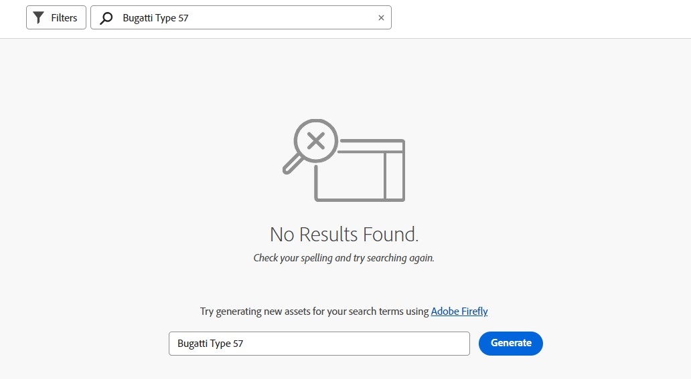

# Suchen nach Assets in [!DNL Assets view] {#search-assets}

>[!CONTEXTUALHELP]
>id="assets_search"
>title="Assets durchsuchen"
>abstract="Sie können nach Assets suchen, indem Sie ein Keyword in der Suchleiste eingeben oder Assets nach ihrem Status, Dateityp, MIME-Typ, Erstellungs-, Änderungs- und Ablaufdatum oder ihrer Größe filtern. Zusätzlich zu den Standardfiltern können Sie auch benutzerdefinierte Filter anwenden. Sie können die gefilterten Ergebnisse als gespeicherte Suche oder Smart-Sammlung speichern."
>additional-url="https://experienceleague.adobe.com/docs/experience-manager-assets-essentials/help/manage-collections.html?lang=de#manage-smart-collection" text="Erstellung von Smart-Sammlungen"

[!DNL Assets view] bietet eine effektive Suche, die einfach standardmäßig funktioniert. Die Suche ist umfassend, da es sich um eine Volltextsuche handelt. Mit der leistungsstarken Suchfunktion können Sie schnell das passende Asset ermitteln und die Geschwindigkeit Ihrer Inhaltserstellung steigern. [!DNL Assets view] bietet Volltextsuche und Suchvorgänge durch die Metadaten wie Smart-Tags, Titel, Erstellungsdatum und Copyright.

Um nach Assets zu suchen,

* klicken Sie oben auf der Seite in das Suchfeld. Standardmäßig wird innerhalb des Ordners gesucht, den Sie gerade durchsuchen. Führen Sie einen der folgenden Schritte aus:

  

   * Suchen Sie mithilfe eines Keywords und ändern Sie optional den Ordner. Drücken Sie die Eingabetaste.

   * Beginnen Sie die Arbeit mit einem kürzlich angezeigten Asset, indem Sie direkt danach suchen. Klicken Sie in das Suchfeld und wählen Sie aus den Vorschlägen ein kürzlich angezeigtes Asset aus.

## Suchen von Assets mithilfe von Adobe Firefly

Wenn Sie nach einem Asset suchen, das in keinem der Ordner &quot;Assets&quot;verfügbar ist, verwenden Sie die [!UICONTROL Adobe Firefly] Asset-Suchfunktion in [!UICONTROL Adobe Experience Manager Assets]. Damit können Sie effizient nach Assets suchen, die möglicherweise nicht in den angegebenen Ordnern gespeichert sind. Diese Funktion ist derzeit nur für Benutzer mit Express-Berechtigung verfügbar.   Sie können beispielsweise ein Asset mit dem Keyword `Bugatti Type 57`. Bei der Suche nach `Bugatti Type 57`, werden keine Ergebnisse gefunden.

*Abbildung: Keine Ergebnisse für Bugatti Typ 57 im Asset-Ordner gefunden.*

Geben Sie in der Suchleiste den Asset-Namen ein und klicken Sie auf **[!UICONTROL Erzeugen]**.

*Abbildung: Referenzieren von Assets, die mit der Adobe Firefly-Asset-Suchfunktion durchsucht wurden.*

Die Beispiel-Assets werden auf dem Bildschirm angezeigt. Sie können diese Assets für den einfachen Zugriff in Ihren gewünschten Ordner hochladen.

## Filtern von Suchergebnissen {#refine-search-results}

Sie können die Suchergebnisse anhand der folgenden Parameter filtern.

*Abbildung: Filtern gesuchter Assets basierend auf verschiedenen Parametern.*

* Asset-Status: Filtern Sie die Suchergebnisse mithilfe eines der Asset-Status `Approved`, `Rejected` oder `No Status`.

* Dateityp: Filtern von Suchergebnissen nach den unterstützten Dateitypen: `Images`, `Documents` und `Videos`.
* MIME-Typ: Filtern nach einem oder mehreren der unterstützten Dateiformate. <!-- TBD:  [supported file formats](/help/assets/supported-file-formats-assets-view.md). -->
* Bildgrösse: Geben Sie eine oder mehrere der minimalen und maximalen Abmessungen zum Filtern von Bildern an. Die Größe wird in Pixeln angegeben und ist nicht die Dateigröße der Bilder.
* Erstellungsdatum: Das Erstellungsdatum des Assets, wie es in den Metadaten angegeben ist. Das verwendete Standarddatumsformat ist `yyyy-mm-dd`.
* Änderungsdatum: Das Datum der letzten Änderung der Assets. Das verwendete Standarddatumsformat ist `yyyy-mm-dd`.

* Ablaufdatum: Filtern Sie die Suchergebnisse anhand des Asset-Status `Expired`. Darüber hinaus können Sie einen Zeitraum für das Ablaufdatum für Assets angeben, um Ihre Suchergebnisse weiter zu filtern.

* Benutzerdefinierte Filter: [Hinzufügen benutzerdefinierter Filter](#custom-filters) zur Benutzeroberfläche der Assets-Ansicht. Sie können diese benutzerdefinierten Filter dann zusätzlich zu den Standardfiltern anwenden, um Ihre Suchergebnisse zu verfeinern.

Sie können die gesuchten Assets in aufsteigender oder absteigender Reihenfolge nach `Name`, `Relevancy`, `Size`, `Modified` und `Created` sortieren.

## Verwalten von benutzerdefinierten Filtern {#custom-filters}

**Erforderliche Berechtigungen:**  `Can Edit`, `Owner` oder Administrator.

Mit der Assets-Ansicht können Sie auch benutzerdefinierte Filter zur Benutzeroberfläche hinzufügen. Sie können diese benutzerdefinierten Filter dann zusätzlich zu den [Standardfiltern](#refine-search-results) anwenden, um Ihre Suchergebnisse zu verfeinern.

Die Assets-Ansicht bietet die folgenden benutzerdefinierten Filter:

<table>
    <tbody>
     <tr>
      <th><strong>Benutzerspezifischer Filtername</strong></th>
      <th><strong>Beschreibung</strong></th>
     </tr>
     <tr>
      <td>Titel</td>
      <td>Filtern Sie Assets unter Verwendung des Asset-Titels. Der Titel, den Sie in den Suchkriterien, die die Groß- und Kleinschreibung berücksichtigen, angeben, muss genau mit dem Titel des Assets übereinstimmen, damit es in den Ergebnissen angezeigt wird.</td>
     </tr>
     <tr>
      <td>Name</td>
      <td>Filtern Sie Assets unter Verwendung des Asset-Dateinamens. Der Name, den Sie in den Suchkriterien, die die Groß- und Kleinschreibung berücksichtigen, angeben, muss genau mit dem Namen des Assets übereinstimmen, damit es in den Ergebnissen angezeigt wird.</td>
     </tr>
     <tr>
      <td>Asset-Größe</td>
      <td>Filtern Sie Assets, indem Sie in den Suchkriterien für ein Asset, das in den Ergebnissen angezeigt werden soll, einen Größenbereich in Byte festlegen.</td>
     </tr>
     <tr>
      <td>Prognostizierte Tags</td>
      <td>Filtern Sie Assets unter Verwendung des Asset-Smart-Tags. Der Smart-Tag-Name, den Sie in den Suchkriterien, die die Groß- und Kleinschreibung berücksichtigen, angeben, muss genau mit dem Smart-Tag-Namen des Assets übereinstimmen, damit es in den Ergebnissen angezeigt wird. Sie können nicht mehrere Smart-Tags in den Suchkriterien angeben.</td>
     </tr>    
    </tbody>
   </table>

<!--
   You can use a wildcard operator (*) to enable Assets view to display assets in the results that partially match the search criteria. For example, if you define <b>ma*</b> as the search criteria, Assets view displays assets with title, such as, market, marketing, man, manchester, and so on in the results.

   You can use a wildcard operator (*) to enable Assets view to display assets in the results that partially match the search criteria.

   You can use a wildcard operator (*) to enable Assets view to display assets in the results that partially match the search criteria. You can specify multiple smart tags separated by a comma in the search criteria.

   -->

### Hinzufügen benutzerdefinierter Filter {#add-custom-filters}

Hinzufügen benutzerdefinierter Filter

1. Klicken Sie auf **[!UICONTROL Filter]**.

1. Klicken Sie im Abschnitt **[!UICONTROL Benutzerdefinierte Filter]** auf **[!UICONTROL Bearbeiten]** oder auf **[!UICONTROL Filter hinzufügen]**.

   

1. Wählen Sie im Dialogfeld **[!UICONTROL Verwaltung benutzerdefinierter Filter]** die Filter aus, die Sie der vorhandenen Filterliste hinzufügen möchten. Wählen Sie **[!UICONTROL Benutzerdefinierte Filter]** aus, um alle Filter auszuwählen.

1. Klicken Sie auf **[!UICONTROL Bestätigen]**, um die Filter zur Benutzeroberfläche hinzuzufügen.

### Entfernen benutzerdefinierter Filter {#remove-custom-filters}

Entfernen benutzerdefinierter Filter

1. Klicken Sie auf **[!UICONTROL Filter]**.

1. Klicken Sie im Abschnitt **[!UICONTROL Benutzerdefinierte Filter]** auf **[!UICONTROL Bearbeiten]**.

1. Heben Sie im Dialogfeld **[!UICONTROL Verwaltung benutzerdefinierter Filter]** die Auswahl der Filter auf, die Sie aus der Liste der vorhandenen Filter entfernen möchten.

1. Klicken Sie auf **[!UICONTROL Bestätigen]**, um die Filter aus der Benutzeroberfläche zu entfernen.

## Gespeicherte Suchvorgänge {#saved-search}

In [!DNL Assets view] ist die Suchfunktion recht einfach zu verwenden. Über das Suchfeld können Sie einfach einen Suchbegriff eingeben und die Eingabetaste drücken, um die Ergebnisse anzuzeigen, oder Sie können schnell mit einem Klick nach Ihren kürzlich gesuchten Suchbegriffen suchen.

Sie können die Suchergebnisse auch nach bestimmten Kriterien rund um Metadaten und Art der Assets filtern. Mit [!DNL Assets view] können Sie bei häufig verwendeten Filtern die Suchparameter speichern, um das Sucherlebnis zu verbessern. Um zu suchen und den Filter mit nur einem Klick anzuwenden, können Sie auch die gespeicherte Suche auswählen.

Um eine gespeicherte Suche zu erstellen, suchen Sie nach einem Asset, wenden Sie einen oder mehrere Filter an und klicken Sie im Bedienfeld [!UICONTROL Filter] auf **[!UICONTROL Speichern unter]** > **[!UICONTROL Gespeicherte Suche]**. Sie können auch auf **[!UICONTROL Speichern unter]** klicken und **[!UICONTROL Smart-Sammlung]** wählen, um die Ergebnisse als Smart-Sammlung zu speichern. Siehe [Erstellen einer Smart-Sammlung](manage-collections-assets-view.md#create-a-smart-collection) für weitere Details.

<!-- TBD: Search behavior. Full-text search. Ranking and rank boosts. Hidden assets.
Report poor UX that users can only save a filtered search and not a simple search.
.
Are other supported files fully indexed and support full-text search? Eg. audio/videos files can at best have metadata indexed.
Anything about ranking of assets displayed in search results?

What about temporarily hiding an asset (suspending search on it) from the search results? If an asset is undergoing review collaboration, should it be used by others? Should it be hidden in search?

When userA is searching and userB add an asset that matches search results, will the asset display in search as soon as userA refreshes the page? Assuming indexing is near real-time. May not be so for bulk uploads.
-->

## Arbeiten mit Suchergebnissen {#work-with-search-results}

Sie können die Assets auswählen, die in den Suchergebnissen angezeigt werden, und die folgenden Aktionen ausführen:

* **Ähnliches Bild suchen**: Suchen Sie ähnliche Bild-Assets in der Assets-Benutzeroberfläche basierend auf den Metadaten und Smart-Tags.

* **Details**: Zeigen Sie Asset-Eigenschaften an und bearbeiten Sie diese.

* **Herunterladen**: Laden Sie ein Asset herunter.

* **Zur Sammlung hinzufügen**: Fügen Sie das ausgewählte Asset zu einer Sammlung hinzu.

* **An Schnellzugriff anheften**: [Heften Sie ein Asset an](my-workspace-assets-view.md), um später im Bedarfsfall schneller darauf zugreifen zu können. Alle angehefteten Elemente werden im Dashboard „Mein Arbeitsbereich“ im Abschnitt **Schnellzugriff** angezeigt.

* **In Adobe Expreß öffnen**: Bearbeiten Sie ein Bild im integrierten Adobe Expreß auf dem Adobe Experience Manager Assets-Bildschirm.

* **Bearbeiten**: Bearbeiten Sie das Bild mit Adobe Expreß.

* **Link freigeben**: [Teilen Sie Links](share-links-for-assets-view.md) für ein Asset mit anderen Benutzenden, damit sie darauf zugreifen und es herunterladen können.

* **Löschen**: Löschen Sie ein Asset.

* **Kopieren**: Kopieren Sie ein Asset in einen anderen Ordner.

* **Verschieben**: Verschieben Sie ein Asset in einen anderen Ordner.

* **Umbenennen**: Benennen Sie ein Asset um.

* **In Bibliotheken kopieren**: Fügen Sie ein Asset zur Bibliothek hinzu.

* **Aufgaben zuweisen**: Weisen Sie Benutzenden Aufgaben für ein Asset zu.

* **Beobachten**: [Überwachen Sie Vorgänge](manage-notifications-assets-view.md), die für ein Asset durchgeführt werden.

## Konfigurieren der ersten Homepage für die Suche {#configuring-search-first-homepage}

Mit Experience Manager Assets können Sie die Standard-Landingpage für Ihre Organisation auswählen. Bei der Verwendung von Search First als Startseite haben Sie auch Optionen, das Branding der Seite anzupassen, indem Sie den Hintergrund und die Logo-Bilder so konfigurieren, dass sie Ihrer Marke entsprechen.

Um die erste Startseite der Suche zu konfigurieren, führen Sie die folgenden Schritte aus:

1. Navigieren Sie zu **[!UICONTROL Einstellungen]** > **[!UICONTROL Allgemeine Einstellungen]**.
1. Auswählen **[!UICONTROL Suche zuerst]**. Es öffnet außerdem die Konfiguration der ersten Suchfunktion. Sie können [Ausrichtung](#setting-alignment-search-bar) oder [Festlegen von Hintergrund- und Logo-Bildern](#setting-background-image-and-logo) auf Ihrer Homepage.

### Festlegen der Ausrichtung der Suchleiste {#setting-alignment-search-bar}

[!DNL Assets view] ermöglicht es Ihnen, die Ausrichtung der Suchleiste zu ändern. Sie können die Suchleiste entweder in der Mitte oder oben anzeigen lassen. Wählen Sie die gewünschte Ausrichtung aus und klicken Sie auf **[!UICONTROL Speichern]**.

### Festlegen von Hintergrund- und Logo-Bildern für die Homepage {#setting-background-image-and-logo}

Sie können Ihrer ersten Suchhomepage ein Markenlogo und ein Hintergrundbild hinzufügen. Führen Sie die folgenden Schritte aus:

1. Navigieren Sie zu **[!UICONTROL Hintergrund und Logo-Bild]** Abschnitt unter **[!UICONTROL Homepage]**.
1. Klicks **[!UICONTROL Ersetzen]** , um Bilder aus einem vorhandenen Asset-Repository zu durchsuchen.
1. Klicken Sie auf **[!UICONTROL Speichern]**. [Vorschau](#preview-configured-homepage) die Änderungen, um die Änderungen zu überprüfen.

### Vorschau der konfigurierten Homepage {#preview-configured-homepage}

Sie können eine Vorschau anzeigen, um das Layout und die Formatierung der ersten Suchhomepage zu überprüfen. Verwenden **[!UICONTROL Vorschau]** können Sie das Layout korrigieren oder Änderungen entsprechend den Anforderungen vornehmen. Führen Sie die folgenden Schritte aus, um eine Vorschau der konfigurierten Homepage anzuzeigen:

1. Klicks **[!UICONTROL Allgemeine Einstellungen]** und wählen **[!UICONTROL Suche zuerst]**.
1. Navigieren Sie zu **[!UICONTROL Anpassen der ersten Startseite der Suche]** und klicken **[!UICONTROL Vorschau]**. Umschalten **[!UICONTROL Dunkles Thema]** -Schaltfläche, um die Startseite im dunklen oder hellen Design als Vorschau anzuzeigen.
1. Klicks **[!UICONTROL Schließen]** um den Vorschaubildschirm zu schließen.

   

## Nächste Schritte {#next-steps}

* [Sehen Sie sich ein Video zum Suchen von Assets in Assets-Ansicht an](https://experienceleague.adobe.com/docs/experience-manager-learn/assets-essentials/basics/using.html?lang=de)

* Geben Sie Produkt-Feedback über die Option [!UICONTROL Feedback] in der Benutzeroberfläche der Assets-Ansicht

* Geben Sie Feedback zur Dokumentation durch  über die Option [!UICONTROL Diese Seite bearbeiten] oder durch  über die Option [!UICONTROL Problem protokollieren] in der rechten Seitenleiste

* Kontaktieren Sie die [Kundenunterstützung](https://experienceleague.adobe.com/?support-solution=General&amp;lang=de#support)
