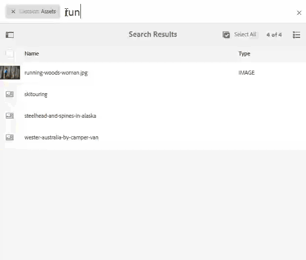

# Suche nach Assets in AEM {#search-assets-in-aem}

Mit den benutzerfreundlichen Optionen zur Elementerkennung in Experience Manager können Sie eine höhere Inhaltsgeschwindigkeit erzielen. Ihre Teams können die Time-to-Market mit nahtloser, intelligenter Sucherfahrung durch vordefinierte Funktionen und benutzerdefinierte Methoden verkürzen. Die Suche nach Assets ist ein zentraler Faktor für die Nutzung eines digitalen Asset-Managements – sowohl für eine weitere Verwendung durch kreative Elemente als auch für eine robuste Verwaltung von Assets durch die Geschäftsbenutzer und Marketingexperten oder für die Verwaltung durch DAM-Administratoren. Einfache, erweiterte und benutzerdefinierte Suchen, die Sie über die Benutzeroberfläche von AEM Assets oder andere Apps und Oberflächen durchführen können, helfen bei der Erfüllung dieser Anwendungsfälle.

AEM unterstützt die folgenden Anwendungsfälle und in diesem Artikel werden die Verwendung, Konzepte, Konfigurationen, Einschränkungen und die Fehlerbehebung für diese Anwendungsfälle beschrieben.

| Assets suchen | Konfiguration und Verwaltung | Arbeiten mit Suchergebnissen |
|--- |--- |--- |
| [Grundlegende Suchvorgänge](#searchbasics) | [Suchindex](#searchindex) | [Ergebnisse sortieren](#sort) |
| [Benutzeroberfläche für die Suche](#searchui) |  | [Eigenschaften und Metadaten eines Assets überprüfen](#checkinfo) |
| [Suchvorschläge](#searchsuggestions) | [Obligatorische Metadaten](#mandatorymetadata) | [Download](#download) |
| [Suchergebnisse und Verhalten verstehen](#searchbehavior) | [Suchfacetten ändern](#searchfacets) | [Aktualisierung von Massenmetadaten](#metadataupdates) |
| [Suchrang und -verstärkung](#searchrank) | [Textextrahierung](#extracttextupload) | [Intelligente Sammlungen](#collections) |
| [Erweiterte Suche: Filtern und Umfang der Suche](#scope) | [Benutzerdefinierte Vorhersagen](#custompredicates) | [Unerwartete Ergebnisse](#unexpectedresults) und [Fehlerbehebung verstehen](#troubleshoot) |
| [Suchen Sie nach anderen Lösungen und Apps](#beyondomnisearch):  Asset LinkDesktop-App        Bilder [von Adobe Stock](#adobestock)      Assets [für dynamische Medien](#dynamicmedia) |  |  |
| [Asset-Auswahl/Auswahl](#assetselector) |  |  |
| [Einschränkungen](#tips) und [Tipps](#limitations) |  |  |
| [Beispiele](#samples) |  |  |

Suchen Sie Assets mithilfe des Omniture-Suchfelds oben auf der AEM-Weboberfläche. Gehen Sie zu **[!UICONTROL Assets]** > **[!UICONTROL Files]** in AEM, klicken Sie in der oberen Leiste auf  , geben Sie den Suchbegriff ein und drücken Sie die Eingabetaste. Alternativ können Sie den Suchbegriff-Shortcut `/` (Schrägstrich) verwenden, um das Omniture-Suchfeld zu öffnen. `Location:Assets` ist vorausgewählt, um die Suche auf DAM-Assets zu beschränken. Sie können erweiterte Suchen durchführen, um den [Suchbereich](#scope)zu vergrößern oder zu begrenzen.

Use the **[!UICONTROL Filters]** panel to search for assets, folders, tags, and metadata. Sie können Suchergebnisse auf Grundlage der verschiedenen Optionen (Prädikate) filtern, z. B. Dateityp, Dateigröße, Datum der letzten Änderung, Status des Assets, Einblicke und Adobe Stock-Lizenzierung. You can customize the Filters panel and add/remove search predicates using [search facets](/help/assets/search-facets.md).

Die AEM-Suchfunktion unterstützt die Suche nach Sammlungen und die Suche nach Assets in einer Sammlung. Siehe [Suchsammlungen](/help/assets/manage-collections.md).

## Suchschnittstelle verstehen {#searchui}

Machen Sie sich mit der Suchschnittstelle und den verfügbaren Aktionen vertraut.

 Informationen zu Teilen der Benutzeroberfläche *für die Suche nach Assets* Abbildung: Die Oberfläche für die Suchergebnisse von Assets

**** A. Speichern Sie die Suche als intelligente Sammlung. **** B. Filter (Prädikate) zur Eingrenzung der Suchergebnisse. **C.** Anzeigen von Dateien, Ordnern oder beidem in den Suchergebnissen. **** D. Klicken Sie auf Filter, um die linke Leiste zu öffnen oder zu schließen. **** E. Die Suchposition ist DAM. ************ F. Omniture Suchfeld mit benutzerdefiniertem Suchbegriff **G. Markieren Sie das Kontrollkästchen, um alle Suchergebnisse** H auszuwählen. Anzahl der angezeigten Suchergebnisse aus der Gesamtzahl der Suchergebnisse **I. Schließen Sie die Suche** J. Wechseln zwischen Kartenansicht und Listenansicht

### Facets der dynamischen Suche {#dynamicfacets}

Sie können die gewünschten Assets schneller auf der Suchergebnisseite ausfindig machen, indem Sie die dynamisch aktualisierte Anzahl der erwarteten Suchergebnisse in den Suchfacetten verwenden. Die erwartete Anzahl an Assets wird noch vor Anwendung des Suchfilters aktualisiert. Durch Anzeige der erwarteten Anzahl im Filter können Sie schnell und effizient durch Suchergebnisse navigieren. Weitere Informationen finden Sie unter [Suche nach Assets in AEM](/help/assets/search-assets.md).

Anzeigen der ungefähren Asset-Anzahl ohne Filterung der Suchergebnisse in Suchfacetten

## Search suggestions as you type {#searchsuggestions}

Wenn Sie mit der Eingabe eines Suchbegriffs beginnen, schlägt AEM die möglichen Suchbegriffe oder -begriffe vor. Die Vorschläge basieren auf den Assets in AEM. AEM indiziert alle Metadatenfelder, um die Suche zu unterstützen. Zur Bereitstellung von Suchvorschlägen verwendet das System die Werte der folgenden Metadatenfelder. Um Suchvorschläge zu erhalten, sollten Sie die folgenden Felder mit geeigneten Suchbegriffen füllen:

* Asset-Tags. (Maps zu `jcr:content/metadata/cq:tags`)
* Asset-Titel. (Maps zu `jcr:content/metadata/dc:title`)
* Asset-Beschreibung. (Maps zu `jcr:content/metadata/dc:description`)
* Titel im JCR-Repository. Der Wert wird möglicherweise dem Asset-Titel zugeordnet. (Maps zu `jcr:content/jcr:title`)
* Beschreibung im JCR-Repository. Der Wert wird möglicherweise der Asset-Beschreibung zugeordnet. (Maps zu `jcr:content/jcr:description`)

## Suchergebnisse und Verhalten verstehen {#searchbehavior}

### Grundlegende Suchbegriffe und Ergebnisse {#searchbasics}

Sie können Suchbegriffssuchen im OmniSearch-Feld ausführen. Bei der Suchbegriffsuche wird nicht zwischen Groß- und Kleinschreibung unterschieden und es handelt sich um eine Volltextsuche (über die gängigen Metadatenfelder hinweg). Wenn mehrere Suchbegriffe verwendet werden, `AND` ist dies der Standardoperator zwischen den Suchbegriffen. Die Ergebnisse werden nach Relevanz sortiert, beginnend mit den nächsten Übereinstimmungen. Bei mehreren Suchbegriffen sind die Assets, die beide Begriffe in ihren Metadaten enthalten, relevanter. In Metadaten werden Suchbegriffe, die als Smart-Tags angezeigt werden, höher eingestuft als Suchbegriffe, die in anderen Metadatenfeldern angezeigt werden.

Mit AEM können Sie einem bestimmten Suchbegriff mehr Gewicht verleihen. Außerdem ist es möglich, den Rang einiger gezielter Assets für bestimmte Suchbegriffe zu erhöhen. AEM-Administratoren können die folgenden Konfigurationen durchführen.

Um die relevanten Assets schnell zu finden, bietet die Rich-Oberfläche Filter-, Sortierungs- und Auswahlmechanismen. Sie können Ergebnisse nach mehreren Kriterien filtern und die Anzahl der gesuchten Assets nach verschiedenen Filtern anzeigen. Alternativ dazu können Sie die Suche erneut ausführen, indem Sie die Abfrage im Feld Omniture Search ändern. Wenn Sie Ihre Suchbegriffe oder Filter ändern, bleiben die anderen Filter angewendet, um den Kontext Ihrer Suche zu erhalten.

Manchmal werden in den Suchergebnissen einige unerwartete Elemente angezeigt. Weitere Informationen finden Sie unter [Unerwartete Ergebnisse](#unexpectedresults).

AEM kann viele Dateiformate suchen und die Suchfilter können an Ihre geschäftlichen Anforderungen angepasst werden. Wenden Sie sich an Ihre Administratoren, um zu erfahren, welche Suchoptionen für Ihr DAM-Repository zur Verfügung stehen und welche Einschränkungen Ihre Anmeldung haben kann.

<!-- 
### Results with and without Enhanced Smart Tags {#withsmarttags}

By default, AEM search combines the search terms with an AND clause. For example, consider searching for keywords woman running. Only the assets with both woman and running keywords in the metadata appear in the search results by default. The same behavior is retained when special characters (periods, underscores, or dashes) are used with the keywords. The following search queries return the same results:

* `woman running`
* `woman.running`
* `woman-running`

However, the query `woman -running` returns assets without `running` in their metadata.
Using smart tags adds an extra `OR` clause to find any of the search terms as the applied smart tags. An asset tagged with either `woman` or `running` using Smart Tags also appear in such a search query. So the search results are a combination of,

* Assets with `woman` and `running` keywords in the metadata (default behavior).

* Assets smart tagged with either of the keywords (Smart Tags behavior).
-->

### Suchranking und -verstärkung {#searchrank}

Die Suchergebnisse, die in Metadatenfeldern alle Suchbegriffe aufweisen, werden zuerst angezeigt. Danach folgen die Suchergebnisse, die einem oder mehr Suchbegriffen in den Smart-Tags entsprechen. Im obigen Beispiel werden die Suchergebnisse ungefähr in dieser Reihenfolge angezeigt:

1. Matches of `woman running` in the various metadata fields.
1. Sucht nach `woman running` Smart-Tags.
1. Matches of `woman` or of `running` in smart tags.

Sie können die Relevanz von Suchbegriffen für bestimmte Assets verbessern, um die auf Suchbegriffen basierenden Suchen zu optimieren. D. h. die Bilder, für die Sie bestimmte Suchbegriffe festlegen, erscheinen bei der Suche nach diesen Suchbegriffen oben in den Suchergebnissen.

1. Öffnen Sie in der Benutzeroberfläche &quot;Assets&quot;die Seite &quot;Eigenschaften&quot;für das Asset. Klicken Sie auf **[!UICONTROL Erweitert]** und dann auf **[!UICONTROL Hinzufügen]** unter **[!UICONTROL Erhöhen für Suchbegriffe]**.
1. Geben Sie im Feld **[!UICONTROL Suche priorisieren]** einen Suchbegriff ein, für den Sie die Bildsuche optimieren möchten, und klicken oder tippen Sie anschließend auf **[!UICONTROL Hinzufügen]**. Sie können mehrere Suchbegriffe auf dieselbe Weise angeben.
1. Klicken/tippen Sie auf **[!UICONTROL Speichern und schließen]**. Das Asset, das Sie für diesen Suchbegriff beworben haben, wird unter den Top-Suchergebnissen angezeigt.

Sie können dies zu Ihrem Vorteil nutzen, indem Sie den Rang einiger Assets in den Suchergebnissen für den jeweiligen Suchbegriff erhöhen. Siehe Beispiel unten. For detailed info, see [search in AEM](https://helpx.adobe.com/experience-manager/kt/help/assets/search-feature-video-use.html).

>[!VIDEO](https://video.tv.adobe.com/v/16766/?quality=6)

*Verstehen Sie, wie Suchergebnisse bewertet werden und wie der Rang beeinflusst werden kann.*

## Erweiterte Suche {#scope}

AEM bietet verschiedene Methoden wie Filter, die für die gesuchten Assets gelten, um die gewünschten Assets schneller zu finden. Nachfolgend werden einige häufig verwendete Methoden beschrieben. Nachfolgend werden einige [illustrierte Beispiele](#samples) vorgestellt.

**Suchen nach Dateien oder Ordnern**: In den Suchergebnissen finden Sie entweder Dateien, Ordner oder beides. Wählen Sie im **[!UICONTROL Filterbedienfeld]** die entsprechende Option aus. Siehe [Suchschnittstelle](#searchui).

**Suchen nach Assets in einem Ordner**: Sie können die Suche auf einen bestimmten Ordner beschränken. Fügen Sie im **[!UICONTROL Filterbedienfeld]** den Pfad eines Ordners hinzu. Sie können jeweils nur einen Ordner auswählen.

Beschränken Sie die Suchergebnisse auf einen Ordner, indem Sie im Filterbedienfeld einen Ordnerpfad hinzufügen

<!--
### Find similar images {#visualsearch}

To find images that are visually similar to a user-selected image, click **[!UICONTROL Find Similar]** option from the card view of an image or from the toolbar. AEM displays the smart tagged images from the DAM repository that are similar to a user-selected image. See [how to configure similarity search](#configvisualsearch).

*Figure: Find similar images using the option in the card view*
-->

### Adobe Stock Images {#adobestock}

From within the AEM user interface, users can search [Adobe Stock assets](/help/assets/aem-assets-adobe-stock.md) and license the required assets. Fügen Sie `Location: Adobe Stock` in die Omniture Suchleiste ein. Sie können auch das Filterbedienfeld verwenden, um alle lizenzierten oder nicht lizenzierten Assets zu suchen oder ein bestimmtes Asset mit der Adobe Stock-Dateinummer zu suchen.

### Dynamische Medien {#dmassets}

Sie können nach Bildern mit dynamischen Medien filtern, indem Sie im Bedienfeld &quot; **[!UICONTROL Dynamische Medien&quot;> &quot;Sets]** &quot; **[!UICONTROL Filter]** auswählen. Es filtert und zeigt Assets wie Bildsätze, Karussells, gemischte Mediensets und Rotationssets an.

### Suchen mit bestimmten Werten in Metadatenfeldern {#gqlsearch}

Sie können Assets auf Grundlage exakter Werte bestimmter Metadatenfelder wie Titel, Beschreibung und Autor erstellen. Die Volltextsuche-Funktion GQL ruft nur die Assets ab, deren Metadatenwert exakt mit Ihrer Suchabfrage übereinstimmt. Bei den Namen der Eigenschaften (z. B. Autor, Titel usw.) und den Werten wird zwischen Groß- und Kleinschreibung unterschieden.

| Metadatenfeld | Factsheet-Wert und Nutzung |
|---|---|
| Titel | title:John |
| Ersteller | creator:John |
| Standort | Ort:NA |
| Beschreibung | description:„Sample Image“ |
| Erstellungswerkzeug | creatortool:&quot;Adobe Fotoshop CC 2015&quot; |
| Urheberrechtsbesitzer | copyrightowner:„Adobe Systems“ |
| Mitarbeiter | contributor:John |
| Nutzungsbedingungen | usageterms:„CopyRights Reserved“ |
| Erstellt | created:YYYY-MM-DDTHH |
| Ablaufdatum | expires:YYYY-MM-DDTHH |
| Einschaltzeit | ontime:YYYY-MM-DDTHH |
| Ausschaltzeit | offtime:YYYY-MM-DDTHH |
| Zeitraum (expires dateontime,offtime) | facet field : lowerbound..upperbound |
| Pfad | /content/dam/&lt;Ordnername> |
| PDF-Titel | pdftitle:„Adobe Document“ |
| Betreff | subject:„Training“ |
| Tags | tags:„Location And Travel“ |
| Typ | type:&quot;image\png&quot; |
| Bildbreite | width:lowerbound..upperbound |
| Bildhöhe | height:lowerbound..upperbound |
| Person | person:John |

Der Eigenschaftenpfad, die Beschränkung, die Größe und die Reihenfolge können nicht mit einer anderen Eigenschaft ODERed festgelegt werden.

Das Keyword für eine von einem Benutzer erstellte Eigenschaft ist ihre Feldbeschriftung im Eigenschafteneditor in Kleinbuchstaben und ohne Leerzeichen.

Im Folgenden finden Sie einige Beispiele für Suchformate für komplexe Abfragen:

* So zeigen Sie alle Assets mit mehreren Facettenfeldern an (wie: title=John Doe und creator tool = Adobe Photoshop): `title:"John Doe" creatortool : Adobe*`
* To display all assets when the facets value is not a single word but a sentence (for example: title=Scott Reynolds): `title:"Scott Reynolds"`
* To display assets with multiple values of a single property (for example: title=Scott Reynolds or John Doe): `title:"Scott Reynolds" OR "John Doe"`
* To display assets with property values starting with a specific string (for example: title is Scott Reynolds): `title:Scott*`
* To display assets with property values ending with a specific string (for example: title is Scott Reynolds): `title:*Reynolds`
* To display assets with a property value that contains a specific string (for example: title = Basel Meeting Room): `title:*Meeting*`
* To display assets that contain a particular string and have a specific property value (for example: search for string Adobe in assets having title=John Doe): `*Adobe* title:"John Doe"`

## Suchen von Assets aus anderen AEM-Angeboten oder -Schnittstellen {#beyondomnisearch}

Adobe Experience Manager (AEM) verbindet das DAM-Repository mit verschiedenen anderen AEM-Lösungen, um den Zugriff auf digitale Assets zu beschleunigen und die kreativen Arbeitsabläufe zu optimieren. Jede Elementerkennung beginnt mit der Suche oder Suche. Das Suchverhalten bleibt über die verschiedenen Oberflächen und Lösungen hinweg weitgehend gleich. Einige Suchmethoden ändern sich je nach Zielgruppe, Anwendungsfällen und Benutzeroberfläche der AEM-Lösungen. Die spezifischen Methoden werden für die einzelnen Lösungen unter den unten stehenden Links dokumentiert. Die allgemein anwendbaren Tipps und Verhaltensweisen werden in diesem Artikel beschrieben.

### Suchen von Assets im Bedienfeld &quot;Adobe Asset Link&quot; {#aal}

Mit Adobe Asset Link können Kreativprofis jetzt auf in AEM Assets gespeicherte Inhalte zugreifen, ohne die unterstützten Adobe Creative Cloud-Apps verlassen zu müssen. Mit dem In-App-Bedienfeld in Creative Cloud-Apps können Kreative Assets nahtlos durchsuchen, suchen, auschecken und einchecken: Fotoshop, Illustrator und InDesign. Asset Link ermöglicht es Benutzern auch, visuell ähnliche Ergebnisse zu suchen. Die Ergebnisse der visuellen Suchanzeige basieren auf den maschinellen Lernalgorithmen von Adobe Sensei und helfen Benutzern, ästhetisch ähnliche Bilder zu finden. Siehe [Suchen und Durchsuchen von Assets](https://helpx.adobe.com/enterprise/using/manage-assets-using-adobe-asset-link.html#UseAdobeAssetLink) mithilfe von Adobe Asset Link.

### Suchen von Assets in der AEM-Desktop-App {#desktopapp}

Kreativprofis verwenden die Desktop-App, um AEM Assets einfach auf ihrem lokalen Desktop (Win oder Mac) zu durchsuchen und verfügbar zu machen. Kreativelemente können die gewünschten Assets einfach in Mac Finder oder Windows Explorer anzeigen, in Desktop-Anwendungen öffnen und lokal ändern - die Änderungen werden mit einer neuen Version, die im Repository erstellt wurde, wieder in AEM gespeichert. Die Anwendung unterstützt grundlegende Suchvorgänge mit einem oder mehreren Suchbegriffen, * und ? Platzhalter und AND-Operator. Siehe [Durchsuchen, Suchen und Anzeigen einer Vorschau von Assets](https://docs.adobe.com/content/help/en/experience-manager-desktop-app/using/using.html#browse-search-preview-assets) in der Desktop-App.

### Search assets in Brand Portal {#brandportal}

Geschäftskunden und Marketingfachleute nutzen Brand Portal, um die genehmigten digitalen Assets effizient und sicher mit ihren erweiterten internen Teams, Partnern und Wiederverkäufern zu teilen. See [search assets on Brand Portal](https://docs.adobe.com/content/help/en/experience-manager-brand-portal/using/search-capabilities/brand-portal-searching.html).

### Adobe Stock Images durchsuchen {#adobestock-1}

Benutzer können aus der AEM-Benutzeroberfläche heraus Adobe Stock-Assets suchen und die erforderlichen Assets lizenzieren. Fügen Sie `Location: Adobe Stock` im Feld Omniture Search hinzu. Sie können auch das Bedienfeld &quot; **[!UICONTROL Filter]** &quot;verwenden, um alle lizenzierten oder nicht lizenzierten Assets zu suchen oder ein bestimmtes Asset mit der Adobe Stock-Dateinummer zu suchen. Siehe [Verwalten von Adobe Stock-Bildern in AEM](/help/assets/aem-assets-adobe-stock.md#usemanage).

### Dynamische Medienelemente durchsuchen {#dynamicmedia}

Sie können nach Bildern mit dynamischen Medien filtern, indem Sie im Bedienfeld &quot; **[!UICONTROL Filter]** &quot;auf &quot; **[!UICONTROL Dynamische Medien]** &quot;> &quot; **[!UICONTROL Sets]** &quot;klicken. Es filtert und zeigt Assets wie Bildsätze, Karussells, gemischte Mediensets und Rotationssets an. Beim Erstellen von Webseiten können die Autoren in der Inhaltssuche nach Sets suchen. Ein Filter für Sätze ist in einem Popupmenü verfügbar.

### Suchen von Assets in der Inhaltssuche beim Erstellen von Webseiten {#contentfinder}

Autoren können mit der Inhaltssuche das DAM-Repository nach den relevanten Assets durchsuchen und die Assets auf den von ihnen erstellten Webseiten verwenden.

<!-- Authors can also use the Connected Assets functionality to search for assets that are available on a remote AEM deployment. Authors can then use these assets in web pages on a local AEM deployment. See [use remote assets](use-assets-across-connected-assets-instances.md#use-remote-assets).
-->

### Sammlungen durchsuchen {#collections}

Die AEM-Suchfunktion unterstützt die Suche nach Sammlungen und die Suche nach Assets in einer Sammlung. Siehe [Suchsammlungen](/help/assets/manage-collections.md).

## Asset selector {#assetselector}

Mit der Asset-Auswahl können Sie die DAM-Assets auf besondere Weise suchen, filtern und durchsuchen. Asset-Auswahl ist verfügbar unter `https://[aem_server]:[port]/aem/assetpicker.html`. Sie können die Metadaten der ausgewählten Assets mithilfe der Asset-Auswahl abrufen. Sie können sie mit unterstützten Anforderungsparametern wie dem Asset-Typ (Bild, Video, Text) und dem Auswahlmodus (eine oder mehrere Auswahlen) starten. Diese Parameter legen den Kontext der Asset-Auswahl für eine bestimmte Suchinstanz fest und bleiben während der Auswahl intakt.

Die Asset-Auswahl verwendet die HTML5-Meldung Window.postMessage, um Daten für das ausgewählte Asset an den Empfänger zu senden. Der Asset-Wähler basiert auf dem Vokabular der Foundation-Auswahl von Granite. Standardmäßig befindet sich der Asset-Wähler im Modus „Durchsuchen“. 

Sie können die folgenden Anforderungsparameter in einer URL übergeben, um den Asset-Wähler in einem bestimmten Kontext zu starten:

| Name | Werte | Beispiel | Zweck |
|---|---|---|---|
| resource suffix (B) | Ordnerpfad als Ressourcensuffix in der URL:[https://localhost:4502/aem/assetpicker.html/&lt;folder_path>](https://localhost:4502/aem/assetpicker.html) | To launch the asset selector with a particular folder selected, for example with the folder /content/dam/we-retail/en/activities, selected, the URL should be of the form: [https://localhost:4502/aem/assetpicker.html/content/dam/we-retail/en/activities?assettype=images](https://localhost:4502/aem/assetpicker.html/content/dam/we-retail/en/activities?assettype=images) | Wenn beim Starten des Asset-Wählers ein bestimmter Ordner ausgewählt sein soll, können Sie ihn als Ressourcensuffix übergeben. |
| mode | single, multiple | [https://localhost:4502/aem/assetpicker.html?mode=multiplehttps://localhost:4502/aem/assetpicker.html?mode=single](https://localhost:4502/aem/assetpicker.html?mode=multiplehttps://localhost:4502/aem/assetpicker.html?mode=single) | Im Modus „multiple“ können Sie mit dem Asset-Wähler mehrere Assets gleichzeitig auswählen. |
| mimetype | mimetype(s) (`/jcr:content/metadata/dc:format`) of an asset (wildcard also supported) | <ul><li>[https://localhost:4502/aem/assetpicker.html?mimetype=image/png](https://localhost:4502/aem/assetpicker.html?mimetype=image/png)</li><li>[https://localhost:4502/aem/assetpicker.html?mimetype=*png](https://localhost:4502/aem/assetpicker.html?mimetype=*png)</li><li>[https://localhost:4502/aem/assetpicker.html?mimetype=*presentation](https://localhost:4502/aem/assetpicker.html?mimetype=*presentation)</li><li>[https://localhost:4502/aem/assetpicker.html?mimetype=*presentation&amp;mimetype=*png](https://localhost:4502/aem/assetpicker.html?mimetype=*presentation&mimetype=*png)</li></ul> | Verwenden Sie diese Option zum Filtern von Assets anhand von MIME-Typen. |
| dialog | true, false | [https://localhost:4502/aem/assetpicker.html?dialog=true](https://localhost:4502/aem/assetpicker.html?dialog=true) | Verwenden Sie diese Parameter, um die Asset-Auswahl als Granite-Dialog zu öffnen. Diese Option ist nur verfügbar, wenn Sie die Asset-Auswahl über das Granite Path Field starten und als pickerSrc-URL konfigurieren. |
| assettype (S) | images, documents, multimedia, archives | <ul><li>[https://localhost:4502/aem/assetpicker.html?assettype=images](https://localhost:4502/aem/assetpicker.html?assettype=images)</li><li>[https://localhost:4502/aem/assetpicker.html?assettype=documents](https://localhost:4502/aem/assetpicker.html?assettype=documents)</li><li>[https://localhost:4502/aem/assetpicker.html?assettype=multimedia](https://localhost:4502/aem/assetpicker.html?assettype=multimedia)</li><li>[https://localhost:4502/aem/assetpicker.html?assettype=archives](https://localhost:4502/aem/assetpicker.html?assettype=archives)</li></ul> | Verwenden Sie diese Option, um die Asset-Typen basierend auf dem übergebenen Wert zu filtern. |
| root | &lt;Ordnerpfad> | [https://localhost:4502/aem/assetpicker.html?assettype=images&amp;root=/content/dam/we-retail/en/activities](https://localhost:4502/aem/assetpicker.html?assettype=images&root=/content/dam/we-retail/en/activities) | Verwenden Sie diese Option, um den Stammordner für den Asset-Wähler anzugeben. In diesem Fall können Sie mit dem Asset-Wähler nur untergeordnete Assets (direkt/indirekt) unter dem Stammordner auswählen. |

To access the asset selector interface, go to `https://[AEM server]:[port]/aem/assetpicker`. Navigieren Sie zum gewünschten Ordner und wählen Sie mindestens ein Asset aus. Alternativ können Sie im Feld OmnitureSearch nach dem gewünschten Asset suchen, den Filter nach Bedarf anwenden und es dann auswählen.

Asset in der Asset-Auswahl durchsuchen und auswählen

## Beschränkungen {#limitations}

Die Suchfunktion in AEM Assets unterliegt folgenden Einschränkungen:

* Geben Sie in der Suchabfrage keinen Leerzeichen ein, da sonst die Suche nicht funktioniert.
* AEM kann den Suchbegriff weiterhin anzeigen, nachdem Sie Eigenschaften eines Assets aus den Suchergebnissen ausgewählt und dann die Suche abgebrochen haben (CQ-4273540).
* Bei der Suche nach Ordnern, Dateien und Ordnern können die Suchergebnisse nicht nach Parametern sortiert werden.
* Wenn Sie die Eingabetaste drücken, ohne dass eine Verbindung in der Omniture-Suchleiste besteht, gibt AEM eine Liste mit nur Dateien und nicht Ordnern zurück. Wenn Sie gezielt nach Ordnern suchen, ohne einen Suchbegriff zu verwenden, gibt AEM keine Ergebnisse zurück.

Die visuelle Suche oder Ähnlichkeitssuche weist die folgenden Einschränkungen auf:

* Die visuelle Suche funktioniert am besten mit größeren Repositorys. Obwohl für gute Ergebnisse keine Mindestanzahl von Bildern erforderlich ist, ist die Qualität von Übereinstimmungen mit einigen Bildern möglicherweise nicht so gut wie die Übereinstimmungen mit einem großen Repository.
* Sie können das Modell nicht ändern oder AEM so schulen, dass ähnliche Bilder gefunden werden. Das Hinzufügen oder Entfernen intelligenter Tags zu einigen Assets ändert das Modell beispielsweise nicht. Die Assets werden aus den visuell ähnlichen Suchergebnissen ausgeschlossen.

## Suchtipps {#tips}

* Wenn Sie den Prüfungsstatus von Assets überwachen, verwenden Sie die entsprechende Option, um herauszufinden, welche Assets genehmigt wurden und für welche Assets die Genehmigung aussteht.
* Verwenden Sie das Prädikat Einblicke, um basierend auf den Nutzungsstatistiken diverser kreativer Applikationen nach unterstützten Assets zu suchen. Nutzungsdaten werden unter Nutzungsprozentsatz, Impressionen, Klicks und Medienkanäle gruppiert, in denen die Assets Kategorien angezeigt werden.
* Aktivieren Sie das Kontrollkästchen, um alle Suchergebnisse oder die gefilterten Suchergebnisse auszuwählen, die für die Auswahl verwendet werden sollen. Es werden alle gesuchten Assets ausgewählt, unabhängig davon, wie viele Assets in der aktuellen Benutzeransicht angezeigt werden. Sie können beispielsweise alle ausgewählten Assets herunterladen, Metadateneigenschaften stapelweise für alle ausgewählten Assets aktualisieren oder ausgewählte Assets einer Sammlung hinzufügen.
* Informationen zum Suchen nach Assets, die keine obligatorischen Metadaten enthalten, finden Sie unter [Erforderliche Metadaten](#mandatorymetadata).
* Die Suche verwendet alle Metadatenfelder. Eine allgemeine Suche, z. B. nach 12, gibt in der Regel viele Ergebnisse zurück. Für bessere Ergebnisse sollten Sie doppelte (nicht einfache) Anführungszeichen verwenden oder sicherstellen, dass die Zahl mit einem Wort ohne Sonderzeichen (z. B. *schuh12*) verknüpft ist.
* Die Volltextsuche unterstützt Operatoren wie -, ^ usw. Um diese Buchstaben als alphabetische Zeichenfolgen zu suchen, setzen Sie den Suchausdruck in doppelte Anführungszeichen. Verwenden Sie zum Beispiel &quot;Notebook - Schönheit&quot; anstelle von Notebook - Schönheit.
* Wenn die Suchergebnisse zu viele sind, beschränken Sie den [Suchbereich](#scope) auf null in den gewünschten Assets. Es funktioniert am besten, wenn Sie eine Vorstellung davon haben, wie Sie besser nach den gewünschten Assets suchen können, z. B. nach einem bestimmten Dateityp, einem bestimmten Speicherort, bestimmten Metadaten usw.

* **Tagging**: Mit Tags können Sie Assets kategorisieren, die effizienter durchsucht und durchsucht werden können. Tagging hilft bei der Verbreitung der entsprechenden Taxonomie an andere Benutzer und Arbeitsabläufe. AEM bietet Methoden zum automatischen Taggen von Assets mit den künstlich intelligenten Diensten von Adobe Sensei, die das Taggen von Assets mit Verwendung und Schulung immer besser machen. Wenn Sie nach Assets suchen, werden die Smart-Tags eingefasst, wenn die Funktion in Ihrem Konto aktiviert ist. Es funktioniert zusammen mit der integrierten Suchfunktion. Siehe [Suchverhalten](#searchbehavior). Um die Reihenfolge zu optimieren, in der die Suchergebnisse angezeigt werden, können Sie die Suchrangliste[ einiger ausgewählter Assets ](#searchrank)erhöhen.

* **Indexierung**: In den Suchergebnissen werden nur indizierte Metadaten und Assets zurückgegeben. Um eine bessere Abdeckung und Leistung zu erzielen, stellen Sie eine ordnungsgemäße Indexierung sicher und befolgen Sie die Best Practices. Siehe [Indexierung](#searchindex).

## Einige Beispiele illustrieren die Suche {#samples}

Verwenden Sie doppelte Anführungszeichen um Suchbegriffe, um Assets zu finden, die den genauen Wortlaut in der vom Benutzer angegebenen Reihenfolge enthalten.

Suchverhalten mit und ohne Anführungszeichen

**Suche mit Sternchen-Platzhalter**: Um die Suche zu erweitern, verwenden Sie ein Sternchen vor oder nach dem Suchwort, um eine beliebige Anzahl von Zeichen einzuhalten. Wenn Sie beispielsweise nach einer Ausführung ohne Sternchen suchen, werden keine Assets zurückgegeben, die Varianten des Wortes enthalten (auch in den Metadaten). Ein Sternchen ersetzt eine beliebige Anzahl von Zeichen. Beispiel:

* `run` liefert Assets mit genau ausgeführtem Suchbegriff
* `run*` gibt Assets mit Laufzeit, Ausführung, Abschaltung usw. zurück.
* `*run` gibt &quot;outrun&quot;zurück, führt erneut aus usw.
* `*run*` gibt alle möglichen Kombinationen zurück.

Veranschaulichung der Verwendung eines Sternchen-Platzhalters bei der Asset-Suche anhand eines Beispiels

**Suche mit Fragezeichen-Platzhalter**: Verwenden Sie eines oder mehrere &#39;?&#39;, um die Suche zu erweitern. Zeichen zur exakten Zeichenanzahl. Beispiel: In der folgenden Abbildung

* `run???` -Abfrage mit keinem Asset übereinstimmt.

* `run????` -Abfrage entspricht dem Wort `running` mit vier Zeichen nach `run`.

* `??run` -Abfrage entspricht dem Wort `rerun` vor zwei Zeichen `run`.

Veranschaulichen der Verwendung des Platzhalters für Fragezeichen bei der Asset-Suche anhand eines Beispiels

**Suchbegriff** ausschließen: Verwenden Sie einen Bindestrich, um nach Assets zu suchen, die keinen Suchbegriff enthalten. Beispielsweise gibt `running -shoe` die Abfrage Assets zurück, die `running`, aber nicht `shoe`. Gleichermaßen gibt `camp -night` die Abfrage Assets zurück, die enthalten sind, `camp` aber nicht `night`. Beachten Sie, dass die `camp-night` Abfrage Assets zurückgibt, die sowohl `camp` als auch `night`enthalten.

*Abbildung:Verwendung eines Bindestrichs zur Suche nach Assets, die keinen ausgeschlossenen Suchbegriff enthalten*

<!--
## Configuration and administration tasks related to search functionality {#configadmin}

### Search index configurations {#searchindex}

Asset discovery relies on indexing of DAM contents, including the metadata. Faster and accurate asset discovery relies on optimized indexing and appropriate configurations. See [indexing](/help/operations/indexing.md).

### Sort on Name column {#sortbyname}

In list view, you can sort the search results just as you can sort assets in any folder. Sorting does not work on the `Name` column by default. To sort by the `Name` column, overlay `/libs/dam/gui/content/commons/availablecolumns` and change the value of sortable to `True`.

<!--
### Visual or similarity search {#configvisualsearch}

Visual search uses smart tagging and requires AEM 6.5.2.0 or later. After configuring smart tagging functionality, follow these steps.

1. In AEM CRXDE, in `/oak:index/lucene` node, add the following properties and values and save the changes.

    * `costPerEntry` property of type `Double` with the value `10`.

    * `costPerExecution` property of type `Double` with the value `2`.

    * `refresh` property of type `Boolean` with the value `true`.

   This configuration allows searches from the appropriate index.

1. To create Lucene index, in CRXDE, at `/oak:index/damAssetLucene/indexRules/dam:Asset/properties`, create node named `imageFeatures` of type `nt-unstructured`. In `imageFeatures` node,

    * Add `name` property of type `String` with the value `jcr:content/metadata/imageFeatures/haystack0`.

    * Add `nodeScopeIndex` property of type `Boolean` with the value of `true`.

    * Add `propertyIndex` property of type `Boolean` with the value of `true`.

    * Add `useInSimilarity` property of type `Boolean` with the value `true`.

   Save the changes.

1. Access `/oak:index/damAssetLucene/indexRules/dam:Asset/properties/predictedTags` and add `similarityTags` property of type `Boolean` with the value of `true`.
1. Apply Smart Tags to the assets in your AEM repository. See [how to configure smart tags](https://docs.adobe.com/content/help/en/experience-manager-learn/assets/metadata/smart-tags-technical-video-setup.html).
1. In CRXDE, in `/oak-index/damAssetLucene` node, set the `reindex` property to `true`. Save the changes.
1. (Optional) If you have customized search form then copy the `/libs/settings/dam/search/facets/assets/jcr%3Acontent/items/similaritysearch` node to `/conf/global/settings/dam/search/facets/assets/jcr:content/items`. Save all the changes.

For related information, see [understand smart tags in AEM](https://helpx.adobe.com/experience-manager/kt/help/assets/smart-tags-feature-video-understand.html) and [how to manage smart tags](/help/assets/smart-tags.md).

-->
<!--

### Mandatory metadata {#mandatorymetadata}

Business users, administrators, or DAM librarians can define some metadata as mandatory metadata that is a must for the business processes to work. For various reasons, some assets may be missing this metadata, such as legacy assets or assets migrated in bulk. Assets with missing or invalid metadata are detected and reported based on the indexed metadata property. To configure it, see [mandatory metadata](/help/assets/metadata-schemas.md#defining-mandatory-metadata).

### Modify search facets {#searchfacets}

To improve the speed of discovery, AEM Assets offers search facets using which you can filter the search results. The Filters panel includes a few standard facets by default. Administrators can customize the Filters panel to modify the default facets using the in-built predicates. AEM provides a good collection of in-built predicates and an editor to customize the facets. See [search facets](/help/assets/search-facets.md).

### Extract text when uploading assets {#extracttextupload}

You can configure AEM to extract the text from the assets when users upload assets, such as PSD or PDF files. AEM indexes the extracted text and helps users search these assets based on the extracted text. See [upload assets](/help/assets/manage-digital-assets.md#uploading-assets).

<!-- Check with gklebus if this customization is possible in Cloud Service now

### Custom predicates to filter search results {#custompredicates}

Predicates are used to create facets. Administrators can customize the search facets in the Filters panel using pre-configured predicates. These predicates can be customized using overlays. See [create custom predicates](/help/assets/searchx.md).

You can search for digital assets based on one or more of the following properties. Filters that apply on some of these properties are available by default and some other filters can be custom-created to apply on the other properties.

| Search field | Search property values |
|---|---|
| MIME Types | Images, Documents, Multimedia, Archives, or Other. |
| Last Modified | Hour, Day, Week, Month, or Year. |
| File Size | Small, Medium, or Large. |
| Publish Status | Published or Unpublished. |
| Approved Status | Approved or Rejected. |
| Orientation | Horizontal, Vertical, or Square. |
| Style | Color, or Black & White. |
| Video Height | Specified as a minimum and maximum value. Value is stored in the metadata of video renditions only. |
| Video Width | Specified as a minimum and maximum value. Value is stored in the metadata of video renditions only. |
| Video Format | DVI, Flash, MPEG4, MPEG, OGG Theora, QuickTime, Windows Media. Value is stored in the metadata of the source video and any renditions. |
| Video Codec | x264. Value is stored in the metadata of video renditions only. |
| Video Bitrate | Specified as a minimum and maximum value. Value is stored in the metadata of video renditions only. |
| Audio Codec | Libvorbis, Lame MP3, AAC Encoding. Value is stored in the metadata of video renditions only. |
| Audio Bitrate | Specified as a minimum and maximum value. Value is stored in the metadata of video renditions only. |

-->

## Arbeiten mit Asset-Suchergebnissen {#aftersearch}

Nachdem Sie einige gesuchte Assets sehen, die Ihren Kriterien entsprechen, können Sie die folgenden typischen Aufgaben mit diesen Suchergebnissen ausführen oder die folgenden Aktionen ausführen:

* Anzeigen von Metadateneigenschaften und anderen Informationen
* Laden Sie ein oder mehrere Assets herunter.
* Verwenden Sie Desktop-Aktionen, um diese Assets in der Desktop-App zu öffnen.
* Erstellen intelligenter Sammlungen.

### Sortieren der gesuchten Ergebnisse {#sort}

Die Sortierung der Suchergebnisse hilft Ihnen, die erforderlichen Assets schneller zu ermitteln. Die Sortierung der Suchergebnisse funktioniert in der Listenansicht und nur, wenn Sie im Bedienfeld &quot; **[!UICONTROL [Dateien](#searchui)]**&quot;**[!UICONTROL  Filter ]**auswählen. AEM Assets verwendet eine serverseitige Sortierung, um alle Assets (wie viele auch immer) innerhalb eines Ordners oder der Ergebnisse einer Suchabfrage schnell zu sortieren. Die serverseitige Sortierung liefert schnellere und genauere Ergebnisse als die clientseitige Sortierung.

In der Listenansicht können Sie die Suchergebnisse genau so sortieren, wie Sie Assets in einem beliebigen Ordner sortieren können. Die Sortierung funktioniert mit diesen Spalten: Titel, Status, Dimensionen, Größe, Bewertung, Nutzung, (Datum) geändert, (Datum) Veröffentlicht, Workflow und Checked-out.

Siehe Sortierung [konfigurieren in der Spalte](#sortbyname)Name. Einschränkungen der Sortierfunktion finden Sie unter [Einschränkungen](#limitations).

### Detaillierte Informationen zu einem Asset überprüfen {#checkinfo}

Sie können detaillierte Informationen zu gesuchten Assets auf der Suchergebnisseite überprüfen.

Um alle Metadaten eines Assets anzuzeigen, wählen Sie das Asset aus und klicken Sie in der Symbolleiste auf **[!UICONTROL Eigenschaften]** .

Um die Kommentare zu einem Asset oder zum Versionsverlauf eines Assets zu überprüfen, klicken Sie auf das Asset, um eine Vorschau mit großer Größe zu öffnen. Öffnen Sie die Zeitleiste in der linken Leiste und wählen Sie **[!UICONTROL Kommentare]** oder **[!UICONTROL Versionen]**. Sie können auch die Zeitschienenaktivität wie Kommentare oder Versionen in chronologischer Reihenfolge sortieren.

Sortieren von Zeitleisteneinträgen für ein Suchelement

### Herunterladen gesuchter Assets {#download}

Sie können die gesuchten Assets und deren Darstellungen herunterladen, während Sie normale Assets aus Ordnern herunterladen. Wählen Sie in den Suchergebnissen mindestens ein Asset aus und klicken Sie in der Symbolleiste auf **[!UICONTROL Herunterladen]** .

### Eigenschaften von Massen-Aktualisierungsmetadaten {#metadataupdates}

Es ist möglich, Massenaktualisierungen der allgemeinen Metadatenfelder mehrerer Assets vorzunehmen. Wählen Sie aus den Suchergebnissen ein oder mehrere Assets aus. Klicken Sie in der Symbolleiste auf **[!UICONTROL Eigenschaften]** und aktualisieren Sie die Metadaten nach Bedarf. Klicken Sie abschließend auf **[!UICONTROL Speichern und schließen]** . Die zuvor vorhandenen Metadaten in den aktualisierten Feldern werden überschrieben.

Bei Assets, die in einem einzelnen Ordner oder einer Sammlung verfügbar sind, ist es einfacher, die Metadaten stapelweise zu [aktualisieren](/help/assets/manage-metadata.md#manage-assets-metadata). Bei Assets, die über mehrere Ordner hinweg verfügbar sind oder die einem allgemeinen Kriterium entsprechen, ist es schneller, die Metadaten per Massen-Aktualisierung zu aktualisieren.

### Intelligente Sammlungen {#collections-1}

Eine Sammlung ist ein geordneter Satz von Assets, die Assets von verschiedenen Speicherorten enthalten können, da Sammlungen nur Verweise auf diese Assets enthalten. Sammlungen haben die folgenden beiden Typen:

* Eine statische Referenzliste mit Assets, Ordnern und anderen Sammlungen.
* Eine dynamische Liste (intelligente Sammlung), die Assets in der Sammlung basierend auf Suchkriterien füllt.

Sie können intelligente Sammlungen auf Grundlage der Suchkriterien erstellen. Wählen Sie im **[!UICONTROL Filterbedienfeld]** die Option &quot; **[!UICONTROL Dateien]** &quot;und klicken Sie auf &quot;Intelligente Sammlung **[!UICONTROL speichern&quot;]**. Siehe [Verwalten von Sammlungen](/help/assets/manage-collections.md).

## Unerwartete Suchergebnisse {#unexpectedresults}

**Suchen nach fehlenden Metadaten**: Bei der Suche nach Assets, bei denen die erforderlichen Metadaten fehlen, zeigt AEM möglicherweise einige Assets mit gültigen Metadaten an. Fehlende Metadaten werden basierend auf der Eigenschaft &quot;Indizierte Metadaten&quot;erkannt und gemeldet. Auch wenn die Asset-Metadaten fixiert sind, werden sie bis zur Neuindizierung weiterhin als fehlende Metadaten angezeigt. Siehe [obligatorische Metadaten](/help/assets/metadata-schemas.md#defining-mandatory-metadata).

**Zu viele Suchergebnisse**: Um zu viele Suchergebnisse zu vermeiden, sollten Sie die Suchergebnisse einschränken. Um beispielsweise nach Assets in DAM zu suchen, wählen Sie in der Omniture-Suchleiste `Location:Assets` aus. Weitere Suchfilter finden Sie unter [Suchbereich](#scope).

<!-- Another reason to get more than expected search results can be use of smarts tags. See [search behavior with smart tags](#withsmarttags). 
-->

<!--
**Partially related or unrelated search results**: AEM may display seemingly partially related or unrelated assets, alongside the desired assets in the search results. If you enable Enhanced Smart Tags, the search behavior changes slightly. See how it changes [after smart tagging](#withsmarttags).
-->

**Keine Vorschläge zur automatischen Vervollständigung für neu hochgeladene Assets**: Die Metadaten (Titel, Tags usw.) der kürzlich hochgeladenen Assets stehen nicht sofort als Vorschläge zur Verfügung, wenn Sie beginnen, einen Suchbegriff in die Omniture Suchleiste einzugeben. AEM Assets wartet bis zum Ablauf eines Timeout-Zeitraums (standardmäßig eine Stunde), bevor ein Hintergrundauftrag ausgeführt wird, um die Metadaten für alle neu hochgeladenen oder aktualisierten Assets zu indizieren und fügt dann die Metadaten zur Liste der Vorschläge hinzu.

**Keine Suchergebnisse**: Wenn AEM eine leere Seite für eine Suchabfrage anzeigt und diese angezeigt wird, kann dies Gründe sein:

* Es sind keine Assets vorhanden, die Ihrer Abfrage entsprechen.
* Vor der Suchabfrage fügen Sie einen Leerraum hinzu. Es ist eine [bekannte Einschränkung](#limitations).

* Ein nicht unterstütztes Metadatenfeld enthält den Suchbegriff, nach dem Sie suchen. Nicht alle Metadatenfelder werden für Suchvorgänge berücksichtigt. Siehe [Anwendungsbereich](#scope).
* Die Zeit &quot;On&quot;und &quot;Off&quot;wird für das Asset konfiguriert und die Suche wurde während der &quot;Off&quot;-Zeit eines Assets durchgeführt.

**Suchfilter/Vorhersage ist nicht verfügbar**: Wenn auf der Benutzeroberfläche keine erwartete Anpassung an Suchfilter verfügbar ist, wenden Sie sich an Ihren Administrator, um zu prüfen, ob die Anpassung für alle Autoren und auf dem Produktionsserver implementiert wurde, den Sie verwenden. Möglicherweise war die Konfiguration falsch.

## Fehlerbehebung bei suchbezogenen Problemen {#troubleshoot}

Siehe die Fragen und mögliche Vorgehensweise:

* Wenden Sie sich an Ihren Administrator, wenn kein erwarteter Suchfilter/Vorhersage angezeigt wird.
* Bei der Suche nach visuell ähnlichen Bildern fehlt in den Suchergebnissen manchmal ein erwartetes Bild. Überprüfen Sie, ob diese Assets indiziert und mit intelligenten Tags versehen sind.
* Bei der Suche nach visuell ähnlichen Bildern kann manchmal ein scheinbar irrelevantes Bild in den Suchergebnissen angezeigt werden. AEM zeigt so viele potenziell relevante Assets wie möglich an. Weniger relevante Bilder werden den Ergebnissen hinzugefügt, allerdings mit einer niedrigeren Suchrangliste. Die Qualität der Übereinstimmungen und die Relevanz der gesuchten Assets werden beim Bildlauf nach unten verringert.
