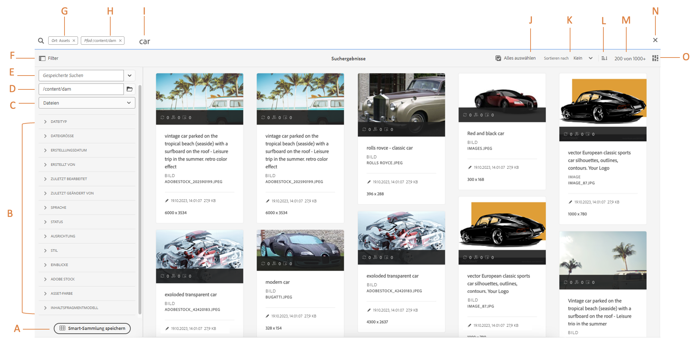
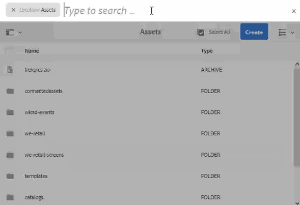

# Suchen nach Assets in AEM  {#search-assets-in-aem}

<table>
    <tr>
        <td>
            <i>Neu</i> <a href="/help/assets/dynamic-media/dm-prime-ultimate.md"><b>Dynamic Media Prime und Ultimate</b></a>
        </td>
        <td>
            <i>Neu</i> <a href="/help/assets/assets-ultimate-overview.md"><b>AEM Assets Ultimate</b></a>
        </td>
        <td>
            <i>Neu</i> <a href="/help/assets/integrate-aem-assets-edge-delivery-services.md"><b>AEM Assets-Integration mit Edge Delivery Services</b></a>
        </td>
        <td>
            <i>Neu</i> <a href="/help/assets/aem-assets-view-ui-extensibility.md"><b>Erweiterbarkeit der Benutzeroberfläche</b></a>
        </td>
          <td>
            <i>Neu</i> <a href="/help/assets/dynamic-media/enable-dynamic-media-prime-and-ultimate.md"><b>Aktivieren von Dynamic Media Prime und Ultimate</b></a>
        </td>
    </tr>
    <tr>
        <td>
            <a href="/help/assets/search-best-practices.md"><b>Best Practices für die Suche</b></a>
        </td>
        <td>
            <a href="/help/assets/metadata-best-practices.md"><b>Best Practices für Metadaten</b></a>
        </td>
        <td>
            <a href="/help/assets/product-overview.md"><b>Content Hub</b></a>
        </td>
        <td>
            <a href="/help/assets/dynamic-media-open-apis-overview.md"><b>Dynamic Media mit OpenAPI-Funktionen</b></a>
        </td>
        <td>
            <a href="https://developer.adobe.com/experience-cloud/experience-manager-apis/"><b>Entwicklerdokumentation zu AEM Assets</b></a>
        </td>
    </tr>
</table>

| Version | Artikel-Link |
| -------- | ---------------------------- |
| AEM 6.5 | [Hier klicken](https://experienceleague.adobe.com/docs/experience-manager-65/assets/using/search-assets.html?lang=de) |
| AEM as a Cloud Service | Dieser Artikel |

[!DNL Adobe Experience Manager Assets] bietet stabile Suchmethoden für Assets, mit denen Sie eine höhere Inhaltsgeschwindigkeit erzielen können. Ihre Teams können die Markteinführungszeit mit einer nahtlosen, intelligenten Asset-Suche verkürzen, indem sie sofort einsetzbare Funktionen und benutzerdefinierte Methoden verwenden. Die Möglichkeit, Assets zu suchen, ist für die Nutzung eines Digital Asset Management-Systems von zentraler Bedeutung. Sei es für die weitere Verwendung durch Kreative, für die robuste Verwaltung von Assets durch Geschäftsanwenderinnen und -anwender und Marketingfachleute oder für die Verwaltung durch DAM-administrierende Personen. Einfache, erweiterte und benutzerdefinierte Suchen, die Sie über die Benutzeroberfläche von [!DNL Assets] oder andere Programme und Oberflächen durchführen können, helfen beim Bewältigen dieser Anwendungsfälle.

Die Asset-Suche in AEM unterstützt die folgenden Anwendungsfälle. Dieser Artikel beschreibt die Verwendung, Konzepte, Konfigurationen, Einschränkungen und Fehlerbehebung für diese Anwendungsfälle.

| Suchen von Assets | Konfigurieren und Verwalten der Suchfunktion | Arbeiten mit Asset-Suchergebnissen |
|---|---|---|
| [Einfache Suchvorgänge](#searchbasics) | [Suchindex](#searchindex) | [Ergebnisse sortieren](#sort) |
| [Benutzeroberfläche für Suchen](#searchui) | [Textextraktion](#extracttextupload) | [Eigenschaften und Metadaten eines Assets überprüfen](#checkinfo) |
| [Suchvorschläge](#searchsuggestions) | [Obligatorische Metadaten](#mandatorymetadata) | [Download](#download) |
| [Suchergebnisse und -verhalten verstehen](#searchbehavior) | [Suchfacetten ändern](#searchfacets) | [Massenaktualisierung von Metadaten](#metadata-updates) |
| [Such-Ranking und -Optimierung](#searchrank) | [Benutzerdefinierte Prädikate](#custompredicates) | [Smart-Sammlungen](#collections) |
| [Erweiterte Suche: Filtern und Suchbereich](#scope) | | [Wissenswertes zu und Fehlerbehebung bei unerwarteten Ergebnissen](#unexpected-results) |
| [Suche aus anderen Lösungen und Apps heraus](#search-assets-other-surfaces):<ul><li>[Adobe Asset Link](#aal)</li><li>[Brand Portal](#brand-portal)</li><li>[Experience Manager-Desktop-Programm](#desktop-app)</li><li>[Adobe Stock-Fotos](#adobe-stock)</li><li>[Dynamic Media-Assets](#search-dynamic-media-assets)</li></ul> | | |
| [Asset-Wähler](#asset-picker) | | |
| [Einschränkungen](#limitations) und [Tipps](#tips) | | |
| [Illustrierte Beispiele](#samples) | | |

Suchen Sie mithilfe des OmniSearch-Felds oben in der [!DNL Experience Manager]-Web-Oberfläche nach Assets. Gehen Sie in [!DNL Experience Manager] zu **[!UICONTROL Assets]** > **[!UICONTROL Dateien]**, klicken Sie in der oberen Leiste auf , geben Sie den Suchbegriff ein und wählen Sie `Return` aus. Alternativ können Sie die Keyword-Tastenkombination `/` (Schrägstrich) verwenden, um das OmniSearch-Feld zu öffnen. `Location:Assets` ist vorausgewählt, um die Suche auf DAM-Assets zu begrenzen. `Path:/content/dam` wird auch angezeigt, wenn Sie eine Suche auf der Stammebene innerhalb des Ordners **[!UICONTROL Dateien]** durchführen. Wenn Sie zu einem anderen Ordner navigieren, wird `Path:/content/dam/<folder name>` im OmniSearch-Feld angezeigt, um den Suchbereich auf den aktuellen Ordner zu beschränken. [!DNL Experience Manager] liefert Vorschläge, sobald Sie mit der Eingabe eines Suchbegriffs beginnen.

Verwenden Sie das Bedienfeld **[!UICONTROL Filter]**, um nach Assets, Ordnern, Tags und Metadaten zu suchen. Sie können Suchergebnisse anhand der verschiedenen Optionen (Prädikate) filtern, z. B. Dateityp, Dateigröße, Datum der letzten Änderung, Status des Assets, Einblicke und Adobe Stock-Lizenzierung. Sie können das Bedienfeld „Filter“ anpassen und Suchprädikate über [Suchfacetten](/help/assets/search-facets.md) hinzufügen oder entfernen. Der Filter [!UICONTROL Dateityp] im Bedienfeld [!UICONTROL Filter] verfügt über Kontrollkästchen für gemischte Status. Wenn Sie also nicht alle verschachtelten Prädikate (oder Formate) auswählen, werden die Kontrollkästchen der ersten Ebene teilweise markiert.

Die [!DNL Experience Manager]-Suchfunktionen erlauben die Suche nach Sammlungen sowie die Suche nach Assets in einer Sammlung. Siehe [Suchen nach Sammlungen](/help/assets/manage-collections.md).

## Verstehen der Asset-Suchoberfläche {#searchui}

Machen Sie sich mit der Asset-Suchoberfläche und den verfügbaren Aktionen vertraut.
<!--

-->

*Abbildung: Grundlagen [!DNL Experience Manager Assets] Benutzeroberfläche für Suchergebnisse.*

**A.** Suche als Smart-Sammlung speichern.
**B.** Filter oder Prädikate zur Eingrenzung der Suchergebnisse.
**C.** Dateien, Ordner oder beides anzeigen.
**D.** Die Suchposition ist DAM.
**E.** Auf gespeicherte Suchen zugreifen.
**F.** Klicken Sie auf „Filter“, um die linke Leiste zu öffnen oder zu schließen.
**G.** Zeigt Assets als Standardsuche an.
**H.** Die Suchposition ist DAM.
**I.** Omnisearch-Feld mit benutzerdefiniertem Suchbegriff.
**J.** Geladene Suchergebnisse auswählen.
**K.** Sortieren nach Erstellt, Geändert, Name, Keine.
**L.** Sortieren nach aufsteigender oder absteigender Reihenfolge
**M.** Anzahl der angezeigten Suchergebnisse im Verhältnis zu den gesamten Suchergebnissen. **N.** Die Suche schließen.
**O.** Zwischen Karten- und Listenansicht wechseln.

### Dynamische Suchfacetten {#dynamicfacets}

Sie können die gewünschten Assets schneller auf der Suchergebnisseite ausfindig machen, indem Sie die dynamisch aktualisierte Anzahl der erwarteten Suchergebnisse in den Suchfacetten verwenden. Die erwartete Anzahl an Assets wird noch vor Anwendung des Suchfilters aktualisiert. Durch Anzeige der erwarteten Anzahl im Filter können Sie schnell und effizient durch Suchergebnisse navigieren.

*Abbildung: Anzeigen der ungefähren Asset-Anzahl ohne Filterung der Suchergebnisse in Suchfacetten.*

Experience Manager Assets zeigt die Facettenanzahl für zwei Eigenschaften standardmäßig an:

* Asset-Typ (jcr:content/metadata/dc:format)

* Genehmigungsstatus (jcr:content/metadata/dam:status)

Ab August 2023 enthält Experience Manager Assets eine neue Version 9 von Index `damAssetLucene`. Die vorherigen Versionen, `damAssetLucene-8` und niedriger, verwenden den `statistical`-Modus, um die Zugriffssteuerung für ein Beispiel der Elemente für die einzelnen Suchfacettenzählungen zu überprüfen.

`damAssetLucene-9` ändert das Verhalten der Facettenzählung der Oak-Abfrage, damit die Zugriffskontrolle nicht mehr entsprechend der Facettenzahlen ausgewertet wird, die vom zugrunde liegenden Suchindex zurückgegeben werden, was zu schnelleren Antwortzeiten bei der Suche führt. Daher werden den Benutzenden möglicherweise Werte für die Facettenanzahl angezeigt, die Assets enthalten, auf die sie keinen Zugriff haben. Diese Benutzenden können nicht auf andere Details dieser Assets zugreifen oder diese herunterladen oder lesen, einschließlich ihrer Pfade, und sie können keine weiteren Informationen zu ihnen erhalten.

Wenn Sie zum vorherigen Verhalten (`statistical`-Modus) wechseln müssen, lesen Sie [Inhaltssuche und -indizierung](https://experienceleague.adobe.com/docs/experience-manager-cloud-service/content/operations/indexing.html?lang=de), um eine benutzerdefinierte Version des `damAssetLucene-9`-Indexes zu erstellen. Adobe rät aufgrund der Auswirkungen auf die Antwortzeiten der Suche mit großen Ergebnismengen davon ab, zum `secure`-Modus zu wechseln.

Weitere Informationen zu den Facettenfunktionen von Oak, einschließlich einer detaillierten Beschreibung dieser Modi, finden Sie unter [Facetten – Oak-Dokumentation – Lucene-Index](https://jackrabbit.apache.org/oak/docs/query/lucene.html#facets).

## Suchvorschläge bei der Eingabe {#searchsuggestions}

Wenn Sie mit der Eingabe eines Keywords beginnen, schlägt Experience Manager mögliche Keywords oder Phrasen vor. Die Vorschläge basieren auf den Assets in Experience Manager. Experience Manager indiziert alle Metadatenfelder, um die Suche zu erleichtern. Zur Bereitstellung von Suchvorschlägen verwendet das System die Werte der folgenden Metadatenfelder. Um Suchvorschläge zu erhalten, können Sie die folgenden Felder mit geeigneten Keywords ausfüllen:

* Asset-Tags. (Zuordnung zu `jcr:content/metadata/cq:tags`)
* Asset-Titel. (Zuordnung zu `jcr:content/metadata/dc:title`)
* Asset-Beschreibung. (Zuordnung zu `jcr:content/metadata/dc:description`)
* Titel im JCR-Repository. Der Wert wird ggf. dem Asset-Titel zugeordnet. (Zuordnung zu `jcr:content/jcr:title`)
* Beschreibung im JCR-Repository. Der Wert wird ggf. der Asset-Beschreibung zugeordnet. (Zuordnung zu `jcr:content/jcr:description`)

## Suchergebnisse und -verhalten verstehen {#searchbehavior}

### Grundlegende Suchbegriffe und -ergebnisse {#searchbasics}

Sie können im OmniSearch-Feld mit Keywords suchen. Bei der Suche mit Keywords wird nicht zwischen Groß- und Kleinschreibung unterschieden und es handelt sich um eine Volltextsuche (über die gängigen Metadatenfelder hinweg). Wenn mehrere Keywords verwendet werden, ist `AND` der Standardoperator zwischen den Keywords.

Die Ergebnisse werden nach Relevanz sortiert, beginnend mit den größten Übereinstimmungen. Bei mehreren Keywords sind Assets, die beide Begriffe in ihren Metadaten enthalten, relevanter. In Metadaten werden Keywords, die als Smart-Tags erscheinen, höher eingestuft als Keywords, die in anderen Metadatenfeldern auftauchen. [!DNL Experience Manager] bietet Ihnen die Möglichkeit, einem bestimmten Suchbegriff mehr Gewicht zu verleihen. Außerdem können Sie für bestimmte Suchbegriffe das [Ranking einiger ausgewählter Assets erhöhen](#searchrank).

Zum schnellen Auffinden der benötigten Assets bietet die Rich-Oberfläche Filter-, Sortierungs- und Auswahlverfahren. Sie können Ergebnisse anhand mehrerer Kriterien filtern und für verschiedene Filter die Anzahl der durchsuchten Assets anzeigen. Alternativ können Sie die Suche erneut ausführen, indem Sie die Abfrage im OmniSearch-Feld ändern. Wenn Sie Suchbegriffe oder Filter ändern, bleiben die anderen Filter angewendet, um den Kontext Ihrer Suche zu wahren.

Wenn die Ergebnisse viele Assets sind, zeigt [!DNL Experience Manager] die ersten 100 in der Kartenansicht und 200 in der Listenansicht an. Wenn die Benutzer scrollen, werden mehr Assets geladen. Dies dient zur Verbesserung der Leistung. Sehen Sie sich eine Videodemonstration zur [Anzahl der angezeigten Assets](https://www.youtube.com/watch?v=LcrGPDLDf4o) an.

Manchmal werden in den Suchergebnissen auch unerwartete Assets angezeigt. Weitere Informationen dazu finden Sie unter [Unerwartete Ergebnisse](#unexpected-results).

[!DNL Experience Manager] kann viele Dateiformate suchen und die Suchfilter können an Ihre geschäftlichen Anforderungen angepasst werden. Wenden Sie sich an Ihren Administrator, um zu erfahren, welche Suchoptionen für Ihr DAM-Repository zur Verfügung stehen und welche Einschränkungen Ihr Konto haben kann.

<!-- 
### Results with and without enhanced Smart Tags {#withsmarttags}

By default, [!DNL Experience Manager] search combines the search terms with an AND clause. For example, consider searching for keywords woman running. Only the assets with both woman and running keywords in the metadata appear in the search results by default. The same behavior is retained when special characters (periods, underscores, or dashes) are used with the keywords. The following search queries return the same results:

* `woman running`
* `woman.running`
* `woman-running`

However, the query `woman -running` returns assets without `running` in their metadata.
Using Smart Tags adds an extra `OR` clause to find any of the search terms as the applied smart tags. An asset tagged with either `woman` or `running` using Smart Tags also appear in such a search query. So the search results are a combination of,

* Assets with `woman` and `running` keywords in the metadata (default behavior).

* Assets smart tagged with either of the keywords (Smart Tags behavior).
-->

### Such-Ranking und -Optimierung {#searchrank}

Die Suchergebnisse, die in Metadatenfeldern alle Suchbegriffe aufweisen, werden zuerst angezeigt. Danach folgen die Suchergebnisse, die einem oder mehr Suchbegriffen in den Smart-Tags entsprechen. Im obigen Beispiel werden die Suchergebnisse ungefähr in dieser Reihenfolge angezeigt:

1. Treffer von `woman running` in den verschiedenen Metadatenfeldern.
1. Treffer von `woman running` in den Smart-Tags.
1. Treffer von `woman` oder `running` in Smart-Tags.

Sie können die Relevanz von Keywords für bestimmte Assets verbessern, um die auf Keywords basierenden Suchen zu optimieren. D. h. die Bilder, für die Sie bestimmte Keywords festlegen, erscheinen bei der Suche nach diesen Keywords oben in den Suchergebnissen.

1. Öffnen Sie in der [!DNL Assets]-Benutzeroberfläche die Seite „Eigenschaften“ für das Asset. Klicken Sie auf **[!UICONTROL Erweitert]** und klicken Sie dann auf **[!UICONTROL Hinzufügen]** unter **[!UICONTROL Für Keywords erhöhen]**.
1. Geben Sie im Feld **[!UICONTROL Suche priorisieren]** ein Keyword ein, für den Sie die Bildsuche optimieren möchten, und klicken Sie anschließend auf **[!UICONTROL Hinzufügen]**. Sie können auf dieselbe Weise mehrere Keywords eingeben.
1. Klicken Sie auf **[!UICONTROL Speichern und schließen]**. Das Asset, das Sie für dieses Keyword erhöht haben, befindet sich unter den obersten Suchergebnissen.

So können Sie das Ranking bestimmter Assets in den Keywords für das jeweilige Keyword erhöhen. Siehe Beispielvideo unten. Weitere Informationen finden Sie unter [Suchen in [!DNL Experience Manager]](https://experienceleague.adobe.com/docs/experience-manager-learn/assets/search-and-discovery/search-boost.html?lang=de).

>[!VIDEO](https://video.tv.adobe.com/v/16766/?quality=6)

*Video: Erfahren Sie, wie Suchergebnisse ihren Rang erhalten und wie der Rang beeinflusst werden kann.*

## Konfigurieren der Asset-Batch-Größe für die Anzeige von Suchergebnissen {#configure-asset-batch-size}

Admins können jetzt die Batch-Größe von Assets konfigurieren, die bei einer Suche angezeigt werden. Die Asset-Suchergebnisse zeigen ein Vielfaches der konfigurierten Batch-Größenanzahl an, wenn Sie weiter nach unten scrollen, um die Ergebnisse zu laden. Sie können aus den verfügbaren Batch-Größen von 200, 500 oder 1000 Assets auswählen. Wenn Sie eine niedrigere Batch-Größenanzahl festlegen, werden die Antwortzeiten der Suche beschleunigt.

Wenn Sie beispielsweise die Ergebnisanzahl auf eine Batch-Größe von 200 Assets festlegen, zeigt Experience Manager Assets beim Starten der Suche in den Suchergebnissen eine Batch-Größe von 200 Assets an. Wenn Sie nach unten scrollen, um durch die Suchergebnisse zu navigieren, wird der nächste Batch von 200 Assets angezeigt. Der Prozess wird fortgesetzt, bis alle Assets, die der Suchabfrage entsprechen, angezeigt wurden.

So konfigurieren Sie die Asset-Batch-Größe:

1. Navigieren Sie zu **[!UICONTROL Tools]** > **[!UICONTROL Assets]** > **[!UICONTROL Asset-Konfigurationen]** > **[!UICONTROL Omnisearch-Konfiguration für Assets]**.

1. Wählen Sie die Begrenzung der Ergebnisanzahl aus und klicken Sie auf **[!UICONTROL Speichern]**.

   

## Erweiterte Suche {#scope}

[!DNL Experience Manager] bietet verschiedene Methoden wie Filter, die sich auf die durchsuchten Assets anwenden lassen, damit Sie gewünschte Assets schneller finden können. Nachfolgend werden einige häufig verwendete Methoden beschrieben. Im Folgenden werden einige [illustrierte Beispiele](#samples) vorgestellt.

**Nach Dateien oder Ordnern suchen**: In den Suchergebnissen sehen Sie entweder Dateien, Ordner oder beides. Wählen Sie im Bedienfeld **[!UICONTROL Filter]** die entsprechende Option aus. Siehe [Suchoberfläche](#searchui).

**In einem Ordner nach Assets suchen**: Sie können die Suche auf einen bestimmten Ordner beschränken. Fügen Sie im Bedienfeld **[!UICONTROL Filter]** den Pfad eines Ordners hinzu. Sie können immer nur einen Ordner auf einmal hinzufügen.

<!--

-->

*Abbildung: Suchergebnisse durch Hinzufügen eines Ordnerpfads im Bedienfeld „Filter“ auf einen Ordner begrenzen.*

### Suchen ähnlicher Bilder {#visualsearch}

Wenn Sie Bilder suchen möchten, die einem vom Benutzer ausgewählten Bild ähneln, klicken Sie in der Kartenansicht eines Bildes oder in der Symbolleiste auf **[!UICONTROL Ähnliche suchen]**. [!DNL Experience Manager] zeigt die Bilder mit Smart-Tags aus dem DAM-Repository an, die einem vom Benutzer ausgewählten Bild ähnlich sind.

*Abbildung: Suchen Sie ähnliche Bilder mithilfe der Option in der Kartenansicht.*

### Adobe Stock-Fotos {#adobe-stock}

Benutzer können aus der [!DNL Experience Manager]-Benutzeroberfläche heraus nach [Adobe Stock-Assets](/help/assets/aem-assets-adobe-stock.md) suchen und die angefragten Assets lizenzieren. Fügen Sie `Location: Adobe Stock` in der OmniSearch-Leiste hinzu. Sie können auch das Bedienfeld „Filter“ verwenden, um alle lizenzierten oder nicht lizenzierten Assets zu suchen bzw. mit der Adobe Stock-Dateinummer nach einem bestimmten Asset suchen.

### Dynamic Media-Assets {#dmassets}

Sie können nach Dynamic Media-Bildern filtern, indem Sie die Option **[!UICONTROL Dynamic Media]** > **[!UICONTROL Sets]** im Bedienfeld **[!UICONTROL Filter]** auswählen. Dadurch werden Assets wie Bildsets, Karussells, Sets für gemischte Medien und Rotationssets gefiltert und angezeigt.

### GQL – Mit bestimmten Werten in Metadatenfeldern suchen {#gql-search}

Anhand exakter Werte bestimmter Metadatenfelder wie Titel, Beschreibung und Ersteller können Sie nach Assets suchen. Die Volltextsuchfunktion GQL ruft nur jene Assets ab, deren Metadatenwert exakt mit Ihrer Suchanfrage übereinstimmt. Bei den Namen der Eigenschaften (z. B. Ersteller, Titel usw.) und Werten wird zwischen Groß- und Kleinschreibung unterschieden.

| Metadatenfeld | Facettenwert und Nutzung |
|---|---|
| Titel | title:John |
| Ersteller | creator:John |
| Speicherort | location:NA |
| Beschreibung | description:&quot;Sample Image&quot; |
| Erstellungswerkzeug | creatortool:&quot;Adobe Photoshop&quot; |
| Urheberrechtsbesitzer | copyrightowner:&quot;Adobe Systems&quot; |
| Mitarbeiter | contributor:John |
| Nutzungsbedingungen | usageterms:„CopyRights Reserved“ |
| Erstellt | created:YYYY-MM-DDTHH |
| Ablaufdatum | expires:YYYY-MM-DDTHH |
| Einschaltzeit | ontime:YYYY-MM-DDTHH |
| Ausschaltzeit | offtime:YYYY-MM-DDTHH |
| Zeitraum (expires dateontime,offtime) | facet field : lowerbound.upperbound |
| Pfad | /content/dam/&lt;folder name> |
| PDF-Titel | pdftitle:„Adobe Document“ |
| Betreff | subject:„Training“ |
| Tags | tags:„Location And Travel“ |
| Typ | type:&quot;image\png&quot; |
| Bildbreite | width:lowerbound.upperbound |
| Bildhöhe | height:lowerbound.upperbound |
| Person | person:John |

Die Eigenschaften `path`, `limit`, `size` und `orderby` können nicht mit dem Operator `OR` mit einer anderen Eigenschaft kombiniert werden.

<!-- TBD: Where are the limit, size, orderby properties defined?
-->

Das Keyword für eine von einem Benutzer erstellte Eigenschaft ist ihre Feldbeschriftung im Eigenschafteneditor in Kleinbuchstaben und ohne Leerzeichen.

Im Folgenden finden Sie einige Beispiele für Suchformate für komplexe Abfragen:

* Anzeigen aller Assets mit mehreren Facettenfeldern (wie: „title=John Doe“ und „creator tool=Adobe Photoshop“): `title:"John Doe" creatortool:Adobe*`
* So zeigen Sie alle Assets an, wenn der Facettenwert nicht ein einzelnes Wort, sondern ein Satz ist (wie: title=Scott Reynolds): `title:"Scott Reynolds"`
* So zeigen Sie alle Assets mit mehreren Werten für eine einzelne Eigenschaft an (wie: title=Scott Reynolds oder John Doe): `title:"Scott Reynolds" OR "John Doe"`
* So zeigen Sie Assets an, deren Eigenschaftswerte mit einer bestimmten Zeichenfolge beginnen (wie: title ist Scott Reynolds): `title:Scott*`
* So zeigen Sie Assets an, deren Eigenschaftswerte mit einer bestimmten Zeichenfolge enden (wie: title ist Scott Reynolds): `title:*Reynolds`
* So zeigen Sie Assets mit einem Eigenschaftswert an, der eine bestimmte Zeichenfolge enthält (wie: title=Basel Meeting Room): `title:*Meeting*`
* So zeigen Sie Assets an, die eine bestimmte Zeichenfolge enthalten und einen bestimmten Eigenschaftswert aufweisen (wie die Suche nach der Zeichenfolge „Adobe“ in Assets mit title=John Doe): `*Adobe* title:"John Doe"`

## Suche nach Assets über andere [!DNL Experience Manager]-Angebote oder -Oberflächen {#search-assets-other-surfaces}

[!DNL Adobe Experience Manager] verbindet das DAM-Repository mit verschiedenen anderen [!DNL Experience Manager]-Lösungen, um den Zugriff auf digitale Assets zu beschleunigen und die Kreativ-Workflows zu optimieren. Jede Asset-Erkennung beginnt mit dem Durchsuchen oder Suchen. Das Suchverhalten ist über die verschiedenen Oberflächen und Lösungen hinweg weitgehend gleich. Einige Suchmethoden ändern sich je nach Zielgruppe, Anwendungsfällen und Benutzeroberfläche der jeweiligen [!DNL Experience Manager]-Lösung. Die genauen Methoden für die einzelnen Lösungen sind unter den unten stehenden Links dokumentiert. Die allgemein anwendbaren Tipps und Verhaltensweisen werden in diesem Artikel beschrieben.

### Nach Assets über das Bedienfeld „Adobe Asset Link“ suchen {#aal}

Mit Adobe Asset Link können Kreativprofis jetzt auf in [!DNL Experience Manager Assets] gespeicherte Inhalte zugreifen, ohne die unterstützten Adobe Creative Cloud-Programme verlassen zu müssen. Kreative können mit dem In-App-Bedienfeld in folgenden [!DNL Adobe Creative Cloud]-Programmen Assets nahtlos suchen, durchsuchen sowie ein- und auschecken: [!DNL Adobe Photoshop], [!DNL Adobe Illustrator] und [!DNL Adobe InDesign]. Asset Link ermöglicht es Benutzern auch, nach visuell ähnlichen Ergebnissen zu suchen. Die Ergebnisse der visuellen Suchanzeige basieren auf den maschinellen Lernalgorithmen von Adobe Sensei und helfen Benutzern dabei, optisch ähnliche Bilder zu finden. Siehe [Assets suchen und durchsuchen](https://helpx.adobe.com/de/enterprise/using/manage-assets-using-adobe-asset-link.html#UseAdobeAssetLink) mit Adobe Asset Link.

### Suchen nach Assets im [!DNL Experience Manager]-Desktop-Programm {#desktop-app}

Kreativprofis verwenden das Desktop-Programm, um auf ihrem lokalen Desktop (Windows oder Mac) das [!DNL Experience Manager Assets] bequem zu durchsuchen und verfügbar zu machen. Kreative können die gewünschten Assets in Mac Finder oder Windows Explorer leicht anzeigen, in Desktop-Programmen öffnen und lokal ändern. Die Änderungen werden dann wiederum unter einer neuen, im Repository erstellten Version in [!DNL Experience Manager] gespeichert. Das Programm unterstützt einfache Suchvorgänge mit einem oder mehreren Keywords, den Platzhaltern `*` und `?` sowie dem Operator `AND`. Siehe [Assets durchsuchen und suchen sowie Vorschau für Assets anzeigen](https://experienceleague.adobe.com/docs/experience-manager-desktop-app/using/using.html?lang=de#browse-search-preview-assets) im Desktop-Programm.

### Suchen nach Assets in [!DNL Brand Portal] {#brand-portal}

Geschäftsbenutzer und Marketing-Experten nutzen Brand Portal, um genehmigte digitale Assets effizient und sicher mit erweiterten internen Teams, Partnern und Wiederverkäufern zu teilen. Siehe [Suchen von Assets in Brand Portal](https://experienceleague.adobe.com/docs/experience-manager-brand-portal/using/search-capabilities/brand-portal-searching.html?lang=de).

### Suchen von [!DNL Adobe Stock]-Bildern {#adobe-stock1}

Benutzer können aus der [!DNL Experience Manager]-Benutzeroberfläche heraus nach Adobe Stock-Assets suchen und die angefragten Assets lizenzieren. Fügen Sie `Location: Adobe Stock` im OmniSearch-Feld hinzu. Sie können auch das Bedienfeld **[!UICONTROL Filter]** verwenden, um alle lizenzierten oder nicht lizenzierten Assets zu suchen bzw. mit der Adobe Stock-Dateinummer nach einem bestimmten Asset suchen. Siehe [Verwalten [!DNL Adobe Stock] von Bildern in [!DNL Experience Manager]](/help/assets/aem-assets-adobe-stock.md#usemanage).

### Suchen von [!DNL Dynamic Media]-Assets {#search-dynamic-media-assets}

Sie können nach Dynamic Media-Bildern filtern, indem Sie die Option **[!UICONTROL Dynamic Media]** > **[!UICONTROL Sets]** im Bedienfeld **[!UICONTROL Filter]** auswählen. Dadurch werden Assets wie Bildsets, Karussells, Sets für gemischte Medien und Rotationssets gefiltert und angezeigt. Beim Erstellen von Web-Seiten können Autoren in der Inhaltssuche nach Sets suchen. Ein Filter für Sets ist in einem Popup-Menü verfügbar.

### Suchen nach Assets in der Inhaltssuche beim Erstellen von Web-Seiten {#content-finder}

Autoren können mit der Inhaltssuche das DAM-Repository nach den relevanten Assets durchsuchen und die Assets auf den von ihnen erstellten Web-Seiten verwenden. Autoren können auch die Funktion „Connected Assets“ verwenden, um nach Assets zu suchen, die in einer Remote-Bereitstellung von [!DNL Experience Manager] verfügbar sind. Autoren können diese Assets dann auf Webseiten in einer lokalen [!DNL Experience Manager]-Bereitstellung verwenden. Siehe [Remote-Assets verwenden](/help/assets/use-assets-across-connected-assets-instances.md#use-remote-assets).

### Suchen nach Sammlungen {#collections}

Die [!DNL Experience Manager]-Suchfunktionen erlauben die Suche nach Sammlungen sowie die Suche nach Assets in einer Sammlung. Siehe [Suchen nach Sammlungen](/help/assets/manage-collections.md).

## Asset-Wähler {#asset-picker}

Mit dem Asset-Wähler (Asset-Auswahl in älteren Versionen von [!DNL Adobe Experience Manager]) können Sie DAM-Assets auf besondere Weise suchen, filtern und durchsuchen. Der Asset-Wähler ist verfügbar unter `https://[aem_server]:[port]/aem/assetpicker.html`. Sie können die Metadaten der Assets, die Sie über den Asset-Wähler auswählen, abrufen. Sie können ihn mit unterstützten Anfrageparametern wie dem Asset-Typ (Bild, Video, Text) und dem Auswahlmodus (eine oder mehrere Auswahlen) starten. Diese Parameter legen den Kontext des Asset-Wählers für eine bestimmte Suchinstanz fest und bleiben während der Auswahl intakt.

Der Asset-Wähler verwendet die HTML5-Meldung `Window.postMessage`, um Daten für das ausgewählte Asset an den Empfänger zu senden. Er funktioniert nur im Durchsuchen-Modus und nur mit der Omnisearch-Ergebnisseite.

Sie können die folgenden Anfrageparameter in einer URL übergeben, um den Asset-Wähler in einem bestimmten Kontext zu starten:

| Name | Werte | Beispiel | Zweck |
|---|---|---|---|
| resource suffix (B) | Ordnerpfad als Ressourcensuffix in der URL: [https://localhost:4502/aem/assetpicker.html/&lt;Ordnerpfad>](https://localhost:4502/aem/assetpicker.html) | Zum Starten des Asset-Wählers mit einem bestimmten Ordner, z. B. mit ausgewähltem Ordner `/content/dam/we-retail/en/activities`, sollte die URL wie folgt aussehen: `https://localhost:4502/aem/assetpicker.html/content/dam/we-retail/en/activities?assettype=images` | Wenn beim Starten des Asset-Wählers ein bestimmter Ordner ausgewählt sein soll, können Sie ihn als Ressourcensuffix übergeben. |
| `mode` | single, multiple | <ul><li>`https://localhost:4502/aem/assetpicker.html?mode=single`</li><li>`https://localhost:4502/aem/assetpicker.html?mode=multiple`</li></ul> | Im Modus „multiple“ können Sie mit dem Asset-Wähler mehrere Assets gleichzeitig auswählen. |
| `dialog` | true, false | [https://localhost:4502/aem/assetpicker.html?dialog=true](https://localhost:4502/aem/assetpicker.html?dialog=true) | Verwenden Sie diese Parameter, um den Asset-Wähler als Granite-Dialogfeld zu öffnen. Diese Option ist nur relevant, wenn Sie den Asset-Wähler per Granite-Pfadfeld starten und als pickerSrc-URL konfigurieren. |
| `root` | &lt;folder_path> | `https://localhost:4502/aem/assetpicker.html?assettype=images&root=/content/dam/we-retail/en/activities` | Verwenden Sie diese Option, um den Stammordner für den Asset-Wähler anzugeben. In diesem Fall können Sie mit dem Asset-Wähler nur untergeordnete Assets (direkt/indirekt) unter dem Stammordner auswählen. |
| `viewmode` | Suchen | | Dies startet den Asset-Wähler im Suchmodus mit den Parametern `assettype` und `mimetype`. |
| `assettype` | Bilder, Dokumente, Multimedia, Archive. | <ul><li>`https://localhost:4502/aem/assetpicker.html?viewmode=search&assettype=images`</li><li> `https://localhost:4502/aem/assetpicker.html?viewmode=search&assettype=documents` </li><li> `https://localhost:4502/aem/assetpicker.html?viewmode=search&assettype=multimedia` </li><li> `https://localhost:4502/aem/assetpicker.html?viewmode=search&assettype=archives` </li></ul> | Verwenden Sie diese Option, um die Asset-Typen basierend auf dem angegebenen Wert zu filtern. |
| `mimetype` | MIME-Typ (`/jcr:content/metadata/dc:format`) eines Assets (Platzhalter wird ebenfalls unterstützt). | <ul><li>`https://localhost:4502/aem/assetpicker.html?mimetype=image/png`</li><li>`https://localhost:4502/aem/assetpicker.html?mimetype=*png`</li><li>`https://localhost:4502/aem/assetpicker.html?mimetype=*presentation`</li><li>`https://localhost:4502/aem/assetpicker.html?mimetype=*presentation&mimetype=*png`</li></ul> | Verwenden Sie diese Option zum Filtern von Assets anhand von MIME-Typen. |

Wechseln Sie für den Zugriff auf die Benutzeroberfläche des Asset-Wählers zu `https://[aem_server]:[port]/aem/assetpicker`. Navigieren Sie zum gewünschten Ordner und wählen Sie mindestens ein Asset aus. Alternativ können Sie im OmniSearch-Feld nach dem gewünschten Asset suchen, je nach Bedarf filtern und das Asset dann auswählen.

<!---->

*Abbildung: Asset im Asset-Wähler durchsuchen und auswählen*

## Einschränkungen {#limitations}

Die Suchfunktion in [!DNL Experience Manager Assets] unterliegt folgenden Einschränkungen:

* Beginnen Sie die Suchanfrage nicht mit einem Leerzeichen, da die Suche sonst nicht funktioniert.
* [!DNL Experience Manager] zeigt den Suchbegriff ggf. weiter an, nachdem Sie Eigenschaften eines Assets aus den Suchergebnissen ausgewählt und die Suche dann abgebrochen haben. <!-- (CQ-4273540) -->
* Bei der Suche nach Ordnern bzw. Dateien und Ordnern können die Suchergebnisse mit keinem anderen Parameter sortiert werden.
* Wenn Sie `Return` auswählen, ohne etwas in die OmniSearch-Leiste einzugeben, gibt [!DNL Experience Manager] eine Liste mit Dateien und nicht mit Ordnern zurück. Wenn Sie gezielt nach Ordnern suchen, ohne ein Keyword zu verwenden, gibt [!DNL Experience Manager] keine Ergebnisse zurück.
* Sie können auch eine Volltextsuche in Ordnern durchführen. Geben Sie einen Suchbegriff an, damit die Suche funktioniert.

Visuelle Suchen oder Ähnlichkeitssuchen weisen die folgenden Einschränkungen auf:

* Die visuelle Suche funktioniert am besten mit einem großen Repository. Zwar ist keine Mindestanzahl von Bildern für gute Ergebnisse erforderlich, doch ist die Qualität der Treffer bei einigen Bildern möglicherweise nicht so hoch wie bei Treffern aus einem großen Repository.
* Sie können das Modell weder ändern noch [!DNL Experience Manager] so trainieren, dass ähnliche Bilder gefunden werden. Das Hinzufügen oder Entfernen von Smart-Tags zu bzw. von einigen Assets verändert das Modell beispielsweise nicht. Die Assets werden aus den visuell ähnlichen Suchergebnissen ausgeschlossen.

Die Suchfunktion kann in den folgenden Szenarien Leistungseinschränkungen aufweisen:

* Die Kartenansicht hat eine kürzere Ladezeit als die Listenansicht, um die Suchergebnisse anzuzeigen.

## Suchtipps {#tips}

* Wenn Sie den Prüfungsstatus von Assets überwachen, verwenden Sie die entsprechende Option, um herauszufinden, welche Assets genehmigt wurden und für welche Assets die Genehmigung aussteht.
* Verwenden Sie das Prädikat „Einblicke“, um basierend auf den Nutzungsstatistiken diverser Creative Cloud-Programme nach unterstützten Assets zu suchen. Nutzungsdaten werden unter Nutzungsbewertung, Impressions, Klicks und Medienkanäle gruppiert, in denen die Assets anhand von Kategorien angezeigt werden.
* Aktivieren Sie das Kontrollkästchen **[!UICONTROL Alle auswählen]**, um die gesuchten Assets auszuwählen. [!DNL Experience Manager] zeigt zunächst 100 Assets in der Kartenansicht und 200 Assets in der Listenansicht an. Beim Scrollen durch die Suchergebnisse werden weitere Assets geladen. Sie können mehr Assets als die geladenen Assets auswählen. Die Anzahl der ausgewählten Assets wird oben rechts auf der Suchergebnisseite angezeigt. Sie können die Auswahl bearbeiten, indem Sie beispielsweise die ausgewählten Assets herunterladen, die Metadateneigenschaften stapelweise für die ausgewählten Assets aktualisieren oder die ausgewählten Assets einer Sammlung hinzufügen. Wenn mehr Assets ausgewählt sind als angezeigt werden, wird eine Aktion entweder auf alle ausgewählten Assets angewendet oder ein Dialogfeld zeigt die Anzahl der Assets an, auf die sie angewendet wird. Um eine Aktion auf die Assets anzuwenden, die nicht geladen wurden, stellen Sie sicher, dass alle Assets explizit ausgewählt sind.
* Informationen zum Suchen nach Assets, die keine obligatorischen Metadaten enthalten, finden Sie unter [Obligatorische Metadaten](#mandatorymetadata).
* Die Suche nutzt alle Metadatenfelder. Eine allgemeine Suche, z. B. nach 12, gibt in der Regel viele Ergebnisse zurück. Für bessere Ergebnisse sollten Sie doppelte (nicht einfache) Anführungszeichen verwenden oder sicherstellen, dass die Zahl an ein Wort ohne Sonderzeichen angrenzt (z. B. `shoe12`).
* Die Volltextsuche unterstützt Operatoren wie `-` und `^`. Um diese Buchstaben als alphabetische Zeichenfolgen zu suchen, setzen Sie den Suchausdruck in doppelte Anführungszeichen. Verwenden Sie beispielsweise `"Notebook - Beauty"` anstatt `Notebook - Beauty`.
* Wenn es zu viele Suchergebnisse gibt, schränken Sie den [Suchbereich](#scope) ein, um die gewünschten Assets leichter finden zu können. Das funktioniert am besten, wenn Sie eine Ahnung davon haben, wie Sie besser nach den gewünschten Assets suchen können (z. B. nach einem bestimmten Dateityp, nach einem bestimmten Speicherort, nach bestimmten Metadaten usw.).

* **Tagging**: Mit Tags können Sie Assets kategorisieren, damit sie sich leichter durchsuchen und suchen lassen. Tagging hilft bei der Verbreitung der entsprechenden Taxonomie an andere Benutzer und Workflows. [!DNL Experience Manager] bietet Methoden zum automatischen Taggen von Assets mit den KI-Services von Adobe Sensei, die beim Taggen von Assets durch Verwendung und Training immer besser werden. Wenn Sie nach Assets suchen, werden die Smart-Tags einbezogen. Sie funktioniert zusammen mit der integrierten Suchfunktion. Siehe [Suchverhalten](#searchbehavior). Um die Reihenfolge zu optimieren, in der die Suchergebnisse angezeigt werden, können Sie für einige ausgewählte Assets das [Such-Ranking optimieren](#searchrank).

* **Indizierung**: In den Suchergebnissen werden nur indizierte Metadaten und Assets zurückgegeben. Um eine bessere Abdeckung und Leistung zu erzielen, stellen Sie eine ordnungsgemäße Indizierung sicher und befolgen Sie die Best Practices. Siehe [Indizierung](#searchindex).

## Einige Beispiele zur Illustration der Suche {#samples}

Verwenden Sie doppelte Anführungszeichen um Keywords, um Assets zu finden, die den genauen Wortlaut in der genauen vom Benutzer angegebenen Reihenfolge enthalten.

*Abbildung: Suchverhalten mit und ohne Anführungszeichen.*

**Suche mit Sternchen als Platzhalter**: Wenn Sie die Suche erweitern möchten, verwenden Sie ein Sternchen vor oder nach dem Suchbegriff, um Treffer mit einer beliebigen Anzahl von Zeichen zu erhalten. Wenn Sie beispielsweise ohne Sternchen nach „run“ suchen, werden keine Assets zurückgegeben, die Varianten des Worts enthalten (auch in den Metadaten). Ein Sternchen ersetzt eine beliebige Anzahl von Zeichen. Zum Beispiel:

* `run` gibt Assets mit dem genauen Keyword „run“ zurück.
* `run*` gibt Assets mit `running`, `run`, `runaway` usw. zurück.
* `*run` gibt Assets mit `outrun`, `rerun` usw. zurück.
* `*run*` gibt alle möglichen Kombinationen zurück.

*Abbildung: Illustration der Nutzung eines Sternchen-Platzhalters bei der Asset-Suche anhand eines Beispiels.*

**Suchen mit Fragezeichen als Platzhalter**: Verwenden Sie zur Erweiterung der Suche ein oder mehrere Fragezeichen („?“), um Treffer mit der genauen Zeichenzahl zu erhalten. So gilt beispielsweise in der folgenden Illustration:

* Abfrage `run???` stimmt mit keinem Asset überein.

* Abfrage `run????` stimmt mit dem Wort `running` überein (vier Zeichen nach `run`).

* Abfrage `??run` stimmt mit dem Wort `rerun` überein (zwei Zeichen vor `run`).

*Abbildung: Illustration der Nutzung eines Fragezeichen-Platzhalters bei der Asset-Suche anhand eines Beispiels.*

**Keyword ausschließen**: Verwenden Sie einen Bindestrich, um nach Assets zu suchen, die ein Keyword nicht enthalten. Beispielsweise gibt die Abfrage `running -shoe` Assets zurück, die `running`, aber nicht `shoe` enthalten. Gleichermaßen gibt die Abfrage `camp -night` Assets zurück, die `camp`, aber nicht `night` enthalten. Die Abfrage `camp-night` gibt Assets zurück, die sowohl `camp` als auch `night` enthalten.

*Abbildung: Verwendung des Bindestrichs zur Suche nach Assets, die kein ausgeschlossenes Keyword enthalten.*

<!--
## Configuration and administration tasks related to search functionality {#configadmin}

### Search index configurations {#searchindex}

Asset discovery relies on indexing of DAM contents, including the metadata. Faster and accurate asset discovery relies on optimized indexing and appropriate configurations. See [indexing](/help/operations/indexing.md).
-->

<!--
### Visual or similarity search {#configvisualsearch}

Visual search uses Smart Tags. After configuring smart tagging functionality, follow these steps.

1. In [!DNL Experience Manager] CRXDE, in `/oak:index/lucene` node, add the following properties and values and save the changes.

    * `costPerEntry` property of type `Double` with the value `10`.

    * `costPerExecution` property of type `Double` with the value `2`.

    * `refresh` property of type `Boolean` with the value `true`.

   This configuration allows searches from the appropriate index.

1. To create Lucene index, in CRXDE, at `/oak:index/damAssetLucene/indexRules/dam:Asset/properties`, create node named `imageFeatures` of type `nt-unstructured`. In `imageFeatures` node,

    * Add `name` property of type `String` with the value `jcr:content/metadata/imageFeatures/haystack0`.

    * Add `nodeScopeIndex` property of type `Boolean` with the value of `true`.

    * Add `propertyIndex` property of type `Boolean` with the value of `true`.

    * Add `useInSimilarity` property of type `Boolean` with the value `true`.

   Save the changes.

1. Access `/oak:index/damAssetLucene/indexRules/dam:Asset/properties/predictedTags` and add `similarityTags` property of type `Boolean` with the value of `true`.
1. Apply Smart Tags to the assets in your [!DNL Experience Manager] repository. See [how to configure smart tags](https://experienceleague.adobe.com/docs/experience-manager-learn/assets/configuring/tagging.html#configuring).
1. In CRXDE, in `/oak-index/damAssetLucene` node, set the `reindex` property to `true`. Save the changes.
1. (Optional) If you have customized search form then copy the `/libs/settings/dam/search/facets/assets/jcr%3Acontent/items/similaritysearch` node to `/conf/global/settings/dam/search/facets/assets/jcr:content/items`. Save the changes.

For related information, see [understand smart tags in Experience Manager](https://experienceleague.adobe.com/docs/experience-manager-learn/assets/metadata/image-smart-tags.html) and [how to manage smart tags](/help/assets/smart-tags.md).
-->

<!--
### Mandatory metadata {#mandatorymetadata}

Business users, administrators, or DAM librarians can define some metadata as mandatory metadata that is a must for the business processes to work. For various reasons, some assets may be missing this metadata, such as legacy assets or assets migrated in bulk. Assets with missing or invalid metadata are detected and reported based on the indexed metadata property. To configure it, see [mandatory metadata](/help/assets/metadata-schemas.md#defining-mandatory-metadata).

### Modify search facets {#searchfacets}

To improve the speed of discovery, [!DNL Experience Manager Assets] offers search facets using which you can filter the search results. The Filters panel includes a few standard facets by default. Administrators can customize the Filters panel to modify the default facets using the in-built predicates. [!DNL Experience Manager] provides a good collection of in-built predicates and an editor to customize the facets. See [search facets](/help/assets/search-facets.md).

### Extract text when uploading assets {#extracttextupload}

You can configure [!DNL Experience Manager] to extract the text from the assets when users upload assets, such as PSD or PDF files. [!DNL Experience Manager] indexes the extracted text and helps users search these assets based on the extracted text. See [upload assets](/help/assets/manage-digital-assets.md#uploading-assets).
-->

### Benutzerdefinierte Prädikate zum Filtern von Suchergebnissen {#custompredicates}

Prädikate werden zum Erstellen von Facetten verwendet. Administratoren können die Suchfacetten im Bedienfeld „Filter“ mithilfe vorkonfigurierter Prädikate anpassen. Diese Präsdikate können mithilfe von Überlagerungen angepasst werden. Siehe [Erstellen benutzerdefinierter Präsdikate](/help/assets/search-facets.md).

Sie können basierend auf den folgenden Eigenschaften nach digitalen Assets suchen. Filter, die für einige dieser Eigenschaften gelten, sind standardmäßig verfügbar und einige andere Filter können benutzerdefiniert erstellt werden, um sie auf die anderen Eigenschaften anzuwenden.

| Suchfeld | Sucheigenschaftswerte |
|-----------------|----------------------------------------------------------------------------------------------------------------------------------------|
| MIME-Typen | Bilder, Dokumente, Multimedia, Archive oder Sonstige |
| Zuletzt geändert | Stunde, Tag, Woche, Monat oder Jahr |
| Dateigröße | Klein, Mittel oder Groß |
| Veröffentlichungsstatus | Veröffentlicht oder Veröffentlichung rückgängig gemacht |
| Genehmigungsstatus | Genehmigt oder Abgelehnt |
| Ausrichtung | Horizontal, Vertikal oder Quadrat |
| Stil | Farbe oder Schwarzweiß |
| Videohöhe | Wird als Mindest- oder Höchstwert angegeben. Der Wert wird nur in den Metadaten der Videoausgabeformate gespeichert. |
| Videobreite | Wird als Mindest- oder Höchstwert angegeben. Der Wert wird nur in den Metadaten der Videoausgabeformate gespeichert. |
| Videoformat | DVI, Flash, MPEG4, MPEG, OGG Theora, QuickTime, Windows Media. Der Wert wird in den Metadaten des Quellvideos und von Ausgabedarstellungen gespeichert. |
| Video-Codec | x264 Der Wert wird nur in den Metadaten der Videoausgabeformate gespeichert. |
| Video-Bitrate | Wird als Mindest- oder Höchstwert angegeben. Der Wert wird nur in den Metadaten der Videoausgabeformate gespeichert. |
| Audio-Codec | Libvorbis, Lame MP3, AAC-Kodierung Der Wert wird nur in den Metadaten der Videoausgabeformate gespeichert. |
| Audiobitrate | Wird als Mindest- oder Höchstwert angegeben. Der Wert wird nur in den Metadaten der Videoausgabeformate gespeichert. |

## Arbeiten mit Asset-Suchergebnissen {#aftersearch}

Mit den in [!DNL Experience Manager] gesuchten Assets können Sie Folgendes tun:

* Metadateneigenschaften und andere Informationen anzeigen.
* Ein oder mehrere Assets herunterladen.
* Desktop-Aktionen verwenden, um die Assets im Desktop-Programm zu öffnen.
* Smart-Sammlungen erstellen.
* Erstellen einer Version
* Einen Workflow starten
* Zuordnung für Assets herstellen oder aufheben
* Filter anwenden, um die Suchergebnisse einzugrenzen. Verwenden Sie dazu das Filter-Panel, das nach der Suche automatisch angezeigt wird.
* Navigieren zum Asset-Speicherort

### Sortieren von Suchergebnissen {#sort}

Sortieren Sie die Suchergebnisse, um die gewünschten Assets schneller zu finden. Sie können die Suchergebnisse in der Listenansicht und nur dann sortieren, wenn Sie die Option **[[!UICONTROL Dateien]](#searchui)** im Bedienfeld **[!UICONTROL Filter]** auswählen. [!DNL Assets] nutzt eine Server-seitige Sortierung, um alle Assets (wie viele auch immer) in einem Ordner oder den Ergebnissen einer Suchanfrage schnell zu sortieren. Server-seitige Sortierung liefert schnellere und genauere Ergebnisse als Client-seitige Sortierung.

In der Listenansicht lassen sich die Suchergebnisse genauso sortieren, wie Sie Assets in einem beliebigen Ordner sortieren. Die Sortierung funktioniert anhand der folgenden Spalten: Name, Titel, Status, Abmessungen, Größe, Bewertung, Nutzung, (Datum) erstellt, (Datum) geändert, (Datum) veröffentlicht, Workflow und Ausgecheckt.

Mehr über Einschränkungen bei der Sortierfunktion finden Sie unter [Einschränkungen](#limitations).

### Überprüfen fon detaillierten Informationen zu einem Asset {#checkinfo}

Sie können auf der Suchergebnisseite genauere Informationen zu gefundenen Assets anzeigen.

Um alle Metadaten eines Assets anzuzeigen, wählen Sie das Asset aus und klicken Sie in der Symbolleiste auf **[!UICONTROL Eigenschaften]**.

Um die Kommentare zu einem Asset oder den Versionsverlauf eines Assets zu überprüfen, klicken Sie auf das Asset, um eine große Vorschau zu öffnen. Öffnen Sie in der linken Leiste die Zeitleiste und wählen Sie **[!UICONTROL Kommentare]** oder **[!UICONTROL Versionen]**. Sie können die Zeitleisten-Aktivität genauso wie Kommentare oder Versionen auch in chronologischer Reihenfolge sortieren.

*Abbildung: Sortieren von Zeitleisten-Einträgen für ein gesuchtes Asset*

### Herunterladen gesuchter Assets {#download}

Sie können die gesuchten Assets und ihre Ausgabedarstellungen herunterladen, und zwar genauso wie normale Assets aus Ordnern. Wählen Sie in den Suchergebnissen mindestens ein Asset aus und klicken Sie in der Symbolleiste auf **[!UICONTROL Herunterladen]**.

### Massenaktualisierungen für Metadateneigenschaften {#metadata-updates}

Es lassen sich für die gängigen Metadatenfelder verschiedener Assets Massenaktualisierungen durchführen. Wählen Sie aus den Suchergebnissen ein oder mehrere Assets aus. Klicken Sie in der Symbolleiste auf **[!UICONTROL Eigenschaften]** und aktualisieren Sie die Metadaten nach Bedarf. Klicken Sie abschließend auf **[!UICONTROL Speichern und schließen]**. Die zuvor vorhandenen Metadaten in den aktualisierten Feldern werden überschrieben.

Bei Assets, die in einem einzelnen Ordner oder einer Sammlung verfügbar sind, ist es einfacher, [die Metadaten stapelweise zu aktualisieren](/help/assets/manage-metadata.md#manage-assets-metadata), ohne die Suchfunktion zu verwenden. Bei Assets, die in verschiedenen Ordnern enthalten sind oder gemeinsamen Kriterien entsprechen, ist es schneller, durch Suchen eine Massenaktualisierung der Metadaten vorzunehmen.

### Smart-Sammlungen {#smart-collections}

Eine Sammlung ist ein geordneter Satz von Assets, der Assets von verschiedenen Speicherorten enthalten kann, da Sammlungen lediglich Verweise auf diese Assets enthalten. Es gibt zwei Arten von Sammlungen:

* Eine statische Referenzliste mit Assets, Ordnern und anderen Sammlungen
* Eine dynamische Liste (Smart-Sammlung), die Assets in der Sammlung basierend auf einem Suchkriterium ausfüllt.

Sie können Smart-Sammlungen auf Grundlage der Suchkriterien erstellen. Wählen Sie im Bedienfeld **[!UICONTROL Filter]** die Option **[!UICONTROL Dateien]** und klicken Sie auf **[!UICONTROL Smart-Sammlung speichern]**. Siehe [Verwalten von Sammlungen](/help/assets/manage-collections.md).

### Erstellen einer Version {#create-version}

Erstellen Sie eine Version für die Assets, die in den Suchergebnissen angezeigt werden. Wählen Sie das Asset aus und klicken Sie auf **[!UICONTROL Erstellen]** > **[!UICONTROL Version]**. Fügen Sie eine optionale Bezeichnung oder einen Kommentar hinzu und klicken Sie auf **[!UICONTROL Erstellen]**. Sie können auch mehrere Assets auswählen und Versionen gleichzeitig für sie erstellen.

### Erstellen eines Workflows {#create-workflow}

Ähnlich wie bei der Funktion „Version erstellen“ können Sie auch einen Workflow für die Assets erstellen, die in den Suchergebnissen angezeigt werden. Wählen Sie die Assets aus und klicken Sie auf **[!UICONTROL Erstellen]** > **[!UICONTROL Workflow]**. Wählen Sie das Workflow-Modell aus, geben Sie einen Titel für den Workflow an und klicken Sie auf **[!UICONTROL Starten]**.

### Zuordnung für Assets herstellen und aufheben {#relate-unrelate-assets}

Ordnen Sie Assets zu, die in den Suchergebnissen angezeigt werden, und heben Sie deren Zuordnung auf. Wählen Sie die Assets aus und klicken Sie auf **[!UICONTROL Zuordnen]** oder **[!UICONTROL Zuordnung aufheben]**.

### Navigieren Sie zum Speicherort des Asset-Ordners {#navigate-asset-folder-location}

Navigieren Sie zum Ordnerspeicherort für Assets, die in den Suchergebnissen angezeigt werden. Wählen Sie das Asset aus und klicken Sie auf **[!UICONTROL Speicherort der Datei anzeigen]**.

## Unerwartete Suchergebnisse und Probleme {#unexpected-results}

<!--
**Partially related or unrelated search results**: Experience Manager may display seemingly partially related or unrelated assets, alongside the desired assets in the search results. If you enable Enhanced Smart Tags, the search behavior changes slightly. See how it changes [after smart tagging](#withsmarttags).
-->

| Fehler, Probleme, Symptome | Möglicher Grund | Mögliche Lösung oder Verständnis des Problems |
|---|---|---|
| Falsche Ergebnisse bei der Suche nach Assets mit fehlenden Metadaten. | Bei der Suche nach Assets, denen die obligatorischen Metadaten fehlen, zeigt [!DNL Experience Manager] möglicherweise einige Assets mit gültigen Metadaten an. Die Ergebnisse basieren auf indizierten Metadateneigenschaften. | Nachdem die Metadaten aktualisiert wurden, ist eine erneute Indizierung erforderlich, um den korrekten Zustand der Metadaten der Assets wiederzugeben. Weitere Informationen finden Sie unter [Obligatorische Metadaten](metadata-schemas.md#define-mandatory-metadata). |
| Zu viele Suchergebnisse. | Allgemeiner Suchparameter. | Erwägen Sie, den [Suchbereich](#scope) einzuschränken. Die Verwendung intelligenter Tags kann zu mehr Suchergebnissen führen als erwartet. Weitere Informationen finden Sie unter [Suchverhalten mit Smart-Tags](#withsmarttags). |
| Nicht verwandte oder teilweise verwandte Suchergebnisse. | Das Suchverhalten ändert sich beim intelligenten Tagging. | Verstehen Sie, [wie sich die Suche nach dem intelligenten Tagging ändert](#withsmarttags). |
| Keine Vorschläge zur automatischen Vervollständigung von Assets. | Neu hochgeladene Assets wurden noch nicht indiziert. Die Metadaten sind nicht sofort als Vorschläge verfügbar, wenn Sie mit der Eingabe eines Suchbegriffs in der Omnisearch-Leiste beginnen. | [!DNL Experience Manager] erstellt erst nach dem Ablauf eines Timeout-Zeitraums (standardmäßig eine Stunde) im Hintergrund einen Index der Metadaten für alle neu hochgeladenen oder aktualisierten Assets und fügt die Metadaten der Liste der Vorschläge hinzu. |
| Keine Suchergebnisse. | <ul><li>Es gibt keine Ihrer Abfrage entsprechenden Assets. </li><li> Vor der Suchabfrage wurde ein Leerzeichen hinzugefügt. </li><li> Ein nicht unterstütztes Metadatenfeld enthält das Keyword, nach dem Sie suchen.</li><li> Die Suche erfolgte während der Auszeit eines Assets. </li></ul> | <ul><li>Suchen Sie mit einem anderen Keyword. Alternativ können Sie intelligentes Tagging oder die Ähnlichkeitssuche verwenden, um die Suchergebnisse zu verbessern. </li><li>[Bekannte Einschränkung](#limitations).</li><li>Es werden nicht alle Metadatenfelder bei Suchvorgängen berücksichtigt. Weitere Informationen finden Sie unter [Suchbereich](#scope).</li><li>Suchen Sie später oder ändern Sie die Ein- und Auszeit für die gewünschten Assets.</li></ul> |
| Suchfilter oder Prädikat ist nicht verfügbar. | <ul><li>Der Suchfilter ist nicht konfiguriert.</li><li>Er steht Ihren Anmeldedaten nicht zur Verfügung.</li><li>(Weniger wahrscheinlich) Die Suchoptionen sind in der von Ihnen verwendeten Bereitstellung nicht angepasst.</li></ul> | <ul><li>Wenden Sie sich an den Administrator, um zu prüfen, ob die Suchanpassungen verfügbar sind oder nicht.</li><li>Wenden Sie sich an den Administrator, um zu prüfen, ob Ihr Konto über die Rechte/Berechtigungen zur Verwendung der Anpassung verfügt.</li><li>Wenden Sie sich an den Administrator, und überprüfen Sie die verfügbaren Anpassungen für die von Ihnen verwendete [!DNL Assets]-Bereitstellung.</li></ul> |
| Bei der Suche nach visuell ähnlichen Bildern fehlt ein erwartetes Bild. | <ul><li>Bild ist in [!DNL Experience Manager] nicht verfügbar.</li><li>Bild ist nicht indiziert. In der Regel, wenn es kürzlich hochgeladen wurde.</li><li>Bild ist nicht mit Smart-Tags versehen.</li></ul> | <ul><li>Fügen Sie das Bild zu [!DNL Assets] hinzu.</li><li>Wenden Sie sich an Ihren Administrator, um das Repository erneut zu indizieren. Stellen Sie außerdem sicher, dass Sie den entsprechenden Index verwenden.</li><li>Wenden Sie sich an Ihren Administrator, um die relevanten Assets mit einem Smart-Tag zu versehen.</li></ul> |
| Bei der Suche nach visuell ähnlichen Bildern wird ein irrelevantes Bild angezeigt. | Verhalten der visuellen Suche. | [!DNL Experience Manager] zeigt so viele potenziell passende Assets wie möglich an. Weniger relevante Bilder werden den Ergebnissen hinzugefügt, jedoch mit einem niedrigeren Such-Ranking. Die Qualität der Treffer und die Relevanz der gefundenen Assets nehmen ab, je weiter Sie nach unten scrollen. |
| Bei Auswahl und Verwendung der Suchergebnisse werden nicht alle gesuchten Assets verarbeitet. | Mit der Option [!UICONTROL Alle auswählen] werden nur die ersten 100 Suchergebnisse in der Kartenansicht und die ersten 200 Suchergebnisse in der Listenansicht ausgewählt. | |

**Siehe auch**

* [Best Practices für die Suche](search-best-practices.md)
* [Assets übersetzen](translate-assets.md)
* [Assets-HTTP-API](mac-api-assets.md)
* [Von AEM Assets unterstützte Dateiformate](file-format-support.md)
* [Connected Assets](use-assets-across-connected-assets-instances.md)
* [Asset-Berichte](asset-reports.md)
* [Metadatenschemata](metadata-schemas.md)
* [Herunterladen von Assets](download-assets-from-aem.md)
* [Verwalten von Metadaten](manage-metadata.md)
* [Suchfacetten](search-facets.md)
* [Verwalten von Sammlungen](manage-collections.md)
* [Massenimport von Metadaten](metadata-import-export.md)
* [Veröffentlichen von Assets in AEM und Dynamic Media](/help/assets/publish-assets-to-aem-and-dm.md)

>[!MORELIKETHIS]
>
>* [[!DNL Experience Manager] Handbuch zur Suchimplementierung](https://experienceleague.adobe.com/docs/experience-manager-learn/sites/developing/search-tutorial-develop.html?lang=de)
>* [Fortgeschrittene Konfiguration zur Optimierung der Suchergebnisse](https://experienceleague.adobe.com/docs/experience-manager-learn/assets/search-and-discovery/search-boost.html?lang=de)
>* [Konfigurieren der intelligenten Übersetzungssuche](https://experienceleague.adobe.com/docs/experience-manager-learn/assets/translation/smart-translation-search-technical-video-setup.html?lang=de)
