# Best Practices für die AEM Assets-Suche

[!DNL Adobe Experience Manager Assets] bietet stabile Suchmethoden für Assets, mit denen Sie eine höhere Inhaltsgeschwindigkeit erzielen können. Manchmal kann das Auffinden des richtigen Assets mühsam und zeitaufwendig sein. Daher ist die Suchfunktion für Assets in [!DNL Adobe Experience Manager Assets] von zentraler Bedeutung für die Nutzung eines Digital Asset Management-Systems. Sei es für die Weiterverwendung durch Kreative, für die robuste Verwaltung von Assets durch Geschäftsanwenderinnen und -anwender und Marketing-Fachleute oder für die Verwaltung durch DAM-Admins.

Dieses Hilfedokument enthält Best Practices für die AEM-Suchfunktion mithilfe verschiedener Szenarien, um AEM-Benutzende bei der Durchführung einer einfachen oder erweiterten Suche zu unterstützen.

## Zugriff auf die Experience Manager-Suche {#access-experience-manager-search}

Im Folgenden werden die wichtigsten Schritte beschrieben, die in Experience Manager durchgeführt werden müssen, bevor Sie mit der Suche beginnen:

* Rufen Sie in der **Admin-Ansicht** in Experience Manager „Assets“ > „Dateien“ auf und klicken Sie auf das Suchsymbol in der oberen Leiste. Alternativ können Sie einen Schrägstrich (/) verwenden, um das Omni-Suchfeld zu öffnen.
In der **Assets-Ansicht** ist die Suchleiste oben sichtbar und kann direkt aufgerufen werden.
* `Location:Assets` und `Path:/content/dam` sind vorausgewählt, um den Suchbereich auf Ihr Experience Manager Assets-Repository zu beschränken. Wenn Sie zu einem anderen Ordner navigieren, wird `Path:/content/dam/<folder name>` im Feld der Omni-Suche angezeigt, um den Suchbereich auf den aktuellen Ordner zu beschränken.

## Einfache Suche {#basic-search}

**Szenario 1: Durchführung einer einfachen Suche mit `classic car` als Suchbegriff.**

Die Stichwortsuche unterscheidet nicht zwischen Groß- und Kleinschreibung und ist eine Volltextsuche über die Metadatenfelder, die im Asset-Index *Volltextsuche* enthalten sind (in der Indexdefinition konfigurierbar). Werden mehrere Keywords verwendet, ist **UND der Standardoperator zwischen den Schlüsselwörtern. Daher wird eine Suche nach „Big Band“ als „Big UND Band“** verstanden.

Die Suchergebnisse, die in Metadatenfeldern alle Suchbegriffe aufweisen, werden zuerst angezeigt. Danach folgen die Suchergebnisse, die einem oder mehr Suchbegriffen in den Smart-Tags entsprechen. Die ungefähre Reihenfolge der Anzeige von Suchergebnissen lautet:

1. Treffer von `Classic Car` in den verschiedenen Metadatenfeldern.
2. Treffer von `Classic Car` in den Smart-Tags.
3. Treffer von `Classic` oder `Car` in Smart-Tags.

Geben Sie `classic car` als Suchbegriff ein und klicken Sie auf „Suchen“. Sie können die Suchvorschläge bei der Eingabe des Suchbegriffs in einer Dropdown-Liste anzeigen. Die Suchvorschläge basieren auf dem Inhalt des Suchindexes in Ihrer Experience Manager-Bereitstellung. Wenn Sie die entsprechenden Assets im Dropdown-Menü nicht finden, drücken Sie die Eingabetaste, um die Ergebnisliste anzuzeigen. Die Ergebnisse werden nach Relevanz sortiert, beginnend mit den am nächsten liegenden Übereinstimmungen.

<!--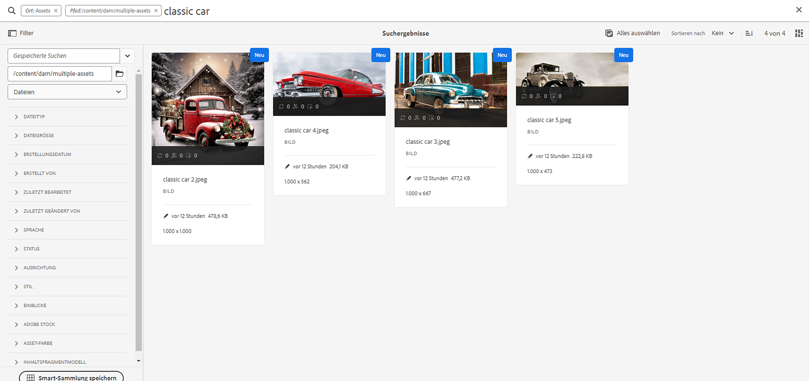-->

Sie können die Suche präziser gestalten, indem Sie Ihr Suchwort in doppelte Anführungszeichen (&quot; &quot;) setzen. Diese Suche umfasst nur Assets, die die angegebenen Begriffe zusammen enthalten. Die Suchkriterien sehen wie folgt aus: `"classic car"`. Daher werden die Suchergebnisse mit den beiden Begriffen `classic` und `car` angezeigt.

<!---->

Die Suche zeigt ähnliche Ergebnisse an, wenn Sie in der **[!UICONTROL Assets-Ansicht]** arbeiten.

>[!VIDEO](https://video.tv.adobe.com/v/3425489)

## Dateien und Ordner {#files-folders}

**Szenario 2: Suche nach allen Dateien mit dem Suchbegriff `classic car` innerhalb des Ordners `automobile`.**

Der Filter „Dateien und Ordner“ hilft Ihnen bei der Eingrenzung Ihrer Suche. Verwenden Sie je nach Bedarf die in der Dropdown-Liste verfügbaren Optionen „Dateien“, „Ordner“ oder „Dateien und Ordner“. Die Option, zwischen Dateien, Ordnern oder beidem zu wählen, ist nur in der **[!UICONTROL Admin-Ansicht]** verfügbar. Gehen Sie in der **[!UICONTROL Assets-Ansicht]** auf [!UICONTROL Pfad] und suchen Sie den Ordner, in dem Sie eine Suche durchführen möchten.

* Verwenden Sie die Option **[!UICONTROL Dateien]**, wenn Sie gezielt nach Dateien unter einem bestimmten Pfad innerhalb des Projektarchivs suchen wollen. Sie brauchen nicht nach Ordnern innerhalb des festgelegten Pfads zu suchen.
* Verwenden Sie die Option **[!UICONTROL Ordner]**, wenn Sie Ihre Suche auf Ordner in einem bestimmten Pfad beschränken müssen.
* Verwenden Sie die Option **[!UICONTROL Dateien und Ordner]**, wenn Sie alle Assets durchsuchen möchten, die unter dem angegebenen Pfad im Repository verfügbar sind.

Führen Sie die folgenden Schritte aus, um dieses Szenario zu erreichen:

1. Geben Sie `classic car` als Suchbegriff ein und klicken Sie auf „Suchen“.
2. Klicken Sie auf „Filter“ und definieren Sie den Ordnerpfad für den Ordner `automobile`. Beispiel: `/content/dam/multiple-assets/automobile`
Wählen Sie den Ordner aus dem Pfad aus und navigieren Sie zum gewünschten Ordner, wenn Sie ihn durchsuchen möchten.
3. Wählen Sie „Dateien“ aus der Dropdown-Liste aus, um alle Dateien mit dem Suchbegriff `classic car` anzuzeigen.

<!--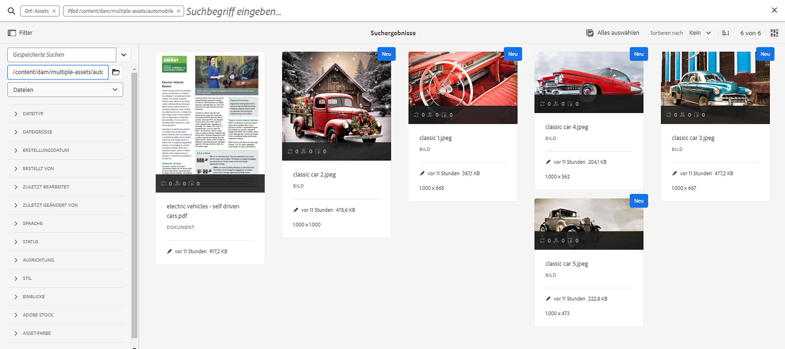-->

>[!VIDEO](https://video.tv.adobe.com/v/3425487)

## Operatoren  {#operators}

**Szenario 3: Suchen Sie nach den Schlüsselwörtern `Classic Car` oder `Car` und verwenden Sie verschiedene Operatorkombinationen, um Ihre Suche einzugrenzen.**

Wenn Sie das obige Szenario in der **[!UICONTROL Admin-Ansicht]** ausführen, können Sie eine Kombination verschiedener Operatoren verwenden, um Ihr Sucherlebnis zu verbessern. Folgende Operatoren werden unterstützt:

### AND-Operator {#and-operator}

Der AND-Operator ist der Standardoperator zwischen zwei Schlüsselwörtern in der Omni-Suche. Wenn Sie beispielsweise `classic car` in die Suchleiste eingeben, werden standardmäßig die Ergebnisse mit den Schlüsselwörtern `classic` und `car` in den Suchergebnissen angezeigt.

### OR-Operator {#or-operator}

Wenn es Ihnen um bestimmte Suchergebnisse geht und Sie eine Option in den Suchergebnissen wünschen, können Sie den OR-Operator verwenden. Beispiel: der Suchbegriff `classic OR car` führt zu Suchergebnissen mit einem der beiden Suchbegriffe in seinen Metadaten.

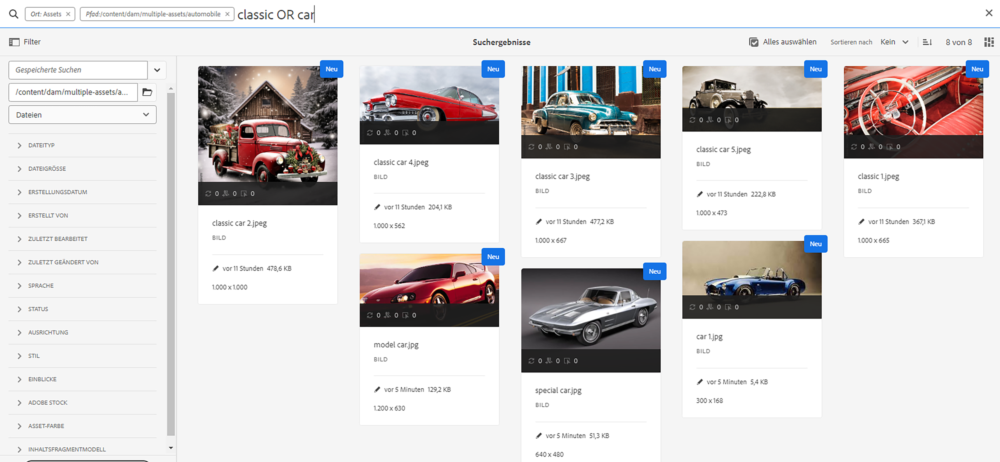

### NOT-Operator {#not-operator}

Wenn Sie Ergebnisse ohne bestimmte Schlüsselwörter abrufen möchten, können Sie den NOT-Operator verwenden. Der NOT-Operator zeigt der AEM-Suche anhand des Bindestrich-Symbols (-) an, was aus den Suchergebnissen ausgeschlossen werden soll. Beispiel: die Suchabfrage `car - classic`, die Metadaten angibt, die `car` enthalten und `classic` ausschließen.

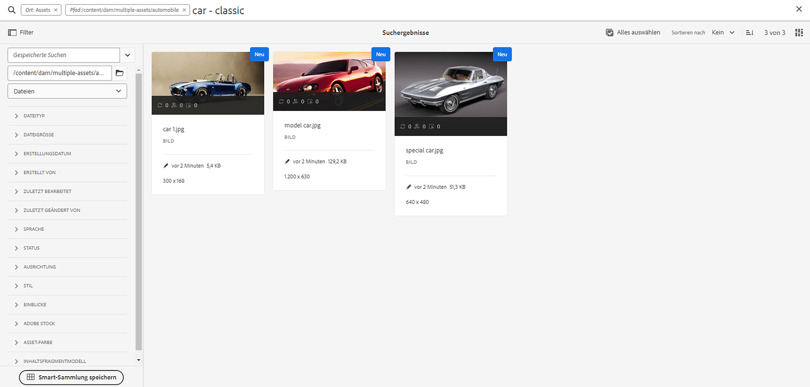

Auf ähnliche Weise können Sie etwa nach allen Autos außer Jeeps suchen. Die Abfrage sieht wie folgt aus: `car - jeep`. Es werden alle Assets mit den Metadaten `car` angezeigt, Assets mit den Metadaten `jeep` werden jedoch ausgeschlossen.

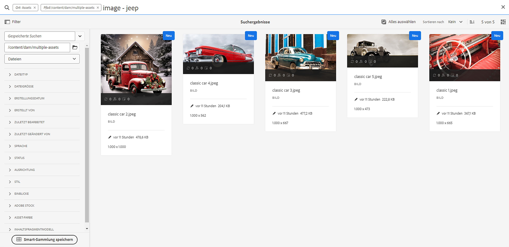

Die **[!UICONTROL Asset-Ansicht]** unterstützt die Verwendung von Operatoren nicht.

## Platzhalter  {#wildcards}

Platzhalter werden verwendet, um ein oder mehrere Zeichen in der Suche zu ersetzen. Um das obige Szenario in der **[!UICONTROL Admin-Ansicht]** auszuführen, können Sie eine Kombination aus verschiedenen Platzhaltern verwenden und so Ihr Sucherlebnis verbessern. Es werden zwei Platzhalter verwendet, um die Suche durchzuführen: Fragezeichen (?) und Sternchen (*). Das Fragezeichen-Symbol wird verwendet, um nach einem einzelnen Zeichen zu suchen, während das Sternchen-Symbol zum Ersetzen von mehreren Zeichen verwendet wird.

### Fragezeichen (?) {#question-mark}

Das Fragezeichen-Symbol kann als bedingter Operator verwendet werden, um die Suche in Experience Manager zu erleichtern.

* Abfrage `car?` entspricht einem Wort mit einem einzigen Zeichen nach „car“. Zum Beispiel „cart“.
* Abfrage `?car` entspricht einem Wort mit einem einzigen Zeichen vor „car“. Zum Beispiel „scar“.
* Abfrage `car????` entspricht einem Wort mit genau vier Zeichen nach „car“. Zum Beispiel „carwash“.

### Sternchen (*) {#asterisk}

Ein Sternchen ist ein Platzhalter-Operator, der verwendet wird, um Ihre Suche bei Eingabe von weniger Zeichen zu erweitern. Wenn Sie die ersten Buchstaben des Assets kennen, nach dem Sie suchen, den Rest jedoch nicht, können Sie bei Ihrer Suche den Sternchen-Operator einsetzen. Die Abfrage `*car` gibt beispielsweise alle Assets zurück, in deren Metadaten das Postfix „car“ vorhanden ist. Die Ergebnisse können „car“ mit vorangestellten Wörtern  sein, wie classic car, sports car, classic and sports car usw. Im Folgenden finden Sie einige Beispiele für die Verwendung des Sternchen-Operators:

* `*car*` gibt alle möglichen Kombinationen zurück, die „car“ enthalten.
* `car*` gibt Assets mit carwash, carrier, carriage usw. zurück.
* `*car` gibt Assets mit modern car, sports car, usw. zurück.

>[!VIDEO](https://video.tv.adobe.com/v/3425488)

Die **[!UICONTROL Asset-Ansicht]** unterstützt die Verwendung von Platzhaltern nicht.

## Filter {#filters}

Adobe Experience Manager bietet verschiedene Suchfilter, mit denen Sie Ihre Suche mithilfe einer Bereichsabfrage verfeinern und segmentieren können. Wenn Sie sich bezüglich des Titels oder der Meta-Beschreibung eines Assets nicht sicher sind, können Sie verschiedene Suchfilter verwenden, um Ihre Suche relevanter zu gestalten. Sie können Suchfilter mit oder ohne Eingabe eines Suchbegriffs verwenden. Um das Bedienfeld „Filter“ in der **[!UICONTROL Admin-Ansicht]** zu öffnen, klicken Sie auf das **GlobalNav**-Symbol und wählen Sie **[!UICONTROL Filter]** aus. Zum Öffnen des Filterbereichs in der **[!UICONTROL Asset-Ansicht]** klicken Sie dagegen auf [!UICONTROL Filter] neben der Suchleiste.

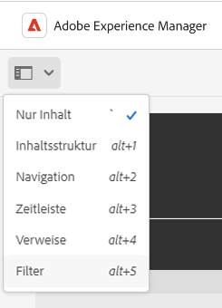

Sie können einen oder mehrere Filter auswählen, um Ihre Suche in Adobe Experience Manager zu verfeinern.
<!--The following filters are available out of the box for all the users of Experience Manager:

* File Type Search Filters  
* File Size Search Filters 
* Date of Creation 
* Created by 
* Last Modified date 
* Last Modified by 
* Search by Language 
* Search by Status 
* Search based on Orientation 
* Search by Style 
* Search based on insights 
* Search by Adobe Stock 
* Color specific Asset search 
* Content fragment model 
 -->

<!--**Scenario 5: Search for an Asset named 'classic car' in Black color which has either meta description or a similar asset in Japanese language.**  
 
To perform a search on such a requirement, type 'classic car' in the search bar.  Navigate to the filters panel and expand the language search filter drop-down. Type "ja-jp", which represents the Japanese language. Expand the 'Asset Color' filter and select black color or add the hexadecimal code for the black color (#000000).

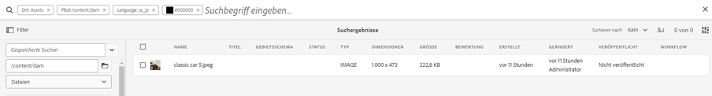
-->

**Szenario 4: Suchen nach nicht veröffentlichten Dokumenten mit dem Dateityp PDF, die den Suchbegriff `classic car` enthalten.**

Führen Sie die folgenden Schritte in der **[!UICONTROL Admin-Ansicht]** aus:

1. Geben Sie `classic car` in der Suchleiste ein.
1. Navigieren Sie zu „Filter“. Erweitern Sie unter [!UICONTROL Dateityp] zuerst [!UICONTROL Dokumente] und dann [!UICONTROL Textverarbeitung].
1. Wählen Sie [!UICONTROL PDF] aus.
1. Navigieren Sie zu [!UICONTROL Status] > [!UICONTROL Veröffentlichen] > [!UICONTROL Unveröffentlicht].

<!--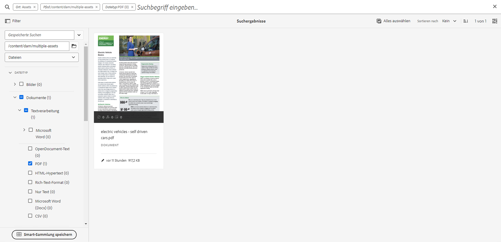-->

Führen Sie die folgenden Schritte in der **[!UICONTROL Asset-Ansicht]** aus:

1. Geben Sie `classic car` in der Suchleiste ein.
1. Navigieren Sie zu „Filter“. Wählen Sie unter [!UICONTROL MIME-Typ] als Typ [!UICONTROL PDF] aus.
1. Navigieren Sie zu [!UICONTROL Asset-Status], wählen Sie [!UICONTROL Alle] aus, um alle veröffentlichten und nicht veröffentlichten Assets einzuschließen.

**Szenario 5: Suchen nach allen Bildern außer PNG**

Wenn Sie sich bezüglich des Titels oder der Meta-Beschreibung eines Assets nicht sicher sind, können Sie verschiedene Suchfilter verwenden, um Ihre Suche relevanter zu gestalten. Suchen Sie beispielsweise mit den folgenden Schritten nach Assets in der **[!UICONTROL Admin-Ansicht]**:

1. Navigieren Sie zu den Suchfiltern.
1. Navigieren Sie zu „Filter“. Erweitern Sie unter [!UICONTROL Dateityp] den Eintrag [!UICONTROL Bilder] und wählen Sie [!UICONTROL Web-fähig] aus.
1. Deaktivieren Sie PNG.

<!--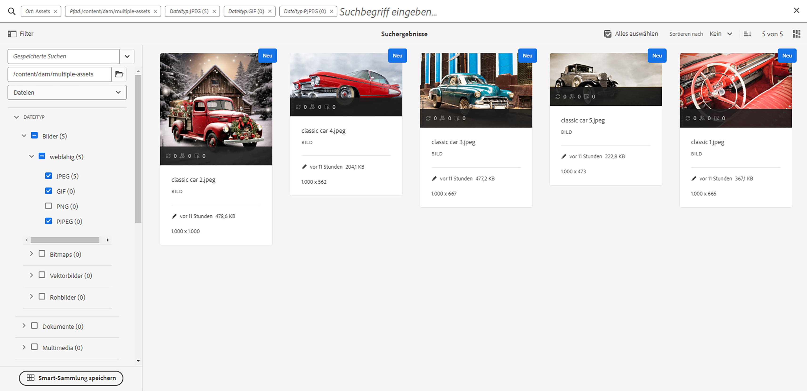-->

Um mithilfe des erwähnten Szenarios in der **[!UICONTROL Asset-Ansicht]** nach Assets zu suchen, führen Sie die folgenden Schritte aus:

1. Navigieren Sie zu den Suchfiltern.
1. Navigieren Sie zu „Filter“. Wählen Sie unter [!UICONTROL MIME-Typ] alle angegebenen MIME-Typen aus, deaktivieren Sie jedoch PNG.

>[!VIDEO](https://video.tv.adobe.com/v/3425486)

## Erweiterte Suche {#advanced-search}

Die AEM-Suche ermöglicht es Ihnen, komplexe Suchabfragen mit geringerem Aufwand zu erstellen. Im Folgenden finden Sie verschiedene Beispiele, die Ihnen bei der Erstellung komplexer Suchabfragen helfen:

**Szenario 6: Suchen nach allen Dokumenten im Experience Manager-Repository mit `classic car` in den Metadaten. Der Inhalt des Dokuments muss den Suchbegriff `classic car` enthalten.**

Mit Adobe Experience Manager können Sie mehrere Kriterien zu Ihrer Suche hinzufügen. Sie können eine Kombination aus Suchbegriffen, Operatoren und Filtern verwenden, um Ihre Suchergebnisse einzugrenzen.

So führen Sie die Suche für Szenario 6 durch:

1. Geben Sie den Suchbegriff `classic car` in die Suchleiste ein.
2. Navigieren Sie zum Bedienfeld „Filter“ und wählen Sie unter „Dateityp“ die Option „Dokumente“ aus.
3. Verfeinern Sie Ihre Suche mithilfe des Sternchens als Platzhalter. Geben Sie `"classic car"` ein, um alle Assets zu suchen, die den Suchbegriff `classic car` enthalten.

<!--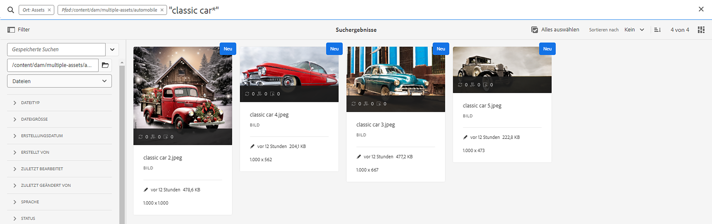-->

Szenario 6 kann nicht in der **[!UICONTROL Asset-Ansicht]** ausgeführt werden, da diese die Verwendung von Platzhaltern nicht unterstützt.

**Szenario 7: Suchen nach allen Dokumenten im Experience Manager-Repository, deren Dokumentinhalt `car` enthält, aber nicht `classic`. Die gleiche Bedingung gilt für Metadaten eines Assets.**

So führen Sie die Suche für Szenario 7 durch:

Geben Sie den Suchbegriff `car - classic` in die Suchleiste ein. Navigieren Sie zum Filterbedienfeld und wählen Sie unter „Dateityp“ die Option „Dokumente“. Die Prioritätsreihenfolge der Suche basiert auf den folgenden Kriterien:
Priorität 1: Metadaten
Priorität 2: Smart-Tags

<!--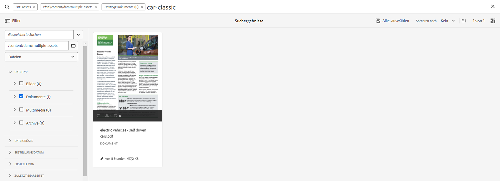-->

Szenario 7 kann nicht in der **[!UICONTROL Assets-Ansicht]** ausgeführt werden, da diese die Verwendung von Platzhaltern nicht unterstützt.

<!--
**Scenario 9: Search for all images except PNG**

When you are unsure about the title or meta description of an asset, you can use various search filters to make your search more relevant. Follow the steps below:

1. Go to search filters. 
1. Under [!UICONTROL File Type], expand [!UICONTROL Images] and select [!UICONTROL Web enabled]
1. Deselect PNG.

**Method 1:** Go to search bar and type `images - PNG`. All the images appear excluding PNG.

**Method 2:** Go to search filters. Under [!UICONTROL File Type], expand [!UICONTROL Images] > select [!UICONTROL Web enabled] > deselect PNG.

-->

**Szenario 8: Suche nach Metadaten-Tags mit Metadaten-Jeep**

Sie können ein bestimmtes Kriterium mithilfe verschiedener Suchfilter erfassen. Ein Tag ist ein Keyword, das einem Asset zugewiesen wird, um es aus einer großen Anzahl von Assets hervorzuheben. Suchen Sie in diesem Szenario zum Beispiel nach Assets mit *jeep*-Tags darin. Geben Sie dazu `tags:jeep` in die Suchleiste ein. In den Suchergebnissen werden nur Assets aufgelistet, die diese Kriterien erfüllen.

<!--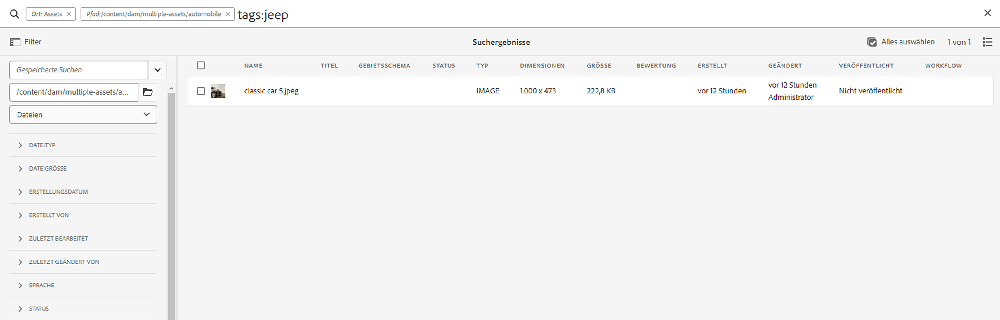-->

Die Suche zeigt ähnliche Ergebnisse an, wenn Sie in der **[!UICONTROL Assets-Ansicht]** arbeiten.

>[!VIDEO](https://video.tv.adobe.com/v/3425490)

**Szenario 9: Finden einer ähnlichen Übereinstimmung für rotes Auto**

Bei der Suche in AEM können Sie Ihre Ergebnisse filtern, indem Sie ähnliche Assets wie die ausgewählten anzeigen lassen. Sie können die Option **Ähnliche suchen** verwenden, um die Suche auf exakte oder ähnliche Übereinstimmungen mit dem gesuchten Asset einzugrenzen. Dies hilft beim Suchen nach Assets, die ähnliche Smart-Tags wie das ausgewählte Asset haben. Wenn Sie beispielsweise nach ähnlichen Assets suchen möchten, führen Sie die folgenden Schritte aus:

1. Suchen Sie das Asset gemäß Ihren Anforderungen.
1. Bewegen Sie den Mauszeiger über das Asset > klicken Sie auf die Auslassungspunkte > wählen Sie [!UICONTROL Ähnliche suchen].
oder
Markieren Sie das Asset > navigieren Sie zu den Auslassungspunkten oben rechts > wählen Sie [!UICONTROL Ähnliche suchen].

   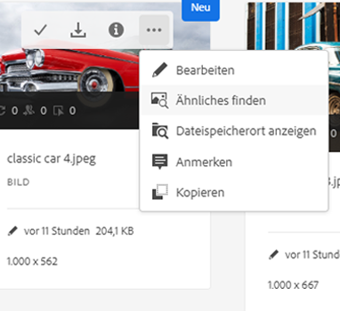

1. Beachten Sie die Suchleiste. Die Miniaturansicht des ausgewählten Assets wird in der Suchleiste angezeigt und gibt Ihre Suchanforderung an. Daraufhin werden Assets mit ähnlichen Smart-Tags zurückgegeben.

Führen Sie die folgenden Schritte in der **[!UICONTROL Asset-Ansicht]** aus:

1. Suchen Sie das Asset gemäß Ihren Anforderungen.
1. Wählen Sie das Bild aus und navigieren Sie zur Option [!UICONTROL Ähnliches Bild suchen] in der Navigationsleiste am oberen Rand.
Sie gelangen darüber zur Sammlung von Assets mit ähnlichen Farben und Metadaten.

## Benutzerdefinierte Suchfacetten {#custom-search-facets}

Mit Suchfacetten in Adobe Experience Manager können Sie auf verschiedene Arten nach Assets suchen, anstatt in einer einzigen, vorher festgelegten oder taxonomischen Reihenfolge. Sie können Suchfacetten anpassen und Prädikate gemäß Ihren Anforderungen hinzufügen. Lesen Sie [Suchfacetten](https://experienceleague.adobe.com/docs/experience-manager-cloud-service/content/assets/admin/search-facets.html?lang=de#) für eine schrittweise Anleitung zum Hinzufügen eines benutzerdefinierten Prädikats.

<!--**Scenario 10: Search assets based on Sku ID**
to be added later
-->

**Szenario 10: Suche nach bestimmten Assets basierend auf ihrem letzten Änderungsdatum oder Ablaufdatum**

Mit Datumsbeschränkungen können Sie Ihre benutzerdefinierte Suche auf einen bestimmten Zeitraum einschränken, z. B. mithilfe der Zeitraumsuchfilter. Um nach der oben genannten Anforderung zu suchen, geben Sie `classic car` in die Suchleiste ein. Wählen Sie den Datumsbereich in den Datumsfiltern [!UICONTROL Erstellungsdatum] und [!UICONTROL Zuletzt geändert].

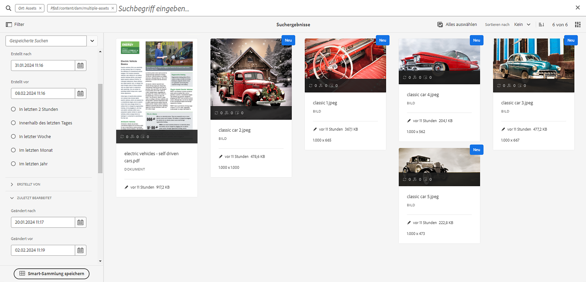

Die Suche zeigt ähnliche Ergebnisse an, wenn Sie in der [!UICONTROL Assets-Ansicht] arbeiten.

## Steigerung der Relevanz von Suchbegriffen {#boosting-keywords}

Sie können die Relevanz von Keywords für bestimmte Assets verbessern, um die auf Keywords basierenden Suchen zu optimieren. D. h. die Bilder, für die Sie bestimmte Keywords festlegen, erscheinen bei der Suche nach diesen Keywords oben in den Suchergebnissen.

1. Öffnen Sie in der Assets-Benutzeroberfläche für das Asset die Seite „Eigenschaften“. Klicken Sie auf [!UICONTROL Erweitert] und klicken Sie dann auf [!UICONTROL Hinzufügen] unter [!UICONTROL Für Suchbegriffe erhöhen].
2. Geben Sie im Feld „Suche priorisieren“ einen Suchbegriff ein, für den Sie die Bildsuche optimieren möchten, und klicken Sie anschließend auf [!UICONTROL Hinzufügen]. Sie können auf dieselbe Weise mehrere Keywords eingeben.
3. Klicken Sie auf [!UICONTROL Speichern und schließen]. Das Asset, das Sie für dieses Keyword erhöht haben, befindet sich unter den obersten Suchergebnissen.

## Wesentliche Dinge bei der Durchführung einer Suche in Experience Manager {#notable-things}

* Geben Sie Metadateninformationen zum Asset an, um das Asset so vorzubereiten, dass es vom Omni-Suchalgorithmus durchsuchbar ist. Stellen Sie sicher, dass die Metadateninformationen des Assets aktualisiert wurden.
* Verwenden Sie doppelte Anführungszeichen (&quot; &quot;), um Ihre Suche exakt und präzise zu gestalten.
* Überprüfen Sie den Pfad, den Sie untersuchen. Wählen Sie die entsprechende Option unter Ordner, Datei oder Datei und Ordner, um Ihre Suchabfrage an dem entsprechenden Speicherort auszuführen.
* Sie können die Filter, die Sie auf Ihre Suche anwenden, in der Omni-Suchleiste überprüfen.
* Falls Sie keine Ergebnisse erhalten, überprüfen Sie den Pfad, den Sie untersuchen. Überprüfen Sie auch den Ordner, aus dem Sie Ihre Suche durchführen. Wenn Sie z. B. eine Suche im Ordner „Automobile“ durchführen, der von Ihnen verwendete Suchbegriff aber mit „Bekleidung“ zu tun hat, sind die Suchergebnisse unpassend.
* Prüfen Sie, ob Sie vor dem gesuchten Suchbegriff ein Leerzeichen eingefügt haben.
* Die Verwendung einer Mischung aus Suchbegriffen, Operatoren und Filtern kann Ihr Sucherlebnis vereinfachen und einfacher gestalten.

<!--
* Use stemming search approach while searching for the asset. It means using an exact keyword that you are looking for.
* Specify Smart tags to the asset properties to boost the ranking of the search results.
The newly added assets are not indexed.
-->

## Unterschiede zwischen der Suche in der [!UICONTROL Admin-Ansicht] und [!UICONTROL Assets-Ansicht] {#differences-asset-and-admin-view}

<table>
    <tr>
        <th> Parameter </th>
        <th> Admin-Ansicht </th>
        <th> Assets-Ansicht </th>
    </tr>
    <tr>
        <td> Benutzerdefinierte Facetten </td>
        <td> Sie können <a href="https://experienceleague.adobe.com/docs/experience-manager-cloud-service/content/assets/admin/search-facets.html?lang=de">benutzerdefinierte Suchfacetten je nach Anforderung hinzufügen.</td>
        <td> Die benutzerdefinierten Facetten werden teilweise in der Asset-Ansicht unterstützt. Folgende Facetten werden unterstützt:
            <ul>
            <li> Prognostizierte Tags
            <li> Name
            <li> Vertrauenswürdigkeit prognostizierter Tags
            <li> Asset-Größe
            <li> Titel
            </ul>
        </td>
    </tr>
    <tr>
        <td> Operatoren  </td>
        <td> Unterstützt AND, OR und NOT </td>
        <td> Nicht unterstützt </td>
    </tr>
    <tr>
        <td> Platzhalter  </td>
        <td> Unterstützt Fragezeichen (?) und Sternchen (*).</td>
        <td> Nicht unterstützt </td>
    </tr>
    <tr>
        <td> Steigerung der Suchergebnisse </td>
        <td> Unterstützt </td>
        <td> Nicht unterstützt </td>
    </tr>
     <tr>
        <td> Löschen aller Filter gleichzeitig </td>
        <td> Nicht unterstützt </td>
        <td> Unterstützt</td>
    </tr>
     <tr>
        <td> Dateien/Ordner/Dateien und Ordner </td>
        <td> Unterstützt </td>
        <td> Eine Option zur Auswahl eines Ordners ist unter „Dateityp“ verfügbar </td>
    </tr>
     <tr>
        <td> Asset-Status </td>
        <td> 
            Unterstützte Optionen sind:
            <ul>
            <li> Veröffentlichen
            <li> Veröffentlichungsdatum
            <li> Zuletzt veröffentlicht von
            <li> Genehmigung 
            <li> Checkout
            <li> Ablauf
            <li> Dynamic Media
            </ul>
        </td>
        <td>
        Unterstützte Optionen sind:
            <ul>
            <li> Alle
            <li> Genehmigt
            <li> Abgelehnt
            <li> Kein Status
            </ul> 
        </td>
    </tr>
     <tr>
        <td> Dateityp </td>
        <td>
        Unterstützte Optionen sind:
            <ul>
            <li> Bilder
            <li> Dokumente
            <li> Multimedia
            <li> Archive 
            </ul>
            Diese haben weitere hierarchische Optionen.
        </td>
        <td>
        Unterstützte Optionen sind:
            <ul>
            <li> Bilder
            <li> Dokumente
            <li> Video 
            <li> Ordner 
            </ul> 
        Weitere Optionen sind unter „MIME-Typ“ aufgeführt.
        </td>
    </tr>
     <tr>
        <td> Dateigröße </td>
        <td>
        Unterstützte Optionen sind:
            <ul>
            <li> Von – bis
            <li> Größe (Bytes, KB, MB, GB)
            </ul> 
        </td>
        <td> Nicht unterstützt </td>
    </tr>
     <tr>
        <td> Sonstige Filter </td>
        <td>
            <ul>
            <li> Sprache
            <li> Status
            <li> Ausrichtung
            <li> Stil 
            <li> Insights
            <li> Stock
            <li> Asset-Farbe
            <li> Inhaltsfragmentmodell
            </ul> 
        </td>
        <td> Nicht unterstützt </td>
    </tr>
</table>

>[!MORELIKETHIS]
>
>* [Suchen von Assets](https://experienceleague.adobe.com/docs/experience-manager-cloud-service/content/assets/manage/search-assets.html?lang=de)
>* [Suchfacetten](https://experienceleague.adobe.com/docs/experience-manager-cloud-service/content/assets/admin/search-facets.html?lang=de)
