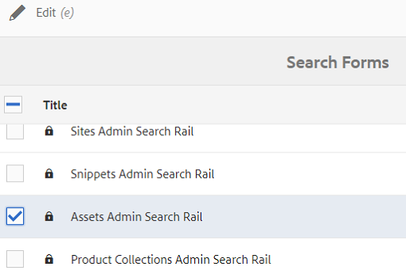

# Suchfacetten {#search-facets}

Erfahren Sie, wie Sie Suchfacetten in AEM erstellen, bearbeiten und verwenden können.

Eine unternehmensweite Bereitstellung von Adobe Experience Manager (AEM) Assets bietet die Möglichkeit, eine Vielzahl von Assets zu speichern. Es kann manchmal zur anstrengenden und zeitraubenden Aufgabe werden, das richtige Asset zu finden, wenn Sie nur die generischen Suchfunktionen von AEM verwenden.

Verwenden Sie Suchfacetten im Bedienfeld „Filter“, um Ihrer Suche ein höheres Maß an Granularität zu verleihen und die Suchfunktion effizienter und vielseitiger zu gestalten. Suchfacetten fügen mehrere Dimensionen (Prädikate) hinzu, mit denen Sie Ihre Suche genauer definieren können. Das Bedienfeld „Filter“ enthält einige standardmäßige Suchfacetten. Außerdem können Sie benutzerdefinierte Suchfacetten hinzufügen.

Zusammenfassend lässt sich feststellen, dass Sie mit den Suchfacetten auf mehrere Arten nach Assets suchen können und nicht in einer einzigen, vorab festgelegten, taxonomischen Reihenfolge. Sie können einfach einen Drilldown zur gewünschten Detailtiefe durchführen, um die Suche zu konzentrieren.

Wenn Sie beispielsweise nach einem Bild suchen, können Sie auswählen, ob Sie ein Bitmap- oder ein Vektorbild möchten. Sie können die Suchergebnisse weiter eingrenzen, indem Sie den MIME-Typ für das Bild festlegen. Wenn Sie nach Dokumenten suchen, können Sie auf ähnliche Weise das gewünschte Format festlegen, z. B. PDF oder MS Word.

## Add a predicate {#adding-a-predicate}

Die Suchfacetten, die im Bedienfeld „Filter“ angezeigt werden, werden im zugrundeliegenden Suchformular mithilfe von Prädikaten definiert. Um mehr oder verschiedene Facetten anzuzeigen, fügen Sie dem Standardformular Prädikate hinzu oder verwenden Sie ein benutzerdefiniertes Formular, das Facetten Ihrer Wahl enthält.

For full-text searches, add the `Fulltext` predicate to the form. Mit dem Eigenschaftsprädikat können Sie nach Assets suchen, die mit einer einzelnen von Ihnen angegebenen Eigenschaft übereinstimmen. Mit dem Options-Prädikat können Sie nach Assets suchen, die mit einem oder mehreren Werten für eine bestimmte Eigenschaft übereinstimmen. Fügen Sie das Datumsbereichs-Prädikat hinzu, um nach Assets zu suchen, die innerhalb eines bestimmten Datumsbereichs erstellt wurden.

1. Tap/click the AEM logo, and then go to **[!UICONTROL Tools]** > **[!UICONTROL General]** > **[!UICONTROL Search Forms]**.
1. Wählen Sie auf der Seite &quot;Formulare suchen&quot;die Option **[!UICONTROL Assets Admin Search Rail]** und tippen Sie dann auf **Bearbeiten** von .

   

1. Ziehen Sie auf der Seite Suchformulare bearbeiten eine Eigenschaft von der Registerkarte **[!UICONTROL Eigenschaft auswählen]** in den Hauptbereich. Ziehen Sie beispielsweise **[!UICONTROL Eigenschaftsprädikat]**.

   

   Ziehen und Ablegen eines Prädikats zum Anpassen der Suchfilter

1. Geben Sie auf der Registerkarte Einstellungen eine Feldbeschriftung, einen Platzhaltertext und eine Beschreibung für das Eigenschaftsprädikat ein. Geben Sie einen gültigen Namen für die Metadateneigenschaft an, die mit dem Prädikat verknüpft werden soll.

   Die Kopfzeilenbeschriftung auf der Registerkarte &quot;Einstellungen&quot;gibt den Typ der ausgewählten Vorhersage an.

   

   Verwenden Sie die Registerkarte &quot;Einstellungen&quot;, um die erforderlichen Optionen für eine Vorhersage bereitzustellen.

1. In the **[!UICONTROL Property Name]** field, specify a valid name for the metadata property you want to associate with the predicate. Basierend auf diesem Namen wird die Suche ausgeführt. Geben Sie beispielsweise `jcr:content/metadata/dc:description` oder `./jcr:content/metadata/dc:description` ein.

   Sie können auch einen vorhandenen Knoten aus dem Auswahl-Dialogfeld auswählen.

   

   Verknüpfen einer Metadateneigenschaft mit einem Prädikat im Feld &quot;Eigenschaftsname&quot;

1. Tap/click the **[!UICONTROL Preview]**  to generate a preview of the Filters panel as it appears after you add the predicate.
1. Prüfen Sie das Layout der Eigenschaft im Vorschaumodus.

   

   Anzeigen einer Vorschau des Suchformulars vor dem Senden der Änderungen

1. To close the preview, tap/click the **[!UICONTROL Close]**  on the upper-right corner of the preview.
1. Tap **[!UICONTROL Done]** to save the settings.
1. Navigieren Sie zum Suchfeld in der Benutzeroberfläche &quot;Assets&quot;. Die Eigenschaftsvorgabe wird dem Bedienfeld hinzugefügt.
1. Geben Sie eine Beschreibung des zu suchenden Assets in das Textfeld ein. Geben Sie beispielsweise „Adobe“ ein. Wenn Sie eine Suche durchführen, werden Assets mit der Beschreibung „Adobe“ in den Suchergebnissen aufgelistet.

## Eine Optionsvorhersage hinzufügen {#adding-an-options-predicate}

Mit dem Options-Prädikat können Sie mehrere Suchoptionen im Bedienfeld „Filter“ hinzufügen. Sie können eine oder mehrere dieser Optionen im Bedienfeld „Filter“ auswählen, um nach Assets zu suchen. Beispiel: Um basierend auf dem Dateityp nach Assets zu suchen, konfigurieren Sie Optionen, wie Bilder, Multimedia, Dokumente und Archive im Suchformular. Nach der Konfiguration dieser Optionen wird die Suche bei Assets vom Typ GIF, JPEG, PNG usw. durchgeführt, wenn Sie im Filterbedienfeld die Option &quot;Bilder&quot;auswählen.

Um die Optionen der jeweiligen Eigenschaft zuzuordnen, erstellen Sie eine Knotenstruktur für die Optionen und geben Sie den Pfad des übergeordneten Knotens in der Eigenschaft „Eigenschaftsname“ des Options-Prädikats an. The parent node should be of type `sling`: `OrderedFolder`. The options should be of type `nt:unstructured`. The option nodes should have the properties `jcr:title` and `value` configured.

Die Eigenschaft `jcr:title` ist ein benutzerfreundlicher Name für die Option, der im Bedienfeld „Filter“ angezeigt wird. Das Feld `value` wird in der Abfrage verwendet, um die angegebene Eigenschaft abzugleichen.

Wenn Sie eine Option auswählen, wird die Suche basierend auf der Eigenschaft `value` des Optionsknotens und gegebenenfalls der jeweiligen untergeordneten Knoten durchgeführt. Die gesamte Baumstruktur unter dem Optionsknoten wird durchlaufen und die Eigenschaft `value` jedes untergeordneten Knotens wird anhand eines ODER-Vorgangs kombiniert, um die Suchabfrage zu bilden.

Beispiel: Wenn Sie „Bilder“ als Dateityp auswählen, wird die Suchabfrage für die Assets gebildet, indem die Eigenschaft `value` anhand eines ODER-Vorgangs kombiniert wird. For example, the search query for images is built by combining the results matched for *image/jpeg*, *image/gif*, *image/png*, *image/pjpeg*, and *image/tiff* for the property `jcr:content/metadata/dc:format` using an OR operation.

Die Eigenschaft Value eines Dateityps, wie in CRXDE dargestellt, wird für Suchabfragen verwendet, um zu funktionieren

Statt im CRX-Repository manuell eine Knotenstruktur für die Optionen zu erstellen, können Sie die Optionen in einer JSON-Datei definieren, indem Sie entsprechende Schlüssel-Wert-Paare angeben. Specify the path of the JSON file in the **[!UICONTROL Property Name]** field. For example, you can define the key-value pairs, `image/bmp`, `image/gif`, `image/jpeg`, and `image/png` and specify their values as shown in the following sample JSON file. In the **[!UICONTROL Property Name]** field, you can specify the CRX path for this file.

```
{
    "options" :
 [
          {"value" : "image/bmp","text" : "BMP"},
          {"value" : "image/gif","text" : "GIF"},
          {"value" : "image/jpeg","text" : "JPEG"},
          {"value" : "image/png","text" : "PNG"}
 ]
}
```

Wenn Sie einen vorhandenen Knoten verwenden möchten, legen Sie diesen über das Auswahl-Dialogfeld fest.

>[!NOTE]
>
>Die Option Predicate ist ein benutzerdefinierter Wrapper, der Eigenschaften enthält, die das beschriebene Verhalten zeigen. Derzeit ist kein REST-Endpunkt verfügbar, um die Funktionalität nativ zu unterstützen.

1. Tap the AEM logo, and then go to **[!UICONTROL Tools > General > Search Forms]**.
1. From the **[!UICONTROL Search Forms]** page, select **[!UICONTROL Assets Admin Search Rail]**, then tap the Edit icon.
1. In the **[!UICONTROL Edit Search Form]** page, drag **[!UICONTROL Options Predicate]** from the **[!UICONTROL Select Predicate]** tab to the main pane.
1. In the **[!UICONTROL Settings]** tab, enter a label and a name for the property. For example, to search assets based on their format, specify a user-friendly name for the label, for example **[!UICONTROL File Type]**. Specify the property based on which the search is to be performed in the property field, for example `jcr:content/metadata/dc:format.`
1. Führen Sie einen der folgenden Schritte aus:

   * In the **[!UICONTROL Property Name]** field, mention the path of the JSON file where you define the nodes for the options and specify corresponding key-value pairs.
   * Tap  next to the Options field to specify the display text and value for the options you want to supply in the Filters panel. To add another option, tap/click  and repeat the step.

1. Stellen Sie sicher, dass **[!UICONTROL Einzelauswahl]** deaktiviert ist, damit Benutzer mehrere Optionen für Dateitypen gleichzeitig auswählen können (z. B. Bilder, Dokumente, Multimedia und Archive). If you select **[!UICONTROL Single Select]**, the user can select only one option for file types at a time.

   

   Die verfügbaren Felder in den Optionen bestimmen

1. Geben Sie eine optionale Beschreibung in das Feld **Beschreibung** ein und klicken Sie auf **[!UICONTROL Fertig]**.
1. Navigieren Sie zum Suchfeld. Die Optionsvorgabe wird dem **Suchbedienfeld** hinzugefügt. Die Optionen für **[!UICONTROL Dateityp]** werden als Kontrollkästchen angezeigt.

## Add a Multi Value Property predicate {#adding-a-multi-value-property-predicate}

Mit der `Multi Value Property` Vorhersage können Sie Assets nach mehreren Werten suchen. Angenommen, Sie haben in AEM Assets Bilder mehrerer Produkte, deren Metadaten die zum Produkt gehörende Artikelnummer enthalten. Sie können diese Eigenschaft nutzen, um anhand mehrerer Artikelnummern nach Produktbildern zu suchen.

1. Click the AEM logo, and then go to **[!UICONTROL Tools]** > **[!UICONTROL General]** > **[!UICONTROL Search Forms]**.
1. Wählen Sie auf der Seite &quot;Formulare suchen&quot;die Option **[!UICONTROL Assets Admin Search Rail]** und tippen Sie auf **Bearbeiten** .
1. In the Edit Search Form page, drag a **[!UICONTROL Multi Value Property Predicate]** from the **[!UICONTROL Select Predicate]** tab to the main pane.
1. In the **[!UICONTROL Settings]** tab, enter a label and placeholder text for the predicate. Specify the property name based on which the search is to be performed in the property field, for example `jcr:content/metadata/dc:value`. Sie können auch das Auswahl-Dialogfeld verwenden, um einen Knoten auszuwählen.
1. Stellen Sie sicher, dass **[!UICONTROL Trennzeichen-Unterstützung]** aktiviert ist. Geben Sie im Feld **[!UICONTROL Trennzeichen eingeben]** die Zeichen ein, mit denen einzelne Werte getrennt werden. Standardmäßig wird ein Komma als Trennzeichen angegeben. Sie können auch ein anderes Trennzeichen festlegen.
1. In the **Description** field, enter an optional description and then tap **[!UICONTROL Done]**.
1. Navigieren Sie zum Filterbedienfeld in der Benutzeroberfläche &quot;Assets&quot;. The **[!UICONTROL Multi Value Property]** predicate is added to the panel.
1. Geben Sie im Feld „Mehrwert“ mehrere durch Trennzeichen getrennte Werte ein und führen Sie die Suche aus. Die Eigenschaft sucht für die eingegebenen Werte nach genau übereinstimmenden Texten.

## Add a Tags predicate {#adding-a-tags-predicate}

The `Tags` predicate allows you to perform tag-based searches for assets. Standardmäßig sucht AEM Assets Assets nach Assets nach einem oder mehreren Tags, die auf den von Ihnen angegebenen Tags übereinstimmen. Das heißt, die Suchabfrage führt einen ODER-Vorgang mit den angegebenen Tags aus. Sie können jedoch die Option „Übereinstimmung mit allen Tags“ nutzen, um nach Assets zu suchen, die alle angegebenen Tags enthalten.

1. Click the AEM logo, and then go to **[!UICONTROL Tools]** > **[!UICONTROL General]** > **[!UICONTROL Search Forms]**.
1. From the Search Forms page, select **[!UICONTROL Assets Admin Search Rail]** and then tap **Edit** .
1. In the Edit Search Form page, drag **[!UICONTROL Tags Predicate]** from the Select Predicate tab to the main pane.
1. Geben Sie auf der Registerkarte &quot;Einstellungen&quot;einen Platzhaltertext für die Vorhersage ein. Specify the property name based on which the search is to be performed in the property field, for example *jcr:content/metadata/cq:tags*. Alternativ können Sie im Auswahldialogfeld einen Knoten in CRXDE auswählen.
1. Konfigurieren Sie die Eigenschaft „Pfad für Stamm-Tags“ dieses Prädikats, um die Tag-Liste mit verschiedenen Tags zu füllen.
1. Aktivieren Sie **[!UICONTROL Option „Übereinstimmung mit allen Tags“ anzeigen]**, um nach Assets zu suchen, die alle angegebenen Tags enthalten.

   

   Typische Einstellungen von Tags prognostizieren

1. In the **[!UICONTROL Description]** field, enter an optional description and then click/tap **[!UICONTROL Done]**.
1. Navigieren Sie zum Suchfeld. The **[!UICONTROL Tags]** predicate is added to the Search panel.
1. Geben Sie Tags ein, auf deren Grundlage Sie nach Assets suchen möchten, oder wählen Sie Tags aus, die in der Liste vorgeschlagen werden.
1. Aktivieren Sie **[!UICONTROL Übereinstimmung mit allen]**, um nach Assets zu suchen, die alle angegebenen Tags enthalten.

## Hinzufügen anderer Eigenschaften {#adding-other-predicates}

Sie können die folgenden zusätzlichen Eigenschaften auf ähnliche Weise wie Eigenschaftsprädikate oder Options-Eigenschaften dem Suchbereich hinzufügen.

<table>
 <tbody>
  <tr>
   <td><p><strong>Eigenschaftsname</strong></p> </td>
   <td><p><strong>Beschreibung</strong></p> </td>
   <td><p><strong>Eigenschaften</strong></p> </td>
  </tr>
  <tr>
   <td><p>Volltext</p> </td>
   <td>Suchprädikat für das Ausführen einer Volltextsuche für einen ganzen Asset-Knoten. <code>jcr</code> Er wird wie folgt zugeordnet <code>contains</code>: Operator. Sie können einen relativen Pfad angeben, wenn Sie eine Volltextsuche in einem bestimmten Teil des Asset-Knotens durchführen möchten.</td>
   <td>
    <ul>
     <li>Bezeichnung</li>
     <li>Platzhalter</li>
     <li>Eigenschaftsname</li>
     <li>Beschreibung</li>
    </ul> </td>
  </tr>
  <tr>
   <td>Pfad Browser</td>
   <td>Suchvorhersage zum Suchen nach Assets in Ordnern und Unterordnern in einem vorkonfigurierten Stammpfad</td>
   <td>
    <ul>
     <li>Platzhalter</li>
     <li>Stammverzeichnis</li>
     <li>Beschreibung</li>
    </ul> </td>
  </tr>
  <tr>
   <td><p>Pfad</p> </td>
   <td><p>Verwenden Sie dieses Suchprädikat, um Ergebnisse am Speicherort zu filtern. Sie können verschiedene Pfade als Optionen angeben.</p> </td>
   <td>
    <ul>
     <li>Bezeichnung</li>
     <li>Pfad</li>
     <li>Beschreibung</li>
    </ul> </td>
  </tr>
  <tr>
   <td><p>Veröffentlichungsstatus</p> </td>
   <td><p>Sucheigenschaft, um Assets basierend auf ihrem Veröffentlichungsstatus zu suchen</p> </td>
   <td>
    <ul>
     <li>Bezeichnung</li>
     <li>Eigenschaftsname</li>
     <li>Beschreibung</li>
    </ul> </td>
  </tr>
  <tr>
   <td><p>Relatives Datum</p> </td>
   <td><p>Sucheigenschaft, um Assets basierend auf dem relativen Datum ihrer Erstellung zu suchen. Sie können beispielsweise Optionen wie „vor 2 Monaten“, „vor 3 Wochen“ usw. konfigurieren. </p> </td>
   <td>
    <ul>
     <li>Bezeichnung</li>
     <li>Eigenschaftsname</li>
     <li>Relatives Datum</li>
    </ul> </td>
  </tr>
  <tr>
   <td><p>Bereich</p> </td>
   <td><p>Sucheigenschaft, um Assets innerhalb eines bestimmten Bereichs zu suchen. Im Suchbereich können Sie den Mindest- und den Höchstwert für den Bereich angeben.</p> </td>
   <td>
    <ul>
     <li>Bezeichnung</li>
     <li>Eigenschaftsname</li>
     <li>Beschreibung</li>
    </ul> </td>
  </tr>
  <tr>
   <td><p>Datum Bereich</p> </td>
   <td><p>Sucheigenschaft, um Assets zu suchen, die innerhalb eines bestimmten Bereichs für eine Datumseigenschaft erstellt wurden. Im Suchbereich können Sie mithilfe der Datumsauswahl das Start- und das Enddatum angeben.</p> </td>
   <td>
    <ul>
     <li>Bezeichnung</li>
     <li>Platzhalter</li>
     <li>Eigenschaftsname</li>
     <li>Textbereich (von)</li>
     <li>Textbereich (bis)</li>
     <li>Beschreibung</li>
    </ul> </td>
  </tr>
  <tr>
   <td><p>Datum</p> </td>
   <td><p>Sucheigenschaft für eine Schieberegler-basierte Suche nach Assets basierend auf einer Datumseigenschaft</p> </td>
   <td>
    <ul>
     <li>Bezeichnung</li>
     <li>Eigenschaftsname</li>
     <li>Beschreibung</li>
    </ul> </td>
  </tr>
  <tr>
   <td><p>Dateigröße</p> </td>
   <td><p>Sucheigenschaft, um Assets basierend auf ihrer Größe zu suchen. Es handelt sich um eine Regler-basierte Eigenschaft, bei der Sie die Regleroptionen aus einem konfigurierbaren Knoten auswählen. Die Standardoptionen werden unter /libs/dam/options/predicates/filesize im CRX-Repository definiert. Die Dateigröße wird in Byte angegeben.</p> </td>
   <td>
    <ul>
     <li>Bezeichnung</li>
     <li>Eigenschaftsname</li>
     <li>Pfad</li>
     <li>Beschreibung</li>
    </ul> </td>
  </tr>
  <tr>
   <td>Asset zuletzt geändert</td>
   <td>Suchprädikat für die Suche nach kürzlich geänderten Assets </td>
   <td>
    <ul>
     <li>Eigenschaftsname</li>
     <li>Eigenschaftswert</li>
     <li>Beschreibung</li>
    </ul> </td>
  </tr>
  <tr>
   <td>Veröffentlichungsstatus</td>
   <td>Suchprädikat für die Suche nach Assets basierend auf ihrem Veröffentlichungsstatus </td>
   <td>
    <ul>
     <li>Bezeichnung</li>
     <li>Eigenschaftsname</li>
     <li>Beschreibung</li>
    </ul> </td>
  </tr>
  <tr>
   <td>Bewertung</td>
   <td>Suchprädikat für die Suche nach Assets basierend auf ihrer durchschnittlichen Bewertung </td>
   <td>
    <ul>
     <li>Bezeichnung</li>
     <li>Eigenschaftsname</li>
     <li>Optionspfad</li>
     <li>Beschreibung</li>
    </ul> </td>
  </tr>
  <tr>
   <td>Gültigkeitsstatus</td>
   <td>Suchprädikat für die Suche nach Assets basierend auf ihrem Ablaufstatus </td>
   <td>
    <ul>
     <li>Bezeichnung</li>
     <li>Eigenschaftsname</li>
     <li>Beschreibung</li>
    </ul> </td>
  </tr>
  <tr>
   <td>Ausgeblendet</td>
   <td>Suchprädikat, das eine versteckte Feldeigenschaft für die Suche nach Assets definiert</td>
   <td>
    <ul>
     <li>Eigenschaftsname</li>
     <li>Eigenschaftswert</li>
     <li>Beschreibung</li>
    </ul> </td>
  </tr>
 </tbody>
</table>

## Standard-Suchfacetten wiederherstellen {#restoring-default-search-facets}

By default, a Lock icon appears before **[!UICONTROL Assets Admin Search Rail]** in the **[!UICONTROL Search Forms]** page. Das Sperrsymbol wird ausgeblendet, wenn Sie dem Formular Suchfacetten hinzufügen, um anzugeben, dass das Standardformular geändert wurde.

Das Symbol Sperren für eine Option auf der Seite &quot;Suchformulare&quot;gibt an, dass die Standardeinstellungen intakt und nicht angepasst sind.

Führen Sie die folgenden Schritte aus, um die standardmäßige Suchfacette wiederherzustellen:

1. Select **[!UICONTROL Assets Admin Search Rail]** in the **[!UICONTROL Search Forms]** page.
1. Tippen Sie in der Symbolleiste auf das Symbol **[!UICONTROL Löschen]**  .
1. In the confirmation dialog, tap **[!UICONTROL Delete]** to remove the custom changes.

   After you delete the custom changes to search facets, the Lock icon reappears before **[!UICONTROL Assets Admin Search Rail]** in the **[!UICONTROL Search Forms]** page.

## Benutzerberechtigungen {#user-permissions}

Wenn Ihnen nicht die Rolle eines Administrators zugewiesen wurde, finden Sie hier eine Liste der erforderlichen Berechtigungen für die Bearbeitung, das Löschen und die Vorschau in Bezug auf Suchfacetten.

<table>
 <tbody>
  <tr>
   <td><strong>Aktion</strong></td>
   <td><strong>Berechtigungen</strong></td>
  </tr>
  <tr>
   <td>Bearbeiten </td>
   <td>Read and Write permissions on the <code>/apps</code> node in CRX<br /> </td>
  </tr>
  <tr>
   <td>Löschen</td>
   <td>Read, Write, and Delete permissions on the <code>/apps</code> node in CRX</td>
  </tr>
  <tr>
   <td>Vorschau</td>
   <td>Read, Write, and Delete permissions on the <code>/var/dam/content</code> node in CRX. Also, Read and Write permissions on <code>/apps</code> node.</td>
  </tr>
 </tbody>
</table>

>[!MORELIKETHIS]
>
>* [Suchen digitaler Assets](search-assets.md)

