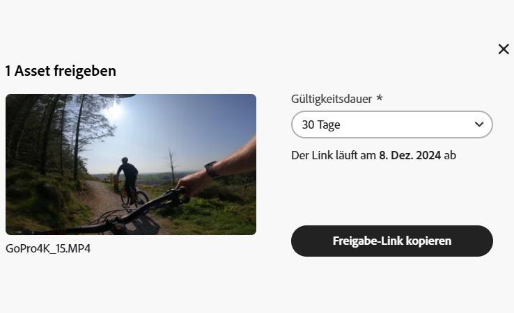
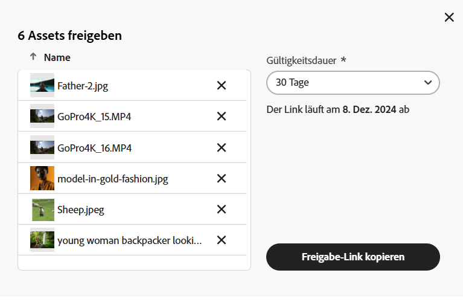

# Freigeben von Assets im Content Hub {#search-assets-as-a-link}

<table>
    <tr>
        <td>
            <i>Neu</i> <a href="/help/assets/dynamic-media/dm-prime-ultimate.md"><b>Dynamic Media Prime und Ultimate</b></a>
        </td>
        <td>
            <i>Neu</i> <a href="/help/assets/assets-ultimate-overview.md"><b>AEM Assets Ultimate</b></a>
        </td>
        <td>
            <i>Neu</i> <a href="/help/assets/integrate-aem-assets-edge-delivery-services.md"><b>AEM Assets-Integration mit Edge Delivery Services</b></a>
        </td>
        <td>
            <i>Neu</i> <a href="/help/assets/aem-assets-view-ui-extensibility.md"><b>Erweiterbarkeit der Benutzeroberfläche</b></a>
        </td>
          <td>
            <i>Neu</i> <a href="/help/assets/dynamic-media/enable-dynamic-media-prime-and-ultimate.md"><b>Aktivieren von Dynamic Media Prime und Ultimate</b></a>
        </td>
    </tr>
    <tr>
        <td>
            <a href="/help/assets/search-best-practices.md"><b>Best Practices für die Suche</b></a>
        </td>
        <td>
            <a href="/help/assets/metadata-best-practices.md"><b>Best Practices für Metadaten</b></a>
        </td>
        <td>
            <a href="/help/assets/product-overview.md"><b>Content Hub</b></a>
        </td>
        <td>
            <a href="/help/assets/dynamic-media-open-apis-overview.md"><b>Dynamic Media mit OpenAPI-Funktionen</b></a>
        </td>
        <td>
            <a href="https://developer.adobe.com/experience-cloud/experience-manager-apis/"><b>Entwicklerdokumentation zu AEM Assets</b></a>
        </td>
    </tr>
</table>

>[!AVAILABILITY]
>
>Das Content Hub-Handbuch ist jetzt im PDF-Format verfügbar. Laden Sie das gesamte Handbuch herunter und verwenden Sie den KI-Assistenten von Adobe Acrobat, um Ihre Fragen zu beantworten.
>
>[!BADGE Content Hub-Handbuch als PDF]{type=Informative url="https://helpx.adobe.com/content/dam/help/en/experience-manager/aem-assets/content-hub.pdf"}

Das Freigeben von Assets über einen Link ist eine praktische Methode, um die Ressourcen für [!DNL the Content Hub]-Benutzende verfügbar zu machen. Mit dieser Funktion können autorisierte Benutzende auf die für sie freigegebenen Assets zugreifen und diese herunterladen. Beim Herunterladen von Assets über einen freigegebenen Link verwendet [!DNL the Content Hub] einen asynchronen Dienst, der einen schnelleren und unterbrechungsfreien Download bietet.

## Voraussetzungen {#prerequisites}

[Content Hub-Benutzende](deploy-content-hub.md#onboard-content-hub-users) können die in diesem Artikel genannten Aktionen ausführen.

## Freigeben eines einzelnen Assets {#share-a-single-asset}

Sie können ein einzelnes Asset freigeben, indem Sie die folgenden Schritte ausführen:

1. Wählen Sie ein Asset aus und klicken Sie auf das Symbol , um ein Asset freizugeben.

   

1. Verwenden Sie das Feld **[!UICONTROL Gültigkeit]**, um ein Ablaufdatum für den Link anzugeben. Wählen Sie eine der verfügbaren Optionen aus, z. B. 24 Stunden, 1 Woche, 30 Tage, 90 Tage, 1 Jahr, oder geben Sie ein benutzerdefiniertes Datum an.

1. Klicken Sie auf **[!UICONTROL Freigabe-Link kopieren]**. Anschließend können Sie den kopierten Link für die Empfängerin oder den Empfänger freigeben.

## Freigeben mehrerer Assets {#share-multiple-assets}

Mit [!DNL The Content Hub] können Sie mehrere Assets über einen freigegebenen Link freigeben. Führen Sie die folgenden Schritte aus:

1. Wählen Sie die Assets aus, die Sie für die autorisierte Person freigeben müssen. Sie können mehrere Assets einzeln nacheinander auswählen oder auf **[!UICONTROL Alle auswählen]** klicken, um alle verfügbaren Assets gleichzeitig auszuwählen. Die Option **[!UICONTROL Alle auswählen]** wird nur angezeigt, wenn Sie mindestens ein Asset ausgewählt haben.

1. Klicken Sie auf das Symbol .

   

1. Im Vorschaubereich können Sie Assets auch entsprechend Ihren Anforderungen löschen. Verwenden Sie das Feld **[!UICONTROL Gültigkeit]**, um ein Ablaufdatum für den Link anzugeben. Wählen Sie eine der verfügbaren Optionen aus, z. B. 24 Stunden, 1 Woche, 30 Tage, 90 Tage, 1 Jahr, oder geben Sie ein benutzerdefiniertes Datum an.

1. Klicken Sie auf **[!UICONTROL Freigabe-Link kopieren]**. Anschließend können Sie den kopierten Link für die Empfängerin oder den Empfänger freigeben.

## Anzeigen der Vorschau und Freigeben von Assets {#preview-assets}

Sie können eine Vorschau anzeigen, um zu prüfen, wie ein digitales Asset, das Sie freigeben möchten, aussieht, bevor Sie es mit einer Empfängerin oder einem Empfänger des Links teilen. Klicken Sie auf das Asset, das Sie in der Vorschau anzeigen möchten. Der [!DNL Content Hub] zeigt die [Detailansicht für das Asset](asset-properties-content-hub.md) an.

Klicken Sie auf das Symbol , um ein Asset freizugeben. Verwenden Sie das Feld **[!UICONTROL Gültigkeit]**, um ein Ablaufdatum für den Link anzugeben. Wählen Sie eine der verfügbaren Optionen aus, z. B. 24 Stunden, 1 Woche, 30 Tage, 90 Tage, 1 Jahr, oder geben Sie ein benutzerdefiniertes Datum an. Klicken Sie auf **[!UICONTROL Freigabe-Link kopieren]**. Anschließend können Sie den kopierten Link für die Empfängerin oder den Empfänger freigeben.

## Zugreifen auf die freigegebenen Assets {#access-shared-assets}

Nach der Freigabe des Links für Assets können die autorisierten Empfängerinnen und Empfänger auf den Link klicken, um die freigegebenen Assets in einem Webbrowser als Vorschau anzuzeigen.

Klicken Sie auf den freigegebenen Link und dann auf das auf der Asset-Karte verfügbare Download-Symbol, um ein Asset herunterzuladen.  Sie können auch mehrere Assets auswählen und auf **[!UICONTROL Herunterladen]** klicken. <!--You can either download original assets or Original+Renditions of an asset.--> [!DNL The Content Hub] lädt jedes Asset einzeln nacheinander in das lokale Dateisystem herunter.

