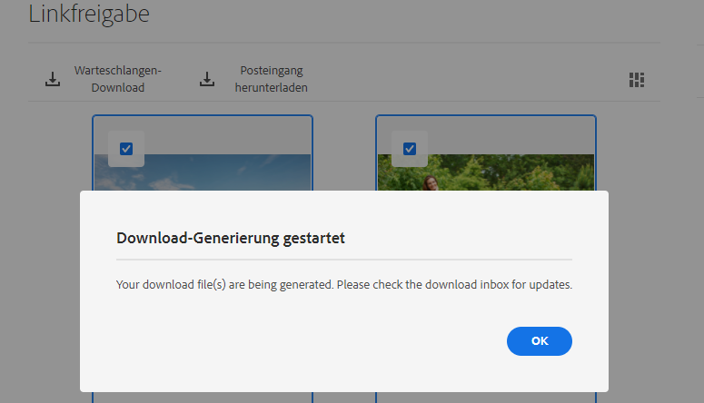
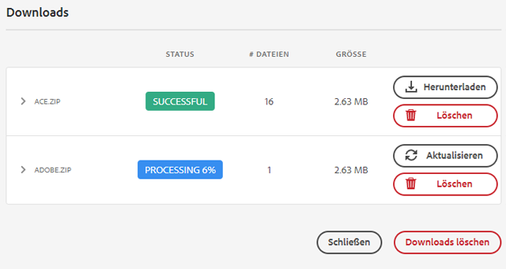
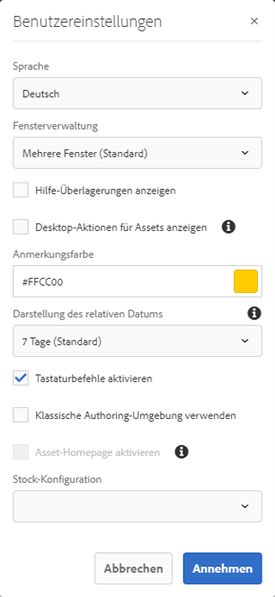

# Freigeben und Verteilen von in [!DNL Experience Manager] verwalteten Assets {#share-assets-from-aem}

<table>
    <tr>
        <td>
            <sup style= "background-color:#008000; color:#FFFFFF; font-weight:bold"><i>Neu</i></sup> <a href="/help/assets/dynamic-media/dm-prime-ultimate.md"><b>Dynamic Media Prime und Ultimate</b></a>
        </td>
        <td>
            <sup style= "background-color:#008000; color:#FFFFFF; font-weight:bold"><i>Neu</i></sup> <a href="/help/assets/assets-ultimate-overview.md"><b>AEM Assets Ultimate</b></a>
        </td>
        <td>
            <sup style= "background-color:#008000; color:#FFFFFF; font-weight:bold"><i>Neu</i></sup> <a href="/help/assets/integrate-aem-assets-edge-delivery-services.md"><b>AEM Assets-Integration mit Edge Delivery Services</b></a>
        </td>
        <td>
            <sup style= "background-color:#008000; color:#FFFFFF; font-weight:bold"><i>Neu</i></sup> <a href="/help/assets/aem-assets-view-ui-extensibility.md"><b>Erweiterbarkeit der Benutzeroberfläche</b></a>
        </td>
          <td>
            <sup style= "background-color:#008000; color:#FFFFFF; font-weight:bold"><i>Neu</i></sup> <a href="/help/assets/dynamic-media/enable-dynamic-media-prime-and-ultimate.md"><b>Aktivieren von Dynamic Media Prime und Ultimate</b></a>
        </td>
    </tr>
    <tr>
        <td>
            <a href="/help/assets/search-best-practices.md"><b>Best Practices für die Suche</b></a>
        </td>
        <td>
            <a href="/help/assets/metadata-best-practices.md"><b>Best Practices für Metadaten</b></a>
        </td>
        <td>
            <a href="/help/assets/product-overview.md"><b>Content Hub</b></a>
        </td>
        <td>
            <a href="/help/assets/dynamic-media-open-apis-overview.md"><b>Dynamic Media mit OpenAPI-Funktionen</b></a>
        </td>
        <td>
            <a href="https://developer.adobe.com/experience-cloud/experience-manager-apis/"><b>Entwicklerdokumentation zu AEM Assets</b></a>
        </td>
    </tr>
</table>

| Version | Artikel-Link |
| -------- | ---------------------------- |
| AEM 6.5 | [Hier klicken](https://experienceleague.adobe.com/docs/experience-manager-65/assets/administer/link-sharing.html?lang=de) |
| AEM as a Cloud Service | Dieser Artikel |

Mit [!DNL Adobe Experience Manager Assets] können Sie Assets, Ordner und Sammlungen für Mitglieder Ihres Unternehmens und externe Einheiten (z. B. Partner und Anbieter) freigeben. Verwenden Sie die folgenden Methoden, um Assets aus [!DNL Experience Manager Assets] as a [!DNL Cloud Service] freizugeben:

* [Freigeben als Link](#sharelink).
* [Herunterladen von Assets und separates Freigeben.](/help/assets/download-assets-from-aem.md)
* Freigeben mit dem [[!DNL Experience Manager] Desktop-Programm](https://experienceleague.adobe.com/docs/experience-manager-desktop-app/using/introduction.html?lang=de).
* Freigeben mit [[!DNL Adobe Asset Link]](https://www.adobe.com/de/creativecloud/business/enterprise/adobe-asset-link.html).
* Freigeben mit [[!DNL Brand Portal]](https://experienceleague.adobe.com/docs/experience-manager-brand-portal/using/introduction/brand-portal.html?lang=de).

## Voraussetzungen {#prerequisites}

Sie benötigen Adminrechte, um die [Einstellungen für die Freigabe von Assets als Link](#config-link-share-settings) zu konfigurieren.

## Konfigurieren der Einstellungen zur Link-Freigabe {#config-link-share-settings}

[!DNL Experience Manager Assets] ermöglicht Ihnen die Konfiguration der standardmäßigen Einstellungen für die Link-Freigabe.

1. Klicken Sie auf das [!DNL Experience Manager]-Logo und navigieren Sie dann zu **[!UICONTROL Tools]** > **[!UICONTROL Assets]** > **[!UICONTROL Assets-Konfiguration]** > **[!UICONTROL Link-Freigabe]**.
1. Anfangseinstellungen:

   * **Originale einschließen:**

      * Wählen Sie `Select Include Originals`, um die Option `Include Originals` standardmäßig im Dialogfeld für die Link-Freigabe auszuwählen.
      * Wählen Sie aus, wie die Option `Include Originals` Ihnen im Dialogfeld „Linkfreigabe” angezeigt wird. [!UICONTROL Bearbeitbar] ermöglicht es den Benutzenden, die hier in den Anfangseinstellungen definierten Einstellungen zu ändern. Mit `Read-only` wird die Einstellung angezeigt, kann jedoch nicht geändert werden. `Hidden` blendet die Einstellung aus und verwendet den hier in den Anfangseinstellungen konfigurierten Wert.
   * **Ausgabedarstellungen einschließen:**
      * Wählen Sie die Option `Select Include Renditions`, um die Option `Include Renditions` standardmäßig im Dialog für die Link-Freigabe auszuwählen.
      * Wählen Sie aus, wie die Option `Include Renditions` Ihnen im Dialogfeld „Link-Freigabe“ angezeigt wird. [!UICONTROL Bearbeitbar] ermöglicht es den Benutzenden, die hier in den Anfangseinstellungen definierten Einstellungen zu ändern. Mit `Read-only` wird die Einstellung angezeigt, kann jedoch nicht geändert werden. `Hidden` blendet die Einstellung aus und verwendet den hier in den Anfangseinstellungen konfigurierten Wert.

1. Geben Sie die standardmäßige Gültigkeitsdauer für den Link im Feld `Validity Period` im Abschnitt `Expiration date` an.

1. Die Schaltfläche zur **[!UICONTROL Link-Freigabe]** in der Aktionsleiste:
   * Alle Benutzenden mit `jcr:modifyAccessControl`-Berechtigungen können die Option [!UICONTROL Link-Freigabe] sehen. Sie ist standardmäßig für alle Admins sichtbar. Die Schaltfläche [!UICONTROL Link-Freigabe] ist standardmäßig für alle sichtbar. Sie können konfigurieren, dass diese Option nur für die definierten Gruppen angezeigt wird, oder Sie können deren Anzeige auch für bestimmte Gruppen ablehnen. Wählen Sie `Allow only for groups`, wenn Sie bestimmten Gruppen erlauben wollen, die Option `Share Link` zu sehen. Wählen Sie `Deny from groups`, wenn Sie bestimmte Gruppen davon ausschließen wollen, die Option `Share Link` zu sehen. Sobald Sie eine dieser Optionen ausgewählt haben, geben Sie die Gruppennamen im Feld `Select Groups` an, um die Namen der Gruppen hinzuzufügen, für die Sie es zulassen bzw. ausschließen möchten.

Die Einstellungen für die E-Mail-Konfiguration finden Sie unter [Dokumentation zum E-Mail-Dienst](https://experienceleague.adobe.com/docs/experience-manager-learn/cloud-service/networking/examples/email-service.html?lang=de).


## Freigeben von Assets als Link {#sharelink}

Die Freigabe von Assets über einen Link ist eine praktische Methode, um die Ressourcen für externe Parteien, Marketing-Experten und andere [!DNL Experience Manager]-Benutzer verfügbar zu machen. Mit dieser Funktion können anonyme Benutzer auf die für sie freigegebenen Assets zugreifen und diese herunterladen. Beim Herunterladen von Assets über einen freigegebenen Link verwendet [!DNL Experience Manager Assets] einen asynchronen Service, der einen schnelleren und unterbrechungsfreien Download bietet. Die herunterzuladenden Assets werden im Hintergrund in eine Warteschlange in ZIP-Archiven mit angemessener Dateigröße aufgenommen. Bei großen Downloads wird der Download in mehrere Dateien mit einer Dateigröße von 100 GB gebündelt.

<!--
Users with administrator privileges or with read permissions at `/var/dam/share` location are able to view the links shared with them. 
-->

>[!NOTE]
>
>* Sie benötigen für die Ordner bzw. Assets, die Sie als Link freigeben möchten, zunächst die Berechtigung „ACL bearbeiten“.
>* [Aktivieren Sie ausgehende E-Mails](/help/implementing/developing/introduction/development-guidelines.md#sending-email), bevor Sie einen Link für die Benutzer freigeben.

Es gibt zwei Möglichkeiten, die Assets mithilfe der Link-Freigabe freizugeben:

1. Erstellen Sie einen freigegebenen Link, [kopieren Sie den Asset-Link und teilen Sie ihn](#copy-and-share-assets-link) mit anderen Benutzenden.
1. Erstellen Sie einen freigegebenen Link und [teilen Sie den Asset-Link per E-Mail](#share-assets-link-through-email). Sie können die Standardwerte wie Ablaufdatum und -zeit ändern und das Herunterladen der Original-Assets und ihrer Ausgabedarstellungen zulassen. Sie können E-Mails an mehrere Benutzer senden, indem Sie deren E-Mail-Adressen hinzufügen.

   

In beiden Fällen können Sie die Standardwerte wie Ablaufdatum und -zeit ändern und das Herunterladen der Original-Assets und ihrer Ausgabedarstellungen zulassen.

### Kopieren und Freigeben des Asset-Links{#copy-and-share-asset-link}

Freigeben von Assets als öffentliche URL:

1. Melden Sie sich bei [!DNL Experience Manager Assets] an und navigieren Sie zu **[!UICONTROL Dateien]**.
1. Wählen Sie die Assets oder den Ordner mit den Assets aus. Klicken Sie in der Symbolleiste auf **[!UICONTROL Link freigeben]**.
1. Der Dialog **[!UICONTROL Linkfreigabe]** wird angezeigt, der im Feld **[!UICONTROL Link freigeben]** auch einen automatisch generierten Asset-Link enthält.
1. Legen Sie das Ablaufdatum des freigegebenen Links nach Bedarf fest.
1. Aktivieren oder deaktivieren Sie unter **[!UICONTROL Link-Einstellungen]** `Include Originals` bzw. `Include Renditions`, um eine oder beide einzubeziehen bzw. auszuschließen. Die Auswahl von mindestens einer Option ist obligatorisch.
1. Die Namen der ausgewählten Assets werden in der rechten Spalte des Dialogfelds [!DNL Share Link] angezeigt.
1. Kopieren Sie diesen Link und teilen Sie ihn mit anderen Benutzern.

### Freigeben des Asset-Links per E-Mail-Benachrichtigung {#share-assets-link-through-email}

So geben Sie Assets per E-Mail frei:

1. Wählen Sie die Assets oder den Ordner mit den Assets aus. Klicken Sie in der Symbolleiste auf **[!UICONTROL Link freigeben]**.
1. Der Dialog **[!UICONTROL Linkfreigabe]** wird angezeigt, der im Feld **[!UICONTROL Link freigeben]** auch einen automatisch generierten Asset-Link enthält.

   * Geben Sie im Feld „E-Mail-Adresse“ die E-Mail-Adresse der Person ein, für die Sie den Link freigeben möchten. Sie können den Link für mehrere Benutzende freigeben. Wenn die Person Mitglied Ihres Unternehmens ist, wählen Sie ihre E-Mail-Adresse aus den Vorschlägen aus, die in der Dropdown-Liste angezeigt werden. Geben Sie in das Textfeld „E-Mail-Adresse“ die E-Mail-Adresse der Person ein, für die Sie den Link freigeben möchten, und klicken Sie auf [!UICONTROL Eingabe]. Sie können den Link für mehrere Benutzende freigeben.

   * Geben Sie im Feld **[!UICONTROL Betreff]** einen Betreff ein, um den Zweck der freigegebenen Assets anzugeben.
   * Geben Sie bei Bedarf eine Nachricht in das Feld **[!UICONTROL Nachricht]** ein.
   * Verwenden Sie im Feld **[!UICONTROL Ablauf]** die Datumsauswahl, um Ablaufdatum und -uhrzeit für den Link festzulegen.
   * Aktivieren Sie das Kontrollkästchen **[!UICONTROL Download der Originaldatei zulassen]**, damit die Empfängerinnen und Empfänger die ursprüngliche Ausgabedarstellung herunterladen können.

1. Klicken Sie auf **[!UICONTROL Freigeben]**. Eine Meldung bestätigt, dass der Link für die Benutzer freigegeben wurde. Die Benutzer erhalten eine E-Mail mit dem freigegebenen Link.

   

### Anpassen einer E-Mail-Vorlage {#customize-email-template}

Eine gut durchdachte Vorlage vermittelt Professionalität und Kompetenz und erhöht die Glaubwürdigkeit Ihrer Botschaft und Ihres Unternehmens. Mit [!DNL Adobe Experience Manager] können Sie die E-Mail-Vorlage anpassen, die an Empfängerinnen und Empfänger gesendet wird, welche dann die E-Mail mit dem freigegebenen Link erhalten. Darüber hinaus ermöglichen benutzerdefinierte E-Mail-Vorlagen die Personalisierung Ihres E-Mail-Inhalts, indem Sie Ihre Empfängerinnen und Empfängern mit Namen ansprechen und auf spezifische Details verweisen, die für sie relevant sind. Dieser persönliche Kontakt kann dazu führen, dass sich die Empfängerinnen und Empfänger geschätzt fühlen, und die Interaktion verstärken. Eine benutzerdefinierte Vorlage stellt darüber hinaus sicher, dass Ihre E-Mails mit Ihrer Markenidentität konsistent sind, einschließlich Logos, Farben und Schriftarten. Konsistenz stärkt die Markenerkennung und das Vertrauen der Empfängerinnen und Empfänger.

#### Format einer benutzerdefinierten E-Mail-Vorlage {#format-of-custom-email-template}

Die E-Mail-Vorlage kann mit nur Text oder mit HTML angepasst werden. Den standardmäßigen Link zur bearbeitbaren Vorlage finden Sie unter `/libs/settings/dam/adhocassetshare/en.txt`. Sie können die Vorlage überschreiben, indem Sie die Datei `/apps/settings/dam/adhocassetshare/en.txt` erstellen. Sie können die E-Mail-Vorlage beliebig oft ändern.

| Platzhalter | Beschreibung |
|---|-----|
| `${emailSubject}` | Der Betreff einer E-Mail |
| `${emailInitiator}` | Die E-Mail-ID der Person, die die E-Mail erstellt hat. |
| `${emailMessage}` | E-Mail-Textkörper |
| `${pagePath}` | URL des freigegebenen Links |
| `${linkExpiry}` | Ablaufdatum des freigegebenen Links |

<!--| `${host.prefix}` | Origin of the [!DNL Experience Manager] instance, for example `http://www.adobe.com"` |-->

#### Beispiel für eine benutzerdefinierte E-Mail-Vorlage {#custom-email-template-example}

```
subject: ${emailSubject}

<!DOCTYPE html>
<html><body>
<p><strong>${emailInitiator}</strong> invited you to review assets.</p>
<p>${emailMessage}</p>
<p>The shared link will be available until ${linkExpiry}.
<p>
    <a href="${pagePath}" target="_blank"><strong>Open</strong></a>
</p>

</body></html>
```

<!--Sent from instance: ${host.prefix}-->

### Herunterladen von Assets über den Asset-Link {#download-assets-using-asset-link}

Jeder Benutzer, der Zugriff auf den freigegebenen Asset-Link hat, kann die in einem ZIP-Ordner gebündelten Assets herunterladen. Der Download-Prozess ist identisch, unabhängig davon, ob jemand auf den kopierten Asset-Link zugreift oder den über die E-Mail freigegebenen Asset-Link verwendet.

* Klicken Sie auf den Asset-Link oder fügen Sie die URL in Ihren Browser ein. Die Benutzeroberfläche [!UICONTROL Linkfreigabe] wird geöffnet. Dort können Sie zur [!UICONTROL Kartenansicht] oder [!UICONTROL Listenansicht] wechseln.

* In der [!UICONTROL Kartenansicht] können Sie den Mauszeiger über das freigegebene Asset oder den Ordner mit freigegebenen Assets bewegen, um die Assets auszuwählen oder sie zum Herunterladen in die Warteschlange zu stellen.

* Standardmäßig zeigt die Benutzeroberfläche die Option **[!UICONTROL Download-Posteingang]** an. Diese Option enthält die Liste aller freigegebenen Assets oder Ordner, die zum Herunterladen in die Warteschlange gestellt werden, zusammen mit ihrem Status.

* Wenn Sie die Assets oder den Ordner auswählen, wird die Option **[!UICONTROL Warteschlangen-Download]** auf dem Bildschirm angezeigt. Klicken Sie auf die Option **[!UICONTROL Warteschlangen-Download]**, um den Download-Prozess zu starten.

  

* Klicken Sie während der Vorbereitung der Download-Datei auf die Option **[!UICONTROL Download-Posteingang]**, um den Status Ihres Downloads anzuzeigen. Klicken Sie bei großen Downloads auf die Schaltfläche **[!UICONTROL Aktualisieren]**, um den Status zu aktualisieren.

  

* Nachdem die Verarbeitung abgeschlossen ist, klicken Sie auf die Schaltfläche **[!UICONTROL Download]**, um die Zip-Datei herunterzuladen.

<!--
You can also copy the auto-generated link and share it with the users. The default expiration time for the link is one day.
-->

>[!NOTE]
>
>Wenn ein freigegebenes Asset an einen anderen Speicherort verschoben wird, funktioniert der Link zum Asset nicht mehr. Erstellen Sie den Link erneut und geben Sie ihn für die Benutzenden frei.


<!--
## Share assets as a link {#sharelink}

To generate the URL for assets you want to share with users, use the Link Sharing dialog. Users with administrator privileges or with read permissions at `/var/dam/share` location are able to view the links shared with them. Sharing assets through a link is a convenient way of making resources available to external parties without them having to first log in to Experience Manager Assets.

>[!NOTE]
>
>* You need Edit ACL permission on the folder or the asset that you want to share as a link.
>* Before you share a link with users, ensure that Day CQ Mail Service is configured. Otherwise, an error occurs.

1. In the Assets user interface, select the asset to share as a link.
1. From the toolbar, click/tap the **[!UICONTROL Share Link]**.

   An asset link is auto-created in the **[!UICONTROL Share Link]** field. Copy this link and share it with the users. The default expiration time for the link is one day.

   Alternatively, proceed to perform steps 3-7 of this procedure to add email recipients, configure the expiration time for the link, and send it from the dialog.

   >[!NOTE]
   >
   >If a shared asset is moved to a different location, its link stops working. Re-create the link and re-share with the users.

1. From the web console, open the **[!UICONTROL Day CQ Link Externalizer]** configuration and modify the following properties in the **[!UICONTROL Domains]** field with the values mentioned against each:

    * local
    * author
    * publish

   For the local and author properties, provide the URL for the local and author instance respectively. Both local and author properties have the same value if you run a single Experience Manager author instance. For publish, provide the URL for the publish instance.

1. In the email address box of the **[!UICONTROL Link Sharing]** dialog, type the email ID of the user you want to share the link with. You can also share the link with multiple users.

   If the user is a member of your organization, select the user's email ID from the suggested email IDs that appear in the list below the typing area. For an external user, type the complete email ID and then select it from the list.

   To enable emails to be sent out to users, configure the SMTP server details in [Day CQ Mail Service](/help/assets/configure-asset-sharing.md#configmailservice).

   >[!NOTE]
   >
   >If you enter an email ID of a user that is not a member of your organization, the words "External User" are prefixed with the email ID of the user.

1. In the **[!UICONTROL Subject]** box, enter a subject for the asset you want to share.
1. In the **[!UICONTROL Message]** box, enter an optional message.
1. In the **[!UICONTROL Expiration]** field, specify an expiration date and time for the link using the date picker. By default, the expiration date is set for a week from the date you share the link.
1. To let users download the original image along with the renditions, select **[!UICONTROL Allow download of original file]**.

   >[!NOTE]
   >
   >By default, users can only download the renditions of the asset that you share as a link.

1. Click **[!UICONTROL Share]**. A message confirms that the link is shared with the users through an email.
1. To view the shared asset, click/tap the link in the email that is sent to the user. The shared asset is displayed in the **[!UICONTROL Adobe Marketing Cloud]** page.

   To toggle to the list view, click/tap the layout icon in the toolbar.

1. To generate a preview of the asset, click/tap the shared asset. To close the preview and return to the **[!UICONTROL Marketing Cloud]** page, click/tap **[!UICONTROL Back]** in the toolbar. If you have shared a folder, click/tap **[!UICONTROL Parent Folder]** to return to the parent folder.

   >[!NOTE]
   >
   >Experience Manager supports generating the preview of assets of these MIME types: JPG, PNG, GIF, BMP, INDD, PDF, and PPT. You can only download the assets of the other MIME types.

1. To download the shared asset, click/tap **[!UICONTROL Select]** from the toolbar, click/tap the asset, and then click/tap **[!UICONTROL Download]** from the toolbar.
1. To view the assets you shared as links, go to the Assets user interface and click/tap the GlobalNav icon. Choose **[!UICONTROL Navigation]** from the list to display the Navigation pane.
1. From the Navigation pane, choose **[!UICONTROL Shared Links]** to display a list of shared assets.
1. To un-share an asset, select it and tap/click **[!UICONTROL Unshare]** from the toolbar.

A message confirms that you unshared the asset. In addition, the entry for the asset is removed from the list.
-->

## Herunterladen von Assets und separates Freigeben {#download-and-share-assets}

Benutzer können benötigte Assets herunterladen und diese außerhalb von [!DNL Experience Manager] freigeben. Weitere Informationen finden Sie unter [Suchen von Assets](/help/assets/search-assets.md), [Herunterladen von Assets](/help/assets/download-assets-from-aem.md) und [Herunterladen von Sammlungen](manage-collections.md#download-a-collection).

## Freigeben von Assets für Kreativschaffende {#share-with-creatives}

Marketing-Experten und Anwender aus der Branche können genehmigte Assets problemlos für ihre Kreativschaffenden freigeben.

* **Experience Manager-Desktop-Programm**: Das Programm funktioniert unter Windows und Mac. Siehe [Überblick über das AEM-Desktop-Programm](https://experienceleague.adobe.com/docs/experience-manager-desktop-app/using/introduction.html?lang=de). Informationen dazu, wie autorisierte Desktop-Benutzer problemlos auf die freigegebenen Assets zugreifen können, finden Sie unter [Durchsuchen, Suchen und Anzeigen einer Vorschau von Assets](https://experienceleague.adobe.com/docs/experience-manager-desktop-app/using/using.html?lang=de#browse-search-preview-assets). Die Desktop-Benutzer können Assets erstellen und diese dann für ihre Experience Manager-Benutzer freigeben, indem sie beispielsweise neue Bilder hochladen. Siehe [Hochladen von Assets mit dem Desktop-Programm](https://experienceleague.adobe.com/docs/experience-manager-desktop-app/using/using.html?lang=de#upload-and-add-new-assets-to-aem).

* **Adobe Asset Link**: Kreativschaffende können Assets direkt in [!DNL Adobe InDesign], [!DNL Adobe Illustrator] und [!DNL Adobe Photoshop] suchen und verwenden.

## Konfigurieren der Asset-Freigabe {#configure-sharing}

Die verschiedenen Optionen zum Freigeben der Assets erfordern eine spezifische Konfiguration und müssen bestimmte Voraussetzungen erfüllen.

### Konfigurieren der Asset-Link-Freigabe {#asset-link-sharing}

<!-- TBD: Web Console is not there so how to configure Day CQ email service? Or is it not required now? -->

Die URL für Assets, die Sie freigeben möchten, generieren Sie im Dialogfeld „Link-Freigabe“. Benutzende mit Administratorrechten oder mit Leserechten für den Speicherort `/var/dam/share` können dann die Links sehen, die für sie freigegeben sind. Die Freigabe von Assets über einen Link ist eine praktische Methode, um Ressourcen für externe Parteien verfügbar zu machen, ohne dass sich diese zunächst bei [!DNL Assets] anmelden müssen.

>[!NOTE]
>
>Wenn Sie Links von Ihrer Autoreninstanz für externe Entitäten freigeben möchten, stellen Sie sicher, dass Sie nur die folgenden URLs für `GET`-Anfragen bereitstellen. Blockieren Sie andere URLs, um sicherzustellen, dass Ihre Autoreninstanz sicher ist.
>
>* `[aem_server]:[port]/linkshare.html`
>* `[aem_server]:[port]/linksharepreview.html`
>* `[aem_server]:[port]/linkexpired.html`

<!--
1. From the list of services, locate **[!UICONTROL Day CQ Mail Service]**.
1. Click the **[!UICONTROL Edit]** icon beside the service, and configure the following parameters for **Day CQ Mail Service** with the details mentioned against their names:

    * SMTP server host name: email server host name
    * SMTP server port: email server port
    * SMTP user: email server user name
    * SMTP password: email server password
-->

<!-- TBD: Commenting as Web Console is not available. Document the appropriate OSGi config method if available in CS.
### Configure maximum data size {#maxdatasize}

When you download assets from the link shared using the Link Sharing feature, Experience Manager compresses the asset hierarchy from the repository and then returns the asset in a ZIP file. However, in the absence of limits to the amount of data that can be compressed in a ZIP file, huge amounts of data is subjected to compression, which causes out of memory errors in JVM. To secure the system from a potential denial of service attack due to this situation, you can configure the maximum size of the downloaded files. If uncompressed size of the asset exceeds the configured value, asset download requests are rejected. The default value is 100 MB.

1. Click/Tap the Experience Manager logo and then go to **[!UICONTROL Tools]** &gt; **[!UICONTROL Operations]** &gt; **[!UICONTROL Web Console]**.
1. From the web console, locate the **[!UICONTROL Day CQ DAM Adhoc Asset Share Proxy Servlet]** configuration.
1. Open the configuration in edit mode, and modify the value of the **[!UICONTROL Max Content Size (uncompressed)]** parameter.
1. Save the changes.
-->

<!--
Add content or link about how to configure sharing via BP, DA, AAL, etc.
-->

### Aktivieren von Desktop-Aktionen für die Verwendung mit dem Desktop-Programm {#desktop-actions}

Über die [!DNL Assets]-Benutzeroberfläche in einem Browser können Sie zu den Asset-Speicherorten navigieren oder das Asset auschecken und öffnen, um es im Desktop-Programm zu bearbeiten. Diese Optionen werden als Desktop-Aktionen bezeichnet. Wie Sie sie aktivieren, erfahren Sie unter [Aktivieren von Desktop-Aktionen in der [!DNL Assets] -Web-Benutzeroberfläche](https://experienceleague.adobe.com/docs/experience-manager-desktop-app/using/using.html?lang=de#desktopactions-v2).



### Konfigurationen zur Verwendung von [!DNL Adobe Asset Link] {#configure-asset-link}

Adobe Asset Link optimiert die Zusammenarbeit zwischen Kreativen und Marketing-Fachleuten bei der Inhaltserstellung. Es verbindet [!DNL Adobe Experience Manager Assets] mit den [!DNL Creative Cloud]-Desktop-Programmen [!DNL Adobe InDesign], [!DNL Adobe Photoshop] und [!DNL Adobe Illustrator]. Über das [!DNL Adobe Asset Link]-Bedienfeld können Kreativschaffende auf in [!DNL Assets] gespeicherte Inhalte zugreifen und diese bearbeiten, ohne die Kreativprogramme zu verlassen, mit denen sie am besten vertraut sind.

Siehe [Konfigurieren von [!DNL Assets] für die Verwendung mit [!DNL Adobe Asset Link]](https://helpx.adobe.com/de/enterprise/using/configure-aem-assets-for-asset-link.html).

## Best Practices und Fehlerbehebung {#bestpractices}

* Asset-Ordner oder Sammlungen, die ein Leerzeichen im Namen enthalten, werden möglicherweise nicht freigegeben.
* Wenn Benutzende die freigegebenen Assets nicht herunterladen können, fragen Sie bei Ihrem Experience Manager-Administrierenden nach den Download-Beschränkungen. Der Standardwert lautet 100 MB.
* Damit ein Benutzer eine Vorschau eines Videos anzeigen kann, das über die Link-Freigabe freigegeben wurde, muss für das Video eine statische Videoausgabe an der `/jcr:content/renditions`-Position im Knoten des Videos im Repository verfügbar sein. Die Vorschau ist nicht von der Verfügbarkeit einer [!DNL Dynamic Media]-Ausgabedarstellung abhängig.
* Beim Herunterladen eines Video-Assets über die Linkfreigabe sind die [!DNL Dynamic Media]-Ausgabedarstellungen nicht im heruntergeladenen Archiv enthalten.

<!--
* If you cannot send email with links to shared assets or if the other users cannot receive your email, check with your Experience Manager administrator if the [email service](/help/assets/configure-asset-sharing.md#configmailservice) is configured or not. 
* If you cannot share assets using link sharing functionality, ensure that you have the appropriate permissions. See [share assets](#sharelink).
-->

<!-- TBD: Add content or link about how to share using Brand Portal when it is available on [!DNL Cloud Service].
-->

**Siehe auch**

* [Assets übersetzen](translate-assets.md)
* [Assets-HTTP-API](mac-api-assets.md)
* [Von AEM Assets unterstützte Dateiformate](file-format-support.md)
* [Suchen von Assets](search-assets.md)
* [Connected Assets](use-assets-across-connected-assets-instances.md)
* [Asset-Berichte](asset-reports.md)
* [Metadatenschemata](metadata-schemas.md)
* [Herunterladen von Assets](download-assets-from-aem.md)
* [Verwalten von Metadaten](manage-metadata.md)
* [Suchfacetten](search-facets.md)
* [Verwalten von Sammlungen](manage-collections.md)
* [Massenimport von Metadaten](metadata-import-export.md)
* [Veröffentlichen von Assets in AEM und Dynamic Media](/help/assets/publish-assets-to-aem-and-dm.md)

