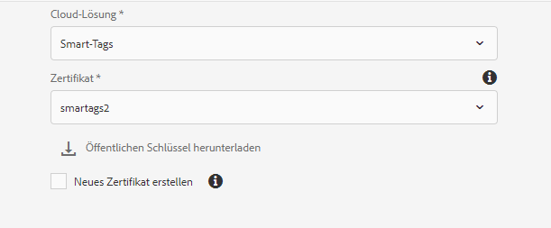
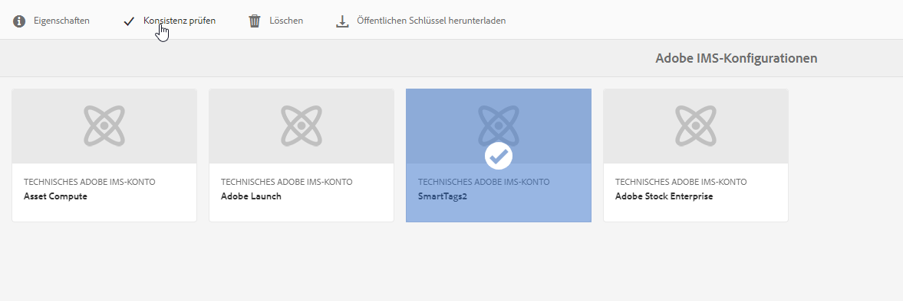
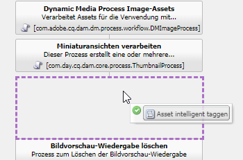
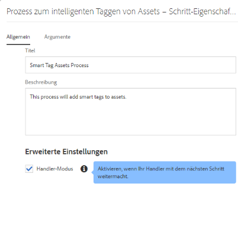

# Konfigurieren von Experience Manager für das Smart-Tagging von Assets {#configure-aem-for-smart-tagging}

Das Tagging mit einem taxonomiegesteuerten Vokabular stellt sicher, dass die Assets im Rahmen von Tag-basierten Suchen einfach identifiziert und abgerufen werden können. Adobe stellt Smart-Tags bereit, die Algorithmen für künstliche Intelligenz und maschinelles Lernen verwenden, um Bilder zu trainieren. Smart-Tags verwenden ein KI-Framework von [Adobe Sensei](https://www.adobe.com/de/sensei/experience-cloud-artificial-intelligence.html), um den Bilderkennungsalgorithmus auf Ihre Tag-Struktur und Ihre Unternehmenstaxonomie zu trainieren.

Die Smart-Tag-Funktion kann als Add-on zu [!DNL Experience Manager] erworben werden. Nach dem Kauf wird eine E-Mail mit einem Link zur Adobe Developer Console an den Administrator Ihres Unternehmens gesendet. Der Administrator greift auf den Link zu, um die Smart-Tags mit der Adobe Developer Console in [!DNL Experience Manager] zu integrieren.

<!-- TBD: 
1. Can a similar flowchart be created about how training works in CS? 
2. Is there a link to buy SCS or initiate a sales call.
3. Keystroke all steps and check all screenshots.
-->

>[!IMPORTANT]
>
>[!DNL Experience Manager Assets] Bereitstellungen, die nach  [August 2020 ](/help/release-notes/release-notes-cloud/2020/release-notes-2020-8-0.md#assets) erstellt wurden, werden  [!DNL Adobe Developer Console] standardmäßig in integriert. Dadurch wird die Konfiguration der Smart-Tags-Funktionalität beschleunigt. Bei älteren Bereitstellungen können Administratoren die folgenden Schritte ausführen, um die Integration zu konfigurieren.

## Integration mit der Adobe Developer Console {#aio-integration}

Bevor Sie die Bilder mit SCS taggen können, integrieren Sie [!DNL Adobe Experience Manager] mithilfe der Adobe Developer Console mit dem Smart-Tags-Service. Im Backend authentifiziert der [!DNL Experience Manager]-Server Ihre Service-Anmeldedaten mit dem Gateway der Adobe Developer Console, bevor Ihre Anfrage an den Service weitergeleitet wird.

* Erstellen Sie eine Konfiguration in [!DNL Experience Manager], um einen öffentlichen Schlüssel zu erstellen. [Erlangen Sie ein öffentliches Zertifikat](#obtain-public-certificate) für die OAuth-Integration.
* [Erstellen Sie eine Integration in der Adobe Developer Console](#create-aio-integration) und laden Sie den generierten öffentlichen Schlüssel hoch.
* [Konfigurieren Sie Smart-Tags](#configure-smart-content-service) in Ihrer [!DNL Experience Manager]Instanz mithilfe des API-Schlüssels und der anderen Anmeldeinformationen aus der Adobe Developer Console.
* [Testen Sie die Konfiguration](#validate-the-configuration).
* [Konfigurieren Sie erneut nach Ablauf des Zertifikats](#certrenew).

### Voraussetzungen für die Integration in der Adobe Developer Console {#prerequisite-for-aio-integration}

Stellen Sie vor der Verwendung der Smart-Tags Folgendes sicher, um eine Integration in der Adobe Developer Console zu erstellen:

* Es ist ein Adobe ID-Konto mit Administratorrechten für die Organisation vorhanden.
* Smart-Tags sind für Ihre Organisation aktiviert.

### Abrufen eines öffentlichen Zertifikats {#obtain-public-certificate}

Ein öffentliches Zertifikat ermöglicht Ihnen die Authentifizierung Ihres Profils in der Adobe Developer Console. Sie erstellen ein Zertifikat in [!DNL Experience Manager].

1. Rufen Sie in der [!DNL Experience Manager]-Benutzeroberfläche **[!UICONTROL Tools]** > **[!UICONTROL Sicherheit]** > **[!UICONTROL Adobe IMS-Konfigurationen]** auf.

1. Klicken Sie auf der Seite [!UICONTROL Adobe IMS-Konfigurationen] auf **[!UICONTROL Erstellen]**. Wählen Sie im Menü **[!UICONTROL Cloud-Lösung]** die Option **[!UICONTROL Smart-Tags]** aus.

1. Wählen Sie **[!UICONTROL Neues Zertifikat erstellen]** aus. Geben Sie einen Namen ein und klicken Sie auf **[!UICONTROL Zertifikat erstellen]**. Klicken Sie auf **[!UICONTROL OK]**.

1. Klicken Sie auf **[!UICONTROL Öffentlichen Schlüssel herunterladen]**.

   

### Erstellen einer Integration {#create-aio-integration}

Um Smart-Tags zu verwenden, erstellen Sie eine Integration in der Adobe Developer Console, um API-Schlüssel, technische Konto-ID, Organisations-ID und Client-Geheimnis zu generieren.

1. Rufen Sie [https://console.adobe.io](https://console.adobe.io/) in einem Browser auf. Wählen Sie das entsprechende Konto aus und vergewissern Sie sich, dass die zugehörige Organisationsrolle „Systemadministrator“ ist.
1. Erstellen Sie ein Projekt mit einem beliebigen Namen. Klicken Sie auf **[!UICONTROL API hinzufügen]**.
1. Wählen Sie auf der Seite **[!UICONTROL API hinzufügen]** die Option **[!UICONTROL Experience Cloud]** und dann **[!UICONTROL Smart Content]** aus. Klicken Sie auf **[!UICONTROL Weiter]**.
1. Wählen Sie **[!UICONTROL Öffentlichen Schlüssel hochladen]** aus. Stellen Sie die von [!DNL Experience Manager] heruntergeladenen Zertifikatdatei bereit. Die Meldung [!UICONTROL Öffentliche(r) Schlüssel erfolgreich hochgeladen] wird angezeigt. Klicken Sie auf **[!UICONTROL Weiter]**.
1. Die Seite [!UICONTROL Neue Dienstkonto (JWT)-Anmeldedaten erstellen] zeigt den öffentlichen Schlusselle für das Dienstkonto an, das Sie gerade konfiguriert haben. Klicken Sie auf **[!UICONTROL Weiter]**.
1. Wählen Sie auf der Seite **[!UICONTROL Produktprofile auswählen]** die Option **[!UICONTROL Smart Content Services]** aus. Klicken Sie auf **[!UICONTROL Konfigurierte API speichern]**. Auf einer Seite werden weitere Informationen zur Konfiguration angezeigt. Lassen Sie diese Seite offen, um diese Werte zu kopieren und in Experience Manager hinzuzufügen, wenn Sie Smart-Tags in [!DNL Experience Manager] weiter konfigurieren.

   

### Konfigurieren von Smart-Tags {#configure-smart-content-service}

Verwenden Sie zum Konfigurieren der Integration die Werte der Felder „Payload“, „Client-Geheimnis“, „Autorisierungs-Server“ und „API-Schlüssel“ aus der Integration in der Adobe Developer Console.

1. Rufen Sie in der [!DNL Experience Manager]-Benutzeroberfläche **[!UICONTROL Tools]** > **[!UICONTROL Sicherheit]** > **[!UICONTROL Adobe IMS-Konfigurationen]** auf.
1. Rufen Sie die Seite **[!UICONTROL Konfiguration des technischen Adobe IMS-Kontos]** auf und geben Sie den gewünschten **[!UICONTROL Titel]** ein.
1. Geben Sie im Feld **[!UICONTROL Autorisierungsserver]** die `https://ims-na1.adobelogin.com`-URL ein.
1. Geben Sie im Feld **[!UICONTROL API-Schlüssel]** die **[!UICONTROL Client-ID]** aus der [!DNL Adobe Developer Console] ein.
1. Geben Sie im Feld **[!UICONTROL Client-Geheimnis]** den geheimen **[!UICONTROL Client-Schlüssel]** aus der [!DNL Adobe Developer Console] ein. Klicken Sie auf die Option **[!UICONTROL Client-Geheimnis abrufen]**, um es anzuzeigen.
1. Klicken Sie in der [!DNL Adobe Developer Console] in Ihrem Projekt am linken Rand auf **[!UICONTROL Dienstkonto (JWT)]**. Klicken Sie auf die Registerkarte **[!UICONTROL JWT generieren]**. Klicken Sie auf **[!UICONTROL Kopieren]**, um die angezeigte **[!UICONTROL JWT-Payload]** zu kopieren. Geben Sie diesen Wert im Feld **[!UICONTROL Payload]** in [!DNL Experience Manager] ein. Klicken Sie auf **[!UICONTROL Erstellen]**.

### Überprüfen der Konfiguration {#validate-the-configuration}

Nachdem Sie die Konfiguration abgeschlossen haben, führen Sie die folgenden Schritte aus, um die Konfiguration zu validieren.

1. Rufen Sie in der [!DNL Experience Manager]-Benutzeroberfläche **[!UICONTROL Tools]** > **[!UICONTROL Sicherheit]** > **[!UICONTROL Adobe IMS-Konfigurationen]** auf.

1. Wählen Sie die Smart-Tags-Konfiguration aus. Klicken Sie in der Symbolleiste auf **[!UICONTROL Systemdiagnose]**. Klicken Sie auf **[!UICONTROL Prüfen]**. Ein Dialogfeld mit der Meldung [!UICONTROL Fehlerfreie Konfiguration] bestätigt, dass die Konfiguration funktioniert.

### Neu konfigurieren, wenn ein Zertifikat abläuft {#certrenew}

Wenn das Zertifikat abläuft, wird es nicht mehr als vertrauenswürdig eingestuft. Um ein neues Zertifikat hinzuzufügen, führen Sie diese Schritte aus. Sie können ein abgelaufenes Zertifikat nicht verlängern.

1. Melden Sie sich bei Ihrer [!DNL Experience Manager]-Implementierung als Administrator an. Klicken Sie auf **[!UICONTROL Tools]** > **[!UICONTROL Sicherheit]** > **[!UICONTROL Benutzer]**.

1. Suchen und finden Sie **[!UICONTROL dam-update-service]**-Benutzer und klicken Sie darauf. Klicken Sie auf die Registerkarte **[!UICONTROL Keystore]**.
1. Löschen Sie den vorhandenen **[!UICONTROL similaritysearch]**-Keystore mit dem abgelaufenen Zertifikat. Klicken Sie auf **[!UICONTROL Speichern und schließen]**.

   

   *Abbildung: Löschen des vorhandenen Eintrags `similaritysearch` in Keystore, um ein neues Sicherheitszertifikat hinzuzufügen.*

1. Rufen Sie in der [!DNL Experience Manager]-Benutzeroberfläche **[!UICONTROL Tools]** > **[!UICONTROL Sicherheit]** > **[!UICONTROL Adobe IMS-Konfigurationen]** auf. Öffnen Sie die verfügbare Smart-Tags-Konfiguration. Um ein öffentliches Zertifikat herunterzuladen, klicken Sie auf **[!UICONTROL Öffentliches Zertifikat herunterladen]**.

1. Rufen Sie [https://console.adobe.io](https://console.adobe.io) auf und navigieren Sie im Projekt zum vorhandenen Service. Laden Sie das neue Zertifikat hoch und konfigurieren Sie es. Weitere Informationen zur Konfiguration finden Sie in den Anweisungen unter [Erstellen einer Integration in der Adobe Developer Console](#create-aio-integration).

## Automatisches Tagging beim Hochladen von Assets aktivieren (Optional) {#enable-smart-tagging-for-uploaded-assets}

1. Gehen Sie in [!DNL Experience Manager] zu **[!UICONTROL Tools > Workflow > Modelle]**.
1. Wählen Sie auf der Seite **[!UICONTROL Workflow-Modelle]** das Workflow-Modell **[!UICONTROL DAM Update Asset]** aus.
1. Klicken Sie in der Symbolleiste auf **[!UICONTROL Bearbeiten]**.
1. Erweitern Sie das Seitenbedienfeld, um die Schritte anzuzeigen. Ziehen Sie den Schritt **[!UICONTROL Asset intelligent taggen]**, der im Abschnitt „DAM-Workflow“ verfügbar ist, und platzieren Sie ihn nach dem Schritt **[!UICONTROL Prozessminiaturansichten]**.

   

   *Abbildung: Schritt zum Hinzufügen von Smart-Tag-Assets nach dem Schritt „Miniaturansichten verarbeiten“ im Workflow „DAM-Update-Asset“.*

1. Öffnen Sie den zu konfigurierenden Schritt. Stellen Sie unter **[!UICONTROL Erweiterte Einstellungen]** sicher, dass die Option **[!UICONTROL Handler-Erweiterung]** ausgewählt ist.

   

1. Wählen Sie auf der Registerkarte **[!UICONTROL Argumente]** die Option **[!UICONTROL Fehler ignorieren]** aus, wenn der Workflow Fehler bei der Vorhersage von Tags ignorieren soll. Um Assets unabhängig davon mit Tags zu versehen, ob die Smart-Tagging-Funktion für Ordner aktiviert ist, wählen Sie **[!UICONTROL Smart-Tag-Markierung ignorieren]** aus.

1. Klicken Sie auf **[!UICONTROL OK]**, um den Prozessschritt zu schließen, und speichern Sie dann den Workflow. Klicken Sie auf **[!UICONTROL Synchronisieren]**.

>[!MORELIKETHIS]
>
>* [Taggen von Assets mit dem Smart-Service](smart-tags.md)

