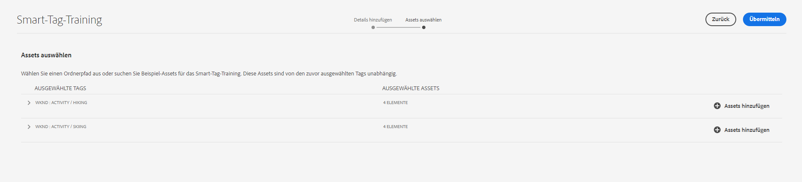
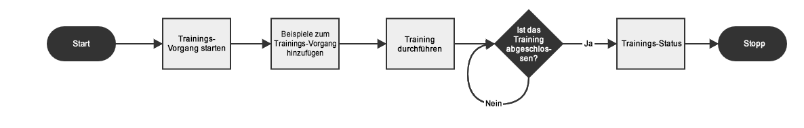

# Training zu Smart-Tags

Mit dem Smart-Tags-Training können Sie Ihre Tags trainieren. Sie können Details angeben, wenn die entsprechenden Tags nicht vorhanden sind. Es verwendet ein KI-Framework von [Adobe AI](https://business.adobe.com/ai/adobe-genai.html), um den Bilderkennungsalgorithmus auf Ihre Tag-Struktur und Ihre Unternehmenstaxonomie zu trainieren. Diese Content-Intelligenz wird dann verwendet, um relevante Tags auf einen anderen Satz von Assets anzuwenden. [!DNL Experience Manager Assets] wendet standardmäßig automatisch Smart-Tags auf hochgeladene Assets an.

## Bestimmen der Anforderungen für ein Smart-Tags-Training {#smart-tag-training-requirement}

Ein Smart-Tags-Training ist in den folgenden Szenarien erforderlich:

* Hinzufügen einer automatisierten Beschriftung, damit Labels nicht bei jedem Hochladen desselben Assets erneut hinzugefügt werden müssen.
* Verbessern der Möglichkeit von Assets, relevante Tags anzuwenden.
* Erhöhen der Genauigkeit der Tags, die für ein Asset angezeigt werden.
* Hinzufügen nicht verfügbarer oder fehlender Label.

>[!NOTE]
>
>Das Trainieren von Smart-Tags gilt nur für ***image-type***-Assets.

## Schritte zum Trainieren von Smart-Tags

[!DNL Experience Manager] as a [!DNL Cloud Service] generiert die Smart-Tags für textbasierte Assets und Videos standardmäßig automatisch. Führen Sie die folgenden Aufgaben aus, um Smart-Tags für Bilder zu trainieren.

* [Grundlegendes zu Tag-Modellen und Richtlinien](#understand-tag-models-guidelines)
* [Trainieren des Modells](#train-model)
* [Tagging der digitalen Assets](#tag-assets)
* [Verwalten von Tags und Suchvorgängen](#manage-smart-tags-and-searches)

## Grundlegendes zu Tag-Modellen und Richtlinien {#understand-tag-models-guidelines}

Ein Tag-Modell ist eine Gruppe verwandter Tags, die mit verschiedenen visuellen Aspekten von Bildern verknüpft sind, die mit Tags versehen werden. Tags beziehen sich auf die deutlich unterschiedlichen visuellen Aspekte von Bildern, sodass die Tags beim Suchen nach bestimmten Bildtypen hilfreich sind. Beispielsweise kann eine Schuhkollektion unterschiedliche Tags haben, aber alle Tags beziehen sich auf Schuhe und können zum selben Tag-Modell gehören. Tags helfen dabei, verschiedene Schuhtypen zu finden, zum Beispiel nach Design oder nach Funktion. 

Bevor Sie ein Tag-Modell erstellen und den Service trainieren, identifizieren Sie einen Satz eindeutiger Tags, die die Objekte in den Bildern im Kontext Ihres Unternehmens am besten beschreiben. Stellen Sie sicher, dass die Assets in Ihrem kuratierten Satz den [Trainings-Richtlinien](#training-guidelines) entsprechen.

### Trainings-Richtlinien {#training-guidelines}

Stellen Sie sicher, dass die Bilder im Trainings-Satz den folgenden Richtlinien entsprechen:

<table>
   <tr>
      <th> Metrik </th>
      <th> Beschreibung </th>
   </tr>
   <tr>
      <td> <b>Menge und Größe </b></td>
      <td> Mindestens 10 und maximal 50 Bilder pro Tag. </td>
   </tr>
   <tr>
      <td> <b>Kohärenz</b> </td>
      <td> Stellen Sie sicher, dass sich die Bilder für ein Tag visuell ähneln. Es wird empfohlen, die Tags derselben visuellen Aspekte (z. B. desselben Objekttyps in einem Bild) zu einem einzigen Tag-Modell zusammenzufassen. So ist es beispielsweise nicht empfehlenswert, alle diese Bilder mit dem Tag <i>my-party</i> zu versehen (zu Trainings-Zwecken), da sie einander visuell nicht ähnlich sind. </td>
   </tr>
   <tr>
      <td colspan="2">  <i>Abbildung: Bilder zur Veranschaulichung von Kohärenz als Beispiele für die Richtlinien für das Training</i>
      </td>
   </tr>
   <tr>
      <td> <b>Abdeckung</b></td>
      <td> Bei den Trainings-Bildern muss eine ausreichende Vielfalt vorhanden sein. Das Prinzip ist, mit wenigen Bildern eine verhältnismäßig vielfältige Auswahl bereitzustellen, damit die KI lernt, sich auf die richtigen Dinge zu konzentrieren. Wenn Sie dasselbe Tag auf visuell unähnliche Bilder anwenden, schließen Sie mindestens fünf Beispiele für jeden Typ ein. Beispiel: Schließen Sie für das Tag <i>model-down-pose</i> mehr Trainings-Bilder ein, die dem hervorgehobenen Bild unten ähnlich sind, sodass der Service ähnliche Bilder beim Hinzufügen von Tags genauer identifizieren kann.</td>
   </tr>
   <tr>
   <td colspan="2">  <i>Abbildung: Bilder zur Veranschaulichung von Abdeckung als Beispiele für die Richtlinien für das Training</i>
   </td>
   </tr>
   <tr>
      <td><b>Ablenkung/Verdeckung</b> </td>
      <td> Der Dienst kann besser mit Bildern trainieren, die weniger Ablenkungen enthalten (hervorgehobenen Hintergründe oder Elemente ohne Bezug wie Objekte/Personen neben dem Hauptsubjekt). Beispiel: Für das Tag <i>casual-shoe</i> ist das zweite Bild kein guter Kandidat für das Training. </td>
   </tr>
   <tr>
      <td colspan="2">  <i>Abbildung: Bilder zur Veranschaulichung von Ablenkung/Verdeckung als Beispiel für die Richtlinien für das Training</i>
      </td>
   </tr>
   <tr>
      <td> <b>Vollständigkeit</b> </td>
      <td> Wenn ein Bild für mehrere Tags qualifiziert ist, fügen Sie alle entsprechenden Tags hinzu, bevor Sie das Bild für ein Training verwenden. Fügen Sie beispielsweise für Tags wie <i>Regenmantel</i> und <i>Modell-Seitenansicht</i> beide Tags für das entsprechende Asset hinzu, bevor Sie es für die Schulung hinzufügen. </td>
   </tr>
   <tr>
      <td colspan="2">  <i>Abbildung: Bilder zur Veranschaulichung von Vollständigkeit als Beispiele für die Richtlinien für das Training</i>
      </td>
   </tr>
   <tr>
      <td> <b>Anzahl der Tags</b> </td>
      <td> Adobe empfiehlt, dass Sie ein Modell mit mindestens zwei verschiedenen Tags und mindestens zehn verschiedenen Bildern für jedes Tag trainieren. Fügen Sie in einem einzelnen Tag-Modell nicht mehr als 50 Tags hinzu. </td>
   </tr>
   <tr>
      <td> <b>Anzahl der Beispiele</b> </td>
      <td> Fügen Sie für jedes Tag mindestens zehn Beispiele hinzu. Adobe empfiehlt jedoch etwa 30 Beispiele. Es werden maximal 50 Beispiele pro Tag unterstützt. </td>
   </tr>
   <tr>
      <td> <b>Vermeiden von falsch positiven Ergebnissen und Konflikten</b> </td>
      <td> Adobe empfiehlt die Erstellung eines einzelnen Tag-Modells für ein einzelnes visuelles Element. Strukturieren Sie die Tag-Modelle so, dass überlappende Tags zwischen den Modellen vermieden werden. Verwenden Sie beispielsweise keine allgemeinen Tags wie <i>Sneakers</i> in zwei verschiedenen Tag-Modellen, die <i>Schuhe</i> und <i>Schuhwerk</i> heißen. Der Trainings-Prozess überschreibt ein trainiertes Tag-Modell mit dem anderen für ein gemeinsames Keyword. </td>
   </tr>
</table>

**Beispiele**: Weitere Beispiele zur Orientierung:

* Erstellen Sie ein Tag-Modell, das Folgendes umfasst:

   * Die Tags, die sich auf Automodelle beziehen.
   * Die Tags, die sich auf Jacken für Erwachsene und Kinder beziehen.

* Erstellen Sie nicht Folgendes:

   * Ein Tag-Modell, das in den Jahren 2019 und 2020 auf den Markt gekommene Automodelle enthält.
   * Mehrere Tag-Modelle, die dieselben Automodelle enthalten.

>[!NOTE]
>
>Sie können dieselben Bilder zum Trainieren verschiedener Tag-Modelle verwenden. Sie können jedoch kein Bild mit mehr als einem Tag in einem Tag-Modell verknüpfen. Es ist möglich, dasselbe Bild mit verschiedenen Tags zu versehen, die zu verschiedenen Tag-Modellen gehören.
>Sie können das Training nicht rückgängig machen. Die obigen Richtlinien sollen Ihnen bei der Auswahl guter Bilder für das Training helfen.

## Trainieren des Modelle für Ihre benutzerdefinierten Tags {#train-model}

Gehen Sie folgendermaßen vor, um ein Modell für Ihre geschäftsspezifischen Tags zu erstellen und zu trainieren:

1. Erstellen Sie die erforderlichen Tags und die entsprechende Tag-Struktur. Laden Sie die entsprechenden Bilder in das DAM-Repository hoch.
1. Rufen Sie in der [!DNL Experience Manager Cloud Service]-Benutzeroberfläche **[!UICONTROL Assets]** > **[!UICONTROL Smart-Tag-Training]** auf.
1. Klicken Sie auf **[!UICONTROL Erstellen]**. Geben Sie einen **[!UICONTROL Titel]** und eine **[!UICONTROL Beschreibung]** ein.
1. Klicken Sie auf das Ordnersymbol im Feld **[!UICONTROL Tags]**. Ein Popup-Fenster wird geöffnet.
1. Suchen oder wählen Sie die entsprechenden Tags, die Sie dem Modell hinzufügen möchten, aus den vorhandenen Tags in `cq-tags` aus. Klicken Sie auf **[!UICONTROL Weiter]**.

   >[!NOTE]
   >
   >Sie können die Tag-Struktur anhand der Variablen **[!UICONTROL Name]** (alphabetische Reihenfolge), **[!UICONTROL Erstellt]**-Datum oder **[!UICONTROL Geändert]**-Datum aufsteigend oder absteigend sortieren.

1. Klicken Sie im Dialogfeld **[!UICONTROL Assets auswählen]** für jedes Tag auf **[!UICONTROL Assets hinzufügen]**. Suchen Sie im DAM-Repository oder durchsuchen Sie das Repository, um mindestens 10 und höchstens 50 Bilder auszuwählen. Wählen Sie Assets und nicht den Ordner aus. Klicken Sie nach Auswahl der Bilder auf **[!UICONTROL Auswählen]**.

   

1. Um eine Vorschau der Miniaturen der ausgewählten Bilder anzuzeigen, klicken Sie auf das Akkordeon vor einem Tag. Sie können Ihre Auswahl ändern, indem Sie auf **[!UICONTROL Assets hinzufügen]** klicken. Wenn Sie mit der Auswahl zufrieden sind, klicken Sie auf **[!UICONTROL Senden]**. Die Benutzeroberfläche zeigt unten auf der Seite eine Benachrichtigung an, die angibt, dass das Training gestartet wurde.
1. Überprüfen Sie den Status des Trainings in der Spalte **[!UICONTROL Status]** für jedes Tag-Modell. Mögliche Status sind [!UICONTROL Ausstehend], [!UICONTROL Trainiert] und [!UICONTROL Fehlgeschlagen].

*Abbildung: Schritte des Trainings-Workflows zum Trainieren des Tagging-Modells.*

### Anzeigen von Trainings-Status und -Bericht {#training-status}

Um sicherzustellen, dass der Smart-Tags-Service mit Ihren Tags im Asset-Trainings-Satz trainiert wurde, überprüfen Sie den Bericht zum Trainings-Workflow über die Berichte-Konsole.

1. Gehen Sie in der [!DNL Experience Manager Cloud Service]-Benutzeroberfläche zu **[!UICONTROL Tools]** > **[!UICONTROL Assets]** > **[!UICONTROL Berichte]**.
1. Klicken Sie auf der Seite **[!UICONTROL Asset-Berichte]** auf **[!UICONTROL Erstellen]**.
1. Wählen Sie den Bericht **[!UICONTROL Smart-Tags-Training]** aus und klicken Sie dann in der Symbolleiste auf **[!UICONTROL Weiter]**.
1. Geben Sie einen Titel und eine Beschreibung für den Bericht an. Lassen Sie unter **[!UICONTROL Berichtplanen]** die Option **[!UICONTROL Jetzt]** aktiviert. Wenn Sie den Bericht für einen späteren Zeitpunkt planen möchten, wählen Sie **[!UICONTROL Später]** und geben Sie ein Datum und eine Uhrzeit an. Klicken Sie dann in der Symbolleiste auf **[!UICONTROL Erstellen]**.
1. Wählen Sie auf der Seite **[!UICONTROL Asset-Berichte]** den erstellten Bericht aus. Um den Bericht anzuzeigen, klicken Sie in der Symbolleiste auf **[!UICONTROL Ansicht]**.
1. Prüfen Sie die Details des Berichts. Der Bericht zeigt den Trainings-Status der von Ihnen trainierten Tags an. Grün in der Spalte **[!UICONTROL Trainings-Status]** gibt an, dass der Smart-Tag-Service für das Tag trainiert wurde. Gelb bedeutet, dass der Service für ein bestimmtes Tag nicht vollständig trainiert ist. Um den Dienst vollständig für ein Tag zu trainieren, fügen Sie weitere Bilder mit dem entsprechenden Tag hinzu und führen Sie den Trainings-Workflow aus. Wenn Ihre Tags nicht im Bericht angezeigt werden, führen Sie den Trainings-Workflow für diese Tags erneut aus.
1. Um den Bericht herunterzuladen, wählen Sie ihn aus der Liste aus und klicken Sie in der Symbolleiste auf **[!UICONTROL Herunterladen]**. Der Bericht wird als Tabelle heruntergeladen.

>[!NOTE]
>
>Kann ich ein Smart-Tags-Training per Export von einer Instanz auf eine andere übertragen?
>Sie müssen das Smart-Tags-Training nicht exportieren, wenn die Umgebung zur selben IMS-Organisation gehört. Es wird automatisch freigegeben. Wenn sich die Umgebung in mehreren IMS-Organisationen befindet, gibt es keine Möglichkeit, das Smart-Tags-Training freizugeben oder zu exportieren.

## Einschränkungen und Best Practices im Zusammenhang mit Smart-Tags {#limitations-smart-tags-training}

* Verwenden Sie zum Trainieren des Modells die am besten geeigneten Bilder. Das Training kann nicht rückgängig gemacht werden, das Trainings-Modell kann nicht entfernt werden. Ihre Tagging-Genauigkeit hängt von der aktuellen Schulung ab. Gehen Sie daher sorgfältig vor.
* Es gibt keine Möglichkeit, den Smart-Tagging-Service mit bestimmten Videos zu trainieren. Er funktioniert mit den Standardeinstellungen von [!DNL Adobe AI].

>[!NOTE]
>
>Die Fähigkeit der Smart-Tags, aus Ihren Tags zu lernen und diese Tags auf andere Bilder anzuwenden, hängt von der Qualität der für das Training verwendeten Bilder ab.
>Um die bestmöglichen Ergebnisse zu erzielen, empfiehlt Adobe die Verwendung visuell ähnlicher Bilder, um den Service für die einzelnen Tags zu trainieren.
