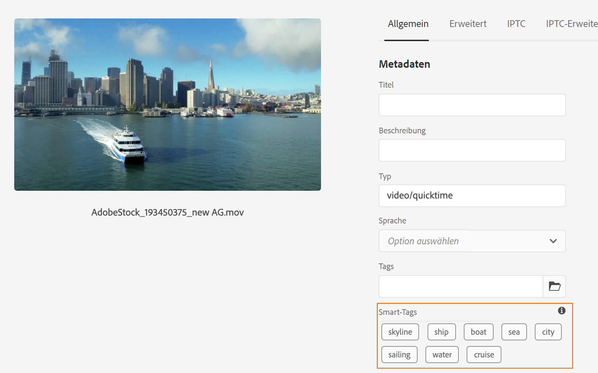
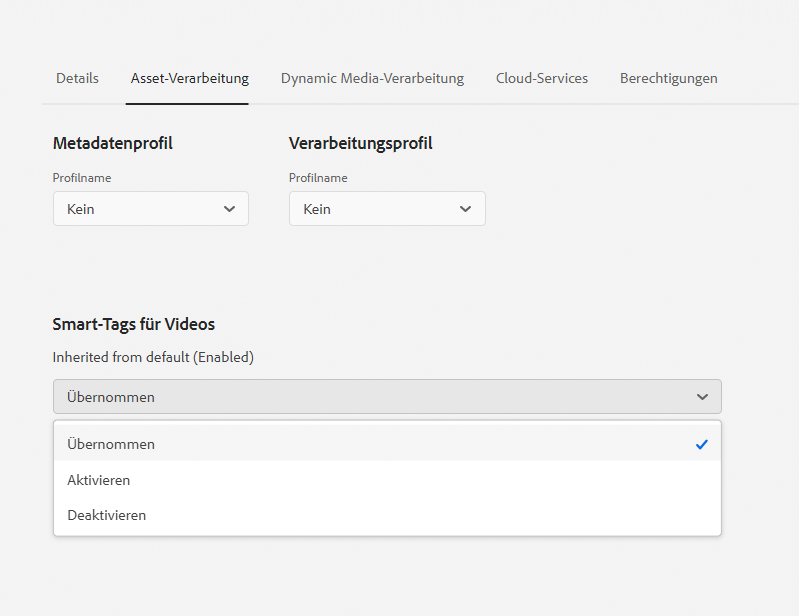

# Smart-Tags für Video-Assets {#video-smart-tags}

| [Best Practices für die Suche](/help/assets/search-best-practices.md) | [Best Practices für Metadaten](/help/assets/metadata-best-practices.md) | [Content Hub](/help/assets/product-overview.md) | [Dynamic Media mit OpenAPI-Funktionen](/help/assets/dynamic-media-open-apis-overview.md) | [Entwicklerdokumentation zu AEM Assets](https://developer.adobe.com/experience-cloud/experience-manager-apis/) |
| ------------- | --------------------------- |---------|----|-----|

Der wachsende Bedarf an neuen Inhalten verlangt nach einem geringeren manuellen Aufwand, um in kürzester Zeit überzeugende digitale Erlebnisse bereitzustellen. [!DNL Adobe Experience Manager] as a [!DNL Cloud Service] unterstützt das automatische Tagging von Video-Assets mit künstlicher Intelligenz. Das manuelle Tagging von Videos kann sich zeitaufwendig gestalten. Die [!DNL Adobe Sensei]-basierte Funktion für das Tagging von Videos mit Smart-Tags verwendet jedoch Modelle für künstliche Intelligenz, um Video-Content zu analysieren und den Video-Assets Tags hinzuzufügen. Dadurch wird der Zeitaufwand für DAM-Anwender bei der Bereitstellung vielfältiger Erlebnisse verringert. Der Service für maschinelles Lernen von Adobe generiert zwei Tags für ein Video. Ein Satz entspricht Objekten, Szenen und Attributen in diesem Video. Der andere Satz hingegen bezieht sich auf Aktionen wie Trinken, Laufen und Joggen.

Video-Tagging ist standardmäßig in [!DNL Adobe Experience Manager] as a [!DNL Cloud Service] aktiviert. Sie können jedoch [Smart-Tags für Videos für einen Ordner deaktivieren](#opt-out-video-smart-tagging). Videos werden beim Hochladen oder erneuten Verarbeiten automatisch mit Tags versehen. [!DNL Experience Manager] erstellt außerdem die Miniaturen und extrahiert Metadaten der Videodateien. Die Smart-Tags werden in absteigender Reihenfolge ihres [Konfidenzwerts](#confidence-score-video-tag) in den Asset-[!UICONTROL Eigenschaften] angezeigt.

## Taggen von Videos mit Smart-Tags beim Hochladen {#smart-tag-assets-on-ingestion}

Wenn Sie [Video-Assets in [!DNL Adobe Experience Manager] as a [!DNL Cloud Service] hochladen](add-assets.md#upload-assets), werden die Videos verarbeitet. Sobald die Verarbeitung abgeschlossen ist, finden Sie weitere Informationen auf der Registerkarte [!UICONTROL Allgemein] auf der Seite [!UICONTROL Asset-Eigenschaften]. Smart-Tags werden unter [!UICONTROL Smart-Tags] automatisch zum Video hinzugefügt. Asset Microservices verwendet [!DNL Adobe Sensei], um diese Smart-Tags zu erstellen.



Die angewendeten Smart-Tags werden in absteigender Reihenfolge nach [Konfidenzwert](#confidence-score-video-tag) sortiert und nach Objekt- und Aktions-Tag innerhalb von [!UICONTROL Smart-Tags] kombiniert.

>[!IMPORTANT]
>
>Sie sollten diese automatisch generierten Tags überprüfen, um sicherzustellen, dass sie Ihrer Marke und ihren Werten entsprechen.

## Taggen vorhandener Videos in DAM mit Smart-Tags {#smart-tag-existing-videos}

Die bereits vorhandenen Video-Assets in DAM werden nicht automatisch mit Smart-Tags versehen. Sie müssen per manuellen Vorgang die [!UICONTROL Assets erneut verarbeiten], um Smart-Tags für sie zu generieren.

Gehen Sie wie folgt vor, um Video-Assets oder Ordner (einschließlich Unterordner) mit Assets, die bereits im Assets-Repository vorhanden sind, mit Smart-Tags zu versehen:

1. Klicken oder tippen Sie auf das [!DNL Adobe Experience Manager]-Logo und wählen Sie dann Assets auf der [!UICONTROL Navigationsseite] aus.

1. Klicken oder tippen Sie auf [!UICONTROL Dateien], um die Oberfläche für Assets anzuzeigen.

1. Navigieren Sie zu dem Ordner, auf den Sie Smart-Tags anwenden möchten.

1. Wählen Sie den gesamten Ordner oder nur bestimmte Video-Assets aus.

1. Klicken oder tippen Sie auf das Symbol  [!UICONTROL Assets erneut verarbeiten] und wählen Sie die Option [!UICONTROL Vollständiger Prozess] aus.

<!-- TBD: Limit size -->


Nach Abschluss des Vorgangs navigieren Sie zur Seite [!UICONTROL Eigenschaften] eines Video-Assets im Ordner. Die automatisch hinzugefügten Tags werden auf der Registerkarte [!UICONTROL Allgemein] im Abschnitt [!UICONTROL Smart-Tags] angezeigt. Diese angewendeten Smart-Tags werden in absteigender Reihenfolge nach [Konfidenzwert](#confidence-score-video-tag) sortiert.

## Suchen nach getaggten Videos {#search-smart-tagged-videos}

Verwenden Sie [OmniSearch](search-assets.md#search-assets-in-aem), um nach Video-Assets basierend auf den automatisch generierten Smart-Tags zu suchen:

1. Wählen Sie das Suchsymbol , um das OmniSearch-Suchfeld anzuzeigen.

1. Geben Sie im Feld „OmniSearch“ein Tag an, das Sie einem Video nicht explizit hinzugefügt haben.

1. Führen Sie eine Suche anhand des Tags durch.

Die Suchergebnisse zeigen die Video-Assets basierend auf dem von Ihnen angegebenen Tag an.

Bei Ihren Suchergebnissen handelt es sich um eine Kombination aus Video-Assets mit gesuchten Keywords in den Metadaten und den Video-Assets, die mit den gesuchten Keywords mit Smart-Tags gekennzeichnet sind. Allerdings werden die Suchergebnisse, die in Metadatenfeldern alle Suchbegriffe aufweisen, zuerst angezeigt. Danach folgen die Suchergebnisse, die einem oder mehr Keywords in den Smart-Tags entsprechen. Weitere Informationen finden Sie unter [Grundlegendes zu [!DNL Experience Manager] -Suchergebnissen mit Smart-Tags](smart-tags.md#understand-search).

## Moderieren von Video-Smart-Tags {#moderate-video-smart-tags}

[!DNL Adobe Experience Manager] ermöglicht es Ihnen, Smart-Tags zu folgenden Zwecken zu kuratieren:

* Entfernen fehlerhafter Tags, die Ihren Markenvideos zugewiesen wurden.

* Verfeinern Tag-basierter Suche nach Videos, indem Sie sicherstellen, dass Ihr Video in den Suchergebnissen für die relevantesten Tags erscheinen. So vermeiden Sie, dass irrelevante Videos unter den Suchergebnissen erscheinen.

* Zuweisen eines höheren Rangs zu einem Tag, um seine Relevanz in Bezug auf ein Video zu erhöhen. Je höher der Rang eines Tags für ein Video, desto wahrscheinlicher ist bei einer Tag-basierten Suche die Aufnahme des Videos in die Suchergebnisse.

Weitere Information zur Moderation von Smart-Tags für Assets finden Sie unter [Verwalten von Smart-Tags](smart-tags.md#manage-smart-tags-and-searches).


>[!NOTE]
>
>Sämtliche Tags, die mithilfe der unter [Verwalten von Smart-Tags](smart-tags.md#manage-smart-tags-and-searches) aufgeführten Schritte moderiert werden, werden bei Neuverarbeitung eines Assets nicht gespeichert. Stattdessen werden wieder die ursprünglichen Tags angezeigt.

## Deaktivieren von Video-Smart-Tags {#opt-out-video-smart-tagging}

Da das automatische Tagging von Videos parallel zu anderen Asset-Verarbeitungsaufgaben wie der Erstellung von Miniaturen und der Extraktion von Metadaten abläuft, kann es sich zeitaufwendig gestalten. Um die Asset-Verarbeitung zu beschleunigen, können Sie das Tagging von Videos mit Smart-Tags beim Hochladen auf Ordnerebene deaktivieren.

Gehen Sie folgendermaßen vor, um die automatische Generierung von Video-Smart-Tags für Assets zu deaktivieren, die in einen bestimmten Ordner hochgeladen werden:

1. Wechseln Sie zur Registerkarte [!UICONTROL Asset-Verarbeitung] im Ordner [!UICONTROL Eigenschaften].

1. Im Menü [!UICONTROL Smart-Tags für Videos] ist standardmäßig die Option [!UICONTROL Übernommen] ausgewählt und Video-Smart-Tags sind aktiviert.

   Wenn die Option [!UICONTROL Übernommen] ausgewählt ist, wird auch der Pfad des übernommenen Ordners angezeigt, zusammen mit der Information, ob die Option auf oder [!UICONTROL Aktiviert] oder [!UICONTROL Deaktiviert] festgelegt ist.

   

1. Wählen Sie [!UICONTROL Deaktivieren] aus, um das Tagging von Videos mit Smart-Tags beim Hochladen zu deaktivieren.

>[!IMPORTANT]
>
>Wenn Sie die Option zum Tagging von Videos für einen Ordner zum Zeitpunkt des Uploads deaktiviert haben und den Videos nach dem Upload Smart-Tags hinzufügen möchten, dann wählen Sie die Option **[!UICONTROL Smart-Tags für Videos aktivieren]** auf der Registerkarte [!UICONTROL Asset-Verarbeitung] des Ordners [!UICONTROL Eigenschaften] aus und verwenden Sie die Option [[!UICONTROL Assets erneut verarbeiten]](#smart-tag-existing-videos), um Smart-Tags zu Videos hinzuzufügen.

## Konfidenzwert {#confidence-score-video-tag}

[!DNL Adobe Experience Manager] wendet einen minimalen Vertrauensschwellenwert auf Objekt- und Aktions-Smart-Tags an, um zu vermeiden, dass zu viele Tags für jedes Video-Asset vorhanden sind, was die Indizierung verlangsamt. Ihre Asset-Suchergebnisse werden auf der Grundlage der Konfidenzwerte eingestuft, die im Allgemeinen die Suchergebnisse über das hinaus verbessern, was eine Überprüfung der zugewiesenen Tags eines bestimmten Video-Assets nahelegt. Fehlerhafte Tags weisen oft geringe Konfidenzwerte auf. Entsprechend erscheinen sie selten oben in der Liste der Smart-Tags für Assets.

Der standardmäßige Schwellenwert für Aktions- und Objekt-Tags in [!DNL Adobe Experience Manager] ist 0,7 (der Wert sollte zwischen 0 und 1 liegen). Wenn einige Video-Assets nicht mit einem bestimmten Tag versehen sind, bedeutet dies, dass der Algorithmus weniger als 70 % Vertrauen in die prognostizierten Tags hat. Der standardmäßige Schwellenwert empfiehlt sich möglicherweise nicht immer für alle Anwender. Daher können Sie den Konfidenzwert in der OSGi-Konfiguration ändern.

Gehen Sie folgendermaßen vor, um den Konfidenzwert für die OSGi-Konfiguration dem Projekt hinzuzufügen, das für [!DNL Adobe Experience Manager] as a [!DNL Cloud Service] durch [!DNL Cloud Manager] bereitgestellt wird:

* Im [!DNL Adobe Experience Manager]-Projekt (`ui.config` ab Archetyp 24, bzw. zuvor `ui.apps`) umfasst die OSGi-Konfiguration `config.author` eine Konfigurationsdatei namens `com.adobe.cq.assetcompute.impl.senseisdk.SenseiSdkImpl.cfg.json` mit den folgenden Inhalten:

```json
{
  "minVideoActionConfidenceScore":0.5,
  "minVideoObjectConfidenceScore":0.5,
}
```

>[!NOTE]
>
>Manuellen Tags muss ein Vertrauen von 100 % (max. Vertrauen) zugewiesen werden. Wenn es also Video-Assets mit manuellen Tags gibt, die zur Suchanfrage passen, werden diese vor den Smart Tags angezeigt, die der Suchanfrage entsprechen.

## Beschränkungen {#video-smart-tagging-limitations}

* Es gibt keine Möglichkeit, den Smart-Tagging-Service mit bestimmten Videos zu trainieren. Er funktioniert mit den Standardeinstellungen von [!DNL Adobe Sensei].

* Der Tagging-Fortschritt wird nicht angezeigt.

* Nur Videos mit einer Dateigröße von weniger als 300 MB werden automatisch mit Tags versehen. Der [!DNL Adobe Sensei]-Service überspringt Videodateien, die größer sind.

* Nur Videos in den unter [Smart Tags](/help/assets/smart-tags.md#smart-tags-supported-file-formats) aufgeführten Dateiformaten und unterstützten Codecs werden mit Tags versehen.

**Siehe auch**

* [Assets übersetzen](translate-assets.md)
* [Assets-HTTP-API](mac-api-assets.md)
* [Von AEM Assets unterstützte Dateiformate](file-format-support.md)
* [Suchen von Assets](search-assets.md)
* [Connected Assets](use-assets-across-connected-assets-instances.md)
* [Asset-Berichte](asset-reports.md)
* [Metadatenschemata](metadata-schemas.md)
* [Herunterladen von Assets](download-assets-from-aem.md)
* [Verwalten von Metadaten](manage-metadata.md)
* [Suchfacetten](search-facets.md)
* [Verwalten von Sammlungen](manage-collections.md)
* [Massenimport von Metadaten](metadata-import-export.md)
* [Veröffentlichen von Assets in AEM und Dynamic Media](/help/assets/publish-assets-to-aem-and-dm.md)

>[!MORELIKETHIS]
>
>* [Verwalten von Smart-Tags und Asset-Suchvorgängen](smart-tags.md#manage-smart-tags-and-searches)
>* [Trainieren des Smart-Tag-Service und Tagging von Bildern](smart-tags.md)
