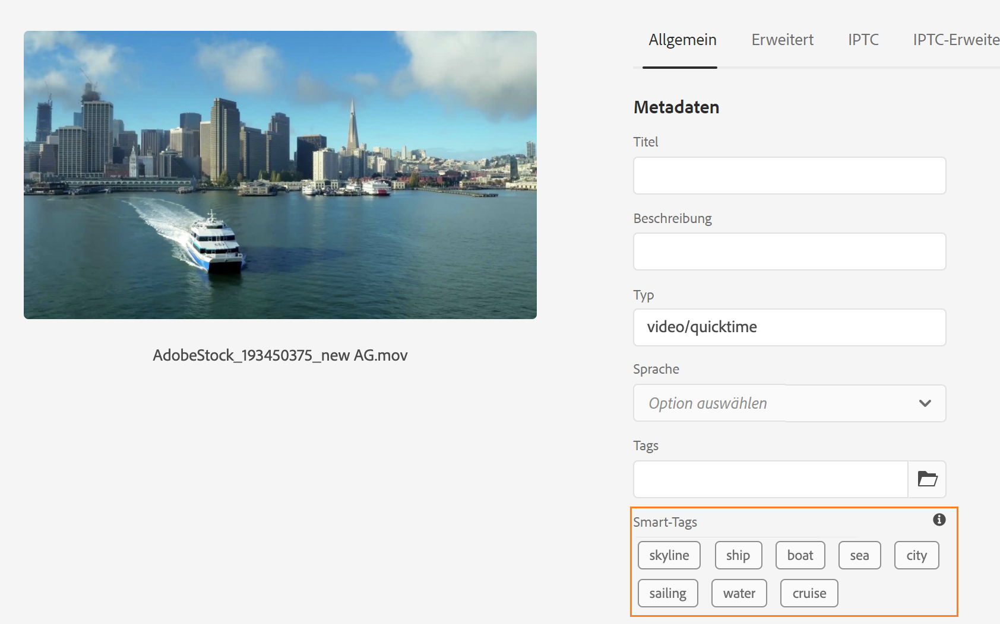
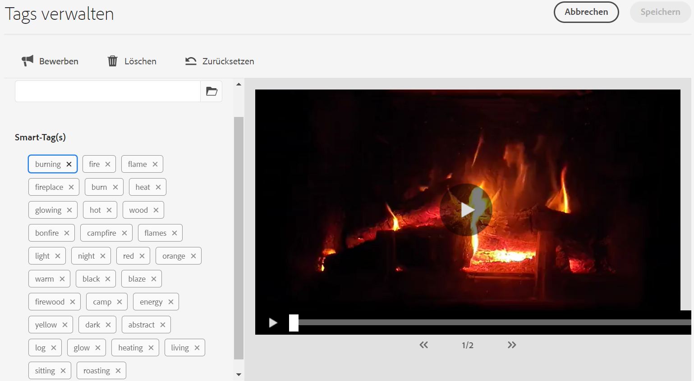

# Smart-Tags für AEM Assets {#using-smart-tags}

Unternehmen verfügen über zahlreiche digitale Assets, und diese Zahl wächst weiter rapide. Die Suche nach einem bestimmten Asset inmitten einer so großen Datenmenge stellt eine erhebliche Herausforderung dar. Um diesem Problem zu begegnen, werden `metadata` und `tags` eingesetzt, um die Durchsuchbarkeit digitaler Assets zu verbessern. Unternehmen verwenden taxonomiegesteuerte Vokabulare in Asset-Metadaten. Diese bestehen in der Regel aus Keyword-Listen, die Mitarbeitende, Partner und Kundschaft häufig verwenden, um auf digitale Assets zu verweisen und sie zu finden.

Smart-Tags sind Keywords, die nicht nur im Text vorkommen, sondern das Asset auch am besten beschreiben. Das Tagging von Assets mit einem taxonomiegesteuerten Vokabular stellt sicher, dass sie einfach identifiziert und in Suchvorgängen abgerufen werden können.

Zum Beispiel sind Wörter, die alphabetisch in einem Wörterbuch angeordnet sind, leichter zu finden als zufällig verstreute. Das Tagging erfüllt einen ähnlichen Zweck. Es organisiert Assets nach Unternehmenstaxonomien und stellt sicher, dass die relevantesten Assets in den Suchergebnissen angezeigt werden. So könnte beispielsweise ein Automobilhersteller Bilder von Autos mit Tags der Modellnamen versehen, sodass beim Erstellen einer Werbekampagne nur relevante Bilder angezeigt werden. Unabhängig davon, ob Sie „Läufer“ oder „Laufschuhe“ mit Tags versehen, brauchen sich die Benutzenden keine Sorgen über Tippfehler, Rechtschreibvarianten oder alternative Suchbegriffe zu machen – Smart-Tags erkennen sie alle.

Im Hintergrund verwendet die Funktion das KI-Framework von [Adobe Sensei](https://business.adobe.com/de/ai/adobe-genai.html), das automatisch – und standardmäßig – Smart-Tags auf hochgeladene Assets anwendet, zusammen mit Text, der an die Unternehmenstaxonomie angepasst ist.

## Voraussetzungen und Annahmen {#smart-tags-prereqs-config}

Smart-Tags werden automatisch für [!DNL Adobe Experience Manager] as a [!DNL Cloud Service] bereitgestellt, sodass keine Konfiguration erforderlich ist.

## Smart-Tags-Workflow {#smart-tags-workflow}

Die auf [!DNL Adobe Sensei] basierende Funktion für das Versehen mit Smart-Tags verwendet Modelle für künstliche Intelligenz, um Inhalte zu analysieren und Tags zu den Assets hinzuzufügen. Dadurch verringert sich der Zeitaufwand für Benutzerinnen und Benutzer von DAM bei der Bereitstellung vielfältiger Erlebnisse. Die Smart-Tags werden in absteigender Reihenfolge ihres [Konfidenzwerts](#confidence-score) in den Asset-Eigenschaften angezeigt.

* **Bildbasierte Assets**
Für Bilder basieren die Smart-Tags auf bestimmten visuellen Aspekten. Bilder in vielen Formaten werden mithilfe von intelligenten Content-Diensten mit Tags versehen. Smart-Tags werden auf die [unterstützten Dateitypen](#supported-file-formats) angewendet, die Ausgabedarstellungen im JPG- und PNG-Format generieren.

  <!-- -->

* **Videobasierte Assets**
Bei videobasierten Assets ist das Tagging in [!DNL Adobe Experience Manager] as a [!DNL Cloud Service] standardmäßig aktiviert. Ebenso wie für bild- und textbasierte Tags werden Videos automatisch mit Tags versehen, wenn Sie neue Videos hochladen oder vorhandene erneut verarbeiten. [!DNL Adobe Sensei] generiert zwei Sätze von Tags für ein Video: Ein Satz entspricht Objekten, Szenen und Attributen in diesem Video, während der andere Satz sich auf Aktionen wie Trinken, Laufen und Joggen bezieht. Siehe auch [Opt-out für intelligentes Video-Tagging](#opt-out-video-smart-tagging).

* **Textbasierte Assets**
Bei unterstützten Assets extrahiert [!DNL Experience Manager] bereits den Text, der dann indiziert und für die Suche nach den Assets verwendet wird. Smart-Tags, die auf Keywords im Text basieren, bieten jedoch eine dedizierte, strukturierte und höher priorisierte Suchfacette. Letzteres trägt dazu bei, die Asset-Erkennung im Vergleich zu einem Suchindex zu verbessern.
Bei textbasierten Assets hängt die Wirksamkeit von Smart-Tags nicht von der Menge des Textes im Asset ab, sondern von den relevanten Keywords oder Entitäten, die im Text des Assets vorhanden sind.

  

Smart-Tags werden in AEM Assets mithilfe des folgenden Workflows implementiert:

1. Erstellen Sie ein Asset in AEM oder laden Sie es hoch. Vorkonfigurierte Tags werden für Bild-, Video- und textbasierte Assets generiert.

1. Wenn Sie feststellen, dass bestimmte Tags nicht generiert werden, können Sie Ihre Tags vom Typ Bild entsprechend trainieren. Siehe [Smart-Tag-Training](#smart-tags-training.md).

## Unterstützte Dateiformate für Smart-Tags {#supported-file-formats}

| Bilder (MIME-Typen) | Textbasierte Assets (Dateiformate) | Video-Assets (Dateiformate und Codecs) |
|----|-----|------|
| image/jpeg | CSV | MP4 (H264/AVC) |
| image/tiff | DOC | MKV (H264/AVC) |
| image/png | DOCX | MOV (H264/AVC, Motion JPEG) |
| image/bmp | HTML | AVI (indeo4) |
| image/gif | PDF | FLV (H264/AVC, vp6f) |
| image/pjpeg | PPT | WMV (WMV2) |
| image/x-portable-anymap | PPTX |  |
| image/x-portable-bitmap | RTF |  |
| image/x-portable-graymap | SRT |  |
| image/x-portable-pixmap | TXT |  |
| image/x-rgb | VTT |  |
| image/x-xbitmap | |  |
| image/x-xpixmap | |  |
| image/x-icon |  |  |
| image/photoshop |  |  |
| image/x-photoshop |  |  |
| image/psd |  |  |
| image/vnd.adobe.photoshop |  |  |

## Vorbereiten eines Assets für vorkonfiguriertes Smart-Tagging

Wenn Sie [Assets in [!DNL Adobe Experience Manager] as a [!DNL Cloud Service] hochladen](add-assets.md#upload-assets), werden die hochgeladenen Assets verarbeitet. Sobald die Verarbeitung abgeschlossen ist, finden Sie weitere Informationen auf der Registerkarte [!UICONTROL Allgemein] auf der Seite [!UICONTROL Eigenschaften] des Assets. Smart-Tags werden automatisch unter [!UICONTROL Smart Tags] zum Video hinzugefügt. Asset Microservices verwendet [!DNL Adobe Sensei], um diese Smart-Tags zu erstellen.



<!--
The applied smart tags are sorted in descending order of [confidence score](#confidence-score), combined for object and action tags, within [!UICONTROL Smart Tags].
-->

>[!IMPORTANT]
>
>Sie sollten diese automatisch generierten Tags überprüfen, um sicherzustellen, dass sie Ihrer Marke und ihren Werten entsprechen.

## Assets ohne Tags in DAM {#smart-tag-existing-assets}

Die bereits vorhandenen oder älteren Assets in DAM werden nicht automatisch mit Smart-Tags versehen. Sie müssen per manuellen Vorgang die Assets [erneut verarbeiten](https://experienceleague.adobe.com/docs/experience-manager-cloud-service/content/assets/admin/about-image-video-profiles.html?lang=de#adjusting-load), um Smart-Tags für sie zu generieren. Sobald der Vorgang abgeschlossen ist, navigieren Sie zur Seite [!UICONTROL Eigenschaften] eines beliebigen Assets innerhalb des Ordners. Die automatisch hinzugefügten Tags werden im Abschnitt [!UICONTROL Smart-Tags] auf der Registerkarte [!UICONTROL Allgmein] angezeigt. Diese angewendeten Smart-Tags werden in absteigender Reihenfolge nach [Konfidenzwert](#confidence-score) sortiert.

<!--
To smart tag assets, or folders (including subfolders) of assets that exist in assets repository, follow these steps:

1. Select the [!DNL Adobe Experience Manager] logo and then select assets from the [!UICONTROL Navigation] page.

1. Select [!UICONTROL Files] to display the Assets interface.

1. Navigate to the folder to which you want to apply Smart Tags.

1. Select the assets and click  [!UICONTROL Reprocess Assets] icon and select the [!UICONTROL Full Process] option.

-->

## Konfidenzwert {#confidence-score}

Die Ergebnisse für Ihre Asset-Suche werden anhand der Konfidenzwerte sortiert, wodurch die Suchergebnisse in der Regel besser sind, als es die zugewiesenen Tags eines Assets vermuten lassen. Fehlerhafte Tags weisen oft geringe Konfidenzwerte auf. Entsprechend erscheinen sie selten oben in der Liste der Smart-Tags für Assets.
<!--
[!DNL Adobe Experience Manager] as a [!DNL Cloud Service] applies a minimum confidence threshold for object and action-smart tags to avoid having too many tags for each asset, which slows down indexing. 

The default threshold for action and object tags in [!DNL Adobe Experience Manager] for an image is 0.5 and for video it is 0.7 (should be value from 0 through 1). If some assets are not tagged by a specific tag, then it indicates that the algorithm is less than 70% confident in the predicted tags. The default threshold might not always be optimal for all the users. You can, therefore, change the confidence score value in OSGI configuration.

To add the confidence score OSGI configuration to the project deployed to [!DNL Adobe Experience Manager] as a [!DNL Cloud Service] through [!DNL Cloud Manager]:

In the [!DNL Adobe Experience Manager] project (`ui.config` since Archetype 24, or previously `ui.apps`) the `config.author` OSGi configuration, include a config file named `com.adobe.cq.assetcompute.impl.senseisdk.SenseiSdkImpl.cfg.json` with the following contents:

```json
{
  "minVideoActionConfidenceScore":0.5,
  "minVideoObjectConfidenceScore":0.5,
}
```
-->

>[!NOTE]
>
>Manuellen Tags wird ein Konfidenzwert von 100 % (maximale Konfidenz) zugewiesen. Wenn es also Assets mit manuellen Tags gibt, die der Suchanfrage entsprechen, werden diese vor den Smart Tags angezeigt, die der Suchanfrage entsprechen.

## Moderieren von Smart-Tags {#moderate-smart-tags}

[!DNL Adobe Experience Manager] as a [!DNL Cloud Service] ermöglicht es Ihnen, Smart-Tags zu folgenden Zwecken zu kuratieren:

* Entfernen fehlerhafter Tags, die Ihren Marken-Assets zugewiesen wurden.

* Verfeinern Tag-basierter Suchen nach Assets, indem sichergestellt wird, dass Ihr Asset in den Suchergebnissen für die relevantesten Tags erscheint. So vermeiden Sie, dass irrelevante Assets in den Suchergebnissen erscheinen.

* Zuweisen eines höheren Rangs zu einem Tag, um seine Relevanz in Bezug auf ein Asset zu erhöhen. Je höher der Rang eines Tags für ein Asset, desto wahrscheinlicher ist es, dass dieses Asset in den Suchergebnissen angezeigt wird, wenn eine Suche anhand dieses Tags durchgeführt wird.

Weitere Information zur Moderation von Smart-Tags für Assets finden Sie unter [Verwalten von Smart-Tags](smart-tags.md#manage-smart-tags-and-searches).



>[!NOTE]
>
>Sämtliche Tags, die mithilfe der unter [Verwalten von Smart-Tags](smart-tags.md#manage-smart-tags-and-searches) aufgeführten Schritte moderiert werden, werden bei der erneuten Verarbeitung eines Assets nicht gespeichert. Stattdessen werden wieder die ursprünglichen Tags angezeigt.

## Verwalten von Smart-Tags und Asset-Suchvorgängen {#manage-smart-tags-and-searches}

Sie können Smart-Tags kuratieren, um ungenaue Tags zu entfernen, die möglicherweise Ihren Marken-Assets zugewiesen wurden, sodass nur die relevantesten Tags angezeigt werden.

Mithilfe der Moderation von Smart-Tags können Sie Tag-basierte Suchen nach Assets verfeinern, indem Sie sicherstellen, dass Ihr Asset nur in den Suchergebnissen für die relevantesten Tags angezeigt wird. Im Grunde wird so ausgeschlossen, dass in den Suchergebnissen irrelevante Assets angezeigt werden.

Sie können einem Tag auch einen höheren Rang zuweisen, um die Relevanz des Tags für das Asset zu erhöhen. Je höher der Rang eines Tags für ein Asset desto wahrscheinlicher ist bei einer Tag-basierten Suche die Aufnahme des Assets in die Suchergebnisse.

So moderieren Sie die Smart-Tags Ihrer digitalen Assets:

1. Suchen Sie im Suchfeld nach digitalen Assets, die auf einem Tag basieren.

1. Prüfen Sie die Suchergebnisse, um die digitalen Assets zu identifizieren, die für Ihre Suche nicht relevant sind.

1. Wählen Sie ein Asset aus, und wählen Sie dann in der Symbolleiste  aus.

1. Prüfen Sie die Tags auf der Seite **[!UICONTROL Tags verwalten]**. Wenn Sie ein spezifisches Tag für ein Asset ausschließen möchten, wählen Sie das Tag und anschießend in der Symbolleiste  aus. Alternativ können Sie  neben dem Label auswählen.

1. Um einem Tag einen höheren Rang zuzuweisen, wählen Sie das Tag und anschließend in der Symbolleiste  aus. Das höhergestufte Tag wird in den Abschnitt **[!UICONTROL Tags]** verschoben.

1. Wählen Sie **[!UICONTROL Speichern]** und dann **[!UICONTROL OK]** au, um das Dialogfeld [!UICONTROL Erfolg] zu schließen.

1. Gehen Sie zur Seite „[!UICONTROL Eigenschaften]“ des betreffenden Assets. Beachten Sie, dass das von Ihnen heraufgestufte Tag eine hohe Relevanz erhält und daher in den Suchergebnissen weiter oben angezeigt wird.

### Grundlegendes zu [!DNL Experience Manager]-Suchergebnissen mit Smart-Tags {#understand-search}

Standardmäßig kombiniert [!DNL Experience Manager] die Suchbegriffe mit einer `AND`- oder `OR`-Klausel, um einen der Suchbegriffe in den angewendeten Smart-Tags zu finden. Dieses Standardverhalten ändert sich durch die Verwendung von Smart-Tags nicht. Suchen Sie beispielsweise nach `woman running`. Assets, die in den Metadaten nur das Keyword `woman`oder `running` aufweisen, werden standardmäßig nicht in den Suchergebnissen angezeigt. Ein Asset, das über Smart-Tags mit `woman` oder `running` getaggt wurde, wird bei dieser Suchanfrage jedoch angezeigt. Die Suchergebnisse sind also eine Kombination aus

* Assets mit den Keywords `woman` und `running` in den Metadaten.

* Assets, die über Smart-Tags mit einem der Keywords getaggt wurden.

Die Suchergebnisse, die in Metadatenfeldern alle Suchbegriffe aufweisen, werden zuerst angezeigt. Danach folgen die Suchergebnisse, die einem oder mehr Suchbegriffen in den Smart-Tags entsprechen. Im obigen Beispiel werden die Suchergebnisse ungefähr in dieser Reihenfolge angezeigt:

1. Treffer von `woman running` in den verschiedenen Metadatenfeldern.
1. Treffer von `woman running` in den Smart-Tags.
1. Treffer von `woman` oder `running` in Smart-Tags.

## Deaktivieren von Smart-Tags {#opt-out-smart-tagging}

Da das automatische Tagging von Assets parallel zu anderen Asset-Verarbeitungsaufgaben wie der Erstellung von Miniaturen und der Extraktion von Metadaten abläuft, kann es sich zeitaufwändig gestalten. Um die Asset-Verarbeitung zu beschleunigen, können Sie das Tagging mit Smart-Tags beim Hochladen auf Ordnerebene deaktivieren. Gehen Sie folgendermaßen vor, um die automatische Generierung von Smart-Tags für Assets zu deaktivieren, die in einen bestimmten Ordner hochgeladen werden:

1. Öffnen Sie die Registerkarte [!UICONTROL Asset-Verarbeitung] im Ordner [!UICONTROL Eigenschaften].
1. Im Menü [!UICONTROL Smart-Tags für Videos] ist beispielsweise standardmäßig die Option [!UICONTROL Übernommen] ausgewählt und Video-Smart-Tags sind aktiviert.

   Wenn die Option [!UICONTROL Übernommen] ausgewählt ist, wird auch der Pfad des übernommenen Ordners angezeigt, zusammen mit der Information, ob die Option auf [!UICONTROL Aktiviert] oder [!UICONTROL Deaktiviert] festgelegt ist.

   

1. Wählen Sie [!UICONTROL Deaktivieren] aus, um das Tagging von Videos mit Smart-Tags beim Hochladen zu deaktivieren.

1. Ebenso können Sie Smart-Tags für [!UICONTROL Smart-Tags für Text], [!UICONTROL Smart-Tags für Bild] und [!UICONTROL Farb-Tags für Bilder] deaktivieren.

>[!IMPORTANT]
>
>Wenn Sie die Option Tagging-Funktion für einen Ordner zum Zeitpunkt des Hochladens deaktiviert haben und nach dem Hochladen Smart-Tags hinzufügen möchten, wählen Sie **[!UICONTROL Smart-Tags aktivieren]** auf der Registerkarte [!UICONTROL Asset-Verarbeitung] der [!UICONTROL Eigenschaften] des Ordners und verwenden Sie die Option [[!UICONTROL Assets erneut verarbeiten]](#smart-tag-existing-assets), um Smart-Tags zu den Assets hinzuzufügen.

<!--
## Benefits of Smart Tags to your assets {#benefits-of-smart-tags}

Following are the benefits of using Smart Tags in your AEM Assets:
*  Makes an asset searchable.
*  Smart Tags are generated automatically to your assets, thus, it minimizes your effort to perform tagging manually.
*  It allows the usage of the same vocabulary, tag structure, and taxonomy so that you need not to worry about tagging if by chance you miss tagging at first.
*  Whether you are tagging "runners" or "running" shoes, you do not need to worry about typos, wrong spellings, or alternative search terms as Smart Tags know it already!
*  Helps your assets to become organized and categorized.
-->

## Verbessern der Inhaltssuche mit KI-generierten Metadaten {#ai-smart-tags}

Anstatt dass Sie sich auf die manuelle Eingabe verlassen müssen, weist die KI digitalen Assets automatisch beschreibende Tags zu. Diese KI-generierten Tags verbessern die Metadatenqualität und erleichtern die Suche, Kategorisierung und Empfehlung von Assets. Dieser Ansatz verbessert nicht nur die Effizienz durch das Eliminieren des manuellen Taggings, sondern stellt auch die Konsistenz und Skalierbarkeit über große Mengen digitaler Inhalte hinweg sicher. Wenn das Asset beispielsweise ein Bild ist, kann die KI Objekte, Szenen, Emotionen oder sogar Markenlogos darin identifizieren und relevante Tags wie „Sonnenuntergang“, „Strand“, „Urlaub“ oder „Lächeln“ generieren. KI-generierte Inhalte können die Suche nach Assets verbessern, indem sie sowohl semantische als auch lexikalische Suchtechniken nutzen. Weitere Informationen finden Sie unter [Suchen von Assets](search-assets.md). <!--If the asset is a document, AI reads and interprets the text to assign meaningful keywords that summarize its content—such as "climate change," "policy," or "renewable energy.-->


### Wie werden KI-generierte Metadaten aktiviert? {#enable-ai-generated-metadata}

So aktivieren Sie KI-generierte Metadaten:

* Die mindestens erforderliche AEM-Release-Version ist `20626`.

* Sie müssen eine GenAI Rider-Vereinbarung unterzeichnen. Weitere Informationen erhalten Sie vom Adobe-Support.

  >[!IMPORTANT]
  >
  > Der KI-generierte Titel eines Assets wird nur dann auf der Asset-Karte angezeigt, wenn Sie den Asset-Titel nicht definiert haben. Ein von Ihnen angegebener Asset-Titel wird nicht überschrieben.

### Verwenden von KI-generierten Metadaten {#using-ai-generated-smart-tags}

<!--[!NOTE]
>
>The enhanced smart tags capability is available only for the newly uploaded assets.
-->

Um die erweiterte Smart-Tags-Funktion zu verwenden, führen Sie die folgenden Schritte aus:

1. Wechseln Sie in der [!DNL Experience Manager]-Benutzeroberfläche zum gewünschten Ordner und klicken Sie auf **[!UICONTROL Assets hinzufügen]**. <!--Alternatively, to update enhanced smart tags in an existing content, click **[!UICONTROL reprocess]**.--> Die kompatiblen Bilddateiformate sind `png`, `jpg`, `jpeg`, `psd`, `tiff`, `gif`, `webp`, `crw`, `cr2`, `3fr`, `nef`, `arw` und `bmp`.

1. Warten Sie, bis das neu hochgeladene Asset verarbeitet wurde. Navigieren Sie anschließend zu den Asset-Eigenschaften.

1. Navigieren Sie zur Registerkarte **[!UICONTROL KI-generiert]**. Wenn die [!DNL Experience Manager]-Version inkompatibel ist oder nicht aktualisiert wurde, ist diese Registerkarte nicht sichtbar. Die folgenden Felder sind vorhanden:

   * **[!UICONTROL Generierter Titel]:** Der Titel bietet eine klare und knappe Überschrift, die die Kernidee eines hochgeladenen Assets erfasst und es dadurch auf einen Blick leicht verständlich macht. Wenn Sie beim Hinzufügen eines Assets einen Titel angeben (in `dc:title`), wird dieser in der Ansicht zum Durchsuchen von Assets angezeigt. Wenn Sie das Feld leer lassen, wird automatisch ein von der KI generierter Titel zugewiesen.
   * **[!UICONTROL Generierte Beschreibung]:** Die Beschreibung bietet eine kurze, aber informative Zusammenfassung dessen, worum es bei dem Asset geht, und hilft Benutzenden und Suchmodulen, seine Relevanz schnell zu verstehen.
   * **[!UICONTROL Generierte Keywords]:** Die Keywords sind zielgerichtete Begriffe, die die Hauptthemen eines Assets darstellen und beim Tagging und Filtern von Inhalten helfen.

1. [Optional] Sie können zusätzliche Tags hinzufügen oder eigene erstellen, wenn Sie der Meinung sind, dass relevante Tags fehlen. Schreiben Sie dazu Ihre Tags in das Feld **[!UICONTROL Generierte Keywords]** und klicken Sie auf **[!UICONTROL Speichern]**.

## Einschränkungen und Best Practices im Zusammenhang mit Smart-Tags {#limitations-best-practices-smart-tags}

Diese Modelle können Tags nicht immer perfekt identifizieren. Bei der aktuellen Version der Smart-Tags gibt es folgende Einschränkungen:

* Subtile Unterschiede in Bildern können nicht erkannt werden. Beispiel: Hemden mit schlanker oder normaler Passform.
* Tags können nicht anhand von winzigen Mustern oder Teilen eines Bildes identifiziert werden. Beispiel: Logos auf Hemden.
* Die Tags, die nicht verarbeitet werden, beziehen sich auf:

   * Nicht visuelle, abstrakte Aspekte, wie beispielsweise das Jahr oder die Saison der Produktveröffentlichung, die Stimmung oder die Emotionen, die durch ein Bild hervorgerufen werden, sowie die subjektive Konnotation eines Videos.
   * Feine visuelle Unterschiede bei Produkten wie Hemden mit und ohne Kragen oder kleinen Produkt-Logos, die in Produkte eingebettet sind.

* Nur Videos mit einer Dateigröße von weniger als 300 MB werden automatisch mit Tags versehen. Der [!DNL Adobe Sensei]-Service überspringt Videodateien, die größer sind.
* Verwenden Sie die [!DNL Assets]-Suche (Volltextsuche), um nach Dateien mit Smart-Tags (normal oder erweitert) zu suchen. Es gibt kein separates Suchprädikat für Smart-Tags.
* Im Vergleich zu allgemeinen Tags sind die Assets, die entsprechend einer Unternehmenstaxonomie getaggt werden, durch Tag-basierte Suchen einfacher zu identifizieren und abzurufen.

## Häufig gestellte Fragen{#faq-smart-tags}

+++**Wie verbessern Smart-Tags das Sucherlebnis eines Assets?**

[!DNL Adobe] Sensei taggt die Assets automatisch, sobald Sie sie hochladen. Der automatisierte Prozess läuft am Backend so schnell, dass schon wenige Sekunden nach Abschluss des Hochladens Tags in Ihren Assets hinzugefügt werden.

+++

+++**Was passiert, wenn die Liste der Smart-Tags ungenau ist oder unerwünschte Tags anzeigt?**

Ein ungenaues oder unerwünschtes Tag kann aus der Liste entfernt werden. Als Autohändler haben Sie beispielsweise Interesse daran, das Tag „Beschädigt“ aus der Liste entfernen.

+++

+++**Wie können Assets mit denselben Tags priorisiert werden?**

Ja, Sie können Assets, die dieselben Tags enthalten, priorisieren. Sie können ein Tag in die Smart-Tags-Liste eines Assets hochstufen, um eine Priorisierung durchzuführen. Indem Sie ein Tag hochstufen, können Sie die Bilder, die in den Suchergebnissen für dieses bestimmte Tag erscheinen, priorisieren.

+++

+++**Ist die Anwendung von Smart-Tags auf einen bestimmten Ordner beschränkt?**

Smart-Tags sind konfigurierbar und können auf jeden Ordner in DAM angewendet werden.

+++

+++**Woher weiß ich, dass Tagging ein Training erfordert?**

Siehe [Bestimmen der Anforderungen an ein Smart-Tags-Training](#smart-tags-training.md#smart-tag-training-requirement).

+++

+++**Welche Dateiformate werden für das Tagging von Assets unterstützt?**

Weitere Informationen finden Sie unter [Unterstützte Dateiformate](#supported-file-formats).

+++

+++**In welcher Sprache werden Smart-Tags generiert?**

Smart-Tags werden nur in englischer Sprache generiert. Sie können in andere Sprachen übersetzt werden, indem das gesamte Asset einschließlich der Metadaten übersetzt wird.

+++

+++**Ich möchte das Smart-Tagging nicht mehr verwenden.**

Sie können [das Smart-Tagging deaktivieren](#opt-out-smart-tagging) wenn Sie dies beenden möchten.

+++
